<!--
 * @Author: mzmm403
 * @description: Where there is a will there is a way
-->

# LangChain.js

下面的教程是基于下面的版本的代码

```json
"langchain": "langchain@0.1.30",
```
而新版本做了分包改动，所以具体的api可能会有所变动
具体分包信息可见：https://github.com/langchain-ai/langchainjs/tree/main/libs

## 分包情况

### 核心包

这是 LangChain 的最底层接口。

| 包                    | 作用                                        |
| -------------------- | ----------------------------------------- |
| `@langchain/core`    | 核心抽象（Runnable、Retriever、Prompt、Message 等） |
| `@langchain/classic` | 旧 API 兼容层（Chain、Agent 老写法）                |


### 模型提供商

每个模型厂商一个包

| 包                         | 作用        |
| ------------------------- | --------- |
| `@langchain/openai`       | OpenAI    |
| `@langchain/anthropic`    | Claude    |
| `@langchain/ollama`       | Ollama    |
| `@langchain/google-genai` | Gemini    |
| `@langchain/mistralai`    | Mistral   |
| `@langchain/groq`         | Groq      |
| `@langchain/fireworks`    | Fireworks |
| `@langchain/cohere`       | Cohere    |


### 社区组件

最大的一个包

| 包                      | 作用     |
| ---------------------- | ------ |
| `@langchain/community` | 社区组件集合 |


里面包含：

- VectorStores
- DocumentLoaders
- Tools
- Retrievers

例如：
```js
@langchain/community/vectorstores/faiss
@langchain/community/vectorstores/hnswlib
@langchain/community/document_loaders/fs/pdf
```

### 总结
架构图

```bash
┌──────────────────────────────────────────────┐
│                Application Layer              │
│                                              │
│  Chat App / RAG / Agent / AI Tools / Workflow │
└──────────────────────────────────────────────┘
                        │
                        ▼
┌──────────────────────────────────────────────┐
│                LangChain API Layer            │
│                                              │
│  Chains / Runnables / Agents / Retrievers     │
│                                              │
│  主要包：                                     │
│  @langchain/core                              │
│  @langchain/classic                           │
└──────────────────────────────────────────────┘
                        │
                        ▼
┌──────────────────────────────────────────────┐
│                Model Provider Layer           │
│                                              │
│  不同大模型厂商适配                          │
│                                              │
│  @langchain/openai        (GPT)               │
│  @langchain/anthropic     (Claude)            │
│  @langchain/ollama        (Local LLM)         │
│  @langchain/google-genai  (Gemini)            │
│  @langchain/mistralai     (Mistral)           │
│  @langchain/groq          (Groq LPU)          │
│  @langchain/cohere        (Cohere)            │
│  @langchain/fireworks     (Fireworks AI)      │
└──────────────────────────────────────────────┘
                        │
                        ▼
┌──────────────────────────────────────────────┐
│              Community Integration Layer      │
│                                              │
│  社区实现组件                                 │
│                                              │
│  @langchain/community                         │
│                                              │
│  包含：                                       │
│  ├── VectorStores                             │
│  │     ├── Faiss                              │
│  │     ├── HNSWLib                            │
│  │     ├── Chroma                             │
│  │     ├── Pinecone                           │
│  │     ├── Milvus                             │
│  │     └── Weaviate                           │
│  │                                            │
│  ├── Document Loaders                         │
│  │     ├── PDF Loader                         │
│  │     ├── Web Loader                         │
│  │     ├── GitHub Loader                      │
│  │     └── Notion Loader                      │
│  │                                            │
│  ├── Retrievers                               │
│  │     ├── MultiQueryRetriever                │
│  │     ├── ContextualCompressionRetriever     │
│  │     ├── SelfQueryRetriever                 │
│  │     └── ParentDocumentRetriever            │
│  │                                            │
│  └── Tools                                    │
│        ├── Google Search                      │
│        ├── SerpAPI                            │
│        └── Calculator                         │
└──────────────────────────────────────────────┘
                        │
                        ▼
┌──────────────────────────────────────────────┐
│              Utility Layer                    │
│                                              │
│  LangChain 辅助模块                           │
│                                              │
│  @langchain/textsplitters                     │
│  @langchain/memory                            │
│  @langchain/storage                           │
│  @langchain/hub                               │
│  @langchain/experimental                      │
└──────────────────────────────────────────────┘
                        │
                        ▼
┌──────────────────────────────────────────────┐
│              Infrastructure Layer             │
│                                              │
│  实际运行的 AI 基础设施                        │
│                                              │
│  LLM                                         │
│  Embedding Models                            │
│  Vector Databases                            │
│  APIs                                        │
│                                              │
│  例如：                                       │
│  OpenAI / Ollama / Claude / Gemini           │
│  Pinecone / Milvus / Chroma / Faiss          │
└──────────────────────────────────────────────┘
```

import关系

```bash
@langchain/core
│
├── prompts
├── runnables
├── retrievers
├── messages
├── tools
└── vectorstores (接口)

@langchain/community
│
├── vectorstores
├── loaders
├── tools
└── retrievers

@langchain/provider packages
│
├── @langchain/openai
├── @langchain/anthropic
├── @langchain/ollama
├── @langchain/google-genai
└── ...

@langchain/util packages
│
├── @langchain/textsplitters
├── @langchain/memory
├── @langchain/storage
└── @langchain/hub
```


### 工具和扩展

| 包                          | 作用               |
| -------------------------- | ---------------- |
| `@langchain/textsplitters` | 文本切分             |
| `@langchain/langgraph`     | Agent 状态机框架      |
| `@langchain/langserve`     | 部署 LangChain API |
| `@langchain/hub`           | Prompt Hub       |
| `@langchain/memory`        | 记忆模块             |
| `@langchain/storage`       | 存储接口             |


### 实验和扩展

| 包                         | 作用   |
| ------------------------- | ---- |
| `@langchain/experimental` | 实验功能 |


## Deno和Jupyter Notebook

### Deno

#### 环境搭建

```bash
# 安装本地Deno环境
curl -fsSL https://deno.land/install.sh | sh
# 使用 deno 为 Jupyter Notebook 配置 kernel：
deno jupyter --unstable --install
# 通过运行以下命令，验证 kernel 是否配置完成：
deno jupyter --unstable
```

出现这样的字样即表示配置成功：

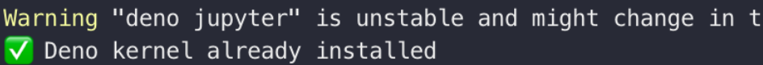

然后运行下面的命令，启动 Jupyter Notebook：

```bash
jupyter notebook
```

目前 deno kernel 的 Jupyter Notebook 不支持代码提示，所以写代码会难受一点，大家可以安装 vscode 插件，使用 vscode 去编辑和运行 notebook。

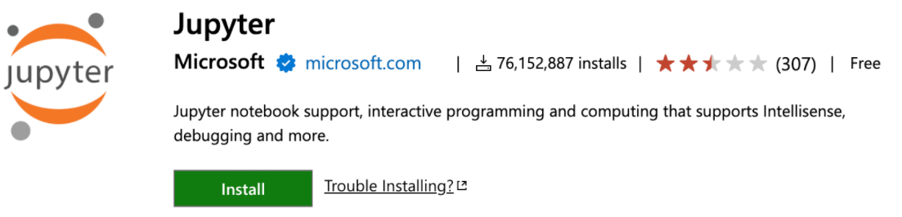

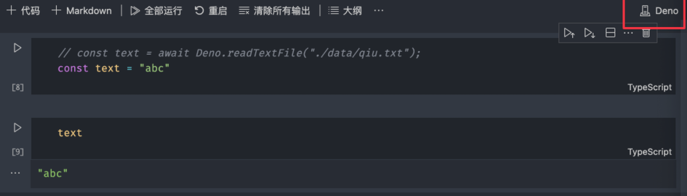

记得在右上角切换 Kernel 为 Deno

#### 依赖管理

Deno 直接从远程拉取依赖，自带缓存机制，而不需要本地安装，例如我们如果需要 lodash 库，我们不需要像 nodejs 一样使用 npm/yarn 等来安装依赖，而是可以直接从远程引入：

```ts
// 导入远程依赖
import _ from "npm:/lodash
// 锁定依赖版本
import _ from "npm:/lodash@4.17.21"

const a = _.random(0, 5);
a
```
也可以在项目中创建一个 `deno.json` 文件，在里面配置依赖的版本(和notebook 文件同级创建)：

```txt
- 1-test-notebook.ipynb
- deno.json
```

```json
{
  "imports": {
    "lodash": "npm:/lodash@4.17.21"
  },
  "deno.enable": true
}
```

将 ` "npm:/lodash@4.17.21"` 的别名设置为 `lodash`，其中`"deno.enable": true` 是如果你用了 deno 的 vscode 插件，可以让它识别到，并对 deno 在 vscode 体验的一些优化。将 ` "npm:/lodash@4.17.21"` 的别名设置为 `lodash`，其中`"deno.enable": true` 是如果你用了 deno 的 vscode 插件，可以让它识别到，并对 deno 在 vscode 体验的一些优化。

设置完以后就能在 notebook 中正常使用 lodash 了。
```ts
import _ from "lodash"

const a = _.random(0, 5);
a
```

注意，如果你更新了 `deno.json` 需要重启 notebook 的内核才能让 deno 拿到最新的别名：


### Jupyter Notebook

#### 环境搭建

因为涉及到本地python的多版本管理，因此我这里使用了miniconda来管理python环境，安装好后在终端运行：

```bash
# 创建虚拟环境
conda create -n testSpace python=3.9
# 激活虚拟环境
conda activate testSpace
# 安装jupyter notebook
pip install notebook
```

Jupyter Notebook 的核心是代码块，每个代码块作为一个整体去执行，并且可以多次反复执行。在代码快的左侧，是执行顺序的标记，指这个代码块被执行的顺序。

**注意**，如果上游数据发生了改变，下游并不会自动的更新或者重新运行,需要自己手动重新运行


## 获取OpenAI服务

### Azure OpenAI

Azure OpenAI 的优势是跟 OpenAI 同源，并且国内付款比较容易。

正常注册 microsoft 账号，并注册登录 azure [link](https://azure.microsoft.com/en-us/)。这里注册 azure 的时候，需要手机号验证码，国内正常 +86 手机即可。还需要一张信用卡，在不开启付费业务的情况下不会有支出。

进入 azure 首页后，搜索 OpenAI：

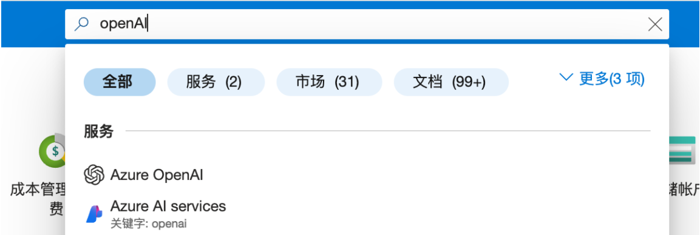

然后我们创建一个 Azure OpenAI 的服务：

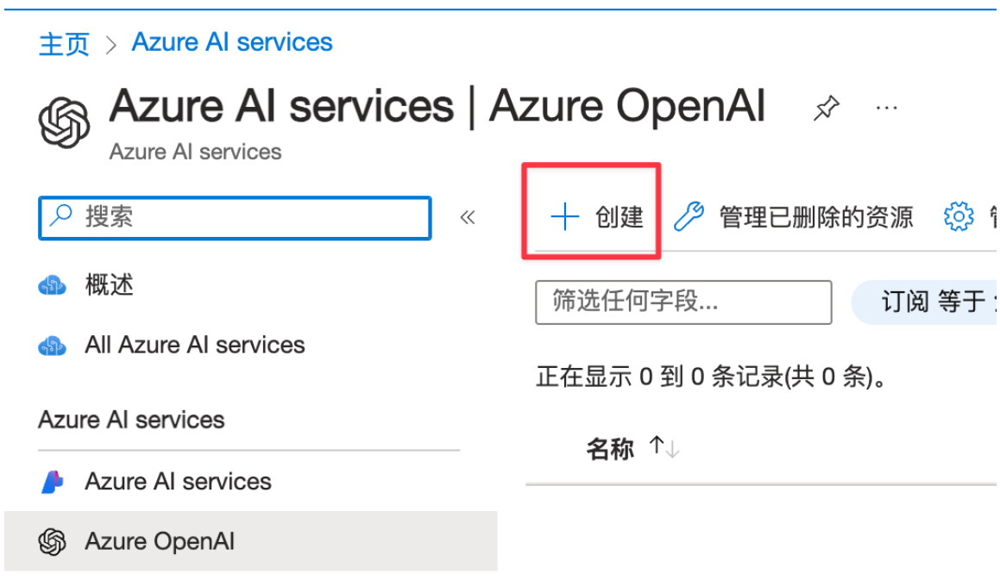

目前 OpenAI 的业务需要申请才能使用，第一次打开这个界面会提醒填写表单进行申请：

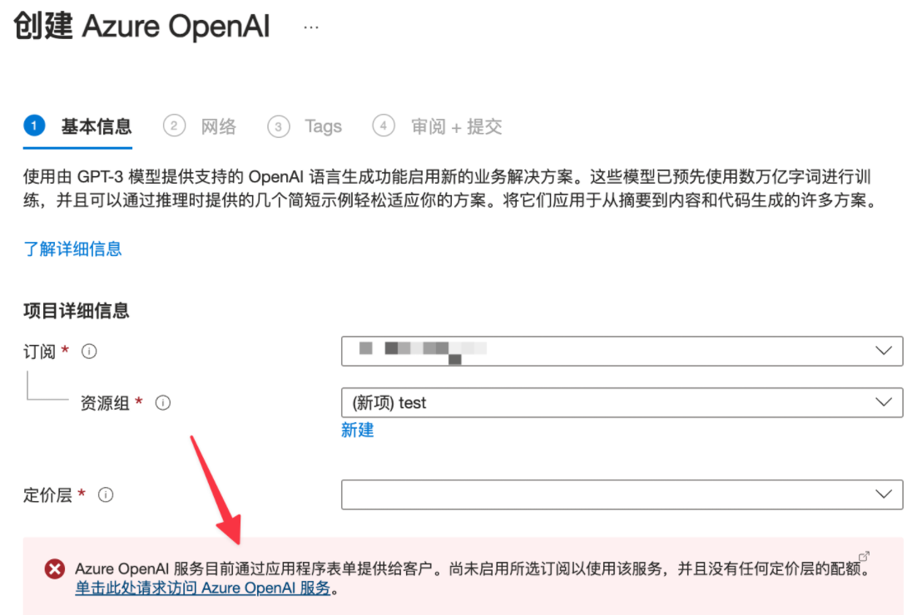

按照表单内容填写公司相关的信息即可，邮箱一定使用公司的邮箱，使用个人邮箱会被直接拒绝，一般需要等待几天即可。  
我们假设大家已经通过申请。

第一个 tab 基本信息，就按照其说明正常填写，这里需要注意两个点：

- 名称。这也会成为之后我们 openai 服务的 endpoint 的前缀
- 区域。因为每个区域的 GPU 数量是不一样的，所以提供的模型和算力限制都不一样，再考虑上延迟，一般选择日本区域比较好。一个账号可以在多个区域有服务，所以如果日本的 GPU 资源紧张，可以试试加拿大/澳大利亚等区域。每个区域新模型上线的节奏也不同，比如最新的 Vision 版本可能只有部分区域有，大家可以根据需要查询官方文档。

网络和 Tags 这两个 Tab 大家按需填写就行，一版不用做修改，然后创建资源即可。   


等待部署完成后，打开部署的服务，左上角打码部分就是你部署的名称，然后我们点击 模型部署 => 管理部署，跳转到 Azure OpenAI Studio 去管理模型。

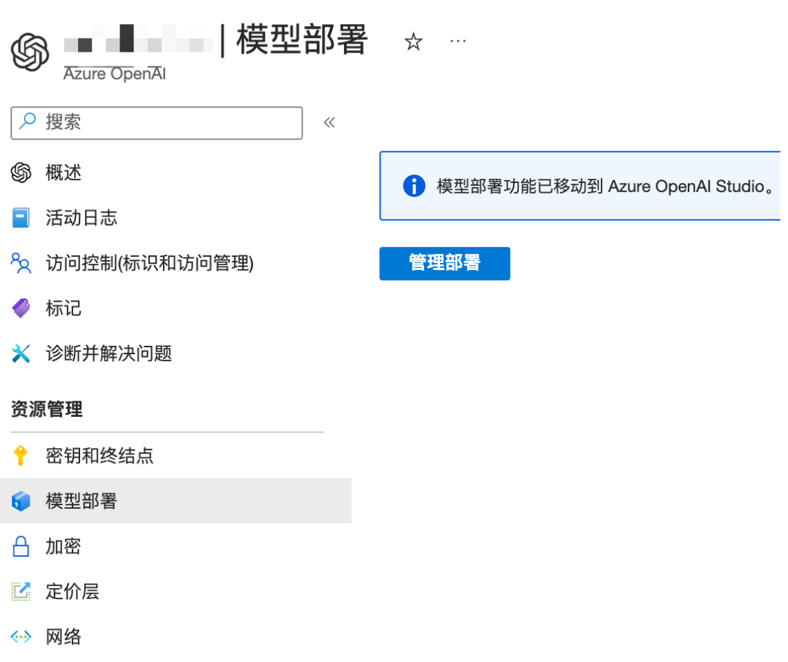

Azure OpenAI 与 OpenAI API 有些不同，在 Azure 中，你需要先创建一个模型的部署，然后才能在 API 中使用部署名称去调用对应的部署，我们先创建一个 gpt4 的模型：

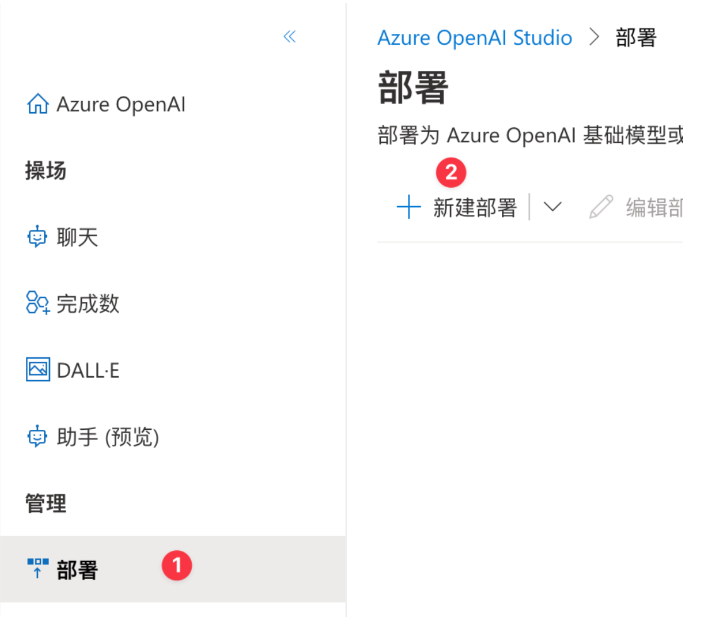

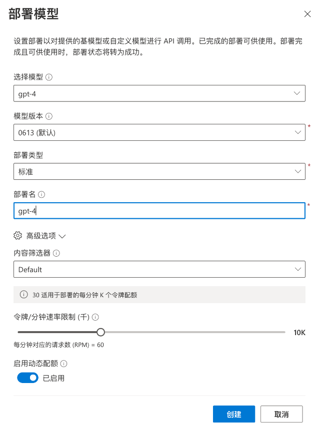

这里模型的版本根据你服务部署所在的区域有关，并且不同模型的 API 定价不同，你可以根据需要去创建特定的模型版本。

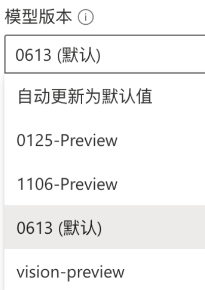

创建之后，你就可以在聊天界面去测试这个部署：

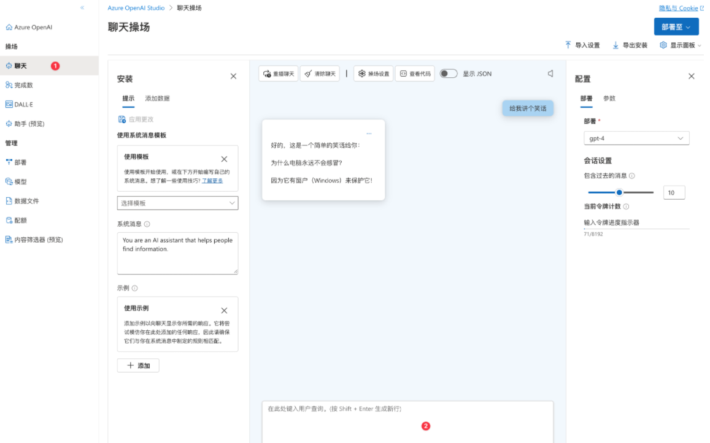

这个界面已提供了非常丰富的参数和 prompt 功能，可以直接用来调试模型的参数和 prompt。 


然后，我们看如何在 langchain 中通过设置环境变量使用 azure openAI，首先创建一个 `.env` 文件，**注意，一定要把 .env 文件加到 .gitignore 中，一定不能将此文件上传至任何公开平台**。

然后，设置其中的几个属性：

```env
AZURE_OPENAI_API_KEY=abc
AZURE_OPENAI_API_VERSION=abc
AZURE_OPENAI_API_DEPLOYMENT_NAME=abc
AZURE_OPENAI_API_INSTANCE_NAME=abc
AZURE_OPENAI_API_EMBEDDINGS_DEPLOYMENT_NAME=abc
```

- AZURE_OPENAI_API_KEY 是你部署的服务的 Key，可以在下图中的 密钥和终结点中找到。
- AZURE_OPENAI_API_VERSION 是使用的 API 版本.
- AZURE_OPENAI_API_DEPLOYMENT_NAME 是你部署的模型实例的名称，我们上面刚创建了一个 gpt4 的实例叫做 gpt-4。
- AZURE_OPENAI_API_INSTANCE_NAME 是你部署服务的名称，也就是下面截图左上角打码部分的名称。
- AZURE_OPENAI_API_EMBEDDINGS_DEPLOYMENT_NAME 是你用于 embedding 的模型实例名称。创建步骤跟创建 gpt4 模型的部署一致。

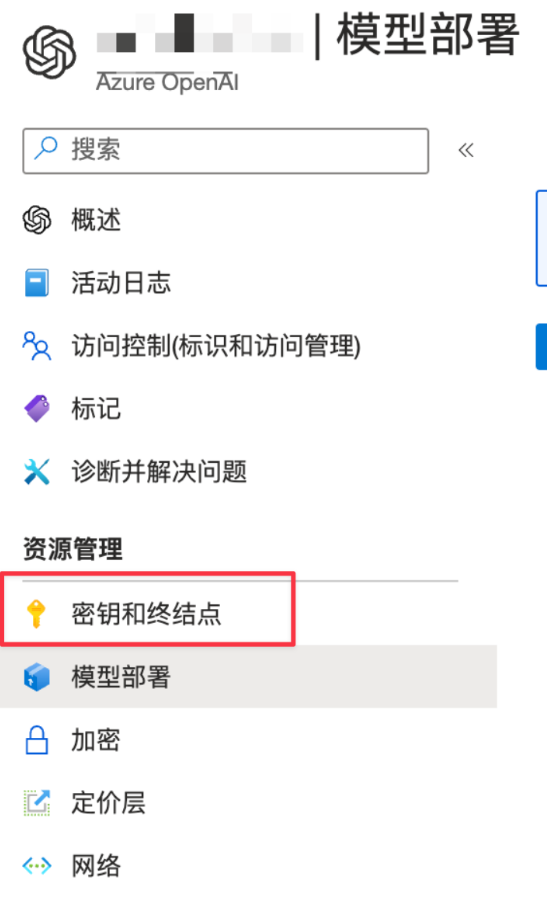

把这些环境变量设置好后，langchain 运行时会自动读取，所以我们创建 OpenAI 的服务时就可以直接：

```ts
import { ChatOpenAI } from "@langchain/openai";
import { OpenAIEmbeddings } from "@langchain/openai";

const chatModel = new ChatOpenAI();
const embeddings = new OpenAIEmbeddings()
```

### 第三方OpenAI服务

首先在`.env`文件中设置好key：

```env
OPENAI_API_KEY=abc
```

然后创建ChatOpenAI时，指定baseUrl

```ts
import { ChatOpenAI } from "@langchain/openai";
import { HumanMessage } from "@langchain/core/messages";


const chatModel = new ChatOpenAI({
    configuration: {
        baseURL: "xxx",
    }
});

await chatModel.invoke([
    new HumanMessage("Tell me a joke")
])
```

### 本地大模型

如果你是 win 平台，显卡显存大于 6G，mac 平台 M 系芯片 + 16G 内存基本就足够运行 7B 大小的模型。虽然推理速度较慢，但可以应付一些本地的测试。  

在 mac 平台下，我推荐用 [ollma](https://ollama.com/)，使用起来非常简单，下载好模型后，点开这个 app 后，就会自动在 http://localhost:11434 host 一个 llm 的服务。  
如果是 win 平台，可以尝试一下 [LM Studio](https://lmstudio.ai/)，其提供的模型更多，可玩性也更强一些。

然后，我们就可以在 langchian 中使用这些本地模型：

```ts
import { Ollama } from "@langchain/community/llms/ollama";

const ollama = new Ollama({
  baseUrl: "http://localhost:11434", 
  model: "llama2", 
});


const res = await ollama.invoke("讲个笑话")
```

### 加载环境变量

首先是在 nodejs 中，我们使用 `dotenv/config` 这个第三方库：

```bash
pnpm add dotenv/config
```
然后，在需要使用环境变量的 ts 文件中

```ts
import "dotenv/config";
```

即可，`.env` 中的环境变量就会被注入到 `process.env` 中。
在 Deno 中稍有不同，因为 langchain 是为 nodejs 设计，所以读取环境变量时会默认从 `process.env` 中进行读取

```ts
import { load } from "https://deno.land/std@0.223.0/dotenv/mod.ts";
const env = await load();

const process = {
    env
}
```
即，从 .env 文件加载出来所有的环境变量后，再自己创建一个全局的 `process.env` 方便 langchain 进行读取。


## LangChain快速入门

### LCEL

> LCEL（LangChain Expression Language） 是 langchain 无论是 python 还是 js 版本都在主推的设计。

LCEL的优势

LCEL 从底层设计的目标就是支持 从原型到生产 完整流程不需要修改任何代码，也就是我们在写的任何原型代码不需要太多的改变就能支持生产级别的各种特性（比如并行、steaming 等），具体来说会有这些优势：

- 并行，只要是整个 chain 中有可以并行的步骤就会自动的并行，来减少使用时的延迟。
- 自动的重试和 fallback。大部分 chain 的组成部分都有自动的重试（比如因为网络原因的失败）和回退机制，来解决很多请求的出错问题。 而不需要我们去写代码 cover 这些问题。
- 对 chain 中间结果的访问，在旧的写法中很难访问中间的结果，而 LCEL 中可以方便的通过访问中间结果来进行调试和记录。
- LCEL 会自动支持 LangSimith 进行可视化和记录。这是 langchain 官方推出的记录工具，可以记录一条 chian 运行过程中的大部分信息，来方便调试 LLM 找到是哪些中间环节的导致了最终结果较差。

一条 Chain 组成的每个模块都是继承自 `Runnable` 这个接口，而一条 Chain 也是继承自这个接口，所以一条 Chain 也可以很自然的成为另一个 Chain 的一个模块。并且所有 `Runnable` 都有相同的调用方式。 所以在我们写 Chain 的时候就可以自由组合多个 `Runnable` 的模块来形成复杂的 Chain

对于任意 `Runnable` 对象，其都会有这几个常用的标准的调用接口：

- `invoke`：基础的调用，并传入参数
- `batch`：批量调用，输入一组参数
- `stream` 调用，并以 stream 流的方式返回数据
- `streamLog` 除了像 stream 流一样返回数据，并会返回中间的运行结果

**注意下面的方法案例输出的结果都是对于ChatOpenAI整个对象的**

### invoke

首先，我们用最基础的 `ChatOpenAI`，这显然是一个 `Runnable` 对象，我们以此为例来让大家熟悉 LCEL 中 `Runnable` 中常见的调用接口。 其中 `HumanMessage` 你可以理解成构建一个用户输入，各种 `Message` 的介绍我们会在后续章节中展开介绍。 注意这里 `chatModel` 需要的输入是一个 `Message` 的列表。

```ts
import { ChatOpenAI } from "@langchain/openai";
import { HumanMessage } from "@langchain/core/messages";

const model = new ChatOpenAI();

await model.invoke([
    new HumanMessage("Tell me a joke")
])
```

这里，我们就完成了一个基础的对 `Runnable` 接口的调用，我们会拿到其对应的输出

```json
AIMessage {
  lc_serializable: true,
  lc_kwargs: {
    content: "Why don't scientists trust atoms?\n\nBecause they make up everything!",
    additional_kwargs: { function_call: undefined, tool_calls: undefined },
    response_metadata: {}
  },
  lc_namespace: [ "langchain_core", "messages" ],
  content: "Why don't scientists trust atoms?\n\nBecause they make up everything!",
  name: undefined,
  additional_kwargs: { function_call: undefined, tool_calls: undefined },
  response_metadata: {
    tokenUsage: { completionTokens: 13, promptTokens: 11, totalTokens: 24 },
    finish_reason: "stop"
  }
}
```

对于上面的结果，用户需要的是核心的回答内容，所以我们可以加入简单的 `StringOutputParser` 来处理输出

```ts
import { ChatOpenAI } from "@langchain/openai";
import { HumanMessage } from "@langchain/core/messages";
import { StringOutputParser } from "@langchain/core/output_parsers";

const chatModel = new ChatOpenAI();
const outputPrase = new StringOutputParser();

const simpleChain = chatModel.pipe(outputPrase)

await simpleChain.invoke([
    new HumanMessage("Tell me a joke")
])
```

得到的结果：

```txt
"Why don't scientists trust atoms?\n\nBecause they make up everything."
```

在 LCEL 中，使用 `.pipe()` 方法来组装多个 `Runnable` 对象形成完整的 Chain，可以看到我们是用对单个模块同样的 `invoke` 方法去调用整个 chain。 因为无论是单个模块还是由模块组装而成的多个 chain 都是 `Runnable`。

### batch

对这个基础的 Chain 进行批量调用，用起来也非常简单

```ts
await simpleChain.batch([
    [ new HumanMessage("Tell me a joke") ],
    [ new HumanMessage("Hi, Who are you?") ],
])
```

其返回值也是一个列表

```ts
[
  "Why don't scientists trust atoms?\n\nBecause they make up everything!",
  "Hello! I'm OpenAI, or more specifically an artificial intelligence programmed to help answer questio"... 89 more characters
]
```

### stream

因为 LLM 的很多调用都是一段一段的返回的，如果等到完整地内容再返回给用户，就会让用户等待比较久，影响用户的体验。而 LCEL 开箱就支持 steaming


```ts
const stream = await simpleChain.stream([
     new HumanMessage("Tell me a joke")
])

for await (const chunk of stream){
    console.log(chunk)
}
```

返回值为

```txt
Why
 don
't
 scientists
 trust
 atoms
?


Because
 they
 make
 up
 everything
!
```

### streamLog

streamLog 的使用较少，他会在每次返回 chunk 的时候，返回完整的对象

```ts
const stream = await simpleChain.streamLog([
     new HumanMessage("Tell me a joke")
])

for await (const chunk of stream){
    console.log(chunk)
}
```

### fallback

`withFallbacks` 是任何 runnable 都有的一个函数，可以给当前 runnable 对象添加 fallback 然后生成一个带 fallback 的  `RunnableWithFallbacks` 对象，这适合我们将自己的 fallback 逻辑增加到 LCEL 中。当主要模型调用失败或者返回不符合预期时，自动使用备用模型或备用策略生成结果。 


我们创建一个一定会失败的llm

```ts
import { ChatOpenAI } from "@langchain/openai";

const fakeLLM = new ChatOpenAI({
    azureOpenAIApiKey: "123",
    maxRetries: 0,
});

await fakeLLM.invoke("你好")
```

因为大多数 runnable 都自带出错重试的机制，所以我们在这将重试的次数 `maxRetries` 设置为 0。
然后我们创建一个可以成功的llm，并设置fallback

```ts
const realLLM = new ChatOpenAI()
const llmWithFallback = fakeLLM.withFallbacks({
    fallbacks: [realLLM]
})

await llmWithFallback.invoke("你好")
```

就会输出正确的结果。

因为无论是 llm model 或者其他的模块，还是整个 chain 都是 runnable 对象，所以我们可以给整个 LCEL 流程中的任意环节去增加 fallback，来避免一个环节出问题卡住剩下环境的运行。  

当然，我们也可以给整个 chain 增加 fallback，例如一个复杂但输出高质量的结果的 chain 可以设置一个非常简单的 chain 作为 fallback，可以在极端环境下保证至少有输出。

上面的例子可能不是太清楚，如下

```ts
import { OpenAI } from "@langchain/openai";
import { withFallbacks } from "@langchain/core";

const primary = new OpenAI({ temperature: 0.7 });
const fallback = new OpenAI({ modelName: "gpt-3.5-turbo", temperature: 0.7 });

const robustModel = withFallbacks(primary, [fallback]);

const res = await robustModel.invoke("讲一个笑话");
console.log(res);
```

当primary 调用失败时，就会自动使用 fallback模型，如果后面的 fallback 也失败了，就会一直重试到最后一个 fallback 成功为止。

## RAG的原理和流程

RAG(检索增强生成技术) 是 LLM 中最典型也是最流行的设计模式，其核心的流程 检索 => 增强 => 生成。

### LLM的局限性

问题1：llm 本身是基于从大量数据中训练出来的概率模型来一个个生成 token，也就是他并没有逻辑和事实基线，所以我们说 llm 的智能是涌现性的智能，是基于概率产生的“伪智能”，而不是底层基于逻辑和推理能力“真智能”。
问题2：第一种是对知识的更新慢，例如你问他最新的新闻他肯定是不知道的，因为他的训练数据集不可能每天更新；第二种是特定领域的知识不了解，例如你要创建一个宠物医疗 chat bot，他本身训练数据集这方面的知识占比肯定是少的，就很容易出现幻想问题，然后瞎回答。


### RAG的原理

尽可能提供与答案相关的上下文，来增llm正确输出的可能性

RAG 的基本流程就是：

1. 用户输入提问
2. 检索：根据用户提问对 向量数据库 进行相似性检测，查找与回答用户问题最相关的内容
3. 增强：根据检索的结果，生成 prompt。 一般都会涉及 “仅依赖下述信息源来回答问题” 这种限制 llm 参考信息源的语句，来减少幻想，让回答更加聚焦
4. 生成：将增强后的 prompt 传递给 llm，返回数据给用户

所以 RAG 就是哪里有问题解决哪里，既然大模型无法获得最新和内部的数据集，那我们就使用外挂的向量数据库为 llm 提供最新和内部的数据库。既然大模型有幻想问题，我们就将回答问题所需要的信息和知识编码到上下文中，强制大模型只参考这些内容进行回答。  

RAG 更底层的逻辑是，也是我们对待 llm 正确的态度：llm 是逻辑推理引擎，而不是信息引擎。所以，由外挂的向量数据库提供最有效的知识，然后由 llm 根据知识进行推理，提供有价值的回复。

### RAG的流程

1. **加载数据**

因为想要根据用户的提问进行语意检索，我们需要将数据集放到向量数据库中，所以我们需要将不同的数据源加载进来。这里就涉及到多种数据源，例如 pdf、code、现存数据库、云数据库等等。  

这里 langchain 提供非常丰富的集成工具，帮助我们加载来自多个数据源的数据。

2. **切分数据**

gpt3.5t 的上下文窗口是 16k，gpt4t 上下文窗口是 128k，而我们很多数据源都很容易比这个大。更何况，用户的提问经常涉及多个数据源，所以我们需要对数据集进行语意化的切分，根据内容的特点和目标大模型的特点、上下文窗口等，对数据源进行合适的切分。  

这里听起来比较容易，但考虑到数据源的多种多样和自然语言的特点，事实上切分函数的选择和参数的设定是非常难以控制的。理论上我们是希望每个文档块都是语意相关，并且相互独立的。

3. **嵌入**

下面举个例子来理解embedding

a. 把一篇 句子/文章 中的单词提前出来，就像放到一个袋子里一样，认为单词之间是独立的，并不关心词与词之间的上下文关系。  
b. 假设我们有十篇英语文章，那我们可以把每个文章拆分成单词，并且还原成最初的形势（例如 did、does => do），然后我们统计每个词出现的次数。 我们简化一下假设最后结果就是 

```txt
第一篇文章: 
apple: 10, phone:12

第二篇文章:
apple: 8, android: 10, phone: 18

第三篇文章:
banana: 6, juice: 10
```

c. 那我们尝试构建一个向量，也就是一个数组，每个位置有一个值，代表每个单词在这个文章中出现的次数

```txt
变量
[apple, banana, phone, android, juice]
```

那每篇文章，都能用一个变量来表示

```txt
第一篇文章: [10, 0, 12, 0, 0]
第二篇文章: [8, 0, 18, 10, 0]
第三篇文章: [0, 6, 0, 0, 10]
```
d. 这样我们就能把一篇文章用一个向量来表示了，然后我们可以用最简单的余弦定理去计算两个向量之间的夹角，以此确定两个向量的距离。
e. 这样，我们就有了通过向量和向量之间的余弦夹角的，来衡量文章之间相似度的能力。

以上是最简单的 embedding 原理，不过是所有的 embedding 和相似性搜索都是类似的原理。
回到我们 RAG 流程中，我们将切分后的每一个文档块使用 embedding 算法转换成一个向量，存储到向量数据库中（vector store）中。这样，每一个原始数据都有一个对应的向量，可以用来检索。

4. **检索数据**

当所有需要的数据都存储到向量数据库中后，我们就可以把用户的提问也 embedding 成向量，用这个向量去向量数据库中进行检索，找到相似性最高的几个文档块，返回。

5. **增强prompt**
在有了跟用户提问最相关的文档块后，我们根据文档块去构建 prompt。 一般格式都类似于  

```txt
你是一个 xxx 的聊天机器人，你的任务是根据给定的文档回答用户问题，并且回答时仅根据给定的文档，尽可能回答
用户问题。如果你不知道，你可以回答“我不知道”。

这是文档:
{docs}

用户的提问是:
{question}
```
6. **生成**

然后就是将组装好的 prompt 传递给 chatbot 进行生成回答。 


## Prompt

Prompt 是大模型的核心，传统方式我们一般使用字符串拼接或者模版字符串来构造 prompt，而有了 langchain 后，我们可以构建可复用的 prompt 来让我们更工程化的管理和构建 prompt，从而制作更复杂的 chat bot

### 基础prompt

PromptTemplate是帮助我们定义一个包含不变量的字符串模版，可以通过向该类的对象输入不同的变量值来生成模版渲染的结果。 这可以方便的让我们定义一组 prompt 模板，然后在运行时根据用户的输入动态地填充变量从而生成 prompt。

#### 无变量template

```ts
import { PromptTemplate } from "@langchain/core/prompts";

const greetingPrompt = new PromptTemplate({
  inputVariables: [],
  template: "hello world",
});
const formattedGreetingPrompt = await greetingPrompt.format();

console.log(formattedGreetingPrompt);
```

`PromptTemplate` 就是最基础的 template，我们不传入任何变量（`inputVariables: []`），这跟硬编码一个字符串没任何区别。 调用 prompt template 的方式就是 `format`，因为我们没有任何变量，也就没有任何参数。

#### 有变量template

```ts
const personalizedGreetingPrompt = new PromptTemplate({
  inputVariables: ["name"],
  template: "hello，{name}",
});
const formattedPersonalizedGreeting = await personalizedGreetingPrompt.format({
  name: "Kai",
});

console.log(formattedPersonalizedGreeting);
// hello，Kai
```

其 API 比较容易理解，使用 `{}` 来包裹住变量，然后在 `inputVariables` 声明用到的变量名称。因为有了变量，所以在调用 `format()` 就需要传入对应的变量。  

同样的多变量的 template 也是类似的其 API 比较容易理解，使用 `{}` 来包裹住变量，然后在 `inputVariables` 声明用到的变量名称。因为有了变量，所以在调用 `format()` 就需要传入对应的变量。  

同样的多变量的 template 也是类似的

```ts
const multiVariableGreetingPrompt = new PromptTemplate({
  inputVariables: ["timeOfDay", "name"],
  template: "good {timeOfDay}, {name}",
});
const formattedMultiVariableGreeting = await multiVariableGreetingPrompt.format({
  timeOfDay: "morning",
  name: "Kai",
});

console.log(formattedMultiVariableGreeting);
// good morning, Kai
```

唯一需要注意的就是，如果你的 prompt 需要 `{}`，可以这么转义`{{}}`

```ts
const multiVariableGreetingPrompt = new PromptTemplate({
  inputVariables: ["timeOfDay", "name"],
  template: "good {timeOfDay}, {name} {{test}}",
});
const formattedMultiVariableGreeting = await multiVariableGreetingPrompt.format({
  timeOfDay: "morning",
  name: "Kai",
});

console.log(formattedMultiVariableGreeting);
// good morning, Kai {test}
```

这么创建 template 有点繁琐， langchain 也提供了简便的创建方式

```ts
const autoInferTemplate = PromptTemplate.fromTemplate("good {timeOfDay}, {name}");
console.log(autoInferTemplate.inputVariables);
// ['timeOfDay', 'name']

const formattedAutoInferTemplate = await autoInferTemplate.format({
  timeOfDay: "morning",
  name: "Kai",
});
console.log(formattedAutoInferTemplate)
// good morning, Kai
```

这样创建 prompt 的时候，会自动从字符串中推测出需要输入的变量。 


#### 使用部分参数创建template

我们并不需要一次性把所有变量都输入进去，在工程中，我们可能先获得某个参数，之后才能获得另一个参数。这里类似于函数式编程的概念，我们给 需要两个参数的 prompt template 传递一个参数后，就会生成需要一个参数的 prompt template。

```ts
const initialPrompt = new PromptTemplate({
  template: "这是一个{type}，它是{item}。",
  inputVariables: ["type", "item"],
});


const partialedPrompt = await initialPrompt.partial({
  type: "工具",
});

const formattedPrompt = await partialedPrompt.format({
  item: "锤子",
});

console.log(formattedPrompt);
// 这是一个工具，它是锤子。

const formattedPrompt2 = await partialedPrompt.format({
  item: "改锥",
});

console.log(formattedPrompt2)
// 这是一个工具，它是改锥。
```

#### 使用动态填充参数

当我们需要，一个 prompt template 被 `format` 时，实时地动态生成参数时，我们可以使用函数来对 template 部分参数进行指定。

```ts
const getCurrentDateStr = () => {
  return new Date().toLocaleDateString();
};

const promptWithDate = new PromptTemplate({
  template: "今天是{date}，{activity}。",
  inputVariables: ["date", "activity"],
});

const partialedPromptWithDate = await promptWithDate.partial({
  date: getCurrentDateStr(),
});

const formattedPromptWithDate = await partialedPromptWithDate.format({
  activity: "我们去爬山",
});

console.log(formattedPromptWithDate);
// 输出: 今天是2023/7/13，我们去爬山。
```

注意，函数 `getCurrentDateStr` 是在 `format` 被调用的时候实时运行的，也就是可以在被渲染成字符串时获取到最新的外部信息。 目前这里不支持传入参数，如果需要参数，可以用 js 的闭包进行参数的传递。

例如有一个根据时间段（morning, afternoon, evening）返回不同问候语，并且需要带上当前时间的需求

```ts
const getCurrentDateStr = () => {
  return new Date().toLocaleDateString();
};

function generateGreeting(timeOfDay) {
  return () => {
    const date = getCurrentDateStr()
    switch (timeOfDay) {
      case 'morning':
        return date + ' 早上好';
      case 'afternoon':
        return date + ' 下午好';
      case 'evening':
        return date + ' 晚上好';
      default:
        return date + ' 你好';
    }
  };
}

const prompt = new PromptTemplate({
  template: "{greeting}!",
  inputVariables: ["greeting"],
});

const currentTimeOfDay = 'afternoon';
const partialPrompt = await prompt.partial({
  greeting: generateGreeting(currentTimeOfDay),
});

const formattedPrompt = await partialPrompt.format();

console.log(formattedPrompt);
// 输出: 3/21/2024 下午好!
```

### chat prompt

在跟各种聊天模型交互的时候，在构建聊天信息时，不仅仅包含了像上文中的文本内容，也需要与每条消息关联的角色信息。 例如这条信息是由 人类、AI、还是给 chatbot 指定的 system 信息，这种结构化的消息输入有助于模型更好地理解对话的上下文和流程，从而生成更准确、更自然的回应。  

为了方便地构建和处理这种结构化的聊天消息，LangChain 提供了几种与聊天相关的提示模板类，如 `ChatPromptTemplate`、`SystemMessagePromptTemplate`、`AIMessagePromptTemplate` 和 `HumanMessagePromptTemplate`。

其中后面三个分别对应了一段 ChatMessage 不同的角色。在 OpenAI 的定义中，每一条消息都需要跟一个 role 关联，标识消息的发送者。角色的概念对 LLM 理解和构建整个对话流程非常重要，相同的内容由不同的 role 发送出来的意义是不同的。

- `system` 角色的消息通常用于设置对话的上下文或指定模型采取特定的行为模式。这些消息不会直接显示在对话中，但它们对模型的行为有指导作用。 可以理解成模型的元信息，权重非常高，在这里有效的构建 prompt 能取得非常好的效果。
- `user` 角色代表真实用户在对话中的发言。这些消息通常是问题、指令或者评论，反映了用户的意图和需求。
- `assistant` 角色的消息代表AI模型的回复。这些消息是模型根据system的指示和user的输入生成的。

我们以一个基础的翻译 chatbot 来讲解这几个常见 chat template，我们先构建一个 system message 来给 llm 指定核心的准则

```ts
import { SystemMessagePromptTemplate } from "@langchain/core/prompts";

const translateInstructionTemplate = SystemMessagePromptTemplate.fromTemplate(`你是一个专
业的翻译员，你的任务是将文本从{source_lang}翻译成{target_lang}。`);
```

然后构建一个用户输入的信息

```ts
import { HumanMessagePromptTemplate } from "@langchain/core/prompts";

const userQuestionTemplate = HumanMessagePromptTemplate.fromTemplate("请翻译这句话：{text}")
```

然后将这两个信息组合起来，形成一个对话信息

```ts
import { ChatPromptTemplate } from "@langchain/core/prompts";

const chatPrompt = ChatPromptTemplate.fromMessages([
  translateInstructionTemplate,
  userQuestionTemplate,
]);
```

然后我们就可以用一个 `fromMessages` 来格式化整个对话信息

```ts
const formattedChatPrompt = await chatPrompt.formatMessages({
  source_lang: "中文",
  target_lang: "法语",
  text: "你好，世界",
});

console.log(formattedChatPrompt)
```

就是一个这样的结构

```json
[
  SystemMessage {
    lc_serializable: true,
    lc_kwargs: {
      content: "你是一个专业的翻译员，你的任务是将文本从中文翻译成法语。",
      additional_kwargs: {},
      response_metadata: {}
    },
    lc_namespace: [ "langchain_core", "messages" ],
    content: "你是一个专业的翻译员，你的任务是将文本从中文翻译成法语。",
    name: undefined,
    additional_kwargs: {},
    response_metadata: {}
  },
  HumanMessage {
    lc_serializable: true,
    lc_kwargs: {
      content: "请翻译这句话：你好，世界",
      additional_kwargs: {},
      response_metadata: {}
    },
    lc_namespace: [ "langchain_core", "messages" ],
    content: "请翻译这句话：你好，世界",
    name: undefined,
    additional_kwargs: {},
    response_metadata: {}
  }
]
```

构建了一个数组，每一个元素都是一个 Message。 同样的 chatPrompt 也有简便写法的语法糖

```ts
const systemTemplate = "你是一个专业的翻译员，你的任务是将文本从{source_lang}翻译成{target_lang}。";
const humanTemplate = "请翻译这句话：{text}";

const chatPrompt = ChatPromptTemplate.fromMessages([
  ["system", systemTemplate],
  ["human", humanTemplate],
]);
```

这样得到一个测试案例

```ts
import { load } from "dotenv";
import { ChatOpenAI } from "@langchain/openai";
import { StringOutputParser } from "@langchain/core/output_parsers";

const env = await load();

const chatModel = new ChatOpenAI();
const outputPraser = new StringOutputParser();

const chain = chatPrompt.pipe(chatModel).pipe(outputPraser);

await chain.invoke({
  source_lang: "中文",
  target_lang: "法语",
  text: "你好，世界",
})
// "Bonjour, le monde"
```

### 组合多个prompt

在实际工程中，我们可能会根据多个变量，根据多个外界环境去构造一个很复杂的 prompt，这里就是`PipelinePromptTemplate` 的应用场景。 我可以用将多个独立的 template 构建成一个完整且复杂的 prompt，这样可以提高独立 prompt 的复用性，进一步增强模块化带来的优势。  

在 `PipelinePromptTemplate` 有两个核心的概念：

- `pipelinePrompts`，一组 object，每个 object 表示 `prompt` 运行后赋值给 `name` 变量 
- `finalPrompt`，表示最终输出的 prompt  

```ts
import {
  PromptTemplate,
  PipelinePromptTemplate,
} from "@langchain/core/prompts";

const getCurrentDateStr = () => {
  return new Date().toLocaleDateString();
};

const fullPrompt = PromptTemplate.fromTemplate(`
你是一个智能管家，今天是 {date}，你的主人的信息是{info}, 
根据上下文，完成主人的需求
{task}`);

const datePrompt = PromptTemplate.fromTemplate("{date}，现在是 {period}")
const periodPrompt = await datePrompt.partial({
    date: getCurrentDateStr
})

const infoPrompt =  PromptTemplate.fromTemplate("姓名是 {name}, 性别是 {gender}");

const taskPrompt = PromptTemplate.fromTemplate(`
我想吃 {period} 的 {food}。 
再重复一遍我的信息 {info}`);

const composedPrompt = new PipelinePromptTemplate({
  pipelinePrompts: [
    {
      name: "date",
      prompt: periodPrompt,
    },
    {
      name: "info",
      prompt: infoPrompt,
    },
    {
      name: "task",
      prompt: taskPrompt,
    },
  ],
  finalPrompt: fullPrompt,
});

const formattedPrompt = await composedPrompt.format({
    period: "早上",
    name: "张三",
    gender: "male",
    food: "lemon"
});

console.log(formattedPrompt)
```

输出

```txt
你是一个智能管家，今天是 3/21/2024，现在是 早上，你的主人的信息是姓名是 张三, 性别是 male, 
根据上下文，完成主人的需求

我想吃 早上 的 lemon。 
再重复一遍我的信息 姓名是 张三, 性别是 male
```

这里有几个需要注意的地方

- 一个变量可以多次复用，例如外界输入的 `period` 在 `periodPrompt` 和 `taskPrompt` 都被使用了
- `pipelinePrompts` 中的变量可以被引用，例如我们在 `taskPrompt` 使用了 `infoPrompt` 的运行结果
- 支持动态自定义和 partial。例子中我们也涉及到了这两种特殊的 template  
- langchain 会自动分析 pipeline 之间的依赖关系，尽可能的进行并行化来提高运行速度

有了 `pipelinePrompts` 我们可以极大程度的复用和管理我们的 prompt template，从而让 llm app 的开发更加工程化。


## OutputParser 

> 前面介绍了langchain发送请求的一些方法，获得的数据并不是我们能直接使用的，因此就需要对这些数据进行解析(OutputParser)。

langchain 封装了一系列的解析大模型 API 返回结果的工具让我们方便的使用。当然，并不限于解析大模型的输出结果，也能通过 Parser 去指定 LLM 返回的格式

### String Output Parser

如果我们只需要大模型的文本输出，就可以通过 `StringOutputParser` 获取其中的文本内容

```ts
import { StringOutputParser } from "@langchain/core/output_parsers";

const parser = new StringOutputParser();
const model = new ChatOpenAI();

const chain = model.pipe(parser)

await chain.invoke([
    new HumanMessage("Tell me a joke")
])
```

这是最简单的 Parser，提出 API 返回的文本数据（也就是 content ）部分。对比我们直接自己解析，langchain 内部会有错误处理和 stream 等支持。从上面的例子可以看出output parser有解析大模型的输出的能力。

### StructuredOutputParser

Output Parser 的另一个能力就是引导模型以你需要的格式进行输出，部分 Parser 会内置一些预先设计好的 prompt 对模型进行引导。 
我们构建一个回答问题，并且会提供对应的证据和可信度评分

```ts
import { StructuredOutputParser } from "langchain/output_parsers";
import { PromptTemplate } from "@langchain/core/prompts";

const parser = StructuredOutputParser.fromNamesAndDescriptions({
  answer: "用户问题的答案",
  evidence: "你回答用户问题所依据的答案",
  confidence: "问题答案的可信度评分，格式是百分数",
});
```

定义这个 praser 的时候，我们需要指定我们需要的 Json 输出的 key 和对应的描述。注意这里的描述要写完整，包括你的要求的格式（比如我们这里写的格式是百分数），越清晰 LLM 越能返回给你需要的数值。

我们可以打印这个parser看一下

```txt
You must format your output as a JSON value that adheres to a given "JSON Schema" instance.

"JSON Schema" is a declarative language that allows you to annotate and validate JSON documents.

For example, the example "JSON Schema" instance {{"properties": {{"foo": 
{{"description": "a list of test words", "type": "array", "items": {{"type": 
"string"}}}}}}, "required": ["foo"]}}}}

would match an object with one required property, "foo". The "type" property specifies 
"foo" must be an "array", and the "description" property semantically describes it as 
"a list of test words". The items within "foo" must be strings.
Thus, the object {{"foo": ["bar", "baz"]}} is a well-formatted instance of this example 
"JSON Schema". The object {{"properties": {{"foo": ["bar", "baz"]}}}} is not well-
formatted.

Your output will be parsed and type-checked according to the provided schema instance, 
so make sure all fields in your output match the schema exactly and there are no 
trailing commas!

Here is the JSON Schema instance your output must adhere to. Include the enclosing 
markdown codeblock:
```json
{"type":"object","properties":{"answer":{"type":"string","description":"用户问题的答
案"},"evidence":{"type":"string","description":"你回答用户问题所依据的答案"},"confidence":
{"type":"string","description":"问题答案的可信度评分，格式是百分数"}},"required":
["answer","evidence","confidence"],"additionalProperties":false,"$schema":"http://json-schema.org/draft-07/schema#"}
```
```

首先告诉LLM输出的类型
```txt
You must format your output as a JSON value that adheres to a given "JSON Schema" instance.
```
然后使用few-shot告诉LLM什么是 JSON Schema，什么情况会被解析成功，什么情况不会被解析成功

```txt
For example, the example "JSON Schema" instance {{"properties": {{"foo": 
{{"description": "a list of test words", "type": "array", "items": {{"type": 
"string"}}}}}}, "required": ["foo"]}}}}

would match an object with one required property, "foo". The "type" property specifies 
"foo" must be an "array", and the "description" property semantically describes it as 
"a list of test words". The items within "foo" must be strings.
Thus, the object {{"foo": ["bar", "baz"]}} is a well-formatted instance of this example 
"JSON Schema". The object {{"properties": {{"foo": ["bar", "baz"]}}}} is not well-
formatted.
```

然后强调类型的做药性，输出必须遵循给定的JSON Schema实例，确保所有字段严格匹配Schema中的定义，没有额外的属性，也没有遗漏的必需属性。  
并强调需要注意细节，比如不要在JSON对象中添加多余的逗号，这可能会导致解析失败。  
这些 prompt 质量非常高，把在该任务中大模型容易出现的问题都进行了强调，可以有效的保证输出的质量。

```txt
Your output will be parsed and type-checked according to the provided schema instance, 
so make sure all fields in your output match the schema exactly and there are no 
trailing commas!
```
最后才是给出，我们指定的 JSON 格式和对应的描述

```txt
Here is the JSON Schema instance your output must adhere to. Include the enclosing 
markdown codeblock:
```json
{"type":"object","properties":{"answer":{"type":"string","description":"用户问题的答
案"},"evidence":{"type":"string","description":"你回答用户问题所依据的答案"},"confidence":
{"type":"string","description":"问题答案的可信度评分，格式是百分数"}},"required":
["answer","evidence","confidence"],"additionalProperties":false,"$schema":"http://json-schema.org/draft-07/schema#"}
```
```

通过一系列的prompt,就能保证打磨哦行以指定的格式输出，下面是上面的out parser 实际使用

```ts
const prompt = PromptTemplate.fromTemplate("尽可能的回答用的问题 \n{instructions} \n{question}")
const model = new ChatOpenAI();

const chain = prompt.pipe(model).pipe(parser)
const res = await chain.invoke({
    question: "蒙娜丽莎的作者是谁？是什么时候绘制的",
    instructions: parser.getFormatInstructions()
})
                               
console.log(res)
```

结果为

```json
{
  answer: "蒙娜丽莎的作者是列奥纳多·达·芬奇，它是在16世纪初（约1503年到1506年）绘制的。",
  evidence: "根据艺术历史，蒙娜丽莎是意大利艺术家列奥纳多·达·芬奇的作品，它是在16世纪初创作的。",
  confidence: "100%"
}
```

parser 不止是对大模型的输出进行处理，也有引导大模型按照给定格式输出的能力，并且内置了一些错误处理的能力，更容易在生产环境进行部署。

### List Output Parser

```ts
import { CommaSeparatedListOutputParser } from "@langchain/core/output_parsers";

const parser = new CommaSeparatedListOutputParser();

console.log(parser.getFormatInstructions())
```

打印可以看到这里的引导prompt很简单

```txt
Your response should be a list of comma separated values, eg: `foo, bar, baz`
```

然后我们把整条chain实现出来

```ts
const model = new ChatOpenAI();
const prompt = PromptTemplate.fromTemplate("列出3个 {country} 的著名的互联网公司.\n{instructions}")
    
const chain = prompt.pipe(model).pipe(parser)

const response = await chain.invoke({
    country: "America",
    instructions: parser.getFormatInstructions(),
});
```

```json
[ "Facebook", "Google", "Amazon" ]
```

### Auto Fix Parser

对于部分对输出质量要求更高的场景，如果出现了输出不符合要求的情况，我们希望的不是让 LLM 反复输出（可能每次都是错的），因为 LLM 并没有意识到自己的错误。所以我们需要把报错的信息返回给 LLM，让他理解错在哪里，应该怎么修改。  

首先，我们需要使用 zod，一个用来验证 js/ts 中类型是否正确的库。先使用 zod 定义一个我们需要的类型，这里我们指定了评分需要是一个数字，并且是 [0, 100] 的数字

```ts
import { z } from "zod";

const schema = z.object({
  answer:  z.string().describe("用户问题的答案"),
  confidence: z.number().min(0).max(100).describe("问题答案的可信度评分，满分 100")
});
```
然后我们先使用正常的方式，使用 zod 来创建一个 `StructuredOutputParser`

```ts
const parser = StructuredOutputParser.fromZodSchema(schema);
const prompt = PromptTemplate.fromTemplate("尽可能的回答用的问题 \n{instructions} \n{question}")
const model = new ChatOpenAI();

const chain = prompt.pipe(model).pipe(parser)
const res = await chain.invoke({
    question: "蒙娜丽莎的作者是谁？是什么时候绘制的",
    instructions: parser.getFormatInstructions()
})
                               
console.log(res)
```
获得正确的输出

```json
{
  answer: "蒙娜丽莎的作者是达芬奇，大约在16世纪初期（1503年至1506年之间）开始绘制。",
  confidence: 100
}
```

尝试构造一个可以根据 zod 定义以及错误的输出，来自动修复的 parser

```ts
const fixParser = OutputFixingParser.fromLLM(model, parser);
```

让它来修复一个类型出错的输出

```ts
const wrongOutput = {
  "answer": "蒙娜丽莎的作者是达芬奇，大约在16世纪初期（1503年至1506年之间）开始绘制。",
  "sources": "90%" 
};

const fixParser = OutputFixingParser.fromLLM(model, parser);
const output = await fixParser.parse(JSON.stringify(wrongOutput));
```

```ts
{ answer: "蒙娜丽莎的作者是达芬奇，大约在16世纪初期（1503年至1506年之间）开始绘制。", confidence: 90 }
```

然后，定义一个，数值超出限制的错误

```ts
const wrongOutput = {
  "answer": "蒙娜丽莎的作者是达芬奇，大约在16世纪初期（1503年至1506年之间）开始绘制。",
  "sources": "-1" 
};

const fixParser = OutputFixingParser.fromLLM(model, parser);
const output = await fixParser.parse(JSON.stringify(wrongOutput));

output
```

```ts
{ answer: "蒙娜丽莎的作者是达芬奇，大约在16世纪初期（1503年至1506年之间）开始绘制。", confidence: 90 }
```
可以看到，`OutputFixingParser` 在两次都修复成了 90，这显然是不符合事实的，让我们看一下其内置的 prompt 


```txt
You must format your output as a JSON value that adheres to a given "JSON Schema" instance.

"JSON Schema" is a declarative language that allows you to annotate and validate JSON documents.

For example, the example "JSON Schema" instance {{"properties": {{"foo": 
{{"description": "a list of test words", "type": "array", "items": {{"type": 
"string"}}}}}}, "required": ["foo"]}}}}
would match an object with one required property, "foo". The "type" property specifies
"foo" must be an "array", and the "description" property semantically describes it as 
"a list of test words". The items within "foo" must be strings.
Thus, the object {{"foo": ["bar", "baz"]}} is a well-formatted instance of this example 
"JSON Schema". The object {{"properties": {{"foo": ["bar", "baz"]}}}} is not well-
formatted.

Your output will be parsed and type-checked according to the provided schema instance, 
so make sure all fields in your output match the schema exactly and there are no 
trailing commas!

...
```

可以看到，这是一个纯粹的 JSON 格式处理，并不会在意其中的语意和用户的问题，所以需要在合适的时机用合适的方式去修复。 当然这个工具不止是对 LLM 格式化输出的修复，也可以修复任何场景下的 JSON 问题。 

把用户的问题也给 `fixParser`，这样不就得到一个正确的答案和正确的格式。在实际工程中引导 llm 返回数据的 prompt 可能非常巨大，非常消耗 token，我们使用 `fixParser` 就是用较少的成本去修复这个输出，来节约重复调用的成本。所以把原文也给 `fixParser` 的话，就达不到成本节约的目的了。

在进一步解决成本下，我们可以使用多模型的协同来降低成本，比如GPT4 的错误输出用一些开源模型来进行修复，因为在这个场景下，并不需要模型具有太高的质量。


## Embedding: 多数据源加载

因为 RAG 的本质是给 chat bot 外挂数据源，而考虑到各种应用场景，数据源的形式也多种多样，有的是文件/数据库/网络数据/代码 等等情况。 针对此，langchain 提供了一系列的开箱即用的 loader 来帮助开发者处理不同数据源的数据。

### Document对象

Document 对象可以理解成 langchain 对所有类型的数据的一个统一抽象，其中包含

- `pageContent` 文本内容，即文档对象对应的文本数据
- `metadata` 元数据，文本数据对应的元数据，例如 原始文档的标题、页数等信息，可以用于后面 `Retriver` 基于此进行筛选。

其ts对象为

```ts
interface Document {
  pageContent: string;
  metadata: Record<string, any>;
}
```

`Document` 对象一般是由各种 `Loader` 自动创建，当然我们也可以手动创建

```ts
import { Document } from "langchain/document";

const test = new Document({ pageContent: "test text", metadata: { source: "ABC Title" } });
```

把 `test` 打印出来，就是这样

```js
Document {
  pageContent: "test text",
  metadata: { source: "ABC Title" }
}
```

### Loader

处理数据的第一部就是加载数据，正常我们需要为目标的数据格式（json、csv、txt）来查找需要的库和写加载文件的代码，而有了 langchain 后，其内置了大多数据文件的读取支持，下面是常见的几种

#### TextLoader

就是对文件所在的路径进行加载

```ts
import { TextLoader } from "langchain/document_loaders/fs/text";
const loader = new TextLoader("data/a.txt");

const docs = await loader.load();
```

把加载后的结果打印出来分析一下

```txt
[
  Document {
    pageContent: xxxxxxxxxxxxxxxxxx,
    metadata: { source: "data/a.txt" }
  }
]
```

整个返回对象就是一个 `Document` 对象的实例，其中 `pageContent` 是文本的原始内容，而在 `metadata` 中是跟这个对象相关的一些元数据，这里就是加载原始文件的文件名。


#### PDFLoader

PDF 是常见的数据来源，很多 chatbot 也支持用户上传任意 pdf 作为外挂数据库，来让聊天内容和背景知识聚焦在某个 pdf 中。

在Deno环境下使用`pdf-parse.js`会有一个bug，如果你把数据放到根目录的data文件夹下，会发现找不到文件，解决方法有两个，第一个把文件放到项目的根目录下，第二个是在`deno.json`中 `pdf-parser` 的别名改为


这里的`pdf-pars`大版本必须是1
```json
"pdf-parse": "npm:/pdf-parse/lib/pdf-parse.js"
```
加载pdf文件
```ts
import * as pdfParse from "pdf-parse";
import { PDFLoader } from "langchain/document_loaders/fs/pdf";

const loader = new PDFLoader("data/xxx.pdf");
const pdfs = await loader.load()
```

打印出来 `pdfs`是一个 `Document` 数组，其中每一个 `Document` 对象对应了 pdf 中的一页，这是 `PDFLoader` 的默认行为。 
我们可以使用配置关闭这个特性

```ts
const loader = new PDFLoader("data/xxx.pdf", { splitPages: false });
const pdf = await loader.load()
```

打印 `pdfs` 中的一个 `Document` 对象分析一下

```json
Document {
  pageContent: "2025/3/1 10:30\n" +
    "前端工程师如何利用 AI 提升开发效率\n" +
    "https://example.com/blog/ai-frontend\n" +
    "本文将介绍如何结合 ChatGPT、Copilot 等工具优化日常开发流程..." ,
  metadata: {
    source: "data/ai-frontend-guide.pdf",
    pdf: {
      version: "1.11.200",
      info: {
        PDFFormatVersion: "1.7",
        IsAcroFormPresent: false,
        IsXFAPresent: false,
        Title: "前端工程师如何利用 AI 提升开发效率",
        Creator: "Mozilla/5.0 (Windows NT 10.0; Win64; x64) Chrome/125.0.0.0",
        Producer: "Skia/PDF m125",
        CreationDate: "D:20250301103000+00'00'",
        ModDate: "D:20250301103000+00'00'"
      },
      metadata: null,
      totalPages: 20
    }
  }
}
```

#### DirectoryLoader

当我们需要加载一个文件夹下多种格式的文件时，就可以使用 `DirectoryLoader`，我们需要预先定义对该文件夹不同文件类型的 `Loader`

```ts
import { DirectoryLoader } from "langchain/document_loaders/fs/directory";

const loader = new DirectoryLoader(
  "./data",
  {
    ".pdf": (path) => new PDFLoader(path, { splitPages: false }),
    ".txt": (path) => new TextLoader(path),
  }
);
const docs = await loader.load();
```

### Web Loader

上面主要讲的是从文件中去加载数据，而来自网络的数据也是 chat bot 比较重要的数据源，例如 new bing 等基于搜索的 chat bot，就是根据用的需求去从互联网爬取数据，然后以此为上下文进行回答，下面几个常见的数据源的抓取方式。

#### GitHub Loader

```ts
import { GithubRepoLoader } from "langchain/document_loaders/web/github";
import ignore from "ignore";

const loader = new GithubRepoLoader(
    "https://github.com/mzmm403/EasyCollectiveUI",
    { 
        branch: "master",
        recursive: false, 
        unknown: "warn", 
        ignorePaths: ["*.md", "yarn.lock", "*.json"],
        accessToken: env["GITHUB_TOKEN"]
    }
  );
```

这里需要注意几个地方
- `branch` 要设置正确，有的是 main 有的 master
- `recursive` 是否递归的访问文件夹内部的内容，如果是为了测试建议是关闭，请求量比较大，等待比较久
- `ignorePaths` 使用的 git ignore 的语法，忽略掉一些特定格式的文件
- `accessToken` 是 github API 的 accessToken，在没有设置的情况也能访问，但有频率设置。

看一下构建的结果

```json
[
...,
Document {
    pageContent: "/** @type {import('tailwindcss').Config} */\n" +
      "module.exports = {\n" +
      "  darkMode: ['class'],\n" +
      "  content: ['."... 1652 more characters,
    metadata: {
      source: "tailwind.config.js",
      repository: "https://github.com/mzmm403/EasyCollectiveUI",
      branch: "master"
    }
  },
...
]
```
`GithubRepoLoader` 会在爬取的文件的时候自动记录下相关的 `metadata`，方便后续使用

#### Web Loader

对于 llm 所需要提取的信息是网页中静态的信息时，一般使用 Cheerio 用来提取和处理 html 内容，类似于 python 中的 BeautifulSoup。 这两者都是只能针对静态的 html，无法运行其中的 js, 对大部分场景都是够用的

```ts
import "cheerio";
import { CheerioWebBaseLoader } from "langchain/document_loaders/web/cheerio";

const loader = new CheerioWebBaseLoader(
  "https://mzmm403.github.io/markdown/web/vuejs/vue.html"
);

const docs = await loader.load();
```

可以用类似于 jQuery 的语法对 html 中的元素进行选择和过滤，例如

```ts
const loader = new CheerioWebBaseLoader(
  "https://mzmm403.github.io/markdown/web/vuejs/vue.html",
  {
    selector: "h3",
  }
);

const docs = await loader.load();
console.log(docs[0].pageContent)
```


#### Search API

这是给 chatbot 接入网络支持最重要的 API，对于 langchain.js 来说，常用的是 `SearchApiLoader` 和 `SerpAPILoader` 这个两个提供的都是接入搜索的能力，免费计划都是每个月 100 次 search 能力，除了 google 外，也支持 baidu/bing 等常用的搜索引擎。这两个 API 的使用方式大差不差。

这里的apiKey要在https://serpapi.com/ 注册后获取，免费的每个月100次搜索。(现在好像是250次)

```ts
import { SerpAPILoader } from "langchain/document_loaders/web/serpapi";

const apiKey = env["SERP_KEY"]
const question = "什么 github copliot"
const loader = new SerpAPILoader({ q: question, apiKey });
const docs = await loader.load();
```

结果

```json
[
  Document {
    pageContent: '{"title":"GitHub Copilot","type":"Software","entity_type":"kp3_verticals","kgmid":"/g/11q83qbj3d","k'... 7060 more characters,
    metadata: { source: "SerpAPI", responseType: "knowledge_graph" }
  },
  Document {
    pageContent: '{"position":1,"title":"什么是GitHub Copilot？ [共6 个]","link":"https://learn.microsoft.com/zh-cn/shows/in'... 695 more characters,
    metadata: { source: "SerpAPI", responseType: "organic_results" }
  },
  Document {
    pageContent: '{"position":2,"title":"什么是GitHub Copilot？一个适合所有人的人工智能配对程序员","link":"https://juejin.cn/post/709008265'... 650 more characters,
    metadata: { source: "SerpAPI", responseType: "organic_results" }
  },
  ...]
```

serp 非常强大，其不止是返回 google 搜索的结果，并且会爬取每个结果的汇总和信息放在 pageContent，搭配 langchain 的对应的集成了，提供了开箱即用的接入 google 搜索和爬取内容的能力，也就是给 chatbot 提供了访问互联网的能力。

## Embedding: 大规模数据预处理

受限于常见 llm 的上下文大小，例如 gpt3.5t 是 16k、gpt4t 是 128k，我们并不能把完整的数据整个塞到对话的上下文中。并且，即使数据源接近于 llm 的上下文窗口大小，llm 在读取数据时很容易出现分神，或者忽略其中部分细节的问题。所以，我们需要对加载进来的数据切分，切分成比较小的块，然后根据对话的内容，将最关联的数据塞到 llm 的上下文中，来强化 llm 输出的专注性和质量。

对于分割来说，我们的目的就是将文本切分成多个文档块，每个文档块的内部语义相关，并且与其他块具有独立性，能够独立的表达和阐述某个信息。这其中有非常多复杂性，对于 RAG 来说，语意切分的质量决定了对话时 llm 获取信息的质量，也就决定了生成答案的质量。

`TextSplitter` (语义分割)的工作方式非常的好理解

1. 首先是根据预设的分块逻辑，将内容切分成多个块，并且每个块是表达独立的语意。对于一般文本，你可以理解成切分到句子这一级，因为切分到词已经失去了语意性。
2. 开始将这些块进行组装，一直到用户预设的块大小限制。
3. 在组装完一个块后，会根据相同的逻辑去组装另一个块。并且在组装时，会根据用户设定的块之间的重叠大小，来给文档块添加与上下文档块的重叠部分。 例如第一个块是 AABBCC,那么第二个块就是 CCDDEE，第三个块就是  EEFFGG。

理想情况下我们希望切分的块独立，但是受限于自然语言的特殊性，很难完全独立因此会人为给切分块加入前后文重叠的部分来减少语义中断的影响

1. 目标文档是什么类型？
2. 如何衡量切分后的文档块大小

从文档类型来看langchain提供的切分工具，有如下：


| 名称      | 说明                                                  |
| --------- | ----------------------------------------------------- |
| Recursive | 根据给定的切分字符（例如 `\n\n`、`\n`等），递归的切分 |
| HTML      | 根据 html 特定字符进行切分                            |
| Markdown  | 根据 md 的特定字符进行切分                            |
| Code      | 根据不同编程语言的特定字符进行切分                    |
| Token     | 根据文本块的 token 数据进行切分                       |
| Character | 根据用户给定的字符进行切割                            |


### RecursiveCharacterTextSplitter  

`RecursiveCharacterTextSplitter`，这是最常用的切分工具，他根据内置的一些字符对原始文本进行递归的切分，来保持相关的文本片段相邻，保持切分结果内部的语意相关性。

默认的分隔符列表是 `["\n\n", "\n", " ", ""]`，其实就是把原文切分成段落，然后切分成句子、单词，然后根据我们定义的每个 chunk 的大小，尽可能放在一起，来保证语意的连贯性和相关性。

影响切分质量的两个参数

1. `chunkSize` 其定义了切分结果中每个块的大小，这决定了 LLM 在每个块中能够获取的上下文。需要根据数据源的内容类型来制定，如果太大一个块中可能包含多个信息，容易导致 LLM 分神，并且这个结果会作为对话的上下文输入给 LLM，导致 token 增加从而增加成本。如果过小，则可能一个块中无法包含完整的信息，影响输出的质量。

2. `chunkOverlap` 定义了，块和块之间重叠部分的大小，因为在自然语言中内容是连续性的，分块时一定的重叠可以让文本不会在奇怪的地方被切割，并让内容保留一定的上下文。较大的 `chunkOverlap` 可以确保文本不会被奇怪地分割，但可能会导致重复提取信息，而较小的 `chunkOverlap` 可以减少重复提取信息的可能性，但可能会导致文本在奇怪的地方切割。


来切分一下《孔乙己》

```ts
import { RecursiveCharacterTextSplitter } from "langchain/text_splitter";
import { TextLoader } from "langchain/document_loaders/fs/text";

const loader = new TextLoader("data/kong.txt");
const docs = await loader.load();

const splitter = new RecursiveCharacterTextSplitter({
    chunkSize: 64,
    chunkOverlap: 0,
  });

const splitDocs = await splitter.splitDocuments(docs);
```

现在我们可以看到splitDocs如下:

```json
[
  Document {
    pageContent: "鲁镇的酒店的格局，是和别处不同的：都是当街一个曲尺形的大柜台，柜里面预备着热水，可以随时温酒。做工的人，傍午傍晚散了工，每每花四",
    metadata: { source: "data/kong.txt", loc: { lines: { from: 1, to: 1 } } }
  },
  Document {
    pageContent: "文铜钱，买一碗酒，——这是二十多年前的事，现在每碗要涨到十文，——靠柜外站着，热热的喝了休息；倘肯多花一文，便可以买一碟盐煮笋，",
    metadata: { source: "data/kong.txt", loc: { lines: { from: 1, to: 1 } } }
  },
  Document {
    pageContent: "或者茴香豆，做下酒物了，如果出到十几文，那就能买一样荤菜，但这些顾客，多是短衣帮，大抵没有这样阔绰。只有穿长衫的，才踱进店面隔壁",
    metadata: { source: "data/kong.txt", loc: { lines: { from: 1, to: 1 } } }
  },
  Document {
    pageContent: "的房子里，要酒要菜，慢慢地坐喝。",
    metadata: { source: "data/kong.txt", loc: { lines: { from: 1, to: 1 } } }
  },
  Document {
    pageContent: "我从十二岁起，便在镇口的咸亨酒店里当伙计，掌柜说，我样子太傻，怕侍候不了长衫主顾，就在外面做点事罢。外面的短衣主顾，虽然容易说",
    metadata: { source: "data/kong.txt", loc: { lines: { from: 3, to: 3 } } }
  },
  ...
  ]
```

原始数据中，一行就是一段所有前几个 `Document` 的 meta 都是 `lines: { from: 1, to: 1 }`。
我们可以使用 [ChunkViz](https://chunkviz.up.railway.app/) 去可视化的看一下效果。这里的chunkSize只是为了演示，才这么设置。

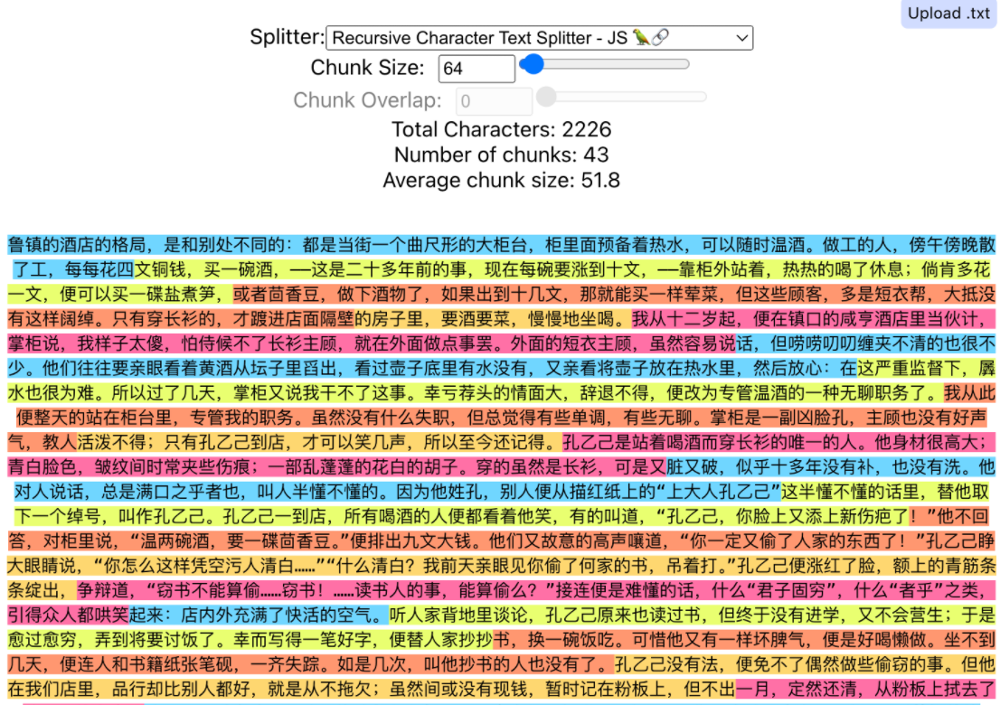

设置 `chunkOverlap`

```ts
const splitter = new RecursiveCharacterTextSplitter({
    chunkSize: 64,
    chunkOverlap: 16,
  });

const splitDocs = await splitter.splitDocuments(docs);
```

结果如下：

```json
[
  Document {
    pageContent: "鲁镇的酒店的格局，是和别处不同的：都是当街一个曲尺形的大柜台，柜里面预备着热水，可以随时温酒。做工的人，傍午傍晚散了工，每每花四",
    metadata: { source: "data/kong.txt", loc: { lines: { from: 1, to: 1 } } }
  },
  Document {
    pageContent: "工的人，傍午傍晚散了工，每每花四文铜钱，买一碗酒，——这是二十多年前的事，现在每碗要涨到十文，——靠柜外站着，热热的喝了休息；倘",
    metadata: { source: "data/kong.txt", loc: { lines: { from: 1, to: 1 } } }
  },
  Document {
    pageContent: "—靠柜外站着，热热的喝了休息；倘肯多花一文，便可以买一碟盐煮笋，或者茴香豆，做下酒物了，如果出到十几文，那就能买一样荤菜，但这些",
    metadata: { source: "data/kong.txt", loc: { lines: { from: 1, to: 1 } } }
  },
  ...
]
```

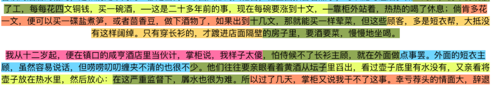

具体实践去切分首先设定为默认的 1000 和 200，然后使用 ChunkViz 去检查部分结果是否符合预期，然后根据人类对语意的理解去调整到一个合适的值。然后，在整个 chain 完成后，根据最终结果的质量和生成过程中的 log 去查找是哪部分影响了最终的结果质量，再去决定是否调整这两个参数。

### Code

因为 langchain 所支持切分的语言是一直在变动的，可以通过这个函数查询目前支持的语言

```ts
import { SupportedTextSplitterLanguages } from "langchain/text_splitter";

console.log(SupportedTextSplitterLanguages); 
```

下面以`js`代码为例切分

```ts
import { RecursiveCharacterTextSplitter } from "langchain/text_splitter";

const js = `
function myFunction(name,job){
	console.log("Welcome " + name + ", the " + job);
}

myFunction('Harry Potter','Wizard')

function forFunction(){
	for (let i=0; i<5; i++){
        console.log("这个数字是" + i)
	}
}

forFunction()
`;

const splitter = RecursiveCharacterTextSplitter.fromLanguage("js", {
  chunkSize: 64,
  chunkOverlap: 0,
});
const jsOutput = await splitter.createDocuments([js]);
```
输出：
```json
[
  Document {
    pageContent: "function myFunction(name,job){",
    metadata: { loc: { lines: { from: 2, to: 2 } } }
  },
  Document {
    pageContent: 'console.log("Welcome " + name + ", the " + job);\n}',
    metadata: { loc: { lines: { from: 3, to: 4 } } }
  },
  Document {
    pageContent: "myFunction('Harry Potter','Wizard')",
    metadata: { loc: { lines: { from: 6, to: 6 } } }
  },
  Document {
    pageContent: "function forFunction(){\n\tfor (let i=0; i<5; i++){",
    metadata: { loc: { lines: { from: 8, to: 9 } } }
  },
  Document {
    pageContent: 'console.log("这个数字是" + i)\n\t}\n}',
    metadata: { loc: { lines: { from: 10, to: 12 } } }
  },
  Document {
    pageContent: "forFunction()",
    metadata: { loc: { lines: { from: 14, to: 14 } } }
  }
]
```

js 的分割本质上就是将 js 中常见的切分代码的特定字符传给 `RecursiveCharacterTextSplitter`，然后还是根据 `Recursive` 的逻辑进行切分，跟对正常 text 切分的逻辑是一样的。

### Token

这个切分函数使用场景并不多，因为切分的时候并不是根据各种符号（例如标点）等进行切分来尝试保持语义性，就是根据 token 的数量进行切分，仅适合对 token 比较敏感的场景，或者与其他切分函数组合使用。

```ts
import { TokenTextSplitter } from "langchain/text_splitter";

const text = "I stand before you today the representative of a family in grief, in a country in mourning before a world in shock.";

const splitter = new TokenTextSplitter({
  chunkSize: 10,
  chunkOverlap: 0,
});

const docs = await splitter.createDocuments([text]);
```

```ts
[
  Document {
    pageContent: "I stand before you today the representative of a family",
    metadata: { loc: { lines: { from: 1, to: 1 } } }
  },
  Document {
    pageContent: " in grief, in a country in mourning before a",
    metadata: { loc: { lines: { from: 1, to: 1 } } }
  },
  Document {
    pageContent: " world in shock.",
    metadata: { loc: { lines: { from: 1, to: 1 } } }
  }
]
```

## Retriever: 构建向量数据库

构建出对应的 embedding 对象，然后将所有 embedding 存储在 vector db 中，并尝试根据用户的提问对 vector db 进行检索，找到与用户提问最相关的数据集。

### Embedding

首先将小说切分成模块

```ts
import { TextLoader } from "langchain/document_loaders/fs/text";
import { RecursiveCharacterTextSplitter } from "langchain/text_splitter";
const loader = new TextLoader("data/kong.txt");
const docs = await loader.load();

const splitter = new RecursiveCharacterTextSplitter({
    chunkSize: 100,
    chunkOverlap: 20,
  });

const splitDocs = await splitter.splitDocuments(docs);
```

创建一个 embedding 模型

```ts
import { OpenAIEmbeddings } from "@langchain/openai";
const embeddings = new OpenAIEmbeddings()
```

以第一个切分的结果为例
在 embedding 的时候，模型关注的就是 `pageContent`，并不会关心 metadata 的部分，

```ts
const res = await embeddings.embedQuery(splitDocs[0].pageContent)
console.log(splitDocs[0])
console.log(res)
```
```json
Document {
  pageContent: "鲁镇的酒店的格局，是和别处不同的：都是当街一个曲尺形的大柜台，柜里面预备着热水，可以随时温酒。做工的人，傍午傍晚散了工，每每花四文铜钱，买一碗酒，——这是二十多年前的事，现在每碗要涨到十文，——靠柜外",
  metadata: { source: "data/kong.txt", loc: { lines: { from: 1, to: 1 } } }
}

[
     0.017519549,    0.000543212,   0.015167197,  -0.021431018, -0.0067185625,
     -0.01009323,   -0.022402046,  -0.005822754,  -0.007446834,   -0.03019763,
     -0.00932051,     0.02169087, -0.0130063165,  0.0033592812,  -0.013293522,
     0.018422196, ...
] 
```


### 创建 MemoryVectorStore

创建 `MemoryVectorStore` 的实例，并传入需要 embeddings 的模型，调用添加文档的 `addDocuments` 函数，然后 langchain 的 `MemoryVectorStore` 就会自动帮完成对每个文档请求 embeddings 的模型，然后存入数据库的操作。

```ts
import { MemoryVectorStore } from "langchain/vectorstores/memory";

const vectorstore = new MemoryVectorStore(embeddings);
await vectorstore.addDocuments(splitDocs);
```

然后我们创建一个 `retriever`，这也是可以直接从 vector store 的实例中自动生成，这里我们传入了参数 2，代表对应每个输入，我们想要返回相似度最高的两个文本内容

```ts
const retriever = vectorstore.asRetriever(2)
```

使用 `retriever` 来进行文档的提取，例如我们尝试一下

```ts
const res = await retriever.invoke("茴香豆是做什么用的")
```

```ts
[
  Document {
    pageContent: "有喝酒的人便都看着他笑，有的叫道，“孔乙己，你脸上又添上新伤疤了！”他不回答，对柜里说，“温两碗酒，要一碟茴香豆。”便排出九文大钱。他们又故意的高声嚷道，“你一定又偷了人家的东西了！”孔乙己睁大眼睛说",
    metadata: { source: "data/kong.txt", loc: { lines: { from: 7, to: 7 } } }
  },
  Document {
    pageContent: "有几回，邻居孩子听得笑声，也赶热闹，围住了孔乙己。他便给他们一人一颗。孩子吃完豆，仍然不散，眼睛都望着碟子。孔乙己着了慌，伸开五指将碟子罩住，弯腰下去说道，“不多了，我已经不多了。”直起身又看一看豆",
    metadata: { source: "data/kong.txt", loc: { lines: { from: 15, to: 15 } } }
  }
]
```

如果用户提问特别简洁，没有相应的关键词，就会出现提取的信息错误问题，例如

```ts
const res = await retriever.invoke("下酒菜一般是什么？")


[
  Document {
    pageContent: "顾客，多是短衣帮，大抵没有这样阔绰。只有穿长衫的，才踱进店面隔壁的房子里，要酒要菜，慢慢地坐喝。",
    metadata: { source: "data/kong.txt", loc: { lines: { from: 1, to: 1 } } }
  },
  Document {
    pageContent: "有喝酒的人便都看着他笑，有的叫道，“孔乙己，你脸上又添上新伤疤了！”他不回答，对柜里说，“温两碗酒，要一碟茴香豆。”便排出九文大钱。他们又故意的高声嚷道，“你一定又偷了人家的东西了！”孔乙己睁大眼睛说",
    metadata: { source: "data/kong.txt", loc: { lines: { from: 7, to: 7 } } }
  }
]
```

这里第一个数据源是跟下酒菜有关的，但我们这个问题想要的答案明显是从第二个文档信息中才能得到的。所以为了提高回答质量，返回更多的数据源是有价值的。  
如果涉及到多层语意理解才能构建出联系的情况就比较难说了，例如：

```ts
const res = await retriever.invoke("孔乙己用什么谋生？")

[
  Document {
    pageContent: "孔乙己是这样的使人快活，可是没有他，别人也便这么过。",
    metadata: { source: "data/kong.txt", loc: { lines: { from: 17, to: 17 } } }
  },
  Document {
    pageContent: "孔乙己喝过半碗酒，涨红的脸色渐渐复了原，旁人便又问道，“孔乙己，你当真认识字么？”孔乙己看着问他的人，显出不屑置辩的神气。他们便接着说道，“你怎的连半个秀才也捞不到呢？”孔乙己立刻显出颓唐不安模样，",
    metadata: { source: "data/kong.txt", loc: { lines: { from: 11, to: 11 } } }
  }
]
```
这种情况只依靠相似度的对比就很难查找到正确的数据源，需要多层语意的转换才能找到合适数据源这种情况只依靠相似度的对比就很难查找到正确的数据源，需要多层语意的转换才能找到合适数据源。


### 构件本地vector store

这里使用到的是`faiss-node`,`faiss`向量数据库可以将向量数据库导出成文件，并且提供了 python 和 nodejs 的处理方式。但是faiss-node这玩意在windows安装有点玄学，这主要就是langchain的版本问题，在14年前，整个项目没有分包，后续版本分包以后导致有些向量数据库没得到支持，我这里用的是langchain的`0.1.30`版本，


```bash
pnpm add faiss-node
```

```ts
const run = async () => {
  const loader = new TextLoader("../data/kong.txt");
  const docs = await loader.load();

  const splitter = new RecursiveCharacterTextSplitter({
    chunkSize: 100,
    chunkOverlap: 20,
  });
  const splitDocs = await splitter.splitDocuments(docs);

  const embeddings = new OpenAIEmbeddings();
  const vectorStore = await FaissStore.fromDocuments(splitDocs, embeddings);

  const directory = "../db/kongyiji";
  await vectorStore.save(directory);
};

run();
```

然后去加载存储好的 vector store

```ts
const directory = "../db/kongyiji";
const embeddings = new OpenAIEmbeddings();
const vectorstore = await FaissStore.load(directory, embeddings);
```

创建一个 `Retriever` 实例，去获取根据相似度返回的文档

```ts
const retriever = vectorstore.asRetriever(2);
const res = await retriever.invoke("茴香豆是做什么用的");
```

```json
[
  {
    pageContent: '有喝酒的人便都看着他笑，有的叫道，“孔乙己，你脸上又添上新伤疤了！”他不回答，对柜里说，“温两碗酒，要一碟茴香豆。”便排出九文大钱。他们又故意的高声嚷道，“你一定又偷了人家的东西了！”孔乙己睁大眼睛说',
    metadata: { source: '../data/kong.txt', loc: [Object] }
  },
  {
    pageContent: '有几回，邻居孩子听得笑声，也赶热闹，围住了孔乙己。他便给他们一人一颗。孩子吃完豆，仍然不散，眼睛都望着碟子。孔乙己着了慌，伸开五指将碟子罩住，弯腰下去说道，“不多了，我已经不多了。”直起身又看一看豆',
    metadata: { source: '../data/kong.txt', loc: [Object] }
  }
]
```


## Retriever: retriever常见优化方式

**Retriever（检索器）**是负责“从外部知识库里找相关内容”的组件。

如果用户提问的关键词缺少，或者恰好跟原文中的关键词不一致，就容易导致 retriever 返回的文档质量不高，影响最终 llm 的输出效果。所以需要优化。

### MultiQueryReitriever

使用LLM将用户的输入改写成多个不同写法从不同的角度来表达同一个意思，来克服因为关键词或者细微措词导致检索效果差的问题。

导入存储在文件里的faiss vector store

```ts
const directory = "../db/kongyiji";
const embeddings = new OpenAIEmbeddings();
const vectorstore = await FaissStore.load(directory, embeddings);
```

然后创建一个 `MultiQueryRetriever`

```ts
const model = new ChatOpenAI();
const retriever = MultiQueryRetriever.fromLLM({
  llm: model,
  retriever: vectorstore.asRetriever(3),
  queryCount: 3,
  verbose: true,
});
```

上面代码的几个参数
- llm，也就是传入的 llm 模型，因为这个 retriever 需要使用 llm 进行改写，所以需要传入模型。注意，这里，以及几乎所有需要传入模型的地方，都不局限于 openAI 的模型。
- retriever，vector store 的 retriever，因为 MultiQueryRetriever 将会使用这个 retriever 去获取向量数据库里的数据。这里我们创建 `vectorstore.asRetriever(3)`意味着每次会检索三条数据，对每个 query
- queryCount，默认值是 3，也就意味着会对每条输入，都会用 llm 改写生成三条不同写法和措词，但表示同样意义的 query
- verbose，这个是几乎所有 langchain 函数都内置参数，设置为 true 会打印出 chain 内部的详细执行过程方便 debug  

```ts
const res = await retriever.invoke("茴香豆是做什么用的");
```

首先，`MultiQueryRetriever` 会用 LLM 生成三个 query，其中 prompt 是

```ts
You are an AI language model assistant. Your task is
to generate 3 different versions of the given user
question to retrieve relevant documents from a vector database.
By generating multiple perspectives on the user question,
your goal is to help the user overcome some of the limitations
of distance-based similarity search.

Provide these alternative questions separated by newlines between XML tags. For example:

<questions>
Question 1
Question 2
Question 3
</questions>

Original question: 茴香豆是做什么用的
```

其中核心的 prompt 是告诉 llm 去从检索算法（distance-based similarity search）的角度去生成用户提问的三个角度。

输出结果

```json
[
  "茴香豆的应用或用途是什么？",
  "茴香豆通常被用来做什么？",
  "可以用茴香豆来制作什么？"
]
```

然后，`MultiQueryRetriever` 会 **对每一个 query 调用 vector store 的 retriever**，也就是，按照我们上面的参数，会生成 3 * 3 共九个文档结果。 然后咱其中去重，并返回。


### Document Compressor

Retriever 的另一个问题是，如果我们设置 k(检索返回的文档数)较小，因为相似度最高 ≠ 最有用，所以可能导致有用的文档没有被检索到，那k又不能太大，因为太大了检索耗时太长，上下文爆炸，无关内容变多，消耗 llm 成本。

首先先采用debug的方式，看一下整个过程，来设置环境变量

```ts
process.env.LANGCHAIN_VERBOSE = "true";
```

像上面一样加载 vector store，然后直接创建一个从Doocument中提取核心内容的compressor

```ts
const model = new ChatOpenAI();
const compressor = LLMChainExtractor.fromLLM(model);
```

然后创建一个 `ContextualCompressionRetriever`，也就是会自动对上下文进行压缩的 Retriever：

```ts
const retriever = new ContextualCompressionRetriever({
  baseCompressor: compressor,
  baseRetriever: vectorstore.asRetriever(2),
});
```

这里有两个参数

- baseCompressor，也就是在压缩上下文时会调用 chain，这里接收任何符合 Runnable interface 的对象，也就是你可以自己实现一个 chain 作为 compressor
- baseRetriever，在检索数据时用到的 retriever

因为环境变量 `LANGCHAIN_VERBOSE` 为 `"true"`，会打印出大量的中间执行过程，这里挑其中核心的运行逻辑进行分析：

```ts
const res = await retriever.invoke("茴香豆是做什么用的");
```

首先，会调用传入的 `baseRetriever` 根据 query 进行检索，因为我们传入的 retriever 设置了 k=2，所以会返回两个 Document 对象，我把其中 `pageContent` 放在这里：

```ts
[
    "有喝酒的人便都看着他笑，有的叫道，“孔乙己，你脸上又添上新伤疤了！”他不回答，对柜里说，“温两碗酒，要一碟茴香豆。”便排出九文大钱。他们又故意的高声嚷道，“你一定又偷了人家的东西了！”孔乙己睁大眼睛说",
    "有几回，邻居孩子听得笑声，也赶热闹，围住了孔乙己。他便给他们一人一颗。孩子吃完豆，仍然不散，眼睛都望着碟子。孔乙己着了慌，伸开五指将碟子罩住，弯腰下去说道，“不多了，我已经不多了。”直起身又看一看豆"
]
```

然后，会调用传入的 `baseCompressor` 根据用户的问题和 Document 对象的内容，进行核心信息的提取，这里打印出提取内容用到的 prompt

```ts
Given the following question and context, extract any part of the context *AS IS* that 
is relevant to answer the question. If none of the context is relevant return 
NO_OUTPUT.

Remember, *DO NOT* edit the extracted parts of the context.

> Question: 茴香豆是做什么用的
> Context:
>>>
有喝酒的人便都看着他笑，有的叫道，“孔乙己，你脸上又添上新伤疤了！”他不回答，对柜里说，“温两碗酒，要一碟
茴香豆。”便排出九文大钱。他们又故意的高声嚷道，“你一定又偷了人家的东西了！”孔乙己睁大眼睛说
>>>
Extracted relevant parts:
```

其中的核心 prompt，就是根据用户提问从文档中提取出最相关的部分，并且强调不要让 LLM 去改动提取出来的部分，来避免 LLM 发挥自己的幻想改动原文。  

然后看最终返回的结果

```ts
[
  Document {
    pageContent: '对柜里说，“温两碗酒，要一碟茴香豆。”',
    metadata: { source: '../data/kong.txt', loc: [Object] }
  }
]
```

是只有一条的，我们去溯源其中的执行过程，发现对于第二条数据，LLM 返回的是 `NO_OUTPUT`，也就是 LLM 认为这里并没有跟上下文相关的信息。 

经过 `ContextualCompressionRetriever` 的处理，减少了最终输出的文档的内容长度，给上下文留下了更大的空间。

### ScoreThresholdRetriever

在前面使用Retriever的时候都涉及到了一个参数k，`vectorstore.asRetriever(2)`，也就是这里的2，代表了检索出来的文档数量。那么当我们无法确定k的值的时候，怎么办呢？这个时候就可以根据相似度达到某个分数以上来返回文档

```ts
const retriever = ScoreThresholdRetriever.fromVectorStore(vectorstore, {
    minSimilarityScore: 0.4,
    maxK: 5,
    kIncrement: 1,
});
```

这里有三个参数

- minSimilarityScore， 定义了最小的相似度阈值，也就是文档向量和 query 向量相似度达到多少，我们就认为是可以被返回的。这个要根据你的文档类型设置，一般是 0.8 左右，可以避免返回大量的文档导致消耗过多的 token 。
- maxK，一次最多拿多少条数据，这个主要是为了避免返回太多的文档造成 token 过度的消耗。
- kIncrement，它不是一次拿到 maxK 条数据，而是从 1 开始，每次递增 kIncrement 的值直到拿到 maxK 条文档。

结果

```ts
[
  {
    pageContent: '有喝酒的人便都看着他笑，有的叫道，“孔乙己，你脸上又添上新伤疤了！”他不回答，对柜里说，“温两碗酒，要一碟茴香豆。”便排出九文大钱。他们又故意的高声嚷道，“你一定又偷了人家的东西了！”孔乙己睁大眼睛说',
    metadata: { source: '../data/kong.txt', loc: [Object] }
  },
  {
    pageContent: '有几回，邻居孩子听得笑声，也赶热闹，围住了孔乙己。他便给他们一人一颗。孩子吃完豆，仍然不散，眼睛都望着碟子。孔乙己着了慌，伸开五指将碟子罩住，弯腰下去说道，“不多了，我已经不多了。”直起身又看一看豆',
    metadata: { source: '../data/kong.txt', loc: [Object] }
  },
  {
    pageContent: '年前的事，现在每碗要涨到十文，——靠柜外站着，热热的喝了休息；倘肯多花一文，便可以买一碟盐煮笋，或者茴香豆，做下酒物了，如果出到十几文，那就能买一样荤菜，但这些顾客，多是短衣帮，大抵没有这样阔绰。只有',
    metadata: { source: '../data/kong.txt', loc: [Object] }
  },
  {
    pageContent: '不多了，我已经不多了。”直起身又看一看豆，自己摇头说，“不多不多！多乎哉？不多也。”于是这一群孩子都在笑声里走散了。',
    metadata: { source: '../data/kong.txt', loc: [Object] }
  },
  {
    pageContent: '音虽然极低，却很耳熟。看时又全没有人。站起来向外一望，那孔乙己便在柜台下对了门槛坐着。他脸上黑而且瘦，已经不成样子；穿一件破夹袄，盘着两腿，下面垫一个蒲包，用草绳在肩上挂住；见了我，又说道，“温一碗酒',
    metadata: { source: '../data/kong.txt', loc: [Object] }
  }
]
```

## RAG 基于私域数据进行回答

对于代码的实现而言，整个`Rag`的构建流程分为两个大的阶段

- 离线阶段
- 在线阶段

```txt
离线阶段
---------------------------------

Documents
    ↓
Text Splitter
    ↓
Chunks
    ↓
Embedding Model
    ↓
Vectors
    ↓
Vector Database


在线阶段
---------------------------------

User Query
     ↓
Embedding
     ↓
Vector Search
     ↓
Top K Documents
     ↓
Document Processing
(Compression / Rerank)
     ↓
Prompt Construction
     ↓
LLM
     ↓
Answer
```

对应到代码的步骤如下

```txt
Loader
Splitter
Embedding
VectorStore
Retriever
Reranker
Compressor
Prompt
LLM
OutputParser
```

```ts
import { TextLoader } from "langchain/document_loaders/fs/text"; 
import { RecursiveCharacterTextSplitter } from "langchain/text_splitter";
import { OllamaEmbeddings, Ollama } from "@langchain/ollama";
import { MemoryVectorStore } from "langchain/vectorstores/memory";
import { RunnableSequence } from "@langchain/core/runnables";
import { ChatPromptTemplate } from '@langchain/core/prompts';
import { StringOutputParser } from "@langchain/core/output_parsers";

/**
 * rag的流程
 * 1. 用户输入问题
 * 2. 加载Documents
 * 3. 处理Documents，构建向量数据库
 * 4. 检索向量数据库并预处理返回的文档片段
 * 5. 将处理后的文档片段输入LLM构造Prompt，生成最终答案
 * 6. 输出答案
 */

// 创建大模型实例
const ollama = new Ollama ({
    baseUrl: "http://127.0.0.1:11434", 
    model: "llama3.2:3b",
})

/**
 * 离线阶段
 * 1. 加载Documents
 * 2. 处理Documents，构建向量数据库
 */
// 1. 创建文档加载实例
const loader = new TextLoader("../data/qiu.txt");
// 2. 创建文档切割实例
const splitter = new RecursiveCharacterTextSplitter({
  chunkSize: 500, // 每个文档片段的最大长度
  chunkOverlap: 100, // 文档片段之间的重叠长度
});
// 3. 创建embeddings实例对切割的文档进行向量化
const embeddings = new OllamaEmbeddings({
    model: "nomic-embed-text:latest",
    baseUrl: "http://127.0.0.1:11434",
})

// 对检索返回片段的内容处理
const getPageContent = ( doc ) => {
    return doc.map(item => item.pageContent).join("\n");
}

/**
 * 在线阶段
 * 1. 加载向量是数据库
 * 2. 检索向量数据库并预处理返回的文档片段
 * 3. 将处理后的文档片段输入LLM构造Prompt，生成最终答案
 * 4. 输出答案
 */

const main = async () => {
    // 加载文档
    const docs = await loader.load();
    // 切割文档
    const splitDoc = await splitter.splitDocuments(docs);
    // 创建向量数据库
    const vectorStore = new MemoryVectorStore(embeddings);
    await vectorStore.addDocuments(splitDoc);

    // 检索向量数据库并预处理返回的文档片段
    const retriever = vectorStore.asRetriever(5)

    const xxx = await retriever.invoke("详细描述原文中有什么跟直升机相关的场景");
    console.log(xxx);

    // 构建获取向量数据库上下问的链
    const contextRetrieverChain = RunnableSequence.from([
        (input) => input.question, // 获取用户输入的问题
        retriever, // 检索向量数据库并预处理返回的文档片段
        getPageContent, // 对返回的文档片段进行处理，获取文本内容
    ]) 

    // 构建提示模版
    const PromptTemplate = `
    你是一个熟读刘慈欣的《球状闪电》的终极原著党，精通根据作品原文详细解释和回答问题，你在回答时会引用作品原文。
    并且回答时仅根据原文，尽可能回答用户问题，如果原文中没有相关内容，你可以回答“原文中没有相关内容”，

    以下是原文中跟用户回答相关的内容：
    {context}

    现在，你需要基于原文，回答以下问题：
    {question}
    `

    const prompt = ChatPromptTemplate.fromTemplate(PromptTemplate)

    // 构建rag链
    const ragChain = RunnableSequence.from([
        {
            context: contextRetrieverChain, // 获取向量数据库上下文的链
            question: (input) => input.question, // 获取用户输入的问题
        },
        prompt, // 构建提示模版
        ollama, // 调用大模型生成答案
        new StringOutputParser
    ])

    const answer = await ragChain.invoke({
        question: "原文中，谁提出了宏原子的假设？并详细介绍给我宏原子假设的理论"
    })

    console.log(answer);
}

main()
```

## Memory 记忆能力

我们当然可以暴力地把所有的沟通上下文都传递给 llm，但受限于 llm 的上下文窗口，很容易触及到 llm 的上下文窗口，也会花费大量的 token 。 且，用户后续发送的信息可能与前面聊天讨论的话题完全无关，将这些无关的聊天记录塞到 llm 上下文中将可能影响 llm 关注点的错误等一系列问题。 

因此，Memory 是一个复杂的概念，而不仅仅是记录完整的聊天记录。


### ChatMessageHistory

`chat history`是数据而`Memory`是管理这些数据的方法，它主要干两件事，保存`Chat History`和决定哪些历史要给`LLM`

先创建一个 history 对象：

```ts
import { ChatMessageHistory } from "langchain/stores/message/in_memory";
import { HumanMessage, AIMessage } from "@langchain/core/messages";

const history = new ChatMessageHistory();
```
向history存储两个 Message 信息

```ts
await history.addMessage(new HumanMessage("hi"));
await history.addMessage(new AIMessage("What can I do for you?"));
```

然后获取所有历史记录
```ts
const messages = await history.getMessages();

console.log(messages);
```

结果为：

```json
[
  HumanMessage {
    "content": "hi",
    "additional_kwargs": {},
    "response_metadata": {}
  },
  AIMessage {
    "content": "What can I do for you?",
    "additional_kwargs": {},
    "response_metadata": {},
    "tool_calls": [],
    "invalid_tool_calls": []
  }
]
```

所有 chat history 都继承自 `BaseListChatMessageHistory`，其类型定义很简单：

```ts
export abstract class BaseChatMessageHistory extends Serializable {
  public abstract getMessages(): Promise<BaseMessage[]>;

  public abstract addMessage(message: BaseMessage): Promise<void>;

  public abstract addUserMessage(message: string): Promise<void>;

  public abstract addAIChatMessage(message: string): Promise<void>;

  public abstract clear(): Promise<void>;
}
```

任何实现了 `BaseChatMessageHistory` 抽象类的都可以作为 Memory 的底层 chat history。`ChatMessageHistory` 是存储在内存里的，我们可以自己实现基于文件存储的 `ChatMessageHistory`。并且复用 Memory 的能力。


### 手动维护 chat history

llm的本质，是一个根据上下文产出回答的模型，聊天记录是一种特殊的上下文，让 llm 理解之前的沟通内容，方便理解用户意图。因为 llm 是无状态的，它并不会存储我们的聊天历史，每次都是根据上下文生成回答，聊天记录就是我们自己存储，并且作为传递给 llm 的上下文的一部分。  

首先尝试把所有聊天记录传给llm

```ts
import { ChatPromptTemplate, MessagesPlaceholder } from "@langchain/core/prompts";
import { ChatOpenAI } from "@langchain/openai";

const chatModel = new ChatOpenAI();
const prompt = ChatPromptTemplate.fromMessages([
    ["system", `You are a helpful assistant. Answer all questions to the best of your ability.
    You are talkative and provides lots of specific details from its context. 
    If the you does not know the answer to a question, it truthfully says you do not know.`],
    new MessagesPlaceholder("history_message"),
]);

const chain = prompt.pipe(chatModel);
```

其中 `MessagesPlaceholder` 就是创建一个名为 `history_message` 的插槽，chain 中对应的参数将会替换这部分。具体一点就是我们每次在调用这条链的时候，通过这个占位符传入聊天记录。

如下，向链3上添加聊天记录

```ts
import { ChatMessageHistory } from "langchain/stores/message/in_memory";
import { HumanMessage, AIMessage } from "@langchain/core/messages";

const history = new ChatMessageHistory();
await history.addMessage(new HumanMessage("hi, my name is Kai"));

const res1 = await chain.invoke({
    history_message: await history.getMessages()
})
```
这时，res1 就是 llm 回复的第一条消息，其是一个 `AIMessage` 类的一个实例，打印出来是这样的 

```json
AIMessage {
  lc_serializable: true,
  lc_kwargs: {
    content: "Hello, Kai! It's wonderful to meet you! How can I assist you today? Whether you have questions, need"... 281 more characters,
    additional_kwargs: { function_call: undefined, tool_calls: undefined },
    response_metadata: {}
  },
  lc_namespace: [ "langchain_core", "messages" ],
  content: "Hello, Kai! It's wonderful to meet you! How can I assist you today? Whether you have questions, need"... 281 more characters,
  name: undefined,
  additional_kwargs: { function_call: undefined, tool_calls: undefined },
  response_metadata: {
    tokenUsage: { completionTokens: 86, promptTokens: 71, totalTokens: 157 },
    finish_reason: "stop"
  }
}
```
这是 llm 返回的消息，所以也应该添加到 chat history 中，并且添加一条人类的新提问：

```ts
await history.addMessage(res1)
await history.addMessage(new HumanMessage("What is my name?"));

const res2 = await chain.invoke({
    history_message: await history.getMessages()
})
```
返回的又是 `AIMessage` 类的一个实例，其中 content 是 

```txt
Your name is Kai. You just introduced yourself to me with that name....
```

这就是手动去维护 chat history，在工程上我们一般不会这么做，这里是为了大家更细节的了解 chat history 的原理。本质上 chat history 就是一个管理 Message 对象数组的一个对象，提供一系列工具方便外界调用。

### 自动维护 chat history

自动维护 chat history 也非常简单，就是由 `RunnableWithMessageHistory` 给任意 chain 包裹一层，就能添加聊天记录管理的能力：

```ts
const chatModel = new ChatOpenAI();
const prompt = ChatPromptTemplate.fromMessages([
    ["system", "You are a helpful assistant. Answer all questions to the best of your ability."],
    new MessagesPlaceholder("history_message"),
    ["human","{input}"]
]);

const history = new ChatMessageHistory();
const chain = prompt.pipe(chatModel)

const chainWithHistory = new RunnableWithMessageHistory({
  runnable: chain,
  getMessageHistory: (_sessionId) => history,
  inputMessagesKey: "input",
  historyMessagesKey: "history_message",
});
```

`RunnableWithMessageHistory` 有几个参数：

- runnable 就是需要被包裹的 chain，可以是任意 chain
- getMessageHistory 接收一个函数，函数需要根据传入的 `_sessionId`，去获取对应的 ChatMessageHistory 对象，这里我们没有 session 管理，所以就返回默认的对象
- inputMessagesKey 用户传入的信息 key 的名称，因为 RunnableWithMessageHistory 要自动记录用户和 llm 发送的信息，所以需要在这里声明用户以什么 key 传入信息
- historyMessagesKey，聊天记录在 prompt 中的 key，因为要自动的把聊天记录注入到 prompt 中。
- outputMessagesKey，因为我们的 chain 只有一个输出就省略了，如果有多个输出需要指定哪个是 llm 的回复，也就是需要存储的信息。  

直接调用这个 chain，其中历史记录会自动保存，这里我们除了正常 invoke 传入的参数外，还需要指定当前对话的 sessionId

```ts
const res1 = await chainWithHistory.invoke({
    input: "hi, my name is Kai"
},{
    configurable: { sessionId: "none" }
})
```

`RunnableWithMessageHistory` 就是帮助我们自动将用户和 llm 的消息存储在 history 中，省去了我们手动操作的繁琐。  

### 自动生成chat history摘要

> 这是一个比较复杂的chain的案例实现

```ts
import { Ollama } from "@langchain/ollama";
import { ChatMessageHistory, getBufferString } from "langchain/memory";
import { ChatPromptTemplate } from "langchain/prompts";
import { RunnablePassthrough, RunnableSequence } from "langchain/runnables";
import { StringOutputParser } from "langchain/schema/output_parser";

const ollama = new Ollama({
    baseUrl: "http://127.0.0.1:11434",
    model: "llama3.2:3b",
})

const prompt = ChatPromptTemplate.fromMessages(`
逐步总结提供的对话内容，在之前总结的基础上添加新的总结

当前摘要:
{summary}

新的对话行:
{new_lines}

新摘要:
`)

const simpleChain = RunnableSequence.from([
    prompt,
    ollama,
    new StringOutputParser()
])

const chatPrompt = ChatPromptTemplate.fromMessages([
    ["system", `You are a helpful assistant. Answer all questions to the best of your ability.

    Here is the chat history summary:
    {history_summary}
    `],
    ["human","{input}"]
]);
let summary = ""
const history = new ChatMessageHistory();

// 完整的chain
const chatChain = RunnableSequence.from([
    {
        input: new RunnablePassthrough({
            func: (input) => history.addUserMessage(input)
        })
    },
    RunnablePassthrough.assign({
        history_summary: () => summary
    }),
    chatPrompt,
    ollama,
    new StringOutputParser(),
    new RunnablePassthrough({
        func: async (input) => {
            history.addAIChatMessage(input);
            const messages = await history.getMessages();
            const new_lines = getBufferString(messages);
            const newSummary = await simpleChain.invoke({
                summary,
                new_lines
            })
            history.clear();
            summary = newSummary;
        }
    })
])
```

对于上面的这个`chatChain`，首先涉及到`RunnableMap`这个概念，其实就是并行多个runnable对象，然后返回结果对象的一个工具函数，如下

```ts
import { RunnableMap } from "@langchain/core/runnables"

const mapChain = RunnableMap.from({
    a: () => "a",
    b: () => "b"
})

const res = await mapChain.invoke()
// { a: "a", b: "b" }
```
其实函数也是runnable对象，这两个函数是并行执行的。如果这两个函数换成任意 runnable 对象，例如两个 chain 也就是会并行执行这两个 chain，并且返回相应的结果。

在 RunnableSequence 的数组中，如果有 object 类型的值，则自动会被转换成 `RunnableMap`，也就是我们 chain 中第一个 object 对象本质上是新建了一个 `RunnableMap`。  

`RunnablePassthrough`，简单来说就是原样传递输入（不做任何处理），因为在链上传递数据时，有些数据要做处理，有些数据不需要处理，直接传递。`RunnablePassthrough.assign` 则是在不改变输入的情况下，给输入添加额外的属性。

- 如果我们只写 `new RunnablePassthrough()`，那就是把用户输入的 input 再传递到下一个 runnable 节点中，不做任何操作。因为 RunnableMap 返回值是对其中每个 chain 执行，然后将返回值作为结果传递给下一个 runnable 节点，如果我们不对 input 使用 `RunnablePassthrough` 则下个节点就拿不到 input 的值
- `new RunnablePassthrough({func: (input)=> void})` 中的 func 函数是在传递 input 的过程中，执行一个函数，这个函数返回值是 void，也就是无论其内容是什么，都不会对 input 造成影响。

## Memory 运行机制

ConversationChain 是一个 专门用于构建聊天机器人的链（Chain），它把 LLM + Memory + Prompt 封装在一起，用来实现 连续对话（multi-turn conversation）。

一个最基础的完整记忆聊天记录的 chain

```ts
import { ChatOpenAI } from "@langchain/openai";
import { BufferMemory } from "langchain/memory";
import { ConversationChain } from "langchain/chains";


const chatModel = new ChatOpenAI();
const memory = new BufferMemory();
const chain = new ConversationChain({ llm: chatModel, memory: memory });
const res1 = await chain.call({ input: "我是小明" });
// { response: "你好，小明！很高兴认识你。我是人工智能，有什么可以帮助你的吗？" }

const res2 = await chain.call({ input: "我叫什么？" });
// { response: "你刚刚告诉我，你叫小明。" }
```
因为memory没有对 LCEL 做完整的兼容，所以这里来学一下memory的具体运行机制，看看内部发生了什么

```ts
const chain = new ConversationChain({ llm: chatModel, memory: memory, verbose: true });
```

再运行的时候`ConversationChain` 会自动传入一个 history 的属性，是字符串化后的 chat history：

```json
[1:chain:ConversationChain] Entering Chain run with input: {
  "input": "我叫什么？",
  "history": "Human: 我是小明\nAI: 你好，小明！很高兴认识你。我们要聊些什么呢？"
}
```
在调用llm传入prompt是

```json
The following is a friendly conversation between a human and an AI. The AI is talkative 
and provides lots of specific details from its context. If the AI does not know the 
answer to a question, it truthfully says it does not know.

Current conversation:
Human: 我是小明
AI: 你好，小明！很高兴认识你。我们要聊些什么呢？
Human: 我叫什么？
AI:
```

可以看到基本跟我们之前自己实现的记忆对话的 chain 是一样的，这里的 prompt 是可以自定义的。但是没办法在其中执行的过程中嵌入自己的处理函数。`ConversationChain` 没有暴露自定义接口的属性，很难修改。

但是memory其中有很多有趣的设计值得我们借鉴，同时也可以通过 `verbose` 模式去观察其中的 prompt。

### 内置Memory的机制

#### BufferWindowMemory

```ts
const model = new OpenAI();
const memory = new BufferWindowMemory({ k: 1 });
const chain = new ConversationChain({ llm: model, memory: memory });
```
对聊天记录加了一个滑动窗口，只会记忆 k 个对话，说人话就是只保留最近的 k 个对话。


#### ConversationSummaryMemory

之前实现的随着聊天不断生成和更新对聊天记录摘要的 chat bot，langchain官方也提供了类似的工具 -- `ConversationSummaryMemory`

```ts
import { ConversationSummaryMemory } from "langchain/memory";
import { PromptTemplate } from "@langchain/core/prompts";

const memory = new ConversationSummaryMemory({
    memoryKey: "summary",
    llm: new ChatOpenAI({
          verbose: true,
    }),
  });

const model = new ChatOpenAI();
const prompt = PromptTemplate.fromTemplate(`
你是一个乐于助人的助手。尽你所能回答所有问题。

这是聊天记录的摘要:
{summary}
Human: {input}
AI:`);
const chain = new ConversationChain({ llm: model, prompt, memory, verbose: true });

const res1 = await chain.call({ input: "我是小明" });
const res2 = await chain.call({ input: "我叫什么？" });
```

开启verbose可看到`ConversationSummaryMemory` 将使用 llm 渐进式的总结聊天记录生成 summary：

```txt
Progressively summarize the lines of conversation provided, adding onto the previous summary returning a new summary.

EXAMPLE
Current summary:
The human asks what the AI thinks of artificial intelligence. The AI thinks artificial intelligence is a force for good.

New lines of conversation:
Human: Why do you think artificial intelligence is a force for good?
AI: Because artificial intelligence will help humans reach their full potential.

New summary:
The human asks what the AI thinks of artificial intelligence. The AI thinks artificial intelligence is a force for good because it will help humans reach their full potential.
END OF EXAMPLE

Current summary:
The human, identifying themselves as Xiao Ming, greets the AI. The AI responds warmly and offers its assistance.

New lines of conversation:
Human: 我是小明
AI: 你好，小明。很高兴认识你！有什么我可以帮助你的吗？

New summary:
```

然后新的 summary 是

```txt
The human, identifying themselves as Xiao Ming, greets the AI and asks what their name 
is. The AI responds warmly, offers its assistance, and confirms that the human's name 
is Xiao Ming.
```

这里 langchain 为了提升 summary 的效果，会在 prompt 中嵌入一些 example 来保证 llm 理解我们的需求和目的

#### ConversationSummaryBufferMemory

将 `BufferWindowMemory` 和 `ConversationSummaryMemory` 结合起来，根据 token 数量，如果上下文历史过大时就切换到 summary，如果上下文比较小时就使用原始的聊天记录，也就成了 `ConversationSummaryBufferMemory`。

```ts
import { ChatOpenAI } from "@langchain/openai";
import { ConversationSummaryBufferMemory } from "langchain/memory";
import { ConversationChain } from "langchain/chains";

const model = new ChatOpenAI();
const memory = new ConversationSummaryBufferMemory({
  llm: new ChatOpenAI(),
  maxTokenLimit: 200
});
const chain = new ConversationChain({ llm: model, memory: memory, verbose: true });
```

这里原理跟前面的两个 memory 的机制类似，其会计算当前完整聊天记录的 token 数，去判断是否超过我们设置的 `maxTokenLimit`，如果超过则对聊天记录总结成 summary 输入进去。

#### EntityMemory

在人类聊天的过程中，我们实际在建立的是对各种实体（Entity）的记忆，例如两个刚认识的人，我们聊职业、聊公司、聊餐馆，我们记忆中存储方式可能是根据实体进行分类存储，这个人是什么职业、年龄；这个公司是什么情况；餐馆是什么环境和味道。`EntityMemory` 希望模拟的就是在聊天中去生成和更新不同的实体的描述。  

```ts
import { ChatOpenAI } from "@langchain/openai";
import { EntityMemory, ENTITY_MEMORY_CONVERSATION_TEMPLATE } from "langchain/memory";
import { ConversationChain } from "langchain/chains";

const model = new ChatOpenAI();
const memory = new EntityMemory({
    llm: new ChatOpenAI({
        verbose: true 
    }),
    chatHistoryKey: "history",
    entitiesKey: "entities"
});
const chain = new ConversationChain({ 
    llm: model, 
    prompt: ENTITY_MEMORY_CONVERSATION_TEMPLATE,
    memory: memory, 
    verbose: true 
});
```

其中 `ENTITY_MEMORY_CONVERSATION_TEMPLATE` 是 langchain 提供的默认用于 EntityMemory chat 的 prompt，我们也可以自定义合适的 prompt。

开启 verbose 可看到如下

首先，EntityMemory 将会使用 llm 提取对话中出现的主体，具体的 prompt 是：

```txt
You are an AI assistant reading the transcript of a conversation between an AI and a 
human. Extract all of the proper nouns from the last line of conversation. As a 
guideline, a proper noun is generally capitalized. You should definitely extract all 
names and places.

The conversation history is provided just in case of a coreference 
(e.g. \"What do you know about him\" where \"him\" is defined in a previous line) -- 
ignore items mentioned there that are not in the last line.\n\nReturn the output as a 
single comma-separated list, or NONE if there is nothing of note to return (e.g. the 
user is just issuing a greeting or having a simple conversation).

EXAMPLE
Conversation history:
Person #1: my name is Jacob. how's it going today?
AI: \"It's going great! How about you?\"
Person #1: good! busy working on Langchain. lots to do.
AI: \"That sounds like a lot of work! What kind of things are you doing to make Langchain better?\"
Last line:
Person #1: i'm trying to improve Langchain's interfaces, the UX, its integrations with various products the user might want ... a lot of stuff.
Output: Jacob,Langchain
END OF EXAMPLE

EXAMPLE
Conversation history:
Person #1: how's it going today?
AI: \"It's going great! How about you?\"
Person #1: good! busy working on Langchain. lots to do.
AI: \"That sounds like a lot of work! What kind of things are you doing to make Langchain better?\"
Last line:
Person #1: i'm trying to improve Langchain's interfaces, the UX, its integrations with various products the user might want ... a lot of stuff. I'm working with Person #2.
Output: Langchain, Person #2
END OF EXAMPLE

Conversation history (for reference only):
Human: 我叫小明，今年 18 岁
AI: 你好，小明！很高兴认识你。你今年18岁，正是年轻有活力的时候。有什么问题我能帮你解答，或者关于什么话题你想和我交谈呢？
Last line of conversation (for extraction):
Human: ABC 是一家互联网公司，主要是售卖方便面的公司
Output:
```

可以看到又是一个构造非常精良的 prompt
- 首先第一段去讲清楚任务的背景，一个阅读对话记录，并且从最后一次对话中提取名词的 ai，因为核心目标是英语，这里给了提示，一般专有名词是大写的。并且强调一定提取所有的名词。 这部分给定了任务、任务提示和要求。
- 第二段，强调历史聊天记录仅仅是用于参考，并且再次强调只提取最后一次对话中出现的专有名词，并指定多个专有名词的返回格式和没有任何专有名词的返回格式。
- 然后就是两个例子，第一个例子是普通的例子，主要是用例子更具象化的介绍这个任务。第二个我认为是以 Person \#2 为例强化对名词的概念。 few-shot prompt，也就是通过例子去强化 llm 对任务的理解是常见和效果非常好的技巧
- 最后在 `Conversation history (for reference only)` 再次强化 chat history 只是为了作为参考，`Last line of conversation (for extraction)` 这里才是作为提取的目标

最后，llm 返回："ABC"  
可以看到 llm 只提取了最后一段聊天中的名词，而没有错误的提取聊天历史中的 小明。  

之后就是正常的 `ConversationChain` 让 llm 对话的内容

在聊天之后，EntityMemory 会提取对实体的描述认为，其中的 prompt 是：

```txt
You are an AI assistant helping a human keep track of facts about relevant people, 
places, and concepts in their life. Update and add to the summary of the provided 
entity in the \"Entity\" section based on the last line of your conversation with the 
human. If you are writing the summary for the first time, return a single 
sentence.

The update should only include facts that are relayed in the last line of 
conversation about the provided entity, and should only contain facts about the 
provided entity.

If there is no new information about the provided entity or the information is not worth noting (not an important or relevant fact to remember long-term), output the exact string \"UNCHANGED\" below.

Full conversation history (for context):
Human: 我叫小明，今年 18 岁
AI: 你好，小明！很高兴认识你。你今年18岁，正是年轻有活力的时候。有什么问题我能帮你解答，或者关于什么话题你想和我交谈呢？

Human: ABC 是一家互联网公司，主要是售卖方便面的公司
AI: ABC是一个非常有趣的公司，把互联网技术和方便面销售结合在一起。这两个领域似乎毫不相关，但在这个时代，创新的商业模式正在不断涌现。他们是否有使用特殊的营销策略或技术来提高销售或提高客户体验呢？

Entity to summarize:
ABC

Existing summary of ABC:
No current information known.

Last line of conversation:
Human: ABC 是一家互联网公司，主要是售卖方便面的公司
Updated summary (or the exact string \"UNCHANGED\" if there is no new information about ABC above):
```

这一部分的目的是，根据本次对话用户提到的实体，也就是上一个 prompt 提取出来的实体，去更新 **用户** 提供的实体信息。  

- 第一段去强调 llm 的任务，是记录有关实体的信息
- 第二段是将范围控制在用户最新一条信息内，并且只包含跟目标实体有关的内容
- 第三段是指定如果没有更新或者更新并不值得长期记忆，则返回特殊字符 `UNCHANGED`
- 后面这是提供聊天记录、需要记录的实体、当前记录的实体信息，以及跟用户的最后一天聊天记录

然后 llm 就会返回跟实体相关的信息：

```txt
ABC is an internet company that primarily sells instant noodles.
```

经过上面两次沟通后，如果询问

```ts
const res3 = await chain.call({ input: "介绍小明和 ABC" });
```

`EntityMemory` 会像上面一样，使用 llm 提取实体列表，并返回这些实体的相关信息，以及聊天记录传入到 `ConversationChain` 的 `ENTITY_MEMORY_CONVERSATION_TEMPLATE` 中，解析一下这个 prompt：

```txt
You are an assistant to a human, powered by a large language model trained by OpenAI.

You are designed to be able to assist with a wide range of tasks, from answering simple 
questions to providing in-depth explanations and discussions on a wide range of topics. 
As a language model, you are able to generate human-like text based on the input you 
receive, allowing you to engage in natural-sounding conversations and provide responses 
that are coherent and relevant to the topic at hand.

You are constantly learning and improving, and your capabilities are constantly 
evolving. You are able to process and understand large amounts of text, and can use 
this knowledge to provide accurate and informative responses to a wide range of 
questions. You have access to some personalized information provided by the human in 
the Context section below. Additionally, you are able to generate your own text based 
on the input you receive, allowing you to engage in discussions and provide 
explanations and descriptions on a wide range of topics.

Overall, you are a powerful tool that can help with a wide range of tasks and provide valuable insights and information on a wide range of topics. Whether the human needs help with a specific question or just wants to have a conversation about a particular topic, you are here to assist.

Context:
 小明: 小明是一个18岁的年轻人，正处在热血沸腾的年纪。他可能正在学习或已经步入职场，具有无限的潜力和可能性。他和ABC公司有某种连接，但具体细节尚未提供。
 ABC: ABC is an Internet company that primarily sells instant noodles.
  
Current conversation:
Human: 我叫小明，今年 18 岁
AI: 很高兴认识你，小明。你今年18岁，正是年轻有力的时候。有什么我可以帮助你的吗？
Human: ABC 是一家互联网公司，主要是售卖方便面的公司
AI: 我明白了，ABC 是一家专注于售卖方便面的互联网公司。这是一个非常有趣的商业模式。你想知道更多关于这个公司的信息，还是有关于其它的问题需要我为你解答？

Last line:
Human: 介绍小明和 ABC
You:
```

核心在 `You have access to some personalized information provided by the human in the Context section below.` 对 llm 指定了在 context 部分提供与上下文相关的背景信息供 llm 参考。  


## Memory 实现自定义Memory存储

### 在LCEL中集成Memory

如果我们想在 LCEL 中集成 memory，先看 `BaseMemory` 的接口定义，在源码中的定义文件在：[memory.ts](https://github.com/langchain-ai/langchainjs/blob/main/langchain-core/src/memory.ts)

```ts
export abstract class BaseMemory {
  abstract get memoryKeys(): string[];

  /**
   * Abstract method that should take an object of input values and return a
   * Promise that resolves with an object of memory variables. The
   * implementation of this method should load the memory variables from the
   * provided input values.
   * @param values An object of input values.
   * @returns Promise that resolves with an object of memory variables.
   */
  abstract loadMemoryVariables(values: InputValues): Promise<MemoryVariables>;

  /**
   * Abstract method that should take two objects, one of input values and
   * one of output values, and return a Promise that resolves when the
   * context has been saved. The implementation of this method should save
   * the context based on the provided input and output values.
   * @param inputValues An object of input values.
   * @param outputValues An object of output values.
   * @returns Promise that resolves when the context has been saved.
   */
  abstract saveContext(
    inputValues: InputValues,
    outputValues: OutputValues
  ): Promise<void>;
}
```

核心就是就是两个方法：

- `loadMemoryVariables`，返回当前记忆的内容，如果有些记忆是依赖于输入的，例如 `EntityMemory`，就需要传入一些输入，让 memory 返回对应输入的记忆。 在 `EntityMemory` 的场景下，就是 memory 需要根据传入的信息提取输入中的实体，并且返回实体中相关的记忆

- `saveContext`，就是将对话存入到 memory 中，也就是需要传入用户的输入 `inputValues`，和模型的输出 `OutputValues`

`BaseMemory` 是所有 memory 都需要继承的接口，也就是我们参考这个接口去在 LCEL 中引入 memory，就能保证引入的方式对所有 memory 有效。  

看如何在 LCEL 中使用 memory，这里以 `BufferMemory` 举例，其他的 memory 也是类似的机制：

```ts
const model = new ChatOpenAI({
  verbose: true,
})

const memory = new BufferMemory()

const template = `
你是一个乐于助人的 ai 助手。尽你所能回答所有问题。

这是跟人类沟通的聊天历史:
{history}

据此回答人类的问题:
{input}
`

const prompt = ChatPromptTemplate.fromTemplate(template)

let tempInput = ""

const chain = RunnableSequence.from([
  // RunnableMap 并行执行
  {
    // 把输入直接传递给后面的步骤
    input: new RunnablePassthrough(),
    // 
    memoryObject: async(input) => {
      const history = await memory.loadMemoryVariables({
        input
      })
      tempInput = input
      return history
    },
    RunnablePassthrough.assign({
        history: (input) => input.memoryObject.history
    }),
    prompt,
    model,
    new StringOutputParser(),
    new RunnablePassthrough({
        func: async (output) => {
            await memory.saveContext({
                input: tempInput
            }, {
                output
            })
        }
    }),
  }
])
```

在学习LCEL 中，可以使用下面这个技巧去打印 chain 中间传递的内容，去慢慢理解数据是在 chain 中是如何流动的。

```ts
[
...
prompt,
new RunnablePassthrough({
    func: (input) => console.log(input)
}),
chatModel,
...
]
```

### 实现自定义的chat history

通过前面的学习，了解了memory和chat history，那么也理解`Memory = 对 ChatHistory 的处理层`，`ChatHistory = 原始聊天记录存储`这两句话了，因为memory的底层就是可靠chat history去存储聊天记录的。

这里会去实现一个基础的 customized chat history，并把文件存储在本地的 json 文件中。

先来看看BaseListChatMessageHistory 的源码：[code](https://github.com/langchain-ai/langchainjs/blob/d26233d89148c123540ed93af63ab3fb1f0ac1ac/langchain-core/src/chat_history.ts)  

```ts
export declare abstract class BaseListChatMessageHistory extends Serializable {
    /** Returns a list of messages stored in the store. */
    abstract getMessages(): Promise<BaseMessage[]>;
    /**
     * Add a message object to the store.
     */
    abstract addMessage(message: BaseMessage): Promise<void>;
    /**
     * This is a convenience method for adding a human message string to the store.
     * Please note that this is a convenience method. Code should favor the
     * bulk addMessages interface instead to save on round-trips to the underlying
     * persistence layer.
     * This method may be deprecated in a future release.
     */
    addUserMessage(message: string): Promise<void>;
    /** @deprecated Use addAIMessage instead */
    addAIChatMessage(message: string): Promise<void>;
    /**
     * This is a convenience method for adding an AI message string to the store.
     * Please note that this is a convenience method. Code should favor the bulk
     * addMessages interface instead to save on round-trips to the underlying
     * persistence layer.
     * This method may be deprecated in a future release.
     */
    addAIMessage(message: string): Promise<void>;
    /**
     * Add a list of messages.
     *
     * Implementations should override this method to handle bulk addition of messages
     * in an efficient manner to avoid unnecessary round-trips to the underlying store.
     *
     * @param messages - A list of BaseMessage objects to store.
     */
    addMessages(messages: BaseMessage[]): Promise<void>;
    /**
     * Remove all messages from the store.
     */
    clear(): Promise<void>;
}
```

可以看到，addUserMessage、addAIChatMessage、addAIMessage 都是将要 deprecated 的函数，真正我们需要实现的就是：

- getMessages：获取存储在 history 中所有聊天记录
- addMessage：添加单条 message
- addMessages：添加 message 数组
- clear：清空聊天记录 

来看看完整的代码

```ts
import { BaseListChatMessageHistory } from "@langchain/core/chat_history";
import {
  BaseMessage,
  StoredMessage,
  mapChatMessagesToStoredMessages,
  mapStoredMessagesToChatMessages,
} from "@langchain/core/messages";
import fs from "node:fs";
import path from "node:path";

export interface JSONChatHistoryInput {
  sessionId: string;
  dir: string;
}

export class JSONChatHistory extends BaseListChatMessageHistory {
  lc_namespace = ["langchain", "stores", "message"];

  sessionId: string;
  dir: string;

  constructor(fields: JSONChatHistoryInput) {
    super(fields);
    this.sessionId = fields.sessionId;
    this.dir = fields.dir;
  }

  async getMessages(): Promise<BaseMessage[]> {
    const filePath = path.join(this.dir, `${this.sessionId}.json`);
    try {
      if (!fs.existsSync(filePath)) {
        this.saveMessagesToFile([]);
        return [];
      }

      const data = fs.readFileSync(filePath, { encoding: "utf-8" });
      const storedMessages = JSON.parse(data) as StoredMessage[];
      return mapStoredMessagesToChatMessages(storedMessages);
    } catch (error) {
      console.error(`Failed to read chat history from ${filePath}`, error);
      return [];
    }
  }

  async addMessage(message: BaseMessage): Promise<void> {
    const messages = await this.getMessages();
    messages.push(message);
    await this.saveMessagesToFile(messages);
  }

  async addMessages(messages: BaseMessage[]): Promise<void> {
    const existingMessages = await this.getMessages();
    const allMessages = existingMessages.concat(messages);
    await this.saveMessagesToFile(allMessages);
  }

  async clear(): Promise<void> {
    const filePath = path.join(this.dir, `${this.sessionId}.json`);
    try {
      fs.unlinkSync(filePath);
    } catch (error) {
      console.error(`Failed to clear chat history from ${filePath}`, error);
    }
  }

  private async saveMessagesToFile(messages: BaseMessage[]): Promise<void> {
    const filePath = path.join(this.dir, `${this.sessionId}.json`);
    const serializedMessages = mapChatMessagesToStoredMessages(messages);
    try {
      fs.writeFileSync(filePath, JSON.stringify(serializedMessages, null, 2), {
        encoding: "utf-8",
      });
    } catch (error) {
      console.error(`Failed to save chat history to ${filePath}`, error);
    }
  }
}

```

```ts
export interface JSONChatHistoryInput { 
    sessionId: string; 
    dir: string; 
}
```
这里 sessionId 是区别于不同对话的 id，在工程中一般使用 uuid，dir 是存储聊天记录 json 文件的目录。

```ts
lc_namespace = ["langchain", "stores", "message"];
```
因为 `BaseListChatMessageHistory` 继承了 `Serializable`，声明 lc_namespace 是方便 langchain 在序列化和反序列化时，找到 json 中对象对应的内置类，例如当我们把 message 序列化，再反序列化后，打印出来依旧是对应 langchain 内部的类的实例化对象，依靠的就是这个。

这里具体解释一下
在js中没有类的概念，假设你有一个类
```ts
class AIMessage {
  content: string;
}

// 我们来实例化一个对象
const msg = new AIMessage();
```

这个时候你直接对这个msg进行JSON.stringify，会发现输出的结果是

```json
{
  "content": "hello"
}
```
那么问题来了JSON只能保存数据，不能保存类信息，当我们把这个对象反序列化回来的时候，我们没法知道这个对象到底是哪个类的实例。反序列化得到的结果是

```ts
{ content: "hello" }

// 而不是
AIMessage instance
```

而上面代码做了一件事情
在 JSON 里额外存“类路径”

```json
{
  "lc": 1,
  "type": "constructor",
  "id": ["langchain", "stores", "message", "AIMessage"],
  "kwargs": {
    "content": "hello"
  }
}
```
这里的id是关键
因为`lc_namespace = ["langchain", "stores", "message"];`，意思就是这个类属于：langchain.stores.message，如果类名是`AIMessage`，那么完整的类路径就是：`["langchain", "stores", "message", "AIMessage"]`，在反序列化的时候，会看到

```json
"id": ["langchain", "stores", "message", "AIMessage"]
```
然后找namespace，找到对应的类，用这个类的构造函数去实例化对象。就相当于

```ts
new AIMessage({content:"hello"})
```
于是恢复成了原来的对象

`saveMessagesToFile` 部分，这部分原理很简单，就是使用 `mapChatMessagesToStoredMessages` 去对 messages 进行序列化，然后用写文件到 json 文件中。  

`getMessages` 从对应的文件中读取 json 内容，然后使用 `mapStoredMessagesToChatMessages` 序列化成对应的 message 对象。  


来测试一下

```ts
import { JSONChatHistory } from "./JSONChatHistory/index.ts"
import { AIMessage, HumanMessage } from "@langchain/core/messages";

const history = new JSONChatHistory({
    dir: "chat_data",
    sessionId: "test"
})


await history.addMessages([
  new HumanMessage("Hi, 我叫小明"),
  new AIMessage("你好"),
]);

const messages = await history.getMessages();
console.log(messages)
```

输出

```json
[
  HumanMessage {
    lc_serializable: true,
    lc_kwargs: {
      content: "Hi, 我叫小明",
      additional_kwargs: {},
      response_metadata: {}
    },
    lc_namespace: [ "langchain_core", "messages" ],
    content: "Hi, 我叫小明",
    name: undefined,
    additional_kwargs: {},
    response_metadata: {}
  },
  AIMessage {
    lc_serializable: true,
    lc_kwargs: { content: "你好", additional_kwargs: {}, response_metadata: {} },
    lc_namespace: [ "langchain_core", "messages" ],
    content: "你好",
    name: undefined,
    additional_kwargs: {},
    response_metadata: {}
  }
]
```

我们打开对应的test.json文件，可以看到

```json
[
  {
    "type": "human",
    "data": {
      "content": "Hi, 我叫小明",
      "additional_kwargs": {},
      "response_metadata": {}
    }
  },
  {
    "type": "ai",
    "data": {
      "content": "你好",
      "additional_kwargs": {},
      "response_metadata": {}
    }
  }
]
```


## RAG 增强RAG能力并部署成api(实战)

### llm 改写提问

因为 chat bot 面对的是普通用户的长对话，用户会自然的通过代词去指代前面的内容，例如：

```txt
Human: 这个故事的主角是谁？
AI: 主角是小明
Human: 介绍他的故事
```
在正常的 rag 逻辑中，我们会使用 “介绍他的故事” 去检索向量数据库，但这句话只有 “他” 并没有检索的关键词 “小明”，就很难检索到正确的资料。  

所以，为了提高检索的质量，我们需要对用户的提问进行改写，让他成为一个独立的问题，包含检索的所有关键词，例如上面的例子我们就可以改写成 “介绍小明的故事”，这样检索时就能获得数据库中相关的文档，从而获得高质量的回答。

当做 LLM app 遇到问题时，我们通常会尝试加入更多的 LLM 来解决问题，因此改写的工作交给llm

先定义prompt

```ts
const rephraseChainPrompt = ChatPromptTemplate.fromMessages([
  [
    "system",
    "给定以下对话和一个后续问题，请将后续问题重述为一个独立的问题。请注意，重述的问题应该包含足够的信息，使得没有看过对话历史的人也能理解。",
  ],
  new MessagePlaceholder("history"),
  [
    "human", 
    "将以下问题重述为一个独立的问题：\n{question}"
    ],
])
```

通过 system prompt 去给 llm 确定任务，根据聊天记录去把对话重新描述成一个独立的问题，并强调重述问题的目标。
因此有链如下

```ts
const rephraseChain = RunnableSequence.from([
  rephraseChainPrompt,
  new ChatOpenAI({
    temperature: 0.2,
  }),
  new StringOutputParser(),
]);
```
这里，我们将 model 的 temperature 定义的较低，越低 llm 会越忠于事实，减少自己的自由发挥。

简单测试一下效果

```ts
const historyMessages = [new HumanMessage("你好，我叫小明"), new AIMessage("你好小明")];

const question = "你觉得我的名字怎么样？";
const standaloneQuestion = await rephraseChain.invoke({ history: historyMessages, question });

console.log(standaloneQuestion);
// 你认为小明这个名字怎么样？
```

### 构建完整的RAG chain


## Function Calling: 使用LLM等待偶用外界API

Function calling 本质上就是给 LLM 了解和调用外界函数的能力，LLM 会根据他的理解，在合适的时间返回对函数的调用和参数，然后根据函数调用的结果进行回答。例如，你在构建一个旅游计划的 chatbot，用户给出问题 “规划一个 2.11 日北京的旅游行程，帮我选择最合适天气的衣服”，LLM 就会判断需要调用获取 2.11 实时天气的 API 来获取北京在 2.11 的天气，并根据返回的结果来回答问题。

openai将 function calling 更名成了 tools，后续文档中会以tools称呼这个api


### tools的基本使用

获取天气是非常经典的使用案例，这个需要实时获取外部 API 的结果，LLM 无法独立回答。这里我们使用 OpenAI 官方库，首先引入并初始化


```ts
import OpenAI from "openai";

const openai = new OpenAI({
    apiKey: env["API_KEY"],
});
```

然后创建一个假的获取天气的函数

```ts
function getCurrentWeather({ location, unit="fahrenheit"}){
   const  weather_info = {
        "location": location,
        "temperature": "72",
        "unit": unit,
        "forecast": ["sunny", "windy"],
    }
    return JSON.stringify(weather_info);
}
```

然后我们创建这个函数的描述信息

```ts
const tools = [
  {
    type: "function",
    function:{
      name: "getCurrentWeather",
      description: "Get the current weather in a given location",
      parameters: {
        type: "object",
        properties: {
          location: {
            type: "string",
            description: "The city and state, e.g. San Francisco, CA",
          },
          unit: { type: "string", enum: ["celsius", "fahrenheit"] },
        },
        required: ["location"],
      },
    }
  }
]
```

这里是 OpenAI 官方 API 指定的格式，我们逐步解析这里的定义，

- `type: "function"` 目前只支持值为 function, 必须指定
- `function` 是对具体函数的描述
- `name` 是函数名, 需要跟函数的名称一致, 方便我们后续实现对函数名的调用
- `descirption` 函数的描述, 你可以理解成对 LLM 决定什么是否调用该函数的唯一信息, 这部分清晰的表达函数的效果
- `parameters` 函数的参数, OpenAI 使用的是通用的 JSON Schema 去描述函数的各个参数, 在我们这里使用了数组作为参数的输入, 其中有两个 key
  - `location` 一个 string 值表示位置
  - `unit` 表示请求的单位
- `required` 通过这个 key 告知 LLM 该参数是必须的

然后我们就可以尝试调用 LLM 的 tools 功能

```ts
const messages = [
    {
        "role": "user",
        "content": "北京的天气怎么样"
    }
]

const result = await openai.chat.completions.create({
    model: 'gpt-3.5-turbo',
    messages,
    tools
  });
  console.log(result.choices[0]);
```

得到的结果就是

```json
{
  content_filter_results: {},
  finish_reason: "tool_calls",
  index: 0,
  message: {
    content: null,
    role: "assistant",
    tool_calls: [
      {
        function: {
          arguments: '{\n"location": "Beijing"\n}',
          name: "getCurrentWeather"
        },
        id: "xxxx",
        type: "function"
      }
    ]
  }
}
```

### 控制LLM调用函数的行为

这里 tools 还有一个可选的参数是 `tool_choice`, 他有几种使用方式

- `none` 表示, 禁止 LLM 使用任何函数, 也就是无论用户输入什么, LLM 都不会调用函数
- `auto` 表示, 让 LLM 自己决定是否使用函数. 也就是 LLM 的返回值可能是函数调用, 也可能正常的信息
  而最后一种, 就是指定一个函数, 让 LLM 强制使用该函数, 其类型是一个 object, 有两个属性
- `type` 目前只能指定为 function
- `function`, 其值为一个对象, 有且仅有一个 key name 为函数名称
  例如

  ```ts
  {
    "type": "function", 
    "function": {
        "name": "my_function"
    }
  }
  ```
有了这个能力, 我们就具有了更细粒度去调用 LLM 的能力, 例如我们可以禁止 LLM 去调用函数

```ts
const messages = [
    {
        "role": "user",
        "content": "北京的天气怎么样"
    }
]

const result = await openai.chat.completions.create({
    model: 'gpt-3.5-turbo',
    messages,
    tools,
    tool_choice: "none"
  });

console.log(result.choices[0]);
```

返回值

```json
{
  content_filter_results: {
    hate: { filtered: false, severity: "safe" },
    self_harm: { filtered: false, severity: "safe" },
    sexual: { filtered: false, severity: "safe" },
    violence: { filtered: false, severity: "safe" }
  },
  finish_reason: "stop",
  index: 0,
  message: { content: "请问您需要获取北京当前的天气还是未来几天的天气预报？", role: "assistant" }
}
```

或者强制去调用某个函数 

```ts
const messages = [
    {
        "role": "user",
        "content": "你好"
    }
]

const result = await openai.chat.completions.create({
    model: 'gpt-3.5-turbo',
    messages,
    tools,
    tool_choice: {
        type: "function",
        function: {
           name: "getCurrentWeather"
        }
    }
  });
 
console.log(result.choices[0]);
```

```ts
{
  content_filter_results: {},
  finish_reason: "stop",
  index: 0,
  message: {
    content: null,
    role: "assistant",
    tool_calls: [
      {
        function: {
          arguments: '{\n  "location": "上海",\n  "unit": "celsius"\n}',
          name: "getCurrentWeather"
        },
        id: "call_o5QJhnax6dC9e4yqHL1kLrq0",
        type: "function"
      }
    ]
  }
}
```
将 LLM 返回的调用参数, 传递给 js 中的函数中

```ts
const functions = {
    "getCurrentWeather": getCurrentWeather
  }

const functionInfo = result.choices[0].message.tool_calls[0].function
const functionName = functionInfo.name;
const functionParams = functionInfo.arguments

const functionResult = functions[functionName](functionParams);

console.log(functionResult);
```

### 并发调用函数

这里写一个获取当前时间的 API

```ts
function getCurrentTime({ format = "iso" } = {}) {
    let currentTime;
    switch (format) {
        case "iso":
            currentTime = new Date().toISOString();
            break;
        case "locale":
            currentTime = new Date().toLocaleString();
            break;
        default:
            currentTime = new Date().toString();
            break;
    }
    return currentTime;
}
```

添加到tools中

```ts
const tools = [
    {
        type: "function",
        function: {
            name: "getCurrentTime",
            description: "Get the current time in a given format",
            parameters: {
                type: "object",
                properties: {
                    format: {
                        type: "string",
                        enum: ["iso", "locale", "string"],
                        description: "The format of the time, e.g. iso, locale, string",
                    },
                },
                required: ["format"],
            },
        },
    },
    {
        type: "function",
        function: {
          name: "getCurrentWeather",
          description: "Get the current weather in a given location",
          parameters: {
            type: "object",
            properties: {
              location: {
                type: "string",
                description: "The city and state, e.g. San Francisco, CA",
              },
              unit: { type: "string", enum: ["celsius", "fahrenheit"] },
            },
            required: ["location", "unit"],
          },
        },
    ]
```

然后调用

```ts
const messages = [
    {
        "role": "user",
        "content": "请同时告诉我当前的时间, 和北京的天气"
    }
]

const result = await openai.chat.completions.create({
     model: 'gpt-3.5-turbo',
    messages,
    tools,
  });

console.log(result.choices[0]);
```

这样就能并行调用两个函数了


### 根据函数结果进行回答

把上述所有内容联系在一起, 把函数运行结果输入给 LLM, 让 LLM 参考此进行回答. 

首先按照正常方法调用tools

```ts
const messages = [
    { role: "user", content: "北京天气如何?" },
]

const result = await openai.chat.completions.create({
    model: 'gpt-3.5-turbo',
    messages,
    tools
  });
```

然后提取结果中的函数内容, 并进行添加到 messages 中

```ts
messages.push(result.choices[0].message)

const functions = {
    "getCurrentWeather": getCurrentWeather
  }

const cell = result.choices[0].message.tool_calls[0]
const functionInfo = cell.function
const functionName = functionInfo.name;
const functionParams = functionInfo.arguments
const functionResult = functions[functionName](functionParams);

messages.push({
  tool_call_id: cell.id,
  role: "tool",
  name: functionName,
  content: functionResult,
}); 
```

这个时候message的结构为

```ts
[
  { role: "user", content: "北京天气如何?" },
  {
    role: "assistant",
    content: null,
    tool_calls: [
      {
        id: "call_Kvduou0a7iW6octA20vAJFuW",
        type: "function",
        function: {
          name: "getCurrentWeather",
          arguments: '{\n  "location": "北京",\n  "unit": "celsius"\n}'
        }
      }
    ]
  },
  {
    tool_call_id: "call_Kvduou0a7iW6octA20vAJFuW",
    role: "tool",
    name: "getCurrentWeather",
    content: '{"temperature":"72","unit":"fahrenheit","forecast":["sunny","windy"]}'
  }
]
```

然后把最新的 message 传递给 LLM

```ts
const response = await openai.chat.completions.create({
  model: 'gpt-3.5-turbo',
  messages,
});
console.log(response.choices[0].message);
```

得到结果为

```json
{ role: "assistant", content: "北京的天气是晴朗和有风的，温度是22度摄氏度。" }
```

## Function Calling: 使用LLM进行数据标注和信息提取

### 在 langchain 中使用 tools

在 langchain 中，一般会使用 zod 来定义 tool 函数的 JSON schema，我们可以专注在参数的描述上，参数的类型定义和是否 required 都可以有 zod 来生成。 并且在后续定义 Agent tool 时，zod 也能进行辅助的参数类型检测。

快速入门一下zod

```ts
import { z } from "zod";

const stringSchema = z.string();
stringSchema.parse("Hello, Zod!");
```

如果传入一个非 string 类型的值就会报错

```ts
stringSchema.parse(2323);

ZodError: [
  {
    "code": "invalid_type",
    "expected": "string",
    "received": "number",
    "path": [],
    "message": "Expected string, received number"
  }
]
```

报错信息的可读性是非常高的，而且也很适合把报错信息传递给 llm，让它自己纠正错误。 

```ts
// 基础类型
const stringSchema = z.string();
const numberSchema = z.number();
const booleanSchema = z.boolean();

// 数组
const stringArraySchema = z.array(z.string());
stringArraySchema.parse(["apple", "banana", "cherry"]); 

// 对象
const personSchema = z.object({
  name: z.string(),
  age: z.number(),
  // 可选类型
  isStudent: z.boolean().optional(),
  // 默认值
  home: z.string().default("no home")
});

// 联合类型
const mixedTypeSchema = z.union([z.string(), z.number()]);
mixedTypeSchema.parse("hello"); 
mixedTypeSchema.parse(42); 
```

考虑到方便 llm 理解和传递参数，一般不建议定义过于复杂的类型，会让 llm 容易犯错。  
然后就可以用 zod 去定义我们函数参数的 schem，例如获取天气的函数为例：

```ts
const getCurrentWeatherSchema = z.object({
  location: z.string().describe("The city and state, e.g. San Francisco, CA")
  unit: z.enum(["celsius", "fahrenheit"]).describe("The unit of temperature"),
})
```

这里我们定义了两个参数：

- location 是 string 类型，并且添加描述
- unit 是枚举类型，并添加相应的描述

这里没有指定optional，默认就是 required，可以使用 `zod-to-json-schema` 去将 zod 定义的 schema 转换成 JSON schema：

```ts
import { zodToJsonSchema } from "zod-to-json-schema";

const paramSchema = zodToJsonSchema(getCurrentWeatherSchema)
```
就可以将上面我们定义的 schema 转换成 openAI tools 所需要的 JSON Schema ：

```ts
{
  type: "object",
  properties: {
    location: {
      type: "string",
      description: "The city and state, e.g. San Francisco, CA"
    },
    unit: {
      type: "string",
      enum: [ "celsius", "fahrenheit" ],
      description: "The unit of temperature"
    }
  },
  required: [ "location", "unit" ],
  additionalProperties: false,
  "$schema": "http://json-schema.org/draft-07/schema#"
}
```
然后，我们可以在model去使用这个tool定义

```ts
const model = new ChatOpenAI({
    temperature: 0 
})

const modelWithTools = model.bind({
    tools: [
        {
            type: "function",
            function: {
                name: "getCurrentWeather",
                description: "Get the current weather in a given location",
                parameters: zodToJsonSchema(getCurrentWeatherSchema),
            }
        }
    ]
})

await modelWithTools.invoke("北京的天气怎么样");
```
这里就会返回一个 AIMessage 信息，并携带着跟 tool call 有关的信息：

```ts
AIMessage {
  lc_serializable: true,
  lc_kwargs: {
    content: "",
    additional_kwargs: {
      function_call: undefined,
      tool_calls: [
        {
          function: [Object],
          id: "call_IMLAkWEhmOyh6T9vYMv65uEP",
          type: "function"
        }
      ]
    },
    response_metadata: {}
  },
  lc_namespace: [ "langchain_core", "messages" ],
  content: "",
  name: undefined,
  additional_kwargs: {
    function_call: undefined,
    tool_calls: [
      {
        function: {
          arguments: '{\n  "location": "北京",\n  "unit": "celsius"\n}',
          name: "getCurrentWeather"
        },
        id: "call_IMLAkWEhmOyh6T9vYMv65uEP",
        type: "function"
      }
    ]
  },
  response_metadata: {
    tokenUsage: { completionTokens: 23, promptTokens: 88, totalTokens: 111 },
    finish_reason: "tool_calls"
  }
}
```

跟之前直接使用 openai 的 API 的结果是类似的，增加了更多 langchain 内部使用的信息。  

这里的 bind 并不是 model 特有的一个工具，是所有 Runnable 都有的方法，可以将 runnable 需要的参数传入，然后返回一个只需要其他参数的 Runnable 对象。(实际上bind的作用就是提前固定一部分参数)

```ts
const modelWithTools = model.bind({
  tools: [...]
})

// 原本要这样调用
model.invoke("北京天气", {
  tools: [...]
})

// 现在只需要这样调用
modelWithTools.invoke("北京天气")
```

因为绑定 tools 后的 model 依旧是 Runnable 对象，所以我们可以很方便的把它加入到 LCEL 链中：

```ts
import { ChatPromptTemplate } from "@langchain/core/prompts";

const prompt = ChatPromptTemplate.fromMessages([
    ["system", "You are a helpful assistant"],
    ["human", "{input}"]
])

const chain = prompt.pipe(modelWithTools)

await chain.invoke({
    input: "北京的天气怎么样"
});
```

#### 多tools model

也可以在 model 中去绑定多个 tools，就像直接使用 openai 的 API 类似：

```ts
const getCurrentTimeSchema = z.object({
  format: z
    .enum(["iso", "locale", "string"])
    .optional()
    .describe("The format of the time, e.g. iso, locale, string"),
});

const getCurrentWeatherSchema = z.object({
  location: z.string().describe("The city and state, e.g. San Francisco, CA")
  unit: z.enum(["celsius", "fahrenheit"]).describe("The unit of temperature"),
})

const model = new ChatOpenAI({
    temperature: 0 
})

const modelWithMultiTools = model.bind({
    tools: [
        {
            type: "function",
            function: {
                name: "getCurrentWeather",
                description: "Get the current weather in a given location",
                parameters: zodToJsonSchema(getCurrentWeatherSchema)
            }
        },
        {
            type: "function",
            function: {
                name: "getCurrentTime",
                description: "Get the current time in a given format",
                parameters: zodToJsonSchema(getCurrentTimeSchema)
            }
        }
    ]
})
```
#### 控制model对tools调用

也可以像使用 API 一样通过 `tool_choice` 去控制 llm 调用函数的行为：

```ts
model.bind({
    tools: [
        ...
    ],
    tool_choice: "none"
})
```

或者强制调用某个函数

```ts
const modelWithForce = model.bind({
    tools: [
        ...
    ],
    tool_choice: {
        type: "function",
        function: {
           name: "getCurrentWeather"
        }
    }
})
```

### 使用tools给数据打标签

在数据预处理时，给数据打标签是非常常见的操作。例如之前我们会使用 jieba 这个 python 库对评论进情感打分，找出评论中含有恶意的部分。

有了大模型，和是自然语言处理的大部分任务都能用llm来替代

我们首先定义提取信息的函数schema：

```ts
const taggingSchema = z.object({
  emotion:z.enum(["pos", "neg", "neutral"]).describe("文本的情感"),
  language: z.string().describe("文本的核心语言（应为ISO 639-1代码）"),
});

```
强调是提取文本中的核心语言，来应对部分中英混杂的情况，如果对语言标记的准确性非常看重，可以在这里加入更多的描述，例如占比 50% 以上的主体语言。 

然后，我们将 tool bind 给 model，注意在 tagging 任务中，需要设置为强制调用这个函数，来保证对任何输入 llm 都会执行 tagging 的函数：

```ts
const model = new ChatOpenAI({
    temperature: 0 
})

const modelTagging = model.bind({
    tools: [
        {
            type: "function",
            function: {
                name: "tagging",
                description: "为特定的文本片段打上标签",
                parameters: zodToJsonSchema(taggingSchema)
            }
        }
    ],
    tool_choice: {
        type: "function",
        function: {
           name: "tagging"
        }
    }
})
```

然后我们使用这个model去组合成chain

```ts
import { JsonOutputToolsParser } from "@langchain/core/output_parsers/openai_tools";

const prompt = ChatPromptTemplate.fromMessages([
    ["system", "仔细思考，你有充足的时间进行严谨的思考，然后按照指示对文本进行标记"],
    ["human", "{input}"]
])

const chain = prompt.pipe(modelTagging).pipe(new JsonOutputToolsParser())
```

注意这里，并没有必要去实现 `taggingSchema` 所对应的函数，因为我们需要的就是 llm 输出的 json 标签，所以我们使用 `JsonOutputToolsParser` 直接拿到 tools 的 json 输出即可。  

可以进行测试

```ts
await chain.invoke({
    input: "hello world"
})

// [ { type: "tagging", args: { emotion: "neutral", language: "en" } } ]

await chain.invoke({
    input: "写代码太难了，👴 不干了"
})
// [ { type: "tagging", args: { emotion: "neg", language: "zh" } } ]

await chain.invoke({
    // 日语，圣诞快乐
    input: "メリークリスマス!"
})
// [ { type: "tagging", args: { emotion: "pos", language: "ja" } } ]

await chain.invoke({
    input: "我非常喜欢 AI，特别是 LLM，因为它非常 powerful"
})
// [ { type: "tagging", args: { emotion: "pos", language: "zh" } } ]
```

### 使用tools进行信息提取

在信息提取时，一般是会提取多个信息，类似于一段文本中涉及到多个对象的内容，一次性都提取出来。 
我们先定描述一个人的信息 scheme:
```ts
const personExtractionSchema = z.object({
    name: z.string().describe("人的名字"),
    age: z.number().optional().describe("人的年龄")
}).describe("提取关于一个人的信息");
```

这里 age 我们设计成可选的 number，因为年龄可能是没有的，避免 llm 硬编一个。我们通过对整个 object 添加 describe，让 llm 对整个对象有更多理解。  

然后，我们基于这个去构造更上层的 scheme，从信息中提取更复杂信息：
```ts
const relationExtractSchema = z.object({
    people: z.array(personExtractionSchema).describe("提取所有人"),
    relation: z.string().describe("人之间的关系, 尽量简洁")
})
```
这里我们复用 `personExtractionSchema` 去构建数组的 scheme，去提取信息中多人的信息，并且提取文本中人物之间的关系。

然后把这个 schema 构建成 chain ：

```ts
const model = new ChatOpenAI({
    temperature: 0 
})

const modelExtract = model.bind({
    tools: [
        {
            type: "function",
            function: {
                name: "relationExtract",
                description: "提取数据中人的信息和人的关系",
                parameters: zodToJsonSchema(relationExtractSchema)
            }
        }
    ],
    tool_choice: {
        type: "function",
        function: {
           name: "relationExtract"
        }
    }
})

const prompt = ChatPromptTemplate.fromMessages([
    ["system", "仔细思考，你有充足的时间进行严谨的思考，然后提取文中的相关信息，如果没有明确提供，请不要猜测，可以仅提取部分信息"],
    ["human", "{input}"]
])

const chain = prompt.pipe(modelExtract).pipe(new JsonOutputToolsParser())
```
这里 prompt 设计，我们使用 `仔细思考，你有充足的时间进行严谨的思考` 去增强 llm 输出的质量，然后用 `如果没有明确提供，请不要猜测，可以仅提取部分信息` 来减少 llm 的幻想问题。

然后我们先测试一下简单的任务：

```ts
await chain.invoke({
    input: "小明现在 18 岁了，她妈妈是小丽"
})

[
  {
    type: "relationExtract",
    args: {
      people: [ { name: "小明", age: 18 }, { name: "小丽", age: null } ],
      relation: "小丽是小明的妈妈"
    }
  }
]
```

## Agent 导引

Agents 是一个自主的决策和执行过程，其核心是将 llm 作为推理引擎，根据 llm 对任务和环境的理解，并根据提供的各种工具，自主决策一系列的行动。

就 Agents 执行中的过程中，一般是：

- 首先根据用户提供的问题进行思考，列出解决该问题需要执行的第一个任务 / 一系列任务
- 根据现有的工具集找到合适的工具，传递合适的参数，执行工具
- 观察工具输出的结果
- 根据工具输出的结果和现有环境信息，决策下一个任务的工具和参数
- 如果 llm 认为问题已经解决，输出答案


### RunnableBranch

llm 很多时候稳定性是玄学的，这些不稳定性在工程化的时候是一个挑战，因此在可以不使用 agent 的情况下就尽量不使用 agent，在生产级别，我们还是希望尽可能保证确定性。

但我们可以借鉴 agent 其中的一些思想，把任务进行分类，路由到擅长不同任务的 chain 中，然后对 chain 的结果进行处理、格式化等操作，这就是 `RunnableBranch` 的应用。  

想象一个场景，我们需要设计一个对话机器人，目标是来自多个领域的用户，同时我们拥有多个领域的高质量向量数据库，那我们应该是构建一个从多个数据库检索知识的 RAG 还是构建多个 RAG？  

答案一定是构建多个 RAG，针对每个领域去设计 prompt 和 RAG 策略，并且从单一数据库检索信息能有效数据源之间的互相污染，例如 LLM 这个缩写在计算机领域可以检索出大模型相关信息，从法学数据库检索出来的是法学硕士，将这两个放在 llm 的上下文中就会污染输出的质量。  

所以，从架构设计上，我们需要一个入口 llm，根据用户的提问进行分类，然后路由到不同的专业 chain，chain 内部的实现对外界透明，然后根据 chain 的返回值，进行一定处理（可选），然后输出结果给用户。  

我们来简单实现一下，首先定义分类用户提问 llm 节点：

```ts
const classifySchema = z.object({
    type: z.enum(["科普", "编程", "一般问题"]).describe("用户提问的分类")
})

const model = new ChatOpenAI({
    temperature: 0 
})

const modelWithTools = model.bind({
    tools: [
        {
            type: "function",
            function: {
                name: "classifyQuestion",
                description: "对用户的提问进行分类",
                parameters: zodToJsonSchema(classifySchema),
            }
        }
    ],
    tool_choice: {
        type: "function",
        function: {
           name: "classifyQuestion"
        }
    }
})

const prompt = ChatPromptTemplate.fromMessages([
    ["system", `仔细思考，你有充足的时间进行严谨的思考，然后对用户的问题进行分类，
    当你无法分类到特定分类时，可以分类到 "一般问题"`],
    ["human", "{input}"]
])

const classifyChain = RunnableSequence.from([
    prompt,
    modelWithTools,
    new JsonOutputToolsParser(),
    (input) => {
        const type = input[0]?.args?.type
        return type ? type : "一般问题"
    }
])
```

因为我们希望构建面向工业使用、稳定的 llm，所以这里做了多层兜底：

- `classifySchema` 中我们将 `type` 指定为必选
- 在 prompt 中，我们添加了 “当你无法分类到特定分类时，可以分类到 "一般问题"”
- 在输出时，我们也用函数确保 type 如果没有定义，那就是为 “一般问题”
- 更进一步，也可以在这个函数中进行检测，判断 type 是否是我们目标的几个分类之一，如果不是则返回 “一般问题”

当前，得益于 OpenAI tools 的强大，这里出错的可能性并不高。我们在这里只是演示，如何通过 prompt、scheme、编码来给 llm app 更多保底，提高使用的鲁棒性。

尝试一下

```ts
await classifyChain.invoke({
    "input": "鲸鱼是哺乳动物么？"
})
```

输出 `科普`，然后我们简单构造三个对应的专家 chain，这里只是简化的构造，在实际中可以根据不同的数据库和特点去构建对应的复杂 chain：

```ts
import { StringOutputParser } from "@langchain/core/output_parsers";

const answeringModel = new ChatOpenAI({
    temperature: 0.7,
})

const sciencePrompt = PromptTemplate.fromTemplate(
  `作为一位科普专家，你需要解答以下问题，尽可能提供详细、准确和易于理解的答案：

问题：{input}
答案：`
)
    
const programmingPrompt = PromptTemplate.fromTemplate(
  `作为一位编程专家，你需要解答以下编程相关的问题，尽可能提供详细、准确和实用的答案：

问题：{input}
答案：`
)

const generalPrompt = PromptTemplate.fromTemplate(
  `请回答以下一般性问题，尽可能提供全面和有深度的答案：

问题：{input}
答案：`
)


const scienceChain = RunnableSequence.from([
    sciencePrompt,
    answeringModel,
    new StringOutputParser(),
    {
        output: input => input,
        role: () => "科普专家"
    }
    
])

const programmingChain = RunnableSequence.from([
    programmingPrompt,
    answeringModel,
    new StringOutputParser(),
    {
        output: input => input,
        role: () => "编程大师"
    }
    
])

const generalChain = RunnableSequence.from([
    generalPrompt,
    answeringModel,
    new StringOutputParser(),
    {
        output: input => input,
        role: () => "通识专家"
    }
    
])
```
然后，我们构建 `RunnableBranch` 来根据用户的输入进行路由
```ts
const branch = RunnableBranch.from([
  [
    (input => input.type.includes("科普")),
    scienceChain,
  ],
  [
    (input => input.type.includes("编程")),
    programmingChain,
  ],
  generalChain
]);
```

`RunnableBranch` 用起来非常方便，传入的是二维数组，每个数组的第一个参数是该分支的条件。它通过向每个条件传递调用它的输入来选择哪个分支，当数组中的第一个参数返回 `True` 时，就会返回对应的 Runnable 对象。如果没有传入条件，这就是默认执行这个 Runnable。  

`RunnableBranch` 只会选择一个 Runnable 对象，如果有多个返回为 True，只会选择第一个。 

实际上，因为任何函数也是一个 RunnableBranch 对象，所以我们可以不使用 `RunnableBranch`，而是直接使用函数来实现路由，这样我们会有更大的自由度，例如我们用函数实现一个等价路由功能：

```ts
const route = ({ type }) => {
    if(type.includes("科普")){
        return scienceChain
    }else if(type.includes("编程")){
        return programmingChain
    }

    return generalChain
}
```

所以，充分利用好 LCEL 中可以用函数作为 runnable 的特点，可以扩大 LCEL chain 的自由度。  

让我们把这些组合成一个完整的 chain：

```ts
const outputTemplate = PromptTemplate.fromTemplate(
`感谢您的提问，这是来自 {role} 的专业回答：

{output}
`)


const finalChain = RunnableSequence.from([
    {
        type: classifyChain,
        input: input => input.input
    },
    branch,
    (input) => outputTemplate.format(input),
])
```

测试一下

```ts
const res = await finalChain.invoke({
    "input": "鲸鱼是哺乳动物么？"
})

console.log(res)
```

输出

```ts
感谢您的提问，这是来自 科普专家 的专业回答：

是的，鲸鱼是哺乳动物。虽然它们生活在水中，但它们具有哺乳动物的特征：它们有毛发（虽然只有一点点），它们生育
活胎，而不是像鱼那样产卵，它们会哺乳给它们的幼崽，而且它们需要呼吸氧气。鲸鱼和海豚都属于一种叫做鲸目的哺
乳动物类群。
```

这里，我们通过借鉴 agents 对任务进行分配、组合、输出的处理流程，但使用更加具有确定性的 route 方案实现，来达成质量、稳定性和效果都很好的 chat bot。  

事实上，这套方案具有更大的想象力，例如知识回答任务：

- 我们可以使用 RunnableMap 去执行多个查询，从网络、数据库、其他 agents 查询
- 通过一个总结 llm 进行汇总，然后根据汇总后的信息去判断该问题的难度/类型，甚至是是否缓存中是否有类似的问题
- 使用 route 去决定后续的处理方式
  - 如果是复杂问题，使用 gpt4 based llm 去处理；
  - 简单问题 3.5 或者开源模型；
  - 缓存问题，从缓存库中使用向量相似度对比找到类似问题，然后使用 llm 根据当前问题进行改写

当然这只是一个例子，实际中可以根据业务特点去设计完整的流程，也就是 llm app 的架构。  

相对 agents 是通过 prompt 去固定处理某类任务的标准化流程，我们的方案是使用代码来确定处理流程，并且在里面引入一些兜底的路径，例如如果某个路径报错/处理时间过长，可以路由到使用简单的 llm 进行基础的回答等处理措施。这种方式相对 agents，有更加稳定和确定性的优点，但也丧失了 agents 自主解决问题的通用性和创造性，具体选择哪个可以根据自己的业务特点。

rag和agent的本质区别在于自主决定权不同，前者是固定流程，后者拥有自主决定权。前者更适合工业使用，后者更适合通用场景。


## Agent 基础Agent实现和解析

将 llm 作为推理引擎，通过 RAG、web 等等方式去获取解决问题的充足信息，然后将 llm 作为自然语言的理解和推理引擎据此给出答案，而 Agents 就是自动去做这个过程。 

### Lang Smith

Agents 内部可能会有复杂和多轮的各种 llm 和 chain 的调用，在之前我们是使用 verbose 模式，通过命令行打印出详细的调用情况来观察其原理。而在 agents 里就比较困难，其在 cli 中打印出来的内容很容易超出默认的显示上限，可以尝试：

```bash
ts-node xxx.ts > tool-call.txt 
```
将所有的 stdout 定向输出到一个 txt 中，如果需要定向 stderr 就需要：

```bash
ts-node xxx.ts > output.txt 2>error.txt
```
即使一个只使用一次 tool 的 agent 也能打出近 3k 行输出，所以使用 verbose 模式就很难进行分析。  

langchain 官方推出的分析工具 -- lang smith。可视化的追踪和分析 agents/llm-app 的内部处理流程是 langchain 官方和社区都看好的路线，用起来也很方便。

在 [LangSmith](https://docs.smith.langchain.com/) 上注册，获取 API key，然后在运行时设置环境变量，设置方式取决于你的运行环境：

```env
LANGCHAIN_TRACING_V2=true  
LANGCHAIN_API_KEY=<your-api-key>
```

### ReAct 框架

ReAct 框架是非常流行的 agent 框架，其结合了推理（reasoning）和行动（acting），其流程大概是让 llm 推理完成任务需要的步骤，然后根据环境和提供的工具进行调用，观察工具的结果，推理下一步任务。 就这样 推理-调用-观察 交错调用，直到模型认为完成推理，输出结果。  

ReAct 的意义是在于，这个框架将 llm 的推理能力、调用工具能力、观察能力结合在一起，让 llm 能适应更多的任务和动态的环境，并且强化了推理和行动的协同作用。因为 agents 在执行过程中，会把思考和推理过程记录下来，所以具有很好的透明度和可解释性，提高了用户对输出结果的可信度。

先定义提供给 agents 的工具集，也就是在推理过程中 agents 能够使用工具，这决定了其能够解决问题的范围和类型，这里提供了网络搜索能力和计算能力

```ts
const tools = [new SerpAPI(process.env.SERP_KEY), new Calculator()];
```
然后我们从 langchain hub 拉取 reAct 的 prompt，langchain hub是由 langchain 提供的用于共享、管理和使用 prompt 的站点：

```ts
const prompt = await pull<PromptTemplate>("hwchase17/react");
```

我们可以在 https://smith.langchain.com/hub/hwchase17/react 去查看其中的 prompt，这也是 reAct 框架的精华：

```txt
Answer the following questions as best you can. 

You have access to the following tools:

{tools}

Use the following format:

Question: the input question you must answer
Thought: you should always think about what to do
Action: the action to take, should be one of [{tool_names}]
Action Input: the input to the action
Observation: the result of the action
... (this Thought/Action/Action Input/Observation can repeat N times)
Thought: I now know the final answer
Final Answer: the final answer to the original input question

Begin!

Question: {input}
Thought:{agent_scratchpad}
```

我们来逐步解析这个 prompt：

- 首先第一部分定义了任务，因为这是一个通用领域的 agents，所以内容是 尽可能的回答用户的问题，这也是给模型设定了一个明确的出发点。
- 然后确定了模型有哪些工具可以用，如果我们使用 langchain 的内置工具（tool），langchain 已经给每个工具提供了完整的描述。后面我们也会去创建自己的工具
- 然后就是 reAct 的核心部分，定义了固定的格式和思考的路线，这部分也是记录了 llm 整个的思考过程，也会作为 prompt 在每次调用 llm 时传入，让其知道之前的思考流程和信息
  - Question：定义用户的问题，也是整个推理的最终目标，也是模型推理的起点
  - Thought：引导模型进行思考，考虑下一步采取的行动，构建解决问题的策略和步骤，也就是推理阶段。这部分也会记录在 prompt 中，方便我们去理解 llm 推理和思考的过程
  - Action：定义模型需要采取的行动，这里需要是 tools 中提供的 tool，这就是模型需要采取的行动
  - Action Input：调用工具的参数，参数是连接用户的问题、模型的思考和实际行动的关键环节
  - Observation：是 Action 的调用结果，给模型提供反馈，帮助模型根据前一 Action 的行动结果，决定后续的推理和行动步骤
  - Final Answer：上面的步骤会重复多次，直到模型认为现有的推理、思考和观察已经能够得出答案，就根据信息总结出最终答案  

其实，这里就是通过定义思考和推理的格式和步骤，去引导 llm 以固定的步骤去进行推理和思考。   

然后，将其他代码补充上：

```ts
const llm = new ChatOpenAI({
  temperature: 0,
});

const agent = await createReactAgent({
  llm,
  tools,
  prompt,
});

// 创建一个可以真正运行 Agent 的执行器。
const agentExecutor = new AgentExecutor({
  agent,
  tools,
});

const result = await agentExecutor.invoke({
  input: "我有 17 美元，现在相当于多少人民币？",
});
```

这里我们提问 `我有 17 美元，现在相当于多少人民币？`，这是一个需要网络搜索 + 计算的问题，目的是测试 agents 多次推理的效果。 然后我们打开 langSmith 去观察其中的流程：

首先，第一次 llm 调用，其 prompt 是，其中我使用 “...” 省略了一部分重复内容：

```txt
Answer the following questions as best you can. You have access to the following tools:

search: a search engine. useful for when you need to answer questions about current events. input should be a search query.
calculator: Useful for getting the result of a math expression. The input to this tool should be a valid mathematical expression that could be executed by a simple calculator.

Use the following format:
...
Final Answer: the final answer to the original input question

Begin!

Question: 我有 17 美元，现在相当于多少人民币？
Thought:
```

这里，传入了提供给大模型的两个工具 -- search 和 calculator，只要我们使用的是 langchain 的内置工具，这些描述和实现都是预制好的。  

在思考部分，就是提供了用户的原始问题，然后引导大模型进行思考，模型输出：

```txt
我需要知道当前的美元对人民币的汇率。
Action: search
Action Input: current USD to CNY exchange rate
```
这部分会直接添加到 prompt 的 agent_scratchpad 变量中，所以模型的第一个思考就是 `我需要知道当前的美元对人民币的汇率`，这是模型认为解决问题他所欠缺的信息，然后调用 search 进行查询。  

这部分就会由 langchain 的 agentExecutor 进行处理，parse 出来对工具调用的部分成为格式化的输出：

```txt
{
  "tool": "search",
  "toolInput": "current USD to CNY exchange rate",
  "log": "我需要知道当前的美元对人民币的汇率。\nAction: search\nAction Input: current USD to CNY exchange rate"
}
```

这里的 log 部分是记录了模型的原始输出，方便后续进行 debug。 tool 是 parse 出来的工具名称，toolInput 是工具是输入。  

然后，调用对应的 SerpAPI 工具进行查询，其返回结果是 `7.24 Chinese Yuan`。  


将输出的结果处理后，parse 成 reAct agent_scratchpad 需要的格式，然后传递给 llm 做下一步的思考和推理，其 prompt 是，同样使用 ... 省略了重复部分，下同：

```txt
Answer the following questions as best you can.
...

Begin!

Question: 我有 17 美元，现在相当于多少人民币？
Thought:我需要知道当前的美元对人民币的汇率。
Action: search
Action Input: current USD to CNY exchange rate

Observation: 7.24 Chinese Yuan
Thought: 
```
这里就是将 SerpAPI 的结果作为对 Action 行动的 Observation 传入，然后引导模型进行下一步的思考，模型输出

```txt
现在我知道了当前的美元对人民币的汇率，我可以通过计算得到17美元相当于多少人民币。
Action: calculator
Action Input: 17 * 7.24
```

这里模型根据最新的观察（Observation），推理出目前的已知信息（Thought），并决策下一步的行动。并由 langchain 根据对 calculator 的调用，运行对应的函数，并将返回的输入放到 prompt 中。然后进行下一次 llm 的调用：  

```txt
Answer the following questions as best you can. 

...

Begin!

Question: 我有 17 美元，现在相当于多少人民币？
Thought:我需要知道当前的美元对人民币的汇率。
Action: search
Action Input: current USD to CNY exchange rate

Observation: 7.24 Chinese Yuan
Thought: 现在我知道了当前的美元对人民币的汇率，我可以通过计算得到17美元相当于多少人民币。
Action: calculator
Action Input: 17 * 7.24


Observation: 123.08
Thought: 
```

模型输出：

```txt
我现在知道17美元相当于123.08人民币。
Final Answer: 123.08人民币
```
最终，agentExecutor 读取到 Final Answer，获取到这是 agent 执行的最终结果，然后 agent 执行完成，输出结果。  

但就目前 reAct 框架还是有一些问题：

- 复杂性和开销  
  最终结果的正确性依赖于每一步的精准操作，而每一步的操作是我们很难控制的。从 prompt 来看，其实只定义了基本的思考方式，后续都是 llm 根据自己理解进行推理。
- 对外部数据源准确性的依赖  
  reAct 假设外部信息源都是真实而确定的，并不会引导模型对外部数据源进行辩证的思考，所以如果数据源出现问题，推理结果就会出问题。
- 错误传播和幻觉问题   
  推理初期的错误会在后续推理中放大，特别是外部数据源有噪声或者数据不完整时。在缺乏足够量数据支持时，模型在推理和调用阶段可能会出现幻觉。
- 速度问题   
  reAct 会让模型 “慢下来” 一步步的去思考来得出结论，所以即使是简单的问题也会涉及到多次 llm 调用，很难应用在实时的 chat 场景中。  

就实际使用中，还有一个明显的问题是：对基础模型的能力要求比较高。 reAct 依赖模型返回正确格式的回复，但又没有像 langchain 其他内置工具（如各种 output parser）用基于 few-shot learning 的复杂 prompt 去保证模型输出的格式，导致 llm 很容易返回格式错误的结果。  
例如在上述问题中，如果使用 gpt3.5，其遵从指令（follow instruction）的能力是弱于 gpt4，就很容易在中间过程中返回不符合格式要求的回复，导致推理中断。  

## Agent 深入定制Agent

### OpenAI tools Agents

就目前来说，满足稳定和使用的 agents 其实是直接使用 openAI 的 tools 功能。 Agents 所做的事情就是自我规划任务、调用外部函数和输出答案。而 openAI 的 tools 功能恰好如此，提供了 tools 接口，并且由 llm 去决定何时以及如何调用 tools，并根据 tools 的运行结果生成给用户的输出。  

由于 openAI 对 gpt3.5t 和 gpt4 针对 tools 进行了微调，其能够针对 tools 场景稳定地生成合法的调用参数。不会出现 reAct 中使用低性能的 llm 导致的 parse 报错而运行出错的问题。  

我们依旧使用 SerpAPI 和 Calculator 作为 llm 的工具，然后拉去相应的 prompt：

```ts
const tools = [new SerpAPI(process.env.SERP_KEY), new Calculator()];

const prompt = await pull<ChatPromptTemplate>("hwchase17/openai-tools-agent");
```
我们可以在 [openai-tools-agent](https://smith.langchain.com/hub/hwchase17/openai-tools-agent) 去查看 prompt 的内容，其非常简单：

```txt
[
    ["system", "You are a helpful assistant"],
    {chat_history},
    ["HUMAN", "{input}"],
    {agent_scratchpad}
]
```

其中 `chat_history` 和 `agent_scratchpad` 是 MessagePlaceHolder。因为 openAI 模型本身的强大，已经具有自主决策 tool 调用的能力，从 prompt 上并不需要提供额外的信息和规则。

然后我们补全其他代码：

```ts
const llm = new ChatOpenAI({
  temperature: 0,
});
const agent = await createOpenAIToolsAgent({
  llm,
  tools,
  prompt,
});

const agentExecutor = new AgentExecutor({
  agent,
  tools,
});

const result = await agentExecutor.invoke({
  input: "我有 17 美元，现在相当于多少人民币？",
});

console.log(result);
```

然后，使用 langSmith 去分析其中的流程：

首先，在第一个 llm 节点中，输入和输出是：

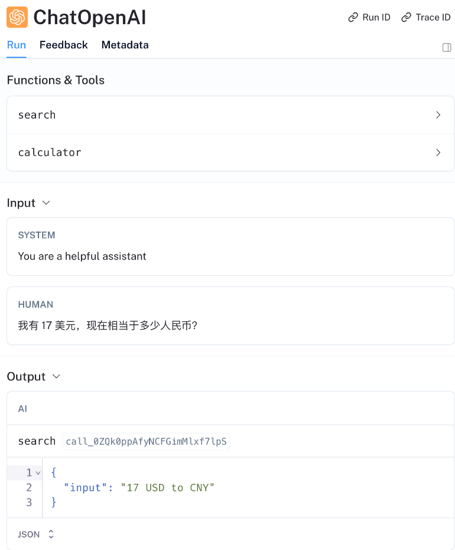

是正常的输入用户的问题，llm 返回对 serpAPI 的调用，直接请求搜索 “17 USD to CNY”。 对比 reAct 框架，在 reAct 中，我们相当于引导 llm 去一步步进行思考，逐步获取完成任务所需要的信息，所以 llm 是先查询人民币和美元的汇率，再使用计算器进行乘法运算。  
而在 openAI 中，gpt 是直接使用 serpAPI 查询最终结果。
后面就是，serpAPI 返回正常结果：

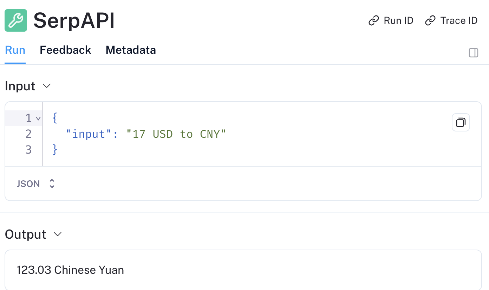

然后再次调用 llm 节点：

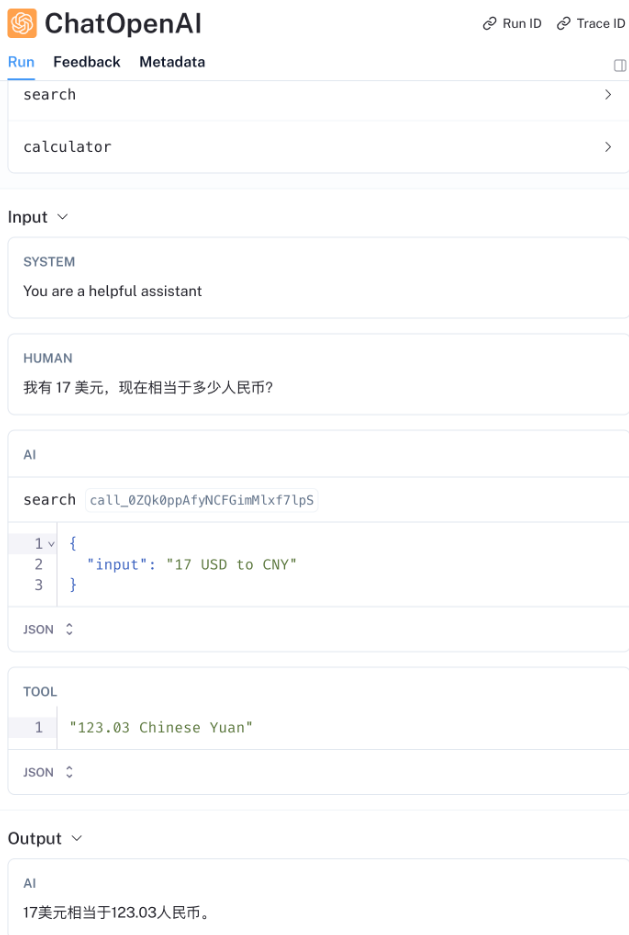

由 llm 生成最终的结果。注意，这里 AI 对 tool 的请求和 tool 的返回是由 prompt 模板中 `agent_scratchpad` 引入的，在正常的 chat history 中并不会包含 tool 调用和返回信息。  


我们可以用另一个问题再测试下，输入 “我有 10000 人民币，可以购买多少微软股票”，然后通过 lang Smith 进行观察，第一次 llm 节点调用是：

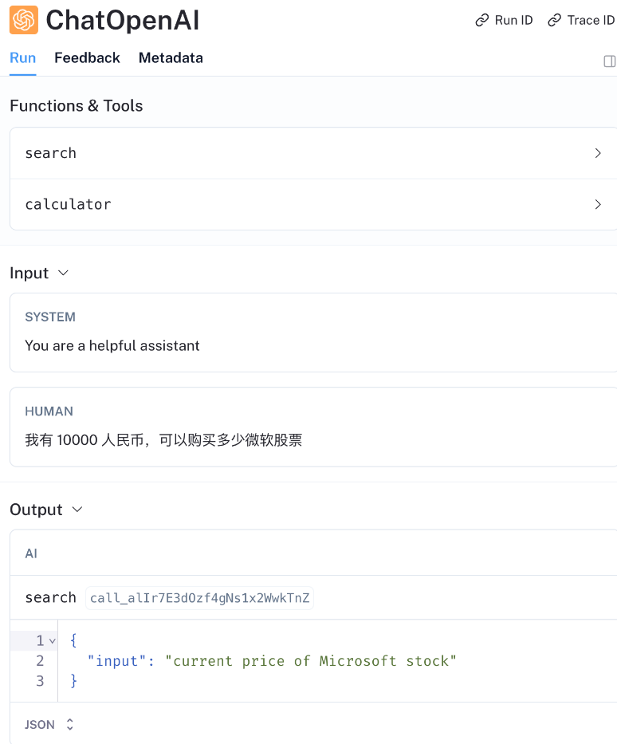

是请求 serp 搜索微软当前的股价，serp 正常返回，然后第二次 llm 节点的调用是：

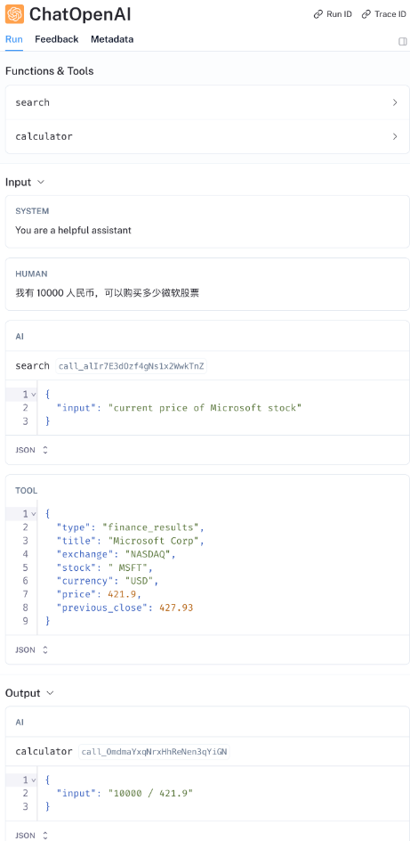

是请求 calculator 计算 10000 / 421.9。   

这里有三个需要注意的点：

1. gpt作为一个 agents，是具有自主推理并根据当前的信息去连续多次调用 tool 的能力。在 reAct 框架中，是我们让 llm 先进行推理（Thought）然后决定是否需要调用 tool （Action），而在 gpt 中这些流程是在其内部发生的。
2. 这个结果显然是错误的，gpt 并没有考虑到美元的汇率问题，单纯的硬算 10000 / 421.9
3. 以及如果你在问题中强调了美元和人民币问题，gpt 是会对股价和汇率进行依次查询，而不会同时请求两个 tool 的调用，虽然在 openai 的文档中说是支持并行的调用，这可能模型目前的缺陷。

### 自定义tool

无论是 reAct 还是 OpenAI tools 亦或是其他的 agents 框架，我们能够提供给 agents 的 tool 都影响着 agents 应用范围和效果。 除了使用 langchain 内部提供的一系列 tools 外，我们可以自定义 tool 让 agents 去使用。

目前有两种可以自定义的 tool，需要的参数都是工具的名称、描述和真实调用的函数，注意这里名称和描述将影响 llm 何时调用，所以一定是有语意的。 在函数的实现上，不要抛出错误，而是返回包含错误信息的字符串，llm 可以据此决定下一步行动。   
两种自定义的 tool 也有细微的区别：

- `DynamicTool`，只支持单一的字符串作为函数输入。因为向 reAct 框架，并不支持多输入的 tool
- `DynamicStructuredTool`，支持使用 zod schema 定义复杂的输入格式，适合在 openAI tools 中使用  

对于想在任意 agents 框架中使用的工具，可以使用 `DynamicTool` 创建只有一个输入的 tool，例如：

```ts
const stringReverseTool = new DynamicTool({
  name: "string-reverser",
  description: "reverses a string. input should be the string you want to reverse.",
  func: async (input: string) => input.split("").reverse().join(""),
});
```

更常见的是，我们可以将前面做的 RAG chain 作为工具提供给 agents，让其有更大范围调用知识和信息的能力，我们先创建一个 retriever chain

```ts
async function loadVectorStore() {
  const directory = path.join(__dirname, "../db/qiu");
  const embeddings = new OpenAIEmbeddings();
  const vectorStore = await FaissStore.load(directory, embeddings);

  return vectorStore;
}
```
```ts
import { createStuffDocumentsChain } from "langchain/chains/combine_documents"; 
import { createRetrievalChain } from "langchain/chains/retrieval";

const prompt = ChatPromptTemplate.fromTemplate(`将以下问题仅基于提供的上下文进行回答：
  上下文：
  {context}

  问题：{input}`);
const llm = new ChatOpenAI();

const documentChain = await createStuffDocumentsChain({
  llm,
  prompt,
});

const vectorStore = await loadVectorStore();
const retriever = vectorStore.asRetriever();

const retrievalChain = await createRetrievalChain({
  combineDocsChain: documentChain,
  retriever,
});

return retrievalChain;
```

`createStuffDocumentsChain` 和 `createRetrievalChain`。 前者是内置了对 Document 的处理和对 llm 的调用，后者是内置了对 retriver 的调用和将结果传入到 `combineDocsChain` 中。

然后，我们将此创建为 `DynamicTool`：

```ts
const retrieverTool = new DynamicTool({
  name: "get-qiu-answer",
  func: async (input: string) => {
    const res = await retrieverChain.invoke({ input });
    return res.answer;
  },
  description: "获取小说 《球状闪电》相关问题的答案",
});
```

然后再使用 `DynamicStructuredTool` 去创建一个复杂输入的 tool：

```ts
const dateDiffTool = new DynamicStructuredTool({
  name: "date-difference-calculator",
  description: "计算两个日期之间的天数差",
  schema: z.object({
    date1: z.string().describe("第一个日期，以YYYY-MM-DD格式表示"),
    date2: z.string().describe("第二个日期，以YYYY-MM-DD格式表示"),
  }),
  func: async ({ date1, date2 }) => {
    const d1 = new Date(date1);
    const d2 = new Date(date2);
    const difference = Math.abs(d2.getTime() - d1.getTime());
    const days = Math.ceil(difference / (1000 * 60 * 60 * 24));
    return days.toString();
  },
});
```

这里使用 zod 来定义函数输入的格式，并且 agents 在调用 tool 时，参数会经过 zod 进行校验，如果出错会直接将校验的错误信息返回给 llm，其会根据报错信息调整输入格式。   

然后，让我们尝试将这些自定义 tool 放入 agents 去试用一下，我们先用 reAct agent 去测试，因为我们更方便地观察其内部的思考和推理流程：

```ts
const tools = [retrieverTool, new Calculator()];
const prompt = await pull<PromptTemplate>("hwchase17/react");
const llm = new ChatOpenAI({
  temperature: 0,
});

const agent = await createReactAgent({
  llm,
  tools,
  prompt,
});

const agentExecutor = new AgentExecutor({
  agent,
  tools,
});
const res = await agents.invoke({
    input: "小说球状闪电中量子玫瑰的情节",
});
```

整个推理和行动过程是：

```txt
Question: 小说球状闪电中量子玫瑰的情节
Thought:这是一个关于小说《球状闪电》的问题，我需要使用get-qiu-answer工具来获取答案。
Action: get-qiu-answer
Action Input: 量子玫瑰的情节

Observation: 量子玫瑰的情节主要是关于主人公在战后与戴琳结婚并开始新的生活。他们过上了经济复苏但艰难的生活，并在一年后有了一个孩子。他们的生活被一个美国天文学家，诺顿·帕克的来访打扰，他进一步讨论了SETI@home项目，并向主人公介绍了他主持的一项球状闪电应用项目。同时，主人公回忆起他与林云在战争中侵入SETI的分布式计算服务器的过去。

在另一个段落中，主人公谈到了他与妻子一只蓝色的玫瑰花的故事。尽管他无法看见它，但是通过花瓶中的水晶以及远处窗外的夜风，他可以感知到它的存在。他期望在人生的尽头，他再一次看到这朵蓝色的玫瑰。

然后，关于量子态的讨论出现在后来的情节中，其中主人公和其他人物讨论了关于量子化、概率云、量子态等复杂的物理概念。同时，这些讨论也涉及到了主人公和林云的过去，以及他们在战争中的经历。
Thought: 我现在知道了最后的答案。
Final Answer: 量子玫瑰的情节主要是关于主人公在战后与戴琳结婚并开始新的生活。他们过上了经济复苏但艰难的生活，并在一年后有了一个孩子。他们的生活被一个美国天文学家，诺顿·帕克的来访打扰，他进一步讨论了SETI@home项目，并向主人公介绍了他主持的一项球状闪电应用项目。同时，主人公回忆起他与林云在战争中侵入SETI的分布式计算服务器的过去。

在另一个段落中，主人公谈到了他与妻子一只蓝色的玫瑰花的故事。尽管他无法看见它，但是通过花瓶中的水晶以及远处窗外的夜风，他可以感知到它的存在。他期望在人生的尽头，他再一次看到这朵蓝色的玫瑰。

然后，关于量子态的讨论出现在后来的情节中，其中主人公和其他人物讨论了关于量子化、概率云、量子态等复杂的物理概念。同时，这些讨论也涉及到了主人公和林云的过去，以及他们在战争中的经历。
```

问其他数学问题，也能正确回答：

```ts
const res = await agents.invoke({
  input: "我有 17 个苹果，小明的苹果比我的三倍少 10 个，小明有多少个苹果？",
});
```

```txt
Question: 我有 17 个苹果，小明的苹果比我的三倍少 10 个，小明有多少个苹果？
Thought:这是一个数学问题，我需要先计算出小明的苹果是我苹果的三倍，然后再减去10个。
Action: calculator
Action Input: 17*3-10

Observation: 41
Thought: 我现在知道最后的答案
Final Answer: 小明有41个苹果。
```

如果想要使用有复杂输入的 tool，例如我们前面创建的 dateDiffTool，就需要使用支持复杂输入的 agents 框架，例如 openAI tools：

```ts
const tools = [retrieverTool, dateDiffTool, new Calculator()];
const prompt = await pull<ChatPromptTemplate>("hwchase17/openai-tools-agent");

const llm = new ChatOpenAI({
  temperature: 0,
});
const agent = await createOpenAIToolsAgent({
  llm,
  tools,
  prompt,
});
const agents = new AgentExecutor({
  agent,
  tools,
})
const res = await agents.invoke({
    input: "今年是 2024 年，今年 5.1 和 10.1 之间有多少天？",
});
```
其思考过程是：
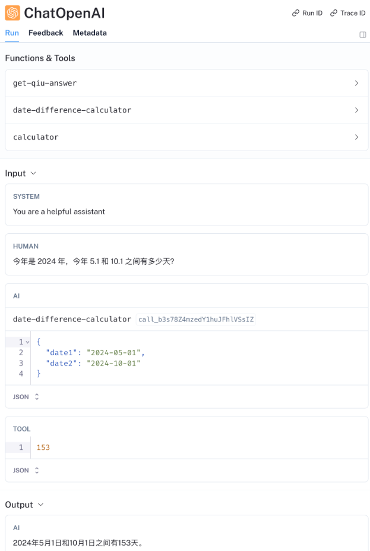

对于复杂的问题 agents 会逐步推理和应用不同的 tools 来得出最终的结果。所以 tools 的种类、能力很大程度上决定了 agents 的上限，但对于 reAct 这种框架，tools 是作为 prompt 嵌入到 llm 上下文中，所以过多的 tools 会影响用于其他内容的 prompt。 同样的，openAI tools 的描述和输入的 schema 也是算在上下文中，也受窗口大小的限制。所以并不是 tools 越多越好，而是根据需求去设计。   

跟 chain 一样，复杂 agents 可以同样采用路由的设计，由一个入口 agents 通过 tools 链接多个垂直领域的专业 agents，根据用户的问题进行分类，然后导向到对应的专业 agents 进行回答。  

在这种实现时，每个子 agents 通过 `DynamicTool` 进行定义，并且传入 `returnDirect: true`，这样会直接将该 tool 调用的结果作为结果返回给用户，而不是将 tool 的结果再次传给 llm 并生成输出。

```ts
const retrieverChain = await getRetrieverChain();
const retrieverTool = new DynamicTool({
  name: "get-qiu-answer",
  func: async (input: string) => {
    const res = await retrieverChain.invoke({ input });
    return res.answer;
  },
  description: "获取小说 《球状闪电》相关问题的答案",
  returnDirect: true,
});

const tools = [retrieverTool, new Calculator()];
const agents = await createReactAgentWithTool(tools);

const res = await agents.invoke({
  input: "用一句话，介绍小说球状闪电中，跟量子玫瑰有关的情节"
});
console.log(res);
```

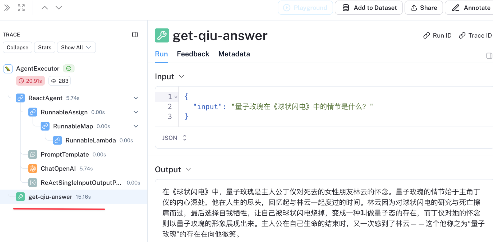

从 langSmith 的数据可以看到，当调用 `get-qiu-answer` 这个 tool 后，直接把 tool 的结果当做整个 agents 运行的最终结果返回了，而不是像前面一样再经过一次 llm 节点生成答案。所以，我们就可以利用 `returnDirect` feature，将入口的 agent 作为 route，去导向到不同领域的专业 agent，这也是多 agents 协同的一种方式。 

