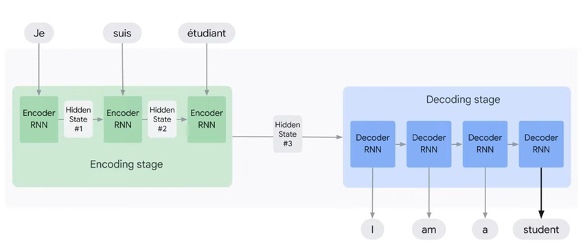
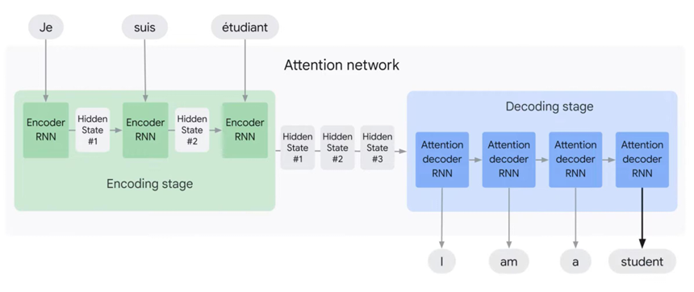
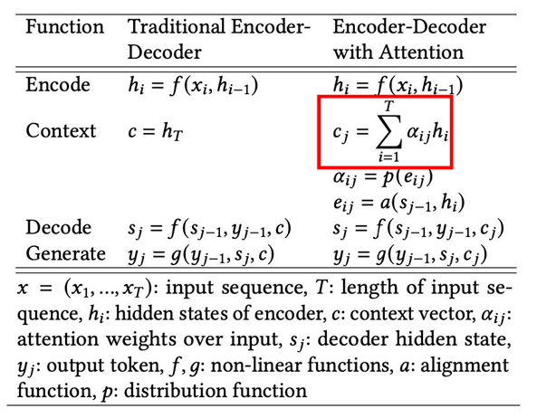
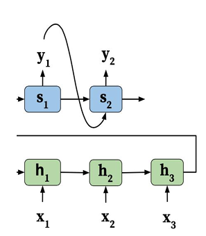
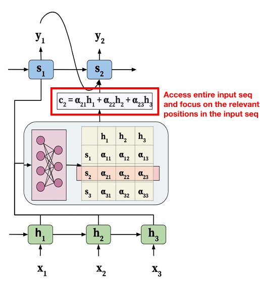
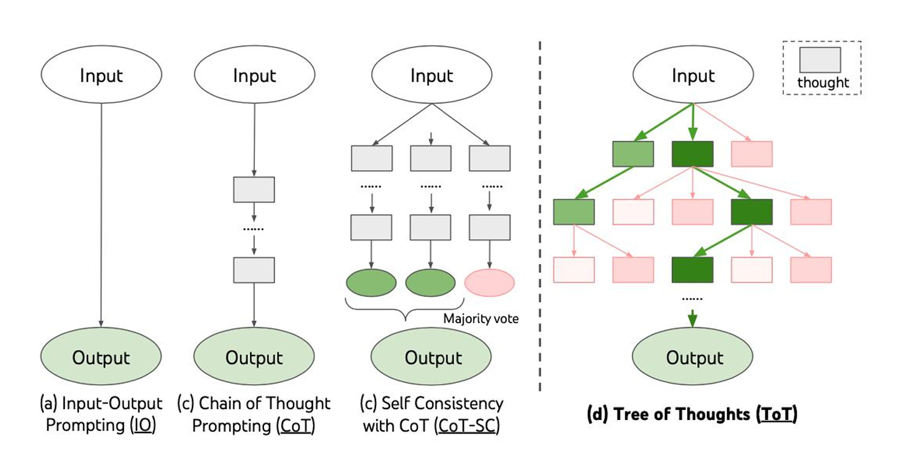
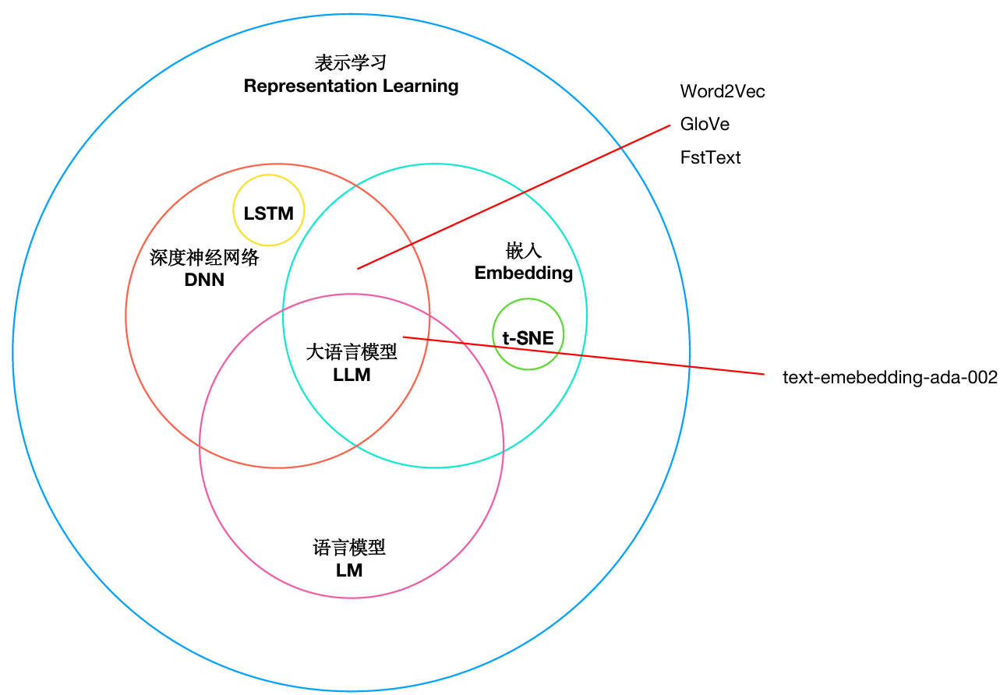

# 大模型基础

## 起源和发展

- 符号主义：着重于逻辑推理、符号操作
- 连接主义：着重于神经网络、深度学习

- 1950-1980：提出人工智能概念
- 1980-2010：垃圾邮件、专家系统
- 2010-2020：深度学习
- 2020-至今：大模型

## 注意力机制

### 编码-解码架构(序列到序列模型)



上图是编码-解码架构，`"Je"`通过RNN编码成向量，也就是这里的`Hidden State #1`,然后`"suis"`通过RNN编码成向量，也就是这里的`Hidden State #2`,然后`"etudiant"`通过RNN编码成向量，也就是这里的`Hidden State #3`,然后通过解码器RNN将这些向量解码成最终的输出。

上面的过程中值得注意的是，`#1`，`#2`，`#3`这三个向量是依次传递的。也就是1传给2,2包含了1的信息，2传给3,3包含了1和2的信息。

上面的这种模式是一个词一个词的去传递，那么在信息传递的时候，会丢失很多上下文信息。

而注意力机制的出现就是为了解决这个问题。它不是依次传递，而是同时传递。
也就是1传递给2传递给3传到解码器同时2从传递给3传递到解码器，3也传递到解码器
](image-1.png)

### 编码解码架构模型

案例：

```txt
T: "昨天，我在一个繁忙的一天结束后，决定去我最喜欢的咖啡店放松一下。我走进咖啡店， 点了一杯拿铁，然后找了一个靠窗的位置坐下。我喝着咖啡，看着窗外的人们匆匆忙忙， 感觉非常惬意。然后，我从咖啡店出来，回到了家中。" 结合一个具体的场景吧 就比如我现在有一段文字："昨天，我在一个繁忙的一天结束后，决定去我最喜欢的咖啡店放松一下。我走进咖啡店， 点了一杯拿铁，然后找了一个靠窗的位置坐下。我喝着咖啡，看着窗外的人们匆匆忙忙， 感觉非常惬意。然后，我从咖啡店出来，回到了家中。"

Q: 我去了几次咖啡店
```



传统的编码解码架构模型是这样的：



注意力机制的编码解码架构模型是这样的：



`α`：就是注意力权重，这个权重是由当前问题或解码状态驱动的，因此会随着问题的变化而动态调整。(在上述的例子当中，就是根据问题"我去了几次咖啡店"，来动态调整注意力权重，从而使得模型能够更加关注与问题相关的部分。)

`h`：原文中某一小段文字的语义表示，也就是编码器输出的隐藏状态。(原文会被切成很多个小段，每个小段的语义表示就是这个隐藏状态。其实就是把这些小段通过编码器转换成向量。)

`s`：当前我在问什么 / 想要什么信息，也就是解码器输出的隐藏状态。(解码器的输出也是一个向量，这个向量的维度和编码器的输出是一样的。其实就是把问题切成很多个小段，每个小段的语义表示就是这个隐藏状态。其实就是把这些小段通过解码器转换成向量。)

`c`：为回答当前问题，从原文中挑出来的关键信息总结。(当前问题是`去了几次咖啡店？`注意力全部放在`决定去咖啡店`,`我走进咖啡店`,c的语义就是`这个人只发生过一次完整的去咖啡店行为`,本质上就是对于某个解码器隐藏状态，原文中所有隐藏状态的加权平均。)

**这里有个形象的类比**：h就是一起案件的原始资料，s就是要破开这个案子的一些关键要解决的问题，c就是这些关键问题答案的原始资料里面的论据，α就是这些论据的权重，哪个论据对于整个问题更有帮助，就给哪个论据更高的权重。

### 优势

1. 解决传统编码器-解码器模型的挑战，避免信息损失和无法建模输入输出对齐的问题。
2. 自动学习注意力权重，捕捉编码器和解码器之间的相关性。
3. 提高模型性能，改善输出质量，并提供更好的解释性。
4. 构建上下文向量，使解码器能够全面访问输入序列并重点关注相关部分。
5. 允许解码器访问整个编码的输入序列，通过注意力权重选择性地关注相关信息。

## Transformer架构

## Prompt learning

下图是整个提示训练的一些发展。



### in-context/prompt learning&prompt Tuning

- **Prompt learning**：是一种使用预训练语言模型的方法，它不会修改模型的权重。在这种方式下，模型被给予一个提示，这个提示就是模型输入的一部分，它指导模型产生特定类型的输出。这个过程不涉及对模型的权重修改，而是利用了模型在预训练阶段想学习到的知识和能力。

- **In-context learning**：模型处理一系列输入，使用前面的输入输出作为处理后续输入的上下文。这是Transformer模型的一种基本特性。这个过程也不设计到都模型权重的修改

- **Prompt tuning**：又被称为"prompt engineering"，是一种`优化技术`，它涉及到寻找或生成最能够最大限度提高模型性能的提示。这可能涉及到启发式方法、人工智能搜索算法，或者甚至是人工选择和优化提示。Prompt tuning的目标是找到一种方式，使得给定这个提示时，模型能够生成最准确、最相关的输出。

### Chain-of-Thought(CoT)

CoT prompting(思维链提示)有如下几个特点：

- 首先，COT允许模型将多步5问题分解为中间步骤，这就意味着可以将额外计算资源分配给需要更多推理步骤的问题
- 其次，CoT提供了对模型行为的可解释窗口，特使它可能是如何得出特定答案的，并提供了调试推理路径错误的机会
- 在数学应用题、常识推理和符号操作等任务中都可以食用思维链推理(CoT Reasoning)，并在原则上适用于任何人类能够通过语言解决的任务
- 在足够大规模线程语言模型中很容易引发CoT Reasoning，只需在少样本提示示例中包含一些连贯思路序列即可

**问题**：标准的prompt上下文出现不相关信息或者误导会导致回答错误，而CoT prompt则可以避免这样的问题

1. 对于小模型来说，CoTPrompting无法带来性能提升，基至可能带来性能的下降。
2. 对于大模型来说，CoTPrompting涌现出了性能提升。
3. 对于复杂的问题，CoTPrompting能获得更多的性能收益。

所以可以在提问的时候加上(`Think Step-by-step`)

### Self-Consistency 多路径推理

自洽性(Self-Consistency) 多路径推理：其实就是对于一个问题拿出多种解决方案，最后按照一定方式对结果进行合并得到最终的结果。这种思想与CoT结合使用


### Tree-of-Thought(ToT)

Tree-of-Thought(思维树)

1. 思维分解：比如对于一个24点游戏而言，有输入:`"四个数字"`，输出：`"输出结果为24"`，思考过程：`三个方程(13-9=4;10-4==6;4*6=24)`。这个思考过程的就是分解出来的思维，一个思维应该足够"小"(例如写作这个需求，思维就是直接生成整本书，这种思维太"大"而无法连贯)，但同时又要足够"大"(太"小"会导致无法评估)

2. 思维生成：定义思维生成器G(pθ,s,k)，给定一个树状态 s = [x, z1···i]，两种策略来为下一个思维步骤生成k个候选项：
    - 例如24点这种游戏就是逐个去取
    - 写作这种采用独立同分布的抽样

3. 状态评估

4. 搜索算法：广度优先搜索(ToT-BFS)/深度优先搜索(ToT-DFS)

## Representation Learning

Representation Learning(表示学习)和Embedding(嵌入)是密切相关的概念，他们可以被视为在不同领域中对同一概念的不同命名或某描述

 - 表示学习：通过学习算法自动从原始数据中学习到一种表示形式或特征表示，改表示形式能够更好地表达数据中的重要特征和结构

 - 嵌入：表示学习的一种形式，通常用于将高维数据映射到低维空间中的表示。嵌入的目的就是将高维数据转换为低维空间中的向量，使得这些向量的距离能够反映原始数据之间的相似性或相关性(哪怕损失点精度)。


**PS：**如果维度太高，训练出来的结果我们很难理解，所以我们需要将维度降到一定程度，这样我们就可以理解这个向量代表了什么。于是我们有了Embedding这个技术。

### Embedding

Embedding 的价值：
- 降维：Embedding 能够将高维数据映射到低维空间，从而减少计算和存储成本。
- 捕捉语义关系：Embedding 能够捕捉数据之间的语义相似性，例如在文本处理中，相似的单词会被映射到相近的向量空间。
- 适应性：Embedding 能够根据数据的特点自动调整映射，使得不同领域的数据都能够得到有效的表示。
- 泛化能力：Embedding 能够提高模型的泛化能力，使得模型在未见过的数据上也能有较好的表现。
- 可解释性：Embedding 能够提供一种直观的方式来理解数据，例如通过可视化嵌入空间中的向量来观察数据的结构(工具：t-SNE)。


Embedding的种类：

- Word Embedding：将单词映射到低维空间中的向量，例如Word2Vec、GloVe等。捕捉语义和句法关系。
    - 语义表示和语义相似度
    - 词语关系和类比推理
    - 上下文理解
    - 文本分类和情感分析
    - 机器翻译和生成模型
- Image Embedding：将图像映射到低维空间中的向量，例如CNN、Autoencoders等。捕捉图像的特征和结构。
- Graph Embedding：将图结构数据映射到低维空间中的向量，例如Node2Vec、GraphSAGE等。捕捉图的结构和节点之间的关系。


### Embedding vs Language Model



- Word Embedding：它是静态的，主要是捕获单词的语义和句法信息，但不具备生成文本的能力。
- Language Model：它是动态的，是预测词序列的概率模型，主要是理解和生成文本。