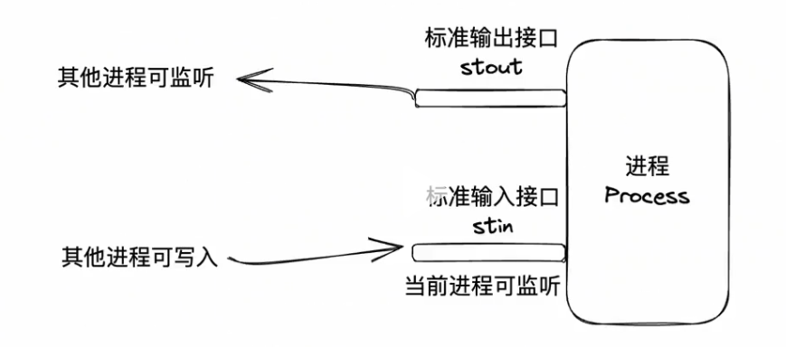
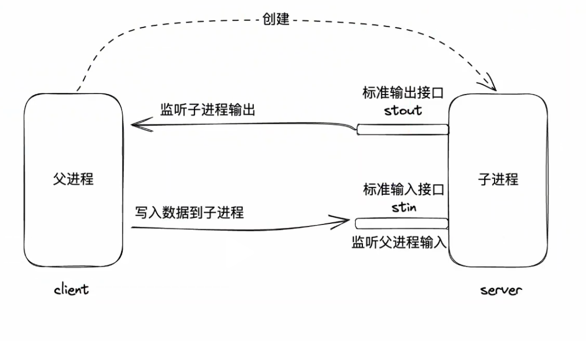
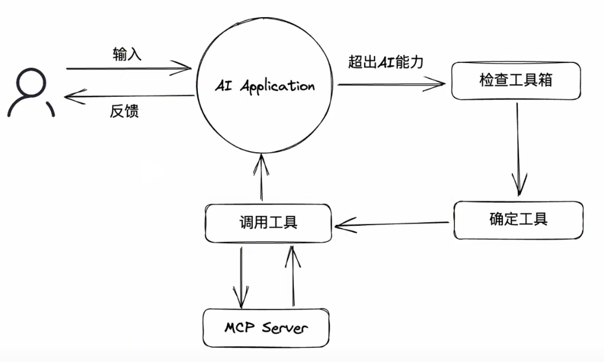
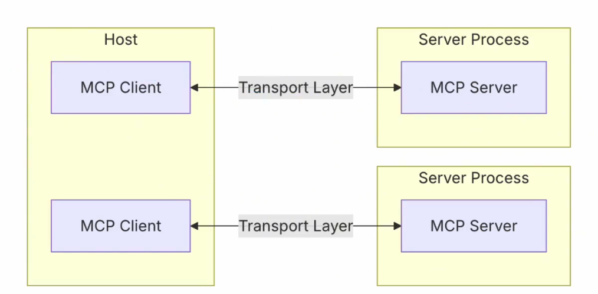

<!--
 * @Author: mzmm403
 * @description: Where there is a will there is a way
-->

# MCP

## MCP-Server

### 前置知识

#### 通信方式：stdio

> 怎么给你发
> stdio: standard input and output





stdio通信高效、简洁，但仅适用于本地通信

#### 通信格式：JSON-RPC

> 发的是什么

request

```json
{   
    // jsonrpc的版本号
    "jsonrpc": "2.0",
    // 请求的方法
    "method": "sum",
    // 请求的参数
    "params": {
        "a":5,
        "b":6
    },
    // 请求的id，用于匹配响应和请求
    "id": 1
}
```

response

```json
{
    "jsonrpc": "2.0",
    // 响应的结果
    "result": 11,
    // 请求的id，用于匹配响应和请求
    "id": 1
}
```

### 创建MCP-Server

**创建mcp-server实例**

```js
import { McpServer } from '@modelcontextprotocol/sdk/server/mcp.js'
import { StdioServerTransport } from '@modelcontextprotocol/sdk/server/stdio.js'

// 创建 MCP Server
const server = new McpServer({
  name: 'my-mcp-server',           // 内部唯一标识
  title: 'My MCP Server',          // 可读标题
  description: 'A demo MCP server',// 描述
  version: '1.0.0'                 // 版本号
})
```

**确定通信方式**

```js
// 本地标准输入输出
const transport = new StdioServerTransport()
server.start(transport)

// 远程http
import { HttpServerTransport } from '@modelcontextprotocol/sdk/server/http.js'

const transport = new HttpServerTransport({ port: 3000 })
server.start(transport)
```

### MCP-Tool

> MCP是一套标准协议，它规定了应用程序之间如何通讯

- 通信方式
    - stdio: 推荐，高效、简洁、本地
    - http： 可远程

- 通讯格式： 基于JSON-RPC的进一步规范

官网地址： https://modelcontextprotocol.org/specification


#### 基本规范

1. 初始化 `initialize`
`request`

```json
{
    "jsonrpc": "2.0",
    "id": 1,
    "method": "initialize",
    "params": {
        // mcp的版本
        "protocolVersion":"2024-11-05",
        "capabilities": {
            "roots":{
                "listChanged":true
            },
            "sampling": {},
            "elicitation": {}
        },
        "clientInfo": { //告知服务器客户端信息
            "name": "Example Client",
            "title": "Example Client Display Name",
            "version": "1.0.0"
        }
    }
}
```

`response`

```json
{
    "jsonrpc": "2.0",
    "id": 1,
    "result": {
        "protocolVersion": "2024-11-05",
        "capabilities": {
            "logging": {},
            "prompts": {
                "listChanged": true
            },
            "resources": {
                "subscribe": true,
                "listChanged": true
            },
            "tools":{
                "listChanged": true
            }
        },
        "serverInfo": { // 服务端信息
            "name": "Example Server",
            "title": "Example Server Display Name",
            "version": "1.0.0"
        },
        "instructions": "Optional instructions for the client."
}
```

2. 工具发现`tools/list`
服务器有哪些工具函数可以供客户端调用

`request`
```json
{
    "jsonrpc": "2.0",
    "id": 1,
    "method": "tools/list",
    "params": {}
}
```

`response`

```json
{
    "jsonrpc": "2.0",
    "id": 1,
    "result": {
        "tools": [
            {
                "name": "sum",
                "title": "Sum",
                "description": "Sum two numbers",
                "inputSchema": {
                    "type": "object",
                    "properties": {
                        "a": { "type": "number" },
                        "b": { "type": "number" }
                    },
                    "required": ["a", "b"]
                }
            }
        ]
    }
}
```

3. 调用工具函数`tools/call`

`request`

```json
{
    "jsonrpc": "2.0",
    "id": 2,
    "method": "tools/call",
    "params": {
        "toolName": "sum",
        "args": { "a": 5, "b": 6 }
    }
}
```

`response`

```json
{
    "jsonrpc": "2.0",
    "id": 2,
    "result": {
        "content": [{
            "type": "text",
            "value": "11"
        }]
    }
}
```
调用的结果需要放在`result.content`中，同时content是个数组，因为结果可能是多个。
函数结果支持的类型：https://modelcontextprotocol.org/specification/2025-11-25/server/tools#tool-result

#### MCP Server的调试工具

直接运行

```bash
npx @modelcontextprotocol/inspector
```
在用调试工具的时候要注意一点，就是我们在使用命令的时候注意目录，目录对应的服务端的目录要和调试工具的目录一致，不然会找不到服务端。


可以打开一个客户端
#### MCP SDK实现Tool

使用`@modelcontextprotocol/sdk`可以方便的开发MCP Server

```bash
npm i @modelcontextprotocol/sdk
npm i zod
```

我们使用SDK来写一个简单的MCP Server

```js
import { z } from 'zod';
import fs from 'fs'
import { McpServer } from '@modelcontextprotocol/sdk/server/mcp.js';

import { StdioServerTransport } from '@modelcontextprotocol/sdk/server/stdio.js';

// 创建一个MCP服务端实例
const server = new McpServer({
    name: 'test-server',
    title: 'test-server',
    description: 'test-server',
    version: '1.0.0'
})

// 注册工具
server.registerTool(
    'sum', //函数名
    {
        title: '两数求和', //函数标题
        description: '得到两个数的和', //函数描述
        inputSchema: {
            a: z.number().describe('第一个数'), //输入参数a的类型
            b: z.number().describe('第二个数'), //输入参数b的类型
        },
    },
    // 定义函数逻辑
    ({a,b}) => {
        return {
            content:[
                {
                    type: 'text',
                    text:`两数求和结果：${a+b}`
                }
            ]
        }
    }
)

server.registerTool(
    'createFile',
    {
        title: '创建文件',
        description: '按照路径创建文件，将内容写入文件',
        inputSchema: {
            filename: z.string().describe('文件路径'),
            content: z.string().describe('写入内容')
        },
    },
    ({filename, content}) => {
        try {
            fs.writeFileSync(filename, content)
            return {
                content:[
                    {
                        type: 'text',
                        text:`文件创建成功`
                    }
                ]
            }
        } catch (error) {
            return {
                content:[
                    {
                        type: 'text',
                        text:`文件创建失败：${error}`
                    }
                ]
            }
        }
    }
)

//选择一种通信方式
const transport = new StdioServerTransport()

// 服务端启动，用选择的通信方式
server.connect(transport)
```

这里调试代码的时候注意不要使用`console log`，这样会导致输出污染，可以使用`console.error`或者使用SDK的日志功能。


### MCP-Resource

> Resource 是 MCP Server 提供给客户端的数据资源。与 Tool 不同，Resource 不执行操作，只提供数据。

```txt
Tool      = 执行动作（写文件 / 调 API）
Resource  = 提供数据（文档 / 文件 / 数据库 / 配置）
```

典型使用场景：

- 项目文档
- 数据库查询结果
- 文件内容
- API数据
- RAG知识库

官网说明：
https://modelcontextprotocol.org/specification


#### 基本规范

Resource主要涉及3个接口：

- `resources/list`：列出所有资源
- `resources/read`：读取资源内容
- `resources/subscribe`(可选)：订阅资源变化（可选）

1. 资源发现resources/list

`request`

```json
{
    "jsonrpc": "2.0",
    "id": 1,
    "method": "resources/list",
    "params": {}
}
```

`response`

```json
{
    "jsonrpc": "2.0",
    "id": 1,
    "result": {
        "resources": [
            {
                "uri": "file://readme",
                "name": "readme",
                "title": "项目说明文档",
                "description": "项目README文档",
                "mimeType": "text/plain"
            }
        ]
    }
}
```

字段说明

| 字段          | 说明     |
| ----------- | ------ |
| uri         | 资源唯一标识 |
| name        | 资源名称   |
| title       | 资源标题   |
| description | 资源描述   |
| mimeType    | 资源类型   |


2. 读取资源 resources/read

`request`

客户端通过`uri`读取资源内容。

```json
{
    "jsonrpc": "2.0",
    "id": 2,
    "method": "resources/read",
    "params": {
        "uri": "file://readme"
    }
}
```

`response`

```json
{
    "jsonrpc": "2.0",
    "id": 2,
    "result": {
        "contents": [
            {
                "uri": "file://readme",
                "mimeType": "text/plain",
                "text": "这是项目的README文档"
            }
        ]
    }
}
```

3. 订阅资源资源变化 resources/subscribe（可选）

```txt
Client
  │
  │ resources/subscribe
  ▼
Server
  │
  │ (资源变化)
  ▼
Server
  │
  │ resources/updated
  ▼
Client
  │
  │ resources/read
  ▼
Client得到最新数据
```

`request`

```json
{
    "jsonrpc": "2.0",
    "id": 3,
    "method": "resources/subscribe",
    "params": {
        "uri": "file://readme"
    }
}
```
当资源发生变化时，服务器会发送：

`notification`

```json
{
    "jsonrpc": "2.0",
    "method": "resources/updated",
    "params": {
        "uri": "file://readme"
    }
}
```


返回格式result.contents是一个数组，因为一个资源可能包含多个内容。

支持的类型：https://modelcontextprotocol.org/specification/2025-11-25/server/resources#resource-contents


#### Resource URI设计

Resource使用**URI作为唯一标识**。

常见设计方式：

**文件资源**
```txt
file://readme
file://src/index.js
```

**数据资源**

```txt
data://users
db://orders
```

**API资源**
```txt
api://weather
api://github/issues
```

**项目资源**

```txt
project://docs
project://structure
```

这里的URI设计原则类似http

```txt
协议://资源路径
```

#### MCP SDK实现Resource

```bash
npm i @modelcontextprotocol/sdk
npm i zod
```

示例：提供一个README资源

```js
import fs from 'fs'
import { McpServer } from '@modelcontextprotocol/sdk/server/mcp.js'
import { StdioServerTransport } from '@modelcontextprotocol/sdk/server/stdio.js'

// 创建MCP Server实例
const server = new McpServer({
    name: 'resource-server',
    title: 'resource-server',
    description: 'resource-server',
    version: '1.0.0'
})

// 注册资源
server.registerResource(
    'readme', //资源名
    'file://readme', //资源URI
    {
        title: '项目README',
        description: '项目说明文档',
        mimeType: 'text/plain'
    },
    async () => {
        const content = fs.readFileSync('./README.md','utf-8')

        return {
            contents:[
                {
                    uri:'file://readme',
                    mimeType:'text/plain',
                    text:content
                }
            ]
        }
    }
)

const transport = new StdioServerTransport()

server.connect(transport)
```

订阅资源变化：

```js
import { McpServer } from "@modelcontextprotocol/sdk/server/mcp.js";
import fs from "fs"

const server = new McpServer({
    name: "resource-server",
    version: "1.0.0"
},{
    capabilities:{
        resources:{
            subscribe:true
        }
    }
})

server.registerResource(
    "readme",
    "file://readme",
    {
        title:"README",
        description:"项目说明",
        mimeType:"text/plain"
    },
    async ()=>{
        const text = fs.readFileSync("./README.md","utf-8")

        return {
            contents:[
                {
                    uri:"file://readme",
                    mimeType:"text/plain",
                    text
                }
            ]
        }
    }
)

fs.watch("./README.md",()=>{
    
    server.server.notification({
        method:"resources/updated",
        params:{
            uri:"file://readme"
        }
    })
})

const transport = new StdioServerTransport()

server.connect(transport)
```

#### 订阅的一些真实案例

```ts
// 数据库订阅
db.on("userCreated",()=>{
    server.server.notification({
        method:"resources/updated",
        params:{
            uri:"db://users"
        }
    })
})

// 知识库update
vectorStore.on("update",()=>{
    server.server.notification({
        method:"resources/updated",
        params:{
            uri:"kb://docs"
        }
    })
})

// 项目结构
chokidar.watch("./src").on("change",()=>{
    server.server.notification({
        method:"resources/updated",
        params:{
            uri:"project://structure"
        }
    })
})
```

#### resources的真实案例

设计架构

```txt
AuditResource
├── Inputs
│   ├── repo_url           # 仓库地址
│   ├── branch             # 分支（可选）
│   ├── scan_config        # semgrep 配置或 RAG 配置
├── State
│   ├── tmp_dir            # 临时工作目录
│   ├── lock_files         # package-lock.json / pom.xml dependency tree
│   ├── audit_results      # js/ts/java/php 审计结果
│   ├── rag_index          # RAG 向量索引
├── Tools
│   ├── fetch_repo         # 拉取远程仓库
│   ├── parse_dependencies # 生成 lock 文件
│   ├── run_audit          # 调用 npm/OWASP/composer/semgrep
│   ├── rag_filter         # 基于 RAG 过滤结果
│   └── save_db            # 汇总存入数据库
├── Outputs
│   ├── audit_summary      # JSON 汇总结果
│   └── frontend_payload   # 渲染用数据
```
整个resources设计类似与pinia这样的状态管理库，实际上的架构中mcp的tool模块实际上是在resources模块中进行管理的


```js
// server.js
const { MCPServer, Resource } = require("@modelcontextprotocol/sdk");
const fs = require("fs");
const path = require("path");
const { execSync } = require("child_process");
const { v4: uuidv4 } = require("uuid");

// ----------------------------
// 定义 Resource
// ----------------------------
class AuditResource extends Resource {
  // 创建 Resource 时初始化状态
  async onCreate(input) {
    const tmpDir = path.join("/tmp", `audit-${uuidv4()}`);
    fs.mkdirSync(tmpDir, { recursive: true });

    this.state = {
      tmpDir,
      lockFiles: {},
      auditResults: {},
    };

    this.input = input; // 保存输入
    return { message: "Resource created", tmpDir };
  }

  // Tool: 拉取远程仓库
  async fetchRepo() {
    const { repoUrl, branch = "main" } = this.input;
    const { tmpDir } = this.state;

    execSync(`git clone --branch ${branch} ${repoUrl} ${tmpDir}`, {
      stdio: "inherit",
    });

    return { message: "Repo cloned", path: tmpDir };
  }

  // Tool: 生成 lock 文件（Node 示例）
  async parseDependencies() {
    const { tmpDir } = this.state;
    const packageJsonPath = path.join(tmpDir, "package.json");

    if (!fs.existsSync(packageJsonPath)) {
      throw new Error("package.json not found, cannot parse dependencies");
    }

    // 生成 package-lock.json
    execSync("npm install --package-lock-only", { cwd: tmpDir, stdio: "inherit" });

    const lockPath = path.join(tmpDir, "package-lock.json");
    this.state.lockFiles["package"] = lockPath;

    return { message: "Lock file generated", path: lockPath };
  }

  // Tool: 执行 npm audit
  async runAudit() {
    const { tmpDir } = this.state;

    // 获取审计 JSON
    const auditOutput = execSync("npm audit --json", { cwd: tmpDir });
    const auditJson = JSON.parse(auditOutput.toString());

    this.state.auditResults["npm"] = auditJson;

    return { message: "Audit finished", results: auditJson };
  }

  // Tool: 清理临时目录
  async cleanup() {
    const { tmpDir } = this.state;
    fs.rmSync(tmpDir, { recursive: true, force: true });
    return { message: "Temporary directory cleaned" };
  }

  // 获取 Outputs
  async getSummary() {
    return {
      lockFiles: this.state.lockFiles,
      auditResults: this.state.auditResults,
    };
  }
}

// ----------------------------
// 启动 MCP Server
// ----------------------------
const server = new MCPServer({
  port: 3000,
});

server.registerResource("AuditResource", AuditResource);

server.start().then(() => {
  console.log("MCP Server running on port 3000");
});
   
```

#### Resource 的常见封装模式

1. 输入 (Inputs)
    - Resource 初始化时的参数
    - 比如仓库 URL、分支、扫描配置等
    - 相当于对象的构造参数

2. 状态 (State)
    - 临时目录、lock 文件、审计结果、RAG 索引等
    - 保持 Resource 的生命周期内数据
    - 支持并发多个 Resource 时互不干扰

3. 工具 (Tools)
    - Resource 内的方法，操作 State 或执行逻辑
    - 可以调用系统命令、做计算、生成数据
    - 每个 Tool 独立，但共享同一个 Resource 状态

4. 输出 (Outputs)
    - Resource 对外提供的数据
    - 可以是最终汇总、前端渲染用 payload
    - 可以通过 resources/read 或者订阅事件获取

5. 生命周期管理
    - 创建 → 使用工具 → 获取输出 → 销毁
    - 资源销毁时自动清理临时文件或状态

#### 封装的好处

- **复杂流程管理**：多步骤、多工具调用、多中间产物 → 封装 Resource 管理状态和生命周期，比单独 tool 更安全
- **并发安全**：每个 Resource 独立临时目录和状态，不同扫描不会互相覆盖
- **前端调用简化**：Electron 或 Web 前端只操作 Resource ID，调用 Tools / 获取 Outputs，无需关心中间细节
- **订阅和事件驱动**：Resource 可以发布状态变化事件，前端实时更新进度或结果
- **复用性高**：一个 Resource 可以组合多个工具，也可以重复调用工具而不破坏状态


### MCP-Prompts

> Prompts 是 MCP Server 提供的一种“提示模板能力”
> 它允许服务器向客户端暴露 可复用的 Prompt 模板，客户端可以 发现、获取并填充变量 来构造 Prompt。

简单理解:

| 类型        | 作用           |
| --------- | ------------ |
| tools     | 执行函数         |
| resources | 提供数据         |
| prompts   | 提供 prompt 模板 |

Prompts 的定位更像：service层，客户端可以动态获取 Prompt 模板，而不是把 Prompt 写死在代码里。

#### 基本规范

Prompts 模块主要有三个步骤：

1. 获取有哪些prompt
2. 获取某个prompt
3. 填充变量生成prompt

对应到JSON-RPC的规范就是

- prompts/list：发现有哪些prompt
- prompts/get：获取某个prompt模版

1. Prompt 发现 prompts/list

`request`

```json
{
    "jsonrpc": "2.0",
    "id": 1,
    "method": "prompts/list"
}
```

`response`

```json
{
    "jsonrpc": "2.0",
    "id": 1,
    "result": {
        "prompts": [
            {
                "name": "translate",
                "title": "翻译助手",
                "description": "翻译文本",
                "arguments": [
                    {
                        "name": "text",
                        "description": "需要翻译的文本",
                        "required": true
                    },
                    {
                        "name": "target_lang",
                        "description": "目标语言",
                        "required": true
                    }
                ]
            }
        ]
    }
}
```
字段解释:
| 字段          | 说明       |
| ----------- | -------- |
| name        | prompt名称 |
| title       | 标题       |
| description | 描述       |
| arguments   | 输入参数     |

2. 获取某个prompt prompts/get

`request`

```json
{
    "jsonrpc": "2.0",
    "id": 2,
    "method": "prompts/get",
    "params": {
        "name": "translate",
        "arguments": {
            "text": "你好",
            "target_lang": "English"
        }
    }
}
```

`response`

```json
{
    "jsonrpc": "2.0",
    "id": 2,
    "result": {
        "messages": [
            {
                "role": "system",
                "content": {
                    "type": "text",
                    "text": "你是一个专业翻译官"
                }
            },
            {
                "role": "user",
                "content": {
                    "type": "text",
                    "text": "请把这句话翻译成English：你好"
                }
            }
        ]
    }
}
```
返回的核心是：messages
它和 LLM聊天格式完全一致，分为system，user，assistant三种角色，其中system是固定的，user和assistant是根据输入参数动态生成的。

返回的数据是Prompt messages格式，同样content内部的类型也有多种
官方文档：https://modelcontextprotocol.org/specification/2025-11-25/server/prompts#promptmessage

#### Prompts 的作用

1. Prompt 复用

传统方式：
```js
const prompt = `
你是一个翻译官
请把这句话翻译成英文
`
```
写死在代码里面，而MCP Prompt 由 Server 统一管理Client 动态获取

2. Prompt 标准化

Prompt 可以：统一维、护统一版本、统一更新

3. Agent 共享 Prompt

多个`Agent`可以使用同一个 Prompt。

#### MCP SDK 注册 Prompt

```bash
npm i @modelcontextprotocol/sdk
npm i zod
```

示例：注册一个Prompt

```js
import { z } from "zod"
import { McpServer } from "@modelcontextprotocol/sdk/server/mcp.js"
import { StdioServerTransport } from "@modelcontextprotocol/sdk/server/stdio.js"

const server = new McpServer({
    name: "prompt-server",
    version: "1.0.0"
})

server.registerPrompt(
    "translate",
    {
        title: "翻译助手",
        description: "翻译文本",
        argsSchema: {
            text: z.string().describe("需要翻译的文本"),
            target_lang: z.string().describe("目标语言")
        }
    },
    ({ text, target_lang }) => {
        return {
            messages: [
                {
                    role: "system",
                    content: {
                        type: "text",
                        text: "你是一个专业翻译官"
                    }
                },
                {
                    role: "user",
                    content: {
                        type: "text",
                        text: `请把这句话翻译成${target_lang}：${text}`
                    }
                }
            ]
        }
    }
)

const transport = new StdioServerTransport()

server.connect(transport)
```

### MCP-Sampling

> Sampling 是 MCP 中一个比较特殊的能力，它允许 MCP Server 反向调用客户端的 LLM 能力。

如下所示流向
- Tool：Client → Server 调用函数
- Sampling：Server → Client 请求 LLM 生成

典型场景：
- Server需要LLM进行文本生成
- Server需要LLM做总结
- Server需要LLM做分类
- Server需要LLM生成代码

很多时候 Server 不一定自己集成LLM。

#### 基本规范

完整流程：
1. Client 初始化
2. Server声明支持 sampling
3. Server发送sampling/createMessage
4. Client调用LLM
5. Client返回生成结果

流程图如下

```txt
Server
   │
   │ sampling/createMessage
   ▼
Client
   │
   │ 调用LLM
   ▼
LLM
   │
   │ 返回生成内容
   ▼
Client
   │
   │ 返回结果
   ▼
Server
```

1. initialize 初始化，能力声明

```json
{
    "jsonrpc": "2.0",
    "id": 1,
    "method": "initialize",
    "params": {
        "protocolVersion": "2024-11-05",
        "capabilities": {
            "sampling": {}
        },
        "clientInfo": {
            "name": "Example Client",
            "version": "1.0.0"
        }
    }
}
```
Server返回：
```json
{
    "capabilities": {
        "sampling": {}
    }
}
```

2. Server 通过 sampling/createMessage 请求客户端生成内容。

`request`

```json
{
  "jsonrpc": "2.0",
  "id": 1,
  "method": "sampling/createMessage",
  "params": {
    "messages": [
      {
        "role": "user",
        "content": [
          {
            "type": "text",
            "text": "请总结MCP协议"
          }
        ]
      }
    ],
    "maxTokens": 100
  }
}
```

参数说明：
| 字段        | 说明               |
| --------- | ---------------- |
| messages  | 对话消息             |
| role      | user / assistant |
| content   | 输入内容             |
| maxTokens | 最大token数         |

客户端调用LLM后返回：

```json
{
  "jsonrpc": "2.0",
  "id": 1,
  "result": {
    "role": "assistant",
    "content": [
      {
        "type": "text",
        "text": "MCP是一种AI工具调用协议..."
      }
    ]
  }
}
```

官方支持的数据类型：https://modelcontextprotocol.org/specification/2025-11-25/client/sampling#data-types


#### MCP SDK 实现 Sampling

```bash
npm install @modelcontextprotocol/sdk
npm install zod
```

##### Sampling 在 Server 中的使用

```js
import { McpServer } from "@modelcontextprotocol/sdk/server/mcp.js";
import { StdioServerTransport } from "@modelcontextprotocol/sdk/server/stdio.js";
import { z } from "zod";

// 创建 MCP Server
const server = new McpServer({
  name: "sampling-demo-server",
  title: "Sampling Demo Server",
  version: "1.0.0",
  description: "演示如何在Tool中使用Sampling"
});


// 注册一个 Tool
server.registerTool(
  "summary",
  {
    title: "文本总结",
    description: "使用客户端LLM总结文本",
    inputSchema: {
      text: z.string().describe("需要总结的文本")
    }
  },

  // tool逻辑
  async ({ text }) => {

    try {

      // 调用 sampling
      const result = await server.sampling.createMessage({
        messages: [
          {
            role: "user",
            content: [
              {
                type: "text",
                text: `请总结下面的文本：\n${text}`
              }
            ]
          }
        ],
        maxTokens: 200
      })

      // 获取LLM返回内容
      const summary = result.content[0].text

      return {
        content: [
          {
            type: "text",
            text: `总结结果：\n${summary}`
          }
        ]
      }

    } catch (error) {

      return {
        content: [
          {
            type: "text",
            text: `Sampling调用失败：${error}`
          }
        ]
      }

    }

  }
)


// 使用stdio通信
const transport = new StdioServerTransport()

// 启动服务
await server.connect(transport)
```

##### 在Tool中调用Sampling

```js
server.registerTool(
    "summary",
    {
        title: "总结文本",
        description: "使用LLM总结文本",
        inputSchema: {
            text: z.string()
        }
    },
    async ({text}) => {

        const result = await server.sampling.createMessage({
            messages: [
                {
                    role: "user",
                    content: [
                        {
                            type: "text",
                            text: `请总结以下内容：${text}`
                        }
                    ]
                }
            ],
            maxTokens: 200
        })

        return {
            content:[
                {
                    type:"text",
                    text: result.content[0].text
                }
            ]
        }
    }
)
```

## MCP-Client


## 对接AI程序

> PS: 什么是AI应用程序？

所有能与大模型交互的应用都可以看作是AI应用程序。

常见的AI应用程序：

- chatGPT
- DeepSeek Chat Page
- Claude Destop 支持MCP协议，可以充当MCP客户端 https://claude.ai/download
- VSCode 支持MCP协议，可以充当MCP客户端
- Cursor 支持MCP协议，可以充当MCP客户端 https://cursor.com/cn
- ...




两个核心概念：
- `MCP Host`: 往往指代AI应用本身，用于发现MCP Server以及其中的工具列表
- `MCP Client`: 用于和MCP Server通信的客户端，往往在Host内部开启，通常情况下，每启动一个MCP Server，就会开启一个MCP Client




## MCP的资源聚合平台

1. https://github.com/modelcontextprotocol/servers
2. https://mcpservers.org/
3. https://mcp.so/
4. https://modelscope.cn/mcp