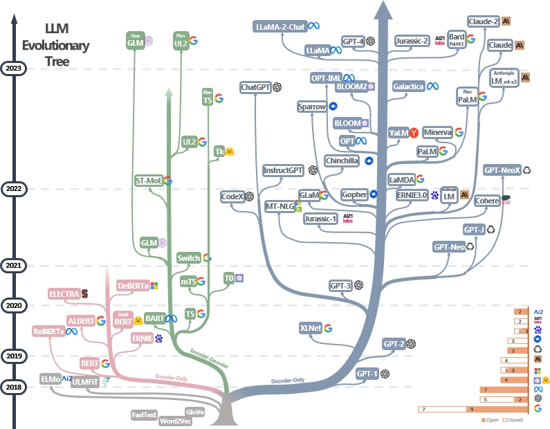
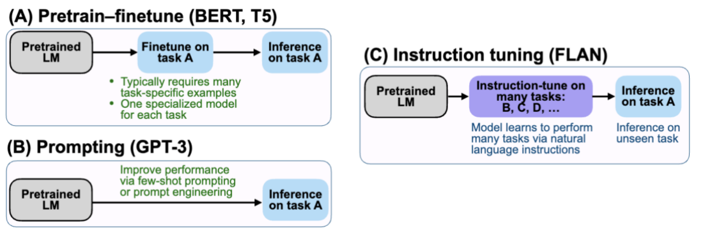
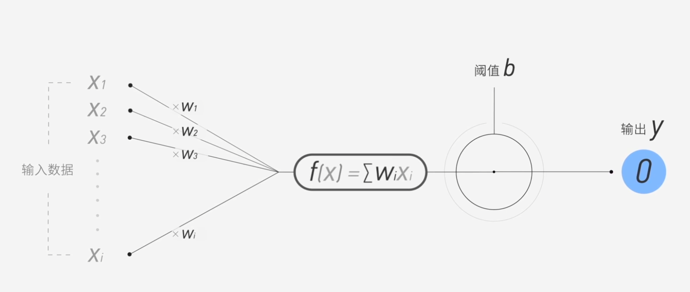
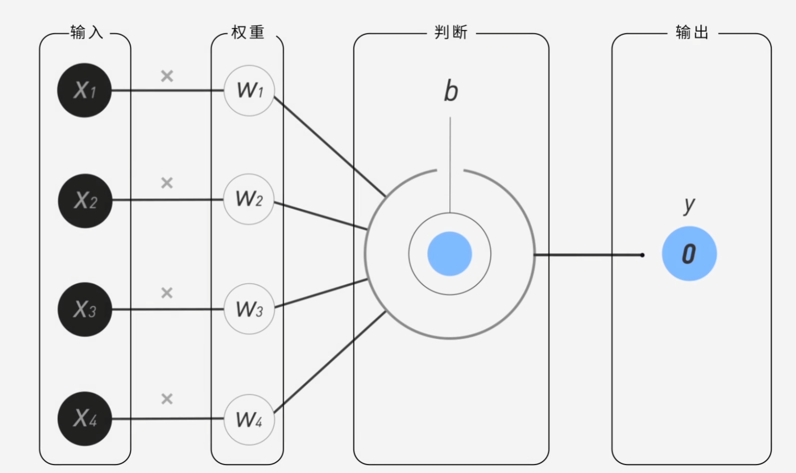
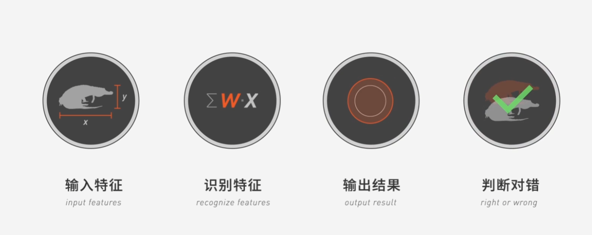
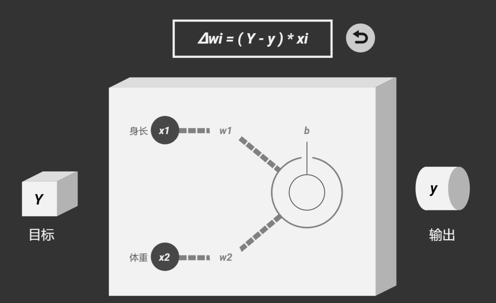

# 关于大模型的相关知识

## 大模型综述

### 资料

相关知识来源：

[Harnessing the Power of LLMs in Practice: A Survey on ChatGPT and Beyond](https://arxiv.org/pdf/2304.13712)

[github 项目地址](https://github.com/Mooler0410/LLMsPracticalGuide)

### 家谱树



### AI 分类

- CV(视觉)

- NLP(自然语言处理)

- LLM / 多模态 / AIGC（新一代通用模型）

### 名词解释

- Encoder: 理解输入，把句子编译成"语义表示"(类似于前端解析用户输入)

- Decoder: 根据语义生成输出句子(类似于根据解析结果生成页面/返回结果)

- Transformer：是一种用于机器翻译的模型，它通过多层 Encoder–Decoder 结构，并在每一层中使用多头注意力机制，从不同角度理解输入序列并生成输出序列。

- 多头注意机制（Multi-head Attention）：同时从多个角度理解句子并行计算再合并结果。

- 无监督预训练：比如一个理解中文句子意思的模型，在执行中文句子理解任务前就通过预训练学会了中文。

- MLM：掩码语言模型（Masked Language Model），这是无监督预训练的方式，在训练过程中，随机选择一些单词进行遮盖，然后让模型预测这些被遮盖的单词。

- 双向上下文理解：比如在训练过程中，一句话中间抠掉一个词，让模型可以通过上下文推测这个词是什么。比如“今天天气真好，我们去公园玩吧。”这句话中抠掉“去”这个词，让模型通过"我们"和"公园玩吧"推测这个词是什么。

- 单向上下文理解：比如在训练过程中，一句话中间抠掉一个词，让模型只能通过前面的部分推测这个词是什么。比如“今天天气真好，我们去公园玩吧。”这句话中抠掉“去”这个词，让模型只通过"我们"，推测这个词是什么

- Bert：是一个只使用 Transformer Encoder 的模型，它通过双向上下文理解句子，并通过大规模无监督预训练学习语言的通用表示能力。(`Encoder-Only`, `双向上下文理解`, `无监督预训练`)

- Scale Law：正常情况下，模型越大、数据越多、算力越高，性能会按照规律提升。

- 零样本(Zero-shot)：第一次做某件事，没有教程，也没练过，但凭以前的经验直接干得不错。比如，你小时候没学过画画，但凭直觉画得不错。

- 少样本(Few-shot)：模型只给很少的例子，就能学会任务，并做得不错，比如只看两三次操作示范，你就能自己干活了

- GPT：生成预训练转换（Generative Pretrained Transformer），它通过无监督预训练学习语言的通用表示能力，并可以通过有监督微调来完成特定任务。在现代大模型中，一般不监督微调，而是直接用提示工程（Prompt Engineering）这样类似于零样本或者少样本来做任务。(`Decoder-Only`, `单向上下文理解`, `可以有监督微调`)

- LLM：大型语言模型（Large Language Model），就是“超级大的文本理解和生成模型”，它读过海量文字，可以像人一样写文章、回答问题、总结内容、甚至写代码。

- token：在大模型中，文本被拆分成一个个的片段（片段可以是单词、子词或者字符），这些片段被称为 token。而大模型的 token 数就是它能理解的文本长度。

- OOD：模型没见过或很少见过的数据，比如`训练数据=家常菜谱`，模型学会了做番茄炒蛋、青椒炒肉，`OOD数据=来了一道日式料理`

- Prompt：提示词，就是给模型的一段文本输入。目的是用于微调大模型，让其进行上下文理解，并生成更好的输出。


### 发展史

从 Tranformer 模型出现，模型大致发展走了两条路线：一条是 Encoder-Only，也就是直做理解，Bert 家族，但是 Bert 没能突破 Scale Law，另一条是 Decoder-Only，也就是直做生成，GPT 家族。研究发现扩大模型的规模可以显著提高零样本和小样本的学习能力，这一点与基于微调的 Bert 家族有很大区别，GPT 基于给定前面单词序列预测下一个单词进行训练，随着模型的扩大，GPT 家族的性能大幅提升。


## 多模态大模型综述


### 多模态指令调优

> 为什么要多模态指令调优呢？

PS: 这是因为提示词工程有如下几点问题：

- Prompt工程不稳定，Prompt很敏感，轻微的改动就会导致结果大不相同，比如`请总结`，`请总结一下`，这两个Prompt的差别很大，但是意思相近。但是最后的结果却相差很大。
- Prompt本质上是把模型应该会的能力转嫁给了使用者。
- Prompting 对 OOD 指令极其脆弱，一旦指令抽象或者表达方式不常见那么么模型就会退化成"续写器"
- Prompting 不可规模化，现实工程中不同的团队或人写不同的Prompt，没有同一的规范，行为不可预测，难以规模化。
- Prompting 只是“建议”，比如`请输出JSON格式`，模型可能多一句话或者输出解释或者直接格式崩溃。

因此，多模态指令调优就诞生了，它把prompt内参化成模型内部的参数，让大模型学会理解指令。

Prompting做的是 `P(y∣x+prompt)`，而Instruction Tuning做的是P(y∣instruction,x)，区别在于前者的指令是上下文，而后偶偶者的指令是变量。

因此最佳实践就是`Instruction Tuning model` + `Prompting`




上图是三种学习范式的比较

- `Pretrain–Finetune（BERT/T5）`：先学语言 → 再学某一个具体任务 (大规模无监督预训练 → 针对某一个下游任务做监督微调)
- `Prompting`：不训练模型，用语言去“定义任务” ([任务说明 + 示例 + 输入] → 输出)
- `Instruction Tuning（FLAN）`：让模型在训练阶段就学会“任务是由指令定义的” (预训练模型→ 大规模「指令 + 输入 + 输出」监督微调)

| 维度         | Pretrain–Finetune | Prompting | Instruction Tuning |
| ---------- | ----------------- | --------- | ------------------ |
| 任务定义方式     | 固定任务接口            | Prompt 中  | 指令（训练学到）           |
| 是否多任务      | ❌                 | ✅         | ✅                  |
| 是否改模型参数    | ✅                 | ❌         | ✅                  |
| 泛化到新任务     | ❌                 | ⚠️        | ✅                  |
| Prompt 稳定性 | —                 | ❌         | ✅                  |
| “听话”能力     | ❌                 | ⚠️        | ✅                  |


```text
BERT 时代：
  一个任务 = 一个模型

GPT-3 时代：
  一个模型 + Prompt = 多个任务（但不稳定）

FLAN / InstructGPT 时代：
  一个模型 = 会听指令的通用任务执行器
```

**总结**

Pretrain–Finetune 将任务定义固化在模型结构中，适合单任务优化；Prompting 不修改模型参数，通过自然语言在推理阶段临时定义任务；而 Instruction Tuning 则在训练阶段显式使用多任务指令数据，使模型将“理解并执行指令”的能力内化到参数中，从而在稳定性和泛化性上显著优于纯 Prompting。


## 决策/分析模型到生成式模型

### 分类/回归模型

- 首先分两和回归都是监督学习模型
- 分类：
  - 预测"属于哪一类"(离散结果)
  - f(x) -> y, y ∈ {1,2,3,...,K}
  - eg: 垃圾识别、图像识别、文本分类等
  - 输出层：二分类是一个`神经元+sigmoid激活函数`，多分类是`多神经元+softmax激活函数`
  - 损失函数：交叉熵(cross-entropy) `L=−∑ylog(y^​)`
  - 分类实际上就是画一条分界线，本质上是`决策边界`，也就是这点的边界哪一边


- 回归：
  - 预测"具体是多少"(连续数值)
  - f(x) -> y, y ∈ ℝ
  - eg: 房价预测、温度预测等
  - 输出层：`一个或者N个神经元`
  - 损失函数：均方误差(mean squared error) `L=∑(y−y^​)^2`
  - 回归是拟合一条曲线，本质上是`趋势函数`，也就是这个x对应的y值

- 检测模型 = 分类 + 回归 的组合模型，例如YOLO,分类就是你要识别的物体种类，回归就是对应识别物体的坐标
- 语言模型的本质就是`超大规模多分类`的问题,所以`LLM=自回归的多分类模型`

> Q1: 什么是神经元



`神经元 = 加权求和 + 非线性函数`,其数学本质就是`y=f(WnX+b),z=WnX+b`

现在有n个神经元，那么就会有一个z的值，当这个值`>b`时，y=1,`<b`时，y=0。



神经元本质上就是决策边界，而训练过程中通过不断调整w来让这个决策边界越来越精确，最终达到最优解。而b从数学看就是截距，也就是在x=0时，y的偏移量。w决定了怎么切而b决定了切在哪里。

- x: 输入
- w: 权重(学习到的参数)
- b: 偏置
- f: 激活函数



整个神经网络就是由这一个个神经元组成的，而对应的整个模型训练的步骤就是
`输入特征 -> 识别特征 -> 输出结果 -> 判断对错`



有了上面的理论我们就知道只要改变权重W，就可以达到我们预期的输出(输出这里是我们自己定义的，比如某一个猫/狗，输出为1为猫，0为狗)，那么计算机为了达到预期就现需要不断调整权重，最后总有一个△W能达到预期。

以上图的W1为例，假设`W(0) = -1`,`△W=1`

则： `W(1) = W(0)+△W= 0`,`W(2) = W(1)+△W= 1`,这里我们不难发现随着x的变化，Wx的值也会变化而`△W=W(n)-W(n-1)`的值，而这个过程就是反向传播的过程。以此类推W2也是如此。

根据上面的基础理论可得出判断机器有没有分对主要是目标Y和输出y有关系，因此我们可以推出△W的计算公式为：`△W = (Y-y) * x`
然后可以得出△b=Y-y


这种模型有个致命的缺陷：

如果样本的数量提升导致有些边缘情况交叉，比如茶杯犬和猫，如果按照体重和长度的维度那么很有可能和猫的界限交叉，那么就会导致分类错误。
这个时候就必须想办法把样本分开。

> Q2: 什么是 Sigmoid 和 Softmax

**激活函数让网络具备了“非线性表达能力”**
**说人话：激活函数实际上就是通过空间变换把原本交叉在一起的不同样本的点团分开到有一个神经元(二分类)或多个神经元(多分类)能切开为止**

本质都是 激活函数，但用途完全不同。

Sigmoid：
- σ(x)=1/1+e^{-x}
- 输出范围在0到1之间
- 把一个数压缩成“概率”