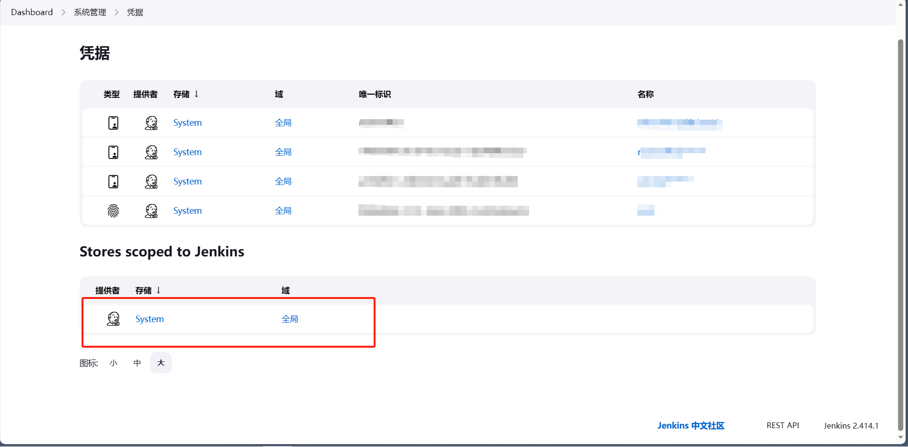
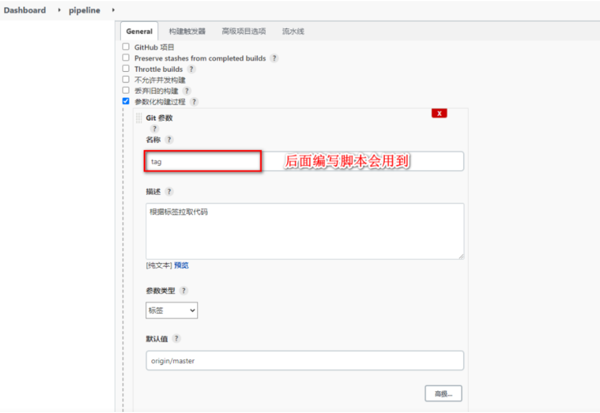

# jenkins


## 安装

```shell
# -v jenkins_home:/var/jenkins_home  持久化存储Jenkins的配置和数据，以便容器删除后数据不会丢失
# -v /var/run/docker.sock:/var/run/docker.sock  将本地主机上的Docker守护进程的Unix套接字文件挂载到容器内的相同路径，这允许容器与宿主机上的Docker守护进程进行通信，以便容器可以创建和管理其他容器
# -v /usr/bin/docker:/usr/bin/docker 将本地主机上的Docker可执行文件挂载到容器内的相同路径。这允许容器内的进程调用主机上的Docker命令，以便在容器中构建和运行其他容器

docker run --name=jenkins -itd -v jenkins_home:/var/jenkins_home -v /var/run/docker.sock:/var/run/docker.sock -v /usr/bin/docker:/usr/bin/docker -p 8080:8080 -p 50000:50000 --restart=on-failure jenkins/jenkins:lts
```


## 凭证配置

### 初始化jenkins

```shell
# 查看jenkins管理员初始密码
cat /var/jenkins_home/secrets/initialAdminPassword
# 如果没有这个文件可以查看jenkins的docker日志
docker logs -f jenkins
```


输入找到的管理员密码即可


安装推荐的插件即可


### 进行gitee webhook配置

首先在系统管理中找到插件管理


然后在available plugins中搜索Gitee进行安装，下图是我安装好以后的截图，安装好的插件在Installed plugins中可以找到


下载好插件以后再系统管理中找到凭据管理并进行gitee的凭据配置


在全局凭证里面配置，添加凭证，对于gitee来说要配两个凭证，一个gitee api令牌来调用gitee接口；再配一个username with password来进行git pull




这里复制这个url然后访问，登录自己的gitee账号设置令牌即可


其他的代码仓库以此类推


### ssh服务器密钥配置

```shell
# 获取私钥
ssh-keygen 
cat .ssh/id_rsa

#将公钥追加到SSH授权密钥文件
cat .ssh/id_rsa.pub >> .ssh/authorized_keys 
```

同样在全局凭证里面加入SSH配置，这里配置ssh时填入自己服务器的私钥即可


## 项目配置

项目的相关配置


```json
pipeline {
    agent any
    stages {
        stage('Git Pull') {
            steps {
                git branch: 'master', credentialsId: '自己的凭证gitee id', url: '自己的代码仓库'
            }
        }
        stage('Docker Build') {
            steps {
                sh "docker build . -t 构建镜像名"
            }
        }
        stage('Docker Push') {
            steps {
                withCredentials([usernamePassword(credentialsId: 'username with password id凭证', passwordVariable: 'password', usernameVariable: 'username')]) {
                    sh "docker login -u ${username} -p ${password} hub仓库url"
                    sh "docker push 镜像名"
                }
            }
        }
        stage('Deploy') {
            steps {
                sshagent(['配置的ssh id凭证']) {
                    sh '''ssh -o StrictHostKeyChecking=no -l root 自己的服务器ip "cd /root && ./docker.sh"
                    '''
                }
            }
        }
    }
}
```


## 构建jenkins流水线

> 构建jenkins流水线有两种方式，第一种就是直接将脚本写在jenkins平台的流水线上，一个就是通过编写jenkinsfile到项目中，jenkins在拉取项目的时候会触发jenkinsfile

构建任务


生成Groovy脚本，hello world脚本生成


构建后查看任务进度


## Groovy脚本

Groovy脚本基础语法

```shell
// 所有脚本命令包含在pipeline{}中
pipeline {  
	// 指定任务在哪个节点执行（Jenkins支持分布式）
    agent any
    
    // 配置全局环境，指定变量名=变量值信息
    environment{
    	host = '172.17.1.22'
    }
 
    // 存放所有任务的合集
    stages {
    	// 单个任务
        stage('任务1') {
        	// 实现任务的具体流程
            steps {
                echo 'do something'
            }
        }
		// 单个任务
        stage('任务2') {
        	// 实现任务的具体流程
            steps {
                echo 'do something'
            }
        }
        // ……
    }
}
```

涉及到特定脚本，jenkins提供了提示，可以自动生成命令

生成命令的位置


## jenkins流水线任务实现

Jenkinsfile方式需要将脚本内容编写到项目中的Jenkinsfile文件中，每次构建会自动拉取项目并且获取项目中Jenkinsfile文件对项目进行构建

参数化构建

添加参数化构建，方便选择不同的项目版本



拉取Git代码

通过流水线语法生成Checkout代码的脚本


得到脚本

这里将*/master更改为标签${tag}

```shell
pipeline {
 
    agent any
        environment{
        harborRepo = 'heianapp'
        harborUser = 'heian99'
        harborPasswd = 'NG+.mK4M-(s4CYX'
    }
    // 存放所有任务的合集
    stages {
        stage('拉取Git代码') {
            steps {
                echo '拉取Git代码'
                checkout([$class: 'GitSCM', branches: [[name: '${tag}']], extensions: [], userRemoteConfigs: [[url: 'https://gitee.com/chengfeng99/java-demo.git']]])
            }
        }
 
        stage('检测代码质量') {
            steps {
                echo '检测代码质量'
                 sh '/var/jenkins_home/sonar-scanner/bin/sonar-scanner -Dsonar.sources=./ -Dsonar.projectname=${JOB_NAME} -Dsonar.projectKey=${JOB_NAME} -Dsonar.java.binaries=target/ -Dsonar.login=19d0d6b885e18455d257d61da08776bd4e180c04'
            }
        }
 
        stage('构建代码') {
            steps {
                echo '构建代码'
                 sh '/var/jenkins_home/maven/bin/mvn clean package -DskipTests'
            }
        }
 
        stage('制作自定义镜像并发布Harbor') {
                        steps {
                echo '制作自定义镜像并发布Harbor'
                sh '''
                cp ./target/*.jar ./docker/demo.jar
                cd ./docker
                docker build -t ${JOB_NAME}:${BUILD_NUMBER} . '''
                
                 sh '''docker login -u ${harborUser} -p ${harborPasswd} 
                docker tag ${JOB_NAME}:${BUILD_NUMBER} ${harborUser}/${harborRepo}:${JOB_NAME}_${BUILD_NUMBER}
                docker push ${harborUser}/${harborRepo}:${JOB_NAME}_${BUILD_NUMBER}'''
            }
        }
 
        stage('基于Harbor部署工程') {
            steps {
                echo '基于Harbor部署工程'
               sshPublisher(publishers: [sshPublisherDesc(configName: 'node-Linux32', transfers: [sshTransfer(cleanRemote: false, excludes: '', execCommand: '''cd /opt/java/
echo "测试成功" >> log.txt
 date >> log.txt''', execTimeout: 120000, flatten: false, makeEmptyDirs: false, noDefaultExcludes: false, patternSeparator: '[, ]+', remoteDirectory: '', remoteDirectorySDF: false, removePrefix: '', sourceFiles: 'target/*.jar,docker/*')], usePromotionTimestamp: false, useWorkspaceInPromotion: false, verbose: false)])
            }
        }
    }
}
```


## 参考

[Jenkins的流水线（Pipeline）_jenkins pipeline-CSDN博客](https://blog.csdn.net/heian_99/article/details/124815450)
