#  术语

## 服务部署

> 传统部署：环境不隔离

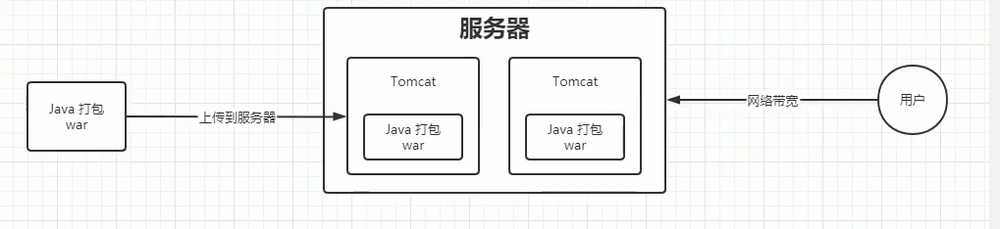

> 虚拟化部署：资源占用过高

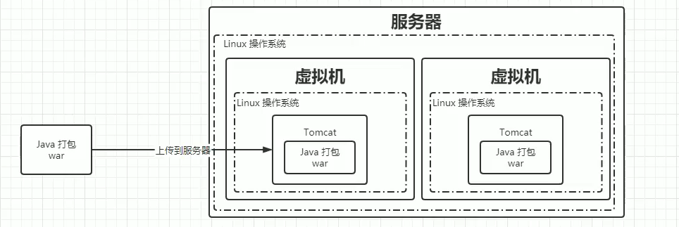

> 容器化部署：解决了上面两种部署的缺点

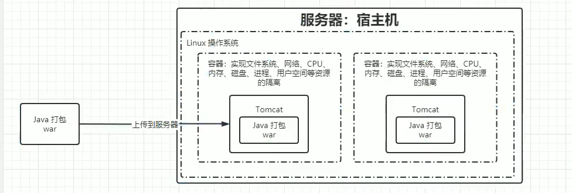


# 集群架构与组件

> 集群架构

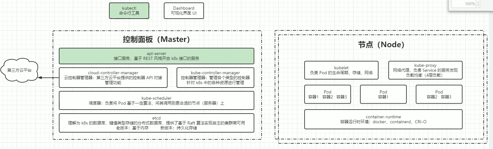

## 控制面板组件

> 控制面板架构图

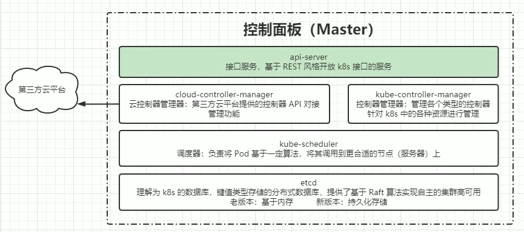

etcd ,kube-apiserver ,kube-controller-manager,cloud-controller-manager, kube-scheduler

## 节点组件

> 节点架构

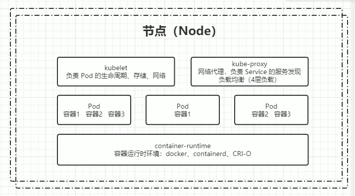

kubelet,kube-proxy,container,runtime

## 附加组件

kube-dns,Ingress Controller,Prometheus,Dashboard,Federation,Fluentd-elasticsearch

## 分层架构

> 架构图

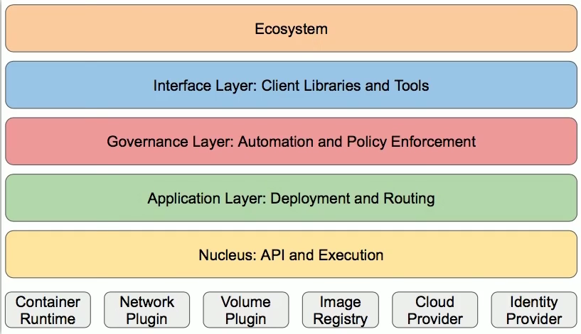

生态系统,接口层,管理层,应用层,核心层


# 专业术语

## 有(无)状态

- 无状态

> 代表应用（Nginx/Apache）

优点：对客户端透明，没有依赖关系，可以高效实现拓展、迁移

缺点：不能存储数据，需要额外的数据服务支撑


- 有状态

> 代表应用（MySQL/Redis）

优点：可以独立存储数据，实现数据管理

缺点：在集群环境下需要实现主从、数据同步、备份、水平扩容复杂（因为存在数据备份迁移的问题）

**总结**：区分有无状态就是看是否独立存储数据

## 资源和对象

> 资源是以配置文件的形式来描述的，资源类似于类的定义，而对象就是资源的具体实现

### 资源分类（资源作用域）

> 关于资源作用域的划分

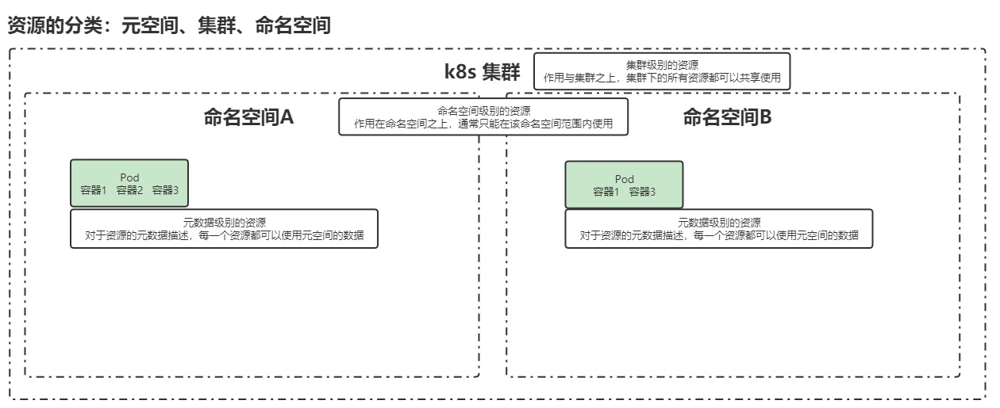

> PS：记忆方法就是按照从上到下的作用域大小来记忆

#### 元数据型

> 含义（从作用域的角度来说）

百度回答：

在k8s中，元数据是指用于描述和管理资源的数据。元数据提供了关于资源的详细信息，包括名称、标签、注释、创建时间等。它是一种描述资源的信息，帮助k8s系统进行资源的管理和调度。

我的理解：一个元空间可以存在多个集群，而集群创建的时间等变量是高于集群作用域的，所以元数据型就是最大的作用域

> 元数据型的实例

- Horizontal Pod Autoscater(HPA)

Pod自动扩容：可以根据CPU使用率或者自定义指标(metrics)自动对Pod进行扩容/缩容

- PodTemplate

Pod Template 是关于 Pod 的定义，但是被包含在其他的 Kubernetes 对象中。控制器通过 Pod Template 信息来创建 Pod。（说白了就是pod的一个抽象类，想要使用就具象化即可）

- LimitRange

可以对集群内 Request 和 Limits 的配置做一个全局的统一的限制，相当于批量设置了某一个范围内（某个命名空间）的 Pod 的资源使用限制。


#### 集群级

> 含义（从作用域的角度来说）

一个集群共有的资源，即作用域为某一个集群

> 集群级实例

- Namespace

命名空间：实质就是虚拟集群，作用是用于实现多团队/环境的资源隔离

- Node

node不是由k8s直接生成的，Kubernetes 只是管理 Node 上的资源。（可以把node看成vps，pod可以看作服务，一台vps里面可以启动多个服务）

- ClusterRole

用于控制对集群级别资源的访问和操作权限

- ClusterRoleBinding

使某项规则在集群级别的资源生效

#### 命名空间级

> 含义（从作用域的角度来说）

命名空间的共有资源，即作用域为某一个命名空间

> 命名空间级实例


#### pod（命名空间级）

##### 定义

> PS：pod简单理解就是为了解决紧密耦合性的两个容器的通信和共享文件资源的问题的容器

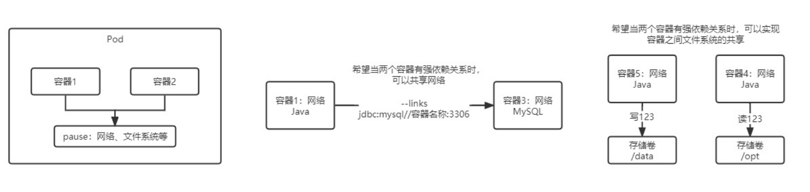

如图，通过pause这个“第三者”来同步网络以及文件资源，这样就解决了紧密耦合的两个容器之间通讯问题。


##### 控制器

> 什么是控制器？

控制器可以为您创建和管理多个 Pod，管理副本和上线，并在集群范围内提供自修复能力。

- 适用于无状态服务
  - ReplicationController（RC）：帮助我们动态更新Pod的副本数，它是基于副本（replicas）来进行更新Pod副本数的
  - ReplicaSet（RS）：RS也是帮我们动态更新Pod的副本数的，可以通过selector来选择对哪些Pod生效
  - Deployment：针对RS的更高层次的封装，提供更丰富的部署相关的功能，调用RS来选择某个Pod进行功能实现
    - 创建Replica Set/Pod
    - 滚动升级/回滚
    - 平滑扩容和缩容
    - 暂停与恢复Deployment（因为升级时自动的，所以每改一次就会进行自动升级，现在有多出地方不能同一时间更改，那么先暂停自动升级功能然后进行修改，等全部修改完以后回复自动升级）
- 适用于状态服务（StatefulSet）
  - 主要特点
    - 稳定的持久化存储
    - 稳定的网络标志
    - 有序部署，有序拓展
    - 有序收缩，有序删除
  - 组成
    - Headless Service：对于有状态服务的DNS管理，将服务名绑定到ip，这样就可以保证容器在自动升级的时候ip地址不变
    - volumClaimTemplate：创建持久化卷的模板
  - 注意事项
    - kubernetes v1.5 版本以上才支持
    - 所有Pod的Volume必须使用PersistentVolume或者是管理员事先创建好
    - 为了保证数据安全，删除StatufulSet时不会删除Volume
    - StatefulSet需要一个Headless Service来定义DNS domain，需要在StatefulSet之前创建好
- 守护进程
  - DaemonSet：保证在每个 Node 上都运行一个容器副本，常用来部署一些集群的日志、监控或者其他系统管理应用
- 任务/定时任务


#### 服务发现（命名空间）

##### 行业黑话

> 南北流量和东西流量

南北流量：就是自上而下的流量，举个例子就是用户访问集群内的某个服务，要通过访问硬件设备，设备转发到各个网关，从而访问到想要访问的服务，因为流量时自上而下（自下而上），所以被称为南北流量。通常集群的南北向流量是通过（七层）nigix进行反向代理

东西流量：就是同一层的服务不通过向上转发流量进行的相互通讯，因为流量时自左向右（自右向左），所以被称为东西流量。通常集群在东西向流量是通过端口映射；来实现的

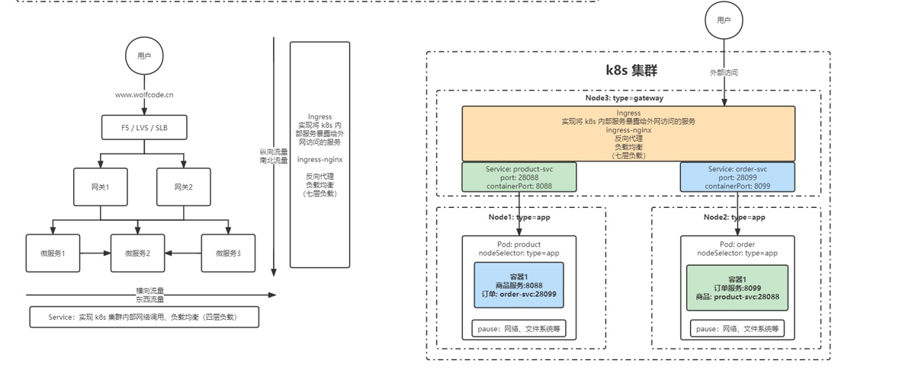


service：实现东西向流量的

ingress：实现南北向流量的

## 规约和状态

**规约（Spec）:**

spec 是 “规约”、“规格” 的意思，spec 是必需的，它描述了对象的期望状态（Desired State）—— 希望对象所具有的特征。当创建 Kubernetes 对象时，必须提供对象的规约，用来描述该对象的期望状态，以及关于对象的一些基本信息（例如名称）

**状态（Status）：**

表示对象的实际状态，该属性由 k8s 自己维护，k8s 会通过一系列的控制器对对应对象进行管理，让对象尽可能的让实际状态与期望状态重合。


# 搭建

## 搭建方案


### minikube

> minikube是一个工具，能让本地运行Kubernetes。minikube 在你的个人计算机（包括 Windows、macOS 和 Linux PC）上运行一个一体化（all-in-one）或多节点的本地 Kubernetes 集群，以便你来尝试 Kubernetes 或者开展每天的开发工作。


### kubeadm

> 创建和管理集群的工具（k8s这里使用的是1.23.6版本，1.24以后的版本因为cncf云基金会为了统一容器规范，停止了目前docker的支持，因此目前想要使用docker可以使用1.24以前的版本）


#### 多节点部署（三个vps,以centos7为例）

##### 初始操作

```bash
# 关闭防火墙
systemctl stop firewalld
systemctl disable firewalld

# 关闭selinux
sed -i 's/enforcing/disabled/' /etc/selinux/config  # 永久
setenforce 0  # 临时

# 关闭swap
swapoff -a  # 临时
sed -ri 's/.*swap.*/#&/' /etc/fstab    # 永久

# 关闭完swap后，一定要重启一下虚拟机！！！
# 根据规划设置主机名
hostnamectl set-hostname <hostname>

# 在master添加hosts
cat >> /etc/hosts << EOF
192.168.113.120 k8s-master
192.168.113.121 k8s-node1
192.168.113.122 k8s-node2
EOF


# 将桥接的IPv4流量传递到iptables的链
cat > /etc/sysctl.d/k8s.conf << EOF
net.bridge.bridge-nf-call-ip6tables = 1
net.bridge.bridge-nf-call-iptables = 1
EOF

sysctl --system  # 生效


# 时间同步
yum install ntpdate -y
ntpdate time.windows.com
```

##### 安装集群基础软件


```bash
#安装docker
....  #自己安装


#更换yum源
cat > /etc/yum.repos.d/kubernetes.repo << EOF
[kubernetes]
name=Kubernetes
baseurl=https://mirrors.aliyun.com/kubernetes/yum/repos/kubernetes-el7-x86_64
enabled=1
gpgcheck=0
repo_gpgcheck=0

gpgkey=https://mirrors.aliyun.com/kubernetes/yum/doc/yum-key.gpg https://mirrors.aliyun.com/kubernetes/yum/doc/rpm-package-key.gpg
EOF


#安装kubeadm、kubelet、kubectl
yum install -y kubelet-1.23.6 kubeadm-1.23.6 kubectl-1.23.6

systemctl enable kubelet

# 配置关闭 Docker 的 cgroups，修改 /etc/docker/daemon.json，加入以下内容
"exec-opts": ["native.cgroupdriver=systemd"]

# 重启 docker
systemctl daemon-reload
systemctl restart docker
```


##### 部署master节点

```bash
# 在 Master 节点下执行

kubeadm init \
      --apiserver-advertise-address=192.168.113.120 \
      --image-repository registry.aliyuncs.com/google_containers \
      --kubernetes-version v1.23.6 \
      --service-cidr=10.96.0.0/12 \
      --pod-network-cidr=10.244.0.0/16

# 安装成功后，复制如下配置并执行
mkdir -p $HOME/.kube
sudo cp -i /etc/kubernetes/admin.conf $HOME/.kube/config
sudo chown $(id -u):$(id -g) $HOME/.kube/config
kubectl get nodes
```


##### 部署node节点

```bash
#分别在 k8s-node1 和 k8s-node2 执行

# 下方命令可以在 k8s master 控制台初始化成功后复制 join 命令

kubeadm join 192.168.113.120:6443 --token w34ha2.66if2c8nwmeat9o7 --discovery-token-ca-cert-hash sha256:20e2227554f8883811c01edd850f0cf2f396589d32b57b9984de3353a7389477


# 如果初始化的 token 不小心清空了，可以通过如下命令获取或者重新申请
# 如果 token 已经过期，就重新申请
kubeadm token create

# token 没有过期可以通过如下命令获取
kubeadm token list

# 获取 --discovery-token-ca-cert-hash 值，得到值后需要在前面拼接上 sha256:
openssl x509 -pubkey -in /etc/kubernetes/pki/ca.crt | openssl rsa -pubin -outform der 2>/dev/null | \
openssl dgst -sha256 -hex | sed 's/^.* //'
```


##### 部署CNI网络插件

```bash
# 在 master 节点上执行
# 下载 calico 配置文件，可能会网络超时
curl https://docs.projectcalico.org/manifests/calico.yaml -O

# 修改 calico.yaml 文件中的 CALICO_IPV4POOL_CIDR 配置，修改为与初始化的 cidr 相同

# 修改 IP_AUTODETECTION_METHOD 下的网卡名称

# 删除镜像 docker.io/ 前缀，避免下载过慢导致失败
sed -i 's#docker.io/##g' calico.yaml
```


##### 测试kubernetes集群

```bash
# 创建部署
kubectl create deployment nginx --image=nginx

# 暴露端口
kubectl expose deployment nginx --port=80 --type=NodePort

# 查看 pod 以及服务信息
kubectl get pod,svc
```


#### 单节点部署（以ubuntu为例）

##### 部署流程

```bash
# 关闭防火墙
systemctl stop firewalld
systemctl disable firewalld

# 关闭selinux （ubuntu默认没安装selinux,如果安装了直接按照下面方法关闭）
sed -i 's/enforcing/disabled/' /etc/selinux/config  # 永久
setenforce 0  # 临时

# swap是从磁盘中划分出来作为内存使用的一个磁盘分区
# 关闭swap
swapoff -a  # 临时
sed -ri 's/.*swap.*/#&/' /etc/fstab    # 永久

#　将桥接的IPv4流量传递到iptables的链
cat > /etc/sysctl.d/k8s.conf << EOF
net.bridge.bridge-nf-call-ip6tables = 1
net.bridge.bridge-nf-call-iptables = 1
EOF

sysctl --system  # 生效

# 安装docker并且换源
vim /etc/docker/daemon.json 

#daemon.json内容
{

	"registry-mirrors": ["https://uy35zvn6.mirror.aliyuncs.com"],
	"exec-opts": ["native.cgroupdriver=systemd"]

}
# 重启docker
systemctl daemon-reload
systemctl restart docker

# 更新apt包并安装使用kubernetes apt仓库所需要的包
apt-get update
apt-get install -y apt-transport-https ca-certificates curl

# 添加GPG密钥
curl -s https://mirrors.aliyun.com/kubernetes/apt/doc/apt-key.gpg | apt-key add -

# 添加 Kubernetes apt 存储库
tee /etc/apt/sources.list.d/kubernetes.list <<-'EOF'
deb https://mirrors.aliyun.com/kubernetes/apt kubernetes-xenial main
EOF

# 安装kubelet, kubeadm and kubectl
apt-get install -y kubelet=1.23.6-00 kubeadm=1.23.6-00 kubectl=1.23.6-00

# 标记阻止这三个包不会自动更新升级
apt-mark hold kubelet kubeadm kubectl


# 部署单节点，这么写默认为本机出口IP映射到公网
kubeadm init \
	--image-repository registry.aliyuncs.com/google_containers \
	--kubernetes-version v1.23.6 \
	--pod-network-cidr=10.244.0.0/16 \

      
# 复制kubeconfig配置文件 
mkdir -p $HOME/.kube
sudo cp -i /etc/kubernetes/admin.conf $HOME/.kube/config
sudo chown $(id -u):$(id -g) $HOME/.kube/config

# 去除master污点(这个非常重要，因为不执行这个命令后面的服务可能启动不起来)
kubectl taint nodes --all node-role.kubernetes.io/master-

# 下载网络插件
cd /opt && mkdir k8s && cd k8s
wget  https://docs.projectcalico.org/manifests/calico.yaml
vim calico.yaml  # 修改 calico.yaml 文件中的 CALICO_IPV4POOL_CIDR 配置，修改为与初始化的 cidr 相同
sed -i 's#docker.io/##g' calico.yaml  # 修改镜像名称，改为非官方镜像
kubectl apply -f calicao.yaml   # 应用配置文件，使配置文件生效
kubuctl get pod -n kube-system # 查看命名空间为“kube-system”的pod


# 查看kube-syste命名空间，发现所有状态均现实running即k8s服务已启动
NAME                                       READY   STATUS    RESTARTS   AGE
calico-kube-controllers-74dbdc644f-skwr9   1/1     Running   0          9h
calico-node-jmqhz                          1/1     Running   0          9h
coredns-6d8c4cb4d-ngkth                    1/1     Running   0          9h
coredns-6d8c4cb4d-np8hz                    1/1     Running   0          9h
etcd-vm-16-11-ubuntu                       1/1     Running   3          9h
kube-apiserver-vm-16-11-ubuntu             1/1     Running   3          9h
kube-controller-manager-vm-16-11-ubuntu    1/1     Running   4          9h
kube-proxy-zn7mm                           1/1     Running   0          9h
kube-scheduler-vm-16-11-ubuntu             1/1     Running   4          9h


# 来启动一个nginx服务验证集群是否启动
# 创建部署
kubectl create deployment nginx --image=nginx

# 暴露端口
kubectl expose deployment nginx --port=80 --type=NodePort

# 查看 pod 以及服务信息
kubectl get pod,svc

#得到的信息如下
NAME                         READY   STATUS    RESTARTS   AGE
pod/nginx-85b98978db-st7rz   1/1     Running   0          9h

NAME                 TYPE        CLUSTER-IP       EXTERNAL-IP   PORT(S)        AGE
service/kubernetes   ClusterIP   10.96.0.1        <none>        443/TCP        9h
service/nginx        NodePort    10.106.200.212   <none>        80:31067/TCP   9h

找到nginx服务对应的端口映射，本机的ip+port即可访问nginx
```


##### 启动服务拓展（使用配置文件启动）

配置文件simple-nginx.yaml内容如下

```yaml
apiVersion: v1
kind: Namespace
metadata:
  name: simple-nginx
  labels:
    name: simple-nginx
---
apiVersion: apps/v1
kind: Deployment
metadata:
  namespace: simple-nginx
  name: nginx-deployment
  labels:
    app: nginx
spec:
  selector:
    matchLabels:
      app: nginx
  replicas: 2 
  template:
    metadata:
      labels:
        app: nginx
    spec:
      containers:
      - name: nginx
        image: docker.io/library/nginx:1.23.2
        ports:
        - containerPort: 80
---
apiVersion: v1
kind: Service
metadata:
  namespace: simple-nginx
  name: nginx-deployment
spec:
  type: Nodeport
  ports:
    - ports: 80
      targetPort: 80
  selector:
    app: nginx    
```

```bash
# 有了上面的配置文件以后直接基于配置文件启动即可
kubectl apply -f simple-nginx.yaml
```


## 命令行工具 kubectl

### 任意节点使用kubectl

```bash
# 部署完主从节点集群以后会发现只有master节点能够使用kubectl命令，所以要进行配置
# 1. 将 master 节点中 /etc/kubernetes/admin.conf 拷贝到需要运行的服务器的 /etc/kubernetes 目录中
scp /etc/kubernetes/admin.conf root@k8s-node1:/etc/kubernetes # 这里因为配置了主机名所哟可以直接写root@xxx,如果没配则要使用对应的主机ip

# 2. 在对应的服务器上配置环境变量
echo "export KUBECONFIG=/etc/kubernetes/admin.conf" >> ~/.bash_profile
source ~/.bash_profile
```

### 资源操作

#### 创建对象

```bash
$ kubectl create -f ./my-manifest.yaml           # 创建资源
$ kubectl create -f ./my1.yaml -f ./my2.yaml     # 使用多个文件创建资源
$ kubectl create -f ./dir                        # 使用目录下的所有清单文件来创建资源
$ kubectl create -f https://git.io/vPieo         # 使用 url 来创建资源
$ kubectl run nginx --image=nginx                # 启动一个 nginx 实例
$ kubectl explain pods,svc                       # 获取 pod 和 svc 的文档

# 从 stdin 输入中创建多个 YAML 对象
$ cat <<EOF | kubectl create -f -
apiVersion: v1
kind: Pod
metadata:
  name: busybox-sleep
spec:
  containers:
  - name: busybox
    image: busybox
    args:
    - sleep
    - "1000000"
---
apiVersion: v1
kind: Pod
metadata:
  name: busybox-sleep-less
spec:
  containers:
  - name: busybox
    image: busybox
    args:
    - sleep
    - "1000"
EOF

# 创建包含几个 key 的 Secret
$ cat <<EOF | kubectl create -f -
apiVersion: v1
kind: Secret
metadata:
  name: mysecret
type: Opaque
data:
  password: $(echo "s33msi4" | base64)
  username: $(echo "jane" | base64)
EOF
```


#### 显示和查找资源

```bash
# Get commands with basic output
$ kubectl get services                          # 列出所有 namespace 中的所有 service
$ kubectl get pods --all-namespaces             # 列出所有 namespace 中的所有 pod
$ kubectl get pods -o wide                      # 列出所有 pod 并显示详细信息
$ kubectl get deployment my-dep                 # 列出指定 deployment
$ kubectl get pods --include-uninitialized      # 列出该 namespace 中的所有 pod 包括未初始化的

# 使用详细输出来描述命令
$ kubectl describe nodes my-node
$ kubectl describe pods my-pod

$ kubectl get services --sort-by=.metadata.name # List Services Sorted by Name

# 根据重启次数排序列出 pod
$ kubectl get pods --sort-by='.status.containerStatuses[0].restartCount'

# 获取所有具有 app=cassandra 的 pod 中的 version 标签
$ kubectl get pods --selector=app=cassandra rc -o \
  jsonpath='{.items[*].metadata.labels.version}'

# 获取所有节点的 ExternalIP
$ kubectl get nodes -o jsonpath='{.items[*].status.addresses[?(@.type=="ExternalIP")].address}'

# 列出属于某个 PC 的 Pod 的名字
# “jq”命令用于转换复杂的 jsonpath，参考 https://stedolan.github.io/jq/
$ sel=${$(kubectl get rc my-rc --output=json | jq -j '.spec.selector | to_entries | .[] | "\(.key)=\(.value),"')%?}
$ echo $(kubectl get pods --selector=$sel --output=jsonpath={.items..metadata.name})

# 查看哪些节点已就绪
$ JSONPATH='{range .items[*]}{@.metadata.name}:{range @.status.conditions[*]}{@.type}={@.status};{end}{end}' \
 && kubectl get nodes -o jsonpath="$JSONPATH" | grep "Ready=True"

# 列出当前 Pod 中使用的 Secret
$ kubectl get pods -o json | jq '.items[].spec.containers[].env[]?.valueFrom.secretKeyRef.name' | grep -v null | sort | uniq


```

#### 更新资源

```bash
$ kubectl rolling-update frontend-v1 -f frontend-v2.json           # 滚动更新 pod frontend-v1
$ kubectl rolling-update frontend-v1 frontend-v2 --image=image:v2  # 更新资源名称并更新镜像
$ kubectl rolling-update frontend --image=image:v2                 # 更新 frontend pod 中的镜像
$ kubectl rolling-update frontend-v1 frontend-v2 --rollback        # 退出已存在的进行中的滚动更新
$ cat pod.json | kubectl replace -f -                              # 基于 stdin 输入的 JSON 替换 pod

# 强制替换，删除后重新创建资源。会导致服务中断。
$ kubectl replace --force -f ./pod.json

# 为 nginx RC 创建服务，启用本地 80 端口连接到容器上的 8000 端口
$ kubectl expose rc nginx --port=80 --target-port=8000

# 更新单容器 pod 的镜像版本（tag）到 v4
$ kubectl get pod mypod -o yaml | sed 's/\(image: myimage\):.*$/\1:v4/' | kubectl replace -f -

$ kubectl label pods my-pod new-label=awesome                      # 添加标签
$ kubectl annotate pods my-pod icon-url=http://goo.gl/XXBTWq       # 添加注解
$ kubectl autoscale deployment foo --min=2 --max=10                # 自动扩展 deployment “foo”


```

#### 修补资源

```bash
$ kubectl patch node k8s-node-1 -p '{"spec":{"unschedulable":true}}' # 部分更新节点

# 更新容器镜像； spec.containers[*].name 是必须的，因为这是合并的关键字
$ kubectl patch pod valid-pod -p '{"spec":{"containers":[{"name":"kubernetes-serve-hostname","image":"new image"}]}}'

# 使用具有位置数组的 json 补丁更新容器镜像
$ kubectl patch pod valid-pod --type='json' -p='[{"op": "replace", "path": "/spec/containers/0/image", "value":"new image"}]'

# 使用具有位置数组的 json 补丁禁用 deployment 的 livenessProbe
$ kubectl patch deployment valid-deployment  --type json   -p='[{"op": "remove", "path": "/spec/template/spec/containers/0/livenessProbe"}]'


```

#### 编辑资源

```bash
$ kubectl edit svc/docker-registry                      # 编辑名为 docker-registry 的 service
$ KUBE_EDITOR="nano" kubectl edit svc/docker-registry   # 使用其它编辑器
```

#### scale资源

```bash
$ kubectl scale --replicas=3 rs/foo                                 # Scale a replicaset named 'foo' to 3
$ kubectl scale --replicas=3 -f foo.yaml                            # Scale a resource specified in "foo.yaml" to 3
$ kubectl scale --current-replicas=2 --replicas=3 deployment/mysql  # If the deployment named mysql's current size is 2, scale mysql to 3
$ kubectl scale --replicas=5 rc/foo rc/bar rc/baz                   # Scale multiple replication controllers
```

#### 删除资源

```bash
$ kubectl delete -f ./pod.json                                              # 删除 pod.json 文件中定义的类型和名称的 pod
$ kubectl delete pod,service baz foo                                        # 删除名为“baz”的 pod 和名为“foo”的 service
$ kubectl delete pods,services -l name=myLabel                              # 删除具有 name=myLabel 标签的 pod 和 serivce
$ kubectl delete pods,services -l name=myLabel --include-uninitialized      # 删除具有 name=myLabel 标签的 pod 和 service，包括尚未初始化的
$ kubectl -n my-ns delete po,svc --all                                      # 删除 my-ns namespace 下的所有 pod 和 serivce，包括尚未初始化的
```


### Pod与集群

#### 与运行的Pod交互

```bash
$ kubectl logs my-pod                                 # dump 输出 pod 的日志（stdout）
$ kubectl logs my-pod -c my-container                 # dump 输出 pod 中容器的日志（stdout，pod 中有多个容器的情况下使用）
$ kubectl logs -f my-pod                              # 流式输出 pod 的日志（stdout）
$ kubectl logs -f my-pod -c my-container              # 流式输出 pod 中容器的日志（stdout，pod 中有多个容器的情况下使用）
$ kubectl run -i --tty busybox --image=busybox -- sh  # 交互式 shell 的方式运行 pod
$ kubectl attach my-pod -i                            # 连接到运行中的容器
$ kubectl port-forward my-pod 5000:6000               # 转发 pod 中的 6000 端口到本地的 5000 端口
$ kubectl exec my-pod -- ls /                         # 在已存在的容器中执行命令（只有一个容器的情况下）
$ kubectl exec my-pod -c my-container -- ls /         # 在已存在的容器中执行命令（pod 中有多个容器的情况下）
$ kubectl top pod POD_NAME --containers               # 显示指定 pod 和容器的指标度量
```


#### 与节点和集群交互

```bash
$ kubectl cordon my-node                                                # 标记 my-node 不可调度
$ kubectl drain my-node                                                 # 清空 my-node 以待维护
$ kubectl uncordon my-node                                              # 标记 my-node 可调度
$ kubectl top node my-node                                              # 显示 my-node 的指标度量
$ kubectl cluster-info                                                  # 显示 master 和服务的地址
$ kubectl cluster-info dump                                             # 将当前集群状态输出到 stdout                                    
$ kubectl cluster-info dump --output-directory=/path/to/cluster-state   # 将当前集群状态输出到 /path/to/cluster-state

# 如果该键和影响的污点（taint）已存在，则使用指定的值替换
$ kubectl taint nodes foo dedicated=special-user:NoSchedule


```

### 资源类和别名

```txt
pods          ->   po
deployments   ->   deploy
services      ->   svc
namespace     ->   ns
nodes         ->   no
```


### 格式化输出

```bash
-o json   # 输出json格式
-o name   # 仅打印资源名称
-o wide   # 以纯文本格式输出所有信息
-o yaml　 # 输出yaml格式
```


## API概述

> [api文档更新废弃通知](https://kubernetes.io/zh-cn/docs/reference/using-api/deprecation-guide/)

API类型：

- Alpha

启用一个功能可能会导致bug。默认情况下功能可能被禁用，所以一般不用

- Beta

在随后的 beta 版本或 Stable 版本中可能以不兼容的方式发生变化。如果这种情况发生时，官方会提供迁移操作指南。这可能需要删除、编辑和重新创建API对象。

- Stable

稳定版，一般不会对api层面进行更大的改动


## 深入pod

### pod配置文件

```yaml
apiVersion: v1 # api文档版本
kind: Pod # 资源对象类型，也可以配置为像Deployment、StatefulSet这一类的对象
metadata: # Pod相关的元数据，用于描述Pod的数据
  name: my-nginx # Pod的名称
  labels: # 定义Pod的标签
    type: app #自定义label标签，名字为type，值为app(这里的名字和值都是自定义可改变的)
	version: 1.0 # 自定义label标签，描述Pod版本号(名字和值都是可改变的)
  namespace: 'default' # 命名空间的配置
spec: # 期望Pod按照这里面的描述进行创建
  containers: # 对于Pod中容器的描述
  - name: nginx # 容器的名称
    image: nginx:1.7.9 # 指定容器的镜像
    imagePullPolicy: IfNotPresent # 镜像拉取策略，指定如果本地有就用本地，如果没有就拉取远程的
    command: # 指定容器启动时执行的命令
    - nginx
    - -g
    - 'daemon off;' # nginx -g 'daemon off'
    workingDir: /usr/share/nginx/html # 定义容器启动启动后的工作目录
    ports:
    - name: http # 端口名称
      containerPort: 80 # 描述容器内要暴露什么端口
      protocol: # 描述该端口是基于哪种协议(TCP/UDP)
    env: # 环境变量
    - name: JVM_OPTS # 环境变量名称
      value: '-Xms128m -Xmx128m' # 环境变量的值
    resources:
      requests: # 最少需要多少资源
        cpu: 100m # 限制cpu最少使用0.1个核心(一个核心是1000m,100m就是10%)
        memory: 128Mi # 限制内存最少使用128兆
      limits: # 最多可以用多少资源
        cpu: 200m # 限制cpu最多使用0.2个核心
        memory: 256Mi # 限制内存最多使用256兆
  restartPolicy: OnFailure # 重启策略，只有失败的情况下才会重启
```


### 探针

#### 类型

- StartupProbe

>当配置了 startupProbe 后，会先禁用其他探针，直到 startupProbe 成功后，其他探针才会继续。

```yaml
startupProbe:
  httpGet:
    path: /api/startup
    port: 80
```

- LivenessProbe

> 用于探测容器中的应用是否运行，如果探测失败，kubelet 会根据配置的重启策略进行重启，若没有配置，默认就认为容器启动成功，不会执行重启策略。

```yaml
livenessProbe:
  failureThreshold: 5
  httpGet:
    path: /health
    port: 8080
    scheme: HTTP
  initialDelaySeconds: 60
  periodSeconds: 10
  successThreshold: 1
  timeoutSeconds: 5
```

- ReadinessProbe

> 用于探测容器内的程序是否健康，它的返回值如果返回 success，那么就认为该容器已经完全启动，并且该容器是可以接收外部流量的。

```yaml
readinessProbe:
  failureThreshold: 3 # 错误次数
  httpGet:
    path: /ready
    port: 8181
    scheme: HTTP
  periodSeconds: 10 # 间隔时间
  successThreshold: 1
  timeoutSeconds: 1
```

三种探针之间的关系：

StartupProbe首先检测容器是否启动，没有启动就禁用其他两类探针，如果启动就对其他两类探针的禁止进行解除并自己进行"销毁"，这时其他两个探针就会正常的发挥作用


#### 探针方式

- ExecAction

> 在容器内部执行一个命令，如果返回值为 0，则任务容器时健康的。

```yaml
livenessProbe:
 exec:
  command:
   - cat
   - /health
```


- TCPSocketAction

> 通过 tcp 连接监测容器内端口是否开放，如果开放则证明该容器健康

```yaml
livenessProbe:
 tcpSocket:
  port: 80
```

- HTTPGetAction

> 生产环境用的较多的方式，发送 HTTP 请求到容器内的应用程序，如果接口返回的状态码在 200~400 之间，则认为容器健康。

```yaml
livenessProbe:
  failureThreshold: 5
  httpGet:
    path: /health
    port: 8080
    scheme: HTTP
    httpHeaders:
      - name: xxx
        value: xxx
```

配置参数

```yaml
initialDelaySeconds: 60 # 初始化时间
timeoutSeconds: 2 # 超时时间
periodSeconds: 5 # 监测间隔时间
successThreshold: 1 # 检查 1 次成功就表示成功
failureThreshold: 2 # 监测失败 2 次就表示失败
```


#### 探针的使用的完整配置文件

```yaml
apiVersion: v1 # api文档版本
kind: Pod # 资源对象类型，也可以配置为像Deployment、StatefulSet这一类的对象
metadata: # Pod相关的元数据，用于描述Pod的数据
  name: my-nginx # Pod的名称
  labels: # 定义Pod的标签
    type: app #自定义label标签，名字为type，值为app(这里的名字和值都是自定义可改变的)
	version: 1.0 # 自定义label标签，描述Pod版本号(名字和值都是可改变的)
  namespace: 'default' # 命名空间的配置
spec: # 期望Pod按照这里面的描述进行创建
  containers: # 对于Pod中容器的描述
  - name: nginx # 容器的名称
    image: nginx:1.7.9 # 指定容器的镜像
    imagePullPolicy: IfNotPresent # 镜像拉取策略，指定如果本地有就用本地，如果没有就拉取远程的
    startupProbe:
      # httpGet: # 探测方式
        # path: /index.html  # http请求路径
        # port: 80  # 请求端口
      # tcpSocket: 
        # port: 80 # 请求端口
      exec:
        command:
        - sh
        - -c
        - "echo success >> /inited"
      failureThreshold: 3 # 失败多少次才能算正着失败
      timeoutSeconds: 2 # 超时时间
      periodSeconds: 5 # 间隔多少时间检测一次
      successThreshold: 1 # 成功多少次才算成功
    redinessProbe: # 应用探针的配置
      httpGet: 
        path: /start.html
        port: 80
      failureThreshold: 3 # 失败多少次才能算正着失败
      timeoutSeconds: 2 # 超时时间
      periodSeconds: 5 # 间隔多少时间检测一次
      successThreshold: 1 # 成功多少次才算成功
    command: # 指定容器启动时执行的命令
    - nginx
    - -g
    - 'daemon off;' # nginx -g 'daemon off'
    workingDir: /usr/share/nginx/html # 定义容器启动启动后的工作目录
    ports:
    - name: http # 端口名称
      containerPort: 80 # 描述容器内要暴露什么端口
      protocol: # 描述该端口是基于哪种协议(TCP/UDP)
    env: # 环境变量
    - name: JVM_OPTS # 环境变量名称
      value: '-Xms128m -Xmx128m' # 环境变量的值
    resources:
      requests: # 最少需要多少资源
        cpu: 100m # 限制cpu最少使用0.1个核心(一个核心是1000m,100m就是10%)
        memory: 128Mi # 限制内存最少使用128兆
      limits: # 最多可以用多少资源
        cpu: 200m # 限制cpu最多使用0.2个核心
        memory: 256Mi # 限制内存最多使用256兆
  restartPolicy: OnFailure # 重启策略，只有失败的情况下才会重启
```


### 生命周期

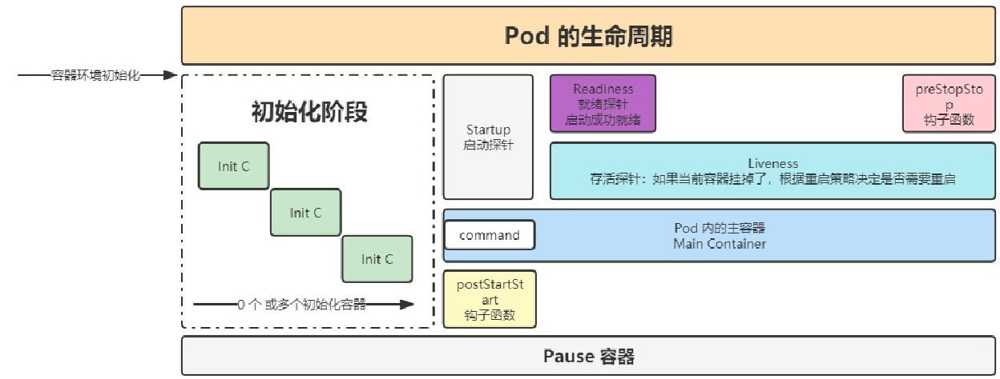

poststart钩子函数：简单举一个功能型例子就是读取验证配置文件，检查容器是否启动等一些功能

preStop钩子函数：举一个简单的例子就是wps在没有自动保存退出的时候会弹出一个提示：是否保存文件，这个就是wps进程结束以后调用的那个钩子函数

#### pod退出流程(删除)

> 删除操作的流程

Endpoint删除pod的ip地址 -> Pod变成Terminating状态 -> 执行preStop的指令


#### PreStop的应用

·

```yaml
apiVersion: v1 # api文档版本
kind: Pod # 资源对象类型，也可以配置为像Deployment、StatefulSet这一类的对象
metadata: # Pod相关的元数据，用于描述Pod的数据
  name: my-nginx # Pod的名称
  labels: # 定义Pod的标签
    type: app #自定义label标签，名字为type，值为app(这里的名字和值都是自定义可改变的)
	version: 1.0 # 自定义label标签，描述Pod版本号(名字和值都是可改变的)
  namespace: 'default' # 命名空间的配置
spec: # 期望Pod按照这里面的描述进行创建
  terminationGracePeriodSeconds: 30 # 当pod被删除，给这个pod多少时间去执行删除操作，默认30s
  containers: # 对于Pod中容器的描述
  - name: nginx # 容器的名称
    image: nginx:1.7.9 # 指定容器的镜像
    imagePullPolicy: IfNotPresent # 镜像拉取策略，指定如果本地有就用本地，如果没有就拉取远程的
    lifecycle: # 生命周期的配置
      postStart: # 生命周期启动阶段做的事情，不一定在容器的command之前运行
        exec:
          command:
          - sh
          - -c
          - "echo '<h1>pre stop</h1>' > /usr/share/nginx/html/prestop.html"
      preStop:
        exec:
          command:
          - sh
          - -c
          - "sleep 50; ehco 'sleep finished...' >> /usr/share/nginx/html/prestop.html"
    command: # 指定容器启动时执行的命令
    - nginx
    - -g
    - 'daemon off;' # nginx -g 'daemon off'
    workingDir: /usr/share/nginx/html # 定义容器启动启动后的工作目录
    ports:
    - name: http # 端口名称
      containerPort: 80 # 描述容器内要暴露什么端口
      protocol: # 描述该端口是基于哪种协议(TCP/UDP)
    env: # 环境变量
    - name: JVM_OPTS # 环境变量名称
      value: '-Xms128m -Xmx128m' # 环境变量的值
    resources:
      requests: # 最少需要多少资源
        cpu: 100m # 限制cpu最少使用0.1个核心(一个核心是1000m,100m就是10%)
        memory: 128Mi # 限制内存最少使用128兆
      limits: # 最多可以用多少资源
        cpu: 200m # 限制cpu最多使用0.2个核心
        memory: 256Mi # 限制内存最多使用256兆
  restartPolicy: OnFailure # 重启策略，只有失败的情况下才会重启
```


## 资源调度

### Label和Selector

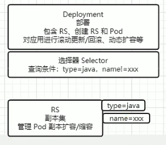

#### Label标签

- 在配置文件中添加laels(metadata)

```yaml
metadata: # Pod相关的元数据，用于描述Pod的数据
  name: my-nginx # Pod的名称
  labels: # 定义Pod的标签
    type: app #自定义label标签，名字为type，值为app(这里的名字和值都是自定义可改变的)
	version: 1.0 # 自定义label标签，描述Pod版本号(名字和值都是可改变的)
  namespace: 'default' # 命名空间的配置
  
  
  # 后期可以通过编辑命令对yaml文件进行修改
  kubectl edit po <资源名>
```


- kubectl中对标签的操作

```bash
# 创建临时的labels标签
kubectl label po <资源名称> app=hello

# 修改labels标签
kubectl label po <资源名称> app=hello2 --overwrite

# selector 按照 label 单值查找节点
kubectl get po -A -l app=hello

# 查看所有节点的 labels
kubectl get po --show-labels
```


#### Seletor选择器

- 在配置文件中增加

在各对象的配置 spec.selector 或其他可以写 selector 的属性中编写


- kubectl中对选择器操作

```bash
# 匹配单个值，查找 app=hello 的 pod
kubectl get po -A -l app=hello

# 匹配多个值
kubectl get po -A -l 'k8s-app in (metrics-server, kubernetes-dashboard)'
或 

# 查找 version!=1 and app=nginx 的 pod 信息
kubectl get po -l version!=1,app=nginx

# 不等值 + 语句
kubectl get po -A -l version!=1,'app in (busybox, nginx)'
```


### Deployment

配置文件

```yaml
apiVersion: apps/v1 # api文档版本
kind: Deployment # 资源对象类型，也可以配置为像Pod、StatefulSet这一类的对象
metadata: # Pod相关的元数据，用于描述Pod的数据
  labels: # 标签
    app: nginx # 具体key:value配置形式
  name: nginx # deploy的名字
  namespace: default # 命名空间的配置
spec: # 期望Pod按照这里面的描述进行创建
  replicas: 1 #期望副本数
  revisionHistoryLimit: 10 # 进行滚动更新后，保留的历史版本数
  selector: # 选择题，用于找到匹配的RS
    matchLabels: # 按照标签匹配
      app: nginx # 匹配的标签key/value
  strategy: # 更新策略
    rollingUpdate:  # 滚动更新配置、
      maxSurge: 25% # 进行滚动更新时，更新的个数最多可以超过期望副本数的个数/比例
      maxUnavailable: 25% # 进行滚动更新时，最大不可用比例更新比例，表示咋子所有副本数中，最多可以有多少个不更新成功
    type: RollingUpdate # 更新类型，采用滚动更新
  template: # pod模板
    metadata: # pod的元信息
      labels: # pod的标签
        app: nginx
    spec: # pod期望信息
      containers: # pod的容器
      - image: nginx:1.7.9 #镜像
        imagePullPolicy: IfNotPresent # 拉取策略
        name: nginx #　容器名称
      restartPolicy: Always # 重启策略
      terminationGracePeriodSeconds: 30 # 当pod被删除，给这个pod多少时间去执行删除操作，默认30s
```


#### 创建

```bash
创建一个 deployment
kubectl create deploy nginx-deploy --image=nginx:1.7.9

或执行
kubectl create -f xxx.yaml --record
--record 会在 annotation 中记录当前命令创建或升级了资源，后续可以查看做过哪些变动操作。

查看部署信息
kubectl get deployments

查看 rs
kubectl get rs

查看 pod 以及展示标签，可以看到是关联的那个 rs
kubectl get pods --show-labels
```


#### 滚动更新

```bash
# 只有修改了 deployment 配置文件中的 template 中的属性后，才会触发更新操作

#修改 nginx 版本号
kubectl set image deployment/nginx-deployment nginx=nginx:1.9.1

# 或者通过 kubectl edit deployment/nginx-deployment 进行修改

# 查看滚动更新的过程
kubectl rollout status deploy <deployment_name>

#查看部署描述，最后展示发生的事件列表也可以看到滚动更新过程
kubectl describe deploy <deployment_name>

# 通过 kubectl get deployments 获取部署信息，UP-TO-DATE 表示已经有多少副本达到了配置中要求的数目

# 通过 kubectl get rs 可以看到增加了一个新的 rs

# 通过 kubectl get pods 可以看到所有 pod 关联的 rs 变成了新的
```

- 多个滚动更新并行：假设当前有 5 个 nginx:1.7.9 版本，你想将版本更新为 1.9.1，当更新成功第三个以后，你马上又将期望更新的版本改为 1.9.2，那么此时会立马删除之前的三个，并且立马开启更新 1.9.2 的任务


#### 回滚

```bash
# 应用场景
# 例如在更新deployment时参数不小心写错了，如nginx:1.9.1写成nginx:1.91
kubectl set image deployment/nginx-deploy nginx=nginx:1.91
# 查看更新操作的滚动更新状态
kubectl rollout status deployments nginx-deploy  # 结果发现滚动更新会卡住，原因时因为下载镜像失败
# 获取rs信息
kubectl get rs # 可以看到新增的 rs 副本数是1个
# 获取pod信息
kubectl get pods #　可以看到关联到新的 rs 的 pod，状态处于 ImagePullBackOff 状态
# 可以获取 revison 的列表
kubectl rollout history deployment/nginx-deploy 
# 查看历史版本详细信息
kubectl rollout history deployment/nginx-deploy --revision=2
# 可以回退到指定的 revision
kubectl rollout undo deployment/nginx-deploy --to-revision=2 #也可以通过 kubectl rollout undo deployment/nginx-deploy 可以回退到上一个版本

# 可以通过设置 .spec.revisonHistoryLimit 来指定 deployment 保留多少 revison，如果设置为 0，则不允许 deployment 回退了。
```


#### 扩容和缩容

- 通过kubectl进行自动扩容/缩容

```bash
kubectl scale --replicas=3 deploy nginx-deploy
```

- 编辑配置文件

```yaml
kubectl edit deploy <资源名> # 编辑replicas

spec: # 期望Pod按照这里面的描述进行创建
  replicas: 1 #期望副本数   --->在这里修改
  revisionHistoryLimit: 10 # 进行滚动更新后，保留的历史版本数
  selector: # 选择题，用于找到匹配的RS
    matchLabels: # 按照标签匹配
      app: nginx # 匹配的标签key/value
```

扩容与缩容只是直接创建副本数，没有更新 pod template 因此不会创建新的 rs


### StatefulSet

#### 创建

- web的配置文件

```yaml
---
apiVersion: v1
kind: Service
metadata:
  name: nginx
  labels:
    app: nginx
spec:
  ports:
  - port: 80
    name: web
  clusterIP: None
  selector:
    app: nginx
---
apiVersion: apps/v1
kind: StatefulSet   # StatefulSet 类型资源
metadata:
  name: web  # StatefulSet 对象的名字
spec:
  serviceName: "nginx" # 使用哪个service来管理dns
  replicas: 2
  selector:
    matchLabels:
      app: nginx
  template:
    metadata:
      labels:
        app: nginx
    spec:
      containers:
      - name: nginx
        image: nginx:1.7.9
        ports: #　容器内部要暴露的端口
        - containerPort: 80　# 具体暴露的端口
          name: web # 该端口配置的名字
        volumeMounts: # 加载数据卷
        - name: www #　指定加载哪个数据卷
          mountPath: /usr/share/nginx/html # 数据挂在的目录
  volumeClaimTemplates: # 数据卷模板
  - metadata: # 数据卷描述
      name: www # 数据卷名称
      annotations: # 数据卷的注解
        volume.alpha.kubernetes.io/storage-class: anything
    spec: # 数据卷的规约
      accessModes: [ "ReadWriteOnce" ] # 访问模式
      resources:
        requests:
          storage: 1Gi #　需要1g的资源空间

```


```shell
kubectl create -f web.yaml
# 查看 service 和 statefulset => sts
kubectl get service nginx
kubectl get statefulset web

# 查看 PVC 信息
kubectl get pvc

# 查看创建的 pod，这些 pod 是有序的
kubectl get pods -l app=nginx

# 查看这些 pod 的 dns
# 运行一个 pod，基础镜像为 busybox 工具包，利用里面的 nslookup 可以看到 dns 信息
kubectl run -i --tty --image busybox:1.28.4 dns-test --restart=Never --rm /bin/sh
nslookup web-0.nginx
```


#### 扩容缩容

```shell
# 扩容
$ kubectl scale statefulset web --replicas=5

# 缩容
$ kubectl patch statefulset web -p '{"spec":{"replicas":3}}'


# 镜像更新（目前还不支持直接更新 image，需要 patch 来间接实现）
# /spec/template/spec/containers/0/image  就是yaml文件里面对应的路径
kubectl patch sts web --type='json' -p='[{"op": "replace", "path": "/spec/template/spec/containers/0/image", "value":"nginx:1.9.1"}]'

```


#### 滚动更新和金丝雀发布

>  滚动更新

StatefulSet 也可以采用滚动更新策略，同样是修改 pod template 属性后会触发更新，但是由于 pod 是有序的，在 StatefulSet 中更新时是基于 pod 的顺序倒序更新的


> 灰度发布（金丝雀发布）目的就是将产品上线的影响降到最低

利用滚动更新中的 partition 属性，可以实现简易的灰度发布的效果

例如我们有 5 个 pod，如果当前 partition 设置为 3，那么此时滚动更新时，只会更新那些 序号 >= 3 的 pod

利用该机制，我们可以通过控制 partition 的值，来决定只更新其中一部分 pod，确认没有问题后再主键增大更新的 pod 数量，最终实现全部 pod 更新

> OneDelete

只有在 pod 被删除时会进行更新操作


#### 删除

```shell
# 删除 StatefulSet 和 Headless Service
# 级联删除：删除 statefulset 时会同时删除 pods
kubectl delete statefulset web
# 非级联删除：删除 statefulset 时不会删除 pods，删除 sts 后，pods 就没人管了，此时再删除 pod 不会重建的
kubectl deelte sts web --cascade=false
# 删除 service
kubectl delete service nginx

# StatefulSet删除后PVC还会保留着，数据不再使用的话也需要删除
kubectl delete pvc www-web-0 www-web-1
```


### DaemonSet


#### 创建


DaemonSet 会忽略 Node 的 unschedulable 状态，有两种方式来指定 Pod 只运行在指定的 Node 节点上：

- nodeSelector：只调度到匹配指定 label 的 Node 上
- nodeAffinity：功能更丰富的 Node 选择器，比如支持集合操作
- podAffinity：调度到满足条件的 Pod 所在的 Node 上


这里先介绍的时nodeSelector节点选择器(后续的两种方法和主节点污染一起介绍)

```yaml
apiVersion: apps/v1
kind: DaemonSet   # 创建 DaemonSet 资源
metadata:
  name: fluentd   # 名字
spec:
  selector:
    matchLabels:
      app: logging
  nodeSelector:   
    type: microservices  # 节点选择器，当节点的type相同时即守护进程生效
  template:
    metadata:
      labels:
        app: logging
        id: fluentd
      name: fluentd
    spec:
      nodeSelector:   
        type: microservices  # 节点选择器，当节点的type相同时即守护进程自动添加
      containers:
      - name: fluentd-es
        image: agilestacks/fluentd-elasticsearch:v1.3.0
        env: # 环境变量配置
         - name: FLUENTD_ARGS # 环境变量的key
           value: -qq  # 环境变量的value
        volumeMounts: # 加载数据卷，避免数据丢失
          - name: containers # 数据卷的名字
            mountPath: /var/lib/docker/contatiners # 将数据卷挂到容器内的哪个目录
          - name: varlog
            mountPath: /varlog
      volumes: # 定义数据卷
          - hostPath: # 数据卷类型，主机路径的模式，也就是与node共享目录
              path: /var/lib/docker/containers # node中的共享目录
            name: containers # 定义的数据卷的名称
          - hostPath:
              path: /var/log
            name: varlog
```


#### 更新

> 建议使用OneDelete的更新策略


### HPA自动扩/缩容

#### 开启指标服务

```bash
# 下载 metrics-server 组件配置文件
wget https://github.com/kubernetes-sigs/metrics-server/releases/latest/download/components.yaml -O metrics-server-components.yaml

# 修改镜像地址为国内的地址
sed -i 's/k8s.gcr.io\/metrics-server/registry.cn-hangzhou.aliyuncs.com\/google_containers/g' metrics-server-components.yaml

# 修改容器的 tls 配置，不验证 tls，在 containers 的 args 参数中增加 --kubelet-insecure-tls 参数

# 安装组件
kubectl apply -f metrics-server-components.yaml

# 查看 pod 状态
kubectl get pods --all-namespaces | grep metrics

```


#### cpu，内存指标监控

实现 cpu 或内存的监控，首先有个前提条件是该对象必须配置了 containers.resources.requests.cpu 或 resources.requests.memory 才可以，可以配置当 cpu/memory 达到上述配置的百分比后进行扩容或缩容

创建一个 HPA：

1. 先准备一个好一个有做资源限制的 deployment
2. 执行命令 kubectl autoscale deploy nginx-deploy --cpu-percent=20 --min=2 --max=5（最少有两个deployment，最多有五个deployment）
3. 通过 kubectl get hpa 可以获取 HPA 信息


deployment的资源限制的yaml配置：

```yaml
containers:
- image: nginx:1.7.9
  imagePullPolicy: IfNotPresent
  name: nginx
  resources:
    limits:  # 最多不能超过的阈值，只能分这么多资源
      cpu: 200m
      memory: 128Mi
    requests:  #　最低超过的阈值，超过最低阈值就会自动扩容
      cpu: 100m
      memory: 128Mi
```


#### HPA功能测试

测试：找到对应服务的 service，编写循环测试脚本提升内存与 cpu 负载
while true; do wget -q -O- http://<ip:port> > /dev/null ; done

可以通过多台机器执行上述命令，增加负载，当超过负载后可以查看 pods 的扩容情况 kubectl get pods

查看 pods 资源使用情况
kubectl top pods

扩容测试完成后，再关闭循环执行的指令，让 cpu 占用率降下来，然后过 5 分钟后查看自动缩容情况


#### 自定义metrics

- 控制管理器开启–horizontal-pod-autoscaler-use-rest-clients
- 控制管理器的–apiserver指向[API Server Aggregator](https://github.com/kubernetes/kube-aggregator)
- 在API Server Aggregator中注册自定义的metrics API


## 服务发布


### service


#### service文件配置

```yaml
apiVersion: v1
kind: Service # 资源类型为Service
metadata:
  name: nginx-svc # Service 自己本身的标签
  labels:
    app: nginx
spec:
  selector: # 匹配哪些pod会被该service代理
    app: nginx-deploy # 所有匹配到这些标签的pod都可以通过该service进行访问
  ports: # 端口映射
  - port: 80 # service 自己的端口，在使用内网的ip访问时使用
    targetPort: 80 # 目标pod的端口
    name: web # 为端口起个名字
  type: NodePort # 随机启动一个端口(30000-32767)，映射到ports中的端口，该端口时直接绑定在node上的，且集群中的每一个node都会绑定这个端口
                 # 也可以用于将服务暴漏在外部访问，但是这种方式实际生产环境不推荐，效率较低，而且Service是四层负载
                 
                 
                 
                 
# 完整版配置文件
apiVersion: v1
kind: Service
metadata:
  name: nginx-svc
  labels:
    app: nginx-svc
spec:
  ports:
  - name: http # service 端口配置的名称
    protocol: TCP # 端口绑定的协议，支持 TCP、UDP、SCTP，默认为 TCP
    port: 80 # service 自己的端口
    targetPort: 9527 # 目标 pod 的端口
  - name: https
    port: 443
    protocol: TCP
    targetPort: 443
  selector: # 选中当前 service 匹配哪些 pod，对哪些 pod 的东西流量进行代理
    app: nginx
  
    
```


#### service基础命令

```bash
# 创建 service
kubectl create -f nginx-svc.yaml

# 查看 service 信息，通过 service 的 cluster ip 进行访问
kubectl get svc 

# 查看 pod 信息，通过 pod 的 ip 进行访问
kubectl get po -owide

# 创建其他 pod 通过 service name 进行访问（推荐）
kubectl exec -it busybox -- sh
curl http://nginx-svc

# 默认在当前 namespace 中访问，如果需要跨 namespace 访问 pod，则在 service name 后面加上 .<namespace> 即可
curl http://nginx-svc.default
```


#### 代理k8s外部服务

实际业务场景：

- 访问k8s集群外的服务（以开发环境，测试环境）
- 服务器的有状态服务迁移（为什么不直接访问外部短时间没有迁移有状态服务然后改配置文件呢？原因：一个有状态服务可能有多个节点需要访问，而如果没有迁移的有状态服务还在云上的时候，一旦有状态服务迁移到集群内部，那么多个几点都得更改配置文件，而如果通过service去访问到后续迁移服务的时候只需要统一改service配置即可）


实现方式：

1. 编写 service 配置文件时，不指定 selector 属性
2. 自己创建 endpoint

```yaml
# service的配置:
apiVersion: v1
kind: Service # 资源类型为Service
metadata:
  name: nginx-svc-ep # Service 自己本身的标签
  labels:
    app: nginx
spec:
  ports: # 端口映射
  - port: 80 # service 自己的端口，在使用内网的ip访问时使用
    targetPort: 80 # 目标pod的端口
    name: web # 为端口起个名字
  type: NodePort # 随机启动一个端口(30000-32767)，映射到ports中的端口，该端口时直接绑定在node上的，且集群中的每一个node都会绑定这个端口
                 # 也可以用于将服务暴漏在外部访问，但是这种方式实际生产环境不推荐，效率较低，而且Service是四层负载

# endpoint 配置：
apiVersion: v1
kind: Endpoints
metadata:
 labels:
  app: nginx # 与 service 一致
 name: nginx-svc-ep # 与 service 一致
 namespace: default # 与 service 一致
subsets:

 - addresses:
  - ip: 202.108.22.5 # 目标 ip 地址，这里用的是百度地址
 ports: # 与 service 一致
  - name: web  # 与service一致
  port: 80
  protocol: TCP


```

#### 反向代理外部

```yaml
apiVersion: v1
kind: Service
metadata:
  labels:
    app: wolfcode-external-domain
  name: wolfcode-external-domain
spec:
  type: ExternalName
  externalName: www.wolfcode.cn

```

#### 端口常用类型

- ClusterIP

只能在集群内部使用，不配置类型的话默认就是 ClusterIP

- ExternalName

在反向代理外部域名中可以使用

- NodePort

会在所有安装了 kube-proxy 的节点都绑定一个端口，此端口可以代理至对应的 Pod，集群外部可以使用任意节点 ip + NodePort 的端口号访问到集群中对应 Pod 中的服务。

当类型设置为 NodePort 后，可以在 ports 配置中增加 nodePort 配置指定端口，需要在下方的端口范围内，如果不指定会随机指定端口

端口范围：30000~32767

端口范围配置在 /usr/lib/systemd/system/kube-apiserver.service 文件中

- LoadBalancer

使用云服务商（阿里云、腾讯云等）提供的负载均衡器服务
