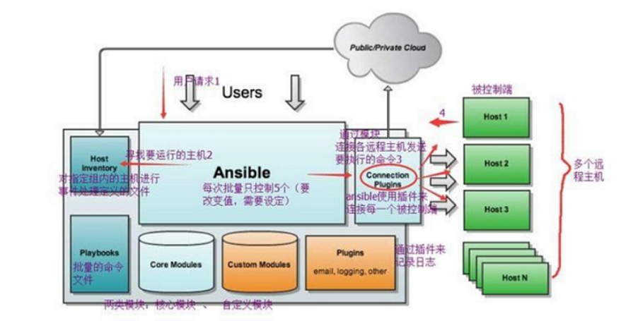
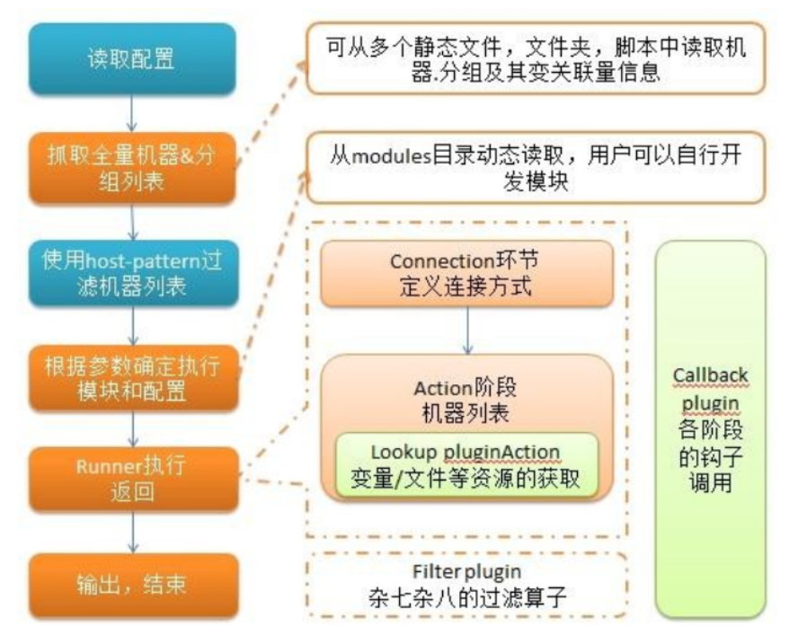

# Ansible


## ansible相关命令

```bash
# TARGET_GROUP:标签分组
# mode=600 rwx
ansible TARGET_GROUP -m copy -a "src=/root/.ssh/id_rsa.pub dest=/root/.ssh/authorized_keys mode=600"

# -i --input 指明是哪个文件
ansible TARGET_GROUP -m shell -a "whoami" -i hosts

# 一键运行剧本
ansible-playbook YOUR_PLAYBOOK.yaml -i hosts
```


## 主机清单配置文件

```conf
[test]
192.168.1.1 ansible_user=root ansible_password=root ansible_port=22
192.168.1.2 ansible_user=root ansible_password=root ansible_port=22
192.168.1.3 ansible_user=root ansible_password=root ansible_port=22
[GROUP_NAME]
192.168.2.1 ansible_user=root ansible_password=root ansible_port=22
192.168.2.2 ansible_user=root ansible_password=root ansible_port=22
192.168.2.3 ansible_user=root ansible_password=root ansible_port=22
```


## 剧本

```yaml
- hosts: ceph
  remote_user: root
  tasks:
    - name: change password
      user: name=root password={{ item.password | password_hash('sha512') }} update_password=always
      with_items:
        - {password: 'YOUR_PASSWORD'}

```


## 架构



`Ansible`：Ansible核心程序。
`HostInventory`：记录由Ansible管理的主机信息，包括端口、密码、ip等。
`Playbooks`：“剧本”YAML格式文件，多个任务定义在一个文件中，定义主机需要调用哪些模块来完成的功能。
`CoreModules`：**核心模块**，主要操作是通过调用核心模块来完成管理任务。
`CustomModules`：自定义模块，完成核心模块无法完成的功能，支持多种语言。
`ConnectionPlugins`：连接插件，Ansible和Host通信使用

流程：用户使用ansible后寻找要运行的主机。主机的信息由HostInventory存储，接着通过模块连接各个远程主机发送要执行的命令，多个远程主机被控制


## ansible执行任务

Ansible 系统由控制主机对被管节点的操作方式可分为两类，即`adhoc`和`playbook`：

- ad-hoc模式(点对点模式)
  　　使用单个模块，支持批量执行单条命令。ad-hoc 命令是一种可以快速输入的命令，而且不需要保存起来的命令。**就相当于bash中的一句话shell。**
- playbook模式(剧本模式)
  　　是Ansible主要管理方式，也是Ansible功能强大的关键所在。**playbook通过多个task集合完成一类功能**，如Web服务的安装部署、数据库服务器的批量备份等。可以简单地把playbook理解为通过组合多条ad-hoc操作的配置文件。


## ansible执行流程




1. 加载自己的配置文件，默认`/etc/ansible/ansible.cfg`；
2. 查找对应的主机配置文件，找到要执行的主机或者组；
3. 加载自己对应的模块文件，如 command；
4. 通过ansible将模块或命令生成对应的临时py文件(python脚本)， 并将该文件传输至远程服务器；
5. 对应执行用户的家目录的`.ansible/tmp/XXX/XXX.PY`文件；
6. 给文件 +x 执行权限；
7. 执行并返回结果；
8. 删除临时py文件，`sleep 0`退出；

简单理解就是Ansible在运行时， 首先读取`ansible.cfg`中的配置， 根据规则获取`Inventory`中的管理主机列表， 并行的在这些主机中执行配置的任务， 最后等待执行返回的结果。

## 安装

```bash
apt install ansible -y
```

- ansible的程序结构

安装目录如下：
　　配置文件目录：/etc/ansible/
　　执行文件目录：/usr/bin/
　　Lib库依赖目录：/usr/lib/pythonX.X/site-packages/ansible/
　　Help文档目录：/usr/share/doc/ansible-X.X.X/
　　Man文档目录：/usr/share/man/man1/


## ansible配置文件

ansible 的配置文件为`/etc/ansible/ansible.cfg`，ansible 有许多参数，下面我们列出一些常见的参数

```cfg
inventory = /etc/ansible/hosts		#这个参数表示资源清单inventory文件的位置
library = /usr/share/ansible		#指向存放Ansible模块的目录，支持多个目录方式，只要用冒号（：）隔开就可以
forks = 5		#并发连接数，默认为5
sudo_user = root		#设置默认执行命令的用户
remote_port = 22		#指定连接被管节点的管理端口，默认为22端口，建议修改，能够更加安全
host_key_checking = False		#设置是否检查SSH主机的密钥，值为True/False。关闭后第一次连接不会提示配置实例
timeout = 60		#设置SSH连接的超时时间，单位为秒
log_path = /var/log/ansible.log		#指定一个存储ansible日志的文件（默认不记录日志）

```


```txt
[bs]
10.4.6.201
10.4.6.202
10.4.6.203
10.4.6.204
10.4.6.205
10.4.6.206
10.4.6.207
```


```yaml
- hosts: bs
  remote_user: root
  tasks:
    - name: put apt.source
      copy: src=./sources.list dest=/etc/apt/ owner=root mode=0644
    - name: apt update
      shell: apt update
    - name: install some tools
      shell: apt install wget sudo apt-transport-https ca-certificates curl gnupg2 lsb-release software-properties-common -y
    - name: add ustc docker source
      shell: echo "deb [arch=amd64] https://mirrors.ustc.edu.cn/docker-ce/linux/debian bullseye stable\n# deb-src [arch=amd64] https://mirrors.ustc.edu.cn/docker-ce/linux/debian bullseye stable" > /etc/apt/sources.list.d/docker.list
    - name: add ustc docker source gpg
      shell: curl -fsSL https://mirrors.ustc.edu.cn/docker-ce/linux/debian/gpg | apt-key add -
    - name: docker-ce
      shell: apt update && apt install docker-ce -y
    - name: docker mirror
      shell: echo "{\n\t\"exec-opts\":[\"native.cgroupdriver=systemd\"],\n\t\"registry-mirrors\":[\"http://hub-mirror.c.163.com\"]\n}" > /etc/docker/daemon.json
    - name: reload docker
      shell: systemctl daemon-reload && systemctl restart docker
```

 

```shell
ansible-playbook docker.yaml -i hosts
ansible -m shell -a "rm -r xxxx" -u root -i hosts
```


[ansible详解_ansible命令详解-CSDN博客](https://blog.csdn.net/wq1205750492/article/details/124497925)
