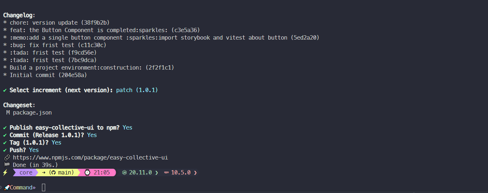
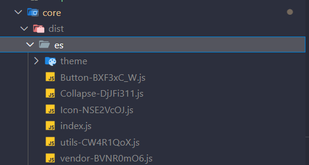
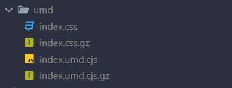
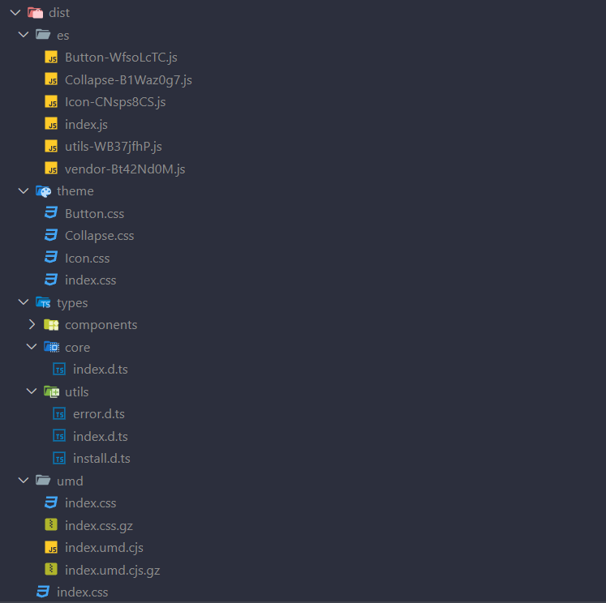
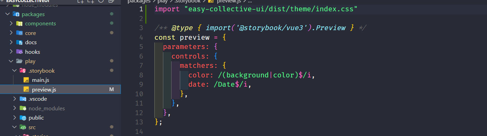
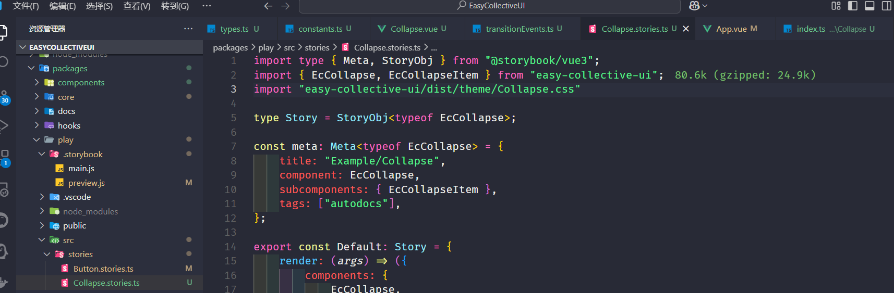

## 环境搭建

### 配置项

```shell
# 初始化git
git init
# 创建.gitignore文件(windows)
type nul > filename.txt # 这边直接手动创建就行
# 创建.gitignore文件(linux)
vim .gitignore
# 创建packages存放子包
mkdir packages
# 创建pnpm工作空间
# 这一步其实就是根目录创建一个pnpm-workspace.yaml文件，然后将packages:\n - "packages/*"写入文件中
# packages:
#   - "packages/*"
echo -e 'packages:\n - "packages/*"' > pnpm-workspace.yaml
# 初始化pnpm
pnpm init
# 切换目录到packages
cd packages
# 这里用到init.shell的脚本文件初始化（init.shell脚本内容如下）
./init.shell
```

*install.shell*

```shell
# 切换到packages目录创建必要的目录
mkdir components core docs hooks theme utils
# 遍历创建的必要目录,逐个初始化
for i in components core docs hooks theme utils; do
    # 切换到对应的目录
    cd $i
    # 初始化pnpm
    pnpm init
    # 返回上级目录
    cd ..

done
```


各个目录对应的功能
```bash
# 创建一个vue-ts的模板的vite的vue的项目,平时写组件看效果的地方
pnpm create vite play --template vue-ts
# 项目各个目录的作用
packages
├── components # 组件的逻辑代码
├── core       # pnpm包的入口
├── docs       # 项目文档
├── hooks      # 自定义的钩子(组合式api)
├── play       # 写组件看效果的地方
├── theme      # 样式
├── utils      # 工具函数
└── init.sh    # 创建目录的脚本(用完就删除)
```

```json
//  修改各个包里面的packages的name
// 格式: `@easy-collective-ui/目录名`
// 只用core底下的用 `easy-collective-ui`

// core/package.json
{
  "name": "@easy-collective-ui"
}

// components/package.json
{
    "name": "@easy-collective-ui/components"
}

// docs/package.json
{
  "name": "@easy-collective-ui/docs"
}

// hooks/package.json
{
  "name": "@easy-collective-ui/hooks"
}

// theme/package.json
{
  "name": "@easy-collective-ui/theme"
}

// utils/package.json
{
  "name": "@easy-collective-ui/utils"
}

// play/package.json
{
  "name": "@easy-collective-ui/play"
}


// 这样做可以避免和其他库重名
```

去项目的根目录安装依赖

```shell
# 返回根目录
cd ..
# 安装开发依赖
pnpm add -Dw typescript@^5.2.2 vite@^5.1.4 vitest@^1.4.0 vue-tsc@^1.8.27 postcss-color-mix@^1.1.0 postcss-each@^1.1.0 postcss-each-variables@^0.3.0 postcss-for@^2.1.1 postcss-nested@^6.0.1 @types/node@^20.11.20 @types/lodash-es@^4.17.12 @vitejs/plugin-vue@^5.0.4 @vitejs/plugin-vue-jsx@^3.1.0 @vue/tsconfig@^0.5.1

# 安装非开发依赖
pnpm add -w lodash-es@^4.17.21 vue@^3.4.19
```

配置根目录的package.json文件

```json
// 修改根目录底下的packages文件的name为@easy-collective-ui/workspace
{
    name:"@easy-collective-ui/workspace"
}
// 在dependencies中添加子包
"dependencies":{
    ...
    "easy-collective-ui": "workspace:*",
    "@easy-collective-ui/hooks": "workspace:*",
    "@easy-collective-ui/utils": "workspace:*",
    "@easy-collective-ui/theme": "workspace:*"
}
```

```shell
# 安装子包依赖
#　这里--filter安装的是对应的后面的子包里面的依赖
pnpm add -D @vue/test-utils@2.4.5 @vitest/coverage-v8@^1.4.0 jsdom@^24.0.0 --filter @easy-collective-ui/components

pnpm add @popperjs/core@^2.11.8 async-validator@^4.2.5 --filter @easy-collective-ui/components
```

```json
// 在core的packages.json中添加如下
"dependencies":{
    "@easy-collective-ui/components": "workspace:*"
}
// 因为core是pnpm包的入口文件
// 因此这里需要把core和components链接
```

```shell
# docs依赖的是vitepress
pnpm add -D vitepress@1.0.0-rc.44 --filter @easy-collective-ui/docs
# 把play的packages.json文件对照根目录的packages.json文件进行裁剪,重复的依赖项可以直接删掉
#　然后把play目录底下的tsconfig.json和tsconfig.node.json删除(因为要在全局写一个tsconfig文件)
# 根目录创建tsconfig.json
touch tsconfig.json # 也可以图形化创建
touch tsconfig.node.json # 也可以图形化创建
# 添加postcss.config.json配置文件
touch postcss.config.cjs
# 在根目录进行node_moudles的安装
pnpm install
```

tsconfig.json
```json
{
  "extends": "@vue/tsconfig/tsconfig.dom.json",
  "compilerOptions": {
    "target": "ES2020",
    "useDefineForClassFields": true,
    "module": "ESNext",
    "lib": ["ES2020", "DOM", "DOM.Iterable"],
    "skipLibCheck": true,

    /* Bundler mode */
    "moduleResolution": "bundler",
    "allowImportingTsExtensions": true,
    "resolveJsonModule": true,
    "isolatedModules": true,
    "noEmit": true,
    "jsx": "preserve",
    "jsxImportSource": "vue",

    /* Linting */
    "strict": true,
    "noUnusedLocals": true,
    "noUnusedParameters": true,
    "noFallthroughCasesInSwitch": true
  },
  "include": ["packages/**/*.ts", "packages/**/*.tsx", "packages/**/*.vue"]
}
```

tsconfig.node.json
```json
{
  "extends": "@tsconfig/node18/tsconfig.json",
  "include": ["packages/**/**.config.ts"],
  "compilerOptions": {
    "composite": true,
    "module": "ESNext",
    "moduleResolution": "Bundler",
    "types": ["node"]
  }
}
```

postcss.config.cjs

```js
/* eslint-env node */
module.exports = {
  plugins: [
    require("postcss-nested"),
    require("postcss-each-variables"),
    require("postcss-each")({
      plugins: {
        beforeEach: [require("postcss-for"), require("postcss-color-mix")],
      },
    }),
  ],
};
```

.gitignore
```text
# Logs
logs
*.log
npm-debug.log*
yarn-debug.log*
yarn-error.log*
pnpm-debug.log*
lerna-debug.log*

node_modules
coverage
dist
dist-ssr
*.local

/cyperss/videos/
/cypress/srceenshots/

.vitepress/dist
.vitepress/cache

# Editor directories and files
.vscode/*
!.vscode/extensions.json
.idea
.DS_Store
*.suo
*.ntvs*
*.njsproj
*.sln
*.sw?
```


### 测试代码

- 工具类(/package/util)

```ts
// 安装插件的工具函数封装(install.ts)

// 引入 Vue 中的 App 和 Plugin 类型，用于定义插件和应用实例的类型
import type { App,Plugin } from "vue"
// 从 lodash-es 库中引入 each 函数，用于遍历数组或对象。
import { each } from "lodash-es"

// 定义一个单文件组件类型SFCWithInstall，交叉类型(vue 插件类型和泛型的混合)
type SFCWithInstall<T> = T & Plugin

/**
 * 接受一个 Plugin 类型的数组 components，用于批量安装组件
 * @param componets 
 * @returns 
 */
// 定义一个导出函数 makeInstaller，接受一个 Plugin 类型的数组 components，用于批量安装组件。
export function makeInstaller(componets: Plugin[]){
    const installer = (app: App) => {
        // 使用 each 函数遍历 components 数组，将每个组件使用 app.use 方法进行安装。
        each(componets,(c) => app.use(c))
    }
    // 返回 installer 函数，作为插件。
    return installer as Plugin
}

/**
 * 接受一个泛型 T 的组件，用于给组件添加 install 方法，使其成为插件。
 * @param component  
 * @returns 
 */
// 定义一个导出函数 withInstall，接受一个泛型 T 的组件，用于给组件添加 install 方法，使其成为插件。
export const withInstall = <T>(component: T) => {
    // 给组件添加 install 方法，接受一个 App 类型的参数 app，用于将组件注册到应用实例中。
    (component as SFCWithInstall<T>).install = (app: App) => {
        // 获取组件的名称，并使用 app.component 方法将组件注册到应用实例中。
        const name = (component as any).name
        // 使用 app.component 方法将组件注册到应用实例中。
        app.component(name,component as Plugin)
    }
    // 返回组件，作为带有 install 方法的插件。
    return component as SFCWithInstall<T>
}


// 导出封装好的工具 index.ts
export * from "./install"
```


- 测试组件(/packages/components)

```vue
<!-- /Button/Button.vue 测试的按钮组件 -->
<template>
    <button style="background: pink;">这是一个按钮</button>
</template>
<script setup lang="ts">
defineOptions({
    name:"EcButton"
})
</script>
```

```ts
// /Button/index.ts 测试的按钮组件的入口文件

// 导入组件和暗转组件的工具函数
import Button from "./Button.vue"
import { withInstall } from "@easy-collective-ui/utils"

// 使用 withInstall 函数给组件添加 install 方法，使其成为插件。
export const EcButton = withInstall(Button) 
```


```ts
// index.ts
// 导出封装好的插件按钮组件
export * from './Button'
```

- 入口文件(packages/core)

```ts
// commponents.ts 导入所有组件
import { EcButton } from "@easy-collective-ui/components";
import type { Plugin } from "vue";

// 定义一个数组，导出所有的插件组件到数组中默认导出
export default [EcButton] as Plugin[];


// index.ts 包入口文件
// 导入安装组件工具函数
import { makeInstaller } from "@easy-collective-ui/utils";
// 从组件文件夹导入组件
import commponents from "./commponents";
// 导入主题样式
import '@easy-collective-ui/theme/index.css';

// 使用 makeInstaller 函数批量安装组件
const installer = makeInstaller(commponents);

// 导出组件和安装器 这里默认导出安装器是为了在其他项目中调用的时候可以直接使用
export * from "@easy-collective-ui/components"
export default installer;
```
- 主题样式(/packages/theme)

```css
/* index.css */
/* 导入样式文件 */
@import "./reset.css"


/** reset.css */
body {
  font-family: var(--er-font-family);
  font-weight: 400;
  font-size: var(--er-font-size-base);
  line-height: calc(var(--er-font-size-base) * 1.2);
  color: var(--er-text-color-primary);
  -webkit-font-smoothing: antialiased;
  -moz-osx-font-smoothing: grayscale;
  -webkit-tap-highlight-color: transparent;
}

a {
  color: var(--er-color-primary);
  text-decoration: none;

  &:hover,
  &:focus {
    color: var(--er-color-primary-light-3);
  }

  &:active {
    color: var(--er-color-primary-dark-2);
  }
}

h1,
h2,
h3,
h4,
h5,
h6 {
  color: var(--er-text-color-regular);
  font-weight: inherit;

  &:first-child {
    margin-top: 0;
  }

  &:last-child {
    margin-bottom: 0;
  }
}

h1 {
  font-size: calc(var(--er-font-size-base) + 6px);
}

h2 {
  font-size: calc(var(--er-font-size-base) + 4px);
}

h3 {
  font-size: calc(var(--er-font-size-base) + 2px);
}

h4,
h5,
h6,
p {
  font-size: inherit;
}

p {
  line-height: 1.8;

  &:first-child {
    margin-top: 0;
  }

  &:last-child {
    margin-bottom: 0;
  }
}

sup,
sub {
  font-size: calc(var(--er-font-size-base) - 1px);
}

small {
  font-size: calc(var(--er-font-size-base) - 2px);
}

hr {
  margin-top: 20px;
  margin-bottom: 20px;
  border: 0;
  border-top: 1px solid var(--er-border-color-lighter);
}
```

```json
/** package.json */
{
  "name": "@easy-collective-ui/theme",
  "version": "1.0.0",
  "description": "",
  "main": "index.css",  //修改这里把index.css作为入口文件
  "scripts": {
    "test": "echo \"Error: no test specified\" && exit 1"
  },
  "keywords": [],
  "author": "",
  "license": "ISC"
}
```


- 测试案例(/packages/play)

```ts
// main.ts 测试的vite项目的入口文件，这里注册我们写的组件看是否成功写对
import { createApp } from 'vue'
import './style.css'
import App from './App.vue'
import EasyCollectivUI from 'easy-collective-ui'


createApp(App).use(EasyCollectivUI).mount('#app')
```

### 文档

> 创建文档

```shell
# 到package/docs的目录中使用初始化命令
cd /packages/docs
npx vitepress init
```

[创建文档详情见文章：建站](https://mzmm403.github.io/markdown/tobuild/build.html)


### 修改最外层的package.json

```json
{
  "scripts": {
    "dev": "pnpm --filter @toy-element/play dev",
    "docs:dev": "pnpm --filter @toy-element/docs dev",
    "docs:build": "pnpm --filter @toy-element/docs build",
    "test": "echo 'hello world'"
  }
}
```


创建一个 `.github/workflows/test-and-deploy.yml` 文件，内容如下

```yaml
name: Test and deploy

on:
  push:
    branches:
      - master

jobs:
  test:
    name: Run Lint and Test
    runs-on: ubuntu-latest

    steps:
      - name: Checkout repo
        uses: actions/checkout@v3

      - name: Setup Node
        uses: actions/setup-node@v3

      - name: Install pnpm 
        run: npm install -g pnpm

      - name: Install dependencies
        run: pnpm install --frozen-lockfile

      - name: Run tests
        run: npm run test

  build:
    name: Build docs
    runs-on: ubuntu-latest
    needs: test

    steps:
      - name: Checkout repo
        uses: actions/checkout@v3

      - name: Setup Node
        uses: actions/setup-node@v3

      - name: Install pnpm
        run: npm install -g pnpm

      - name: Install dependencies
        run: pnpm install --frozen-lockfile

      - name: Build docs
        run: npm run docs:build

      - name: Upload docs
        uses: actions/upload-artifact@v3
        with:
          name: docs
          path: ./packages/docs/.vitepress/dist

  deploy:
    name: Deploy to GitHub Pages
    runs-on: ubuntu-latest
    needs: build
    steps:
      - name: Download docs
        uses: actions/download-artifact@v3
        with:
          name: docs

      - name: Deploy to GitHub Pages
        uses: peaceiris/actions-gh-pages@v3
        with:
          github_token: ${{ secrets.GH_TOKEN }}
          publish_dir: .
```

上面的`secrets.GH_TOKEN`去github创建，然后放到仓库里的配装项中，下次在推送代码的时候会自动部署


## 打包发布项目

### 打包项目

> 这里打包分为两种版本一种是umd,一种是es。

- 打包完成别人在用我们的组件库的时候没有类型提示，因此我们还要安装一个vite的插件，在core目录底下安装即可

```shell
pnpm add vite-plugin-dts@3.9.1 -D
```

- 在入口文件夹也就是core文件夹中创建一个`vite.umd.config.ts` 因为我们这里打包用的是vite

```ts
import { defineConfig } from 'vite'
import vue from "@vitejs/plugin-vue"
import { resolve } from 'path'

export default defineConfig({
    plugins: [vue()],
    // 打包构建
    build: {
        // 输出目录
        outDir: "dist/umd",
        // 库模式
        lib:{
            // 入口文件
            entry: resolve(__dirname, "./index.ts"),
            // 打包项目名称
            name: "EasyCollectiveUI",
            fileName: "index",
            formats: ['umd']
        },
        rollupOptions: {
            external: ['vue'],
            output: {
                exports: 'named',
                globals: {
                    vue: 'Vue',
                },
                assetFileNames: (assetInfo) => {
                    if(assetInfo.name === "style.css") return "index.css";
                    return assetInfo.name as string;
                }
            },
        }
    }
})
```

- 因为我们预期是要把ts的一些类型文件全部分开放到types文件下，且要求core/hooks/components/utils目录下的ts文件支持类型判断,因此在根目录下创建`tsconfig.build.config`文件

```json
{
    "extends": "@vue/tsconfig/tsconfig.dom.json",
    "compilerOptions": {
        "target": "ES2020",
        "useDefineForClassFields": true,
        "module": "ESNext",
        "lib": ["ES2020", "DOM", "DOM.Iterable"],
        "skipLibCheck": true,

      /* Bundler mode */
        "moduleResolution": "bundler",
        "allowImportingTsExtensions": true,
        "resolveJsonModule": true,
        "isolatedModules": true,
        "noEmit": true,
        "jsx": "preserve",
        "jsxImportSource": "vue",

      /* Linting */
        "strict": true,
        "noUnusedLocals": true,
        "noUnusedParameters": true,
        "noFallthroughCasesInSwitch": true
    },
    "include": [
        "packages/core/index.ts",
        "packages/hooks/**/*.ts",
        "packages/utils/**/*.ts",
        "packages/components/index.ts",
        "packages/components/**/*.ts",
        "packages/components/**/*.vue"
    ]
}
```


- core文件夹下的`vite.es.config.ts`文件如下，这里因为要类型判断引入插件dts以及`tsconfig.build.config`文件做打包的类型文件控制：

```ts
import { defineConfig } from 'vite'
import vue from "@vitejs/plugin-vue"
import { resolve } from 'path'
import dts from 'vite-plugin-dts'

export default defineConfig({
    plugins: [vue(),dts({
        tsconfigPath: "../../tsconfig.build.json",
        outDir: "dist/types"
    })],
    // 打包构建
    build: {
        // 输出目录
        outDir: "dist/umd",
        // 库模式
        lib:{
            // 入口文件
            entry: resolve(__dirname, "./index.ts"),
            // 打包项目名称
            name: "EasyCollectiveUI",
            fileName: "index",
            formats: ['es']
        },
        rollupOptions: {
            external: [
                'vue',
                "@fortawesome/fontawesome-svg-core",
                "@fortawesome/free-solid-svg-icons",
                "@fortawesome/vue-fontawesome",
                "@popperjs/core",
                "async-validator"
            ],
            output: {
                assetFileNames: (assetInfo) => {
                    if(assetInfo.name === "style.css") return "index.css";
                    return assetInfo.name as string;
                }
            },
        }
    }
})
```


- 对应的入口文件夹下的package.json文件如下

```json
{
  "name": "easy-collective-ui",
  "version": "1.0.0",
  "description": "",
  "type": "module",
  "main": "index.js",
  "scripts": {
    "build-umd": "vite build --config vite.umd.config.ts",
    "build-es": "vite build --config vite.es.config.ts" 
  },
  "keywords": [],
  "dependencies":{
    "@easy-collective-ui/components": "workspace:*"
  },
  "author": "",
  "license": "ISC"
}
```


- 现在对于es来说分包还是不是很理想，因为组件会有很多种以及还有一些工具类型和hooks，因此这里做一个分包

```ts
import { defineConfig } from 'vite'
import vue from "@vitejs/plugin-vue"
import { resolve } from 'path'
import dts from 'vite-plugin-dts'

// 这里是所有组件名称的数组
const COMP_NAMES = [
    "Alert",
    "Button",
    "Collapse",
    "Dropdown",
    "Form",
    "Icon",
    "Input",
    "Loading",
    "Message",
    "MessageBox",
    "Notification",
    "Overlay",
    "Popconfirm",
    "Select",
    "Switch",
    "Tooltip",
    "Uplaod",
] as const;


export default defineConfig({
    plugins: [vue(),dts({
        tsconfigPath: "../../tsconfig.build.json",
        outDir: "dist/types"
    })],
    // 打包构建
    build: {
        // 输出目录
        outDir: "dist/es",
        // 库模式
        lib:{
            // 入口文件
            entry: resolve(__dirname, "./index.ts"),
            // 打包项目名称
            name: "EasyCollectiveUI",
            fileName: "index",
            formats: ['es']
        },
        rollupOptions: {
            external: [
                'vue',
                "@fortawesome/fontawesome-svg-core",
                "@fortawesome/free-solid-svg-icons",
                "@fortawesome/vue-fontawesome",
                "@popperjs/core",
                "async-validator"
            ],
            output: {
                assetFileNames: (assetInfo) => {
                    if(assetInfo.name === "style.css") return "index.css";
                    return assetInfo.name as string;
                },

                // 这里做了一个分包，按照目录以及组件名称进行的分包
                manualChunks(id){
                    if(id.includes('node_modules')){
                        return "vendor"
                    }
                    if(id.includes("packages/hooks")){
                        return "hooks"
                    }
                    if(id.includes("packages/utils")){
                        return "utils"
                    }
                    for (const item of COMP_NAMES) {
                        if(id.includes(`packages/components/${item}`)){
                            return item
                        }
                    }
                }
            },
        }
    }
})
```

- 分包完以后接着我们要把css样式文件单独放到一个文件家里，这个时候就要一个库

```shell
pnpm add move-file-cli@^3.0.0 -Dw
```

- 然后再`core/packages.json`文件中添加新的执行脚本

```json
"script": {
  "move-style": "move-file dist/es/index.css dist/index.css"
}
```

- 由于我们要串联这些npm的script，所以这个时候需要另外一个包
```shell
pnpm add npm-run-all@^4.1.5 -Dw
```
- 然后再`core/packages.json`文件中添加新的执行脚本

```json
// 这里的run-s是串联，run-p是并联

"script": {
  "build": "run-s build-only move-style",
  "build-only": "run-p build-es build-umd"
}
```

### npm包的发布

> 关于npm发的开发体验

- 关于npm的源管理器，nrm
```shell
# 和nvm类似，nrm也是一个npm源管理器
# 查看当前npm源
nrm ls
# 使用npm官方源
# 在进行npm发部的时候，要使用官方源
nrm use npm
```


- 登录npm账号

```shell
npm login
# 到网页进行登录验证
npm whoami
# 查看当前是否登录，登录的账户是谁
```

- 这里还要推荐一个包,rimraf，这是一个删除文件的工具

```shell
# 添加项目依赖
pnpm add rimraf -Dw
#　在package.json中添加
"clean": "rimraf dist"

#　在项目打包前先清理之前的打包文件
"build": "run-s clean build-only move-style",
```


- 关于包的发部,这里推荐release-it，这是一个发布工具

```shell
pnpm add release-it -Dw 

# 在package.json中添加
"release": "release-it"

# 发布
npm run release
# 选择版本号然后同意即可
# 在发布前要进行打包
# 后续的打包在根目录进行完成即可
```




> 语义化版本号的三个部分

在语义化版本控制(Sematic Versioning, 简称SemVer)中，版本号主要由三个部分组成：主版本号(MAJOR)、次版本号(MINOR)和修订号(PATCH),格式为：`主本号.次版本号.修订号`


- 主版本号(MAJOR)
  - 当你兼容的API修改时，增加主版本号
  - 这表示该版本包含了重大更改，使用此新版本的用户需要对代码进行响应修改

- 次版本号(MINOR)
  - 当你添加向下兼容的功能时，增加次版本号
  - 意味着型版本添加了新功能，但是现有api保持不变，因此使用型版本用户不需要修改代码

- 修订号(PATCH)
  - 当你做了向下兼容的问题修正时，新增修订号
  - 这表示新版本修复了一些问题，但并没有引入新功能，使用此版本的用户可以期望获得更稳定的体验

- 与发布版本标识符
  - 可以附加一个预发布版本标识符(如：`alpha`,`beta`,`rc`等)来标识开发中的版本，通常用于测试阶段

- 构建元数据
  - 可以用于提供有关构建的附加信息，如构建时间或构建系统信息


### 打包的二次优化

- css的分包处理

  1. 再core的`vite.es.config.ts`文件中添加新的配置参数`cssCodeSplit`，我们在用库模式的时候，这个参数默认是false

    ```ts
    // build打包的时候将cssCodeSplit设置为true
        build: {
            outDir: "dist/es",
            cssCodeSplit: true,
            lib:{
                entry: resolve(__dirname, "./index.ts"),
                name: "EasyCollectiveUI",
                fileName: "index",
                formats: ['es']
            },
            rollupOptions: {
                external: [
                    'vue',
                    "@fortawesome/fontawesome-svg-core",
                    "@fortawesome/free-solid-svg-icons",
                    "@fortawesome/vue-fontawesome",
                    "@popperjs/core",
                    "async-validator"
                ],
                output: {
                    assetFileNames: (assetInfo) => {
                        if(assetInfo.name === "style.css") return "index.css";
                        // 在这里加上一个判断，如果是css文件就单独打包到theme文件夹下
                        if(
                            assetInfo.type === "asset" && 
                            /\.(css)$/i.test(assetInfo.name as string)
                        ){
                            return 'theme/[name].[ext]'
                        }
                        return assetInfo.name as string;
                    },
                    manualChunks(id){
                        if(id.includes('node_modules')){
                            return "vendor"
                        }
                        if(id.includes("packages/hooks")){
                            return "hooks"
                        }
                        if(id.includes("packages/utils")){
                            return "utils"
                        }
                        for (const item of getDirectoriesSync("../components")) {
                            if(id.includes(`packages/components/${item}`)){
                                return item
                            }
                        }
                    },
                },
            }
        }
  ```

  2. 这里我们还要删除core原来`package.json`中的build行为中的move-style动作，因为我们已经在vite.es.config.ts中做了css的分包处理,然后进行打包发现打包后的css文件的theme目录在es目录下。
    
    - 因此我们需要把theme目录移除和es同级
      我们在core目录下自定义一个插件
      这里我们手动实现清除上次打包的产物和移动css文件到theme目录的动作，所以我们把`core/package.json`中的clean和move-style动作删除

      ```ts
      // 这个插件实际上就用到了两个生命周期,
      // 在vite的自定义插件中一般有两种生命周期，vite独有的钩子和通用钩子(一般就是rollup的钩子)
      // 这个插件是想在打包的时候把上一次打包的css分割出去的产物删除,然后在打包结束的时候把打包后的产物移动到指定目录
      // 所以这里用到了通用钩子buildStart和buildEnd

      import {each,isFunction} from 'lodash-es'
      import shell from 'shelljs'

      export default function hooksPlugin({
          rmFiles = [],
          beforeBuild,
          afterBuild,
      }:{
          rmFiles?:string[];
          beforeBuild?:Function;
          afterBuild?:Function;
      }){
          return {
              // 插件的名字
              name: 'hooks-plugin',
              buildStart(){
                  each(rmFiles,(fName) => shell.rm("-rf",fName));
                  isFunction(beforeBuild) && beforeBuild();
              },
              buildEnd(err?:Error){
                  !err && isFunction(afterBuild) && afterBuild();
              }
          }
      }
      ```
      然后分别在`core/vite.es.config.ts`和`core/vite.umd.config.ts`中注册插件。
      ```ts
      // es
      const TRY_MOVE_STYLES_DELAY = 800 as const

      function moveStyles(){
          try{
              readdirSync('./dist/es/theme')
              shell.mv("./dist/es/theme","./dist")
          }catch(_){
              delay(moveStyles,TRY_MOVE_STYLES_DELAY)
          }
      }

      export default defineConfig({
        plugins: [
            vue(),
            dts({
                    tsconfigPath: "../../tsconfig.build.json",
                    outDir: "dist/types"
            }),
            hooks({
                rmFiles:['./dist/es','./dist/theme','./dist/types'],
                afterBuild: moveStyles 
            })
        ],
        ...
      })

      // umd
      const TRY_MOVE_STYLES_DELAY = 800 as const

      function moveStyles(){
          try{
              readFileSync('./dist/umd/index.css.gz')
              shell.cp("./dist/umd/index.css","./dist/index.css")
          }catch(_){
              delay(moveStyles,TRY_MOVE_STYLES_DELAY)
          }
      }

      export default defineConfig({
        plugins: [
            vue(),
            compression({
                include: /.(cjs|css)$/i,
            }),
            hooks({
                rmFiles:["./dist/umd","./dist/index.css"],
                afterBuild: moveStyles,
            })
        ],
        ...
      })
      ```

    - 把umd模式打包的文件进行压缩
      ```shell
      # 切换到core目录
      cd packages/core
      # 安装一个vite的插件
      pnpm add vite-plugin-compression2 -D
      ```
    在`core/vite.umd.config.ts`中添加插件
    ```ts
    import { defineConfig } from 'vite'
    import vue from "@vitejs/plugin-vue"
    import { resolve } from 'path'
    // 新增压缩插件
    import { compression } from "vite-plugin-compression2"


    export default defineConfig({
        plugins: [
          vue(),
          // 新增压缩插件配置，这里只对cjs和css文件进行压缩
          compression({
              include: /.(cjs|css)$/i,
          })
        ],
        // 打包构建
        build: {
            // 输出目录
            outDir: "dist/umd",
            // 库模式
            lib:{
                // 入口文件
                entry: resolve(__dirname, "./index.ts"),
                // 打包项目名称
                name: "EasyCollectiveUI",
                fileName: "index",
                formats: ['umd']
            },
            rollupOptions: {
                external: ['vue'],
                output: {
                    exports: 'named',
                    globals: {
                        vue: 'Vue',
                    },
                    assetFileNames: (assetInfo) => {
                        if(assetInfo.name === "style.css") return "index.css";
                        return assetInfo.name as string;
                    }
                },
            }
        }
    })
    ```

    

    后续使用就是把压缩包上传到cdn上进行后续工作和优化。

- 打包遗留的问题
  1. Icon组件打包后,css样式由于是封装的,我们同时使用了样式隔离scoped,在进行打包以后由于打包后的代码会共用一段导出sfc的代码,我们可以把这段代码单独打包出来然后进行引用

  ```ts
  const _export_sfc = (sfc,props) => {
    const target = sfc.__vccOpts || sfc;
    for (const [key, val] of props) {
      target[key] = val;
    }
    return target;
  }

  export {
    _export_sfc as _
  }
  ```
  2. 上述代码就是各个组件共用的导出代码,我们单独打包这段代码然后进行引用。(这里我是把这个打包以后的代码合并到了utils.ts的文件中,然后进行引用)

  对于`vite.es.config.ts`文件进行改造
  ```ts
  manualChunks(id){
      if(id.includes('node_modules')){
          return "vendor"
      }
      if(id.includes("packages/hooks")){
          return "hooks"
      }
      if(id.includes("packages/utils")){
          return "utils"
      }
      for (const item of getDirectoriesSync("../components")) {
          if(id.includes(`packages/components/${item}`)){
              return item
          }
      }
      // 我们这里不妨输出一下id除了上面的if判断以外还有哪些id没有被命中
      console.log(id)
  }
  ```
  3. 通过运行打包命令后上面就会得到没有被命中的id,这个id就是我们上面提到的导出代码,我们把它单独打包出来,得到id为`plugin-vue:export-helper`

  4. 然后我们修改`vite.es.config.ts`文件,对id为`plugin-vue:export-helper`进行命中然后打包合并`/packages/utils`的分支中

  ```ts
  if(id.includes("packages/utils") || id.includes("plugin-vue:export-helper")){
      return "utils"
  }
  ```


- 代码的混淆和条件编译

  1. 获取到terser的插件(因为涉及到条件编译，因此这里需要使用插件进行打包，而不是直接在vite.config.js中进行配置)

  ```shell
  # 切换到core目录
  pnpm add terser @rollup/plugin-terser -D
  ```

  2. 在`vite.es.config.ts`文件中进行配置
  ```ts
  import { defineConfig } from 'vite'
  import vue from "@vitejs/plugin-vue"
  import { resolve } from 'path'
  import dts from 'vite-plugin-dts'
  import { map, filter, delay } from "lodash-es";
  import { readdirSync } from 'fs'
  import shell from 'shelljs'
  import hooks from './hooksPlugin';
  import terser from '@rollup/plugin-terser'

  // const COMP_NAMES = [
  //     "Alert",
  //     "Button",
  //     "Collapse",
  //     "Dropdown",
  //     "Form",
  //     "Icon",
  //     "Input",
  //     "Loading",
  //     "Message",
  //     "MessageBox",
  //     "Notification",
  //     "Overlay",
  //     "Popconfirm",
  //     "Select",
  //     "Switch",
  //     "Tooltip",
  //     "Uplaod",
  // ] as const;

  const TRY_MOVE_STYLES_DELAY = 800 as const

  // 定义三个环境
  const isProd = process.env.NODE_ENV === 'production';
  const isDev = process.env.NODE_ENV === 'development';
  const isTest = process.env.NODE_ENV === 'test';


  // 读取指定目录下的所有目录名称
  function getDirectoriesSync(basePath: string) {
      const entires = readdirSync(basePath, { withFileTypes: true });

      return map(
          filter(entires,(entry) => entry.isDirectory()),
          (entry) => entry.name
      )
  }


  function moveStyles(){
      try{
          readdirSync('./dist/es/theme')
          shell.mv("./dist/es/theme","./dist")
      }catch(_){
          delay(moveStyles,TRY_MOVE_STYLES_DELAY)
      }
  }


  export default defineConfig({
      plugins: [
          vue(),
          dts({
                  tsconfigPath: "../../tsconfig.build.json",
                  outDir: "dist/types"
          }),
          hooks({
              rmFiles:['./dist/es','./dist/theme','./dist/types'],
              afterBuild: moveStyles 
          }),
          terser({
              // 压缩相关的
              compress: {
                  // 生产环境下开启分号
                  sequences: isProd,
                  // 生产环境下参数重命名
                  arguments: isProd,
                  // 生产环境下移除console
                  drop_console: isProd && ["log"],
                  // 生产环境下移除debugger
                  drop_debugger: isProd,
                  // 生产环境下压缩的次数为4次，非生产环境则为1次
                  passes: isProd ? 4 : 1,
                  // 全局的定义变量，用于条件编译
                  global_defs:{
                      "@DEV": JSON.stringify(isDev),
                      "@TEST": JSON.stringify(isTest),
                      "@PROD": JSON.stringify(isProd)
                  },
              },
              // 格式化相关的
              format: { 
                  semicolons: false,
                  shorthand: isProd,
                  braces: !isProd,
                  beautify: !isProd,
                  comments: !isProd,
              },
              // 代码混淆相关的
              mangle: {
                  // 根级顶层变量做一次丑化
                  toplevel: isProd,
                  // 函数内部变量丑化
                  eval: isProd,
                  // 保留类名
                  keep_classnames: isDev,
                  // 保留函数名
                  keep_fnames: isDev,
              }
          })
      ],
      // 打包构建
      build: {
          // 输出目录
          outDir: "dist/es",
          // css代码分割
          cssCodeSplit: true,
          // 
          minify: false,
          // 库模式
          lib:{
              // 入口文件
              entry: resolve(__dirname, "./index.ts"),
              // 打包项目名称
              name: "EasyCollectiveUI",
              fileName: "index",
              formats: ['es']
          },
          rollupOptions: {
              external: [
                  'vue',
                  "@fortawesome/fontawesome-svg-core",
                  "@fortawesome/free-solid-svg-icons",
                  "@fortawesome/vue-fontawesome",
                  "@popperjs/core",
                  "async-validator"
              ],
              output: {
                  assetFileNames: (assetInfo) => {
                      if(assetInfo.name === "style.css") return "index.css";
                      if(
                          assetInfo.type === "asset" && 
                          /\.(css)$/i.test(assetInfo.name as string)
                      ){
                          return 'theme/[name].[ext]'
                      }
                      return assetInfo.name as string;
                  },
                  manualChunks(id){
                      if(id.includes('node_modules')){
                          return "vendor"
                      }
                      if(id.includes("packages/hooks")){
                          return "hooks"
                      }
                      if(id.includes("packages/utils") || id.includes("plugin-vue:export-helper")){
                          return "utils"
                      }
                      for (const item of getDirectoriesSync("../components")) {
                          if(id.includes(`packages/components/${item}`)){
                              return item
                          }
                      }
                  },
              },
          }
      }
  }
  ```
  3. 在`vite.umd.config.ts`进行配置
  ```ts
  import { defineConfig } from 'vite'
  import vue from "@vitejs/plugin-vue"
  import { resolve } from 'path'
  import { compression } from "vite-plugin-compression2"
  import { readFileSync } from "fs"
  import shell from "shelljs"
  import {delay} from "lodash-es"
  import hooks from './hooksPlugin'
  import terser from '@rollup/plugin-terser'

  const TRY_MOVE_STYLES_DELAY = 800 as const

  // 定义三个环境
  const isProd = process.env.NODE_ENV === 'production';
  const isDev = process.env.NODE_ENV === 'development';
  const isTest = process.env.NODE_ENV === 'test';

  function moveStyles(){
      try{
          readFileSync('./dist/umd/index.css.gz')
          shell.cp("./dist/umd/index.css","./dist/index.css")
      }catch(_){
          delay(moveStyles,TRY_MOVE_STYLES_DELAY)
      }
  }


  export default defineConfig({
      plugins: [
          vue(),
          compression({
              include: /.(cjs|css)$/i,
          }),
          terser({
              compress: {
                  drop_console: ["log"],
                  drop_debugger: true,
                  passes: 3,
                  global_defs:{
                      "@DEV": JSON.stringify(isDev),
                      "@TEST": JSON.stringify(isTest),
                      "@PROD": JSON.stringify(isProd)
                  },
              },
          }),
          hooks({
              rmFiles:["./dist/umd","./dist/index.css"],
              afterBuild: moveStyles,
          })
      ],
      // 打包构建
      build: {
          // 输出目录
          outDir: "dist/umd",
          // 库模式
          lib:{
              // 入口文件
              entry: resolve(__dirname, "./index.ts"),
              // 打包项目名称
              name: "EasyCollectiveUI",
              fileName: "index",
              formats: ['umd']
          },
          rollupOptions: {
              external: ['vue'],
              output: {
                  exports: 'named',
                  globals: {
                      vue: 'Vue',
                  },
                  assetFileNames: (assetInfo) => {
                      if(assetInfo.name === "style.css") return "index.css";
                      return assetInfo.name as string;
                  }
              },
          }
      }
  })
  ```

  4. 安装cross-env到根目录

  ```shell
  pnpm add cross-env -Dw
  ```

  在`packages/core`目录下创建ts文件用于条件编译，这里我以打印logo为例，即`printLogo.ts`

  ```ts
  export default function () {
      // 如果是生产环境
      if(PROD) {
          const logo = `  
          -------------------------------------                                                                         
           _______  ______  _______  _______ 
          |    ___||      ||   |   ||_     _|
          |    ___||   ---||   |   | _|   |_ 
          |_______||______||_______||_______|
          -------------------------------------
                  author： Mzmm403
          `
          const rainbowGradient = `
              background: linear-gradient(135deg, orange 60%, cyan);
              background-clip: text;
              color: transparent;
              font-size: 16px;
              line-height: 1;
              font-family: monospace;
              font-weight: 700;
          `
          console.log(`%c${logo}`, rainbowGradient)
      }else if(DEV){
          // 开发环境
          console.log("[EasyCollectiveUI]: dev mode...")
      }
  }
  ```

  可以去`patorjk.com`生成对应的logo

  5. 在根目录下添加`env.d.ts`文件

  ```ts
  declare const PROD: boolean
  declare const DEV: boolean
  declare const TEST: boolean
  ```

  6. 在根目录的`tsconfig.json`和`tsconfig.build.json`中添加

  ```json
  "include": [
      // 新增文件路径包含全局环境变量配置文件
      "env.d.ts",
      "pckages/**/**/*.ts",
      "packages/**/*.ts", 
      "packages/**/*.tsx", 
      "packages/**/*.vue"
    ]
  ```

  我们在vitest测试的时候还需要配置一下，在`vitest.config.ts`中添加
  ```ts
  export default defineConfig({
      plugins: [vue(), vueJsx()],
      // 新增的地方
      define: {
          DEV: JSON.stringify(false),
          TEST: JSON.stringify(false),
          PROD: JSON.stringify(true)
      },
      test: {
          globals: true,
          environment: 'jsdom',
      }
  })
  ```

  然后我们配置最外层的`package.json`

  ```json
  "scripts": {
    "dev": "pnpm run build && pnpm --filter @easy-collective-ui/play dev",
    "story": "pnpm run build && pnpm --filter @easy-collective-ui/play storybook",
    "docs:dev": "pnpm --filter @easy-collective-ui/docs dev",
    "docs:build": "pnpm --filter @easy-collective-ui/docs build",
    "test": "cross-env NODE_ENV=test pnpm --filter @easy-collective-ui/components test",
    "build": "cross-env NODE_ENV=production pnpm --filter easy-collective-ui build",
    "build:dev": "cross-env NODE_ENV=development pnpm --filter easy-collective-ui build:watch"
  }
  ```

  然后我们更改一下`packages/core`下的`package.json`
  ```json
  "scripts": {
    "build": "run-p build-es build-umd",
    "build:watch":"run-p build-es:watch build-umd:watch",
    "build-umd": "vite build --config vite.umd.config.ts",
    "build-es": "vite build --config vite.es.config.ts",
    "build-umd:watch": "vite build --watch --config vite.umd.config.ts",
    "build-es:watch": "vite build --watch --config vite.es.config.ts",
    "release": "release-it"
  },
  ```

  最后再在`packages/core`下的`index.ts`文件中引入`printLogo.ts`

  ```ts
  import printLogo from "./printLogo"

  printLogo()
  ```

  7. 如果你想你可以对css进行混淆，因为我们在做打包配置的时候关闭了混合模式，因此我们可以通过以下方式进行css的混淆

  首先下载`cssnano`插件
  ```shell
  pnpm install cssnano -Dw
  ```

  然后我们对于根目录下的`postcss.config.cjs`文件进行插件注册

  ```cjs
  /* eslint-env node */
  module.exports = {
      plugins: [
          require("postcss-nested"),
          require("postcss-each-variables"),
          require("postcss-each")({
              plugins: {
                  beforeEach: [require("postcss-for"), require("postcss-color-mix")],
              },
          }),
          // 引入cssnano插件开启css混淆功能
          require("cssnano")({ preset: "default" })
      ],
  };
  ```


至此，打包的一些事项基本完成，最后打包的目录如下


这里我们不经可以全局引入css还可以按需引入
比如我们这里对于storybook的配置而言我们可以按下方图中按需引入

首先引入css全局变量

然后按需引入组件样式文件
