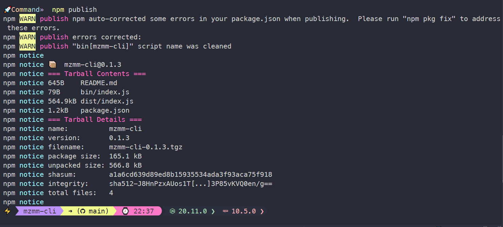
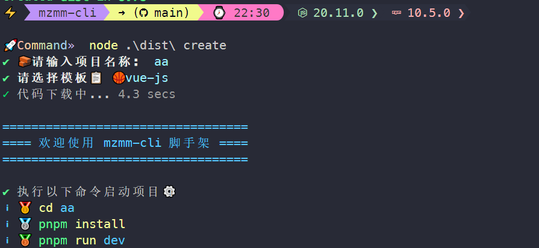

## 前言
开发的脚手架地址：
mzmm-cli [https://www.npmjs.com/package/mzmm-cli](https://www.npmjs.com/package/mzmm-cli)

如何注册github  教程：[https://blog.csdn.net/weixin_51674304/article/details/121525251](https://blog.csdn.net/weixin_51674304/article/details/121525251)
如何注册npm  教程： [https://blog.csdn.net/u014388408/article/details/130638284](https://blog.csdn.net/u014388408/article/details/130638284)

## 注意的问题
rollup-plugin-node-externals 需要使用5.1.2的版本 不要使用最新的6.1.2版本
chalk版本降级到4.1.2的版本

## 初始化项目
```bash
npm init -y
```
生成：typescript配置文件 tsconfig.json
```bash
npx tsc --init
```

## package.json里面的依赖说明
```typescript
  "devDependencies": {
    // 用于命令行交互。
    "@inquirer/prompts": "^3.2.0",
    // Rollup 相关的插件，用于模块打包
    "@rollup/plugin-commonjs": "^25.0.3", // 支持rollup打包commonjs模块
    "@rollup/plugin-json": "^6.0.1", // 支持rollup打包json文件
    "@rollup/plugin-node-resolve": "^15.1.0", // 用于帮助 Rollup 解析和处理 Node.js 模块（Node.js 的 CommonJS 模块规范）
    "@rollup/plugin-terser": "^0.4.3", // Rollup 构建过程中对生成的 JavaScript 代码进行压缩和混淆，以减小最终输出文件的体积。
    // TypeScript 的类型定义文件
    "@types/fs-extra": "^11.0.2",
    "@types/lodash": "^4.14.199",
    "@types/node": "^16.18.40",
     // 用于发起 HTTP 请求。 
    "axios": "^1.5.0",
    // 在命令行中输出彩色文本。
    "chalk": "^4.1.2",
     // 命令行界面的解决方案  
    "commander": "^11.0.0",
    // 扩展了标准 fs 模块的文件系统操作
    "fs-extra": "^11.1.1",
    // 一个提供实用函数的 JavaScript 库。  
    "lodash": "^4.17.21",
    // 在命令行中显示日志符号。  
    "log-symbols": "^4.1.0",
    // 创建可旋转的加载器  
    "ora": "5",
     // 估算操作进度。 
    "progress-estimator": "^0.3.1",
    // 一个特定于项目或定制的 CLI 工具  
    "pure-thin-cli": "^0.1.8",
      
    "rollup": "^4.6.1",
    "rollup-plugin-dts": "^5.3.0", // 是一个 Rollup 插件，它的主要作用是处理 TypeScript 的声明文件（.d.ts 文件）
    "rollup-plugin-esbuild": "^5.0.0",
    "rollup-plugin-node-externals": "^5.1.2", // 使rollup自动识别外部依赖
    "rollup-plugin-typescript2": "^0.36.0", // 支持rollup打包ts文件
      
    // 用于 Git 命令的 Node.js 封装。  
    "simple-git": "^3.19.1",
    // TypeScript 运行时库。  
    "tslib": "^2.6.1",
    "typescript": "^5.2.2"
  },
```

## 基础结构

- 我们这次的目标就是搭建一个类似于vue-cli，create-react-app等cli工具类似的工具包。要实现的核心功能就是使用命令行交互的效果去生成我们需要的Vue项目模板。
- 首先把项目文件结构创建一下，一步步教大家实现。

```bash

mzmm-cli/
    |- src/ # 项目资源
        |- command/  # 命令逻辑
        |- utils/   # 公共方法
        |- index.ts  # 命令入口文件
```
### 用到的依赖

- 命令行交互
   - commander：解析命令行指令
   - ora：终端加载动画
   - progress-estimator：终端加载条动画
   - log-symbols：终端输出符号
   - chalk：终端字体美化
   - @inquirer/prompts：终端输入交互
> 建议大家可以预先去了解下这些依赖的用途和一些基础的使用方法


- 打包工具
   - rollup（打包工具有很多选择，webpack）
      - 这里选用 rollup 是因为它相对更适合 npm 包的打包，自己对webpack5太熟悉了，跳出自己的舒适圈
   - @rollup/plugin-node-resolve：支持rollup打包node.js模块
   - @rollup/plugin-commonjs：支持rollup打包commonjs模块
   - @rollup/plugin-json：支持rollup打包json文件
   - rollup-plugin-typescript2：支持rollup打包ts文件
   - @rollup/plugin-terser：压缩打包代码
   - rollup-plugin-node-externals：使rollup自动识别外部依赖
   :::warning
   注意这里的rollup-plugin-node-externals版本是5的版本 不是最新的6的版本
    "rollup-plugin-node-externals": "^5.1.2",
   :::
### 配置打包命令

- 我们先解决打包的问题，安装好需要的依赖，然后按照下面的配置文件内容，新建一个rollup.config.js。
```bash

pnpm add -D rollup @rollup/plugin-node-resolve @rollup/plugin-commonjs @rollup/plugin-json rollup-plugin-typescript2 @rollup/plugin-terser rollup-plugin-node-externals
```
```typescript

import { defineConfig } from 'rollup';
import nodeResolve from '@rollup/plugin-node-resolve';
import commonjs from '@rollup/plugin-commonjs';
import externals from "rollup-plugin-node-externals";
import json from "@rollup/plugin-json";
import terser from "@rollup/plugin-terser";
import typescript from 'rollup-plugin-typescript2';

export default defineConfig([
  {
    input: {
      index: 'src/index.ts', // 打包入口文件
    },
    output: [
      {
        dir: 'dist', // 输出目标文件夹
        format: 'cjs', // 输出 commonjs 文件
      }
    ],
    // 这些依赖的作用上文提到过
    plugins: [
      nodeResolve(),
      externals({
        devDeps: false, // 可以识别我们 package.json 中的依赖当作外部依赖处理 不会直接将其中引用的方法打包出来
      }),
      typescript(),
      json(),
      commonjs(),
      terser(),
    ],
  },
]);
```
我们还需要在package.json中配置一个打包命令。

- -c 指定 rollup 配置文件，--bundleConfigAsCjs 将配置转为 commonjs 执行。
```json
{
  // ...
  "build": "rollup -c rollup.config.js --bundleConfigAsCjs"
}
```
## 编写指令
### 指令交互

- 这里带大家写一个create指令，在我们的入口文件src/index.ts编写。
- 我们需要用到commander，可以帮助我们解析用户在命令行输入的指令。
- 这里会给大家讲解一些基础的用法，更详细的使用方式请查阅官方文档：[commander.js](https://github.com/tj/commander.js)。

首先初始化一个Command对象，传入的参数作为我们的指令名称。
```typescript
import { Command } from 'commander'
// 这里我们用 mzmm 当作我的指令名称
// 命令行中使用 mzmm xxx 即可触发
const program = new Command('mzmm');
```
接下来我们就可以配置我们需要的命令了。

- 使用version可以实现最基础的查看版本的指令。
```typescript
import { version } from '../package.json'
// .vesion 表示可以使用 -V --version 参数查看当前SDK版本
// 我们直接使用 package.json 中的 version 即可
program
  .version(version);
// 调用 version 的参数可以自定义
// .version(version, '-v --version')
```

- 使用command与action实现自定义指令。
   - command 为我们需要的命令名称。
   - description 为命令添加描述。
   - action 为指令触发执行的回调。
   - argument 为我们命令需要的参数，[]包裹代表可选，<>包裹代表必填。

下面的示例就是我们编写好的指令，指令回调我们稍后实现，输入mzmm update会打印update command，输入mzmm create test，会打印create test。action 回调中会将 argument 中的参数传入。
```typescript
// ...

program
  .command('update')
  .description('更新 mzmm 至最新版本')
  .action(async () => {
    console.log('update command')
  });

program
  .command('create')
  .description('创建一个新项目')
  .argument('[name]', '项目名称')
  .action(async (name) => {
    if(name) console.log(`create ${name}`)
    else console.log(`create command`)
  });
```

- 解析指令
```typescript
// ...

// parse 会解析 process.argv 中的内容
// 也就是我们输入的指令
program.parse();
```

### 下载项目
我们先实现create命令，可以让用户选择下载我们预设的模板。

- 在src/command/create.ts文件下编写create命令核心代码。
- 导出一个可以传入项目名称的方法，如果用户直接传入了项目名称则让用户选择模板，否则需要先让用户输入项目名称。
- 这里我们用到了@inquirer/prompts，可以帮助我们让用户在终端进行输入或选择的操作，更多使用方法请查阅官方文档：[inquirer.js](https://github.com/SBoudrias/Inquirer.js)。
```typescript
import { select, input } from '@inquirer/prompts';
export default async function create(prjName?: string) {
  // 文件名称未传入需要输入
  if (!prjName) prjName = await input({ message: '请输入项目名称' });
  // 如果文件已存在需要让用户判断是否覆盖原文件
  const filePath = path.resolve(process.cwd(), prjName)
  if (fs.existsSync(filePath)) {
    const run = await isOverwrite(prjName)
    if (run) {
      await fs.remove(filePath)
    } else {
      return // 不覆盖直接结束
    }
  }
}
```

- 在src/command/create.ts添加一个判断用户是否覆盖的公共方法。
```typescript
import { select } from '@inquirer/prompts';
import log from "./log";

export const isOverwrite = async (fileName: string) => {
  log.warning(`${fileName} 文件已存在 !`)
  return select({
    message: '是否覆盖原文件: ',
    choices: [
      {name: '覆盖', value: true},
      {name: '取消', value: false}
    ]
  });
}
```

- 然后我们就需要让用户选择我们的预设模板，在src/command/create.ts中添加模板信息，定义成map的形式是方便我们根据key获取项目的信息。
- 下载模板的方式有很多种，可以将模板文件保存在 SDK 中，使用 cjs 或者其他方法动态选择生成，使用 fs 模块写入，或者存放在 git 仓库中进行 clone，我们这里把代码放到gitee中的代码仓库中
- 这里我定义了 TemplateInfo 类型，可以根据自己的需求自行定义，需要存储项目名称，下载地址，描述，代码分支。
```typescript


export interface TemplateInfo {
    name: string; // 项目名称
    downloadUrl: string; // 下载地址
    description: string; // 项目描述
    branch: string; // 项目分支
} 
// 这里保存了我写好了咱们的之前开发的模板
export const templates: Map<string, TemplateInfo> = new Map(
  [
    ["Vite4-Vue3-Typescript-template", {
      name: "admin-template",
      downloadUrl: 'git@gitee.com:sohucw/admin-pro.git',
      description: 'Vue3技术栈开发模板',
      branch: 'dev6'
    }]
  ]
)
```

- 接下来我们就可以让用户选择需要的模板。
```typescript
import { select, input } from '@inquirer/prompts';

import log from "../utils/log";

export interface TemplateInfo {
    name: string; // 项目名称
    downloadUrl: string; // 下载地址
    description: string; // 项目描述
    branch: string; // 项目分支
}
// 这里保存了我写好的预设模板 
export const templates: Map<string, TemplateInfo> = new Map(
    [
        ["Vite4-Vue3-Typescript-template", {
            name: "admin-template",
            downloadUrl: 'git@gitee.com:sohucw/admin-pro.git',
            description: 'Vue3技术栈开发模板',
            branch: 'dev8'
        }]
    ]
)

export default async function create(prjName?: string) {
  // ...

  // 我们需要将我们的 map 处理成 @inquirer/prompts select 需要的形式
  // 大家也可以封装成一个方法去处理
  const templateList = [...templates.entries()].map((item: [string, TemplateInfo]) => {
    const [name, info] = item;
    return {
      name,
      value: name,
      description: info.description
    }
  })

  // 选择模板
  const templateName = await select({
    message: '请选择需要初始化的模板:',
    choices: templateList,
  });

  // 下载模板
  const gitRepoInfo = templates.get(templateName)
  if (gitRepoInfo) {
    await clone(gitRepoInfo.downloadUrl , prjName, ['-b', `${gitRepoInfo.branch}`])
  } else {
    log.error(`${templateName} 模板不存在`)
  }
}
```

- 我们还需要实现我们刚刚使用过的clone方法，下载仓库中的模板。
- 我们在src/utils/clone.ts中实现下。
   - 这里我们用到，simple-git用于拉取 git 仓库，progress-estimator设置预估git clone的时间并展示进度条。
- 这里我就直接展示代码和注释了，思路都很简单。
```typescript
import simpleGit, { SimpleGit, SimpleGitOptions } from 'simple-git';
import log from "./log";
import createLogger from "progress-estimator";
import chalk from "chalk";

const logger = createLogger({ // 初始化进度条
  spinner: {
    interval: 300, // 变换时间 ms
    frames: ['⠋', '⠙', '⠹', '⠸', '⠼', '⠴', '⠦', '⠧', '⠇', '⠏'].map(item=>chalk.blue(item)) // 设置加载动画
  }
})

const gitOptions: Partial<SimpleGitOptions> = {
  baseDir: process.cwd(), // 根目录
  binary: 'git',
  maxConcurrentProcesses: 6, // 最大并发进程数
};

export const clone = async (url: string, prjName: string, options: string[]): Promise<any> => {
  const git: SimpleGit = simpleGit(gitOptions)
  try {
    // 开始下载代码并展示预估时间进度条
    await logger(git.clone(url, prjName, options), '代码下载中: ', {
      estimate: 8000 // 展示预估时间
    })

    // 下面就是一些相关的提示
    console.log()
    console.log(chalk.blueBright(`==================================`))
    console.log(chalk.blueBright(`==== 欢迎使用 mzmm-cli 脚手架 ====`))
    console.log(chalk.blueBright(`==================================`))
    console.log()

    log.success(`项目创建成功 ${chalk.blueBright(prjName)}`)
    log.success(`执行以下命令启动项目：`)
    log.info(`cd ${chalk.blueBright(prjName)}`)
    log.info(`${chalk.yellow('pnpm')} install`)
    log.info(`${chalk.yellow('pnpm')} run dev`)
  } catch (err: any) {
    log.error("下载失败")
    log.error(String(err))
  }
}
```

- 至此，我们的create命令就编写完毕了，我们可以将其添加到src/index.ts中去调用。
```typescript
// ...
program
  .command('create')
  .description('创建一个新项目')
  .argument('[name]', '项目名称')
  .action(async (dirName) => {
    // 添加create方法
    await create(dirName);
  });
// ...
```
### 检测项目更新

- 当我们更新模板后，希望用户第一时间用到，可以在用户使用过程中添加一些更新提示。

在src/command/create.ts中编写方法，用于获取npm包的信息及版本号。
```typescript
// npm 包提供了根据包名称查询包信息的接口
// 我们在这里直接使用 axios 请求调用即可
export const getNpmInfo = async (npmName: string) => {
  const npmUrl = 'https://registry.npmjs.org/' + npmName
  let res = {}
  try {
    res = await axios.get(npmUrl)
  } catch (err) {
    log.error(err as string)
  }
  return res
}
```
npm包信息中包含了该包的最新版本，我们在这里直接引用即可。
```typescript
export const getNpmLatestVersion = async (npmName: string) => {
  // data['dist-tags'].latest 为最新版本号
  const { data } = (await getNpmInfo(npmName)) as AxiosResponse
  return data['dist-tags'].latest
}
```
然后对比版本号版本，判断是否需要更新，如需更新进行提示。
```typescript
export const checkVersion = async (name: string, curVersion: string) => {
  const latestVersion = await getNpmLatestVersion(name)
  const need = lodash.gt(latestVersion, curVersion)
  if(need) {
    log.info(`检测到 mzmm 最新版:${chalk.blueBright(latestVersion)} 当前版本:${chalk.blueBright(curVersion)} ~`)
    log.info(`可使用 ${chalk.yellow('pnpm')} install mzmm-cli@latest 更新 ~`)
  }
  return need
}
```
然后我们将这个判断更新的方法添加到create方法中。
```typescript
export default async function create(prjName?: string) {
  // ...
  await checkVersion(name, version) // 检测版本更新
  // ...
}
```
当我们发布新的版本，用户可以第一时间看到。
## 如何调用

- 我们已经完成了核心的代码逻辑，现在想要使用命令行去调用我们编写好的逻辑，我们可以先自己在本地执行测试，然后将其上传到 npm 就可以供他人使用了。
### 本地调试

- 我们之前已经配置好了 rollup 打包的脚本，接下来就可以执行 npm run build，打包后的代码会输出到dist/index.js中。
- 我们可以使用node在本地执行，先测试一下我们编写好的create命令。
```
node .\dist\index.js create
```
不出意外是可以看到我们写好的交互逻辑，如果有报错，大家可以根据对应的问题查询下
### 发布npm包

- 本地调试没有问题后我们就可以将其发布在npm上。
- npm账号注册、登录等基础操作，这里就不过多赘述了，主要讲一下如何让发布的包能以mzmm作为命令名调用。
-  需要把代码提交到github上 如果没有github账号也需要 注册一下 ，具体怎么注册 登录不详细说了

   

需要我们修改一下package.json文件，下面是一些必要的配置，都加上了注释，我们需要重点关注bin这一项。

- bin中的配置是一个对象，需要有 "key" 和 "value"。
   - key 会被放置在 node_modules 的 .bin 目录中，value 是 key 对应需要执行的文件。
   - 我们使用 npx mzmm 就会调用我们的 bin/index.js。
   - 当我们全局安装对应包的时候会放在全局的 node_modules 的 .bin 目录中，相当于添加了系统环境变量，这样我们就可以直接在终端中调用。
```json
{
  "name": "mzmm-cli", // 包名称
  "version": "x.x.x", // 包版本
  "description": "mzmm-cli脚手架", // 包描述
  "main": "dist/index.js", // 库入口文件
  "keywords": [ // 包查询关键词  提升SEO
    "Vite-Vue4-TypeScript-template"
  ],
  "files": [ // npm 包需要上传的文件
    "dist",
    "bin",
    "README.md"
  ],
  "author": { // 作者信息
    "name": "mzmm"
  },
  "bin": {
    "mzmm": "bin/index.js" // npm 会在 .bin 目录中配置 mzmm 执行 bin/index.js
  },
  "devDependencies": {
        "@inquirer/prompts": "^3.3.0",
        "@rollup/plugin-commonjs": "^25.0.3",
        "@rollup/plugin-json": "^6.0.1",
        "@rollup/plugin-node-resolve": "^15.1.0",
        "@rollup/plugin-terser": "^0.4.3",
        "@types/fs-extra": "^11.0.2",
        "@types/lodash": "^4.14.202",
        "@types/node": "^20.10.4",
        "axios": "^1.6.2",
        "chalk": "^4.1.2",
        "commander": "^11.1.0",
        "figlet": "^1.7.0",
        "fs-extra": "^11.1.1",
        "lodash": "^4.17.21",
        "log-symbols": "4.1.0",
        "ora": "5",
        "progress-estimator": "^0.3.1",
        "rollup": "^4.6.1",
        "rollup-plugin-node-externals": "^5.1.2",
        "rollup-plugin-typescript2": "^0.36.0",
        "simple-git": "^3.21.0",
        "tslib": "^2.6.2",
        "typescript": "^5.3.3"
    }
}
```
编写bin/index.js
```
#!/usr/bin/env node
require('../dist'); // 执行我们打包好的 dist/index.js 文件
```
需要在第一行加入#!/usr/bin/env node，/usr/bin/env就是告诉系统可以在PATH目录中查找，#!/usr/bin/env node就是解决了不同的用户node路径不同的问题，可以让系统动态的去查找node来执行你的脚本文件。

### 开发发包  
#### 检查 npm 源，如果是淘宝源，则需要改回 npm 源
```bash
// 查看npm镜像源地址
npm config get registry

// 切换npm镜像源

// 设置npm默认源
npm config set registry https://registry.npmjs.org/
// 设置npm镜像源为淘宝镜像
npm config set registry https://registry.npmmirror.com/

```

> npm、yarn 和 pnpm 淘宝镜像

```bash
// 设置
npm config set registry https://registry.npmmirror.com/
yarn config set registry https://registry.npmmirror.com/
pnpm config set registry https://registry.npmmirror.com/
// 查看
npm config get registry
yarn config get registry
pnpm config get registry
```

#### 在终端中切换到项目目录下，运行登陆命令，之后按照终端提示输入用户名、密码等信息即可
```bash
// 登陆
npm login

// 控制台会提示输入相关信息
Log in on https://registry.npmjs.org/
Username:  // 用户名
Password: // 密码
Email: (this IS public) // 邮箱
Enter one-time password: // 如果之前做过 双因素身份验证 (2FA)，需要生成一次性密钥
Logged in as xxx on https://registry.npmjs.org/.

```

#### 运行发布命令
```bash
// 发布命令
npm publish
```

发布成功后，就可以登陆 [npm](https://www.npmjs.com/package/mzmmtest-cli) 网站，查看发布包的情况了   
[https://www.npmjs.com/package/mzmmtest-cli](https://www.npmjs.com/package/mzmmtest-cli)
#### 更新npm版本，
修改完代码，需要先提交到github上
```bash

// 控制台会返回下一个小版本号 如v1.0.1
npm version patch

// 重新发布
npm publish
```


> 一些常见的发布命令

```bash
npm login # 发布前需要先登录下

npm publish # 会按照我们 package.json 中的 files 配置的文件发布 name 作为包名称

# 如果需要迭代包的版本 要先修改版本号再发布

# patch：补丁号，修复bug，小变动
npm version patch # 0.0.0 -> 0.0.1
# minor：次版本号，增加新功能
npm version minor # 0.0.0 -> 0.1.0

# major：主版本号，不兼容的修改
npm version major # 0.0.0 -> 1.0.0
```

发布成功的图


发布完成后我们就可以安装npm全局包然后进行使用啦。
```bash
npm install mzmm-cli -g
```


### 输出提示

- 在编写命令代码前我们先封装一个公共方法。
- 在src/utils/log.ts中封装一个带icon的输出提示。
- 我们需要用到log-symbols，他内置了 error，success，warning，info 对应的 icon ，并且帮我们兼容不支持 icon 的终端。并且后续我们需要用到的ora作为加载动画，它也是用的log-symbols进行提示，我们这里保持一致
:::warning
注意这里的log-symbols版本是 4的版本 不是最新的6的版本
 "log-symbols": "^4.1.0",
ora需要使用5的版本
"ora": "5",
:::
```typescript
import logSymbols from 'log-symbols'

export const log = {
  error: (msg: string) => {
    console.log(logSymbols.error, msg)
  },
  success: (msg: string) => {
    console.log(logSymbols.success, msg)
  },
  warning: (msg: string) => {
    console.log(logSymbols.warning, msg)
  },
  info: (msg: string) => {
    console.log(logSymbols.info, msg)
  },
}

export default log
```

控制台更好的打印
修改src/utils/clone.ts 方法
```bash
pnpm add figlet -D
```
```typescript
const goodPrinter = async () => {
  const data = await figlet('欢迎使用 mzmm-cli 脚手架');
  console.log(chalk.rgb(40, 156, 193).visible(data));
};

// 下面就是一些相关的提示
..........
 goodPrinter();
.......
```

官网地址：[https://www.npmjs.com/package/figlet](https://www.npmjs.com/package/figlet)
执行成功后控制台打印


### 其他
[https://shields.io/badges](https://shields.io/badges)   这个网站可以生成小图标

图标库地址：
[https://emojipedia.org/](https://emojipedia.org/)
[https://gist.github.com/rxaviers/7360908](https://gist.github.com/rxaviers/7360908)


