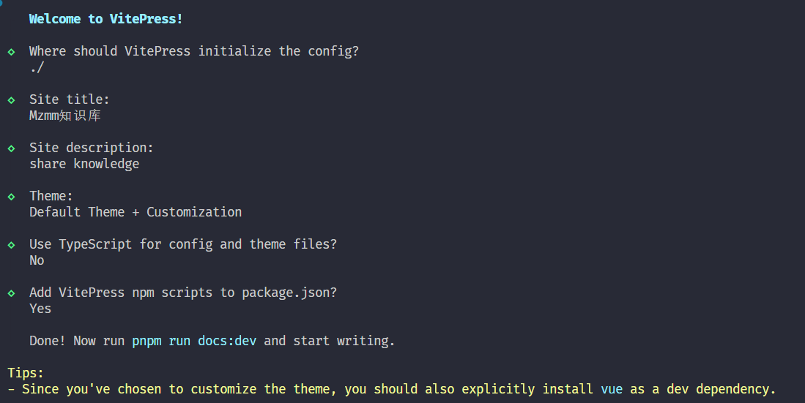
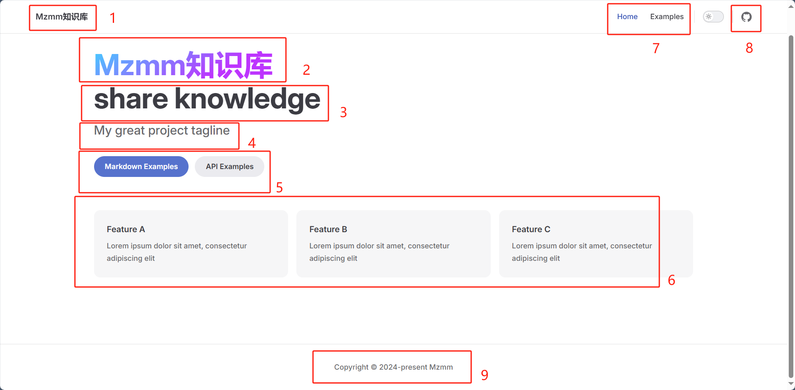
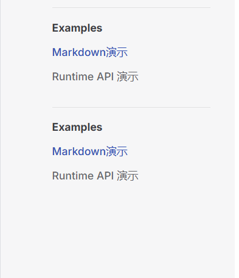

# VitePress建站

## 创建项目

安装vitepress
```shell
pnpm add -D vitepress
```

初始化vitepress
```shell
pnpm vitepress init
```
然后做一些配置的选项
1. 在当前根目录下创建vitepress项目
2. 站点标题和描述。后续可以在配置中改
3. 主题，建议选择第二个，好看
4. 是否使用ts，因为是普通的静态站，所以个人觉得没必要ts
5. 是否添加脚本到package.json，这个需要，启动命令，打包命令都得要用到



启动项目
```shell
pnpm run docs:dev
```

## 自定义配置

### 配置主页

> 主页一共有9个地方可以自定义



1、7、8这三个配置是在config.mjs中配置的
`title <==> 1` `nav <==> 7` `socialLinks <==> 8`

```js
import { defineConfig } from 'vitepress'

// https://vitepress.dev/reference/site-config
export default defineConfig({
  // 对应的是上图中的1的位置
  title: "Mzmm知识库",
  description: "share knowledge",
  themeConfig: {
    // 这个logo是1位置的logo图标
    logo: '/logo.svg',
    
    // 这个是导航栏的对应的链接
    nav: [
      { text: 'Home', link: '/' },
      { text: 'Examples', link: '/markdown-examples' }
    ],

    // 文章的侧边栏(左侧边栏)
    sidebar: [
      {
        text: 'Examples',
        items: [
          { text: 'Markdown Examples', link: '/markdown-examples' },
          { text: 'Runtime API Examples', link: '/api-examples' }
        ]
      }
    ],

    // 友链
    socialLinks: [
      { icon: 'github', link: 'https://github.com/vuejs/vitepress' }
    ]
  }
})
```

2-6是在index.md文件中自定义的。对应关系是：
`name <==> 2` `text <==> 3` `tagline <==> 4` `actions <==> 5` `features <==> 6`

5中的两个按钮是可以跳转的，link指定路径，比如/api-example就是在项目根目录下找api-example.md这个文件

```yaml
---
# https://vitepress.dev/reference/default-theme-home-page
layout: home

hero:
  # 对应的2模块
  name: "Mzmm知识库"
  # 对应的3模块
  text: "分享技术知识"
  对应的4模块
  tagline: 我们不创造知识，我们知识知识的搬运工😉
  # 背景图
  image:
    src: /background.svg
    alt: 背景图片
  # 底下的两个按钮模块
  actions:
    - theme: brand
      text: 个人介绍
      link: /markdown-examples

# 这个是下面的三个特征 
features:
  - title: Feature A
    details: Lorem ipsum dolor sit amet, consectetur adipiscing elit
  - title: Feature B
    details: Lorem ipsum dolor sit amet, consectetur adipiscing elit
  - title: Feature C
    details: Lorem ipsum dolor sit amet, consectetur adipiscing elit
---
```

9是直接配置在`.vitepress/config.mjs`中的themeConfig对象中添加如下

```js
footer: {
    copyright:"Copyright © 2024-present Mzmm"
}
```

### 配置文章页面

左侧边栏配置如下

```js

sidebar: [
    {
        text: 'Examples',
        items: [
            { text: 'Markdown演示',link: '/markdown-examples' },
            { text: 'Runtime API 演示',link:'/api-examples' }
        ]
    },
    {
        text: 'Examples',
        items: [
            { text: 'Markdown演示',link: '/markdown-examples' },
            { text: 'Runtime API 演示',link:'/api-examples' }
        ]
    }
]
```
效果如下图所示：




自动识别侧边栏脚本
```js
import path from "node:path";
import fs from "node:fs";

// 文件根目录
const DIR_PATH = path.resolve();
// 白名单,过滤不是文章的文件和文件夹
const WHITE_LIST = [
  "index.md",
  ".vitepress",
  "node_modules",
  ".idea",
  "assets",
];

// 判断是否是文件夹
const isDirectory = (path) => fs.lstatSync(path).isDirectory();

// 取差值
const intersections = (arr1, arr2) =>
  Array.from(new Set(arr1.filter((item) => !new Set(arr2).has(item))));

// 把方法导出直接使用
function getList(params, path1, pathname) {
  // 存放结果
  const res = [];
  // 开始遍历params
  for (let file in params) {
    // 拼接目录
    const dir = path.join(path1, params[file]);
    // 判断是否是文件夹
    const isDir = isDirectory(dir);
    if (isDir) {
      // 如果是文件夹,读取之后作为下一次递归参数
      const files = fs.readdirSync(dir);
      res.push({
        text: params[file],
        collapsible: true,
        items: getList(files, dir, `${pathname}/${params[file]}`),
      });
    } else {
      // 获取名字
      const name = path.basename(params[file]);
      // 排除非 md 文件
      const suffix = path.extname(params[file]);
      if (suffix !== ".md") {
        continue;
      }
      res.push({
        text: name,
        link: `${pathname}/${name}`,
      });
    }
  }
  // 对name做一下处理，把后缀删除
  res.map((item) => {
    item.text = item.text.replace(/\.md$/, "");
  });
  return res;
}

export const set_sidebar = (pathname) => {
  // 获取pathname的路径
  const dirPath = path.join(DIR_PATH, pathname);
  // 读取pathname下的所有文件或者文件夹
  const files = fs.readdirSync(dirPath);
  // 过滤掉
  const items = intersections(files, WHITE_LIST);
  // getList 函数后面会讲到
  return getList(items, dirPath, pathname);
};
```
自动识别侧边栏的sidebar配置
```js
import { set_sidebar } from "../utils/auto-gen-sidebar.mjs";	// 改成自己的路径
sidebar: {
    "/web1/vue": set_sidebar("/web1/vue")
    "/web2/react": set_sidebar("/web2/react")
}
```

右侧边栏默认是只识别1级标题的和最大的title默认是`On this page`，因此需要如下配置实现深度标题遍历以及title的自定义
还是在`config.mjs`文件进行配置

```js
themeConfig: {
    outlineTitle: "文章目录",
    outline: "deep"  // 或者是[2,6]
}
```


### 文章页扩展

三遍栏改成两边栏
在config.mjs中的themeConfig配置对象中配置
```js
sidebar: false, // 关闭侧边栏
aside: "left",  // 设置右侧侧边栏在左侧显示
```

在`.vitepress/theme/style.css`中配置css
```css
/* 自定义侧边栏在最左边，右边撑满宽度 */
.VPDoc .container {
  margin: 0 !important;
}
@media (min-width: 960px) {
  .VPDoc:not(.has-sidebar) .content {
    max-width: 1552px !important;
  }
}
.VPDoc.has-aside .content-container {
  max-width: 1488px !important;
}
@media (min-width: 960px) {
  .VPDoc:not(.has-sidebar) .container {
    display: flex;
    justify-content: center;
    max-width: 1562px !important;
  }
}
.aside-container {
  position: fixed;
  top: 0;
  padding-top: calc(
    var(--vp-nav-height) + var(--vp-layout-top-height, 0px) +
      var(--vp-doc-top-height, 0px) + 10px
  ) !important;
  width: 224px;
  height: 100vh;
  overflow-x: hidden;
  overflow-y: auto;
  scrollbar-width: none;
}

/* 自定义h2的间距 */
.vp-doc h2 {
  margin: 0px 0 16px;
  padding-top: 24px;
  border: none;
}
```


### 美化地址栏icon

在 `config.mjs defineConfig`配置
```js
head: [["link", {rel:"icon",href:"/logo.svg"}]],
```

### 设置搜索框
在 `config.mjs defineConfig`配置

```js
// 设置搜索框的样式
search:{
    provider: "local",
    options: {
        translations: {
            button: {
                buttonText: "搜索文档",
                buttonAriaLabel: "搜索文档",
            },
            modal: {
                noResultsText: "无法找到相关结果",
                resetButtonTitle: "清除查询条件",
                footer: {
                    selectText: "选择",
                    navigateText: "切换",
                },
            },
        },
    },
},
```
