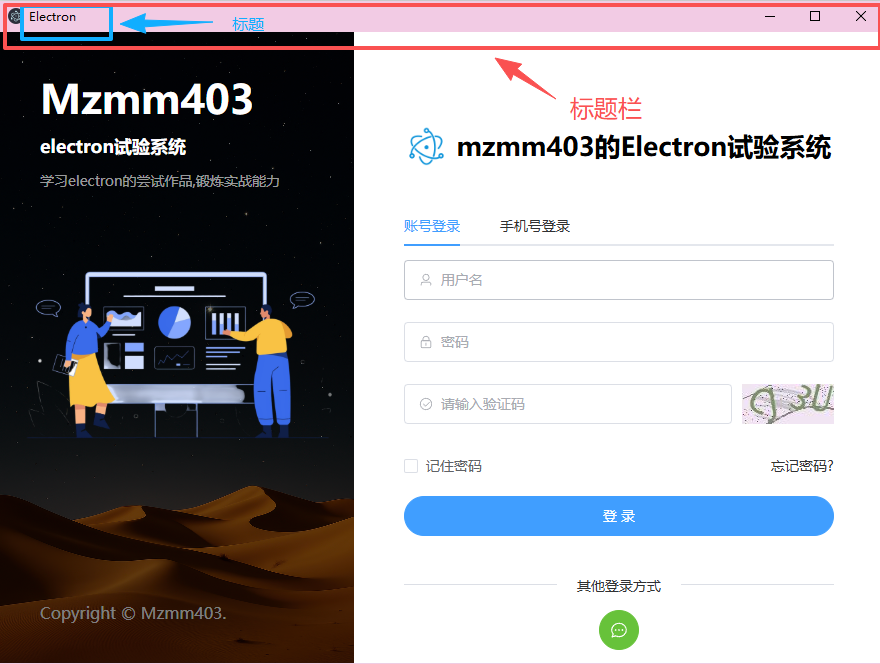
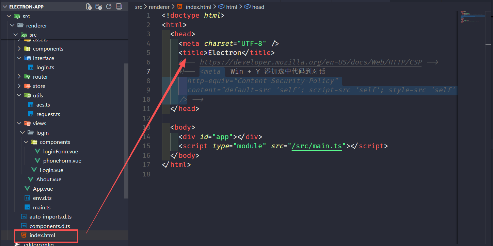
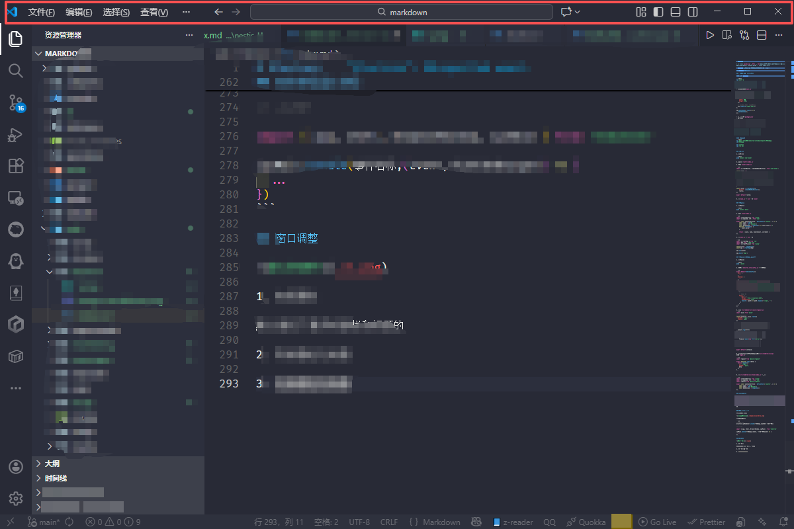

# Electorn

> 是一个用`JavaScript`,`HTML`和`CSS`构建跨平台桌面应用的框架。(其实就是用来开发桌面应用的，可以在 windows,macOS 和 Linux 上运行应用)

> Electorn 也支持 spa 这样的单页面组件式的开发模式

## Electorn 项目创建

### 传统的原生开发创建项目

#### 安装 electorn

```shell
npm init -y

npm install --save-dev electron
```

#### 创建入口文件并注册启动项然后运行项目

- 创建入口文件`main.js`

```js
const { app, BrowserWindow } = require("electron");

const createWindow = () => {
  // 创建了一个窗口
  const win = new BrowserWindow({
    width: 800,
    height: 600,
  });

  // 把index.html加载到窗口上
  win.loadFile("index.html");
};

app.whenReady().then(() => {
  createWindow();
});
```

- 注册启动项`package.json`
- 运行项目


### spa的开发模式： electron + vite + vue3

[参考网址](https://cn.electron-vite.org/)


#### 使用脚手架

```shell
pnpm create @quick-start/electron
```


#### 克隆模版
```shell
npx degit alex8088/electron-vite-boilerplate 项目名称
cd 项目名称

npm install
npm run dev
```


## 集成路由

1. 安装路由

```shell
pnpm install vue-router
```

2. 新建：`router/index.js`

3. 写入`router/index.js`

```js
import { createRouter, createWebHashHistory } from 'vue-router';

const routes = [
    {
        name: 'home',
        path: '/',
        component: () => import('../views/Home.vue'),
    },
    {
        name: 'about',
        path: '/about',
        component: () => import('../views/About.vue')
    }
]

const router = createRouter({
    history: createWebHashHistory(),
    routes,
})

export default router;
```

4. 在`maim.js`中`use`一下`router`


## 集成pinia

1. 安装pinia

```shell
pnpm install pinia
```

2. 新建`store/index.js`

```js
import { defineStore } from 'pinia'
import { computed, ref } from 'vue';

export const useCounterStore = defineStore('counter', () => {
    const count = ref(0)
    const name = ref('Eduardo')
    const doubleCount = computed(() => count.value * 2)
    function increment() {
        count.value++
    }

    return { count, name, doubleCount, increment }
})
```

3. 在`main.js`中`use`一下

```js
import { createApp } from 'vue'
import App from './App.vue'
import { createPinia } from 'pinia'

const pinia = createPinia()
const app = createApp(App)

app.use(pinia)

app.mount('#app')
```

## 集成axios设置代理和api解耦

1. 安装axios

```shell
pnpm i axios 
```

2. 首先在`electron.vite.config.js`中配置代理

```js
export default defineConfig({
  main: {
    ...
  },
  preload: {
    ...
  },
  // 渲染进程的配置
  renderer: {
    resolve: {
      alias: {
        '@renderer': path.join(__dirname, 'src/renderer/src'),
        '@store': path.join(__dirname, 'src/renderer/src/store'),
        '@utils': path.join(__dirname, 'src/renderer/src/utils'),
      },
    },

    // 代理配置
    proxy: {
      '/api': {
        target: 'http://localhost:3000',
        changeOrigin: true,
        rewrite: (path) => path.replace(/^\/api/, '')
      }
    }
  },
})
```

3. 创建`src/renderer/src/utils/request.js`
```js
import axios from 'axios'

// 创建axios对象
const instance = axios.create({
  baseURL: '/api',
  timeout: 5000,
})

// 创建拦截器
instance.interceptors.request.use(config => {
  // 可以在这里做一些请求拦截，比如设置token之类的
  return config;
}, error => {
  console.log(error)
})

instance.interceptors.response.use(res => {
  if (res.status === 200) {
    return res.data;
  } else {
    Promise.reject(new Error('error'));
  }
}, error => {
  console.log(error);
  return Promise.reject(error);
})


export default instance;
```

5. 创建api目录，解耦具体的api请求，`src/renderer/src/api`
比如`login.js`

```js
import request from '@utils/request'

export function login(data) {
  return request({
    url:"/login",
    method: 'post',
    data
  })
}
```


4. 在`src/renderer/src/store/index.js`中使用

```js
import { defineStore } from 'pinia'
import { computed, ref } from 'vue';
import request from '@utils/request'

export const useCounterStore = defineStore('counter', () => {
    const count = ref(0)
    const name = ref('Eduardo')
    const doubleCount = computed(()
})
```

## 目录结构说明

- `build`: 打包目录，比如项目的图标等都能在里面配置
- `resources`: 资源目录，类似vue的`public`目录
- `src`: 源码目录
  - `main`: 主进程目录(其实就是后台运行的目录，对应到的就是控制台这种类似的东西)
  - `renderer`: 渲染进程目录(其实就是页面目录，也就是spa的页面目录)
  - `preload`: 预加载脚本目录(比如渲染进程向主进程通信，然后在渲染进程调用`electorn`的`api`,因为预先加载，所以渲染进程你和主进程通信)
- `electron.vite.config.js`: 类似于`vite.config.js`, 但是这个是针对electron的


## 渲染进程通主进程

以创建窗口为例：


示例代码如下：

```js
// 渲染进程
electron.ipcRenderer.invoke(事件名称,{具体要传递的参数})

// 主进程

import { app, shell, BrowserWindow, ipcMain } from 'electron'

ipcMain.handle(事件名称,(event,传递的参数target) => {
  ...
})
```

这里我习惯的最优写法

> 首先都知道主进程和渲染进程能通讯是因为`preload`层，具体原因是因为`preload`把`electron`的`api`挂载到了`window`对象底下，因此建议现在`preload`层进行一个功能的封装，然后暴露给渲染层使用

`preload/index.ts`
```ts
import { contextBridge } from 'electron'
import { windowsApi } from './api/window'

// 这里建一个api对象，这个api就是我们封装好的功能对象
const api = {
  window: windowsApi
}


if (process.contextIsolated) {
  try {
    // 这里讲api暴露出去
    contextBridge.exposeInMainWorld('api', api)
  } catch (error) {
    console.error(error)
  }
} else {
  // api挂载到window对象
  window.api = api
}
```

考虑到后续的`api`会持续增加，我们专门建一个目录存放`api`,我们可以通过功能分类这些`api`,例如以窗口相关的功能为例：

`preload/api/window/index.ts`
```ts
import { ipcRenderer, Rectangle } from 'electron'

export const windowsApi = {
  // 关闭登录窗口
  closeLoginWindow(): Promise<void> {
    return ipcRenderer.invoke('close-login-window')
  },
  // 开始拖拽窗口
  startDrag(): Promise<void> {
    return ipcRenderer.invoke('start-drag')
  },
  // 移动窗口
  moveWindow(data: MoveWindowData): Promise<void> {
    return ipcRenderer.invoke('custom-adsorption', data)
  },
  // 进入后台管理系统首页
  resizeWindow(): Promise<void> {
    return ipcRenderer.invoke('resize-window')
  }
}
```

同级目录下放类型定义
`preload/api/window/type.ts`
```ts
// 移动窗口接收的参数类型

interface MoveWindowData {
    x: number
    y: number
}
```

最后在根目录下定义ts的类型声明文件

`preload/index.d.ts`
```ts
/*
 * @Author: mzmm403
 * @description: Where there is a will there is a way
 */
import { ElectronAPI } from '@electron-toolkit/preload'
import { screen } from '@electron/remote';

declare global {
  interface Window {
    // electron: ElectronAPI
    api: {
      window: {
        closeLoginWindow(): Promise<void>
        moveWindow(data: MoveWindowData): Promise<void>
        startDrag(): Promise<void>
        resizeWindow(): Promise<void>
      },
      // ...
    }
  }
}
```

我们在渲染层如果觉得写`window.xxx`比较麻烦的话可以封装一层`services`层
`renderer/src/services/index.ts`

```ts
const api = window.api

export const winApi = api.window
export const screenApi = api.screen
```

这样我们在业务中使用的时就可以这样，比如移动窗口的一部分逻辑：
```ts
function mouseDrag(event: MouseEvent) {
    isKeyDown.value = true;
    distanceX.value = event.screenX;
    distanceY.value = event.screenY;
    // preload层api的直接使用
    win.startDrag();
    document.onmousemove = (e:MouseEvent) => {
        if(isKeyDown.value) {
            let x = e.screenX - distanceX.value;
            let y = e.screenY - distanceY.value;
            // preload层api的直接使用
            win.moveWindow({mouseX: x, mouseY: y});
            distanceX.value = e.screenX;
            distanceY.value = e.screenY;
        }
    }
    document.onmouseup = () => {
        isKeyDown.value = false;
    }
}
```


## 窗口调整

### 标题栏和标题

1. 有标题栏和标题



> 默认情况下是有标题栏和标题的(有系统自带的放大缩小/最小化/关闭按钮以及栏上的文字)


如图所示，我们可以在`src/renderer/src/index.html`文件中进行修改


2. 有标题栏无标题



> 就是有系统自带的三个按钮

我们需要修改`src/main/index.ts`文件

```ts
const mainWindow = new BrowserWindow({
  width: 900,
  height: 670,
  show: false,
  /**
   * 新添加的内容
   */

  titleBarStyle: 'hidden', // 隐藏标题
  titleBarOverlay: {
    color: '#ffffff',
    symbolColor: '#74b1be'
  }, // 改变标题栏样式

  /*****************************/
  autoHideMenuBar: true,
  ...(process.platform === 'linux' ? { icon } : {}),
  webPreferences: {
    preload: join(__dirname, '../preload/index.js'),
    sandbox: false
  }
})
```
> 这里要注意的一点是，在macos上，设置titleBarStyle: 'hidden'会去除标题栏，保留窗口左上角的红绿灯控件。 但是在Windows和Linux上，你需要通过设置titleBarOverlay参数来将窗口控件添加回你的BrowserWindow。例如下：

```ts
const win = new BrowserWindow({
  // remove the default titlebar
  titleBarStyle: 'hidden',
  // expose window controls in Windows/Linux
  ...(process.platform !== 'darwin' ? { titleBarOverlay: true } : {})
})
```


这样修改会出现一个问题： 窗口无法拖动，解决方法：渲染进程添加样式。
比如我们可以在`src/renderer/src/App.vue`

```vue
<script setup lang="ts">

</script>

<template>
  <div class="app"></div>
  <router-view></router-view>
</template>
<style>
* {
  margin: 0;
  padding: 0;
}

a {
  color: #333;
  text-decoration: none;
}

.app{
  position: absolute;
  left: 0px;
  top: 0px;
  z-index: 999;
  width: 100%;
  height: 30px;
  background-color: red;
  -webkit-app-region: drag;
}
</style>
```
按住红色区域即可拖拽

3. 无标题栏无标题

这个时候我们需要设置主进程的`BrowserWindow`的`frame`属性

```ts
const win = new BrowserWindow({
  frame: false,
})
```

这样窗口就没有累了标题和标题栏，这个时候有一个特殊的业务场景，例如音乐平台的歌词窗口，任意按住哪一个位置就能拖动，
这个时候用上面的案例来解决问题就一个非常大的问题，那就是拖动的盒子覆盖在业务上，如果下层有一些业务交互，这个时候鼠标就点击不了

这个时候我们需要用到鼠标的事件来判断

首选来到渲染进程的某个页面
```vue
<template>
  <div class="dragPage" @mousedown="mouseDrag"></div>
</template>

<script lang='ts'setup>
  import {ref} from 'vue'

  let isKeyDown = ref<boolean>(false)
  let distanceX = ref<number>(0)
  let distanceY = ref<number>(0)

  const mouseDrag = (event) => {
    isKeyDown.value = true
    distanceX.value = event.x
    distanceY.value = event.y

    // 开始移动
    document.onmousemove = (e) => {
      if(isKeyDown.value) {
        const x = e.screenX - distanceX.value
        const y = e.screenY - distanceY.value

        // 给主进程的坐标
        let data = {
          appX:x,
          appY:y
        }
        electron.ipcRenderer.invoke('custom-adsorption',data)
      }
    }
    document.onmouseup = () => {
      isKeyDown.value = false
    }
  }
</script>
```

主进程接收参数改变位置
```ts
ipcMain.handle('custom-adsorption',(event,res) => {
  let x = res.appX
  let y = res.appY
  childWindow.setPosition(x,y)
})
```

> ps: 上面的实现仍然存在问题，如果窗口从主屏幕拖动到副屏幕，且两个屏幕分辨率不同，就会出现窗口自动缩放的问题,这时候我们只需要在拖拽前发一条消息给主进程让它缓存一下当前窗口大小，然后最后不使用`setPosition`而是使用`setBounds`把宽高强制设置成缓存的那个大小即可。

### 窗口大小

```ts
const mainWindow = new BrowserWindow({
  // 窗口宽度
  width: 900,
  // 窗口高度
  height: 670,
  // 窗口最大高度
  maxHeight: 1000,
  // 窗口最小高度
  minHeight: 600,
  // 窗口最大宽度
  maxWidth: 1200,
  // 窗口最小宽度
  minWidth: 800,
  // 窗口大小是否可以调整
  resizable: false,
  // 窗口是否可以最小化
  minimizable: false,
  // 窗口是否可以最大化
  maximizable: false,
  // 窗口是否可以关闭
  closable: false
})
```


### 窗口的位置

1. 创建窗口时直接指定位置(x/y)

```ts
const win = new BrowserWindow({
  width: 900,
  height: 670,
  x: 100,
  y: 100
})
```

> 注意：这里`(0, 0)`是屏幕左上角


2. 创建后动态设置位置

```ts
// 只能设置位置
win.setPosition(x, y, animate)
// 不仅能设置位置还能设置窗口大小
win.setBounds(bounds[, animate])
```

- animate: macOS是否有动画
  - true (默认)
  - false(瞬移)


3. 窗口居中

```ts
win.center()

// 常见用法
const win = new BrowserWindow({ show: false })
win.once('ready-to-show', () => {
  win.center()
  win.show()
})
```

4. 基于屏幕尺寸计算位置

```ts
import { screen } from 'electron'
// workAreaSize这个是工作区，是已经去掉任务栏 / Dock 后的可用区域
const { width, height } = screen.getPrimaryDisplay().workAreaSize

const winWidth = 900
const winHeight = 670

const x = Math.floor((width - winWidth) / 2)
const y = Math.floor((height - winHeight) / 2)

win.setPosition(x, y)
```

### 窗口的显示隐藏

> 关于窗口的隐藏和显示主要涉及到两个api

```ts
mainWindow.hide()
mainWindow.show()

// 关闭最小化到托盘
mainWindow.hide()
tray = new Tray(icon)
```
### 窗口置顶

```ts
const win = new BrowserWindow({
  // 窗口是否永远在别的窗口上
  alwaysOnTop: true
})
```

### 透明创建

```ts
const win = new BrowserWindow({
  // 在windows上，仅在无边框窗口下起作用
  transparent: true,
  // 设置初始透明度，在0.0(全透明)到1.0(不透明)之间。仅在windows和macos上实现
  opacity: 0
})
```

上面两个属性选择一个使用即可

### 窗口的锁定和解锁

```ts
// 判断是否锁定
win.isKiosk()
// 锁定
win.setKiosk(true)
// 解锁
win.setKiosk(false)
```

上面的方法会有一个问题，那就是在macOS下，锁定会占用全屏
因此有一个通用的写法就是我们渲染进程在点击锁定或者解锁的时候发送一个响应式数据给主进程，如果锁定就不触发鼠标的移动事件否则触发

> 这里会碰到一个业务就是歌词框，当我们锁定以后，关闭的logo应该消失，这里会有一个问题

```vue
<button :class="isClock ? 'off':''">关闭</button>

<style>
  .off {
    visibility: hidden;
  }
</style>
```

按照上面的写法，关闭按钮确实会消失，但是会存在阴影，因此还需要在窗口对象上加上一个属性`hasShadow`

```ts
const win = new BrowserWindow({
  hasShadow: false
})
```


#### 关闭窗口

```ts
// 用于关闭窗口，可以通过监听close事件来执行一些自定义操作，并有机会取消关闭操作
win.close()
// 用于彻底销毁一个窗口，不触发close事件，并立即释放与窗口相关的所有资源
win.destroy()
// 用于退出整个electron应用程序，可以通过监听before-quit事件来执行一些自定义操作。
app.quit()
// 用于立即终止整个electron应用程序，不触发任何事件
app.exit()
```

todo: 
  - 如何换肤