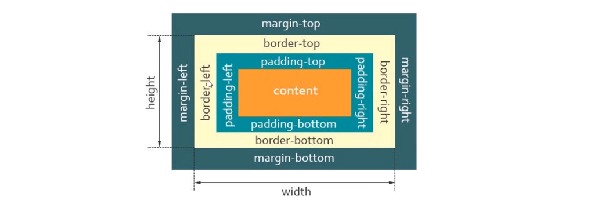

# CSS基本选择器

## CSS基础选择器

基础选择器又包括：**标签选择器**、**类选择器**、**id选择器**和**通配符选择器**


## 标签选择器

```css
/*! normalize.css v8.0.1 | MIT License | github.com/necolas/normalize.css */

/* Document
   ========================================================================== */

/**
 * 1. Correct the line height in all browsers.
 * 2. Prevent adjustments of font size after orientation changes in iOS.
 */

 html {
    line-height: 1.15; /* 1 */
    -webkit-text-size-adjust: 100%; /* 2 */
  }
  
  /* Sections
     ========================================================================== */
  
  /**
   * Remove the margin in all browsers.
   */
  
  body {
    margin: 0;
  }
  
  /**
   * Render the `main` element consistently in IE.
   */
  
  main {
    display: block;
  }
  
  /**
   * Correct the font size and margin on `h1` elements within `section` and
   * `article` contexts in Chrome, Firefox, and Safari.
   */
  
  h1 {
    font-size: 2em;
    margin: 0.67em 0;
  }
  
  /* Grouping content
     ========================================================================== */
  
  /**
   * 1. Add the correct box sizing in Firefox.
   * 2. Show the overflow in Edge and IE.
   */
  
  hr {
    box-sizing: content-box; /* 1 */
    height: 0; /* 1 */
    overflow: visible; /* 2 */
  }
  
  /**
   * 1. Correct the inheritance and scaling of font size in all browsers.
   * 2. Correct the odd `em` font sizing in all browsers.
   */
  
  pre {
    font-family: monospace, monospace; /* 1 */
    font-size: 1em; /* 2 */
  }
  
  /* Text-level semantics
     ========================================================================== */
  
  /**
   * Remove the gray background on active links in IE 10.
   */
  
  a {
    background-color: transparent;
  }
  
  /**
   * 1. Remove the bottom border in Chrome 57-
   * 2. Add the correct text decoration in Chrome, Edge, IE, Opera, and Safari.
   */
  
  abbr[title] {
    border-bottom: none; /* 1 */
    text-decoration: underline; /* 2 */
    text-decoration: underline dotted; /* 2 */
  }
  
  /**
   * Add the correct font weight in Chrome, Edge, and Safari.
   */
  
  b,
  strong {
    font-weight: bolder;
  }
  
  /**
   * 1. Correct the inheritance and scaling of font size in all browsers.
   * 2. Correct the odd `em` font sizing in all browsers.
   */
  
  code,
  kbd,
  samp {
    font-family: monospace, monospace; /* 1 */
    font-size: 1em; /* 2 */
  }
  
  /**
   * Add the correct font size in all browsers.
   */
  
  small {
    font-size: 80%;
  }
  
  /**
   * Prevent `sub` and `sup` elements from affecting the line height in
   * all browsers.
   */
  
  sub,
  sup {
    font-size: 75%;
    line-height: 0;
    position: relative;
    vertical-align: baseline;
  }
  
  sub {
    bottom: -0.25em;
  }
  
  sup {
    top: -0.5em;
  }
  
  /* Embedded content
     ========================================================================== */
  
  /**
   * Remove the border on images inside links in IE 10.
   */
  
  img {
    border-style: none;
  }
  
  /* Forms
     ========================================================================== */
  
  /**
   * 1. Change the font styles in all browsers.
   * 2. Remove the margin in Firefox and Safari.
   */
  
  button,
  input,
  optgroup,
  select,
  textarea {
    font-family: inherit; /* 1 */
    font-size: 100%; /* 1 */
    line-height: 1.15; /* 1 */
    margin: 0; /* 2 */
  }
  
  /**
   * Show the overflow in IE.
   * 1. Show the overflow in Edge.
   */
  
  button,
  input { /* 1 */
    overflow: visible;
  }
  
  /**
   * Remove the inheritance of text transform in Edge, Firefox, and IE.
   * 1. Remove the inheritance of text transform in Firefox.
   */
  
  button,
  select { /* 1 */
    text-transform: none;
  }
  
  /**
   * Correct the inability to style clickable types in iOS and Safari.
   */
  
  button,
  [type="button"],
  [type="reset"],
  [type="submit"] {
    -webkit-appearance: button;
  }
  
  /**
   * Remove the inner border and padding in Firefox.
   */
  
  button::-moz-focus-inner,
  [type="button"]::-moz-focus-inner,
  [type="reset"]::-moz-focus-inner,
  [type="submit"]::-moz-focus-inner {
    border-style: none;
    padding: 0;
  }
  
  /**
   * Restore the focus styles unset by the previous rule.
   */
  
  button:-moz-focusring,
  [type="button"]:-moz-focusring,
  [type="reset"]:-moz-focusring,
  [type="submit"]:-moz-focusring {
    outline: 1px dotted ButtonText;
  }
  
  /**
   * Correct the padding in Firefox.
   */
  
  fieldset {
    padding: 0.35em 0.75em 0.625em;
  }
  
  /**
   * 1. Correct the text wrapping in Edge and IE.
   * 2. Correct the color inheritance from `fieldset` elements in IE.
   * 3. Remove the padding so developers are not caught out when they zero out
   *    `fieldset` elements in all browsers.
   */
  
  legend {
    box-sizing: border-box; /* 1 */
    color: inherit; /* 2 */
    display: table; /* 1 */
    max-width: 100%; /* 1 */
    padding: 0; /* 3 */
    white-space: normal; /* 1 */
  }
  
  /**
   * Add the correct vertical alignment in Chrome, Firefox, and Opera.
   */
  
  progress {
    vertical-align: baseline;
  }
  
  /**
   * Remove the default vertical scrollbar in IE 10+.
   */
  
  textarea {
    overflow: auto;
  }
  
  /**
   * 1. Add the correct box sizing in IE 10.
   * 2. Remove the padding in IE 10.
   */
  
  [type="checkbox"],
  [type="radio"] {
    box-sizing: border-box; /* 1 */
    padding: 0; /* 2 */
  }
  
  /**
   * Correct the cursor style of increment and decrement buttons in Chrome.
   */
  
  [type="number"]::-webkit-inner-spin-button,
  [type="number"]::-webkit-outer-spin-button {
    height: auto;
  }
  
  /**
   * 1. Correct the odd appearance in Chrome and Safari.
   * 2. Correct the outline style in Safari.
   */
  
  [type="search"] {
    -webkit-appearance: textfield; /* 1 */
    outline-offset: -2px; /* 2 */
  }
  
  /**
   * Remove the inner padding in Chrome and Safari on macOS.
   */
  
  [type="search"]::-webkit-search-decoration {
    -webkit-appearance: none;
  }
  
  /**
   * 1. Correct the inability to style clickable types in iOS and Safari.
   * 2. Change font properties to `inherit` in Safari.
   */
  
  ::-webkit-file-upload-button {
    -webkit-appearance: button; /* 1 */
    font: inherit; /* 2 */
  }
  
  /* Interactive
     ========================================================================== */
  
  /*
   * Add the correct display in Edge, IE 10+, and Firefox.
   */
  
  details {
    display: block;
  }
  
  /*
   * Add the correct display in all browsers.
   */
  
  summary {
    display: list-item;
  }
  
  /* Misc
     ========================================================================== */
  
  /**
   * Add the correct display in IE 10+.
   */
  
  template {
    display: none;
  }
  
  /**
   * Add the correct display in IE 10.
   */
  
  [hidden] {
    display: none;
  }

  
a{text-decoration: none;color:#333}
a:hover{color:red}
ul,ol{list-style: none;}


```

## ID选择器css

一般定义样式的时候也不使用，只有在js操作的时候使用

```css
#span{}
```

## 类选择器（前端定义样式的时候全部使用class选择器即可）

物以类聚人以群分。组合的概念

```css
/* 浮动 */
.z { float: left !important; }
.y { float: right !important; }

/* 清除浮动 */
.cl:before, .cl:after{content:" ";display: table;}
.cl:after { clear: both }
.cl { *zoom: 1 }

/* 显示/隐藏 */
.show { display: block !important; }
.hide { display: none !important; }

/* 相对定位 */
.pos { position: relative; margin: auto;}

/*块级元素*/
.block { display: block; margin-left: auto; margin-right: auto; }
.inblock { display: inline-block; }

```

## 通配符选择器

```css
*{padding:0;maring:0}
```


# CSS高级选择器

## 什么是CSS层叠样式表

因为基本选择器存在一些问题，只能给单一的元素进行设定对应的css样式，没办法达到css复用，继承的理念。那么就失去了css样式列表的价值。如果要实现复杂的网页，肯定会定义很多class选择器或者,id选择器，而且都是全局的。也就是没有约束的概念呢。所以w3c在定义css1.0版本的时候就已经考虑这个问题了，分别从：

- 继承
- 复用
- 约束

来制定css的标准和规范。

**如下代码：**

```html
<!DOCTYPE html>
<html lang="en">

<head>
    <meta charset="UTF-8">
    <meta name="viewport" content="width=device-width, initial-scale=1.0">
    <title>后代选择器</title>
    <style type="text/css">
        /*继承*/
        
        #header {
            color: red;
            font-size: 24px;
        }
        /*范围约束*/
        
        .itembox .item {
            background: red;
        }
        
        .itembox2 .item {
            background: green;
        }
    </style>
</head>

<body>

    <div id="header">
        <span>头部1</span>
        <em>头部2</em>
        <p>头部3</p>
    </div>

    <div class="container">

        <div class="itembox">

            <div class="item">
                <h1>我是标题</h1>
                
            </div>

            <div class="item">
                <h1>我是标题</h1>
                
            </div>

            <div class="item">
                <h1>我是标题</h1>
                
            </div>

            <div class="item">
                <h1>我是标题</h1>
                
            </div>
        </div>

    </div>


    <div class="itembox2">
        <div class="item">
            <h1>我是标题</h1>
            
        </div>
    </div>

    <div id="footer">
        底部
    </div>

</body>

</html>

</html>
```

如果没有继承，复用，约束，编写css估计一件痛苦和麻烦的事情。所以css提出了层叠样式的概念，以及css3里新增了很多父子，兄弟，相邻选择器的增加，让css样式的编写提供了更多的复用，约束功能。

## 层次选择器


> 这里的M 代表：父元素兄弟   N 代表子孙元素

| 选择器 | 说明                                                     |
| ------ | -------------------------------------------------------- |
| M N    | 后代选择器，选择M元素内部后代的N元素（所有N元素）        |
| M>N    | 子代选择器，选择M元素内部子代的N元素（所有第1级N元素）   |
| M~N    | 兄弟选择器，选择M元素后所有的统计N元素                   |
| M+N    | 相邻选择器，选择M元素相邻的下一个N元素（M、N是同级元素） |

### 后代选择器

**理解：**

后代选择器 ：理解一个M家里又很N儿子，孙子，重孙等等。使用后代选择器就是快速把这些：“儿子”，“孙子”，“重孙”找出来，进行操作（就是增加样式啦）。

**语法：M N{}**

```CSS
body p{  
    background: red;  
}
```

**说明：**

在后代选择器中，M元素与N元素用空格隔开，表示选中M元素内部后代的N元素。

**举例：**

```css
<!DOCTYPE html>
<html lang="en">

<head>
    <meta charset="UTF-8">
    <meta name="viewport" content="width=device-width, initial-scale=1.0">
    <title>后代选择器</title>
    <style type="text/css">
        /*1: 标签选择器+标签选择器的方式*/
        /*2：标签选择器 + Id选择器的方式*/
        /*3：标签选择器 + Id选择器 + 标签选择器的方式*/
        /*4：标签选择器 + Id选择器 + class选择器的方式*/
        /*5：Id选择器 + 标签选择器的方式*/
        /*6：Id选择器 + class选择器的方式*/
        /*7：class选择器 + class选择器的方式*/
        /*8：class选择器class选择器的方式 ---- 双重肯定*/
        /*
            这里就不在一一列举了，也就告诉我们选择器直接是可以任意组合的。当然组合如果上面全部一起定义
            肯定会存在一个优先级的问题，这个是我们后续要探讨的话题。
            在实际开发中，我们只会选择一种方式进行定义可以，没有必要一个元素的修饰用2中方式以上，
            在什么情况下会，定义2种以上呢？这个先让大家去思考一下。
            在后续的样式优先级的课程我们在来揭晓答案。
        */
        
        #first p {
            color: red
        }
    </style>
</head>

<body>

    <div id="first" class="box">
        <p>Children-子元素</p>
        <p class="p1">Children-子元素</p>
        <div id="second" class="box2">
            <p class="p2">Children-子元素的子元素</p>
            <p class="p2">Children-子元素的子元素</p>
        </div>
        <p class="p1">Children-子元素</p>
        <p>Children-子元素</p>
    </div>

</body>

</html>

</html>
```

**后代选择器两个选择符之间必须要以空格隔开，中间不能有任何其他的符号插入**，如下图：


### 父子选择器

**理解：**

父子选择器：理解，家族里有儿子，孙子。但是现在只找儿子说话。后面的就不去查找了。

语法：M>N

```css
body>p{
    background: pink;  
}
```

说明：子代选择器用于选中元素内部的某一个子元素。
举例：

```html
<!DOCTYPE html>
<html lang="en">

<head>
    <meta charset="UTF-8">
    <meta name="viewport" content="width=device-width, initial-scale=1.0">
    <title>后代选择器</title>
    <style type="text/css">
        /*1: 标签选择器+标签选择器的方式*/
        /*2：标签选择器 + Id选择器的方式*/
        /*3：标签选择器 + Id选择器 + 标签选择器的方式*/
        /*4：标签选择器 + Id选择器 + class选择器的方式*/
        /*5：Id选择器 + 标签选择器的方式*/
        /*6：Id选择器 + class选择器的方式*/
        /*7：class选择器 + class选择器的方式*/
        /*8：class选择器class选择器的方式 ---- 双重肯定*/
        /*
            这里就不在一一列举了，也就告诉我们选择器直接是可以任意组合的。当然组合如果上面全部一起定义
            肯定会存在一个优先级的问题，这个是我们后续要探讨的话题。
            在实际开发中，我们只会选择一种方式进行定义可以，没有必要一个元素的修饰用2中方式以上，
            在什么情况下会，定义2种以上呢？这个先让大家去思考一下。
            在后续的样式优先级的课程我们在来揭晓答案。
        */
        
        #first>p {
            color: red
        }
    </style>
</head>

<body>

    <div id="first" class="box">
        <p>Children-子元素</p>
        <p class="p1">Children-子元素</p>
        <div id="second" class="box2">
            <p class="p2">Children-子元素的子元素</p>
            <p class="p2">Children-子元素的子元素</p>
        </div>
        <p class="p1">Children-子元素</p>
        <p>Children-子元素</p>
    </div>

</body>

</html>

</html>
```

如图：


由此例可知，子代选择器只选中其元素内部某一个子元素，并且不包括其他的后代元素。


### 兄弟选择器

**理解：** 在一个家族中，我们找到比自己小的第一个兄弟进行照顾。

**语法：**M+N{}

在兄弟选择器中，表示M元素后面的的所有某一兄的元素

```css
.active+p {
    background: green;
}
```


**举例：**

```html
<!DOCTYPE html>
<html lang="en">

<head>
    <meta charset="UTF-8">
    <meta name="viewport" content="width=device-width, initial-scale=1.0">
    <title>后代选择器</title>
    <style type="text/css">
        /*1: 标签选择器+标签选择器的方式*/
        /*2：标签选择器 + Id选择器的方式*/
        /*3：标签选择器 + Id选择器 + 标签选择器的方式*/
        /*4：标签选择器 + Id选择器 + class选择器的方式*/
        /*5：Id选择器 + 标签选择器的方式*/
        /*6：Id选择器 + class选择器的方式*/
        /*7：class选择器 + class选择器的方式*/
        /*8：class选择器class选择器的方式 ---- 双重肯定*/
        /*
            这里就不在一一列举了，也就告诉我们选择器直接是可以任意组合的。当然组合如果上面全部一起定义
            肯定会存在一个优先级的问题，这个是我们后续要探讨的话题。
            在实际开发中，我们只会选择一种方式进行定义可以，没有必要一个元素的修饰用2中方式以上，
            在什么情况下会，定义2种以上呢？这个先让大家去思考一下。
            在后续的样式优先级的课程我们在来揭晓答案。
        */
        /*
            后代选择器的语法是：M~N
            注意点：兄弟选择器。只会往下找，不会往前找
        */
        
        #second+p {
            color: red
        }
        
        .p1+p {
            font-weight: bold;
        }
    </style>
</head>

<body>

    <div id="first" class="box">
        <p>Children-子元素</p>
        <p class="p1">Children-子元素</p>
        <div id="second" class="box2">
            <p class="p2">Children-子元素的子元素</p>
            <p class="p2">Children-子元素的子元素</p>
        </div>
        <p class="p1">Children-子元素</p>
        <p>Children-子元素</p>
    </div>

</body>

</html>

</html>
```

\#second+p表示选中id=second元素后面的所有兄弟元素，这里要注意的是，兄弟元素值选中后面的所有兄的元素，==不包括前面的。==


**效果：**


### 相邻兄弟选择器

**理解：** 在，我们找到比自己小的兄弟进行照顾。

语法：M ~ N{}

```css
.active~p{  
    background: yellow;  
}
```

说明：在相邻选择器中，M元素和N元素之间使用+符号，表示选中M元素后面的某一个相邻的兄弟元素

```html
<!DOCTYPE html>
<html lang="en">

<head>
    <meta charset="UTF-8">
    <meta name="viewport" content="width=device-width, initial-scale=1.0">
    <title>后代选择器</title>
    <style type="text/css">
        /*1: 标签选择器+标签选择器的方式*/
        /*2：标签选择器 + Id选择器的方式*/
        /*3：标签选择器 + Id选择器 + 标签选择器的方式*/
        /*4：标签选择器 + Id选择器 + class选择器的方式*/
        /*5：Id选择器 + 标签选择器的方式*/
        /*6：Id选择器 + class选择器的方式*/
        /*7：class选择器 + class选择器的方式*/
        /*8：class选择器class选择器的方式 ---- 双重肯定*/
        /*
            这里就不在一一列举了，也就告诉我们选择器直接是可以任意组合的。当然组合如果上面全部一起定义
            肯定会存在一个优先级的问题，这个是我们后续要探讨的话题。
            在实际开发中，我们只会选择一种方式进行定义可以，没有必要一个元素的修饰用2中方式以上，
            在什么情况下会，定义2种以上呢？这个先让大家去思考一下。
            在后续的样式优先级的课程我们在来揭晓答案。
        */
        /*
            后代选择器的语法是：M~N
            注意点：兄弟选择器。只会往下找，不会往前找
        */
        
        #second~p {
            color: red
        }
    </style>
</head>

<body>

    <div id="first" class="box">
        <p>Children-子元素</p>
        <p class="p1">Children-子元素</p>
        <div id="second" class="box2">
            <p class="p2">Children-子元素的子元素</p>
            <p class="p2">Children-子元素的子元素</p>
        </div>
        <p class="p1">Children-子元素</p>
        <p>Children-子元素</p>
    </div>

</body>

</html>

</html>
```


**效果：**


### 相邻选择器技巧

```html
<!DOCTYPE html>
<html lang="en">

<head>
    <meta charset="UTF-8">
    <meta name="viewport" content="width=device-width, initial-scale=1.0">
    <title>Document</title>
    <style type="text/css">
        /*去除所有元素默认的padding和margin*/
        
        * {
            padding: 0;
            margin: 0;
        }
        
        a+a {
            border-right: 2px solid #ddd;
            padding: 0 10px;
        }
        
        div a:first-child {
            border-right: 2px solid #ddd;
            padding-right: 10px;
        }
    </style>
</head>

<body>
    <div>
        <a>关于我们</a>
        <a>联系我们</a>
        <a>版权声明</a>
        <a>负责声明</a>
        <a>广告服务</a>
        <a>意见反馈</a>
    </div>
</body>

</html>
```


我们可以使用相邻选择器为两个元素之间添加一个边框的效果，平时所见的底部信息栏便是如此。


## 结构伪类选择器


| 属性                | 描述                                   |
| ------------------- | -------------------------------------- |
| E:first-child       | 选择父元素里边的第1个子元素            |
| E:last-child        | 选择父元素里边的最后1个子元素          |
| E:nth-child(n)      | 选择父元素里边第n个子元素              |
| E:nth-last-child(N) | 选择父元素里边倒数第n个子元素          |
| E:first-of-type(n)  | 选择父元素具有指定的类型的第一个元素   |
| E:last-of-type(n)   | 选择父元素具有指定的类型的最后一个元素 |
| E F:nth-of-type(n)  | 选择父元素具有指定类型的第N个F元素     |

### 代码主体

```html
<body>
    <ul>
        <li>我是第1个li标签</li>
        <li>我是第2个li标签</li>
        <li>我是第3个li标签</li>
        <li>我是第4个li标签</li>
        <li>我是第5个li标签</li>
        <li>我是第6个li标签</li>
        <li>我是第7个li标签</li>
        <li>我是第8个li标签</li>
        <li>我是第9个li标签</li>
    </ul>
</body>
```

### 找到第一个元素 :first-child

```css
ul li:first-child {
    font-size: 40px;
    color: #ccc;
}
```

### 找到第一个元素 :last-child

```css
ul li:last-child {
    font-size: 40px;
    color: #ccc;
}
```

### 选择父元素里边第n个子元素

- nth-child() 选择父元素里边的第n个子元素,将所有的子元素进行排序,不分种类
- 注:n是从0开始,0,1,2,3.......
- ==为啥0没有效果呢，因为没有第0个元素，所以书写的时候从1开始哦==

```css
ul li:nth-child(2) {
    font-size: 24px;
    color: red;
}
```

### 选择父元素里边倒数第n个子元素

- nth-child() 选择父元素里边的第n个子元素,将所有的子元素进行排序,不分种类
- 注:n是从0开始,0,1,2,3.......

```css
ul li:nth-last-child(3) {
    font-size: 40px;
    color: red;
}
```

### 择父元素里边偶数项的子元素 :nth-child(2n)  2n或者even

- 2*0 -0
- 2*1  2
- 2*2  4

```css
ul li:nth-child(2n) {
    font-size: 20px;
    color: blueviolet;
}
```

### 选择父元素里边奇数项的子元素 :nth-child(2n+1)  2n+1或者2n-1或者odd

- 2*0-1 -1
- 2*1-1  1
- 2*2-1  3

```css
ul li:nth-child(2n+1) {
    font-size: 20px;
    color: red;
}
```

### :nth-child(-n+i) 选择父元素里前i项子元素

```css
ul li:nth-child(-n+4) {
    font-size: 24px;
    color: cadetblue;
}
```

### :nth-child(n+i) 从第i项开始到最后一项结束

```css
ul li:nth-child(n+7) {
    font-size: 40px;
    color: yellow;
}
```

### 选择父元素里边4的倍数项的子元素

```css
ul li:nth-child(4n) {
    font-size: 35px;
    color: darksalmon;
}
```

==未来学习完毕布局的时候，这个有大用处。比如：每5个元素的最后一个元素我要把多余的空间去掉，就可以使用它，它可以解决额外增加class的意义。==

### 选择 ul里边的第一个li里边的a

```css
    <style>
        ul li:first-child a {
            font-size: 30px;
            color: rgb(226, 147, 43);
        }
        ul li:nth-child(2) a {
            font-size: 50px;
            color: cadetblue;
        }
    </style>
</head>
<body>
    <ul>
        <li><a href="" herf="#">我是第1个a标签</a></li>
        <li><a href="" herf="#">我是第2个a标签</a></li>
        <li><a href="" herf="#">我是第3个a标签</a></li>
        <li><a href="" herf="#">我是第4个a标签</a></li>
        <li><a href="" herf="#">我是第5个a标签</a></li>
        <li><a href="" herf="#">我是第6个a标签</a></li>
        <li><a href="" herf="#">我是第7个a标签</a></li>
        <li><a href="" herf="#">我是第8个a标签</a></li>
        <li><a href="" herf="#">我是第9个a标签</a></li>
    </ul>
```

### 选择父元素里边按照不同类型的第n个子元素

```css
<head>
    <meta charset="UTF-8">
    <meta http-equiv="X-UA-Compatible" content="IE=edge">
    <meta name="viewport" content="width=device-width, initial-scale=1.0">
    <title>Document</title>
    <style>
        .box p:nth-of-type(1) {
            font-size: 30px;
            color: blueviolet;
        }
        .box span:nth-of-type(2) {
            font-size: 50px;
            color: chocolate;
        }
    </style>
</head>
<body>
    <div class="box">
        <h3>番茄</h3>
        <span>黄瓜</span>
        <p>水杯</p>        
        <span>水果</span>
        <p>西瓜</p>
    </div>
</body>
```


## 属性选择器


| 属性         | 描述                                                         | 关系         |
| ------------ | ------------------------------------------------------------ | ------------ |
| E[attr]      | 选择匹配具有属性attr的E元素                                  | 匹配         |
| E[attr=val]  | 选择匹配具有属性attr的E元素，并且属性值为val（其中val区分大小写） | 相等         |
| E[attr^=val] | 选择匹配具有属性attr以val开头的任意E元素                     | 以属性值开头 |
| E[attr$=val] | 选择匹配具有属性attr以val结尾的任意E元素                     | 以属性值结尾 |
| E[attr*=val] | 选择匹配具有属性attr包含val的任意E元素                       | 包含         |

### 代码主体

```html
<!DOCTYPE html>
<html lang="en">

<head>
    <meta charset="UTF-8">
    <meta http-equiv="X-UA-Compatible" content="IE=edge">
    <meta name="viewport" content="width=device-width, initial-scale=1.0">
    <title>Document</title>
    <style>
        /*1:   标签名[属性] ----关系：匹配关系*/
        /*2:   标签名[属性="属性值"] --关系：相等 */
        /*3:   标签名[属性^="属性值"] ---关系：以属性值开头*/
        /*4:   标签名[属性$="属性值"]---关系：以属性值结尾 */
        /*5:   标签名[属性*="属性值"] ---关系：包含关系*/
    </style>
</head>

<body>

    <form action="" method="post">
        <p>姓名：<input type="text"></p>
        <p>密码：<input type="text" name="" id=""></p>
        <p>性别：<input type="text" name="sex" id="">男</p>
        <p>姓名：<input type="text" name="sex" id="">女</p>
        <p><input type="submit" value="提交"></p>
    </form>

</body>

</html>
```


### E[attr]属性选择器

- 关系：匹配关系

```css
input[type] {
    background: red;
}
```

### E[attr=val]属性选择器

```css
input[type='text'] {
    background: red;
}
```

### E[attr*=val]属性选择器

```css
input[type*='t'] {
    background: red;
}
```

### E[attr^=val]属性选择器

```css
input[type^='p'] {
    background: red;
}
```


### E[attr$=val]属性选择器

```css
input[type$='t'] {
    background: red;
}
```


## 组合选择器

组合选择器：==其实就是一种复用和抽象的一种思想，==这里选择器和层次选择器一样会使用的非常的多，它的作用就是把：一类相关的样式用逗号进行分离，然后享受相同的样式效果。比如：

```css
html,
body,
div,
span,
/*省略若干*/
video {
    margin: 0;
    padding: 0;
    border: 0;
    font-size: 100%;
    font: inherit;
    vertical-align: baseline;
}
```

接下来用代码的方式对这类选择器进一步的说明：


案例：比如：https://www.ui.cn/ 的首页轮播图的，上一张和下一张的案例。它的样式信息如下：

```css
<!DOCTYPE html>
<html lang="en">

<head>
    <meta charset="UTF-8">
    <meta http-equiv="X-UA-Compatible" content="IE=edge">
    <meta name="viewport" content="width=device-width, initial-scale=1.0">
    <title>组合样式问题</title>
    <style>
        .prev,
        .next {
            position: absolute;
            top: 100px;
            width: 60px;
            height: 60px;
            background: red;
            line-height: 60px;
            text-align: center;
        }
        
        .prev {
            left: 0;
        }
        
        .next {
            right: 0;
        }
    </style>
</head>

<body>

    <div class="banner">
        <a href="#" class="prev">上一张</a>
        
        <a href="#" class=" next">下一张</a>
    </div>

</body>

</html>
```

==注意：组合选择是是用逗号分开即可。把相同的样式信息定义在一起==


# 盒子模型BoxSize

## 盒模型概述

在css中，几乎所有的元素都被一个个“盒子box” 包裹着，怎么理解这些“box” ，是我们未来进行精准布局，以及处理元素排列的关键所在。


从内往外分析：

- 最内层是：content也就是用来存放内容，图片的区域。也就说的内容的宽高
- 第二层：padding内填充区域。
- 第三层：border边框区域
- 最外层：margin外边距

你可以把这个盒模型理解成一个快递盒子：content其实就是快递盒子中的物品，padding就理解成为，快递盒子和物品的填充物。border就是盒子本身，margin就是多个快递之间的距离。也就是说通过margin可以让快递之间产生一个距离。可以把他们间隔开来。

### 盒子的构成

- content(内容自身的宽度和高度)

- padding (内)填充

- border(边框)

- margin(外边距)

  

### 什么是内边距padding

padding: 英文翻译过来是：填充，覆盖的含义。也称之为：内填充 

**如下：**

```html
<!DOCTYPE html>
<html lang="en">

<head>
    <meta charset="UTF-8">
    <meta http-equiv="X-UA-Compatible" content="IE=edge">
    <meta name="viewport" content="width=device-width, initial-scale=1.0">
    <title>padding的认识</title>
    <style>
        /*
            padding: 英文翻译过来是：填充，覆盖的含义。
            所以从字面意义就已经明白，它是一个往元素内部挤压和填充的效果
        */
        
        .box {
            width: 100px;
            height: 100px;
            background: red;
            float: left;
            /*基本定义*/
            /* padding-top: 10px;
            padding-right: 10px;
            padding-bottom: 10px;
            padding-left: 10px; */
            /*padding组合定义*/
            padding: 10px;
        }
        
        .container {
            background: #eee;
            overflow: hidden;
        }
        
        .box:nth-child(1) {
            background: red;
        }
        
        .box:nth-child(2) {
            background: greenyellow;
        }
        
        .box:nth-child(3) {
            background: goldenrod;
        }
        
        .box:nth-child(4) {
            background: aquamarine;
        }
        
        .box:nth-child(5) {
            background: bisque;
        }
    </style>
</head>

<body>
    <div class="container">
        <div class="box box1">学相伴太棒了</div>
        <div class="box box2">学相伴太棒了</div>
        <div class="box box3">学相伴太棒了</div>
        <div class="box box4">学相伴太棒了</div>
        <div class="box box5">学相伴太棒了</div>
    </div>
</body>

</html>
```

**常规定义：**

```css
padding-top:10px;
padding-right:10px;
padding-bottom:10px;
padding-left:10px;
```

**组合定义padding的几种方式：**

```css
padding:上右下左
padding:上下 左右
padding:上 左右  下 
padding:上 右 下 左
```


### 什么是外边距margin

margin: 英文翻译过来是：边缘，边距的含义。所以从字面意义就已经明白，它是指给一个元素增加以后，别的元素靠近以后产生的间隔。

**如下：**

```html
<!DOCTYPE html>
<html lang="en">

<head>
    <meta charset="UTF-8">
    <meta http-equiv="X-UA-Compatible" content="IE=edge">
    <meta name="viewport" content="width=device-width, initial-scale=1.0">
    <title>margin的认识</title>
    <style>
        /*
            margin: 英文翻译过来是：边缘，边距的含义。所以从字面意义就已经明白
            ，它是指给一个元素增加以后，别的元素靠近以后产生的间隔。
            **常规定义：**
            margin-top:10px;
            margin-right:10px;
            margin-bottom:10px;
            margin-left:10px;

            **组合定义padding的几种方式：**
            margin:上右下左
            margin:上下 左右
            margin:上 左右  下
            margin:上 右 下 左

        */
        
        .box {
            width: 100px;
            height: 100px;
            background: red;
            float: left;
            /*基本定义*/
            /* margin-top: 10px;
            margin-right: 10px;
            margin-bottom: 10px;
            margin-left: 10px; */
            /*margin组合定义*/
            margin: 10px;
        }
        
        .container {
            background: #eee;
            overflow: hidden;
        }
        
        .box:nth-child(1) {
            background: red;
        }
        
        .box:nth-child(2) {
            background: greenyellow;
        }
        
        .box:nth-child(3) {
            background: goldenrod;
        }
        
        .box:nth-child(4) {
            background: aquamarine;
        }
        
        .box:nth-child(5) {
            background: bisque;
        }
    </style>
</head>

<body>
    <div class="container">
        <div class="box box1">学相伴太棒了</div>
        <div class="box box2">学相伴太棒了</div>
        <div class="box box3">学相伴太棒了</div>
        <div class="box box4">学相伴太棒了</div>
        <div class="box box5">学相伴太棒了</div>
    </div>
</body>

</html>
```

**常规定义：**

```css
margin-top:10px;
margin-right:10px;
margin-bottom:10px;
margin-left:10px;
```

**组合定义padding的几种方式：**

```css
margin:上右下左
margin:上下 左右
margin:上 左右  下
margin:上 右 下 左
```


## 盒模型的分类

- W3C标准盒子模型

- 怪异盒模型(IE盒子模型`IE8以下浏览器`）

  

### W3C标准盒模型的构成

样式属性：box-sizing:content-box（标准盒模型）

> 标准盒模型： padding（填充区）+border（边框区）+[margin](https://so.csdn.net/so/search?q=margin&spm=1001.2101.3001.7020)（外边界区）+ content：元素的宽和高  


也就是说：

- padding,border的增加会改变==元素自身宽度==，也就是说在标准盒模型里：width是宽度，内边距是内部边距，边框是边框三者共同来作用域元素本身（**上面就是你把一个桌子包边一样**）
- margin 给元素增加外边距，不会改变自身宽度（**这个是给多个桌子之间设置距离**）

你就可以这样理解，一个桌子100px，放在一个1920px的房子里。突然给桌子增加了内边距10px，包裹了一层边框10px，最后桌子就变成了140px(因为有左右)。如果我要放5个，5 * 140 = 700px， 那就是：你就必须在这个1920px的房间里布局的时候你至少：700px才能放下这五个元素，而且是刚刚好，如果突然增加了右外边距10px？最终需要多少空间？如下图：


代码如下：

```html
<!DOCTYPE html>
<html lang="en">

<head>
    <meta charset="UTF-8">
    <meta http-equiv="X-UA-Compatible" content="IE=edge">
    <meta name="viewport" content="width=device-width, initial-scale=1.0">
    <title>标准盒模型</title>
    <style>
        .box {
            width: 100px;
            height: 100px;
            background: red;
            float: left;
            padding: 10px;
            border: 10px solid black;
            margin: 10px;
        }
        
        .container {
            background: #eee;
            overflow: hidden;
            width: 800px;
            padding: 10px;
        }
        
        .box:nth-child(1) {
            background: red;
        }
        
        .box:nth-child(2) {
            background: greenyellow;
        }
        
        .box:nth-child(3) {
            background: goldenrod;
        }
        
        .box:nth-child(4) {
            background: aquamarine;
        }
        
        .box:nth-child(5) {
            background: bisque;
        }
    </style>
</head>

<body>
    <div class="container">
        <div class="box box1">学相伴太棒了</div>
        <div class="box box2">学相伴太棒了</div>
        <div class="box box3">学相伴太棒了</div>
        <div class="box box4">学相伴太棒了</div>
        <div class="box box5">学相伴太棒了</div>
    </div>
</body>

</html>
```


### 怪异盒模型(IE盒子模型`IE8以下浏览器`)

**样式属性：box-sizing: border-box（怪异盒模型）**



> 怪异盒模型：元素的宽度：width（content+border+padding）+margin

也就是说：

- 元素的width是由(content+border+padding)
- margin 给元素增加外边距，不会改变自身宽度（**这个是给多个桌子之间设置距离**）

你就可以这样理解，一个桌子100px，放在一个1920px的房子里。突然给桌子增加了内边距10px，包裹了一层边框10px，最后桌子就变成了140px(因为有左右)。如果我要放5个，5 * 140 = 700px， 那就是：你就必须在这个1920px的房间里布局的时候你至少：700px才能放下这五个元素，而且是刚刚好，如果突然增加了右外边距10px？最终需要多少空间？

**如下图：**


代码如下：

```html
<!DOCTYPE html>
<html lang="en">

<head>
    <meta charset="UTF-8">
    <meta http-equiv="X-UA-Compatible" content="IE=edge">
    <meta name="viewport" content="width=device-width, initial-scale=1.0">
    <title>标准盒模型</title>
    <style>
        .box {
            width: 100px;
            height: 100px;
            background: red;
            float: left;
            padding: 10px;
            border: 10px solid black;
            margin: 10px;
            box-sizing: border-box;
        }
        
        .container {
            background: #eee;
            overflow: hidden;
            width: 600px;
            padding: 10px;
        }
        
        .box:nth-child(1) {
            background: red;
        }
        
        .box:nth-child(2) {
            background: greenyellow;
        }
        
        .box:nth-child(3) {
            background: goldenrod;
        }
        
        .box:nth-child(4) {
            background: aquamarine;
        }
        
        .box:nth-child(5) {
            background: bisque;
        }
    </style>
</head>

<body>
    <div class="container">
        <div class="box box1">学相伴太棒了</div>
        <div class="box box2">学相伴太棒了</div>
        <div class="box box3">学相伴太棒了</div>
        <div class="box box4">学相伴太棒了</div>
        <div class="box box5">学相伴太棒了</div>
    </div>
</body>

</html>
```


# 常用布局

## 浮动布局

[float - CSS：层叠样式表 | MDN (mozilla.org)](https://developer.mozilla.org/zh-CN/docs/Web/CSS/float)

## flex布局

[flex - CSS：层叠样式表 | MDN (mozilla.org)](https://developer.mozilla.org/zh-CN/docs/Web/CSS/flex)


# 操作BOM

### 浏览器

由于JavaScript的出现就是为了能在浏览器中运行，所以，浏览器自然是JavaScript开发者必须要关注的。

目前主流的浏览器分这么几种：

- IE 6~11：国内用得最多的IE浏览器，历来对W3C标准支持差。从IE10开始支持ES6标准；
- Chrome：Google出品的基于Webkit内核浏览器，内置了非常强悍的JavaScript引擎——V8。由于Chrome一经安装就时刻保持自升级，所以不用管它的版本，最新版早就支持ES6了；
- Safari：Apple的Mac系统自带的基于Webkit内核的浏览器，从OS X 10.7 Lion自带的6.1版本开始支持ES6，目前最新的OS X 10.11 El Capitan自带的Safari版本是9.x，早已支持ES6；
- Firefox：Mozilla自己研制的Gecko内核和JavaScript引擎OdinMonkey。早期的Firefox按版本发布，后来终于聪明地学习Chrome的做法进行自升级，时刻保持最新；
- 移动设备上目前iOS和Android两大阵营分别主要使用Apple的Safari和Google的Chrome，由于两者都是Webkit核心，结果HTML5首先在手机上全面普及（桌面绝对是Microsoft拖了后腿），对JavaScript的标准支持也很好，最新版本均支持ES6。

其他浏览器如Opera等由于市场份额太小就被自动忽略了。

另外还要注意识别各种国产浏览器，如某某安全浏览器，某某旋风浏览器，它们只是做了一个壳，其核心调用的是IE，也有号称同时支持IE和Webkit的“双核”浏览器。

不同的浏览器对JavaScript支持的差异主要是，有些API的接口不一样，比如AJAX，File接口。对于ES6标准，不同的浏览器对各个特性支持也不一样。

在编写JavaScript的时候，就要充分考虑到浏览器的差异，尽量让同一份JavaScript代码能运行在不同的浏览器中。

JavaScript可以获取浏览器提供的很多对象，并进行操作。


### window

`window`对象不但充当全局作用域，而且表示浏览器窗口。

`window`对象有`innerWidth`和`innerHeight`属性，可以获取浏览器窗口的内部宽度和高度。内部宽高是指除去菜单栏、工具栏、边框等占位元素后，用于显示网页的净宽高。

兼容性：IE<=8不支持。

```javascript
'use strict';

// 可以调整浏览器窗口大小试试:
console.log('window inner size: ' + window.innerWidth + ' x ' + window.innerHeight);
```

对应的，还有一个`outerWidth`和`outerHeight`属性，可以获取浏览器窗口的整个宽高。


### navigator

`navigator`对象表示浏览器的信息，最常用的属性包括：

- navigator.appName：浏览器名称；

- navigator.appVersion：浏览器版本；

- navigator.language：浏览器设置的语言；

- navigator.platform：操作系统类型；

- navigator.userAgent：浏览器设定的`User-Agent`字符串。

  

```javascript
'use strict';

console.log('appName = ' + navigator.appName);
console.log('appVersion = ' + navigator.appVersion);
console.log('language = ' + navigator.language);
console.log('platform = ' + navigator.platform);
console.log('userAgent = ' + navigator.userAgent);
```

*请注意*，`navigator`的信息可以很容易地被用户修改，所以JavaScript读取的值不一定是正确的。很多初学者为了针对不同浏览器编写不同的代码，喜欢用`if`判断浏览器版本，例如：

```javascript
var width;
if (getIEVersion(navigator.userAgent) < 9) {
    width = document.body.clientWidth;
} else {
    width = window.innerWidth;
}
```

但这样既可能判断不准确，也很难维护代码。正确的方法是充分利用JavaScript对不存在属性返回`undefined`的特性，直接用短路运算符`||`计算：

```javascript
var width = window.innerWidth || document.body.clientWidth;
```


### screen

`screen`对象表示屏幕的信息，常用的属性有：

- screen.width：屏幕宽度，以像素为单位；
- screen.height：屏幕高度，以像素为单位；
- screen.colorDepth：返回颜色位数，如8、16、24。

```javascript
console.log('Screen size = ' + screen.width + ' x ' + screen.height);
```


### location

`location`对象表示当前页面的URL信息。例如，一个完整的URL：

```java
http://www.example.com:8080/path/index.html?a=1&b=2#TOP
```

可以用`location.href`获取。要获得URL各个部分的值，可以这么写：

```javascript
location.protocol; // 'http'
location.host; // 'www.example.com'
location.port; // '8080'
location.pathname; // '/path/index.html'
location.search; // '?a=1&b=2'
location.hash; // 'TOP'
```

要加载一个新页面，可以调用`location.assign()`。如果要重新加载当前页面，调用`location.reload()`方法非常方便。

```javascript
location.reload();
location.assign('https://blog.kuangstudy.com/'); // 设置一个新的URL地址
```


### document

`document`对象表示当前页面。由于HTML在浏览器中以DOM形式表示为树形结构，`document`对象就是整个DOM树的根节点。

`document`的`title`属性是从HTML文档中的`xxx`读取的，但是可以动态改变：

```javascript
document.title = '狂神说Java!';
```

请观察浏览器窗口标题的变化。

要查找DOM树的某个节点，需要从`document`对象开始查找。最常用的查找是根据ID和Tag Name。

我们先准备HTML数据：

```html
<dl id="code-menu" style="border:solid 1px #ccc;padding:6px;">
    <dt>Java</dt>
    <dd>Spring</dd>
    <dt>Python</dt>
    <dd>Django</dd>
    <dt>Linux</dt>
    <dd>Docker</dd>
</dl>
```

用`document`对象提供的`getElementById()`和`getElementsByTagName()`可以按ID获得一个DOM节点和按Tag名称获得一组DOM节点：

```javascript
var menu = document.getElementById('code-menu');
var drinks = document.getElementsByTagName('dt');
var i, s;

s = '提供的饮料有:';
for (i=0; i<drinks.length; i++) {
    s = s + drinks[i].innerHTML + ',';
}
console.log(s);
```

`document`对象还有一个`cookie`属性，可以获取当前页面的Cookie。

Cookie是由服务器发送的key-value标示符。因为HTTP协议是无状态的，但是服务器要区分到底是哪个用户发过来的请求，就可以用Cookie来区分。当一个用户成功登录后，服务器发送一个Cookie给浏览器，例如`user=ABC123XYZ(加密的字符串)...`，此后，浏览器访问该网站时，会在请求头附上这个Cookie，服务器根据Cookie即可区分出用户。

Cookie还可以存储网站的一些设置，例如，页面显示的语言等等。

JavaScript可以通过`document.cookie`读取到当前页面的Cookie：

```javascript
document.cookie; // 'v=123; remember=true; prefer=zh'
```

由于JavaScript能读取到页面的Cookie，而用户的登录信息通常也存在Cookie中，这就造成了巨大的安全隐患，这是因为在HTML页面中引入第三方的JavaScript代码是允许的：

```html
<!--www.example.com-->
<html>
    <head>
        <script src="http://www.foo.com/jquery.js"></script>
    </head>
    ...
</html>
```

如果引入的第三方的JavaScript中存在恶意代码，则`www.foo.com`网站将直接获取到`www.example.com`网站的用户登录信息。

为了解决这个问题，服务器在设置Cookie时可以使用`httpOnly`，设定了`httpOnly`的Cookie将不能被JavaScript读取。这个行为由浏览器实现，主流浏览器均支持`httpOnly`选项，IE从IE6 SP1开始支持。

为了确保安全，服务器端在设置Cookie时，应该始终坚持使用`httpOnly`。


### history

`history`对象保存了浏览器的历史记录，JavaScript可以调用`history`对象的`back()`或`forward ()`，相当于用户点击了浏览器的“后退”或“前进”按钮。

这个对象属于历史遗留对象，对于现代Web页面来说，由于大量使用AJAX和页面交互，简单粗暴地调用`history.back()`可能会让用户感到非常愤怒。

新手开始设计Web页面时喜欢在登录页登录成功时调用`history.back()`，试图回到登录前的页面。这是一种错误的方法。

任何情况，你都不应该使用`history`这个对象了。


# 操作DOM

### 选择器

由于HTML文档被浏览器解析后就是一棵DOM树，要改变HTML的结构，就需要通过JavaScript来操作DOM。

始终记住DOM是一个树形结构。操作一个DOM节点实际上就是这么几个操作：

- 更新：更新该DOM节点的内容，相当于更新了该DOM节点表示的HTML的内容；
- 遍历：遍历该DOM节点下的子节点，以便进行进一步操作；
- 添加：在该DOM节点下新增一个子节点，相当于动态增加了一个HTML节点；
- 删除：将该节点从HTML中删除，相当于删掉了该DOM节点的内容以及它包含的所有子节点。

在操作一个DOM节点前，我们需要通过各种方式先拿到这个DOM节点。最常用的方法是`document.getElementById()`和`document.getElementsByTagName()`，以及CSS选择器`document.getElementsByClassName()`。

由于ID在HTML文档中是唯一的，所以`document.getElementById()`可以直接定位唯一的一个DOM节点。`document.getElementsByTagName()`和`document.getElementsByClassName()`总是返回一组DOM节点。要精确地选择DOM，可以先定位父节点，再从父节点开始选择，以缩小范围。

例如：

```javascript
// 返回ID为'test'的节点：
var test = document.getElementById('test');

// 先定位ID为'test-table'的节点，再返回其内部所有tr节点：
var trs = document.getElementById('test-table').getElementsByTagName('tr');

// 先定位ID为'test-div'的节点，再返回其内部所有class包含red的节点：
var reds = document.getElementById('test-div').getElementsByClassName('red');

// 获取节点test下的所有直属子节点:
var cs = test.children;

// 获取节点test下第一个、最后一个子节点：
var first = test.firstElementChild;
var last = test.lastElementChild;
```

第二种方法是使用`querySelector()`和`querySelectorAll()`，需要了解selector语法，然后使用条件来获取节点，更加方便：

```javascript
// 通过querySelector获取ID为q1的节点：
var q1 = document.querySelector('#q1');

// 通过querySelectorAll获取q1节点内的符合条件的所有节点：
var ps = q1.querySelectorAll('div.highlighted > p');
```

注意：低版本的IE<8不支持`querySelector`和`querySelectorAll`。IE8仅有限支持。


### 更新DOM

拿到一个DOM节点后，我们可以对它进行更新。

可以直接修改节点的文本，方法有两种：

一种是修改`innerHTML`属性，这个方式非常强大，不但可以修改一个DOM节点的文本内容，还可以直接通过HTML片段修改DOM节点内部的子树：

```javascript
// 获取<p id="p-id">...</p>
var p = document.getElementById('p-id');
// 设置文本为abc:
p.innerHTML = 'ABC'; // <p id="p-id">ABC</p>
// 设置HTML:
p.innerHTML = 'ABC <span style="color:red">RED</span> XYZ';
// <p>...</p>的内部结构已修改
```

用`innerHTML`时要注意，是否需要写入HTML。如果写入的字符串是通过网络拿到了，要注意对字符编码来避免XSS攻击。

第二种是修改`innerText`属性，这样可以自动对字符串进行HTML编码，保证无法设置任何HTML标签：

```javascript
// 获取<p id="p-id">...</p>
var p = document.getElementById('p-id');
// 设置文本:
p.innerText = '<script>alert("Hi")</script>';
// HTML被自动编码，无法设置一个<script>节点:
// <p id="p-id">&lt;script&gt;alert("Hi")&lt;/script&gt;</p>
```

修改CSS也是经常需要的操作。DOM节点的`style`属性对应所有的CSS，可以直接获取或设置。因为CSS允许`font-size`这样的名称，但它并非JavaScript有效的属性名，所以需要在JavaScript中改写为驼峰式命名`fontSize`：

```javascript
// 获取<p id="p-id">...</p>
var p = document.getElementById('p-id');
// 设置CSS:
p.style.color = '#ff0000';
p.style.fontSize = '20px';
p.style.paddingTop = '2em';
```


### 插入DOM

> appendChild

当我们获得了某个DOM节点，想在这个DOM节点内插入新的DOM，应该如何做？

如果这个DOM节点是空的，例如，``，那么，直接使用`innerHTML = 'child'`就可以修改DOM节点的内容，相当于“插入”了新的DOM节点。

如果这个DOM节点不是空的，那就不能这么做，因为`innerHTML`会直接替换掉原来的所有子节点。

有两个办法可以插入新的节点。一个是使用`appendChild`，把一个子节点添加到父节点的最后一个子节点。例如：

```html
<!-- HTML结构 -->
<p id="js">JavaScript</p>
<div id="list">
    <p id="java">Java</p>
    <p id="python">Python</p>
    <p id="scheme">Scheme</p>
</div>
```

把`JavaScript`添加到的最后一项：

```javascript
var
    js = document.getElementById('js'),
    list = document.getElementById('list');
list.appendChild(js);
```

现在，HTML结构变成了这样：

```html
<!-- HTML结构 -->
<div id="list">
    <p id="java">Java</p>
    <p id="python">Python</p>
    <p id="scheme">Scheme</p>
    <p id="js">JavaScript</p>
</div>
```

因为我们插入的`js`节点已经存在于当前的文档树，因此这个节点首先会从原先的位置删除，再插入到新的位置。

更多的时候我们会从零创建一个新的节点，然后插入到指定位置：

```javascript
var
    list = document.getElementById('list'),
    haskell = document.createElement('p');
haskell.id = 'haskell';
haskell.innerText = 'Haskell';
list.appendChild(haskell);
```

这样我们就动态添加了一个新的节点：

```html
<!-- HTML结构 -->
<div id="list">
    <p id="java">Java</p>
    <p id="python">Python</p>
    <p id="scheme">Scheme</p>
    <p id="haskell">Haskell</p>
</div>
```

动态创建一个节点然后添加到DOM树中，可以实现很多功能。举个例子，下面的代码动态创建了一个``节点，然后把它添加到``节点的末尾，这样就动态地给文档添加了新的CSS定义：

```javascript
var d = document.createElement('style');
d.setAttribute('type', 'text/css');
d.innerHTML = 'p { color: red }';
//head 头部标签
document.getElementsByTagName('head')[0].appendChild(d);
```

可以在Chrome的控制台执行上述代码，观察页面样式的变化。


> insertBefore

如果我们要把子节点插入到指定的位置怎么办？可以使用`parentElement.insertBefore(newElement, referenceElement);`，子节点会插入到`referenceElement`之前。

还是以上面的HTML为例，假定我们要把`Haskell`插入到`Python`之前：

```html
<!-- HTML结构 -->
<div id="list">
    <p id="java">Java</p>
    <p id="python">Python</p>
    <p id="scheme">Scheme</p>
</div>
```

可以这么写：

```javascript
var
    list = document.getElementById('list'),
    ref = document.getElementById('python'),
    haskell = document.createElement('p');
haskell.id = 'haskell';
haskell.innerText = 'Haskell';
list.insertBefore(haskell, ref);
```

新的HTML结构如下：

```html
<!-- HTML结构 -->
<div id="list">
    <p id="java">Java</p>
    <p id="haskell">Haskell</p>
    <p id="python">Python</p>
    <p id="scheme">Scheme</p>
</div>
```


### 删除DOM

删除一个DOM节点就比插入要容易得多。

要删除一个节点，首先要获得该节点本身以及它的父节点，然后，调用父节点的`removeChild`把自己删掉：

```javascript
// 拿到待删除节点:
var self = document.getElementById('to-be-removed');
// 拿到父节点:
var parent = self.parentElement;
// 删除:
var removed = parent.removeChild(self);
removed === self; // true
```

注意到删除后的节点虽然不在文档树中了，但其实它还在内存中，可以随时再次被添加到别的位置。

当你遍历一个父节点的子节点并进行删除操作时，要注意，`children`属性是一个只读属性，并且它在子节点变化时会实时更新。

例如，对于如下HTML结构：

```html
<div id="parent">
    <p>First</p>
    <p>Second</p>
</div>
```

当我们用如下代码删除子节点时：

```javascript
var parent = document.getElementById('parent');
parent.removeChild(parent.children[0]);
parent.removeChild(parent.children[1]); // <-- 浏览器报错
```

浏览器报错：`parent.children[1]`不是一个有效的节点。原因就在于，当`First`节点被删除后，`parent.children`的节点数量已经从2变为了1，索引`[1]`已经不存在了。

因此，删除多个节点时，要注意`children`属性时刻都在变化。


# 原型链


> 原型链就是对于js中每个内置对象(例如数组,字符串,时间等)都有一个prototype这条链指向对象对应的内置方法,我们可以通过内置对象的原型链自己定义对应的内置对象的内部方法

```js
// 数组prototype拓展

Array.prototype.hebing = function(...arr){
    arr.forEach(arrays =>arrays.forEach(everyelement => this.push(everyelement)))
    return this
}

// 时间的格式化输出
Date.prototype.format = function(fmt){
    var o = {
        "M+": this.getMonth() + 1, 
        "d+": this.getDate(), 
        "H+": this.getHours(), 
        "m+": this.getMinutes(), 
        "s+": this.getSeconds(), 
        "q+": Math.floor((this.getMonth() + 3) / 3),
        "S": this.getMilliseconds() 
    };
    if (/(y+)/.test(fmt)) fmt = fmt.replace(RegExp.$1, (this.getFullYear() + "").substr(4 - RegExp.$1.length));
    for (var k in o)
    if (new RegExp("(" + k + ")").test(fmt)) fmt = fmt.replace(RegExp.$1, (RegExp.$1.length == 1) ? (o[k]) : (("00" + o[k]).substr(("" + o[k]).length)));
    return fmt;
}

// 求时间的差值和和值
Date.prototype.getDiffTime = function(date8,date9,flag){

    /*
    
    date8和date9两个变量的类型是就是js默认的new Date()形式
    flag为0的时候是减法，为1的时候是加法
    
    */
    
    let detelTime

    if(flag === 0){
        detelTime = date8 >= date9 ?  date8.getTime() - date9.getTime() : date9.getTime() - date8.getTime() 
    }else if(flag === 1){
        detelTime = date8.getTime() + date9.getTime()
    }
    

    let day = parseInt(detelTime/1000/60/60/24)
    let hour = parseInt(detelTime/1000/60/60%24)
    let minute = parseInt(detelTime/1000/60%60)
    let second = parseInt(detelTime/1000%60)
    let millisecond = parseInt(detelTime%1000)

    return {day:day,hour:hour,minute:minute,second:second,millisecond:millisecond}
}

// 判断是否为闰年
Date.prototype.isLeapYear = function(){
    let year = this.getFullYear()
    let res
    year%4==0 && year%100 != 0 || year%400 == 0 ? res = true : res = false
    return res
}


// 获取对应年份月份的天数
Date.prototype.getDayByMonth = function(){
    let res = this.isLeapYear()
    let month = this.getMonth()
    let days
    month === 2 && res ?  twodays = 29 :  twodays = 28
    let standardtable = {
        1:31,
        3:31,
        4:30,
        5:31,
        6:30,
        7:31,
        8:31,
        9:30,
        10:31,
        11:30,
        12:31
    }
    days = standardtable[month+1]
    return days
}

// 判断是星期几
Date.prototype.whenGetWeek = function(){
    let week = this.getDay()
    let res
    let xinqi = {
        0:"日",
        1:"一",
        2:"二",
        3:"三",
        4:"四",
        6:"五",
        7:"六"
    }
    res = xinqi[week]

    return res
}

// 合并两个数组所有元素（不去重）
// Array.prototype.hebing = function(...arr){
//     let arr1 = []
//     arr.forEach(arrays => {
//         arrays.forEach(everyelement => {
//             arr1.push(everyelement)
//         })
//     })

//     return arr1
// }
```


# jQuery

### 什么是JQuery

你可能听说过jQuery，它名字起得很土，但却是JavaScript世界中使用最广泛的一个库。

江湖传言，全世界大约有80~90%的网站直接或间接地使用了jQuery。鉴于它如此流行，又如此好用，所以每一个入门JavaScript的前端工程师都应该了解和学习它。

jQuery这么流行，肯定是因为它解决了一些很重要的问题。实际上，jQuery能帮我们干这些事情：

- 消除浏览器差异：你不需要自己写冗长的代码来针对不同的浏览器来绑定事件，编写AJAX等代码；
- 简洁的操作DOM的方法：写`$('#test')`肯定比`document.getElementById('test')`来得简洁；
- 轻松实现动画、修改CSS等各种操作。

jQuery的理念“Write Less, Do More“，让你写更少的代码，完成更多的工作！

官网：https://jquery.com/

jQuery只是一个`jquery-xxx.js`文件，但你会看到有compressed（已压缩）和uncompressed（未压缩）两种版本，使用时完全一样，但如果你想深入研究jQuery源码，那就用uncompressed版本。

使用jQuery只需要在页面的`head`引入jQuery文件即可：

```html
<html>
<head>
    <script src="//code.jquery.com/jquery-1.11.3.min.js"></script>
	...
</head>
<body>
<a id="test-link" href="#0">点我试试</a>

<script>
    // 获取超链接的jQuery对象:
    var a = $('#test-link');
    a.on('click', function () {
        alert('Hello!');
    });
    // 方式二
    a.click(function () {
        alert('Hello!');
    });
</script>
</body>
</html>
```


公式：`$(selector).action()`

- 美元符号定义 jQuery
- 选择符（selector）"查询"和"查找" HTML 元素
- jQuery 的 action() 执行对元素的操作


### 选择器

> 了解

选择器是jQuery的核心。

为什么jQuery要发明选择器？回顾一下DOM操作中我们经常使用的代码：

```javascript
// 按ID查找：
var a = document.getElementById('dom-id');

// 按tag查找：
var divs = document.getElementsByTagName('div');

// 查找<p class="red">：
var ps = document.getElementsByTagName('p');
// 过滤出class="red":
// TODO:

// 查找<table class="green">里面的所有<tr>：
var table = ...
for (var i=0; i<table.children; i++) {
    // TODO: 过滤出<tr>
}
```

这些代码实在太繁琐了！

jQuery的选择器就是帮助我们快速定位到一个或多个DOM节点。


**按ID查找**

如果某个DOM节点有`id`属性，利用jQuery查找如下：

```javascript
// 查找<div id="abc">:
var div = $('#abc');
```

**按tag查找**

按tag查找只需要写上tag名称就可以了：

```javascript
var ps = $('p'); // 返回所有<p>节点
ps.length; // 数一数页面有多少个<p>节点
```

**按class查找**

按class查找注意在class名称前加一个`.`：

```javascript
var a = $('.red'); // 所有节点包含`class="red"`都将返回
// 例如:
// <div class="red">...</div>
// <p class="green red">...</p>
```

**按属性查找**

一个DOM节点除了`id`和`class`外还可以有很多属性，很多时候按属性查找会非常方便，比如在一个表单中按属性来查找：

```javascript
var email = $('[name=email]'); // 找出<??? name="email">
var passwordInput = $('[type=password]'); // 找出<??? type="password">
var a = $('[items="A B"]'); // 找出<??? items="A B">
```

当属性的值包含空格等特殊字符时，需要用双引号括起来。

按属性查找还可以使用前缀查找或者后缀查找：

```javascript
var icons = $('[name^=icon]'); // 找出所有name属性值以icon开头的DOM
// 例如: name="icon-1", name="icon-2"
var names = $('[name$=with]'); // 找出所有name属性值以with结尾的DOM
// 例如: name="startswith", name="endswith"
```


### 操作DOM

> 修改Text和HTML

jQuery对象的`text()`和`html()`方法分别获取节点的文本和原始HTML文本，例如，如下的HTML结构：

```html
<!-- HTML结构 -->
<ul id="test-ul">
    <li class="js">JavaScript</li>
    <li name="book">Java &amp; JavaScript</li>
</ul>
```

分别获取文本和HTML：

```javascript
$('#test-ul li[name=book]').text(); // 'Java & JavaScript'
$('#test-ul li[name=book]').html(); // 'Java &amp; JavaScript'
```

如何设置文本或HTML？jQuery的API设计非常巧妙：无参数调用`text()`是获取文本，传入参数就变成设置文本，HTML也是类似操作，自己动手试试：

```javascript
var j1 = $('#test-ul li.js');
var j2 = $('#test-ul li[name=book]');
j1.html('<span style="color: red">JavaScript</span>');
j2.text('JavaScript & ECMAScript');
```

一个jQuery对象可以包含0个或任意个DOM对象，它的方法实际上会作用在对应的每个DOM节点上。在上面的例子中试试：

```javascript
$('#test-ul li').text('JS'); // 是不是两个节点都变成了JS？
```


> 修改CSS

jQuery对象有“批量操作”的特点，这用于修改CSS实在是太方便了。考虑下面的HTML结构：

```html
<!-- HTML结构 -->
<ul id="test-css">
    <li class="lang dy"><span>JavaScript</span></li>
    <li class="lang"><span>Java</span></li>
    <li class="lang dy"><span>Python</span></li>
    <li class="lang"><span>Swift</span></li>
    <li class="lang dy"><span>Scheme</span></li>
</ul>
```

要高亮显示动态语言，调用jQuery对象的`css('name', 'value')`方法，我们用一行语句实现：

```javascript
$('#test-css li.dy>span').css('background-color', '#ffd351').css('color', 'red');
```

*注意*，jQuery对象的所有方法都返回一个jQuery对象（可能是新的也可能是自身），这样我们可以进行链式调用，非常方便。

jQuery对象的`css()`方法可以这么用：

```javascript
var div = $('#test-div');
div.css('color'); // '#000033', 获取CSS属性
div.css('color', '#336699'); // 设置CSS属性
div.css('color', ''); // 清除CSS属性
```

`css()`方法将作用于DOM节点的`style`属性，具有最高优先级。如果要修改`class`属性，可以用jQuery提供的下列方法：

```javascript
var div = $('#test-div');
div.hasClass('highlight'); // false， class是否包含highlight
div.addClass('highlight'); // 添加highlight这个class
div.removeClass('highlight'); // 删除highlight这个class
```


> 显示和隐藏DOM

要隐藏一个DOM，我们可以设置CSS的`display`属性为`none`，利用`css()`方法就可以实现。不过，要显示这个DOM就需要恢复原有的`display`属性，这就得先记下来原有的`display`属性到底是`block`还是`inline`还是别的值。

考虑到显示和隐藏DOM元素使用非常普遍，jQuery直接提供`show()`和`hide()`方法，我们不用关心它是如何修改`display`属性的，总之它能正常工作：

```javascript
var a = $('a[target=_blank]');
a.hide(); // 隐藏
a.show(); // 显示
```

*注意*，隐藏DOM节点并未改变DOM树的结构，它只影响DOM节点的显示。这和删除DOM节点是不同的。


> 获取DOM信息

利用jQuery对象的若干方法，我们直接可以获取DOM的高宽等信息，而无需针对不同浏览器编写特定代码：

```javascript
// 浏览器可视窗口大小:
$(window).width(); // 800
$(window).height(); // 600

// HTML文档大小:
$(document).width(); // 800
$(document).height(); // 3500

// 某个div的大小:
var div = $('#test-div');
div.width(); // 600
div.height(); // 300
div.width(400); // 设置CSS属性 width: 400px，是否生效要看CSS是否有效
div.height('200px'); // 设置CSS属性 height: 200px，是否生效要看CSS是否有效
```

`attr()`和`removeAttr()`方法用于操作DOM节点的属性：

```javascript
// <div id="test-div" name="Test" start="1">...</div>
var div = $('#test-div');
div.attr('data'); // undefined, 属性不存在
div.attr('name'); // 'Test'
div.attr('name', 'Hello'); // div的name属性变为'Hello'
div.removeAttr('name'); // 删除name属性
div.attr('name'); // undefined
```


> 操作表单

对于表单元素，jQuery对象统一提供`val()`方法获取和设置对应的`value`属性：

```javascript
/*
    <input id="test-input" name="email" value="">
    <select id="test-select" name="city">
        <option value="BJ" selected>Beijing</option>
        <option value="SH">Shanghai</option>
        <option value="SZ">Shenzhen</option>
    </select>
    <textarea id="test-textarea">Hello</textarea>
*/
var
    input = $('#test-input'),
    select = $('#test-select'),
    textarea = $('#test-textarea');

input.val(); // 'test'
input.val('abc@example.com'); // 文本框的内容已变为abc@example.com

select.val(); // 'BJ'
select.val('SH'); // 选择框已变为Shanghai

textarea.val(); // 'Hello'
textarea.val('Hi'); // 文本区域已更新为'Hi'
```

可见，一个`val()`就统一了各种输入框的取值和赋值的问题。


> 添加DOM

要添加新的DOM节点，除了通过jQuery的`html()`这种暴力方法外，还可以用`append()`方法，例如：

```html
<div id="test-div">
    <ul>
        <li><span>JavaScript</span></li>
        <li><span>Python</span></li>
        <li><span>Swift</span></li>
    </ul>
</div>
```

如何向列表新增一个语言？首先要拿到`<ul>`节点：

```javascript
var ul = $('#test-div>ul');
```

然后，调用`append()`传入HTML片段：

```javascript
ul.append('<li><span>Haskell</span></li>');
```

`append()`把DOM添加到最后，`prepend()`则把DOM添加到最前。

如果要把新节点插入到指定位置，例如，JavaScript和Python之间，那么，可以先定位到JavaScript，然后用`after()`方法：

```javascript
var js = $('#test-div>ul>li:first-child');
js.after('<li><span>Lua</span></li>');
```

也就是说，同级节点可以用`after()`或者`before()`方法。


> 删除节点

要删除DOM节点，拿到jQuery对象后直接调用`remove()`方法就可以了。如果jQuery对象包含若干DOM节点，实际上可以一次删除多个DOM节点：

```javascript
var li = $('#test-div>ul>li');
li.remove(); // 所有<li>全被删除
```


### 事件

jQuery能够绑定的事件主要包括：

**鼠标事件**

click: 鼠标单击时触发； dblclick：鼠标双击时触发； mouseenter：鼠标进入时触发； mouseleave：鼠标移出时触发； mousemove：鼠标在DOM内部移动时触发； hover：鼠标进入和退出时触发两个函数，相当于mouseenter加上mouseleave。

**键盘事件**

键盘事件仅作用在当前焦点的DOM上，通常是``和``。

keydown：键盘按下时触发； keyup：键盘松开时触发； keypress：按一次键后触发。

**其他事件**

focus：当DOM获得焦点时触发； blur：当DOM失去焦点时触发； change：当``、``或``的内容改变时触发； submit：当``提交时触发； ready：当页面被载入并且DOM树完成初始化后触发。


> 初始化事件

我们自己的初始化代码必须放到`document`对象的`ready`事件中，保证DOM已完成初始化：

```html
<html>
<head>
    <script>
        $(document).on('ready', function () {
            $('#testForm).on('submit', function () {
                alert('submit!');
            });
        });
    </script>
</head>
<body>
    <form id="testForm">
        ...
    </form>
</body>
```

这样写就没有问题了。因为相关代码会在DOM树初始化后再执行。

由于`ready`事件使用非常普遍，所以可以这样简化：

```javascript
$(document).ready(function () {
    // on('submit', function)也可以简化:
    $('#testForm).submit(function () {
        alert('submit!');
    });
});
```

甚至还可以再简化为：

```javascript
$(function () {
    // init...
});
```


> 事件参数

有些事件，如`mousemove`和`keypress`，我们需要获取鼠标位置和按键的值，否则监听这些事件就没什么意义了。所有事件都会传入`Event`对象作为参数，可以从`Event`对象上获取到更多的信息：

```html
<!DOCTYPE html>
<html lang="en">
<head>
    <meta charset="UTF-8">
    <title>Title</title>
    <style>
        #testMouseMoveDiv{
            width: 300px;
            height: 300px;
            border: 1px solid black;
        }
    </style>
</head>
<body>

mousemove: <span id="testMouseMoveSpan"></span>

<div id="testMouseMoveDiv">
    在此区域移动鼠标试试
</div>

<script src="https://cdn.bootcss.com/jquery/3.4.1/jquery.js"></script>
<script>
    $(function () {
        $('#testMouseMoveDiv').mousemove(function (e) {
            $('#testMouseMoveSpan').text('pageX = ' + e.pageX + ', pageY = ' + e.pageY);
        });
    });
</script>

</body>
</html>
```

# 关于Ajax异步请求开发的注意事项

## 同步的方式

1:  异步请求和同步请求，都属于http请求的两种方式，在开发中，可以共存，但是在处理表单的时候因为form表单本身具有发起请求的能力，可以吧浏览器的数据发送到服务端，

```html
<!doctype html>
<html lang="en">
<head>
    <meta charset="UTF-8">
    <meta name="viewport"
          content="width=device-width, user-scalable=no, initial-scale=1.0, maximum-scale=1.0, minimum-scale=1.0">
    <meta http-equiv="X-UA-Compatible" content="ie=edge">
    <title>登录页面--学相伴</title>
</head>
<body>
<h1>登录</h1>
<form action="/toLogin" method="post">
    <p>账号: <input type="text" name="account"></p>
    <p>密码: <input type="password" name="password"></p>
    <p>
        <button>登录</button>
    </p>
</form>
<p> //http://localhost:8088/login----login.html</p>
<p>//http://localhost:8088/toLogin---处理登录-----跳转网页</p>
<p> 请求---在浏览器输入地址，敲回车---响应----把页面和数据返回和呈现结束，响应就结束了
</p>
</body>
</html>
```


## 异步的方式

- 它是一种无状态的请求和响应的机制，可以实现局部刷新。

- 不建议使用：异步请求去请求同步地址，更多进建议大家在调用异步请求地址的时候，服务端就返回json数据即可

  ```go
  c.JSON(200,map);
  ```

  整个请求和响应的过程：go定义接口（路由）----js---请求-------go---接受和请求--------响应结果---js处理--完毕

  本质：go----js通讯，笔记是另个语言，语法和内存都不是在一个服务器上，而且语言都有自己数据类型和语法的结构。

  所以我们就必须找到一种通用媒介来进行数据的传递和沟通。---xml/json---

  `c.JSON(200,map); `其实就是：把go中map中存储在内存中数据取出来，然后通过c.json方法进行转成json字符串，然后通过response.println(json)----浏览器的js 进行接收，开始进行处理。结束

```html
<!doctype html>
<html lang="en">
<head>
    <meta charset="UTF-8">
    <meta name="viewport"
          content="width=device-width, user-scalable=no, initial-scale=1.0, maximum-scale=1.0, minimum-scale=1.0">
    <meta http-equiv="X-UA-Compatible" content="ie=edge">
    <title>登录页面--学相伴</title>
</head>
<body>
<h1>异步ajax登录</h1>
<form action="/toLogin" onsubmit="return false;"  method="post">
    <p>账号: <input type="text" id="account"></p>
    <p>密码: <input type="password" id="password"></p>
    <p>
        <button id="loginbtn">登录</button>
    </p>
</form>
<script>
    // ajax
    document.querySelector("#loginbtn").addEventListener("click",function(e){
        // 获取账号和密码
        var accountDom = document.getElementById("account");
        var passwordDom = document.getElementById("password");
        // 获取值
        var account = accountDom.value;
        var password = passwordDom.value;
        // 校验？
        if(!account){
            alert("请输入账号");
            accountDom.focus()
            return false;
        }

        if(!password){
            alert("请输入密码");
            passwordDom.focus()
            return false;
        }

        // 执行异步请求
        // 1:创建异步请求对象
        var xmlhttp;
        // 所有现代浏览器（IE7+、Firefox、Chrome、Safari 以及 Opera）均内建 XMLHttpRequest 对象。
        if (window.XMLHttpRequest){
            xmlhttp=new XMLHttpRequest();
        }else{
            //  // IE6, IE5 浏览器执行代码
            xmlhttp=new ActiveXObject("Microsoft.XMLHTTP");
        }
        // 2: 请求服务地址
        xmlhttp.onreadystatechange=function(){
            if (xmlhttp.readyState==4 && xmlhttp.status==200){
                // 这里就可以获取服务端返回的数据 responseText
                var response = xmlhttp.responseText;
                var resp = JSON.parse(response);
                if(resp.status == "20000"){
                    alert("登录成功");
                    window.location.href = "/";
                }else if (resp.status == "60001"){
                    alert("账号密码输入有误");
                    passwordDom.value = "";
                    passwordDom.focus();
                }
            }
        }
        // 3:设置异步请求的方式和地址
        // 参数1： 请求方式
        // 参数2： 请求服务器提供的地址
        // 参数3： true 代表非阻塞 false 阻塞
        xmlhttp.open("POST","/toAjaxLogin",true);
        // 4:发送异步请求
        xmlhttp.setRequestHeader("Content-type","application/x-www-form-urlencoded");
        xmlhttp.send("account="+account+"&password="+password);
        //xmlhttp.send();
        // 阻止你们相见。
        e.preventDefault();
    })
</script>
</p>
</body>
</html>
```


## 异步请求是阻塞的吗？（非常重要）

答案：不是，ajax是异步非阻塞。

需求：比如登录用户以后，还要发送日志消息到服务器。

```js
// 按照
<button onclick="toLogin()">登录</button>
// 事件
function toLogin(){
    var xhr = new XMLHttpRequest();
    xhr.onreadystatechange = function(){//这里已经执行结束了
        if(xhr.readyState == 4 && xhr.status == 200 ){
           console.log("输出服务器返回的状态信息....")
           userId = 100;
           // 保存日志
    	   saveLog(userId)//""
        }else{
            console.log("除此以外的全部都是错误...")
        }
   }
   xhr.open("post","服务器置定的地址（其实就gin定义的路由）",true);
   xhr.send(); //发出去来
}

function saveLog(userId){
    // 获取用户id
    var xhr = new XMLHttpRequest();
    
}

```

- 该了go配置文件或者go文件一定记得重启才会生效
- 修改静态资源比如：html/css/js/增加图片一般你只需要保存即可。不需要重启服务端


## 常见请求和相应的状态查看

https://www.cnblogs.com/lzcblog/p/9857164.html

https://developer.mozilla.org/zh-CN/docs/Web/HTTP/Status

- 404 代表你路径写错了。或者你请求的资源压根就服务器端不存在
- 50x 全部都是服务出问题，直接找后端开发人员进行确认
- 200 成功
- 403 ： 你请求的方式不对，要注意观察


## 关于post请求参数的问题

```html
<!doctype html>
<html lang="en">
<head>
    <meta charset="UTF-8">
    <meta name="viewport"
          content="width=device-width, user-scalable=no, initial-scale=1.0, maximum-scale=1.0, minimum-scale=1.0">
    <meta http-equiv="X-UA-Compatible" content="ie=edge">
    <title>登录页面--学相伴</title>
</head>
<body>
<h1>异步ajax登录</h1>
<form action="/toLogin" onsubmit="return false;"  method="post">
    <p>账号: <input type="text" id="account"></p>
    <p>密码: <input type="password" id="password"></p>
    <p>
        <button id="loginbtn">登录</button>
    </p>
</form>
<script>
    // ajax
    document.querySelector("#loginbtn").addEventListener("click",function(e){
        // 获取账号和密码
        var accountDom = document.getElementById("account");
        var passwordDom = document.getElementById("password");
        // 获取值
        var account = accountDom.value;
        var password = passwordDom.value;
        // 校验？
        if(!account){
            alert("请输入账号");
            accountDom.focus()
            return false;
        }

        if(!password){
            alert("请输入密码");
            passwordDom.focus()
            return false;
        }

        // 执行异步请求
        // 1:创建异步请求对象
        var xmlhttp;
        // 所有现代浏览器（IE7+、Firefox、Chrome、Safari 以及 Opera）均内建 XMLHttpRequest 对象。
        if (window.XMLHttpRequest){
            xmlhttp=new XMLHttpRequest();
        }else{
            //  // IE6, IE5 浏览器执行代码
            xmlhttp=new ActiveXObject("Microsoft.XMLHTTP");
        }
        // 2: 请求服务地址
        xmlhttp.onreadystatechange=function(){
            if (xmlhttp.readyState==4 && xmlhttp.status==200){
                // 这里就可以获取服务端返回的数据 responseText
                var response = xmlhttp.responseText;
                var resp = JSON.parse(response);
                if(resp.status == "20000"){
                    alert("登录成功");
                    alert(resp.userId);
                    window.location.href = "/";
                }else if (resp.status == "60001"){
                    alert("账号密码输入有误");
                    passwordDom.value = "";
                    passwordDom.focus();
                }
            }
        }
     
        // 3:设置异步请求的方式和地址
        // 参数1： 请求方式
        // 参数2： 请求服务器提供的地址
        // 参数3： true 代表非阻塞 false 阻塞
        //xmlhttp.open("GET",`/toAjaxLogin?account=${account}&password=${password}`,true);
        //xmlhttp.open("GET","/toAjaxLogin?account="+account+"&password="+password,true);
        xmlhttp.open("POST","/toAjaxLogin",true);
        // 4:发送异步请求--- 设置post请求的参数使用application/x-www-form-urlencode
        xmlhttp.setRequestHeader("Content-type","application/x-www-form-urlencoded");
        xmlhttp.send("account="+account+"&password="+password);
        //xmlhttp.send();
        // 阻止你们相见。
        e.preventDefault();
    })
</script>
</p>
</body>
</html>
```


## JQuery完成异步请求

jQuery是JavaScript中使用最广泛的一个库。

为什么会出现jquery。 因为当时开发很多浏览器，比如：ie6,7,8,firefox,google ，存在一个非常大的问题：兼容性问题。

```js
// 执行异步请求
// 1:创建异步请求对象
var xmlhttp;
// 所有现代浏览器（IE7+、Firefox、Chrome、Safari 以及 Opera）均内建 XMLHttpRequest 对象。
if (window.XMLHttpRequest){
    xmlhttp=new XMLHttpRequest();
}else{
    //  // IE6, IE5 浏览器执行代码
    xmlhttp=new ActiveXObject("Microsoft.XMLHTTP");
}
```

jquery应运而生了。它在ajax,比如节点的获取，dom操作。事件绑定，动态处理，样式的处理，属性处理，文本的处理都做很多的改进。

### 下载jquery

```sh
npm install jquery@1.12.4
```

- 找到dist目录下的：` [jquery.min.js](node_modules\jquery\dist\jquery.min.js) ` 即可

- 然后导入go项目工程中的static/js/ [jquery.min.js](node_modules\jquery\dist\jquery.min.js) 目录中
- 在页面引入 [jquery.min.js](node_modules\jquery\dist\jquery.min.js) 文件即可
