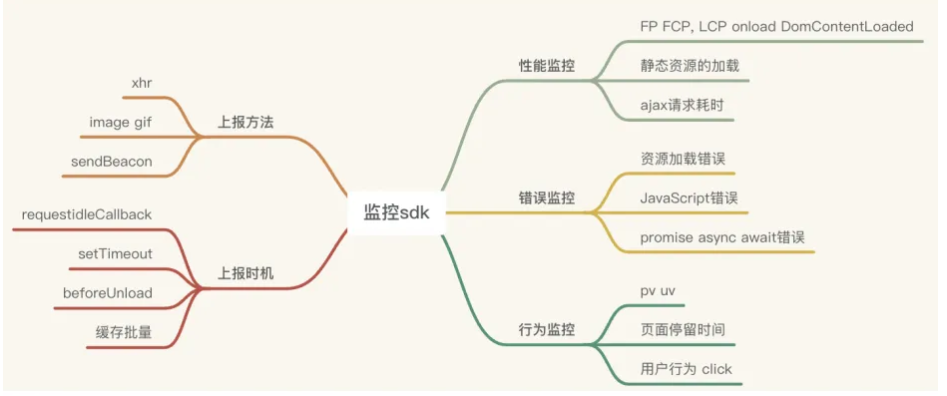
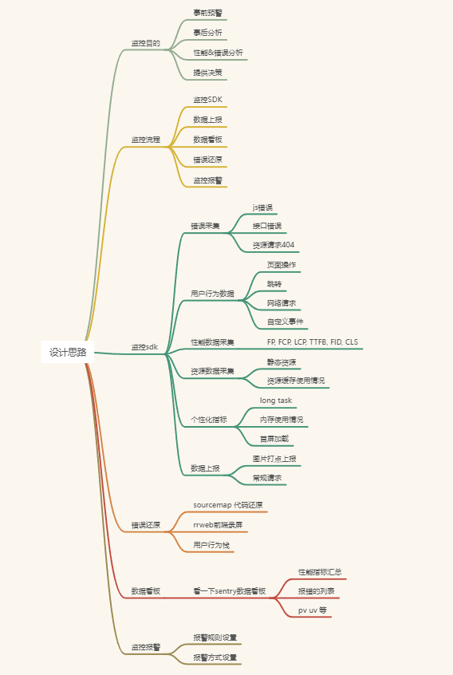

# 前端监控

## 作用

> 为什么要自研做监控？作用是什么？为什么不用第三方的监控平台，业界有那些成熟的监控平台

- 第三方监控平台：
    - sentry(开源的/成熟的)
    - 神策数据
    - 阿里的arms前端监控
    - 百度统计

- 为什么要自研
    - 可以将公司的SDK统一成一个，不仅限于监控的SDK，还可以包括埋点的SDK活啥用户行为的
    - 可以提供更多的错误的还原方式，比如截图、录屏等。
    - 还有错误信息和埋点信息进行信息联动等，可以拿到更细致的用户的行为调用栈，能够快速排查线上错误
    - 自定义监控指标：比如长任务，包括页面的内存，首屏的加载
    - 相对于第三方收费开源平台而言还可以降低公司成本

## 项目搭建

**设计思路**

> 一个完整的前端监控平台包括四个部分：数据采集与上报、数据分析和存储、数据展示、数据的报警与监控

[成品代码传送门](https://github.com/mzmm403/web-monitor)