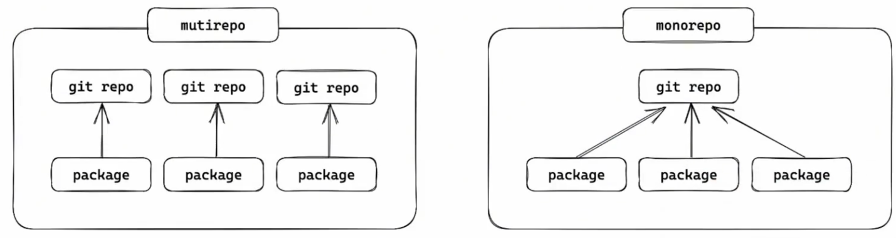

# monorepo

## mutirepo vs monorepo



多仓管理(mutirepo)：一个包一个仓库
单仓管理(monorepo)：多个包在一个仓库

常见的monorepo管理工具：
- pnpm
- npm
- Yarn
- Lerna
- Nx
- Turborepo
- Rush
- ...

**monorepo是一种管理模式，主要解决两个问题：规范的统一规管理和代码的统一化管理。**

- 规范的统一化管理
    - 环境的统一管理
    - 代码风格和格式的统一管理
    - git提交规范的管理
- 代码的统一化管理
    - 统一打包
    - 统一建立包依赖
    - 统一测试
    - 发布


### pnpm monorepo

```bash
touch pnpm-workspace.yaml
```

下面的`yaml`文件就是为了告诉工程，哪些是子包，这里`packages`和`apps`目录下的所有子包都属于这个monorepo。
```yaml
# pnpm-workspace.yaml

packages:
  - 'packages/*'
  - 'apps/*'
```

执行工程级命令

```bash
pnpm --workspace-root [...]
```
或
```bash
pnpm -w [...]
```
上面的两个命令意思都是在工程根目录下执行命令。

执行子包命令

```bash
进入子目录
```
或
```bash
pnpm -C 子包路径 [...]
```

## 环境版本锁定

凡是要对很多子包做统一处理，都在根目录工程中完成
所以在根目录的`package.json`中锁定环境版本。

```json
"engines":{
    "node": ">=22.14.0",
    "npm": ">=10.9.2",
    "pnpm": ">=10.15.1",
}
```
下面是`.npmrc`文件，用来强制使用上面锁定的版本。在根目录下创建`.npmrc`文件。如果现在用的版本低于上面锁定的版本，则会报错。而不是警告

```env
# .npmrc

engine-strict=true
```

## TypeScript

```bash
pnpm -Dw add typescript @types/node
```
```bash
touch tsconfig.json
```
```json
// tsconfig.json

{
    "compilerOptions": {
        "baseUrl": ".",
        "module": "ESNext",
        "target": "ESNext",
        "types": [],
        "lib":  ["ESNext"],
        "sourceMap": true,
        "declaration": true,
        "declarationMap": true,
        "noUncheckedIndexedAccess": true,
        "exactOptionalPropertyTypes": true,
        "strict": true,
        "verbatimModuleSyntax": false,
        "moduleResolution": "bundler",
        "isolatedModules": true,
        "nnoUncheckedSideEffectImports": true,
        "moduleDetection": "force",
        "skipLibCheck": true,
    }.
    "exclude": ["node_modules", "dist"],
}
```
然后具体的子包中，ts的配置不一样可以继承根目录的配置，然后做单独的配置。

```json
{
    "extends": "../../tsconfig.json",
    "compilerOptions": {
        // 这里可以单独配置
        "types": ["node"],
        "lib":  ["ESNext"],
    },
    "include": ["src"],
}
```

## 代码风格与质量检查

### prettier

```bash
pnpm -Dw add prettier
```

```bash
touch prettier.conifg.js
```
```js
// prettier.config.js
/**
 * @type {import('prettier').Config}
 * @see https://www.prettier.cn/docs/options.html
 */

export default {
    // 指定最大换行长度
    printWidth: 120,
    // 缩进制表符宽度 | 空格数
    tabWidth: 2,
    // 使用制表符而不是空格缩进行 (true | false)
    useTabs: false,
    // 结尾是否添加分号 (true | false)
    semi: true,
    // 使用单引号 (true | false)
    singleQuote: true,
    // 对象字面量中是否使用引号包裹属性 (as-needed | consistent | preserve)
    quoteProps: 'as-needed',
    // 在JSX中使用单引号而不是双引号
    jsxSingleQuote: false,
    // 在对象，数组括号与文字之间加空格 "{ foo: bar }"
    bracketSpacing: true,
    // 将 > 多行元素放到最后一行的末尾，而不是单独放在下一行 (true | false)
    bracketSameLine: false,
    // (x) => x 箭头函数参数只有一个时是否带有圆括号 (avoid|always)
    arrowParens: 'always',
    // 指定要使用的解析器，不需要写文件开头的 @prettier
    requirePragma: false,
    // 在文件顶部插入一个特殊的 @format marker 来指定如何格式化此文件 (true | false)
    insertPragma: false,
    // 用于控制文本是否应该被换行以及如何进行换行
    proseWrap: 'preserve',
    // 指定HTML文件的全局空白敏感度 (css | strict | false)
    htmlWhitespaceSensitivity: 'css',
    // Vue文件脚本和样式标签缩进大小
    vueIndentScriptAndStyle: false,
    // 换行符使用 lf 结尾是 \n，windows 使用 crlf 结尾是\r\n
    endOfLine: 'lf',
    // 这两个选项可以用于格式化以给定字符偏移量(分别包括和不包括)开始和结束的代码 (rangeStart, rangeEnd)
    rangeStart: 0,
    rangeEnd: Infinity,
}
```

`prettier`忽略项

```bash
touch .prettierignore
```
```bash
# .prettierignore

dist
node_modules
public
.local
pnpm-lock.yaml
```

`prettier`脚本命令

```json
"scripts": {
    "lint:prettier": "prettier --write \"**/*.{js,ts,mjs,cjs,json,tsx,css,less,scss,vue,html,md}\"",
}
```

执行命令

```bash
pnpm run lint:prettier
pnpm lint:prettier
```

### eslint

```bash
pnpm -Dw add eslint@latest @eslint/js globals typescript-eslint eslint-plugin-prettier eslint-config-prettier eslint-plugin-vue
```

| 类别            | 库名                                             |
| ------------- | ---------------------------------------------- |
| 核心引擎          | eslint                                         |
| 官方规则集         | @eslint/js                                     |
| 全局变量支持        | globals                                        |
| TypeScript 支持 | typescript-eslint                              |
| 类型定义（辅助）      | @types/node                                    |
| Prettier 集成   | eslint-plugin-prettier, eslint-config-prettier |
| Vue.js 支持     | eslint-plugin-vue                              |

配置
```bash
touch eslint.config.js
```
```js
import { defineConfig } from 'eslint/config'
import eslint from '@eslint/js'
import tseslint from 'typescript-eslint'
import eslintPluginPrettier from 'eslint-plugin-prettier'
import eslintPluginVue from 'eslint-plugin-vue'
import globals from 'globals'
import eslintConfigPrettier from 'eslint-config-prettier'

const ignores = ["**/dist/**", "**/node_modules/**", ".*", "scripts/**", "**/*.d.ts"]

export default defineConfig({
    // 通用怕配置
    {
        ignores, // 忽略项
        extends: [eslint.configs.recommended, ...tseslint.configs.recommended, eslintConfigPPrettier],  // 继承规则
        plugins: {
            prettier: eslintPluginPrettier,

        }, // 插件
        languageOptions: {
            ecmaVersion: "latest", // ECMAScript版本
            sourceType: "module", // 模块类型
            parser: tseslint.parser, // 解析器
        },
        rules: {
            // 自定义规则
        }
    },

    // 前端配置
    {
        ignores,
        files: ["apps/frontend/**/*.{vue,ts,js,tsx,jsx}", "packages/components/**/*.{ts,js,tsx,jsx.vue}"], // 只对前端项目生效
        extends: [...eslintPluginVue.configs["rlat/recommended"], eslintConfigPrettier],
        languageOptions: {
            globals: {
                ...globals.browser
            }
        }
    },

    // 后端配置
    {
        ignores,
        files: ["apps/backend/**/*.{ts,js}"], // 只对后端项目生效
        languageOptions: {
            globals: {
                ...globals.node
            }
        }
    }
})
```

脚本命令

```json
"scripts": {
    "lint:eslint": "eslint",
}
```

执行命令

```bash
pnpm run lint:eslint
pnpm lint:eslint
```

### 拼写检查

vscode 插件：Code Spell Checker

```bash
pnpm -Dw add cspell @cspell/dict-lorem-ipsum
```

配置
```bash
touch cspell.json
```

```json

{
    "import": ["@cspell/dict-lorem-ipsum/cspell-ext.json"],
    "caseSensitive": false,
    // 自定义字典
    "dictionaries": ["custom-dictionary"],
    // 自定义字典路径和是否添加单词到字典中
    "dictionaryDefinitions": [
        {
            "name": "custom-dictionary",
            "path": "./.cspell/custom-dictionary.txt",
            "addWords": true
        }
    ],
    "ignorePaths": [
        "**/node_modules/**",
        "**/dist/**",
        "**/build/**",
        "**/lib/**",
        "**/docs/**",
        "**/vendor/**",
        "**/public/**",
        "**/static/**",
        "**/out/**",
        "**/tmp/**",
        "**/package.json",
        "**/*.md",
        "**/*.d.ts",
        "**/stats.html",
        "eslint.config.js",
        ".gitignore",
        ".prettierignore",
        "cspell.json",
        "commitlint.config.js",
        ".cspell"
    ]
}
```

这里注意要建立字典文件
```bash
mkdir -p ./.cspell && touch ./.cspell/custom-dictionary.txt
```

脚本命令

```json
"scripts": {
    "lint:spellcheck": "cspell lint \"(packages|apps)/**/*.{js,ts,mjs,cjs,json.css,less,scss,vue,html,md}\"",
}
```

执行命令

```bash
pnpm run lint:spellcheck
pnpm lint:spellcheck
```


## git提交规范

git仓库创建

```bash
touch .gitignore
```

```bash
# .gitignore

# Node
node_modules/
dist/
build/
.env
.env.*
*.log
npm-debug.log*
yarn-debug.log*
yarn-error.log*
pnpm-debug.log*

# IDE
.vscode/
.idea/
*.suo
*.ntvs*
*.njsproj
*.sln
*.sw?

# OS
.DS_Store
Thumbs.db

# TypeScript
*.tsbuildinfo

# Misc
coverage/
*.local
*.cache
*.tmp

# Git
.git/
```

```bash
git init
```

### commitizen

安装

```bash
pnpm -Dw add @commitlint/cli @commitlint/config-conventional commitizen cz-git
```

- `@commitlint/cli`：是`commitlint`工具的核心
- `@commitlint/config-conventional`：是基于`conventional commits`规范的配置文件
- `commitizen`：提供了一个交互式撰写commit信息的插件
- `cz-git`：国人开发的工具，工程性更强，自定义更高，交互性更好。


配置命令

```json
// package.json

"scripts": {
    "commit": "git-cz",
},
"config": {
    "commitizen": {
        "path": "node_modules/cz-git"
    }
}

```
配置`cz-git`

```bash
touch commitlint.config.js
```

```js
/** @type {import('cz-git').UserConfig} */
export default {
    extends: ["@commitlint/config-conventional"],
    rules: {
        // @see: https://commitlint.js.org/#/reference-rules
        "body-leading-blank": [2, "always"],
        "footer-leading-blank": [1, "always"],
        "header-max-length": [2, "always", 108],
        "subject-empty": [2, "never"],
        "type-empty": [2, "never"],
        "subject-case": [0],
        "type-enum": [
            2,
            "always",
            [
                "feat", // 新功能（feature）
                "fix", // 修复bug
                "docs", // 文档（documentation）
                "style", // 格式（不影响代码运行的变动）
                "refactor", // 重构（即不是新增功能，也不是修改bug的代码变动）
                "perf", // 性能优化
                "test", // 增加测试
                "build", // 构建过程或辅助工具的变动
                "ci", // CI配置文件和脚本       
                "chore", // 其他工具变动（不在改动范围的）
                "revert", // 回退
                "wip", // 开发中
                "workflow", // 工作流改进
                "types", // 类型（TypeScript声明文件改动）
                "release", // 发布版本
            ]
        ]
    },
    prompt: {
        types: [
            { value: "feat", name:"✨新功能: 新增功能"},
            { value: "fix", name:"🐛修复bug"},
            { value: "docs", name:"📚文档: 更新文档"},
            { value: "style", name:"🎨样式：格式调整(不影响代码运行)"},
            { value: "refactor", name:"♻️重构：代码重构（不包括 bug 修复、功能新增）"},
            { value: "perf", name:"⚡️性能优化"},
            { value: "test", name:"🧪测试: 增加或修改测试"},
            { value: "build", name:"📦构建: 修改项目构建或外部依赖（例如 scopes: npm）"},
            { value: "ci", name:"👷CI: 修改 CI 配置、脚本"},
            { value: "chore", name:"🔨其他: 更新脚手架配置或依赖"},
            { value: "revert", name:"⏪回退"},
            { value: "wip", name:"🚧开发中"},
            { value: "workflow", name:"📋工作流"},
            { value: "types", name:"🔍类型"},
            { value: "release", name:"🚀发布" }
        ],
        // 自定义范围（可选）
        scopes: ["root","backend","frontend","components","utils"],
        // 允许自定义范围（可选）
        allowCustomScopes: true,
        // 跳过详细描述和底部信息
        skipQuestions: ["body", "footerPrefix","footer","breaking"],
        messages: {
            type: "📌 请选择提交类型:",
            scope: "🎯 请选择影响范围(可选):",
            subject: "✍ 请简要描述更改:",
            body: "🔍️ 请输入详细描述(可选):",
            footer: "🔗 关联的 ISSUE 或 BREAKING CHANGE (可选):",
            confirmCommit: "✅ 确认提交？"
        }
    }
}
```

提交操作 

```bash
git add .
pnpm commit
```

### husky

>  提交前校验代码规范，防止不规范提交到仓库中。

安装

```bash
pnpm -Dw add husky
```

初始化

```bash
pnpx husky init
```

初始化以后会在项目根目录下生成`.husky`文件夹，在里面会生成`pre-commit`文件。
向`pre-commit`文件中添加命令如下配置：

```shell
#!/usr/bin/env sh
pnpm lint:prettier && pnpm lint:eslint && pnpm lint:spellcheck
```

### lint-staged

检查暂存区的文件是否符合规范，不符合则不允许提交。

安装
```bash
pnpm -Dw add lint-staged
```
配置命令
```json
"scripts": {
    "precommit": "lint-staged"
}
```
这里写成`precommit`,`git-cz`内部有个机制，它会自动调用`precommit`钩子。

配置文件

```js
// .lintstagedrc.js

export default {
    "*.{js,ts,mjs,cjs,json,tsx,css,less,scss,vue,html,md}": ["cspell lint"],
    "*.{js,ts,vue,md}": ["prettier --write", "eslint"],
}
```

因为有时候可能习惯了`git commit`, 这个时候没使用`git-cz`，所以这个时候就不会触发检查，因此这里最好的办法就是修改对应的`json`文件的方法名然后重新配置husky

```json
"scripts": {
    "lint:lint-staged": "lint-staged",
}
```


```shell
#!/usr/bin/env sh
pnpm lint:lint-staged
```

## 公共库打包

这里公共库打包要注意如下：
- 业务代码可以单独打包，配合docker容器进行部署。
- 公共库打包的时候必须统一打包管理，因为公共库之间如果有依赖，那么打包的时候就必须保证公共库的版本一致。


## 子包间依赖

在开发的时候直接引入本地库

```json
"dependencies": {
    "@xxx/xxx": "workspace:*",
    "@xxx/yyy": "workspace:*"
}
```
这里要注意因为我们使用的是`modules`，所以在本地导入的时候，需要配置`package.json`指定文件出口和类型文件

```json
{
    "module": "./dist/xxx.esm.js",
    "types": "./dist/xxx.d.ts"
}
```

## 单元测试

```bash
pnpm -Dw add vitest @vitest/browser vitest-browser-vue vue
```
- `vitest`: 核心测试框架
- `@vitest/browser`: 内置了无头浏览器用来测试浏览器环境下的代码
- `vitest-browser-vue`: 测试vue组件的插件
 

命令
```json
"scripts": {
    "test": "vitest",
}
```

配置文件

```js
// vitest.config.js

import { defineConfig } from "vitest/config";
export default defineConfig({
    test: {
        ...
    }
});
```


然后在对应的文件夹中建立`__test___`文件夹，然后在里面建立测试文件，测试文件命名以`.test.ts`结尾。
这样在运行vitest的时候就会自动找到这些文件进行测试。


## 发布

1. 首先就是配置`package.json`文件，在里面配置`version`, `files`, `main`, `module`, `types`等字段。
2. 换到npm官方源
3. `npm whoami` 查看当前登录的用户(注意登录的名字要和`package.json`里面的名字一致)
4. `npm login` 登录
5. `npm publish` 发布
