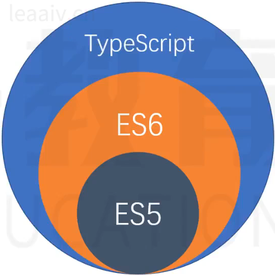
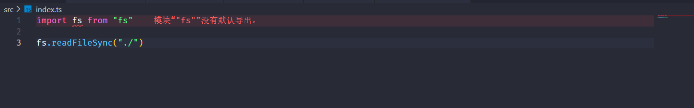

## ts的快速入门

### 关于变量类型的三种方式


#### 类型推断

> 就是ts底层会在你第一次赋值给某个变量时，推断并给予这个变量的类型

```ts
// 类型推断
let string = "abc"
string = 10
// 或者
let string = "abc"
let num = 10
string = num

// 上述就是错误的写法，这里因为第一次赋值给string是自负床类型因此ts就固定了string的类型为字符串，所以后续赋值的时候不可以给string赋值非字符串的值或是变量
```


#### 类型注解

> 其实就是对变量进行类型限定，也就是强语言中对于变量类型的声明

```ts
// 给变量的类型进行一个手动声明(类型注解)
let str: string = "abc"
let str1: string

str1 = 'abc'
```


#### 类型断言

> 就是程序在推断的时候会推断出undefined类型，如果我们能确定这个值的类型是必然的，就可以手动断言.

```ts
// 错误示范,res此时是undefined
let numArr = [1,2,3]
const res = numArr.find(item => item>3)
res * 5


// 正确写法
let numArr = [1,2,3]
const res = numArr.find(item => item>3) as number
res * 5
```


### 数据类型

#### 基础类型和联合类型

```ts
// 基础类型
let v1: string = "abc"
let v2: number = 10
let v3: boolean = true
let nu: null = null
let un: undefined = undefined


// 联合类型
let v4: string | null = null
let v5: 1 | 2 | 3 = 2
```


#### 数组、元组、枚举

```ts
// 数组
let arr: number[] = [1,2,3]
let arr1: Array<string> = ['a','b','c']

// 元组
let t1: [number,string,number] = [1,'2',3]
// 加了问号以后就变成了可选项
let t2: [number,string,number?] = [1,'2']

// 枚举
enum MyEnum {
    A,
    B,
    C
}

console.log(MyEnum.A)
console.log(MyEnum[0])
```


#### 函数

```ts
// 函数的定义
function MyFn (a: number, b: string): string{
    return a+b
}
// void空返回值，这里void其实就是undefined
function MyFn1 (a: number, b: string): void{
    a+b
}
// 可选参数，给参数设置默认值，可变参数
function MyFn2 (a = 10,b: string, c? :boolean, ...rest: number[]): number{
    return 100
}

const f = MyFn2(20,'abc',1,2,3,)
```

#### 类

```ts
class Article {
    title: string
    content: string
    aaa?: string
    // 默认值
    bbb = 100 
    
    // 构造函数
    constructor (title: string, content:string){
        this.title = title,
        this.content = content
    }
}

const a = new Article('标题','内容')
```


#### 接口

```ts
// 定义接口
interface Obj{
    name: string,
    age: number
}

const obj: Obj = {
    name: "a",
    age: 10
}
```


#### 类型别名

```ts
type MyUserName = string | number
let a: MyUserName = 10
let b: MyuserName = 'abc'
```


#### 泛型

```ts
function myFn<T>(a:T,b:T): T[]{
    return [a,b]
}

myFn<number>(1,2)
// 这样不声明也行，ts会有一个类型推断
myFn("a","b")
```


### 高级用法

#### 函数重载

> 函数重载的优点在于提高了代码的灵活性、可读性和类型安全性.重载确保了函数的接口更加明确，并且在开发过程中提供了更好的类型检查和错误检测。

```ts
// eg1:
function map<T>(array: T[], callback: (item: T) => T): T[];
function map<T, U>(array: T[], callback: (item: T) => U): U[];
function map<T, U>(array: T[], callback: (item: T) => T | U): (T | U)[] {
    return array.map(callback);
}

// eg2:
interface Vector2D {
    x: number;
    y: number;
}

function add(a: number, b: number): number;
function add(a: Vector2D, b: Vector2D): Vector2D;
function add(a: number | Vector2D, b: number | Vector2D): number | Vector2D {
    if (typeof a === 'number' && typeof b === 'number') {
        return a + b;
    } else if (typeof a !== 'number' && typeof b !== 'number') {
        return { x: a.x + b.x, y: a.y + b.y };
    }
    throw new Error('Invalid arguments');
}


```


#### 接口的继承

```ts
interface Parent {
    prop1: string
    prop2: number
}

interface Chlid extends Parent {
    prop3: string[]
}

const myObj: Chlid = {
    prop1: 'abc',
    prop2: 12,
    prop3: ["1","2"]
}
```


#### 类的修饰符

```ts
class Article {
    // 默认public
    title: string
    public content: string
    
    // 私有属性,只能在类中访问
    private tempData?: string
    // 受保护属性,只能在当前类和子类中访问
    protected innerData?: string
    // 静态属性,设置给类本本身的
    static author: string
    // 只读
    readonly age: number = 18

    // 构造函数
    constructor (title: string, content:string){
        this.title = title,
        this.content = content
    }
}

const a = new Article('标题','内容')
//静态类访问
Article.author

// innerData的访问
class B extends Article {
    constructor (title: string, content:string) {
        super(title,content)
        this.innerData
    }
}
```


#### 存储器

```ts
class User {
    // 私有变量建议加一个下划线命名
    private _password: string = ''
	
	// 获取密码
	get password(): string{
        return '******'
    }
	// 设置密码
	set password(newPass: string){
        this._password = newPass
    } 
}

const u = new User()
console.log(u.password)
```


#### 抽象类

```ts
abstract class Animal{
    abstract name: string
    abstract Sound(): void
    // 具体的属性和方法可以直接被继承
    move (): void {
        console.log("移动")
    }
}

class Horse extends Animal {
    name: string = "小马"
    Sound(): void{
        console.log("吁~~~")
    }
}
```


#### 类实现接口

```ts
interface Animal {
    name: string
    get sound(): string
    Sound():void
}

interface B {
    age: number
}

class Dog implements Animal,B {
    name: string = "小狗"
    age: number = 10
    get sound(){
        return ''
    }
    Sound(): void{
        
    }
}
```


#### 泛型类

```ts
class MyClass<T> {
    public value: T
    constructor (value: T){
        this.value = value
    }
    
    do (input: T): T{
        console.log("处理数据",this.value)
        return input
    }
}


const myStr = new MyClass<string>("hello")
myStr.do("nihao")
```


## ts完整学习

### 为什么要学习ts

#### js的问题

- js开发中的问题
    - 使用了不存在的变量、函数成员(就是经常大小写没注意或者拼写错误)
    - 把不确定的类型当成确定的类型去处理
    - 使用undfined或者null的成员
- js本身的缺点
    - 由于js本身特性导致无法适应大型的复杂项目
    - 弱类型：某个变量可以随时更换类型
    - 解释性：发生错误的时间，是在运行时


#### ts
> ts是js的超集，是一个可选的、静态的类型系统(对代码所有的标识符进行类型检查)



- ts是可选的，可以在js中添加类型，也可以不添加
- ts是静态的，可以在编译时检查类型，而不是在运行时,ts不参与运行时的检查
- 无论在浏览器还是node环境，无法直接识别ts代码，因此需要做转换
    - tsc也就是ts编译器(ts->js)，这个过程叫做编译(eg: babel: es6->es5)
- [ts的官方网站](http://www.typescriptlang.org)


###　在node中安装ts

```bash
# 全局安装
pnpm i -g typescript
# 编译ts代码
tsc index.ts
# 运行编译后的js代码
node index.js
```

默认情况下，TS会做出下面几种假设

- 假设当前的执行环境是dom(也就是浏览器)
- 如果代码中没有使用模块化语句(import/export)，则默认认为是在全局执行环境
- 编译的目标代码是es3

有两种方式更改以上假设

1. 使用ts命令行的时候加上参数
```bash
tsc --参数  index.ts 
```
2. 使用ts配置文件来更改编译选项
    
    - 生成ts配置文件

    ```bash
    # 在项目根目录下创建一个tsconfig.json文件
    tsc --init
    ```

    - 这个就是生成的配置文件的完整版
    
    ```json
    {
    "compilerOptions": {
        /* Visit https://aka.ms/tsconfig to read more about this file */

        /* Projects */
        // "incremental": true,                              /* Save .tsbuildinfo files to allow for incremental compilation of projects. */
        // "composite": true,                                /* Enable constraints that allow a TypeScript project to be used with project references. */
        // "tsBuildInfoFile": "./.tsbuildinfo",              /* Specify the path to .tsbuildinfo incremental compilation file. */
        // "disableSourceOfProjectReferenceRedirect": true,  /* Disable preferring source files instead of declaration files when referencing composite projects. */
        // "disableSolutionSearching": true,                 /* Opt a project out of multi-project reference checking when editing. */
        // "disableReferencedProjectLoad": true,             /* Reduce the number of projects loaded automatically by TypeScript. */

        /* Language and Environment */
        "target": "es2016",                                  /* Set the JavaScript language version for emitted JavaScript and include compatible library declarations. */
        // "lib": [],                                        /* Specify a set of bundled library declaration files that describe the target runtime environment. */
        // "jsx": "preserve",                                /* Specify what JSX code is generated. */
        // "experimentalDecorators": true,                   /* Enable experimental support for legacy experimental decorators. */
        // "emitDecoratorMetadata": true,                    /* Emit design-type metadata for decorated declarations in source files. */
        // "jsxFactory": "",                                 /* Specify the JSX factory function used when targeting React JSX emit, e.g. 'React.createElement' or 'h'. */
        // "jsxFragmentFactory": "",                         /* Specify the JSX Fragment reference used for fragments when targeting React JSX emit e.g. 'React.Fragment' or 'Fragment'. */
        // "jsxImportSource": "",                            /* Specify module specifier used to import the JSX factory functions when using 'jsx: react-jsx*'. */
        // "reactNamespace": "",                             /* Specify the object invoked for 'createElement'. This only applies when targeting 'react' JSX emit. */
        // "noLib": true,                                    /* Disable including any library files, including the default lib.d.ts. */
        // "useDefineForClassFields": true,                  /* Emit ECMAScript-standard-compliant class fields. */
        // "moduleDetection": "auto",                        /* Control what method is used to detect module-format JS files. */

        /* Modules */
        "module": "commonjs",                                /* Specify what module code is generated. */
        // "rootDir": "./",                                  /* Specify the root folder within your source files. */
        // "moduleResolution": "node10",                     /* Specify how TypeScript looks up a file from a given module specifier. */
        // "baseUrl": "./",                                  /* Specify the base directory to resolve non-relative module names. */
        // "paths": {},                                      /* Specify a set of entries that re-map imports to additional lookup locations. */
        // "rootDirs": [],                                   /* Allow multiple folders to be treated as one when resolving modules. */
        // "typeRoots": [],                                  /* Specify multiple folders that act like './node_modules/@types'. */
        // "types": [],                                      /* Specify type package names to be included without being referenced in a source file. */
        // "allowUmdGlobalAccess": true,                     /* Allow accessing UMD globals from modules. */
        // "moduleSuffixes": [],                             /* List of file name suffixes to search when resolving a module. */
        // "allowImportingTsExtensions": true,               /* Allow imports to include TypeScript file extensions. Requires '--moduleResolution bundler' and either '--noEmit' or '--emitDeclarationOnly' to be set. */
        // "resolvePackageJsonExports": true,                /* Use the package.json 'exports' field when resolving package imports. */
        // "resolvePackageJsonImports": true,                /* Use the package.json 'imports' field when resolving imports. */
        // "customConditions": [],                           /* Conditions to set in addition to the resolver-specific defaults when resolving imports. */
        // "noUncheckedSideEffectImports": true,             /* Check side effect imports. */
        // "resolveJsonModule": true,                        /* Enable importing .json files. */
        // "allowArbitraryExtensions": true,                 /* Enable importing files with any extension, provided a declaration file is present. */
        // "noResolve": true,                                /* Disallow 'import's, 'require's or '<reference>'s from expanding the number of files TypeScript should add to a project. */

        /* JavaScript Support */
        // "allowJs": true,                                  /* Allow JavaScript files to be a part of your program. Use the 'checkJS' option to get errors from these files. */
        // "checkJs": true,                                  /* Enable error reporting in type-checked JavaScript files. */
        // "maxNodeModuleJsDepth": 1,                        /* Specify the maximum folder depth used for checking JavaScript files from 'node_modules'. Only applicable with 'allowJs'. */

        /* Emit */
        // "declaration": true,                              /* Generate .d.ts files from TypeScript and JavaScript files in your project. */
        // "declarationMap": true,                           /* Create sourcemaps for d.ts files. */
        // "emitDeclarationOnly": true,                      /* Only output d.ts files and not JavaScript files. */
        // "sourceMap": true,                                /* Create source map files for emitted JavaScript files. */
        // "inlineSourceMap": true,                          /* Include sourcemap files inside the emitted JavaScript. */
        // "noEmit": true,                                   /* Disable emitting files from a compilation. */
        // "outFile": "./",                                  /* Specify a file that bundles all outputs into one JavaScript file. If 'declaration' is true, also designates a file that bundles all .d.ts output. */
        // "outDir": "./",                                   /* Specify an output folder for all emitted files. */
        // "removeComments": true,                           /* Disable emitting comments. */
        // "importHelpers": true,                            /* Allow importing helper functions from tslib once per project, instead of including them per-file. */
        // "downlevelIteration": true,                       /* Emit more compliant, but verbose and less performant JavaScript for iteration. */
        // "sourceRoot": "",                                 /* Specify the root path for debuggers to find the reference source code. */
        // "mapRoot": "",                                    /* Specify the location where debugger should locate map files instead of generated locations. */
        // "inlineSources": true,                            /* Include source code in the sourcemaps inside the emitted JavaScript. */
        // "emitBOM": true,                                  /* Emit a UTF-8 Byte Order Mark (BOM) in the beginning of output files. */
        // "newLine": "crlf",                                /* Set the newline character for emitting files. */
        // "stripInternal": true,                            /* Disable emitting declarations that have '@internal' in their JSDoc comments. */
        // "noEmitHelpers": true,                            /* Disable generating custom helper functions like '__extends' in compiled output. */
        // "noEmitOnError": true,                            /* Disable emitting files if any type checking errors are reported. */
        // "preserveConstEnums": true,                       /* Disable erasing 'const enum' declarations in generated code. */
        // "declarationDir": "./",                           /* Specify the output directory for generated declaration files. */

        /* Interop Constraints */
        // "isolatedModules": true,                          /* Ensure that each file can be safely transpiled without relying on other imports. */
        // "verbatimModuleSyntax": true,                     /* Do not transform or elide any imports or exports not marked as type-only, ensuring they are written in the output file's format based on the 'module' setting. */
        // "isolatedDeclarations": true,                     /* Require sufficient annotation on exports so other tools can trivially generate declaration files. */
        // "allowSyntheticDefaultImports": true,             /* Allow 'import x from y' when a module doesn't have a default export. */
        "esModuleInterop": true,                             /* Emit additional JavaScript to ease support for importing CommonJS modules. This enables 'allowSyntheticDefaultImports' for type compatibility. */
        // "preserveSymlinks": true,                         /* Disable resolving symlinks to their realpath. This correlates to the same flag in node. */
        "forceConsistentCasingInFileNames": true,            /* Ensure that casing is correct in imports. */

        /* Type Checking */
        "strict": true,                                      /* Enable all strict type-checking options. */
        // "noImplicitAny": true,                            /* Enable error reporting for expressions and declarations with an implied 'any' type. */
        // "strictNullChecks": true,                         /* When type checking, take into account 'null' and 'undefined'. */
        // "strictFunctionTypes": true,                      /* When assigning functions, check to ensure parameters and the return values are subtype-compatible. */
        // "strictBindCallApply": true,                      /* Check that the arguments for 'bind', 'call', and 'apply' methods match the original function. */
        // "strictPropertyInitialization": true,             /* Check for class properties that are declared but not set in the constructor. */
        // "strictBuiltinIteratorReturn": true,              /* Built-in iterators are instantiated with a 'TReturn' type of 'undefined' instead of 'any'. */
        // "noImplicitThis": true,                           /* Enable error reporting when 'this' is given the type 'any'. */
        // "useUnknownInCatchVariables": true,               /* Default catch clause variables as 'unknown' instead of 'any'. */
        // "alwaysStrict": true,                             /* Ensure 'use strict' is always emitted. */
        // "noUnusedLocals": true,                           /* Enable error reporting when local variables aren't read. */
        // "noUnusedParameters": true,                       /* Raise an error when a function parameter isn't read. */
        // "exactOptionalPropertyTypes": true,               /* Interpret optional property types as written, rather than adding 'undefined'. */
        // "noImplicitReturns": true,                        /* Enable error reporting for codepaths that do not explicitly return in a function. */
        // "noFallthroughCasesInSwitch": true,               /* Enable error reporting for fallthrough cases in switch statements. */
        // "noUncheckedIndexedAccess": true,                 /* Add 'undefined' to a type when accessed using an index. */
        // "noImplicitOverride": true,                       /* Ensure overriding members in derived classes are marked with an override modifier. */
        // "noPropertyAccessFromIndexSignature": true,       /* Enforces using indexed accessors for keys declared using an indexed type. */
        // "allowUnusedLabels": true,                        /* Disable error reporting for unused labels. */
        // "allowUnreachableCode": true,                     /* Disable error reporting for unreachable code. */

        /* Completeness */
        // "skipDefaultLibCheck": true,                      /* Skip type checking .d.ts files that are included with TypeScript. */
        "skipLibCheck": true                                 /* Skip type checking all .d.ts files. */
    }
    }
    ```
### ts的配置文件

> 在使用配置文件以后，使用tsc编译时不能跟上文件名，如果跟上文件名，会忽略配置文件

```bash
# 直接使用ts编译器就行
tsc
```

```json
{
    "compilerOptions": { // 编译选项
        "target": "es2016", // 代码编译以后用的是什么版本的js
        "module": "es6", // 编译目标使用的是什么模块化标准(es6/commonjs)
        "lib": [
            // 配置ts的全局环境
            es2016
            // dom 默认有一个dom环境，这里不加
            // 这里不用dom环境以后，我们必须安装node的第三方库`@types/node`
            // 如果不安装这个环境，console可能都识别不到
            // @types是一个ts官方的类型库，其中包含了很多对js代码的类型描述.
        ],
        "outDir": "./dist", // 编译以后输出到哪个文件夹
        "removeComments": true // 编译以后是否移除注释
    },
    "include": [
    // 要编译的文件夹
    "./src"
    ],
    "files":["./src/index.ts"], // 只会编译该文件以及该文件依赖的文件
}
```
```bash
# 安装@types/node，开发依赖安装
npm install -D @types/node
```

### 使用第三方库简化编译流程

ts-node: 将ts代码在内存中完成编译，同时完成运行

```bash
# 安装
npm i ts-node
# 编译运行
ts-node src/index.ts
```

nodemon: 用于监测文件的变化
```bash
# 安装
npm i -D nodemon
# 监测文件变化，要是变化了就运行`ts-node src/index.ts`
# -e ts 表示只监测ts文件
# --watch src 表示监测src文件夹
nodemon --watch src -e ts --exec ts-node src/index.ts
```

把命令写到packages.json中
```json
{
    "scripts":{
        // 开发模式
        "dev":"nodemon --watch src -e ts --exec ts-node src/index.ts"
    }
}
```

### 类型类型检查

#### 类型约束和编译结果对⽐

> 仅需要在变量、函数的参数、函数的返回值位置加上 `:类型`即可
> ts在某些时候可以进行类型推导，如果推到不出来就时any类型，ts对any类型不做检查

```ts
let myname:string = "mzmm"
console.log(myname)

function add(a:number,b:number):number{
    return a+b
}

let num:number = add(1,2)
```

**编译出来的js结果就是将ts代码中的类型去掉，直接将ts代码编译成js代码**

#### 基本类型

- number：数字
- string：字符串
- boolean：布尔值
- 数组
- object：对象
- null和undefined：空值
    - null和undefined是所有类型的子类型，可以赋值给其他类型(因此我们可以在tsconfig.json中配置strictNullChecks=true来更严格的检查空值,这样可以避免控制错误)

```ts
let str:string
let num:number
let bool:boolean
// 定义一个number数组
let arr:number[]
let arr2:Array<number>
// 定义一个string数组
let arr3:string[]
let arr4:Array<string>

let obj:object
```

#### 其他类型

- 联合类型：多种类型任选其一
- void类型：通常用于约束函数的返回值，表示改函数不返回值
- never类型：通常用于约束函数的返回值，表示函数永远不会结束
- 字面量类型：使用一个值进行约束
- 元组类型(Tuple)：一个固定长度的数组，并且数组种每一项的类型确定
- any类型：any类型可以绕过类型检查，因此any类型的数据可以赋值给任意类型

```ts
// 联合类型
let name:string|undefined
// 类型保护
// 联合类型因为可能有多种可能所以在判断类型里面去做类型保护
if(typeof name === 'string'){
    // 在这里ts会认为name是string类型
    console.log(name)
}

// void类型
function printMenu():void{
    console.log("Menu")
}

// never类型
function throwError(msg:string):never{
    throw new Error(msg)
}

function alwaysDoSomething():never{
    while(true){
        //...
    }
}

// 字面量类型
// gender只能赋值male或者female
let gender:'male'|'female'

// 元组类型
let tu: [string,number,boolean]
tu = ["mzmm",18,true] // 多了或者少了都不行,并且类型还要保持一致

// any类型
let data:any
data = 123
data = "mzmm"
```

#### 类型别名

> 对已知的一些类型定义名称
> 格式：`type 类型名= ...`

```ts
type Gender = 'male'|'female'

type User = {
    name:string,
    age:number
    gender:Gender
}

let u:User
u = {
    name:"mzmm",
    age:18,
    gender:"male"
}

let u1:User = {
    name:"mzmm1",
    age:19,
    gender:"female"
}
```


#### 函数的相关约束

- 函数重载：就是在函数实现之前，对函数调用的多种情况进行声明
- 可选参数：在参数名后面加上`?`表示该参数是可选的,可选参数得放到参数列表的末尾
- 默认参数：在参数名后面加上`=`表示该参数是可选的，并且可以赋值默认值，默认参数一定是可选参数

```ts
// 函数声明
// 还可以在声明上面写上注释
/**
 * 得到a*b的结果
 * @param a number
 * @param b number
 */
function combine(a:number,b:number):number
/**
 * 得到a+b的结果
 * @param a string
 * @param b string
 */
function combine(a:string,b:string):string

function combine(a:number|string,b:number|string) :number|string{
    if(typeof a === 'string' && typeof b === 'string'){
        return a+b
    }else if(typeof a === 'number' && typeof b === 'number'){
        return a*b
    }
    throw new Error('a和b类型必须相同')
}

const res = combine(1,2)
const res1 = combine('1','2')

// 可选参数
function printInfo(name:string,age?:number){
    if(age){
        console.log(name,age)
    }else{
        console.log(name)
    }
}

// 默认参数
function sum(a:number,b:number=10):number{
    if(b){
        return a+b
    }
    return a
}
```


### 枚举

> 扩展类型：类型别名，枚举，接口，类
> 枚举通常约束变量的取值范围

那么枚举可以通过字面量和联合类型达到，为什么还要枚举呢？

#### 字面量类型的问题

- 在类型约束位置产生重复代码(可以使用类型别名解决该问题)
- 逻辑含义和真实值产生混淆，会导致当修改真实值的时候，产生大量的修改(就比如gender，如果使用字面量和联合类一开始定义是男和女，后来又定义成1和2，那么代码中所有使用到gender的地方都要修改)
- 字面量类型不会进入编译结果

#### 枚举的使用

> 定义枚举

```ts
enum 枚举名{
    枚举字段1 = 值1,
    枚举字段2 = 值2,
    // ...
}

// eg
enum Gender{
    Male = 1,
    Female = 2
}

let gender:Gender = Gender.Male
console.log(gender)
// 如果要改逻辑名称，这里也就是Male或者Female，那就按f2进行重构
// 枚举会参与编辑，编译结果中表现为对象
// 可以把枚举中的值打印出来

function printGender(){
    const vals = Object.values(Gender)
    vals.forEach(val => {
        console.log(val)
    })
}
```

> 枚举的规则
- 枚举的字段的值只能使用字符串或者数字
- 数字枚举的值会自动自增
    ```ts
    enum level{
        a,
        b,
        c
    }

    let num:level = level.b
    console.log(num) // 1

    // 如果第一个不赋值就是0
    let num1:level = level.a
    console.log(num1) // 0
    ```
- 被数组枚举约束的变量可以直接赋值为数字
    ```ts
    enum level{
        a,
        b,
        c
    }

    // 这样不会报错，但是不建议这样做
    let num:level = 1
    ```
- 数组枚举和字符串枚举的编译结果有差异

    ```ts
    enum level{
        a,
        b,
        c
    }
    // 上面的数字枚举的编译结果eg：
    {
        a:0,
        b:1,
        c:2,
        0:"a",
        1:"b",
        2:"c"
    }
    ```

> 最佳实践

- 尽量不要在一个枚举中既出现字符串又出现数字
- 使用枚举时尽量使用枚举字段的名称，而不是使用真实的值

#### 枚举的位运算

> 针对的数字枚举
> eg: 比如权限就可以做位运算来进行权限控制

```ts
enum Permission{
    // 基本权限
    Read = 1,   // 0001
    Write = 2,  // 0010
    Create = 4, // 0100
    Delete = 8  // 1000
}

// 我们可以通过基本权限的组合来实现复杂的权限控制

// 权限的组合
// 这里的`|`是表示位运算中的或运算
// 位运算就是把两个数字转换成二进制后进行的运算
// 0001
// 或
// 0010
// 0011 = 3
let p = Permission.Read | Permission.Write

// 如何判断是否拥有某个权限
/**
 * * @param target 要判断的目标
 * * @param p 要判断的权限
 */
function hasPermission(target:Permission,p:Permission){
    // & 表示位运算中的且运算
    // 0011
    // 且
    // 0001
    // 0001
    return (target & p) === p
}

// 判断变量p是否有可读权限
hasPermission(p,Permission.Read)

// 如何删除某个权限
/**
 * * @param target 要删除权限的目标
 * * @param p 要删除的权限
 */
function removePermission(target:Permission,p:Permission){
    // 异或运算
    // 0011
    // 异或
    // 0001
    // 0010
    return target ^ p
}

// 删除可读权限
removePermission(p,Permission.Read)
```


### 模块化

#### 在ts中使用模块化

|配置名称|含义|
| :------: | :------: |
|module|设置编译结果中使用模块化标准|
|moduleResolution|设置解析模块的模式|
|noImplicitUseStrict|编译结果中不包含"use strict"|
|removeComments|编译结果移除注释|
|noEmitOnError|错误时不生成编译结果|
|esModuleInterop|启用es模块化交互非es导出|

> 前端领域中的模块化标准: ES6/CommonJS/AMD/UMD/System/esnext

> TS中如何书写模块化标准
> 编译结果使用的是什么模块化标准


- 在TS中,导入和导出模块,统一使用ES6的模块化标准

```ts
// 导出模块
// myModule.ts
export const name:string = "mzmm403"

export function sum(a:number, b:number):number{
    return a+b
}


// 导入模块
// index.ts
import {sum,name} from "./myModule"

console.log(name)

console.log(sum(1,2))
```

- 这里注意使用普通导出也就是上面的导出方式是有智能提示的,而使用默认导出是没有智能提示的(因为默认导出是没有名字的,编译器没办法知道你导出了什么)

```ts
export default {
    name:string = "mzmm403"
    sum(a:number,b:number):number{
        return a+b
    }
}
```

#### 编译结果中的模块化

ts中的模块化在编译结果中(找个编译结果的标准可以自己配置)

- 如果编译结果模块化标准是ES6，则编译结果没区别
- 如果编译结果模块化标准是commonjs，导出的声明会变成exports的属性，默认导出会变成exports的default属性

#### 解决默认导入的错误

因为nodejs中的方法时拿commojs的标准去写的，因此在ts中导入nodejs中的方法时，会报错



> 解决方法

- 改变导入的方式

```ts
import * as fs from "fs"

// 或者

import {readFileSync} from "fs"
```

- 在tsconfig.json中添加配置项"esModuleInterop":true(编译后的结果会使用辅助函数来兼容commonjs的模块化标准)

```json
{
    "compilerOptions":{
        "esModuleInterop":true
    }
}
```

#### 如何在TS中书写commonjs模块化代码 

> 虽然在ts可以书写commonjs但是还是建议用es6的写法

```ts
// 导入

import myModule = require("./myModule")

// 导出

export = {
    name:string = "mzmm403"
    sum(a:number,b:number):number{
        return a+b
    }
}
```

#### 模块解析

> 在ts中有两种模块解析策略(模块解析就是应该从什么位置寻找模块)

- classic(经典模式，在es6出来之前就有了，过时了)
- node(node解析策略，可以直接用moduleResolution字段在json配置写死)

### 接口和类型兼容性

#### 扩展类型 - 接口
> 接口是用来约束类，对象，函数的契约(标准)
> 接口：interface

契约(标准)形式
- API文档，弱标准
- 代码约束，强标准

#### 接口的使用

> 接口不出现在编译结果中

- 接口约束对象
```ts
// 定义一个约束对象的接口

interface User{
    name:string
    age:number
}

// 实现接口
let user:User = {
    name:"mzmm403",
    age:18
}
```

- 接口约束函数
```ts
// 定义一个约束函数的接口
interface Condition = {
    (n:number): boolean
}

function sum(numbers: number[],callBack:Condition){
    let s = 0;
    number.forEach(n => {
        if(callBack(n)){
            s+=n
        }
    })
    return s
}

const res = sum([1,2,3,4,5],function(n){
    return n%2 === 0
})
```

- 接口约束类

```ts
// 类实现接口
interface UserImp {
  name: string;
  iphone: number;
}

class User implements UserImp {
    constructor(public name: string, public iphone :number, private _age: number) {}

    set age(value: number) {
        if(value < 0){
            this._age = 0;
        }else if(value > 200){
            this._age = 200;
        }else{
            this._age = value;
        }
    }

    get age(){
        return this._age;
    }
}
```


**接口可以继承**

```ts
interface A{
    T1: string
}

interface B extends A{
    T2: number
}

let u:B = {
    T1:"mzmm403",
    T2:18
}

// 接口也可以多继承
interface C extends A,B{
    T3: boolean
}
```

可以通过接口之间的继承，实现多种接口的组合
使用类型别名type也可以实现类似的组合效果，需要通过`&`，它叫交叉类型

```ts
type A = {
    T1: string
}

type B = A & {
    T2: number
}

type C = {
    T3: boolean
} & A & B
```
区别：
- 子接口不能覆盖父接口的成员
- 交叉类型会把相同成员的类型进行交叉(就近原则)


#### readonly修饰符 

> 只读修饰符，修饰的目标是只读的

```ts
interface User{
    readonly id: string
    name: string
    age: number
}

// 加完readonly之后，id只能在定义的时候赋值，之后不能修改
let user:User = {
    id:"001",
    name:"mzmm403",
    age:18
}
```
只读修饰符不在编译结果中


#### 类型兼容性

ts在做类型兼容的时候使用的是鸭子辨型法(子结构辨型法)：目标类型需要某些特征，赋值的类型只要满足该特征即可。比如你只要会嘎嘎叫你就是鸭子

- 基本类型：完全匹配
- 对象：鸭子辨型法
- 函数
    - 参数：传递的参数可以少不能和多
    - 返回值：要求返回，对类型严格判断，不要求返回随便返回类型 

- 类型断言： `要断言的东西 as 类型`

```ts
interface Duck{
    soud:"嘎嘎嘎"
    swin(): void
}

let person = {
    name: "mzmm",
    age: 18,
    soud:"嘎嘎嘎" as "嘎嘎嘎",
    swin():void{
        console.log("游泳")
    }
}

let duck:Duck = person


//  直接这样写就报错
let duck:Duck = {
    name: "mzmm",
    age: 18,
    soud:"嘎嘎嘎" as "嘎嘎嘎",
    swin():void{
        console.log("游泳")
    }
}
```
当直接使用对象字面量赋值的时候，会进行更加严格的判断


### 类

> 面向对象思想

#### 新增的类语法

- js中类的写法

```js
// js代码的写法
class User{
    constructor(name,age){
        this.name = name
        this.age = age
    }
}
```

- ts中类的写法

属性：使用属性列表来定义属性，属性的默认值可以在属性列表中定义也可以在构造函数中的参数列表中定义

```ts
class User{
    name:string
    age:number
    gender: "男" | "女"
    pid?: string // ?表示可选属性
    
    constructor(name:string,age:number,gender:"男"|"女" = "男"){
        this.name = name
        this.age = age
        this.gender = gender
    }
}

```
因为我们不写constructor也不会报错，此时name和age的类型就是undefined，为了不忘记写constructor，这里有个配置项"strictPropertyInitialization":true，如果开启这个配置项，那么在构造函数中必须对属性进行初始化


- 类的属性修饰

    - 属性是可读的：`readonly id: number`
    - 属性是可选的：`pid?: string`
    - 下面三个修饰符也可以给方法修饰
    - 属性是私有的：私有的，只有在类中可以访问`private id: number`
    - 属性是受保护的：`protected id: number`
    - 属性是公共的：默认的访问修饰符 公开的，所有的代码都能访问`public id: number` 


- 属性简写

如果某个属性，通过构造函数的参数传递并且不做任何处理直接赋值改属性那就可以直接简写

```ts
// 属性简写
class User{
    constructor(
        public name:string,
        public age:number,
        public gender:"男"|"女" = "男"
    ){}
}
```

#### 访问器
> 控制属性的读取和赋值

```ts
class User{
    constructor(private _age: number){}
    set age(age:number){
        if(age<0){
            this._age = 0
        }else if(age>200){
            this._age = 200
        }else{
            this._age = age
        }
    }
    get age(){
        return this._age
    }
}
```

### 泛型

> 泛型就是指负数于函数、类、接口、类型别名之上的类型

#### 在函数中使用泛型

> 在函数名之后写上```<泛型名称>```

```ts
function take<T>(arr: T[],n: number): T[]{
    if(n>= arr.length){
        return arr
    }
    const newArr: T[] = []
    for(let i = 0; i < n; i++){
        newArr.push(arr[i])
    }
    return newArr
}

console.log(take([1,2,3,4,5], 3))
```

这个T类型依附于这个函数，在调用函数的时候，ts会自动按照后面参数的类型推导判断T类型，同时内部的T类型都是知道是一个类型

如果无法推导，且没有传入具体的类型,类似于这样(`res = take<string>()`)，默认为空对象


#### 在类、接⼝、类型别名中使⽤泛型

> 在名称之后写上```<泛型名称>```

```ts
// 类型别名使用泛型
type callback<T> = (n:T,i:number) => boolean

function filter<T>(arr: T[], callback: callback<T>): T[]{
    const newArr: T[] = []
    arr.forEach((n,i) => {
        if(callback(n,i)){
            newArr.push(n)
        }
    })
    return newArr
}

const arr = [1,2,3,4,5,6]

console.log(filter(arr,n => n%2 !== 0))

// 接口使用泛型
interface callback<T>{
    (n:T,i:number): boolean
}
```

#### 泛型约束

> 使用关键字extends来约束泛型

```ts
interface hasName {
    name: string;
}

// 这里会发现一个问题：就是如果不对泛型进行越是就会导致obj不一定有name这个属性，因此会报错
// 这里我们采用继承的方式，让泛型继承hasName接口，这样obj就一定会有name这个属性
/**
 * 实现对对象的name属性进行拼接操作
 * @param obj 
 */
function changName<T extends hasName> (obj:T): T{
    obj.name += "xxx";
    return obj
}

console.log(changName({name: "1111"}))
```


#### 多泛型

> 在函数、类、接口、类型别名中可以定义多个泛型

```ts
/**
 * 将两个数组进行合并
 * @param arr1 
 * @param arr2 
 */
function mixArr<T,K>(arr1:T[],arr2:K[]):(T|K)[]{
    let resArr:(T|K)[] = [...arr1,...arr2]
    return resArr 
}

let res = mixArr([1,2,3],["a","b","c"])
console.log(res)
```


## ts进阶

### 深入理解类和接口

> 编程思想

- 面向对象编程：Oriented Object(基于事物)，简称OO，是一种编程思想，它提出一切要以对象为切入点思考问题
- 面向过程编程：Oriented Process(基于步骤流程)，简称OP，是一种编程思想，它提出一切要以功能流程为切入点思考问题
- 函数式编程：Oriented Function(基于数学函数)，简称OF，是一种编程思想，它提出一切要以数学函数为切入点思考问题

> eg: 拿坦克大战这个游戏为例子，面向对象会把坦克，墙壁，子弹定位为一个个的类，然后每个对象个体之间都可以复用这个类里面的某些特性；面向过程就是比如自己的坦克在按下w键的时候调用函数往前移动，按下j键发射子弹；函数式编程就是把坦克，子弹都看作是物体，俩个物体之前是怎么进行计算的，坦克的是如何移动也是计算的，到底是匀速还是加速度，加速度多少算出多长事件移动多少距离


### 类的继承

> 继承可以描述类与类之间的关系
> 拿坦克大战来举例，一共有玩家坦克/敌方坦克这两种坦克，那么这两个坦克之间是由关系的：玩家坦克是坦克/地方坦克也是坦克(所有玩家坦克和地方坦克都继承于坦克)


如果A继承B，则A自动拥有B中的所有成员


> 成员的重写(overwrite)

- 子类中覆盖父类的成员(子类不能覆盖父类成员的类型)

- 无论属性还是方法，都能重写，但是要保持类型不变

- 注意this关键字：在继承关系中，this的指向式动态的，根据具体的调用来确定this的指向

- 类型匹配：鸭子辨型法(子类的对象始终可以赋值给父类)，这种想象叫做里氏替换原则

- protected修饰符: 受保护的成员，只能在自身和子类中访问

- super关键字：在子类的方法中可以用super关键字使用父类成员

- 继承具有单根性(每个类只能由一个父类)和传递性(A式B的父类，B是C的父类，A就是C的父类)

```ts
export class Tank{
    x:number = 0
    y:number = 0
    target:string = "1号"
    protected a:string = "hello"

    shoot(){
        console.log("发射子弹到${target}")
    }

    sayGood(){
        console.log("good")
    }
}

export class PlayerTank extends Tank{
    // 成员重写
    x:number = 100
    y:number = 100
    target:string = "2号"
    file:string
    // 错误的写法
    // x:string = "100"

    // 方法重写
    shoot(){
        console.log("玩家发射子弹${target}")
    }

    printA(){
        console.log(this.a)
    }

    test(){
        super.sayGood()
    }
}

// 里式替换原则
const p:Tank = new PlayerTank()
p.shoot()
if(p instanceof PlayerTank){
    p.file = "xxx"
}
```
