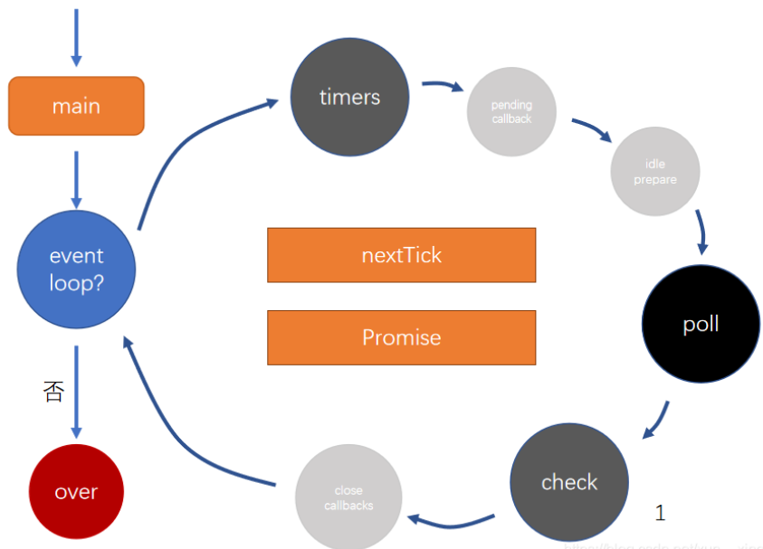
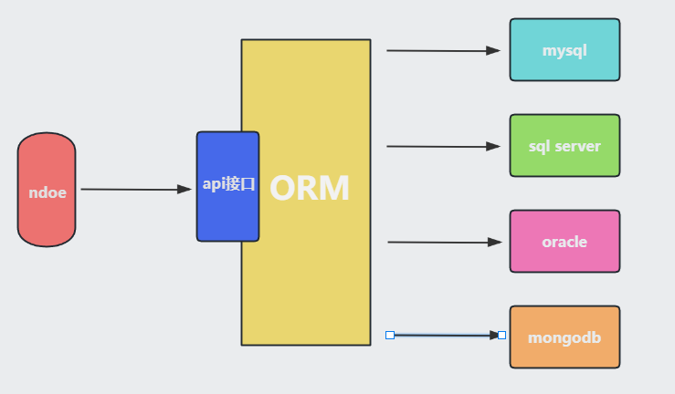
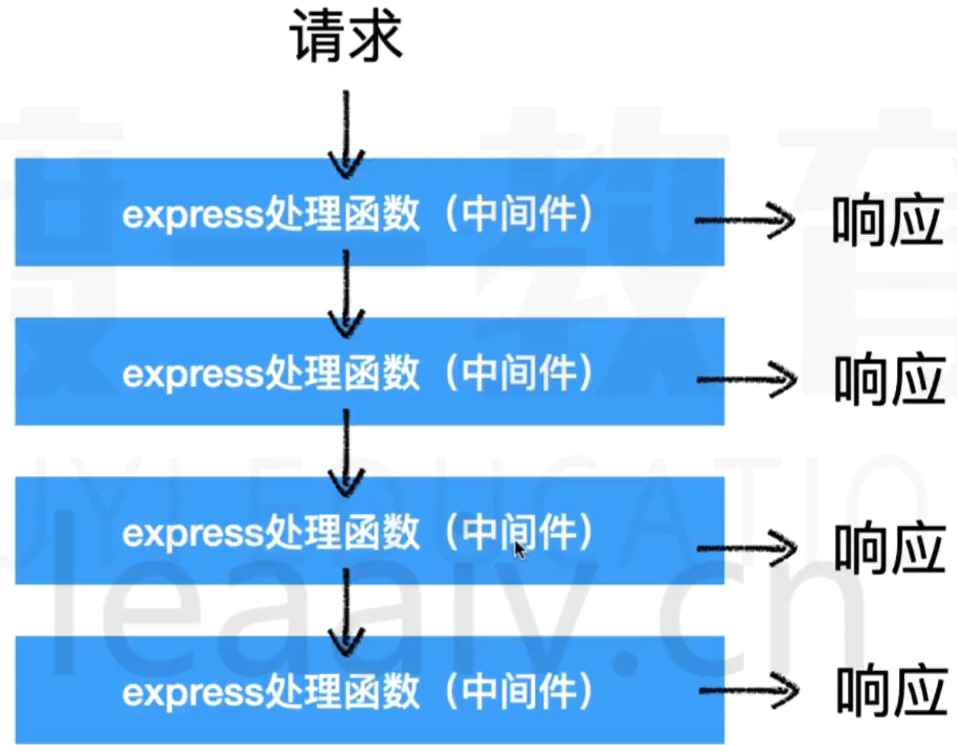
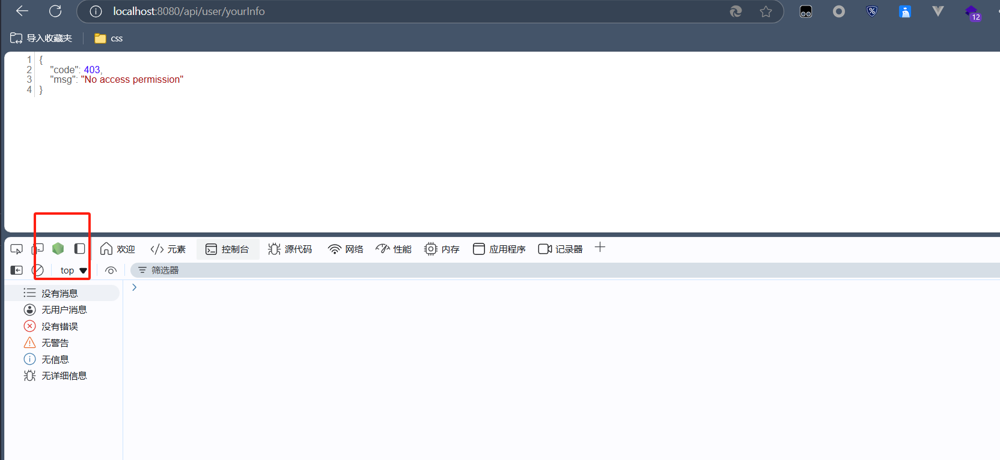
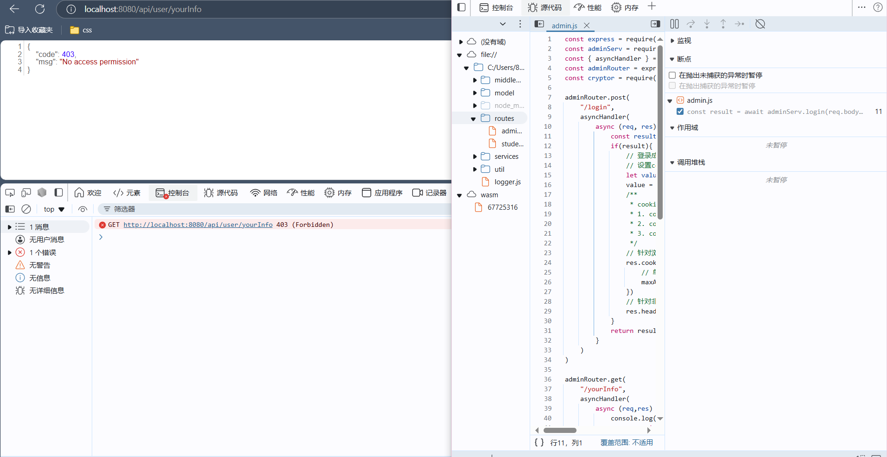
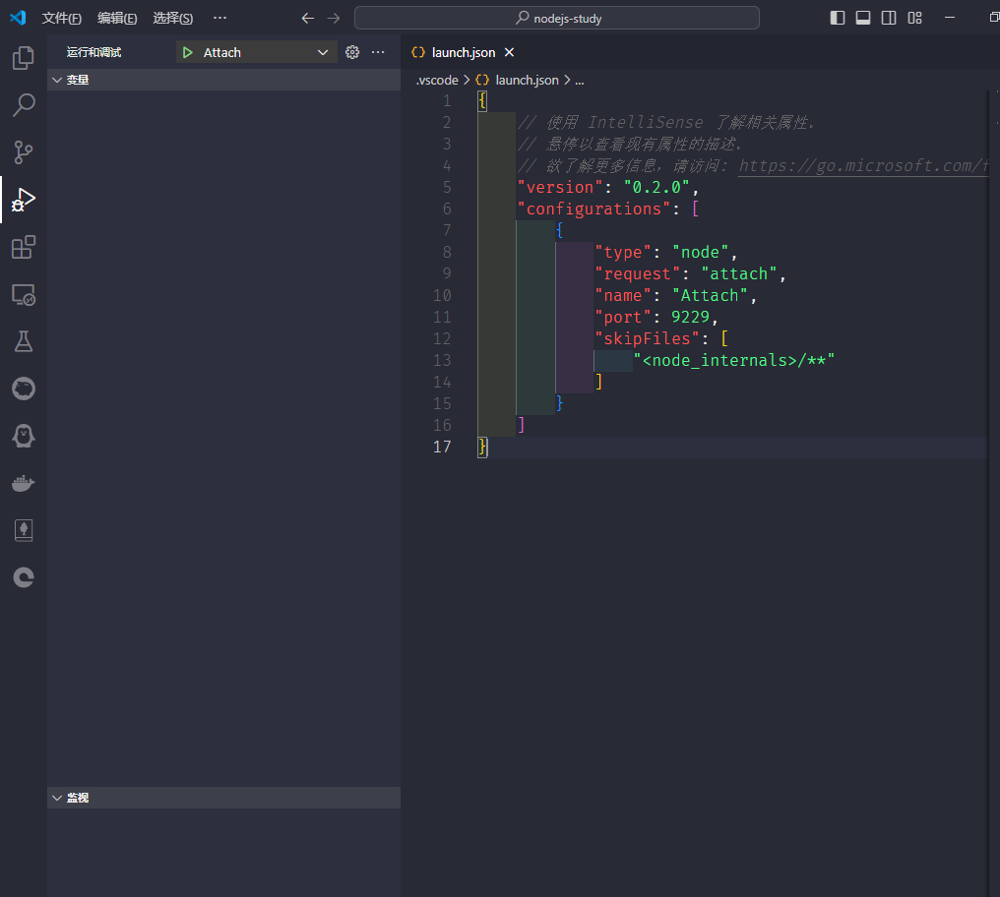
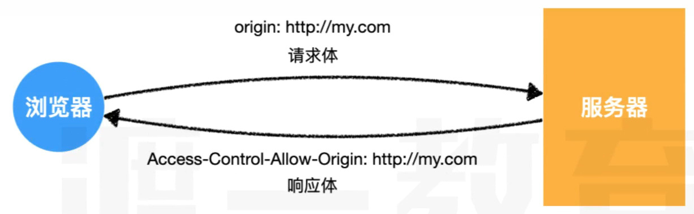
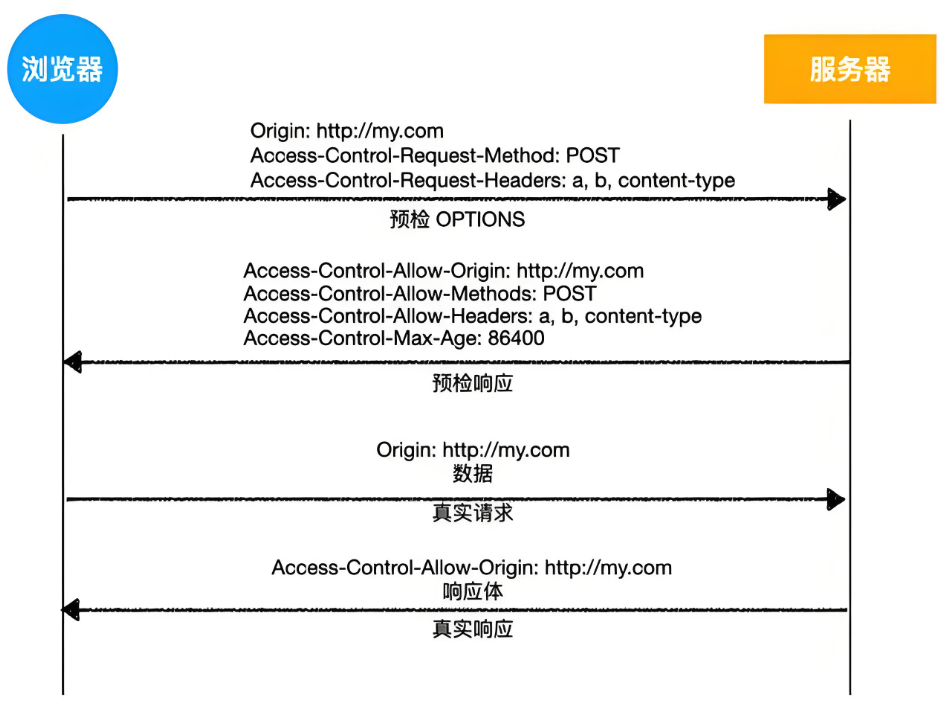
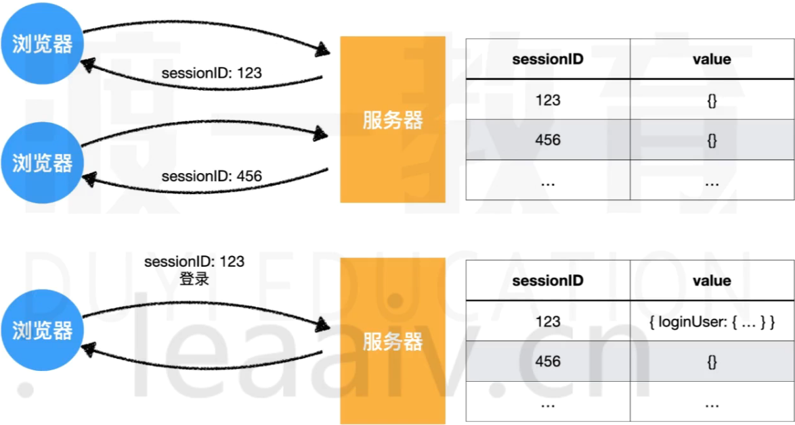
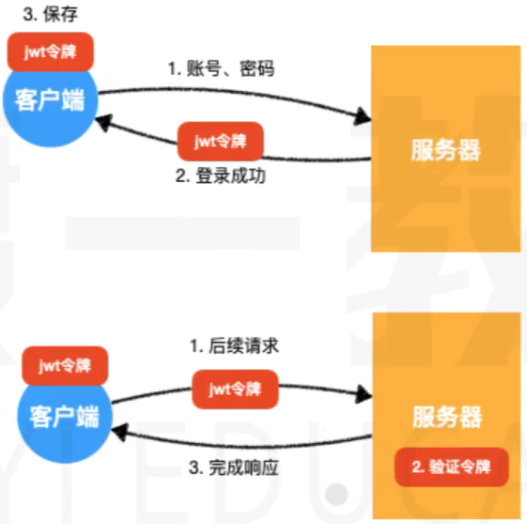

## node的版本控制器

> nvm

```shell
# 安装
nvm install
# 卸载
nvm uninstall
# 查看当前安装的列表
nvm list
# 切换版本
nvm use
```

## 代码提示安装的包

> 让代码提示更全

```shell
npm i -D @types/node
```

## node核心

### node概述

#### 什么是node

- node是一个js的运行环境
- [node官网](https://nodejs.org/zh-cn)
- 它比浏览器拥有更多能力

浏览器中的js
- es标准 + web-api
    
- web api提供了操作浏览器窗口和页面的能力
    - BOM
    - DOM
    - AJAX(fetch)
- 这种能力是非常有限的
    - 跨域问题(同源策略，让其他网站不能随便获取本站数据)
    - 文件读取

Node中的JS
- es标准 + NodeApi
    
- NodeApi几乎提供所有能做的事

分层结构图


- 因为浏览器提供的有限能力，JS只能使用浏览器提供的功能作用有限的操作。
- 而Node提供了完整的控制计算机的能力，NodeJS几乎可以通过Node提供的接口，实现对整个操作系统的控制

- 优势在于NodeJS是单线程异步回调，因此IO操作快，没有切换线程的消耗(NodeJS也支持多线程，支持CPU的多核)。
- 缺点在于运算太慢了

#### Node能干什么

学习目的：
- 开发桌面应用程序(例如vscode)
- 开发服务器应用程序(两种结构)
    - 结构1(更多是这样的)，这种结构一般做转发功能，同时数据库中记录一些简单信息(请求日志，用户偏好，广告信息)，静态资源，缓存
    
    - 结构2
     

### node全局对象

#### setTimeout

```js
const timer = setTimeout(() => {},1000);
console.log(timer);
```

在浏览器中setTimeout返回的是一个数字

在nodejs中返回的是一个对象


#### setInterval
> 用法和浏览器中的是一样的

#### setImmediate
```js
// setImmediate 类似于 setTimeou 0
const timer = setTimeout(() => {},0);
```
#### console

> 用于控制台输出


#### __dirname
> 获取当前模块所在的目录(绝对路径)
> 并不是global属性

#### __filename
> 获取当前模块的文件路径(绝对路径)
> 并非global属性

#### Buffer
> 类型化数组
> 继承自UInt8Array
> 计算机中存储的基本单位为字节
> 使用时、输出时可能需要用十六进制表示

#### process

- cwd()
    - 返回当前nodejs进程的工作目录
    - 绝对路径
- exit()
    - 强制退出当前node进程
    - 可传入退出码，0表示成功退出，默认是0
- argv
    - String[]
    - 获取命令中的所有参数
    - 可以传入不同的参数
- platform
    - 获取当前代码运行的操作系统
- kill(pid)
    - 根据ID杀死进程
- env
    - 获取操作系统的环境变量的


### node的模块化

#### 模块的查找

- 所有的模块查找路径最后都会转为绝对路径
- 对于非当前模块自定义的相对路径寻找模块顺序如下：
    - 检查是否是内置模块，如：fs,path等
    - 检查当前目录中的node_modules
    - 检查上级目录中的node_modules
    - 转换成绝对路径
    - 加载模块
- 关于后缀名，如果不提供后缀名，自动补全，顺序是(js>json>node>mjs)
- 关于文件名，如果仅提供目录，不提供文件名，则自动寻找该目录的index.js、package.json中的main字段。
    - package.json的main是指包的默认入口，导入或执行包时若仅提供目录，则使用main补全入口默认时index.js(**容易面试题**)

```js
// 绝对路径导入
require("D:\\gitee\\0-web-study-list\\nodejs-study\\a.js")

// 相对路径导入
// 相对当前模块
require("./a.js")
require("../a/a.js")

// 非自己定义的模块
require("fs")


// 示例
require("./src")
// 寻找顺序
// ./src => ./src.js => ./src.json => ./src.node => ./src.mjs => ./src/index.js
```

#### module对象
> 记录了当前模块的信息

```js
{
  // 模块的绝对路径，如果是入口模块就是. 如果不是就是绝对路径
  id: '.',
  // 模块的目录
  path: 'C:\\Users\\86181\\Desktop\\gitee\\0-web-study-list\\nodejs-study',
  // 用来导出的       
  exports: {},
  // 模块所在的文件
  filename: 'C:\\Users\\86181\\Desktop\\gitee\\0-web-study-list\\nodejs-study\\index.js',
  // 这个模块是否加载完了
  loaded: false,
  // 子模块
  children: [],
  // 查找路径
  paths: [
    'C:\\Users\\86181\\Desktop\\gitee\\0-web-study-list\\nodejs-study\\node_modules',
    'C:\\Users\\86181\\Desktop\\gitee\\0-web-study-list\\node_modules',
    'C:\\Users\\86181\\Desktop\\gitee\\node_modules',
    'C:\\Users\\86181\\Desktop\\node_modules',
    'C:\\Users\\86181\\node_modules',
    'C:\\Users\\node_modules',
    'C:\\node_modules'
  ]
  // 其实还有一个参数是parent，但是由于入口模块没有父模块(parent其实就是哪个模块使用的它)
}
```

#### require函数


```js
[Function: require] {
  // 把路径的写法转换成绝对路径  
  resolve: [Function: resolve] { paths: [Function: paths] },
  // 入口模块(主模块)
  main: {
    id: '.',
    path: 'C:\\Users\\86181\\Desktop\\gitee\\0-web-study-list\\nodejs-study',     
    exports: {},
    filename: 'C:\\Users\\86181\\Desktop\\gitee\\0-web-study-list\\nodejs-study\\index.js',
    loaded: false,
    children: [],
    paths: [
      'C:\\Users\\86181\\Desktop\\gitee\\0-web-study-list\\nodejs-study\\node_modules',
      'C:\\Users\\86181\\Desktop\\gitee\\0-web-study-list\\node_modules',
      'C:\\Users\\86181\\Desktop\\gitee\\node_modules',
      'C:\\Users\\86181\\Desktop\\node_modules',
      'C:\\Users\\86181\\node_modules',
      'C:\\Users\\node_modules',
      'C:\\node_modules'
    ]
  },
  // 拓展名的处理方式
  extensions: [Object: null prototype] {
    '.js': [Function (anonymous)],
    '.json': [Function (anonymous)],
    '.node': [Function (anonymous)]
  },
  // 缓存的模块
  cache: [Object: null prototype] {
    'C:\\Users\\86181\\Desktop\\gitee\\0-web-study-list\\nodejs-study\\index.js': 
{
      id: '.',
      path: 'C:\\Users\\86181\\Desktop\\gitee\\0-web-study-list\\nodejs-study',   
      exports: {},
      filename: 'C:\\Users\\86181\\Desktop\\gitee\\0-web-study-list\\nodejs-study\\index.js',
      loaded: false,
      children: [],
      paths: [Array]
    }
  }
}
```


#### require为什么能导入(面试题)

> 当执行一个模块或使用require时，会将模块放置在一个函数环境中

- 案例

    下面是一个外部模块`myModule`,导入以后的结果是什么
    ```js
    console.log("当前模块路径", __dirname)
    console.log("当前模块文件", __filename)
    exports.c = 3
    module.exports = {
        a: 1,
        b: 2
    }
    this.m = 5
    ```
    ```js
    console.log(require("./myModule")) // 答案是：{a:1,b:2}
    ```


- 原理

    require函数的伪代码
    ```js
    function require(modulePath){
        // 1. 将modulePath转换成绝对路径(D:\xx\xx\xx.js)
        require.reslove(modulePath)
        // 2. 判断是否该模块已有缓存
        if(require.cache["D:\\xx\\xx\\xx.js"]){
            return result
        }
        // 3. 读取文件内容
        // 4. 包裹到一个函数中
        function __temp(module,exports,require,__dirname,__filename){
            console.log("当前模块路径", __dirname)
            console.log("当前模块文件", __filename)
            exports.c = 3
            module.exports = {
                a: 1,
                b: 2
            }
            this.m = 5
        }

        // 5. 创建module对象
        module.exports = {}
        const exports = module.exports
        // 这样劫持函数以后module.exports,module,this三者相等
        __temp.call(module.exports,module,exports,require,module.path,module.filename)

        return module.exports   
    }
    ```

### Node中的ES模块化

> 模块要么是commonjs，要么是ES(不能混合使用)

- commonjs
    - 默认情况下，都是commonjs

- ES
    - 文件后缀名位.mjs(某个模块用es)
    - 最近的package.json中type的值是module(整个工程都得用es)


在node老版本,当使用ES模块化运行时，必须添加--experimental-modules

```json
"scripts": {
    "test": "echo \"Error: no test specified\" && exit 1"
    "start":"node --experimental-modules index.mjs"
},
```

es的动态异步加载
```js
import("./a.mjs").then(r => console.log(object))
```

### Node基本内置模块

#### os

> [os的文档](https://nodejs.org/docs/latest/api/os.html)

##### os.EOL

> 一个字符串的值

linux换行符： `\n`
windwos换行符： `\r\n`
可以统一用`os.EOL`常量

```js
const os = require("os")
console.log("你好"+os.EOL+"同学")
```
##### os.arch()

> 返回值时当前系统cpu的架构名`x32`,`x64`,`ppc`,`ppc64`,`s390`,`s390x`

```js
console.log(os.arch())
```
##### os.cpus()🚩

重要性应用：更具不同的cpu内核开启多线程

> 获取cpu每一个核的信息，返回一个数组，数组里面时每个核的参数对象


```js
console.log(os.cpus())

// 返回的值，每个核的参数对象的例子
{
    model: 'AMD Ryzen 9 5900HX with Radeon Graphics        ',
    speed: 3294,
    times: {
        user: 3937703,
        nice: 0,
        sys: 2098718,
        idle: 38430781,
        irq: 29687
    }
}
```

##### os.freemem()

> 获得当前内存还剩下多少，返回值是整数表示字节

```js
console.log(os.freemem())  // 字节
console.log(os.freemem()/1024)  // KB
console.log(os.freemem()/1024**2)  // MB
console.log(os.freemem()/2**30)  //GB
```

##### os.homedir()

> 获取当前电脑的用户文件夹目录的路径,返回类型位字符串

```js
console.log(os.homedir())
```
##### os.hostname()
> 获取计算机名,返回类型位字符串

```js
console.log(os.hostname())
```

##### tmpdir()🚩

重要性应用：动态获取临时目录

> 获取操作系统的临时目录,返回类型位字符串

```js
console.log(os.tmpdir())
```

#### path

> [path的文档](https://nodejs.org/docs/latest/api/path.html)

##### path.basename()🚩

- 参数
    - path `<string>` 文件路径
    - ext `<string>` 可选参数，文件拓展名
- 返回值
    - `<string>` 文件的全名

> 给出文件路径，获取文件的全名


```js
path.basename('/foo/foo/foo/foo.html')
// Return: 'foo.html'

path.basename('/foo/foo/foo/foo.html','.html')
// Return: 'foo'
```

##### path.delimiter

> 一个常量，表示该系统的分隔符

windwos: `;`
macOS: `:`

##### path.sep

> 一个常量,表示该系统的分割符的

windwos: `\`
macOS: `/`


##### path.dirname()🚩

- 参数
    - path `<string>` 文件路径
- 返回值
    - `<string>` 文件所在的目录

```js
path.dirname("/foo/foo/foo")
// Returns： "/foo/foo"
```
##### path.extname()

- 参数
    - path `<string>` 文件路径
- 返回值
    - `<string>` 文件的后缀名

```js
path.dirname("/foo/foo/foo.js")
// Returns： "。js"

path.dirname("/foo/foo/foo")
// Returns： " "
```

##### path.join()🚩
- 参数
    - `<string>` 文件目录名和文件名
- 返回值
    - `<string>` 文件的完整路径

> 给对应的目录名，返回一个完整的文件路径

```js
path.join("a","b","c","d.js")
// Returns： "a/b/c/d.js"
// Returns： "a\\b\\c\\d.js"

path.join("a","b","../","d.js")
// Returns： "a/d.js"
// Returns： "a\\d.js"
```

##### path.normalize()

- 参数
    - path  `<string>` 完整的路径

> 给一个完整的路径，返回规范化的路径

```js
path.normalize('/foo/foo1/foo2/..')
// Returns: "/foo/foo1"
// Returns: "\\foo\\foo1"
```

##### path.relative()

- 参数
    - from `<string>` 参照路径
    - to `<string>` 目标路径

- 返回值
    - `<string>` 相对路径

> 给出一个参照路径和一个目标路径，返回目标路径相对于参照路径的相对路径

```js
path.relative("/data/foo/test/aaa","/data/foo/demo/bbb")

// Return: "../../demo/bbb"
// Return: "..\\..\\demo\\bbb"
```

##### path.resolve()🚩

- 参数
    - from `<string>` 参照路径
    - to `<string>` 目标路径

- 返回值
    - `<string>` 绝对路径

> 给出一个文件，获取它相对于当前命令行的绝对路径，如果指定了参照路径就返回相对于参照路径的绝对路径

```js
path.resolve("./a.js")
// Return /0-web-study-list/nodejs-study/a.js
// Return C:\\Users\\86181\\Desktop\\0-web-study-list\\nodejs-study\\a.js

path.resolve(__dirname,"./a.js")
// 返回的就是相对于项目目录的文件的绝对路径
```

#### url

> [url的文档](https://nodejs.org/docs/latest/api/url.html)

```js
const URL = require("url")
const url = new URL.URL("http://www.xxx.com:3306/a/b/c?t=3&u=4#abc")
// 或者 parse就是帮助调用构造函数
const url = URL.parse("http://www.xxx.com:3306/a/b/c?t=3&u=4#abc")
console.log(url)

// URL {
//   href: 'http://www.xxx.com:3306/a/b/c?t=3&u=4#abc',
//   origin: 'http://www.xxx.com:3306',
//   protocol: 'http:',
//   username: '',
//   password: '',
//   host: 'www.xxx.com:3306',
//   hostname: 'www.xxx.com',
//   port: '3306',
//   pathname: '/a/b/c',
//   search: '?t=3&u=4',
//   searchParams: URLSearchParams { 't' => '3', 'u' => '4' },
//   hash: '#abc'
// }

console.log(url.searchParams.has("a"))   // false
console.log(url.searchParams.has("t"))   // true
console.log(url.searchParams.get("t"))   // 3


const obj = {
  href: 'http://www.xxx.com:3306/a/b/c?t=3&u=4#abc',
  origin: 'http://www.xxx.com:3306',
  protocol: 'http:',
  username: '',
  password: '',
  host: 'www.xxx.com:3306',
  hostname: 'www.xxx.com',
  port: '3306',
  pathname: '/a/b/c',
  search: '?t=3&u=4',
  hash: '#abc'
}

const url = URL.format(obj)
console.log(url)  // http://www.xxx.com:3306/a/b/c?t=3&u=4#abc
```


#### util

> [util的文档](https://nodejs.org/docs/latest/api/util.html)

##### callbackify

- 参数
    - original `<Function>` 一个async函数
- 返回值
    - `<Function>` 一个回调函数

> 将一个异步函数转换为一个回调函数处理

```js
const util = require("util")

async function delay(duration = 1000) {
    return new Promise(resolve => {
        setTimeout(() => {
            resolve(duration)
        }, duration)
    })
}

delay(500).then(d=>{
    console.log(d)
})

const delayCallback = util.callbackify(delay)

delayCallback(500,(err,d)=>{
    console.log(d)
})
```

##### inherits
- 参数
    - 子类
    - 父类

> 第一个参数为子类，第二个为父类，子类继承父类

##### isDeepStrictEqual🚩

- 参数
    - `<obj>` 对象1
    - `<obj>` 对象2

> 将两个对象继续深度严格比较

```js
const util = require("util")

const obj1 = {
    a:1,
    b:{
        c:3,
        d:{
            e:4
        }
    }
}

const obj2 = {
    a:1,
    b:{
        c:3,
        d:{
            3:5
        }
    }
}


console.log(util.isDeepStrictEqual(obj1,obj2)) // false
```

##### promisify🚩

- 参数
    - original `<Function>` 一个回调函数
- 返回值
    - `<Function>` 一个async函数

> 将一个回调函数转换成异步函数处理

```js
const util = require("util")

function delayCallBack(duration,callback){
    setTimeout(()=>{
        callback(null,duration)
    },duration)
}

const delay = util.promisify(delayCallBack)

delay(500).then(d => console.log(d))
```


### 文件I/O

> IO的速度往往低于内存和CPU的交互速度

> [fs模块的文档](https://nodejs.org/docs/latest/api/fs.html)

#### 读取文件

##### fs.readFile()

- 参数
    - path `<string>` 目标文件的路径
    - options `<obj>` 可选项配置
        - encoding `<string>` 编码类型
        - flag `<string>` 文件模式，默认值为 'r'
        - signal `<AbortSignal>` 允许中止正在进行的读取文件
    - callback `<Function>` 回调函数


```js
const fs = require("fs")
const path = require("path")

// 获取文件的绝对路径
const filename =  path.resolve(__dirname,"./myfiles/1.txt")

fs.readFile(filename,(err,content) => {
    console.log(content)
    console.log(content.toString("utf-8"))
})
// 不传入编码就是Buffer,传入就是按照编码解析
fs.readFile(filename,"utf-8",(err,content) => {
    console.log(content)
    console.log(content.toString("utf-8"))
})


// readFile的同步方法
// Sync函数是同步的，会阻塞JS的运行，极其影响性能
// 通常，在程序启动时运行有限次数即可
const content = fs.readFileSync(filename,"utf-8")
console.log(content)
```

##### fs.promise.readFile()
- 参数
    - path `<string>` 目标文件的路径
    - options `<obj>` 可选项配置
        - encoding `<string>` 编码类型
        - flag `<string>` 文件模式，默认值为 'r'
        - signal `<AbortSignal>` 允许中止正在进行的读取文件
- 返回值
    - Promise `<Promise>` 错误和读取的内容


```js
const fs = require("fs")
const path = require("path")
// 获取文件的绝对路径
const filename =  path.resolve(__dirname,"./myfiles/1.txt")
async function test(){
    const content = await fs.promises.readFile(filename,{encoding:"utf-8",flag:"r"})
    console.log(content)
}
```

#### 写入文件

##### fs.writeFile()

- 参数
    - path `<string>` 目标文件的路径
    - data `<string> | <Buffer> | <stream> 等` 要写的内容
    - options `<obj>` 可选项配置
        - encoding `<string>` 编码类型
        - mode `<integer>` 默认值 `0o666` 设置权限
        - flag `<string>` 文件模式，默认值为 'w'
        - flush `<boolean>` 
        - signal `<AbortSignal>` 允许中止正在进行的读取文件
    - callback `<Function>` 回调函数

```js
const fs = require("fs")
const path = require("path")
// 获取文件的绝对路径
const filename =  path.resolve(__dirname,"./myfiles/1.txt")

// 如果这里的路径的文件不存在会自动创建，但是目录不存在就会报错
fs.writeFile(filename,"mzmm",(err)=>{
    if(!err){
        console.log("写入成功")
    }else{
        console.log("写入失败")
    }
})


// writeFile的同步模式
fs.writeFileSync(filename,"mzmm")
```

##### fs.promise.writeFile()

- 参数
    - path `<string>` 目标文件的路径
    - data `<string> | <Buffer> | <stream> 等` 要写的内容
    - options `<obj>` 可选项配置
        - encoding `<string>` 编码类型
        - mode `<integer>` 默认值 `0o666`
        - flag `<string>` 文件模式，默认值为 'w'
        - flush `<boolean>` 
        - signal `<AbortSignal>` 允许中止正在进行的读取文件
- 返回值
    - Promise `<Promise>` 成功后履行

```js
const fs = require("fs")
const path = require("path")
// 获取文件的绝对路径
const filename =  path.resolve(__dirname,"./myfiles/1.txt")

async function test() {
    const buffer = Buffer.from("mzmm403","utf-8")
    // flag:"a" 追加写入模式
    // 如果这里的路径的文件不存在会自动创建，但是目录不存在就会报错
    await fs.promises.writeFile(filename,buffer,{encoding:"utf-8",flag:"a"}) 
    console.log("写入成功")
}
```

#### 文件复制demo
```js
const fs = require("fs")
const path = require("path")

async function test() {
    const filename =  path.resolve(__dirname,"./myfiles/1.jpg")
    const content = await fs.promises.readFile(filename)
    const filename1 =  path.resolve(__dirname,"./myfiles/1.copy.jpg")
    await fs.promises.writeFile(filename1,content) 
    console.log("写入成功")
}
test()
```

#### 获取文件或目录的信息

> 返回的是文件的状态

```js
Stats {
  dev: 12148368,
  mode: 33206,
  nlink: 1,
  uid: 0,
  gid: 0,
  rdev: 0,
  blksize: 4096,
  ino: 75153818782251150,     
  size: 8530,
  blocks: 24,
  atimeMs: 1727930690274.6682,
  mtimeMs: 1727930326547.8286,
  ctimeMs: 1727930335346.66,  
  birthtimeMs: 1727930326080.8604,
  atime: 2024-10-03T04:44:50.275Z,
  mtime: 2024-10-03T04:38:46.548Z,
  ctime: 2024-10-03T04:38:55.347Z,
  birthtime: 2024-10-03T04:38:46.081Z
}
```

- size：占用字节
- atime：上次访问事件
- mtime：上次文件内容被修改时间
- ctime：上次文件状态被修改时间(比如访问权限)
- birthime：文件创建时间
- isDirectory()：判断是否是目录
- isFile()：判断是否是文件


##### fs.stat()

- 参数
    - path `<string> | <Buffer> | <URL>` 文件路径
    - options
        - bigint `<boolean>` 默认为false
    - callback
        - err `<Error>`
        - stats `<fs.Stats>`


```js
const fs = require("fs")
const path = require("path")

const filename =  path.resolve(__dirname,"./myfiles/1.jpg")

fs.stat(filename,(err,stats)=>{
    console.log(stats)
})


// 同步函数
const stats = fs.statSync(filename)
console.log(stats)
```


##### fs.promise.stat()
- 参数
    - path `<string> | <Buffer> | <URL>` 文件路径
    - options
        - bigint `<boolean>` 默认为false
- 返回
    - Promise `<Promise>` 成功后履行

```js
const fs = require("fs")
const path = require("path")

const filename =  path.resolve(__dirname,"./myfiles/1.jpg")

async function test() {
    const stat = await fs.promises.stat(filename)
    console.log(stat)
}
test()
```


#### 声明

> 剩下的一些api都统一采用promise的形式记录，基本上都是回调，promise，同步这三个函数


#### fs.promise.readdir()

> 获取目录中的文件和子目录

- 参数
    - path `<string> | <Buffer> | <URL>` 文件路径
    - options
        - encoding `<string>` 默认是utf-8
        - 使用文件类型 `<boolean>` 默认是false
        - 递归 `<boolean>` 如果，则以迭代方式读取目录的内容。在循环模式下，它将列出所有文件、子文件和目录，默认false
- 返回
    - Promise `<Promise>` 成功后履行


```js
const fs = require("fs")
const path = require("path")

const filename =  path.resolve(__dirname,"./myfiles/")

async function test() {
    // 可以通过开启递归的方式深度获取
    const pathes = await fs.promises.readdir(filename,{recursive:"true"})
    console.log(pathes)
    //[ '1.jpg', '1.txt', '2.jpg', 'sub', 'sub\\foo.txt' ]
}
test()
```

#### fs.promise.mkdir()

> 创建目录

- 参数
    - path `<string> | <Buffer> | <URL>` 文件路径
    - options
        - 递归 `<boolean>` 如果，则以迭代方式读取目录的内容。在循环模式下，它将列出所有文件、子文件和目录，默认false
        - mode `<string | <integer>` windwos不支持
- 返回
    - Promise `<Promise>` 成功后履行

```js
const fs = require("fs")
const path = require("path")

const filename =  path.resolve(__dirname,"./myfiles/test1/test2/test3")

async function test() {
    await fs.promises.mkdir(filename,{recursive:true})
    console.log("创建成功")
}
test()
```


#### fs.exists()

> 废弃，官方建议用fs.stat代替
> 判断文件或者目录是否存在
> 下面自己封装一个


```js
async function exists(filename) {
    try{
        await fs.promises.stat(filename)
        return true
    } catch (err) {
        if(err.code === "ENOENT"){
            // 文件不存在
            return false
        }
        throw err
    }
}

async function test() {
    const res = await exists(filename)
    if(res){
        console.log("目录存在,可以后续操作")
        // 后续的一些I/O
    }else{
        await fs.promise.mkdir(filename)
        console.log("目录自动创建,继续后续操作")
        // 后续的一些I/O
    }
}
test()
```

#### fs.promise.unlink

- 参数
    - path `<string> | <Buffer> | <URL>` 文件路径
- 返回值
    - Promise `<Promise>` 成功后履行

```js
const fs = require("fs")
const path = require("path")

const filename =  path.resolve(__dirname,"./myfiles/test1/test2/test3")

async function test(){
    await fs.promise.unlink(filename)
    console.log("删除成功")
}
```

#### 文件流

##### 文件流的相关概念

> [文件流的文档](https://nodejs.org/docs/latest/api/stream.html)

> 文件流就是数据从一个地方流向另一个地方，一般是数据流向内存，cpu操作数据，操作后的数据从内存流出

流是有方向的，在js中流分为如下几类：
- 可读流(Readable)：数据从源头流向内存
- 可写流(Writable)：数据从内存流向源头
- 双工流(Duplex)：数据即可从源头流向内存又可从内存流向源头


**为什么需要流？**
- reason
    1. 其他介质和内存的数据规模不一致(其实就是空间大小不一致)
        
    2. 其他介质俄内存的数据处理能力不一致
        


**什么是文件流？**

> 文件流指的就是内存数据和磁盘文件数据之间的流动


##### fs.createReadStream()

- 参数
    - path `<string> | <Buffer> | <URL>` 文件路径
    - options 
        - flags `<string>` 文件模式,默认是`r`
        - encoding `<string>` 编码方式，默认是null
        - fd `<integer> | <FileHandle>` 默认是null
        - mode `<integer>` 文件权限，默认是0o666
        - autoClose `<boolean>` 读完后自动关闭，默认是true
        - emitClose `<boolean>` 默认是true
        - start `<integer>` 起始字节
        - end `<integer>` 结束字节，  默认是Infinity
        - highWaterMark `<integer>` 每次读取的数量，默认是 64 * 1024，这个数值受编码的影响
        - fs `<Object> | <null>` 默认是null
        - signal `<AbortSignal> | <null>` 默认是null
- 返回值 
    - 返回文件可读流(ReadStream)


> 含义： 创建一个文件可读流，用于读取文件内容


```js
const fs = require("fs")
const path = require("path")

const filename =  path.resolve(__dirname,"./myfiles/1.txt")

const rs = fs.createReadStream(filename,{
    encoding: "utf-8",
    highWaterMark: 5
})
```

##### 可读流的相关操作
**ReadStream.on(事件名,处理函数)**

> 对于ReadStream有事件如下所示

- open 文件打开事件，文件被打开后除法

- error 出现错误以后触发

- close 文件被关闭触发，可以通过ReadStream.close()手动关闭或者文件读取完自动关闭

- data  读取到一部分数据后触发，注册data事件后才真正开始读取，每次读取highWaterMark指定的数量，回调函数中会附带读取到的数据

- end 全部数据读取完毕会触发


**ReadStream.pause()和resume()**

ReadStream.pause()是暂停读取的函数

- ReadStream.on("pause",()=>{})会在暂停读取后触发

ReadStream.resume()是恢复读取的函数

- ReadStream.on("resume",()=>{})会在暂停读取后触发

```js
rs.on("open",() => {
    console.log("文件被打开了")
})

rs.on("error",()=>{
    console.log("出错了")
})

rs.on("close",()=>{
    console.log("文件关闭了")
})

rs.on("data",chunk => {
    console.log("读取到一部分数据:",chunk)
    // 暂停读取
    rs.pause()
})

rs.on("pause",()=>{
    console.log("暂停了")
    setTimeout(() => {
        // 恢复读取
        rs.resume()
    },1000)
})

rs.on("resume",() => {
    console.log("恢复读取")
})

rs.on("end",() => {
    // 这个在close之前
    console.log("全部数据读取完毕")
})

// 手动关闭文件流
rs.close()
```

##### fs.createWriteStream()

- 参数
    - path `<string> | <Buffer> | <URL>` 文件路径
    - options 
        - flags `<string>` 文件模式,默认是`w`
        - encoding `<string>` 编码方式，默认是utf8
        - fd `<integer> | <FileHandle>` 默认是null
        - mode `<integer>` 文件权限，默认是0o666
        - autoClose `<boolean>` 写完后自动关闭，默认是true
        - emitClose `<boolean>` 默认是true
        - start `<integer>` 起始字节
        - highWaterMark `<integer>` 每次写入的数量，默认是 16384，这里和读取不同是准确的字节数
        - fs `<Object> | <null>` 默认是null
        - signal `<AbortSignal> | <null>` 默认是null
        - flush `<boolean>` 如果为真，则在关闭基础文件描述符之前刷新它,默认值是false
- 返回值 
    - 返回文件可写流(WriteStream)

```js
const fs = require("fs")
const path = require("path")

const filename =  path.resolve(__dirname,"./myfiles/1.txt")

// 创建写入流

const ws = fs.createWriteStream(filename,{
    flags: "a" // 追加写入
    encoding: "utf-8",
    highWaterMark: 3
})
```

##### 可写流的相关操作

**WriteStream.on(事件名,处理函数)**

- open  打开文件的时候触发
- error 报错的时候触发
- close 关闭文件的时候触发

**WriteStream.write(data)**

- 写入一组数据，data可以是字符串或者Buffer
- 返回一个boolean值
    - true：写入通道没有被填满，接下来的数据可以直接写入，无需排队
        
    - false：写入通道目前已被填满，接下来的数据将进入队列
        
        - 这里要注意背压问题，因为写入队列是内存中的数据，是有限的
        - 背压问题的解决方式：
            ```js
            const fs = require("fs")
            const path = require("path")

            const filename =  path.resolve(__dirname,"./myfiles/1.txt")

            // 创建写入流

            const ws = fs.createWriteStream(filename,{
                encoding: "utf-8",
                highWaterMark: 16*1024
            })


            let i = 0
            // 一致写，知道大奥上限，或无法再直接写入
            function write(){
                let flag = true
                while(i<1024*1024*10 && flag){
                    flag = ws.write("a")  // 写入a，得到下一次还能不能直接写
                    i++
                }
            }

            write()

            // 等队列清空继续调用write去写入
            ws.on("drain",()=>{
                write()
            })
            ```
- 当写入队列清空时，会触发drain事件

**WriteStream.end([data])**

- 结束写入，将自动关闭文件
    - 自动关闭取决于autoClose配置，默认为true
- data是可选的，表示关闭前的最后一次写入


##### ReadStream.pipe(WriteStream)(文件流demo)

> 复制文件

```js
const fs = require("fs")
const path = require("path")

// 方式1：把文件所有内存都放入到内存队列，内存占用高
async function method1() {
    const from = path.resolve(__dirname,"./myfiles/1.txt")
    const to = path.resolve(__dirname,"./myfiles/2.txt")
    console.time("方式1")
    const content = await fs.promises.readFile(from)
    await fs.promises.writeFile(to,content)
    console.timeEnd("方式1")
    console.log("复制完成")
}

// 方式2  不仅时间少了很多，占用内存空间也少了很多

async function method2() {
    const from = path.resolve(__dirname,"./myfiles/1.txt")
    const to = path.resolve(__dirname,"./myfiles/3.txt")
    console.time("方式2")
    const rs = fs.createReadStream(from)
    const ws = fs.createWriteStream(to)
    rs.on("data", chunk=>{
        // 都一部分数据
        const flag = ws.write(chunk)
        if(!flag){
            // 表示下一次会造成背压
            rs.pause() // 暂停读取
        }
    })

    ws.on("drain",()=>{
        // 表示可以继续写了
        rs.resume()
    })

    rs.on("close",()=>{
        // 写完了
        ws.end() //关闭写入流
        console.timeEnd("方式2")
        console.log("复制完成")
    }) 
}

method1()
method2()
```


> 其实上面的方式2已经有封装好的函数了就是读取流的`ReadStream.pipe(WriteStream)`

- 将可读流和可写流连接
- 返回参数值
- 该方法可以解决背压问题

```js
const fs = require("fs")
const path = require("path")

async function method3() {
    const from = path.resolve(__dirname,"./myfiles/1.txt")
    const to = path.resolve(__dirname,"./myfiles/4.txt")
    console.time("方式3")
    const rs = fs.createReadStream(from)
    const ws = fs.createWriteStream(to)
    
    rs.pipe(ws)

    rs.on("close",()=>{
        console.timeEnd("方式3")
    })
}
```


### net模块

> (net模块文档)[https://nodejs.org/docs/latest/api/net.html]

#### http请求

- 普通模式

- 长连接模式


#### net模块的作用

- net是一个通信模块
- 可以使用其实现进程间的通信IPC
- 可以实现网络通信TCP/IP  🚩

#### 创建客户端

> 在nodejs中主动去发送请求

##### net.createConnection(options[,connectListener])

- 参数
    - options `<obj>`
        - host `<string>` 要连接到的主机
        - port `<number>` 端口号
        - 剩下的配置详见：[配置](https://nodejs.org/docs/latest/api/net.html#socketconnectoptions-connectlistener)
    - connectListener `<Function>` 
- 返回值
    - 返回socket

对于**socket**有如下解释
- socket是一个特殊的文件
- 在node中表现为一个双工流对象
- 通过写入内容发送数据
- 通过监听流的内容获取数据
- socket.on("end",()=>{}) 关闭socket流会触发


```js
const net = require("net")

// 创建客户端
const socket = net.createConnection(
    {
        host: "ke.qq.com",
        port: 80
    },
    () => {
        console.log("连接成功")
    }
)

socket.write(`你好！`)

socket.on("data",chunk => {
    console.log("来自服务器的消息",chunk.toString("utf-8"))
    // 客户端挂断TCP连接
    socket.end()
})
```


```js
socket.write(`GET / HTTP/1.1
Host: tabox.mzmm403.top/
Connection: keep-alive

`)

// 报文书写的方式
`请求行
请求头

请求体`
```

**socket.end()因为流的队列问题会造成通道的拥堵，导致一次只能传固定长度的数据，因此可以通过Content-Length可以去判断当前流传输是否完成，具体代码如下**

```js
const net = require("net")

// 创建客户端
const socket = net.createConnection(
    {
        host: "ke.qq.com",
        port: 80
    },
    () => {
        console.log("连接成功")
    }
)

//
var receive = null

// 获取http报文请求将其制作成一个对象
function parseResponse(response) {
    const index = response.indexOf("\r\n\r\n")
    const head = response.sunbstring(0,index)
    const body = response.substring(index + 2)
    const headParts = head.split("\r\n")
    const headerArray = headParts.slice(1).map(str => {
        return str.split(":").map(s => s.trim())
    })
    const header = headerArray.reduce((a,b) => {
        a[b[0]] = b[1]
        return a
    },{})

    return {
        header,
        body: body.trimStart()
    }
}

// 判断是否接收完成
function isOver(){
    // 需要接收的消息体的总字节数
    const contentLength =+ receive.header["Content-Length"]
    // 当前已经接收的总字节数
    const curReceivedLength = Buffer.from(receive.body,"utf-8").byteLength
    // 返回比较结果
    return curReceivedLength > contentLength
}

socket.on("data",chunk => {
    const response = chunk.toString("utf-8")
    if(!receive){
        // 第一次接收
        parseResponse(response)
        // 看当前是否已经传输完成
        if (isOver()){
            socket.end()
        }
        return
    }

    receive.body += response
    if(isOver()){
        socket.end()
        return
    }

})


socket.write(`GET / HTTP/1.1
Host: tabox.mzmm403.top/
Connection: keep-alive
    
`)
```

#### 创建服务端
##### net.createServer()

- 参数
    - options `<obj>`
        - 剩下的配置详见：[配置](https://nodejs.org/docs/latest/api/net.html#socketconnectoptions-connectlistener)
    - connnectListener `<Function>` 回调函数
- 返回值
    - 返回server对象

对于**server**对象有如下解释

- server.listen(port)
- server.on("listening",()=>{})
- server.on("connection",socket=>{})


*建议在IE浏览器中尝试下面这段代码*
```js
const net = require("net")
const fs = require("fs")
const path = require("path")

// 创建一个服务端
const server = net.createServer()

// 服务器监听9527端口
server.listen(9527)

// 服务器触发了监听以后就会触发事件
server.on("listening",() => {
    console.log("server listen 9527")
})

// 客户端和服务端建立连接了
// 当某个连接到来时，触发该事件，事件监听函数会获得一个socket对象
server.on("connection", socket => {
    console.log("有客户端连接到服务器")

    socket.on("data", async chunk => {
        const filename = path.resolve(__dirname,"./myfiles/eh.jpg")
        const bodyBuffer = await fs.promises.readFile(filename)
        const headBuffer = Buffer.from(`HTTP/1.1 200 OK
Content-Type: image/jpeg        
        
`,
            "utf-8"
        )
        const result = Buffer.concat([headBuffer,bodyBuffer])
        socket.write(result)
        socket.end()
    })

    socket.on("end",()=>{
        console.log("连接关闭")
    })
})
```


### http模块

> [http的文档](https://nodejs.org/docs/latest/api/http.html#httprequesturl-options-callback)

- http模块建立在net模块上
    - 无需手动管理socket
    - 无需手动组装消息格式

- `http.request(url[,options][,callback])`
    - nodejs作为客户端发送消息
- `http.createServer([options][,requestListener])`
    - 使用nodejs搭建服务器


#### http.request()

- 参数
    - url `<string>` | `<URL>`
    - options `<obj>`
        - method `<string>` 表示请求的方法
        - headers `<obj>` 包含请求标头的对象
        - timeout `<number>` 超时的事件
        - [剩余参数](https://nodejs.org/docs/latest/api/http.html#httprequesturl-options-callback)
    - callback `<function>`
- 返回值
    - `<http.ClientRequest>` 返回一个客户端的请求对象


> 这个方法的作用是创建一个客户端


```js
const http = require("http")

// 创建一个客户端请求对象
const request = http.request(
    // url必填参数
    "http://tabox.mzmm403.top/#/",
    // 配置信息
    {
        method: "GET"
    },
    // 请求发送以后返回的respons的报文信息
    respon => {
        console.log("服务器的响应状态码是：" + respon.statusCode)
        console.log("返回的响应报文的头",respon.headers)

        // 获取服务器返回的信息，因为不知道多大，所以是按照流的形式一块一块读出来
        let result = ""
        // 获取每一块返回的信息，进行拼接
        respon.on("data",chunk => {
            result += chunk.toString("utf-8")
        })

        // 读取返回的流结束以后输出拼接的结果
        respon.on("end",() => {
            console.log(result)
            console.log("结束")
        })
    }
)

// 在request请求的时候，如果是post这种请求是需要消息体的，
// 因此上面的请求构建完以后会阻塞等待消息体的补全，也就是向流中写入要传递的信息
request.write()

// 这个代表了发送消息，如果是post就在上一步写入消息，
// 如果没有就直接用end表示已经结束写入消息，发送出消息
request.end()
```


#### http.createServer()

- 参数
    - options `<obj>`
        - requestTimeout `<number>` 设置从客户端接收整个请求的超时值(以ms为单位)，默认值300000
        - keepAliveTimeout `<number>` 在完成一个写入后，在套接字销毁之前，服务器需要额外等待传入数据的不活动毫秒数，默认值为5000
        - [剩余参数](https://nodejs.org/docs/latest/api/http.html#httpcreateserveroptions-requestlistener)
- 返回值
    - `<http.Server>` 返回一个服务端对象

```js
const http = require("http")
const url = require("url")

const getReqInfo = (req) => {
    console.log("有请求来了")
    // 获取请求的路径
    console.log("请求的路径：" + url.parse(req.url))
    console.log("请求头：" + req.headers)
    console.log("请求方法：" + req.method)

    // 客户你请求的信息
    let body = ""
    req.on("data", chunk => {
        body += chunk.toString("utf-8")
    })

    req.on("end", () => {
        console.log("请求体", body)
    })
}

const server = http.createServer((req, res) => {
    getReqInfo(req)
    // 设置返回报文的请求投
    res.setHeader("a", "1")
    // 设置状态码
    res.stateCode = 404
    // 写入返回报文的信息
    res.write("你好!", "utf-8")
    // 结束信息的书写
    res.end()
})


server.listen(9527)


server.on("listening", () => {
    console.log("server listen 9527")
})
```


#### 静态资源服务器demo

```js
// 静态资源服务器

// http://localhost:9527/index.html -> pubilc/index.html 文件内容
// http://localhost:9527/index.css -> pubilc/index.css 文件内容


const http = require("http")
const url = require("url")
const path = require("path")
const fs = require("fs")


// 验证文件路径是否存在
async function getSata(filename) {
    try {
        return await fs.promises.stat(filename)
    } catch {
        return null
    }
}


// 根据url获取到文件信息
const getFileInfo = async (fileurl) => {
    const urlObj = url.parse(fileurl)
    let filepath = path.resolve(__dirname, "public", urlObj.pathname.substr(1))
    const stat = await getSata(filepath)
    if (!stat) {
        // 文件不存在的情况
        return null
    } else if (stat.isDirectory()) {
        // 文件是一个目录的情况
        filepath1 = path.resolve(__dirname, "public", urlObj.pathname.substr(1), "index.html")
        const adstat = await getSata(filepath1)
        if (!adstat) {
            // 文件不存在
            return null
        } else {
            // 文件存在
            return await fs.promises.readFile(filepath1)
        }
    } else {
        return await fs.promises.readFile(filepath)
    }
}

// 服务器的逻辑处理函数
const handler = async (req, res) => {
    const info = await getFileInfo(req.url)
    if (info) {
        res.write(info)
    } else {
        res.statusCode = 404
        res.write("访问资源不存在")
    }
    res.end()
}

// 创建服务器
const server = http.createServer((req, res) => {
    handler(req, res)
})

server.on("listening", () => {
    console.log("server listen 6000")
})

server.listen(6000)
```

### https模块

- 服务器结构


- 证书准备

```bash
# 生成CA私钥
# genrsa: 密钥对生成算法
# -des3 使用对称加密算法des3对私钥进一步加密
# -out ca-pri-key.pem: 将加密后的私钥保存到当前目录的ca-pri-key.pem文件中
# 1024: 私钥的字节数

openssl genrsa -des3 -out ca-pri-key.pem 1024


# 生成CA公钥
#通过私钥文件ca-pri-key.pem中的内容，生成对应的公钥，保存到ca-pub-key.pem中
#运行过程中要使用之前输入的密码来实现对私钥文件的解密
openssl req -new -key ca-pri-key.pem -out ca-pub-key.pem

# 生成ca根证书
# 使用x.509证书标准，通过证书请求文件ca-pub-key.pem生成证书，并使用私钥ca-pri-key.pem加密，然后把证书保存到ca-cert.crt文件中
openssl x509 -req -in ca-pub-key.pem -signkey ca-pri-key.pem -out ca-cert.crt


# 生成服务器私钥
openssl genrsa -out server-key.pem 1024
# 生成服务器公钥
openssl req -new -key server-key.pem -out server- scr.pem
# 生成服务器的证书
openssl x509 -req -CA ca-cert.crt -CAkey ca-pri-key.pem -CAcreateserial -in server-scr.pem -out server-cert.crt
```

- https模块

```js
const https = require("https")
const fs = require("fs")
const path = require("path")

const server = https.createServer(
    {
        key: fs.readFileSync(path.resolve(__dirname,"./server-key.pem")), // 私钥
        cert: fs.readFileSync(path.resolve(__dirname,"./server-cert.crt"))
    },
    (req,res) => {
        // 具体的逻辑
    } 
)

server.listen(443)

server.on("listening",()=>{
    console.log("server listen 443")
})
```

### node生命周期



> 这里着重关注timers/poll/check三个阶段
> 我们这里可以把每个阶段看作一个宏任务队列，清空队列就可以进入下一个阶段
> 是c++的libvu实现的

- timers(其实就是循环检查计时器事件到没到，到了直接调用回调函数)
    - 存放计时器的回调函数，也就是setTimeout和setInterval的回调
- poll
    - 轮询队列
    - 除了timers和checks，绝大部分回调都会放到该队列，比如文件读取或者用户请求
    - 运作方式
        - 如果poll中有回调，一次执行回调直倒清空队列
        - 如果poll没有回调
            - 等待其他队列中出现回调，结束该阶段，进入下一阶段
            - 如果其他队列也没有回调，持续等待，知道出现回调为止
- check(整个和timers不同，只要调用就直接把回调函数放到队列里面执行)
    - 检查阶段
    - 使用setImmediate的回调会直接进入整个队列


> 微任务队列：nextTick/Promise
> 优先级：nextTick > Promise
> 每次在执行回调函数的时候都会清空微队列


### EventEmitter(拓展)

> nodejs事件管理的通用机制
> 原理就是维护了一个队列(函数的数组)

```js
const {EventEmitter} = require("events")

// 创建一个事件处理对象
// 可以注册事件，可以触发事件

const ee = new EventEmitter()

ee.on("abc",()=>{
    console.log("abc触发了事件1")
})
const fn2 = ()=>{
    console.log("abc触发了事件2")
}
ee.on("abc",fn2)
ee.on("abc",()=>{
    console.log("abc触发了事件3")
})
// once只触发一次
ee.once("abc",()=>{
    console.log("abc触发了事件4,该事件只触发一次")
})

ee.on("bcd",(a,b)=>{
    console.log("参数是",a,b)
})

// 触发名为abc的事件

ee.emit("abc")
// 移除事件
ee.off("abc",fn2)
ee.emit("abc")
ee.emit("abc")
ee.emit("abc")
ee.emit("bcd",1,2)
```


## nodejs的数据库(mysql)

### 数据库的简介

- 数据库的作用
    - 持久的存储数据
    - 备份和恢复数据
    - 快速的存储数据
    - 权限控制
- 数据库的类型
    - 关系型数据库
        - 特点：表和表关联构成的数据结构
        - 优点
            1. 能表达复杂的数据关系
            2. 强大的查询语言，能精确的查找到想要的数据
        - 缺点
            1. 读写性能差，由器是海量数据的读写
            2. 数据结构死板
        - 用途： 存储结构复杂的数据库,业务数据

    - 非关系型数据库
        - 特点： 存储的数据结构简单，例如：
            - 文档型：相当于一篇文章
            - 键值对：`key:value`
        - 优点
            1. 格式灵活
            2. 海量数据读写效率高
        - 缺点
            1. 难以表示复杂的数据结构
            2. 对于复杂查询效率不好
        - 用途：存储数据简单的数据(访问记录和用户偏好等)
    - 面向对象数据库
- 相关术语
    - DB：数据库
    - DBA：数据库管理员
    - DBMS：数据管理系统
    - DBS： 数据库系统 (包含了DB/DBA/DBMS)

### 数据库的安装和使用

> [安装mysql8](https://dev.mysql.com/downloads/mysql/)
> [navicat](https://www.navicat.com.cn/products) `pdd`

- mysql相关的简单命令

```bash
# 登录数据库
mysql -uroot -p
# 产看当前的数据库字符编码
# 可以在my,ini文件中修改字符编码
show variables like 'character\_set\_%'
# 重启服务
service mysql restart
# 查看当前拥有的数据库
show databases
```

### 数据库的设计

#### SQL

- 结构化查询语言,它属于是声明式语言
- 大部分关系型数据库都支持SQL
- 分支
    - DDL
        - 数据定义语言
        - 操作数据库对象
            - 库
            - 表
            - 视图
            - 存储过程
    - DML
        - 数据操作语言
        - 操作数据库中的记录(增删改查)
    - DCL
        - 数据控制语言
        - 控制用户权限

#### 管理库

```bash
# 创建数据库
create database mydb
# 查看数据库
show databases
# 切换数据库
use mydb
# 删除数据库
drop database mydb
```

#### 管理表

**创建表一般是对列进行创建，也就是创建字段**
- 字段名
- 字段类型(常见)
    - bit：占1位，0或1，false或true
    - int：占32位，整数
    - decimal(M,N)：能精确计算的实数，M是总的数字位数，N是小数位数(例如3.14159,这时的M是6，N是5)
    - char(n)：固定长度位n的字符
    - varchar(n)：长度可变，最大长度位n的字符
    - text：大量的字符串
    - date：仅日期
    - datetime：日期和时间
    - time：仅时间
- 是否是必填(not null不能为空)
- 是否自增
- 默认值


```sql
-- 创建表
create table mydatabase.mytable(
    -- auto_increment是自增,自增必须是主键
    id int not null auto_increment,
    primary key(id)
    name varchar(20) not null,
    birthday date not null,
    sex bit not null default 1
)
-- 修改表 修改操作太多了，就不写了
-- 删除表
drop table mydatabase.mytable
```

#### 主键和外键

- 主键
    - 根据设计原则，每张表都应该有一个主键
    - 主键必须满足的要求
        - 唯一
        - 不能更改
        - 无业务含义
    - 主键不一定是自增的数字，也可以是uuid(很长的一段字符串)
- 外键
    - 用于产生表关系的列
    - 外键列会连接到另一张表(或自己)的主键
    ```sql
    -- 一个学生表和一个班级表
    -- 学生表里面的外键叫classid，连接到班级表的主键id上
    add foreign key(classid) references test.class(id)
    ```

#### 关系表
- 一对一
    - 一个A对应一个B,一个B对应一个A
    - 例如：学生和学生证
    - 把任意一张表的主键同时设置为外键
- 一对多
    - 一个A对应多个B,一个B对应一个A，A和B是一对多，B和A是多对一
    - 例如：班级和学生
    - 在多一端上设置外键，对应到另一张表的主键上
- 多对多
    - 一个A对应多个B，一个B对应多个A
    - 例如：学生和课程
    - 需要建立一张关系表，关系表至少包含两个外键，分别对应两张表

#### 三大设计范式

1. 要求数据库的每一列是不可分割 的原子数据项
2. 非主键列必须依赖于主键列
3. 非主键列必须直接依赖于主键列


### 表记录的增删改查

#### 增删改

> DML 数据操作语言

```sql
-- 增加语句
insert into student(name,age,sex,classid) values("张三",18,1,1);
-- 如果想要使用默认值直接default(不写也是默认值)
insert into student(name,age,sex,classid) values("张三",18,default,1);
-- 一次插入多条数据
insert into student(name,age,sex,classid) 
values
("张三",18,default,1)
("李四",19,default,2);

-- 修改语句
update student set name="王五" where id=1;

-- 删除语句
delete from student where name="王五";
```

#### 单表基本查询

- select：就是查询
    - *：查询全部
    - 别名：as，可以用as关键字去命名
    - case：对某一列的数据进行进一步处理
    - distinct：去重
- from：从哪张表查询
- where：查询条件
    - `=` 相等
    - in 在里面
    - is 是否是
    - is not 是否不是
    - `> < >= <=` 比较运算
    - between 在某个范围内
    - like 模糊查询
    - and 和
    - or 或
- order by：排序
    - asc 升序
    - desc 降序
- limit：分页
    - n,m 从第n条开始，取m条数据

- 运行顺序
    1. from
    2. where
    3. select
    4. order by
    5. limit


```sql
-- case和别名的用法
select id, name as studentname case sex
when 1 then "男" 
when 0 then "女"
else "未知"
end
from student;
-- 或者
select id, name as studentname case 
when sex=1 then "男" 
when sex=0 then "女"
else "未知"
end
from student;

-- distinct的用法,一般只查一列，对某列去重,也可以放到最前面对多列数值去重
select distinct classId from student;

-- where的用法
select * from student where classId in (1,2);
select * from student where localtion is null;
select * from student where salary >= 100000 and salary <= 200000;
select * from student where between 100000 and 200000;
-- 模糊查询，%为任意字符
select * from student where name like "李%";
-- 下划线为一个字符
select * from student where name like "李_";

-- order by的用法
-- 先按照salary降序排序，如果salary相同再按照sex升序排序
select * from student order by salary desc sex asc;
```

#### 联表查询

- 笛卡尔积
    - 两张表的数量相乘
    ```sql
    -- 后面是两个表
    select * from student,class;
    -- 实际案例，足球比赛分为主客场
    select t1.name as 主队,t2.name as 客队 from team t1,team t2;
    ```

- 左连接，左外连接，left join
- 右连接，右外连接，right join
    - 以其中一张表为基准连接另一张表，每次连接的时候判断条件是否满足
    - 左连接如果找不到就显示左边的表一次，右连接如果找不到就显示右边的表一次
    ```sql
    -- 左连接
    -- 这个执行顺序其实就是从左边表中取出数据和右边表进行匹配，满足条件的就显示，不满足条件的就不显示
    select * from student left join class on student.classId = class.id;

    -- 右连接
    -- 这个执行顺序其实就是从右边表中取出数据和左边表进行匹配，满足条件的就显示，不满足条件的就不显示
    select * from student right join class on student.classId = class.id;
    ```

- 内连接，inner join
    - 和左右连接不同的是内连接只显示满足条件的
    ```sql
    -- 内连接
    select * from student inner join class on student.classId = class.id;
    ```

#### 函数和分组

##### 函数

- 内置函数
    - 数学
        - `abs(x)` 绝对值
        - `ceil(x)` 向上取整，返回大于x的最小整数
        - `floor(x)` 向下取整，返回小于x的最大整数
        - `mod(x,y)` 返回x/y的余数
        - `PI()` 返回圆周率
        - `rand()` 返回0-1之间的随机数
        - `round(x,y)` 对x进行四舍五入，y是保留的小数位数
        - `truncate(x,y)` 对x进行截取，y是保留的小数位数
    - 聚合(不能和其他列一起使用)
        - `avg(col)` 返回指定列的平均值
        - `count(col)` 返回指定列种非null值得个数
        - `max(col)` 返回指定列的最大值
        - `min(col)` 返回指定列的最小值
        - `sum(col)` 返回指定列的所有值得和
    - 字符
        - `concat(str1,str2,...strn)` 将str1,str2,...strn连接成一个字符串
        - `concat_ws(separator,str1,str2,...strn)` 用separator作为分隔符将str1,str2,...strn连接成一个字符串
        - `trim(str)` 去除字符串两端的所有空格
        - `ltrim(str)` 从字符串str中切点开头的空格
        - `rtrim(str)` 返回字符串str结尾的空格

    - 日期
        - `curdate()`或者`current_date` 返回当前日期
        - `curtime()`或者`current_time` 返回当前时间
        - `timestampdiff(part,date1,date2))` 返回date1和date2之间的差值，part是时间单位，date1和date2是日期,part可以写如下的单位
            - microsecond
            - second
            - minute
            - hour
            - day
            - week
            - month
            - quarter
            - year
- 自定义函数


##### 分组

mysql的运行顺序： from -> join...on... -> where -> group by -> select -> having -> order by -> limit(其中having和select在其他数据库中可能顺序不一样)


```sql
-- 分组
-- 查询住在每个地址的学生人数
-- 可以多个字段分组
-- 选分组后筛选，筛选要用having
select addr,sex count(id) as 学生人数 from student group by addr,sex having 学生人数>10;
```

### 视图

> 本质上就是根据查询缓存的结果生成一张表


```sql
-- 创建视图
-- 视图的名字是v_student
-- 视图的内容是根据查询缓存的结果生成一张表
-- 这样可以减少查询的次数，提高查询效率
create view v_student as select id,name,addr from student;
```

## nodejs的数据驱动和ORM

### mysql驱动程序

#### 驱动程序
- 驱动程序是连接内存和其他存储介质的桥梁
- mysql驱动程序是连接内存数据和mysql数据的桥梁
- mysql驱动程序通常使用
    - mysql
    - mysql2(mysql-native)

- mysql2: [mysql2的使用](https://sidorares.github.io/node-mysql2/zh-CN/docs)


#### 简单的增删改查

- 回调函数的方式
```js
// 导入模块
const mysql = require('mysql2');

// 创建一个数据库连接
const connection = mysql.createConnection({
host: 'localhost',
user: 'root',
password: '123456',
database: 'test',
});

// 简单查询
connection.query(
'SELECT * FROM `user` WHERE `id` = 1',
function (err, results, fields) {
    console.log(results); // 结果集
    console.log(fields); // 额外的元数据（如果有的话）
}
);

// 简单插入
connection.query(
'INSERT INTO `user` (`username`, `password`) VALUES (?,?)',

['mzmm', 123456],
function (err, results) {
    console.log(results);
}
);

// 简单的删除
connection.query(
'DELETE FROM `user` WHERE `username` = ?',
['mzmm'],
function (err, results) {
    console.log(results);
}
);

// 简单的更新
connection.query(
'UPDATE `user` SET `password` =? WHERE `username` = ?',
[12345678,'test'],
function (err, results) {
    console.log(results);
}
);
```

- promise的方式

```js
const mysql = require('mysql2/promise')

async function main() {

// 创建数据库连接
const connection = await mysql.createConnection({
    host: 'localhost',
    user: 'root',
    password: '123456',
    database: 'test'
})

// 执行增删改查语句
const [rows, fields] = await connection.query('SELECT * FROM user where username = ?', ['test'])

// 输出结果
console.log(rows)
// 输出表结构
console.log(fields)
// 关闭数据库连接
connection.end()
}

main()
```

- 但是这里得注意，如果直接写sql语句，容易出现sql注入的安全问题，因此我们要使用参数化查询，防止sql注入，而不是使用字符串拼接。


```js
const mysql = require('mysql2/promise')

async function main(username) {

    // 创建数据库连接
    const connection = await mysql.createConnection({
        host: 'localhost',
        user: 'root',
        password: '123456',
        database: 'test'
    })
    // 或者可以这样写,也是推荐写法
    const sql =  'SELECT * FROM user where username = ?'
    const [rows,fields] = await connection.execute(sql, [username])
    // 这里注意一下模糊有查询的写的
    const sql = "SELECT * FROM user where username like concat('%',?,'%')"

    // 输出结果
    console.log(rows)
    // 输出表结构
    console.log(fields)
    // 关闭数据库连接
    connection.end()
}
```

#### 连接池

> 在使用上述连接过程中，如果用户访问过度且还不关闭连接`connection.end()`，就会造成大量的服务器资源的浪费，因此，我们推荐使用连接池，其实它相当于一个数组，规定了几个人可以来连接，如果连接池满了，那么就等待，直到连接池有空闲位置。同时连接池会自动管理连接，当连接池中的连接使用完毕后，会自动关闭连接，释放资源。

```js
// 导入mysql2
const mysql = require('mysql2/promise')

// 创建连接池
const pool = mysql.createPool({
    // 数据库地址
    host: 'localhost',
    // 数据库账号名
    user: 'root',
    password: '123456',
    // 数据库名
    database: 'test',
    // 如果连接池满了是否等待
    waitForConnections: true,
    // 连接池最大连接数
    connectionLimit: 10,
    // 连接池最大等待数,0表示不限制
    queueLimit: 0
})
```


### ORM框架

> 首先什么是orm，orm就是对象关系映射，通过orm可以自动吧程序中的对象和数据库关联，orm会隐藏具体数据库底层的细节，让开发者使用同样的数据操作接口，完成对不同数据库的操作

下面是orm原理图

ORM提供的API接口无须使用sql语句，它会根据具体的调用方式，自动生成最合适的sq语句操作数据

- orm的优势
    - 开发者不需要关心数据库，仅需要关心对象
    - 可以轻易的完成数据库的迁移
    - 无需拼接复杂的语句即可完成精确的查询



[Sequelize原文档](https://sequelize.org/docs/v6/getting-started/)
[Sequelize中文文档](https://www.sequelize.cn/core-concepts/assocs)

#### 安装和入门

##### 安装

```bash
# 安装orm框架本体
npm install --save sequelize
# 安装相应的数据库驱动
# 选择以下之一:
npm install --save pg pg-hstore 
npm install --save mysql2
npm install --save mariadb
npm install --save sqlite3
npm install --save tedious 
npm install --save oracledb
```

##### 连接到数据库
- 数据库的配置文件，dbConfig.json
```json
{
    "databaseName": "myschooldb",
    "username":"root",
    "password":"123456",
    "host":"localhost",
    "dialect":"mysql"
}
```

- 数据库建立连接池的文件,db.js
```js
// 首先导入sequelize
const Sequelize = require('sequelize');

// 新建一个sequelize实例
// 通常习惯读取json配置文件读取
const config = require('../config/dbConfig.json');
// 新建一个sequelize实例
const sequelize = new Sequelize(config.databaseName, config.username, config.password, {
    host: config.host,
    dialect: config.dialect
})

// 导出数据库连接池
module.exports = sequelize;
```

- index.js文件
```js
// 用来测试连接
const sequelize = require('./model/db');
// 测试连接
(async function () {
  try {
    await sequelize.authenticate();
    console.log('Connection has been established successfully.');
  } catch (error) {
    console.error('Unable to connect to the database:', error);
  }
})()
```

#### 模型定义和同步

- 模型的定义

```js
const sequelize = require('../db');
const { DataTypes } = require('sequelize') 

// 创建一个模型对象
const Admin = sequelize.define("Admin",{
    // 主键自动递增
    // 定义表的列名
    loginId:{
        type: DataTypes.STRING,
        allowNull: false,
    },
    loginPwd:{
        type: DataTypes.STRING,
        allowNull: false,
    },
    name:{
        type: DataTypes.STRING,
        allowNull: false,
    }
},{
        // freezeTableName: true,  // 默认false,如果是true代表模型名是什么表明就是什么否则加复数
        // tableName: "admin"  // 直接手动定义表名
        // createdAt: false, // 禁止添加createAt字段
        // updatedAt: false, // 禁止添加updateAt字段
        // createdAt: "chuangjianshijian"  // 将createAt字段改名为chuangjianshijian
        paranoid: true //从此以后，该表的数据不会真正删除，而是增加一列deleteAt，记录删除时间
    }
)

/** 
 * 模型同步
 * Admin.sync() 如果表不存在则创建表(如果存在则不执行操作)
 * Admin.sync({force:true}) 如果表存在则删除表重新创建
 * Admin.sync({alter:true}) 这将检查数据库中表的当前状态，然后在表中进行必要的更改以使其与模型匹配。
 * */ 


module.exports = Admin
```

- 模型的同步
    - Moudle.sync() 如果表不存在则创建表(如果存在则不执行操作)
    - Moudle.sync({force:true}) 如果表存在则删除表重新创建
    - Moudle.sync({alter:true}) 这将检查数据库中表的当前状态，然后在表中进行必要的更改以使其与模型匹配。
    - 单个模型的同步
        - Moudle.sync()
    - 多个模型的同步
        ```js
        // 用于同步所有模型

        require('./Book')
        require('./Class')
        require('./Student')
        require('./Admin')


        const sequelize = require('./db')

        sequelize.sync({ alert: true }).then(() => {
            console.log('所有模型已同步')
        })
        ```

- 模型之间的关系
    - A.hasOne(B) 关联意味着A和B之间存在一对一的关系，外键在目标模型(B)中定义
    - A.belongsTo(B) 关联意味着A和B之间存在一对一的关系，外键在源模型(A)中定义
    - A.hasMany(B) 关联意味着A和B之间存在一对多的关系，外键在目标模型(B)中定义
    - A.belongsToMany(B，{through: 'C'}) 关联意味着A和B之间存在多对多的关系，需要定义一个连接表C(注意C传递给through参数，在这种情况下，Sequelize会自动使用改名称生成模型。但是如果定义了模型也可以直接传递模型)


#### 模型的增删改

- 三层架构


- 校验

> 对于一个完整的系统而言，最重要的验证一定是再服务器端的，一般有三层校验

1. 客户端(浏览器、app、小程序)验证：只要还是针对用户体验的
2. 服务器端逻辑验证(业务逻辑层的验证)：为了业务逻辑的完整性、安全性
3. 数据库验证：为了数据的完整性


- 增删改

> 这里以Admin表为例进行的增删改操作


```js
/**
 * 管理员初始化
 * 判断数据库中是否有管理员，如果没有则添加一个
 */

/** 导入Admin模型 */
const Admin = require("../models/Admin.js")

/** 添加管理员 */
exports.addAdmin = async function(adminObj){
    // 应该判断adminObj的属性是否合理以及账号是否已经存在
    const ins = await Admin.create(adminObj)
    return ins.toJSON()
}

/** 删除管理员 */
exports.deleteAdmin = async function(adminId){
    // // 方式1
    // // 1. 得到实例
    // const ins = await Admin.findByPk(adminId)
    // // 2. 删除
    // if(ins){
    //     await ins.destroy()
    // }

    // 方式2
    // 直接删除
    await Admin.destroy({
        where: {
            id: adminId
        }
    })
}

/** 修改管理员 */
expors.updateAdmin = async function(adminId,adminObj){
    // // 方式1
    // // 1. 得到实例
    // const ins = await Admin.findByPk(adminId)
    // // 2. 修改
    // ins.loginPwd = adminObj.loginPwd
    // // 3. 保存
    // ins.save()

    // 方式2
    // 直接修改
    await Admin.update(adminObj,{
        where: {
            id: adminId
        }
    })
}
```

#### 数据查询

- 查询单个数据(findOne)

```js
exports.login = async function(loginId,loginPwd){
    const res = await Admin.findOne({
        where: {
            loginId,
            loginPwd
        }
    })
    if(res && res.loginId === loginId && res.loginPwd === loginPwd){
        return res.toJSON()
    }
    return null
}
```

- 按照主键查询单个数据(findByPk)
```js
exports.getAdminById = async function(id){
    const res = await Admin.findByPk(id)
    if(res){
        return res.toJSON()
    }
    return null
}
```

- 查询多个数据(findAll)
```js
// 直接查询表中所有数据
exports.getAll = async function () {
    const res = await Studnet.findAll()
    return JSON.stringify(res)
}

// 一般分页查询业务
// 这里包含了查询数量的逻辑
exports.getAll = async function (page=1,limit=10) {
    const res = await Studnet.findAll({
        offset: (page-1)*limit,
        limit: +limit,
    })
    const total = await Student.count()
    const datas =  JSON.stringify(res)
    return {
        total,
        datas: JSON.parse(datas)
    }
}

// 上面的分页逻辑还可以这样写
exports.getAll = async function (page=1,limit=10) {
    const res = await Student.findAndCountAll({
        offset: (page-1)*limit,
        limit: +limit,
    })
    return {
        total: res.count,
        data: JSON.parse(JSON.stringify(res.rows))
    }
}

// 也可以指定条件查询
exports.getAndSexAll = async function (sex,name) {

    const condition = {}
    if(sex !== -1){
        condition.sex = !!sex
    }
    if(name){
        condition.name = name.trim()
    }
    const res = await Student.findAll({
        where: condition
    })
    return JSON.stringify(res)
}
```
- 查询数量(count)
```js
const total = await Student.count()
```

- 模糊查询,这里以模糊查询为例，调用Op操作符进行模糊查询

```js
const { Op } = require("sequelize")


exports.getAndSexAll = async function (name) {

    const condition = {}
    if(name){
        condition.name = {
            [Op.like]: `%${name}%`
        }
    }
    const res = await Student.findAll({
        where: condition
    })
    return JSON.stringify(res)
}
```

- 自定义字段查询

```js
exports.getAll = async function (page=1,limit=10) {
    const res = await Studnet.findAll({
        // 只想查id和name以及sex的字段
        attributes: ["id","name","sex"],
        offset: (page-1)*limit,
        limit: +limit,
    })
    const total = await Student.count()
    const datas =  JSON.stringify(res)
    return {
        total,
        datas: JSON.parse(datas)
    }
}
```
- 包含关系(include)
> 只要两张表有关系，就可以进行联表查询

```js
const Class = require("../model/Class")
const Student = require("../model/Student")

exports.getAll = async function (page=1,limit=10) {
    const res = await Studnet.findAll({
        // 只想查id和name以及sex的字段
        attributes: ["id","name","sex"],
        // 包含关系
        include: [Class],
        offset: (page-1)*limit,
        limit: +limit,
    })
    const total = await Student.count()
    const datas =  JSON.stringify(res)
    return {
        total,
        datas: JSON.parse(datas)
    }
}
```

#### 访问器和虚拟字段

- 访问器
> 访问其就是某个模型的属性对外提供的访问方式
> 在不改变原有的数据结构的情况下，通过访问器的方式对外提供新的属性

```js
// 这里以学生的生日字段为例
module.exports = sequlize.define("student",{
    //...
    birthday: {
        type: DataTypes.DATE,
        allowNull: false,
        // 访问器
        get(){
            return this.getDataValue("birthday").getTime()
        }
        // 还有set访问器是用来进行数据更改的(但是只针对示例化以后的对象的属性进行使用)
    }

    //....
})
```


- 虚拟字段

> 以学生模型为例添加虚拟字段

```js
const moment = require("moment")

module.exports = sequlize.define("student",{
    //...
    birthday: {
        type: DataTypes.DATE,
        allowNull: false,
        // 访问器
        get(){
            return this.getDataValue("birthday").getTime()
        }
        // 还有set访问器是用来进行数据更改的(但是只针对示例化以后的对象的属性进行使用)
    },
    age: {
        // 虚拟字段类型
        type: DataTypes.VIRTUAL,
        get() {
            const now = moment.utc()
            const birth = moment.utc(this.birthday)
            return now.diff(birth, "y") // 去尾数取整
        }
    }

    //....
})
```


## 模拟数据

> 一般我们要进行测试的时候没有太多的数据测试，因此为了解决这个问题需要进行数据模拟
> [mock.js的文档](http://mockjs.com/)
> 下面是两个数据填充实例,关于学生和班级的

```js
// mockClass.js

const Mock = require("mockjs")
const Class = require("../model/Class")

const res = Mock.mock({
    // 生成一个长度为3到10的数组，数组中每个元素是一个对象
    "datas|10": [{
        // 班级的编号
        "id|+1": 1,
        // 班级的名称
        name: "高三 @id 班",
        // 开班日期
        openDate:"@date",
    }]
}).datas

Class.bulkCreate(res)


// mockStudent.js
const Mock = require("mockjs")
const Student = require("../model/Student")

const res = Mock.mock({
    "datas|200": [{
        // 生成随机的中文名字
        name:"@cname",
        // 生成随机的日期
        birthday:"@date",
        // 生成随机的性别
        "sex|1-2": true,
        // 生成随机的电话号码
        mobile: /1\d{10}/,
        // 生成地址
        // address:"@city(true)"
        "ClassId|1-10": 1
    }]
}).datas

Student.bulkCreate(res)
```

**上面只是数据填充的一种示例写法，其他写法可以查阅文档**


## 数据爬取(爬虫)

> 在nodejs中可以使用axios或者cheerio(jquery的核心库)等第三方库进行数据爬取

> axios进行请求的发送,[axios的文档](https://www.axios-http.cn/docs/intro)
> cherrio进行数据的解析,[cheerio的文档](https://www.cheeriojs.cn/docs/basics/loading)


- 爬取示例(豆瓣读书)

```js
/** 抓取豆瓣读书中的数据信息 */
/** 安装axios和cheerio */

const axios = require('axios').default;
const cheerio = require('cheerio')
const Book = require('../model/Book')

/**
 * 获取豆瓣读书首页的HTML
 */
async function getBookHTML() {
    const res = await axios.get("https://book.douban.com/latest")
    return res.data
}

/**
 * 从豆瓣读书中得到一个完整的网页，并从网页中分析数据的基本信息，然后得到一个书籍的详情页链接数组
 */
async function getBookLinks(){
    const html = await getBookHTML();
    const $ = cheerio.load(html);
    const linksEle = $(".chart-dashed-list li .media__img a")
    const links = linksEle.map((i,ele) => {
        const href = ele.attribs["href"]
        return href
    }).get()
    return links
}

/** 
 * 根据详情页地址获取该书籍的详细信息 
 * @param {String} url 详情页地址
 */
async function getBookInfo(url) {
    const res = await axios.get(url)
    const $ = cheerio.load(res.data)
    const name = $("h1").text().trim()
    const imgurl = $("#mainpic .nbg img").attr("src")
    const spans = $("#info span.pl")
    const authSpan = spans.filter((i,ele) => {
        return $(ele).text().includes("作者")
    })
    const author = authSpan.next("a").text()
    const publishSpan = spans.filter((i,ele) => {
        return $(ele).text().includes("出版年")
    })
    const publishDate = publishSpan[0].nextSibling.nodeValue.trim()
    return {name,imgurl,author,publishDate}
}

/**
 * 获取所有的书籍信息
 */

async function fetchAll() {
    // 得到书籍的详情页地址
    const links = await getBookLinks()
    const promise = links.map(link => {
        return getBookInfo(link)
    })
    return Promise.all(promise) 
}

/**
 * 将爬取到的信息保存到数据库
 */
async function saveToDB(){
    const books = await fetchAll()
    await Book.bulkCreate(books)
    console.log("保存成功")
}

saveToDB()
```

## MD5加密

- md5是一种哈希算法
- 可以将任何一个字符串，加密成一个固定长度的字符串
- 是单向加密算法，不可逆的
- 同样的源字符串，加密后得到的结果固定

> 安装md5

```shell
npm i md5
```

- 示例
```js
const md5 = require("md5")
console.log(md5("123456"))
```


## moment
> monment就是客户端的一个时间处理库

- 一些时间的概念
    - utc和北京时间
        - utc：世界协调时
        - 以格林威治时间为标准
        - utc事件和北京时间相差8小时
    - 时间戳
        - 某个utc时间到utc1970-1-1凌晨经过的毫秒数
        - 时间戳表示的是utc时间的差异
    - 对于服务器的影响
        - 服务器可能会部署到世界的任何位置
        - 服务器内部应该统一使用utc时间或时间戳，包括数据库
    - 对于客户端的影响
        - 客户端要给不同地区的用户友好的显示时间
        - 客户端应该把时间戳或utc时间转换为本地时间显示
    - 示例图
    

- [中文文档](https://momentjs.cn/)


- 安装moment

```bash
npm i moment
```


- 获取moment对象
```js

const moment = require('moment');

// 得到当前时间
console.log(moment().toString()); 
console.log(moment.utc().toString())


// 得到当前的时间戳
console.log(moment().valueOf()); 
console.log(moment.utc().valueOf())


// 使用日期格式转换
const formats = ["YYYY-MM-DD HH:mm:ss","YYYY-M-D H:m:s","x"];
console.log(moment.utc("1979-01-01 00:00:00",formats,true).toString())
console.log(moment.utc("1979-1-1 0:0:0",formats,true).toString())
console.log(moment.utc(0,formats,true).toString())
```

- 对moment对象进行操作

```js
// 显示(发生在客户端)
const m = moment.utc("2024-01-24 16:38:59", formats, true);
console.log(m.format("YYYY年MM月DD日 HH点mm分ss秒"));

// 客户端输入本地时间
const m2 = moment("2024-01-24 16:38:59", formats, true);
// 转换成utc时间
const toServer = m2.utc().format("YYYY-MM-DD HH:mm:ss");
console.log(toServer);


// 可以计算距今的时间
const m3 = moment().utc("2020-01-24 10:38:59", formats, true);
console.log(m3.local().fromNow())
```

- 设置地区语言
```js
const moment = require('moment');
// 设置全局语言为中文
moment.locale('zh-cn'); 
```


## 数据验证

- 数据验证的时间点
    - 前端：为了用户的体验
    - 后端：保证业务的完整性
    - 数据库(约束)：保证数据的完整性
    - 路由：保证数据的合法性(验证接口格式是否正常)

- 相关库
    - validator: 验证某个字符串是否满足某种规则
    - [validator的文档](https://github.com/validatorjs/validator.js)
    - vaildate.js: 验证某个对象是否满足某种规则
    - [validate.js的文档](https://validatejs.org/)


- 安装valdiate.js(这里验证就以validate.js为例)

```bash
npm i validate.js
```

- 关于验证的示例(学生的添加)


> 下面的代码是添加学生的逻辑以及设置规则并使用规则以及如何自定义规则

```js
const Studnet = require('../model/Student')
const Class = require("../model/Class")
const validate = require('validate.js')
const moment = require('moment')

exports.addStudent = async function (stuObj) {
    // 自定义验证规则
    validate.validators.classExits = async function (value) {
        const c = Class.findByPk(value)
        if(c){
            return
        }
        // 它会根据校验的字段自动填充报错信息例如：Class id is not exist
        return "is not exist"
    }

    // 验证规则
    const rule = {
        name:{
            // 判断name是否存在
            presence: {
                // 是否允许为空
                allowEmpty: false
            },
            // 字段类型
            type: "string",
            // 字段的长度
            length:{
                minimum: 1,
                maximum: 10
            }
        },
        birthday:{
            // 判断name是否存在
            presence: {
                // 是否允许为空
                allowEmpty: false
            },
            datetime:{
                // 只需要日期
                dateOnly: true,
                // 时间最早不要早于
                earliest: moment.utc().subtract(100,"y").valueOf(),
                // 时间最晚不要晚于
                latest: moment.utc().subtract(5,"y").valueOf()
            }
        },
        sex: {
            // 判断name是否存在
            presence: {
                // 是否允许为空
                allowEmpty: false
            },
            type: "boolean"
        },
        mobile: {
            presence: {
                // 是否允许为空
                allowEmpty: false
            },
            format: /1\d{10}/
        },
        ClassId:{
            presence: {
                // 是否允许为空
                allowEmpty: false
            },
            // type: "integer" // 严格验证类型必须是数字
            numericality: {
                onlyInteger: true,
                strict: false,   // 关闭严格模式
            },
            // 打开自定义的校验规则
            classExits: true
        },
        
    }

    // 验证通过res是undefined，验证失败res是错误信息
    // 因为自定义的规则是异步的因此不能使用validate.validate进行验证
    // validate.validate是同步的
    // 所以要使用validate.async
    await validate.async(stuObj,rule)
    const ins = await Student.create(stuObj)
    return ins.toJSON()
}
```

> 下面的代码是对某个规则字段(验证器)进行拓展,就比如datetime中知道了时间，由于格式等问题无法直接进行比较，因此需要先将接收的值变为时间戳也就有了下面的拓展
> 一般这个封装在services层的init.js中，要使其生效就必须在添加学生逻辑代码也就是业务代码之前引入init.js

```js
// 对于datetime验证器进行扩展

const validate = require('validate.js');
const moment = require("moment")

validate.extend(validate.validators.datetime, {
    /**
     * 该函数自动用于日期的格式转换
     * 它会在验证时自动触发，它需要将任何数据转换成时间戳返回
     * 如果无法转换就返回NaN
     * @param {*} value  传入的值
     * @param {*} options  针对校验器的某个属性的验证配置
     */
    parse(value, options) {
        let formats = ['YYYY-MM-DD HH:mm:ss',"YYYY-M-D H:m:s","x"]
        if(options.dateOnly){
            formats = ['YYYY-MM-DD',"YYYY-M-D","x"]
        }
        return moment.utc(value, formats,true).valueOf()
    },
    /**
     * 用户显示错误信息时使用的显示字符串
     * @param {*} value 
     * @param {*} options 
     */
    format(value, options){
        let format = "YYYY-MM-DD"
        if(!options.dateOnly){
            format += " HH:mm:ss"
        }
        return moment.utc(value).format(format)
    }
})
```
- 注意上面的只是做验证并不处理数据，因此当我们的对象出现不在校验内的数据时就无法覆盖验证，因此得在验证之前处理数据

> 下面代码是一个util的工具类函数，用于选择对象里面我们需要哪些属性

```js
exports.pick = function(obj, ...props){
    if(!obj || typeof obj !== "object"){
        return obj
    }
    const newObj = {}
    for (const key in obj){
        if(props.includes(key)){
            newObj[key] = obj[key]
        }
    }
    return newObj
}
```
> 我么可以在编写验证规则之前就使用工具类对对象进行一个数据规范，这样验证就能做到覆盖率100%

```js
const Studnet = require('../model/Student')
const Class = require("../model/Class")
const validate = require('validate.js')
const moment = require('moment')
const { pick } = require('../util/propertyHelpr')

exports.addStudent = async function (stuObj) {
    // 对数据进行处理，规定对象需要传哪些值
    stuObj = pick(stuObj, "name","birthday","sex","mobile","ClassId")

    // 自定义验证规则
    // 验证规则
    // ...
}
```


## 日志记录

> log4js是node.js中一个日志记录的库，它可以将日志记录到文件中，也可以将日志输出到控制台
> [log4js的官方文档](https://log4js-node.github.io/log4js-node)

- 一些概念
    - level(日志级别)
        - 例如调试日志、信息日志、错误日志等
        - 
    - category(日志分类)
        - 例如sql日志、请求日志等
    - appender(日志出口)
        - 应该把日志写到哪里
        - 日志书写格式是什么(layouts)

- 安装

```bash
npm i log4js
```

- 基本的一个使用
```js
const log4js = require('log4js');
/**
 * getLogger是log4js的默认方法，用于获取一个logger实例
 * getLogger的入参是日志的类型，如果不写默认为default
 */
const logger = log4js.getLogger()
/**
 * 设定当前的日志级别
 */
logger.level = 'all'
/**
 * 获取到的logger示例后面调用的方法就是日志的级别
 * 它会输出高于或者等于这个级别的日志信息
 * 标准输出：[2024-11-20T13:17:39.701] [INFO] default - abc(时间/日志级别/日志类型/日志内容)
 */
logger.info("abc")
```

- 一般在平时使用的时候都会写一个配置,在其他文件导入使用

```js
const log4js = require('log4js');

const path = require('path')
log4js.configure({
    appenders:{
        sql:{
            // 定义一个sql日志的出口
            // dateFile这种类型和file不同在于如果文件大小满了自动备份会带上日期
            type: "dateFile",
            filename: path.resolve(__dirname,'logs',"sql","logging.log"),
            // 设置日志的输出格式
            layout:{
                // 格式类型为pattern，即自定义的格式
                // %d是日期，%p是日志级别，%m是日志内容，%n是换行，%c是日志的类型
                type: "pattern",
                pattern: "[%c]-[%d{yyyy-MM-dd hh:mm:ss}]-[%p]: %m%n"
            },
            // 配置文件的最大字节数 5M
            maxLogSize: 1024 * 1024 * 5,
            // 保持日志备份的后缀名为。log
            keepFileExt: true,
            // 保留几天内的日志文件
            daysToKeep: 7
        },
        // 默认出口必须设置，否则会报错
        default:{   
            // 标准的控制台输出
            type: "stdout"
        }
    },
    categories:{
        sql: {
            // 该分类使用出口sql的配置写入日志
            appenders: ['sql'],
            // 该分类的日志级别
            level: "all"
        },
        // 默认出口必须设置，否则会报错
        default: {
            appenders: ['default'],
            level: "all"
        }
    }
})

process.on("exit", ()=>{
    log4js.shutdown();
})

const sqlLogger = log4js.getLogger("sql");
const defaultLogger = log4js.getLogger();

exports.sqlLogger = sqlLogger;
exports.logger = defaultLogger;
```

- 以数据库为例导入使用

```js
// 首先导入sequelize
const Sequelize = require('sequelize');
const { sqlLogger } = require('../logger');

// 新建一个sequelize实例
// 通常习惯读取json配置文件读取
const config = require('../config/dbConfig.json');
// 新建一个sequelize实例
const sequelize = new Sequelize(config.databaseName, config.username, config.password, {
    host: config.host,
    dialect: config.dialect,
    logging: (msg) => {
        sqlLogger.debug(msg);
    }
})

// 导出数据库连接池
module.exports = sequelize;
```


## express-nodejs的web框架

> [express的中文文档](https://www.expressjs.com.cn/)
> [express的官方文档](https://expressjs.com/)

### 基本使用

- 安装

```bash
npm i express
```


- 使用

```js
const express = require('express');

// 创建一个express实例
// app实际上是一个函数，用于处理请求的函数
const app = express(); 

// 配置一个请求映射，如果请求方法和请求路径均满足匹配，交给处理函数进行处理
// app.请求方法('请求路径',处理函数)
app.get('/ping',(req,res) => {
    // req和res是被express封装过的请求和响应对象
    // 获取请求头
    console.log("请求头",req.headers);
    // 获取请求路径
    console.log("请求路径",req.path);
    // 获取请求参数
    console.log("请求参数",req.query);

    // 响应数据，send方法可以发送响应数据
    res.send('pong');
    // 手动设置响应头
    res.setHeader('a','110');
    // 手动设置响应状态码
    res.status(201);
    // 设置重定向
    res.status(302).header('location','https://www.baidu.com').end();
    // 简写
    res.status(302).location('https://www.baidu.com').end();
    // 还能简写,第一个参数不写就是301
    res.redirect(302,'https://www.baidu.com');
})

// 设置动态路由
app.get('/:id',(req,res) => {
    console.log("动态路由",req.params);
    res.send('ok');
})

// 匹配任何get请求
app.get("*",(req,res) => {})

// 设置端口号
const port = 8080;
app.listen(port,() => {
    console.log(`Server running at http://127.0.0.1:${port}`);
})
```

### express的中间件
> 其实中间件就是处理请求的函数，它接收req和res对象，并且可以决定是否继续传递请求


- 中间件的示意图


- 封装的处理错误的中间件

```js
// 处理错误的中间件

module.exports = function(err, req, res, next) {
    if(err) {
    // 发生了错误
        res.status(500).sen({
            code: 500,
            msg: err,
        })
    }else{
        next()
    }
};

```
- 使用中间件

```js
app.get('/ping', (req, res, next) => {
        if(flag){
            res.send('pong');
        }else{
            next(new Error(err))
        }
    },
)

// 如果第一个参数"/ping"不写，那么就可以匹配任何get请求
// “/ping” 能匹配 “/ping/123”,"/ping/123/abc"等
// 不能匹配 “/ping123”，"/pin"等
app.use("/ping",require('./errorHandler'))
```

### express常用的中间件

- express.static()  
> 用于设置静态资源目录，例如图片、css、js等
> 使用打包工具将vue/react项目打包会有静态资源，把这些静态资源放到服务器的public目录下，配置好中间件，用户访问的时候就是直接访问静态资源


```js
const path = require('path');
const express = require('express');

const app = express();
const staticPath = path.resolve(__dirname, 'public');

/**
 * express.static() 入参是静态资源目录的路径
 * expreess.static() 返回一个中间件函数，用于处理静态资源请求
 * 当请求时，会根据请求的路径，从指定的目录中寻找是否存在该文件，
 * 如果存在直接响应文件内容，而不再移交给猴戏的中间件
 * 如果不存在文件，则移交给后续的中间件处理
 * 默认情况下，如果映射的结果是一个目录，则会自动使用index.html文件
 * 这个index可以配置，使用express.static()的第二个参数配置
 */
app.use("/static",express.static(staticPath, {
    // 这样配置如果访问的是/，则会自动响应xxx.html文件
    index: 'xxx.html'
}))
```


- express.json()
> 用于解析请求体，例如post请求的body,用来解析application/json格式的

```js
/**
 *  解析后的数据会以对象的形式保存在req.body中
 */
app.use(
    express.json()
)
```

- express.urlencoded()
> 用于解析请求体，例如post请求的body,用来解析application/x-www-form-urlencoded格式的

```js
/**
 *  解析后的数据会以对象的形式保存在req.body中
 */
app.use(
    express.urlencoded({
        //用qs的库解析body 
        executed: true,
        // type默认是application/x-www-form-urlencoded
        tyep: "application/x-www-form-urlencoded"
    }))
```

### express路由

> 其实这个路由就是一个中间件

- 因为express对于async的支持不太好，导致异步的时候如果报错了要手动或抛出错误用next让下一个中间件捕获因此需要一个包装函数

```js
exports.asyncHandler  =  (handler) => {
    return async (req, res, next) => {
        try {
            const result = await handler(req, res, next)
            res.sned(exports.getSuccess(result))
        }catch(err){
            next(err)
        }
    }
}
```

- 路由的定义以及对应路由的业务逻辑处理
```js
const express = require('express');
const stuServ = require('../services/studentService');
const { asyncHandler } = require('../middleware/getSendResult')


// 创建路由实例
const studentRouter = express.Router();
// 获取学生
// get -> get /api/student
studentRouter.get(
    '/list', 
    asyncHandler(
        async (req, res) => {
            const page = req.query.page || 1;
            const limit = req.query.limit || 10;
            return await stuServ.getAll(page,limit)
        }
    )
)
// 创建学生
// post -> post /api/student
studentRouter.post(
    '/', 
    asyncHandler(
        async (req, res) => {
            return await stuServ.addStudent(req.body);
        }
    )
)
// 获取学生
// get -> get /api/student/xxx
studentRouter.get('/:id', (req, res) => {
    console.log('获取学生');
})
// 删除学生
// delete -> delete /api/student/xxx
studentRouter.delete('/:id', (req, res) => {
    console.log('删除学生');
})
// 修改学生
// put -> put /api/student/xxx
studentRouter.put('/:id', (req, res) => {
    console.log('修改学生');
})

module.exports = studentRouter;
```

- 使用定义好的路由
- init.js
```js
const studentRouter = require("./studetn")
// 使用路由对“”/api/student”的请求进行拦截
app.use("/api/student", studentRouter)
// 错误处理的中间件,捕获所有页面的错误
app.use(errorHandler)
```


- 对于消息的统一返回封装

```js
// 错误返回封装
exports.getErr = function (err = "server internal error", errCode = 500) {
    return {
        code: errCode,
        msg: err,
    }
}

/**
 * 统一成功返回封装
 * @param {*} result 
 * @param {*} msg 
 * @returns 
 */
exports.getSuccess = function (result,msg) {
    return {
        code: 0,
        msg: msg || "success",
        data: result,
    }
}
```


## nodemon

> nodemon是一个监视器，用于监控工程中的文件变化，如果发现文件变化，可以执行一段脚本

- 安装

```bash
# 安装开发依赖
npm i -D nodemon 
```

**由于每次更改了express代码以后不能同步更新，因此使用nodemon进行配置监听**

```json
"scripts":{
    "start": "nodemon -x npm run dev",
    "dec": "node index"
}
```
配置完以后由于是全局监听，因此需要配置忽略监听的文件
nodemon.json
```json
{   
    // 配置环境变量的
    "env": {
        "NODE_ENV": "development"
    },
    // 监听哪些文件变化
    "watch": ["*.js","*.json"],
    // 忽略哪些文件变化
    "ignore": ["package*.json","node_modules","nodemon.json","public"]
}
```

## 断点调试

**对于浏览器调试如下**

- 首先运行下面的命令，启动服务

```bash
# node进程会监听9229端口
node --inspect 启动模块
```

- 打开浏览器,就会发现f12面板多了一个nodejs的调试选项





**对于vscode的调试，配置如下**



```json
{
    // 使用 IntelliSense 了解相关属性。 
    // 悬停以查看现有属性的描述。
    // 欲了解更多信息，请访问: https://go.microsoft.com/fwlink/?linkid=830387
    "version": "0.2.0",
    "configurations": [
        {

            "type": "node",
            // 调试的模式是附加模式
            "request": "attach",
            // 调试的名字
            "name": "Attach",
            // 端口
            "port": 9229,
            // 跳过node_modules文件夹
            "skipFiles": [
                "<node_internals>/**"
            ]
        }
    ]
}
```

- 然后运行代码，再在调试页面点击运行调试


## 跨域

> 跨域问题其实是浏览器同源策略的限制

- 同源策略是指：请求的页面和资源的协议，端口，主机名要完全相同
- 浏览器不允许使用非同源数据

> 解决跨域问题有两种方法：JSONP和CORS，前者是比较老的方法，后者是现在比较常用的

### JSONP

1. 浏览器端生成一个script元素，访问数据接口
2. 服务器响应一段JS代码。调用某个函数，并把响应的数据传入

- 对于客户端

```js
function jsonp(url){
    const script = document.createElement("script")
    script.src = url
    document.body.appendChild(script)
    script.onload = function(){
        script.remove()
    }
}

function callback(data){
    console.log(data)
}

jsonp("http://127.0.0.1:8080/api")
```

- 对于服务端只需要将返回的数据变为字符串返回即可


- JSONP的缺陷：
    - 会严重影响服务器的正常响应格式
    - 只能使用GET请求 

### CORS


针对不同的请求，CORS规定了三种不同的交互模式，分别是：
- 简单请求
- 需要预检的请求
- 附带身份凭证的请求


#### 简单请求

> 当浏览器端运行一段ajax代码，浏览器会首先判断它属于哪一种请求模式

- 简单请求的判定

当同时满足以下条件时，浏览器会认为它是一个简单请求：
1. 请求方法属于下面的一种
    - get
    - post
    - head
2. 请求头包含安全的字段，常见的安全字段如下
    - Accept
    - Accept-Language
    - Content-Language
    - Content-Type
    - DPR
    - Downlink
    - Save-Data
    - Viewport-Width
    - Width
3. 请求头如果包含Content-Type，它的值只允许是下面几种之一
    - text/publishSpan
    - multipart/form-data
    - application/x-www-form-urlencoded
如果以上三个条件同时满足，浏览器判定为简单请求

```js
// 简单请求
fetch("http://xxx.com/api")

// 请求方法不满足，不是简单请求
fetch("http://xxx.com/api",{
    method: "put"
})

// 加了额外的请求头，不是简单请求
fetch("http://xxx.com/api",{
    headers: {
        "a":1
    }
})

// content-type不满足要求，不是简单请求
fetch("http://xxx.com/api",{
    headers: {
        "content-type": "application/json"
    }
})
```

- 简单请求的交互规范

当浏览器判定某个ajax跨域请求是简单请求时，会发生下面的事情：
1. 请求头中会自动添加Origin字段

    比如，在页面`http://my.com/index.html`中有以下代码造成了跨域
    ```js
    // 简单请求
    fetch("http://cross.com/api")
    ```
    发出请求以后请求头会是下面的格式
    ```text
    GET /api HTTP/1.1
    Host: cross.com
    Connection: keep-alive
    ...
    Referer: http://my.com/index.html
    Origin: http://my.com
    ```
    Origin字段会告诉服务器，是哪个源地址在跨域请求

2. 服务器响应头中应包含Access-Control-Allow-Origin

    当服务器收到请求后，如果允许请求跨域访问，需要在响应头中包含Access-Control-Allow-Origin字段
    该字段的值可以是：
    - *：表示允许所有源地址访问
    - 具体的源： 比如http://my.com 表示就允许http://my.com这个源地址访问




#### 需要预检的请求

浏览器如果不认为这是一种简单请求，就会按照下面的流程进行：
1. 浏览器发送预检请求，询问服务器是否允许
2. 服务器允许
3. 浏览器发送真实请求
4. 服务器完成真实请求的响应

比如在页面`http://my.com/index.html`中有以下代码造成了跨域
```js
// 需要预检的请求
fetch("http://cross.com/api",{
    method: "POST",
    headers: {
        "a":1,
        "b":2,
        "content-type": "application/json"
    },
    body: JSON.stringify({name:"mzmm",age:18}) // 设置请求体
})
```

对应上面的请求流程
1. 发送预检请求,看服务器是否允许
```text
OPITIONS /api HTTP/1.1
Host: cross.com
...
Origin: http://my.com
Access-Control-Request-Method: POST
Access-Control-Request-Headers: a,b,content-type
```
预检请求有以下特征：
- 请求方法为OPTIONS
- 没有请求体
- 请求头中包含
    - Origin：表示请求的源地址
    - Access-Control-Request-Method：表示后续真实请求的请求方法
    - Access-Control-Request-Headers：表示后续真实请求会改动的请求头

2. 服务器允许

服务器收到预检请求，可以检查预检请求中包含的信息，如果允许这样的请求，需要响应下面的消息格式

```text
HTTP/1.1 200 OK
Date: Tue, 23 May 2024 09:56:47 GMT
...
Access-Control-Allow-Origin: http://my.com
Access-Control-Allow-Methods: POST
Access-Control-Allow-Headers: a,b,content-type
Access-Control-Max-Age: 86400
...
```

对于预检请求，不需要响应任何的消息体，只需要在响应头中添加：
- Access-Control-Allow-Origin：表示允许哪个源地址访问
- Access-Control-Allow-Methods：表示允许哪些请求方法
- Access-Control-Allow-Headers：表示允许哪些请求头
- Access-Control-Max-Age：表示多少秒以内对于同样的请求源、方法、头都不需要再发送预检请求


3. 浏览器发送真实请求

预请求被允许后，浏览器发送真实请求

```text
POST /api HTTP/1.1
Host: cross.com
Connection: keep-alive
...
Referer: http://my.com/index.html
Origin: http://my.com

{"name":"mzmm","age":18}
```

4. 服务器响应真实请求

```text
HTTP/1.1 200 OK
Date: Tue, 23 May 2024 10:56:47 GMT
...
Access-Control-Allow-Origin: http://my.com
...

添加成功
```




#### 附带身份凭证的请求

默认情况下，ajax的跨域请求并不会附带cookie，这样一来，某些需要权限的操作就无法进行
不过可以通过简单的配置就可以实现附带cookie

```js
// xhr
var xhr = new XMLHttpRequest()
xhr.withCredentials = true

// fetch api
fetch(url,{
    credentials: "include"  // 始终带带cookie
})
```
这样一来，该跨域的ajax请求就是一个附带身份凭证的请求了
当请求需要附带cookie时，，无论是简单还是预检请求都会在请求头中添加cookie字段，服务器响应也需要明确告诉客户端：服务器允许这样的凭据
服务器只需要在响应头中添加：Access-Control-Allow-Credentials: true即可
对于一个附带身份凭证的请求，若服务器没有告知，浏览器仍然视为跨域请求被拒绝


**为什么不推荐使用`*`是因为对于附带身份凭证的请求，服务器不得设置Access-Control-Allow-Origin为`*`**


#### 补充

在跨域访问时，JS只能拿到一些基本的响应头，如果你在预检请求头新增了一些请求头属性默认是拿不到的，因此需要设置

通过Access-Control-Expose-Headers来设置哪些请求头可以拿到,例如：
```text
Access-Control-Expose-Headers: a,b,authorization
```
这样JS就能访问指定的响应头了


#### 自定义的跨域中间件示例

```js

const allowOrigins = [
    "http://127.0.0.1:5500",
    "null"
]

module.exports = function(req,res,next){
    // 处理预检请求
    if(req.method === "OPTIONS"){
        res.header("Access-Control-Allow-Methods",req.headers["access-control-request-method"])
        res.header("Access-Control-Allow-Headers",req.headers["access-control-request-headers"])
    }
    res.header("Access-Control-Allow-Credentials",true)
    // 处理简单的请求
    if("origin" in req.headers && allowOrigins.includes(req.headers.origin)){
        res.header("access-control-allow-origin",req.headers.origin)
    }
    next()
}
```


#### CORS

> CORS时第三方封装的中间件，我们可以直接使用，不需要自己手写

- 安装

```bash
npm i cors
```

```js
const cors = require("cors")

// 所有都允许跨域,但是不允许带cookie
app.use(cors())

// 针对某一个路由进行跨域
app.get("/api",cors(),(req,res)=>{
    res.json({msg:"hello"})
})


// 根据配置进行跨域
let corsConfig = {
    origin: "http://127.0.0.1:5500",
    // 默认是204，204就是原来form表单提交完以后不进行跳转
    optionsSuccessStatus: 200, 
}

app.get("/api",cors(corsConfig),(req,res)=>{
    res.json({msg:"hello"})
})

// 白名单
let whiteList = ["http://127.0.0.1:5500","http://localhost:5600"]
let corsConfig = {
    origin: function(origin,callback){
        if(!origin){
            callback(null,"*")
            return
        }
        if(whiteList.indexOf(origin) !== -1){
            callback(null,true)
            return
        }else{
            callback(new Error("跨域失败"))
            return
        }
    }
}

app.get("/api",cors(corsConfig),(req,res)=>{
    res.json({msg:"hello"})
})


// 携带cookie
// 在cors中Access-Control-Allow-Credentials对应的是credentials
let corsConfig = {
    credentials:true
}
app.get("/api",cors(corsConfig),(req,res)=>{
    res.json({msg:"hello"})
})
```

## cookie

- 优点
    - 存储在客户端，不占用服务器资源
- 缺点
    - 只能是字符串格式
    - 存储量有限制
    - 数据容易被获取篡改
    - 容易丢失

### cookie的组成
> cookie不需要人工管理，服务器发送cookie令牌给浏览器，浏览器会自动进行存储，当请求资源的时候会自动判断cookie符不符合要求，符合就携带cookie进行资源请求


- key：键，比如身份编号
- value：值，比如用户信息，当然可以是任何信息，基本小于4KB
- domain：域，表达这个cookie属于哪个网站，比如mzmm.top，表示cookie属于mzmm.top这个网站
- path：路径，表示这个cookie属于哪个路径，比如/api/student，表示cookie只属于/api/student这个路径
- secure：是否使用安全传输
- expire：过期时间，表示cookie在什么时候过期

**如果一个cookie同时满足下面条件，则这个cookie会被携带进行请求**
- cookie没过期
- cookie中的域和这次请求的域是匹配的
    - cookie不在乎端口
    - `www.baidu.com`和`baidu.com`在cookie中是有区分的
- cookie中的path和这次请求的news是匹配的
    - cookie的path是`/`可以匹配所有路径
    - cookie的path是`/api`可以匹配`/api/a`，`/api/a/b`
- 验证cookie的安全传输
    - cookie的secure是true，则只能使用https传输
    - cookie的secure是false，则可以使用http和https传输
满足了上面的条件，则浏览器会携带cookie进行请求，将cookie放到请求头中，cookie的值格式是`键=值;键=值;...;键=值`这样的形式


### 设置cookie

cookie的两种设置模式

- 服务器响应：这种模式非常普遍，当服务器决定给客户颁发一个证件，它会在响应的消息中包含cookie，浏览器会自动把cookie保存到卡包中
- 客户端自行设置：这种模式少见但是也有，比如用户关闭了某个广告，并选择了以后不弹出，此时就可以把这种小信息直接通过浏览器的JS代码保存到cookie，后续请求服务器时，服务器会看到客户端不想弹出广告，于是就不发广告

#### 服务器设置cookie

服务器可以通过设置响应头，来告诉浏览器应该如何设置cookie

响应头按照如下格式

```yaml
set-cookie: cookie1,
set-cookie: cookie2,
set-cookie: cookie3,
```


其中cookie的格式如下
```yaml
键=值;paht=?;domain=?;expires=?;max-age=?;secure=?;httponly;
```
每个cookie除了键值是必要的其他都是可选的

- expire： 这里必须是一个校友的GMT时间。即格林威治标准时间字符串，比如`Fri, 12 Dec 2020 07:58:34 GMT`
- max-age：cookie的有效时间，单位是秒，如果exprie和max-age同时不存在，那就表示会话结束就过期
- httponly：设置cookie是否仅能用域传输。如果设置了改值，表示改cookie仅用于传输，而不允许在客户端通过js获取

服务端设置cookie示例

```js

```


#### 客户端设置cookie

```yaml
document.cookie = "键=值;paht=?;domain=?;expires=?;max-age=?;secure=?;"
```
可以看出，在客户端设置cookie，和服务器设置cookie的格式一样，只是有以下不同：
- 没有httponly
- path的默认值是当前网页的path，与服务器设置cookie的path不同，服务端是请求的路径
- domain的默认值是当前网页的domain，与服务器设置cookie的domain不同，服务端的domain是请求的域


#### cookie-parser
> 针对于cookie的中间件

- 安装

```bash
npm i cookie-parser
```

- 使用

```js
// 引入cookie-parser
const cookieParser = require('cookie-parser');
// 解析cookie的中间件
// 中间件用来解析cookie
app.use(cookieParser());


// 使用
const express = require('express');
const adminServ = require("../services/adminService")
const { asyncHandler } = require("../middleware/getSendResult")
const router = express.Router();

router.post("/login",asyncHandler(async (req, res) => {
    const result = await adminServ.login(req.body.loginId,req.body.loginPwd);
    if(result){
        // 登录成功
        // 设置cookie
        const value = result.id
        /**
         * cookie的参数
         * 1. cookie的名称
         * 2. cookie的值
         * 3. cookie的配置项
         */
        // 针对浏览器
        res.cookie("token",value,{
            path: "/",
            // 单位：ms
            maxAge: 7*24*3600*1000,
        })
        // 针对非浏览器的其他设备
        res.header("authorization",value)
    }
    return result
}))

module.exports = router;
```

登录成功后给予token
    - 通过cookie给予：适配浏览器
    - 通过header给予，适配其他终端

对后续请求的认证
    - 解析cookie或header中的token
    - 验证token的合法
        - 通过验证给予后续处理
        - 未通过给予错误

以下是针对token的中间件处理逻辑

这里因为得考虑不是所有的页面都需要token，因此需要对请求的api做一个筛选
这里介绍一个库`path-to-regexp`,这个库是用来解析路径使用正则来判断的

```bash
npm i path-to-regexp
```

```js
const { getErr } = require('./getSendResult')
const { pathToRegexp} = require("path-to-regexp")
const needTokenApi = [
    {method:"POST",path:"/api/user/:name"},
]
// 用于解析token
module.exports = (req,res,next) => {
    const apis = needTokenApi.filter(api => {
        const reg = pathToRegexp(api.path)
        return api.method === req.method && reg.regexp.test(req.path)
    })
    if(apis.length != 0){
        next()
        return
    } 
    let token = req.cookies.token
    if(!token){
        // 如果不能响应头中直接获取的token就在authorization中获取
        token = req.headers.authorization
    }
    if(!token){
        // 没有token则直接返回
        handleNonToken(req,res,next)
        return 
    }
    // 验证token是否有效
    // ...
    // 往后续提交
    next()
}

// 处理token未认证
function handleNonToken(req,res,next){
    res
        .status(403)
        .send(
            getErr('No access permission',403)
        )
}
```

```js
// 记得在使用中间件的时候是有顺序的

const express = require('express');
const studentRouter = require("./studetn")
const adminRouter = require("./admin")
const { errorHandler } = require("../middleware/errorMiddleware")
const cookieParser = require('cookie-parser');

const app = express();

app.use(cookieParser());
app.use(require("../middleware/tokenMiddleware"))
app.use(express.json());
app.use("/api/user", adminRouter)
app.use("/api/student", studentRouter)
app.use(errorHandler)

const port = 8080

app.listen(port, () => {
    console.log(`Server is running on http://127.0.0.1:${port}.`);
});
```


- 上面虽然解决了cookie的问题但是不安全，因为cookie是明文传输的，因此我们要对cookie进行加密

> cookie-parser提供了一种默认的加密方式，使用的是对称加密

```js
// 首先传递一个密钥"mzmm"
app.use(cookieParser('mzmm'));

// 发送cookie的时候传递一个参数（signed）
adminRouter.post(
    "/login",
    asyncHandler(
        async (req, res) => {
            const result = await adminServ.login(req.body.loginId,req.body.loginPwd);
            if(result){
                // 登录成功
                // 设置cookie
                const value = result.id
                /**
                 * cookie的参数
                 * 1. cookie的名称
                 * 2. cookie的值
                 * 3. cookie的配置项
                 */
                // 针对浏览器
                res.cookie("token",value,{
                    // 单位：ms
                    maxAge: 7*24*3600*1000,
                    //  设置cookie是否加密
                    signed: true
                })
                // 针对非浏览器的其他设备
                res.header("authorization",value)
            }
            return result
        }
    )
)


// 这个时候客户端从cookie里面获取token也得换了
// 之前使用的是req.cookies.token
// 现在使用的是req.signedCookies.token

let token = req.signedCookies.token
    if(!token){
        // 如果不能响应头中直接获取的token就在authorization中获取
        token = req.headers.authorization
    }
    if(!token){
        // 没有token则直接返回
        handleNonToken(req,res,next)
        return 
    }
```

- 上面的这种加密方法虽然方便，因为是别人封装好的，但是这样一来header也得用同样的加密方式，因此可以自己写一个加密方法

```js
const crypto = require('crypto');
// 这里使用aes128
// 128位密钥
const secret = Buffer.from('ymoml6zr9w4dwhos');
// 这里的vi应该写成随机的，为了方便测试我这里写死
const iv = Buffer.from('xr7woh0qf4t6bj7b');

exports.encrypt = function(str) {
    const cry = crypto.createCipheriv("aes-128-cbc", secret, iv)
    let res = cry.update(str, 'utf8', 'hex')
    res += cry.final('hex')
    return res
};

exports.decrypt = function(signed) {
    const decry = crypto.createDecipheriv("aes-128-cbc", secret, iv)
    let res = decry.update(signed, 'hex', 'utf8')
    res += decry.final('utf8')
    return res
}
```


## session

### 原理

- 存储在服务器
- 优点
    - 可以是任何格式
    - 存储量理论上是无限的
    - 数据难以被获取篡改
    - 不易丢失
- 缺点
    - 占用服务器资源


- 原理

> 在讲原理之前首先得提一个概念uuid(universally unique identifier)全球唯一id,
> uuid就是拿当前的时间戳，设备的mac地址，计数器和算法生成一个id




### express-session

- 安装

```bash
npm i express-session
```

- 使用

```js
const session = require('express-session')

app.use(session({
    // 对客户端的id进行加密
    // keyboard是密钥
    secret: 'keyboard',
    // 改sessionid的名称
    name: 'session-id',
}))
```


当使用session的时候，以登录为例，登陆成功的时候可以让`session.loginUser`去记录登录状态或者登录的账号密码信息，在session的中间件中判断sessiion.loginUser是否存在


```js
// 原有的登录逻辑
const result = await adminServ.login(req.body.loginId,req.body.loginPwd);
if(result){
    // 登录成功
    // 设置cookie
    let value = result.id
    value = cryptor.encrypt(value.toString())
    /**
     * cookie的参数
     * 1. cookie的名称
     * 2. cookie的值
     * 3. cookie的配置项
     */
    // 针对浏览器
    res.cookie("token",value,{
        // 单位：ms
        maxAge: 7*24*3600*1000,
    })
    // 针对非浏览器的其他设备
    res.header("authorization",value)
}
return result

// 更改以后
const result = await adminServ.login(req.body.loginId,req.body.loginPwd);
if(result){
    // 登录成功
    req.session.loginUser = result
}
return result


// session的中间件
if(req.session.loginUser){
    // 登录成功
    next()
}else{
    haanldeNonToken(req,res,next)
}
```


## jwt

### 原理

jwt令牌可以出现响应的任何一个地方，客户端和服务器自行约定即可
你可以储存到任何位置，比如手机文件、PC文件、localstorage、cookie等
虽然jwt没有明确要求应该如何附带到请求中，但通常我们会使用如下的格式


```text
GET /api/resources HTTP/1.1
...
authorization: bearer jwt令牌
...
```

> 这个格式是OAuth2附带token的一种规范格式
这样一来，服务器就能够收到这个令牌，通过对令牌的验证，即可知道该令牌是否生效
整个流程如下图，客户端登录，服务器给令牌，下次请求携带令牌，服务器验证令牌是否有效




### 令牌组成
为了保证令牌的安全性，jwt令牌由三个部分组成，分别是：
1. header： 令牌头部，记录了整个令牌的类型和签命算法
2. payload： 令牌的载荷，记录了保存的主体信息，比如你要保存的用户信息就可以放到这里
3. signature： 令牌的签名，按照头部固定的签命算法对整个令牌进行签名，该签名的作用是：保证令牌不被伪造和篡改

它们组合而成的完整格式是：`header.payload.signature`

比如一个完整的jwt令牌如下：

```text
eyJ0eXAiOiJKV1QiLCJhbGciOiJIUzI1NiJ9.
eyJsb2dpblR5cGUiOiJsb2dpbiIsImxvZ2luSWQiOiJzeXNfdXNlcjoxIiwicm5TdHIiOiJDOVJtbGlFRUNoZldkTEo4MUtab1NRS0g0bnl5bEJFbiJ9.
BmgPE8yth_sfOJG4ubE1lq94QG_XHN-Eg9mWN5aiJkw
```

它各个部分的值分别是：
- `header：eyJ0eXAiOiJKV1QiLCJhbGciOiJIUzI1NiJ9`
- `payload：eyJsb2dpblR5cGUiOiJsb2dpbiIsImxvZ2luSWQiOiJzeXNfdXNlcjoxIiwicm5TdHIiOiJDOVJtbGlFRUNoZldkTEo4MUtab1NRS0g0bnl5bEJFbiJ9`
- `signature：BmgPE8yth_sfOJG4ubE1lq94QG_XHN-Eg9mWN5aiJkw`

#### header

它是令牌头部，记录了整个令牌的类型和签名算法
它的格式是一个json对象，如下：

```json
{
    "alg":"HS256",
    "type":"JWT"
}
```
- alg： signature部分使用的签名算法，通常可以取两个值
    - HS256：一种对称加密算法，使用同一个密钥对signature加密解密
    - RS256：一种非对称加密算法，使用私钥加密，公钥解密
- typ：整个令牌的类型，固定为JWT

设置好`header`之后，需要对其进行base64url编码
浏览器提供的btoa函数，可以完成这个操作

```js
window.btoa(
    JSON.stringify({
        alg:"HS256",
        typ:"JWT"
    })
)
```
同样的，浏览器提供了atob函数，可以完成base64url解码
```js
window.atob("eyJ0eXAiOiJKV1QiLCJhbGciOiJIUzI1NiJ9")
```


#### payload
这部分是jwt的主题信息，它仍然是一个JSON对象，它可以包含以下内容

```json
{
    "ss":"发行者",
    "iat":"发行时间",
    "exp":"过期时间",
    "sub":"主题",
    "aud":"听众",
    "nbf":"在此之前不可用",
    "jti":"JWT ID"
}
```

以上的属性可以全写，也可以一个都不写，它只是一个规范，就算写了，也需要你在将来验证这个jwt令牌时手动处理才能发挥作用

各个字段的表达的含义

- ss: 发行该jwt的是谁，可以写公司的名字，也可以写服务名称
- iat: 该jwt的开放时间，通常时写当前时间戳
- exp: 该jwt的到期时间，通常时写当前时间戳
- sub: 该jwt是用于干什么的
- aud: 该jwt时发放给哪个终端的，可以是终端类型，也可以是用户名称，随意一点
- nbf: 一个时间点，在改时间点到达之前是不可以用的
- jti: jwt的唯一编号，设置此项目的目的主要是为了防止重放攻击


payload这一部分其实就是一个json对象，用来存信息的，比如登陆成功的用户id、账号等角色信息
下面这个json对象仍然是一个有效的payload的

```json
{
    "foo":"foo",
    "any":1213,
    "iat":1563027489
}
```

最终payload部分和header一样，需要通过`base64 url`编码

```js
window.btoa(JSON.stringify({
    foo:"foo",
    any:1213,
    iat:1563027489
}))
```

#### signature

这一部分是jwt的签名，正是它的存在，保证了整个jwt不被篡改
这部分的生成是前面两个部分编码的结果按照头部指定的方式进行加密,这里当然你得指定一个密钥
比如指定密钥是`mzmm`

```js
HS256(`eyJ0eXAiOiJKV1QiLCJhbGciOiJIUzI1NiJ9.eyJsb2dpblR5cGUiOiJsb2dpbiIsImxvZ2luSWQiOiJzeXNfdXNlcjoxIiwicm5TdHIiOiJDOVJtbGlFRUNoZldkTEo4MUtab1NRS0g0bnl5bEJFbiJ9`,"mzmm")
```

最终将三个部分组合在一起就能得到完整的jwt了
由于签名使用的密钥是保存在服务器的，因此客户端无法篡改jwt令牌，保证了令牌的安全性


### 令牌的验证

- 首先服务器验证整个令牌是否被篡改过，对`header+payload`用同样的密钥进行加密然后
- 将第一步䣌结果和从客户端传进来的`signature`进行比较
- 如果被篡改验证失败，如果没被篡改进行其他验证：比如是否过期，听众是否满足要求等，视具体情况而定


### jsonwebtoken

> jsonwebtoken是jwt的一代库，后面有专门为express准备的叫express-jwt

- 安装

```bash
npm i jsonwebtoken
```

- 基础使用

```js
const jwt = require('jsonwebtoken')
const secrect = "mzmm"

// 获取一个jwt
const token = jwt.sign(
    {
        id: 1,
        name: "mzmm",
    }
    secrect,
    {
        expiresIn: 3600,
    }
)


// 解密一个jwt
// 验证通过才能解出来
const res = jwt.verify(token,secrect)
```


- 自己写的jwt中间件

```js
// 导入jwt库
const jwt = require('jsonwebtoken');
// 这个密钥最好随机生成
const secrect = "mzmm"
const cookieKey = "token"
/**
 * 
 * @param {*} res 响应对象
 * @param {*} maxAge 过期时间，默认24小时
 * @param {*} info 载荷信息（payload）
 */
exports.publish = function(res,maxAge = 3600*24 ,info = {},){
    const token = jwt.sign(info,secrect,{
        expiresIn: maxAge // 过期时间
    })
    // 添加到cookie中
    res.cookie(cookieKey,token,{
        maxAge: maxAge * 1000, // cookie的过期时间和jwt保持一致
        path: '/', // 路径
    })

    // 添加其他传输
    res.header("authorization",token)
}

/**
 * 
 * @param {*} req 请求对象
 * @returns 
 */
exports.verify = function (req) {
    let token;
    // 尝试从cookie中获取token
    token = req.cookies[cookieKey]
    if (!token) {
        // 尝试从header中获取token
        token = req.headers.authorization
        if (!token) {
            return null
        }
        token = token.split(' ') // authorization: Bearer token
        token = token.length === 1 ? token[0] : token[1]
    }
    try{
        const result = jwt.verify(token,secrect)
        return result
    } catch {
        return null
    }
}


// 生成jwt的逻辑放在登录逻辑中，登录成功就生成jwt
// 验证jwt的逻辑放在token中间件中，调用上面的verify方法，看result是否有返回，有返回说明验证成功
```