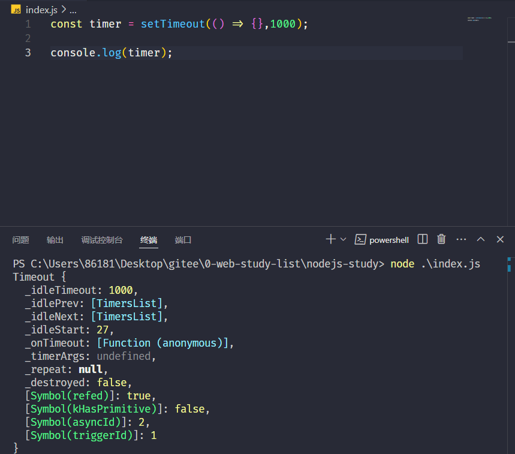
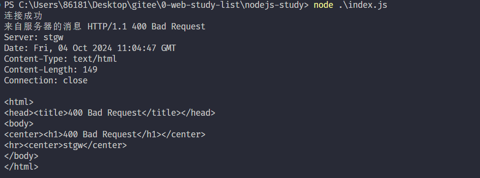

## node的版本控制器

> nvm

```shell
# 安装
nvm install
# 卸载
nvm uninstall
# 查看当前安装的列表
nvm list
# 切换版本
nvm use
```

## 代码提示安装的包

> 让代码提示更全

```shell
npm i -D @types/node
```

## node核心

### node概述

#### 什么是node

- node是一个js的运行环境
- [node官网](https://nodejs.org/zh-cn)
- 它比浏览器拥有更多能力

浏览器中的js
- es标准 + web-api
    
- web api提供了操作浏览器窗口和页面的能力
    - BOM
    - DOM
    - AJAX(fetch)
- 这种能力是非常有限的
    - 跨域问题(同源策略，让其他网站不能随便获取本站数据)
    - 文件读取

Node中的JS
- es标准 + NodeApi
    
- NodeApi几乎提供所有能做的事

分层结构图


- 因为浏览器提供的有限能力，JS只能使用浏览器提供的功能作用有限的操作。
- 而Node提供了完整的控制计算机的能力，NodeJS几乎可以通过Node提供的接口，实现对整个操作系统的控制

- 优势在于NodeJS是单线程异步回调，因此IO操作快，没有切换线程的消耗(NodeJS也支持多线程，支持CPU的多核)。
- 缺点在于运算太慢了

#### Node能干什么

学习目的：
- 开发桌面应用程序(例如vscode)
- 开发服务器应用程序(两种结构)
    - 结构1(更多是这样的)，这种结构一般做转发功能，同时数据库中记录一些简单信息(请求日志，用户偏好，广告信息)，静态资源，缓存
    
    - 结构2
     

### node全局对象

#### setTimeout

```js
const timer = setTimeout(() => {},1000);
console.log(timer);
```

在浏览器中setTimeout返回的是一个数字

在nodejs中返回的是一个对象


#### setInterval
> 用法和浏览器中的是一样的

#### setImmediate
```js
// setImmediate 类似于 setTimeou 0
const timer = setTimeout(() => {},0);
```
#### console

> 用于控制台输出


#### __dirname
> 获取当前模块所在的目录(绝对路径)
> 并不是global属性

#### __filename
> 获取当前模块的文件路径(绝对路径)
> 并非global属性

#### Buffer
> 类型化数组
> 继承自UInt8Array
> 计算机中存储的基本单位为字节
> 使用时、输出时可能需要用十六进制表示

#### process

- cwd()
    - 返回当前nodejs进程的工作目录
    - 绝对路径
- exit()
    - 强制退出当前node进程
    - 可传入退出码，0表示成功退出，默认是0
- argv
    - String[]
    - 获取命令中的所有参数
    - 可以传入不同的参数
- platform
    - 获取当前代码运行的操作系统
- kill(pid)
    - 根据ID杀死进程
- env
    - 获取操作系统的环境变量的


### node的模块化

#### 模块的查找

- 所有的模块查找路径最后都会转为绝对路径
- 对于非当前模块自定义的相对路径寻找模块顺序如下：
    - 检查是否是内置模块，如：fs,path等
    - 检查当前目录中的node_modules
    - 检查上级目录中的node_modules
    - 转换成绝对路径
    - 加载模块
- 关于后缀名，如果不提供后缀名，自动补全，顺序是(js>json>node>mjs)
- 关于文件名，如果仅提供目录，不提供文件名，则自动寻找该目录的index.js、package.json中的main字段。
    - package.json的main是指包的默认入口，导入或执行包时若仅提供目录，则使用main补全入口默认时index.js(**容易面试题**)

```js
// 绝对路径导入
require("D:\\gitee\\0-web-study-list\\nodejs-study\\a.js")

// 相对路径导入
// 相对当前模块
require("./a.js")
require("../a/a.js")

// 非自己定义的模块
require("fs")


// 示例
require("./src")
// 寻找顺序
// ./src => ./src.js => ./src.json => ./src.node => ./src.mjs => ./src/index.js
```

#### module对象
> 记录了当前模块的信息

```js
{
  // 模块的绝对路径，如果是入口模块就是. 如果不是就是绝对路径
  id: '.',
  // 模块的目录
  path: 'C:\\Users\\86181\\Desktop\\gitee\\0-web-study-list\\nodejs-study',
  // 用来导出的       
  exports: {},
  // 模块所在的文件
  filename: 'C:\\Users\\86181\\Desktop\\gitee\\0-web-study-list\\nodejs-study\\index.js',
  // 这个模块是否加载完了
  loaded: false,
  // 子模块
  children: [],
  // 查找路径
  paths: [
    'C:\\Users\\86181\\Desktop\\gitee\\0-web-study-list\\nodejs-study\\node_modules',
    'C:\\Users\\86181\\Desktop\\gitee\\0-web-study-list\\node_modules',
    'C:\\Users\\86181\\Desktop\\gitee\\node_modules',
    'C:\\Users\\86181\\Desktop\\node_modules',
    'C:\\Users\\86181\\node_modules',
    'C:\\Users\\node_modules',
    'C:\\node_modules'
  ]
  // 其实还有一个参数是parent，但是由于入口模块没有父模块(parent其实就是哪个模块使用的它)
}
```

#### require函数


```js
[Function: require] {
  // 把路径的写法转换成绝对路径  
  resolve: [Function: resolve] { paths: [Function: paths] },
  // 入口模块(主模块)
  main: {
    id: '.',
    path: 'C:\\Users\\86181\\Desktop\\gitee\\0-web-study-list\\nodejs-study',     
    exports: {},
    filename: 'C:\\Users\\86181\\Desktop\\gitee\\0-web-study-list\\nodejs-study\\index.js',
    loaded: false,
    children: [],
    paths: [
      'C:\\Users\\86181\\Desktop\\gitee\\0-web-study-list\\nodejs-study\\node_modules',
      'C:\\Users\\86181\\Desktop\\gitee\\0-web-study-list\\node_modules',
      'C:\\Users\\86181\\Desktop\\gitee\\node_modules',
      'C:\\Users\\86181\\Desktop\\node_modules',
      'C:\\Users\\86181\\node_modules',
      'C:\\Users\\node_modules',
      'C:\\node_modules'
    ]
  },
  // 拓展名的处理方式
  extensions: [Object: null prototype] {
    '.js': [Function (anonymous)],
    '.json': [Function (anonymous)],
    '.node': [Function (anonymous)]
  },
  // 缓存的模块
  cache: [Object: null prototype] {
    'C:\\Users\\86181\\Desktop\\gitee\\0-web-study-list\\nodejs-study\\index.js': 
{
      id: '.',
      path: 'C:\\Users\\86181\\Desktop\\gitee\\0-web-study-list\\nodejs-study',   
      exports: {},
      filename: 'C:\\Users\\86181\\Desktop\\gitee\\0-web-study-list\\nodejs-study\\index.js',
      loaded: false,
      children: [],
      paths: [Array]
    }
  }
}
```


#### require为什么能导入(面试题)

> 当执行一个模块或使用require时，会将模块放置在一个函数环境中

- 案例

    下面是一个外部模块`myModule`,导入以后的结果是什么
    ```js
    console.log("当前模块路径", __dirname)
    console.log("当前模块文件", __filename)
    exports.c = 3
    module.exports = {
        a: 1,
        b: 2
    }
    this.m = 5
    ```
    ```js
    console.log(require("./myModule")) // 答案是：{a:1,b:2}
    ```


- 原理

    require函数的伪代码
    ```js
    function require(modulePath){
        // 1. 将modulePath转换成绝对路径(D:\xx\xx\xx.js)
        require.reslove(modulePath)
        // 2. 判断是否该模块已有缓存
        if(require.cache["D:\\xx\\xx\\xx.js"]){
            return result
        }
        // 3. 读取文件内容
        // 4. 包裹到一个函数中
        function __temp(module,exports,require,__dirname,__filename){
            console.log("当前模块路径", __dirname)
            console.log("当前模块文件", __filename)
            exports.c = 3
            module.exports = {
                a: 1,
                b: 2
            }
            this.m = 5
        }

        // 5. 创建module对象
        module.exports = {}
        const exports = module.exports
        // 这样劫持函数以后module.exports,module,this三者相等
        __temp.call(module.exports,module,exports,require,module.path,module.filename)

        return module.exports   
    }
    ```

### Node中的ES模块化

> 模块要么是commonjs，要么是ES(不能混合使用)

- commonjs
    - 默认情况下，都是commonjs

- ES
    - 文件后缀名位.mjs(某个模块用es)
    - 最近的package.json中type的值是module(整个工程都得用es)


在node老版本,当使用ES模块化运行时，必须添加--experimental-modules

```json
"scripts": {
    "test": "echo \"Error: no test specified\" && exit 1"
    "start":"node --experimental-modules index.mjs"
},
```

es的动态异步加载
```js
import("./a.mjs").then(r => console.log(object))
```

### Node基本内置模块

#### os

> [os的文档](https://nodejs.org/docs/latest/api/os.html)

##### os.EOL

> 一个字符串的值

linux换行符： `\n`
windwos换行符： `\r\n`
可以统一用`os.EOL`常量

```js
const os = require("os")
console.log("你好"+os.EOL+"同学")
```
##### os.arch()

> 返回值时当前系统cpu的架构名`x32`,`x64`,`ppc`,`ppc64`,`s390`,`s390x`

```js
console.log(os.arch())
```
##### os.cpus()🚩

重要性应用：更具不同的cpu内核开启多线程

> 获取cpu每一个核的信息，返回一个数组，数组里面时每个核的参数对象


```js
console.log(os.cpus())

// 返回的值，每个核的参数对象的例子
{
    model: 'AMD Ryzen 9 5900HX with Radeon Graphics        ',
    speed: 3294,
    times: {
        user: 3937703,
        nice: 0,
        sys: 2098718,
        idle: 38430781,
        irq: 29687
    }
}
```

##### os.freemem()

> 获得当前内存还剩下多少，返回值是整数表示字节

```js
console.log(os.freemem())  // 字节
console.log(os.freemem()/1024)  // KB
console.log(os.freemem()/1024**2)  // MB
console.log(os.freemem()/2**30)  //GB
```

##### os.homedir()

> 获取当前电脑的用户文件夹目录的路径,返回类型位字符串

```js
console.log(os.homedir())
```
##### os.hostname()
> 获取计算机名,返回类型位字符串

```js
console.log(os.hostname())
```

##### tmpdir()🚩

重要性应用：动态获取临时目录

> 获取操作系统的临时目录,返回类型位字符串

```js
console.log(os.tmpdir())
```

#### path

> [path的文档](https://nodejs.org/docs/latest/api/path.html)

##### path.basename()🚩

- 参数
    - path `<string>` 文件路径
    - ext `<string>` 可选参数，文件拓展名
- 返回值
    - `<string>` 文件的全名

> 给出文件路径，获取文件的全名


```js
path.basename('/foo/foo/foo/foo.html')
// Return: 'foo.html'

path.basename('/foo/foo/foo/foo.html','.html')
// Return: 'foo'
```

##### path.delimiter

> 一个常量，表示该系统的分隔符

windwos: `;`
macOS: `:`

##### path.sep

> 一个常量,表示该系统的分割符的

windwos: `\`
macOS: `/`


##### path.dirname()🚩

- 参数
    - path `<string>` 文件路径
- 返回值
    - `<string>` 文件所在的目录

```js
path.dirname("/foo/foo/foo")
// Returns： "/foo/foo"
```
##### path.extname()

- 参数
    - path `<string>` 文件路径
- 返回值
    - `<string>` 文件的后缀名

```js
path.dirname("/foo/foo/foo.js")
// Returns： "。js"

path.dirname("/foo/foo/foo")
// Returns： " "
```

##### path.join()🚩
- 参数
    - `<string>` 文件目录名和文件名
- 返回值
    - `<string>` 文件的完整路径

> 给对应的目录名，返回一个完整的文件路径

```js
path.join("a","b","c","d.js")
// Returns： "a/b/c/d.js"
// Returns： "a\\b\\c\\d.js"

path.join("a","b","../","d.js")
// Returns： "a/d.js"
// Returns： "a\\d.js"
```

##### path.normalize()

- 参数
    - path  `<string>` 完整的路径

> 给一个完整的路径，返回规范化的路径

```js
path.normalize('/foo/foo1/foo2/..')
// Returns: "/foo/foo1"
// Returns: "\\foo\\foo1"
```

##### path.relative()

- 参数
    - from `<string>` 参照路径
    - to `<string>` 目标路径

- 返回值
    - `<string>` 相对路径

> 给出一个参照路径和一个目标路径，返回目标路径相对于参照路径的相对路径

```js
path.relative("/data/foo/test/aaa","/data/foo/demo/bbb")

// Return: "../../demo/bbb"
// Return: "..\\..\\demo\\bbb"
```

##### path.resolve()🚩

- 参数
    - from `<string>` 参照路径
    - to `<string>` 目标路径

- 返回值
    - `<string>` 绝对路径

> 给出一个文件，获取它相对于当前命令行的绝对路径，如果指定了参照路径就返回相对于参照路径的绝对路径

```js
path.resolve("./a.js")
// Return /0-web-study-list/nodejs-study/a.js
// Return C:\\Users\\86181\\Desktop\\0-web-study-list\\nodejs-study\\a.js

path.resolve(__dirname,"./a.js")
// 返回的就是相对于项目目录的文件的绝对路径
```

#### url

> [url的文档](https://nodejs.org/docs/latest/api/url.html)

```js
const URL = require("url")
const url = new URL.URL("http://www.xxx.com:3306/a/b/c?t=3&u=4#abc")
// 或者 parse就是帮助调用构造函数
const url = URL.parse("http://www.xxx.com:3306/a/b/c?t=3&u=4#abc")
console.log(url)

// URL {
//   href: 'http://www.xxx.com:3306/a/b/c?t=3&u=4#abc',
//   origin: 'http://www.xxx.com:3306',
//   protocol: 'http:',
//   username: '',
//   password: '',
//   host: 'www.xxx.com:3306',
//   hostname: 'www.xxx.com',
//   port: '3306',
//   pathname: '/a/b/c',
//   search: '?t=3&u=4',
//   searchParams: URLSearchParams { 't' => '3', 'u' => '4' },
//   hash: '#abc'
// }

console.log(url.searchParams.has("a"))   // false
console.log(url.searchParams.has("t"))   // true
console.log(url.searchParams.get("t"))   // 3


const obj = {
  href: 'http://www.xxx.com:3306/a/b/c?t=3&u=4#abc',
  origin: 'http://www.xxx.com:3306',
  protocol: 'http:',
  username: '',
  password: '',
  host: 'www.xxx.com:3306',
  hostname: 'www.xxx.com',
  port: '3306',
  pathname: '/a/b/c',
  search: '?t=3&u=4',
  hash: '#abc'
}

const url = URL.format(obj)
console.log(url)  // http://www.xxx.com:3306/a/b/c?t=3&u=4#abc
```


#### util

> [util的文档](https://nodejs.org/docs/latest/api/util.html)

##### callbackify

- 参数
    - original `<Function>` 一个async函数
- 返回值
    - `<Function>` 一个回调函数

> 将一个异步函数转换为一个回调函数处理

```js
const util = require("util")

async function delay(duration = 1000) {
    return new Promise(resolve => {
        setTimeout(() => {
            resolve(duration)
        }, duration)
    })
}

delay(500).then(d=>{
    console.log(d)
})

const delayCallback = util.callbackify(delay)

delayCallback(500,(err,d)=>{
    console.log(d)
})
```

##### inherits
- 参数
    - 子类
    - 父类

> 第一个参数为子类，第二个为父类，子类继承父类

##### isDeepStrictEqual🚩

- 参数
    - `<obj>` 对象1
    - `<obj>` 对象2

> 将两个对象继续深度严格比较

```js
const util = require("util")

const obj1 = {
    a:1,
    b:{
        c:3,
        d:{
            e:4
        }
    }
}

const obj2 = {
    a:1,
    b:{
        c:3,
        d:{
            3:5
        }
    }
}


console.log(util.isDeepStrictEqual(obj1,obj2)) // false
```

##### promisify🚩

- 参数
    - original `<Function>` 一个回调函数
- 返回值
    - `<Function>` 一个async函数

> 将一个回调函数转换成异步函数处理

```js
const util = require("util")

function delayCallBack(duration,callback){
    setTimeout(()=>{
        callback(null,duration)
    },duration)
}

const delay = util.promisify(delayCallBack)

delay(500).then(d => console.log(d))
```


### 文件I/O

> IO的速度往往低于内存和CPU的交互速度

> [fs模块的文档](https://nodejs.org/docs/latest/api/fs.html)

#### 读取文件

##### fs.readFile()

- 参数
    - path `<string>` 目标文件的路径
    - options `<obj>` 可选项配置
        - encoding `<string>` 编码类型
        - flag `<string>` 文件模式，默认值为 'r'
        - signal `<AbortSignal>` 允许中止正在进行的读取文件
    - callback `<Function>` 回调函数


```js
const fs = require("fs")
const path = require("path")

// 获取文件的绝对路径
const filename =  path.resolve(__dirname,"./myfiles/1.txt")

fs.readFile(filename,(err,content) => {
    console.log(content)
    console.log(content.toString("utf-8"))
})
// 不传入编码就是Buffer,传入就是按照编码解析
fs.readFile(filename,"utf-8",(err,content) => {
    console.log(content)
    console.log(content.toString("utf-8"))
})


// readFile的同步方法
// Sync函数是同步的，会阻塞JS的运行，极其影响性能
// 通常，在程序启动时运行有限次数即可
const content = fs.readFileSync(filename,"utf-8")
console.log(content)
```

##### fs.promise.readFile()
- 参数
    - path `<string>` 目标文件的路径
    - options `<obj>` 可选项配置
        - encoding `<string>` 编码类型
        - flag `<string>` 文件模式，默认值为 'r'
        - signal `<AbortSignal>` 允许中止正在进行的读取文件
- 返回值
    - Promise `<Promise>` 错误和读取的内容


```js
const fs = require("fs")
const path = require("path")
// 获取文件的绝对路径
const filename =  path.resolve(__dirname,"./myfiles/1.txt")
async function test(){
    const content = await fs.promises.readFile(filename,{encoding:"utf-8",flag:"r"})
    console.log(content)
}
```

#### 写入文件

##### fs.writeFile()

- 参数
    - path `<string>` 目标文件的路径
    - data `<string> | <Buffer> | <stream> 等` 要写的内容
    - options `<obj>` 可选项配置
        - encoding `<string>` 编码类型
        - mode `<integer>` 默认值 `0o666` 设置权限
        - flag `<string>` 文件模式，默认值为 'w'
        - flush `<boolean>` 
        - signal `<AbortSignal>` 允许中止正在进行的读取文件
    - callback `<Function>` 回调函数

```js
const fs = require("fs")
const path = require("path")
// 获取文件的绝对路径
const filename =  path.resolve(__dirname,"./myfiles/1.txt")

// 如果这里的路径的文件不存在会自动创建，但是目录不存在就会报错
fs.writeFile(filename,"mzmm",(err)=>{
    if(!err){
        console.log("写入成功")
    }else{
        console.log("写入失败")
    }
})


// writeFile的同步模式
fs.writeFileSync(filename,"mzmm")
```

##### fs.promise.writeFile()

- 参数
    - path `<string>` 目标文件的路径
    - data `<string> | <Buffer> | <stream> 等` 要写的内容
    - options `<obj>` 可选项配置
        - encoding `<string>` 编码类型
        - mode `<integer>` 默认值 `0o666`
        - flag `<string>` 文件模式，默认值为 'w'
        - flush `<boolean>` 
        - signal `<AbortSignal>` 允许中止正在进行的读取文件
- 返回值
    - Promise `<Promise>` 成功后履行

```js
const fs = require("fs")
const path = require("path")
// 获取文件的绝对路径
const filename =  path.resolve(__dirname,"./myfiles/1.txt")

async function test() {
    const buffer = Buffer.from("mzmm403","utf-8")
    // flag:"a" 追加写入模式
    // 如果这里的路径的文件不存在会自动创建，但是目录不存在就会报错
    await fs.promises.writeFile(filename,buffer,{encoding:"utf-8",flag:"a"}) 
    console.log("写入成功")
}
```

#### 文件复制demo
```js
const fs = require("fs")
const path = require("path")

async function test() {
    const filename =  path.resolve(__dirname,"./myfiles/1.jpg")
    const content = await fs.promises.readFile(filename)
    const filename1 =  path.resolve(__dirname,"./myfiles/1.copy.jpg")
    await fs.promises.writeFile(filename1,content) 
    console.log("写入成功")
}
test()
```

#### 获取文件或目录的信息

> 返回的是文件的状态

```js
Stats {
  dev: 12148368,
  mode: 33206,
  nlink: 1,
  uid: 0,
  gid: 0,
  rdev: 0,
  blksize: 4096,
  ino: 75153818782251150,     
  size: 8530,
  blocks: 24,
  atimeMs: 1727930690274.6682,
  mtimeMs: 1727930326547.8286,
  ctimeMs: 1727930335346.66,  
  birthtimeMs: 1727930326080.8604,
  atime: 2024-10-03T04:44:50.275Z,
  mtime: 2024-10-03T04:38:46.548Z,
  ctime: 2024-10-03T04:38:55.347Z,
  birthtime: 2024-10-03T04:38:46.081Z
}
```

- size：占用字节
- atime：上次访问事件
- mtime：上次文件内容被修改时间
- ctime：上次文件状态被修改时间(比如访问权限)
- birthime：文件创建时间
- isDirectory()：判断是否是目录
- isFile()：判断是否是文件


##### fs.stat()

- 参数
    - path `<string> | <Buffer> | <URL>` 文件路径
    - options
        - bigint `<boolean>` 默认为false
    - callback
        - err `<Error>`
        - stats `<fs.Stats>`


```js
const fs = require("fs")
const path = require("path")

const filename =  path.resolve(__dirname,"./myfiles/1.jpg")

fs.stat(filename,(err,stats)=>{
    console.log(stats)
})


// 同步函数
const stats = fs.statSync(filename)
console.log(stats)
```


##### fs.promise.stat()
- 参数
    - path `<string> | <Buffer> | <URL>` 文件路径
    - options
        - bigint `<boolean>` 默认为false
- 返回
    - Promise `<Promise>` 成功后履行

```js
const fs = require("fs")
const path = require("path")

const filename =  path.resolve(__dirname,"./myfiles/1.jpg")

async function test() {
    const stat = await fs.promises.stat(filename)
    console.log(stat)
}
test()
```


#### 声明

> 剩下的一些api都统一采用promise的形式记录，基本上都是回调，promise，同步这三个函数


#### fs.promise.readdir()

> 获取目录中的文件和子目录

- 参数
    - path `<string> | <Buffer> | <URL>` 文件路径
    - options
        - encoding `<string>` 默认是utf-8
        - 使用文件类型 `<boolean>` 默认是false
        - 递归 `<boolean>` 如果，则以迭代方式读取目录的内容。在循环模式下，它将列出所有文件、子文件和目录，默认false
- 返回
    - Promise `<Promise>` 成功后履行


```js
const fs = require("fs")
const path = require("path")

const filename =  path.resolve(__dirname,"./myfiles/")

async function test() {
    // 可以通过开启递归的方式深度获取
    const pathes = await fs.promises.readdir(filename,{recursive:"true"})
    console.log(pathes)
    //[ '1.jpg', '1.txt', '2.jpg', 'sub', 'sub\\foo.txt' ]
}
test()
```

#### fs.promise.mkdir()

> 创建目录

- 参数
    - path `<string> | <Buffer> | <URL>` 文件路径
    - options
        - 递归 `<boolean>` 如果，则以迭代方式读取目录的内容。在循环模式下，它将列出所有文件、子文件和目录，默认false
        - mode `<string | <integer>` windwos不支持
- 返回
    - Promise `<Promise>` 成功后履行

```js
const fs = require("fs")
const path = require("path")

const filename =  path.resolve(__dirname,"./myfiles/test1/test2/test3")

async function test() {
    await fs.promises.mkdir(filename,{recursive:true})
    console.log("创建成功")
}
test()
```


#### fs.exists()

> 废弃，官方建议用fs.stat代替
> 判断文件或者目录是否存在
> 下面自己封装一个


```js
async function exists(filename) {
    try{
        await fs.promises.stat(filename)
        return true
    } catch (err) {
        if(err.code === "ENOENT"){
            // 文件不存在
            return false
        }
        throw err
    }
}

async function test() {
    const res = await exists(filename)
    if(res){
        console.log("目录存在,可以后续操作")
        // 后续的一些I/O
    }else{
        await fs.promise.mkdir(filename)
        console.log("目录自动创建,继续后续操作")
        // 后续的一些I/O
    }
}
test()
```

#### fs.promise.unlink

- 参数
    - path `<string> | <Buffer> | <URL>` 文件路径
- 返回值
    - Promise `<Promise>` 成功后履行

```js
const fs = require("fs")
const path = require("path")

const filename =  path.resolve(__dirname,"./myfiles/test1/test2/test3")

async function test(){
    await fs.promise.unlink(filename)
    console.log("删除成功")
}
```

#### 文件流

##### 文件流的相关概念

> [文件流的文档](https://nodejs.org/docs/latest/api/stream.html)

> 文件流就是数据从一个地方流向另一个地方，一般是数据流向内存，cpu操作数据，操作后的数据从内存流出

流是有方向的，在js中流分为如下几类：
- 可读流(Readable)：数据从源头流向内存
- 可写流(Writable)：数据从内存流向源头
- 双工流(Duplex)：数据即可从源头流向内存又可从内存流向源头


**为什么需要流？**
- reason
    1. 其他介质和内存的数据规模不一致(其实就是空间大小不一致)
        
    2. 其他介质俄内存的数据处理能力不一致
        


**什么是文件流？**

> 文件流指的就是内存数据和磁盘文件数据之间的流动


##### fs.createReadStream()

- 参数
    - path `<string> | <Buffer> | <URL>` 文件路径
    - options 
        - flags `<string>` 文件模式,默认是`r`
        - encoding `<string>` 编码方式，默认是null
        - fd `<integer> | <FileHandle>` 默认是null
        - mode `<integer>` 文件权限，默认是0o666
        - autoClose `<boolean>` 读完后自动关闭，默认是true
        - emitClose `<boolean>` 默认是true
        - start `<integer>` 起始字节
        - end `<integer>` 结束字节，  默认是Infinity
        - highWaterMark `<integer>` 每次读取的数量，默认是 64 * 1024，这个数值受编码的影响
        - fs `<Object> | <null>` 默认是null
        - signal `<AbortSignal> | <null>` 默认是null
- 返回值 
    - 返回文件可读流(ReadStream)


> 含义： 创建一个文件可读流，用于读取文件内容


```js
const fs = require("fs")
const path = require("path")

const filename =  path.resolve(__dirname,"./myfiles/1.txt")

const rs = fs.createReadStream(filename,{
    encoding: "utf-8",
    highWaterMark: 5
})
```

##### 可读流的相关操作
**ReadStream.on(事件名,处理函数)**

> 对于ReadStream有事件如下所示

- open 文件打开事件，文件被打开后除法

- error 出现错误以后触发

- close 文件被关闭触发，可以通过ReadStream.close()手动关闭或者文件读取完自动关闭

- data  读取到一部分数据后触发，注册data事件后才真正开始读取，每次读取highWaterMark指定的数量，回调函数中会附带读取到的数据

- end 全部数据读取完毕会触发


**ReadStream.pause()和resume()**

ReadStream.pause()是暂停读取的函数

- ReadStream.on("pause",()=>{})会在暂停读取后触发

ReadStream.resume()是恢复读取的函数

- ReadStream.on("resume",()=>{})会在暂停读取后触发

```js
rs.on("open",() => {
    console.log("文件被打开了")
})

rs.on("error",()=>{
    console.log("出错了")
})

rs.on("close",()=>{
    console.log("文件关闭了")
})

rs.on("data",chunk => {
    console.log("读取到一部分数据:",chunk)
    // 暂停读取
    rs.pause()
})

rs.on("pause",()=>{
    console.log("暂停了")
    setTimeout(() => {
        // 恢复读取
        rs.resume()
    },1000)
})

rs.on("resume",() => {
    console.log("恢复读取")
})

rs.on("end",() => {
    // 这个在close之前
    console.log("全部数据读取完毕")
})

// 手动关闭文件流
rs.close()
```

##### fs.createWriteStream()

- 参数
    - path `<string> | <Buffer> | <URL>` 文件路径
    - options 
        - flags `<string>` 文件模式,默认是`w`
        - encoding `<string>` 编码方式，默认是utf8
        - fd `<integer> | <FileHandle>` 默认是null
        - mode `<integer>` 文件权限，默认是0o666
        - autoClose `<boolean>` 写完后自动关闭，默认是true
        - emitClose `<boolean>` 默认是true
        - start `<integer>` 起始字节
        - highWaterMark `<integer>` 每次写入的数量，默认是 16384，这里和读取不同是准确的字节数
        - fs `<Object> | <null>` 默认是null
        - signal `<AbortSignal> | <null>` 默认是null
        - flush `<boolean>` 如果为真，则在关闭基础文件描述符之前刷新它,默认值是false
- 返回值 
    - 返回文件可写流(WriteStream)

```js
const fs = require("fs")
const path = require("path")

const filename =  path.resolve(__dirname,"./myfiles/1.txt")

// 创建写入流

const ws = fs.createWriteStream(filename,{
    flags: "a" // 追加写入
    encoding: "utf-8",
    highWaterMark: 3
})
```

##### 可写流的相关操作

**WriteStream.on(事件名,处理函数)**

- open  打开文件的时候触发
- error 报错的时候触发
- close 关闭文件的时候触发

**WriteStream.write(data)**

- 写入一组数据，data可以是字符串或者Buffer
- 返回一个boolean值
    - true：写入通道没有被填满，接下来的数据可以直接写入，无需排队
        
    - false：写入通道目前已被填满，接下来的数据将进入队列
        
        - 这里要注意背压问题，因为写入队列是内存中的数据，是有限的
        - 背压问题的解决方式：
            ```js
            const fs = require("fs")
            const path = require("path")

            const filename =  path.resolve(__dirname,"./myfiles/1.txt")

            // 创建写入流

            const ws = fs.createWriteStream(filename,{
                encoding: "utf-8",
                highWaterMark: 16*1024
            })


            let i = 0
            // 一致写，知道大奥上限，或无法再直接写入
            function write(){
                let flag = true
                while(i<1024*1024*10 && flag){
                    flag = ws.write("a")  // 写入a，得到下一次还能不能直接写
                    i++
                }
            }

            write()

            // 等队列清空继续调用write去写入
            ws.on("drain",()=>{
                write()
            })
            ```
- 当写入队列清空时，会触发drain事件

**WriteStream.end([data])**

- 结束写入，将自动关闭文件
    - 自动关闭取决于autoClose配置，默认为true
- data是可选的，表示关闭前的最后一次写入


##### ReadStream.pipe(WriteStream)(文件流demo)

> 复制文件

```js
const fs = require("fs")
const path = require("path")

// 方式1：把文件所有内存都放入到内存队列，内存占用高
async function method1() {
    const from = path.resolve(__dirname,"./myfiles/1.txt")
    const to = path.resolve(__dirname,"./myfiles/2.txt")
    console.time("方式1")
    const content = await fs.promises.readFile(from)
    await fs.promises.writeFile(to,content)
    console.timeEnd("方式1")
    console.log("复制完成")
}

// 方式2  不仅时间少了很多，占用内存空间也少了很多

async function method2() {
    const from = path.resolve(__dirname,"./myfiles/1.txt")
    const to = path.resolve(__dirname,"./myfiles/3.txt")
    console.time("方式2")
    const rs = fs.createReadStream(from)
    const ws = fs.createWriteStream(to)
    rs.on("data", chunk=>{
        // 都一部分数据
        const flag = ws.write(chunk)
        if(!flag){
            // 表示下一次会造成背压
            rs.pause() // 暂停读取
        }
    })

    ws.on("drain",()=>{
        // 表示可以继续写了
        rs.resume()
    })

    rs.on("close",()=>{
        // 写完了
        ws.end() //关闭写入流
        console.timeEnd("方式2")
        console.log("复制完成")
    }) 
}

method1()
method2()
```


> 其实上面的方式2已经有封装好的函数了就是读取流的`ReadStream.pipe(WriteStream)`

- 将可读流和可写流连接
- 返回参数值
- 该方法可以解决背压问题

```js
const fs = require("fs")
const path = require("path")

async function method3() {
    const from = path.resolve(__dirname,"./myfiles/1.txt")
    const to = path.resolve(__dirname,"./myfiles/4.txt")
    console.time("方式3")
    const rs = fs.createReadStream(from)
    const ws = fs.createWriteStream(to)
    
    rs.pipe(ws)

    rs.on("close",()=>{
        console.timeEnd("方式3")
    })
}
```


### net模块

> (net模块文档)[https://nodejs.org/docs/latest/api/net.html]

#### http请求

- 普通模式

- 长连接模式


#### net模块的作用

- net是一个通信模块
- 可以使用其实现进程间的通信IPC
- 可以实现网络通信TCP/IP  🚩

#### 创建客户端

> 在nodejs中主动去发送请求

##### net.createConnection(options[,connectListener])

- 参数
    - options `<obj>`
        - host `<string>` 要连接到的主机
        - port `<number>` 端口号
        - 剩下的配置详见：[配置](https://nodejs.org/docs/latest/api/net.html#socketconnectoptions-connectlistener)
    - connectListener `<Function>` 
- 返回值
    - 返回socket

对于**socket**有如下解释
- socket是一个特殊的文件
- 在node中表现为一个双工流对象
- 通过写入内容发送数据
- 通过监听流的内容获取数据
- socket.on("end",()=>{}) 关闭socket流会触发


```js
const net = require("net")

// 创建客户端
const socket = net.createConnection(
    {
        host: "ke.qq.com",
        port: 80
    },
    () => {
        console.log("连接成功")
    }
)

socket.write(`你好！`)

socket.on("data",chunk => {
    console.log("来自服务器的消息",chunk.toString("utf-8"))
    // 客户端挂断TCP连接
    socket.end()
})
```


```js
socket.write(`GET / HTTP/1.1
Host: tabox.mzmm403.top/
Connection: keep-alive

`)

// 报文书写的方式
`请求行
请求头

请求体`
```

**socket.end()因为流的队列问题会造成通道的拥堵，导致一次只能传固定长度的数据，因此可以通过Content-Length可以去判断当前流传输是否完成，具体代码如下**

```js
const net = require("net")

// 创建客户端
const socket = net.createConnection(
    {
        host: "ke.qq.com",
        port: 80
    },
    () => {
        console.log("连接成功")
    }
)

//
var receive = null

// 获取http报文请求将其制作成一个对象
function parseResponse(response) {
    const index = response.indexOf("\r\n\r\n")
    const head = response.sunbstring(0,index)
    const body = response.substring(index + 2)
    const headParts = head.split("\r\n")
    const headerArray = headParts.slice(1).map(str => {
        return str.split(":").map(s => s.trim())
    })
    const header = headerArray.reduce((a,b) => {
        a[b[0]] = b[1]
        return a
    },{})

    return {
        header,
        body: body.trimStart()
    }
}

// 判断是否接收完成
function isOver(){
    // 需要接收的消息体的总字节数
    const contentLength =+ receive.header["Content-Length"]
    // 当前已经接收的总字节数
    const curReceivedLength = Buffer.from(receive.body,"utf-8").byteLength
    // 返回比较结果
    return curReceivedLength > contentLength
}

socket.on("data",chunk => {
    const response = chunk.toString("utf-8")
    if(!receive){
        // 第一次接收
        parseResponse(response)
        // 看当前是否已经传输完成
        if (isOver()){
            socket.end()
        }
        return
    }

    receive.body += response
    if(isOver()){
        socket.end()
        return
    }

})


socket.write(`GET / HTTP/1.1
Host: tabox.mzmm403.top/
Connection: keep-alive
    
`)
```

#### 创建服务端
##### net.createServer()

- 参数
    - options `<obj>`
        - 剩下的配置详见：[配置](https://nodejs.org/docs/latest/api/net.html#socketconnectoptions-connectlistener)
    - connnectListener `<Function>` 回调函数
- 返回值
    - 返回server对象

对于**server**对象有如下解释

- server.listen(port)
- server.on("listening",()=>{})
- server.on("connection",socket=>{})


*建议在IE浏览器中尝试下面这段代码*
```js
const net = require("net")
const fs = require("fs")
const path = require("path")

// 创建一个服务端
const server = net.createServer()

// 服务器监听9527端口
server.listen(9527)

// 服务器触发了监听以后就会触发事件
server.on("listening",() => {
    console.log("server listen 9527")
})

// 客户端和服务端建立连接了
// 当某个连接到来时，触发该事件，事件监听函数会获得一个socket对象
server.on("connection", socket => {
    console.log("有客户端连接到服务器")

    socket.on("data", async chunk => {
        const filename = path.resolve(__dirname,"./myfiles/eh.jpg")
        const bodyBuffer = await fs.promises.readFile(filename)
        const headBuffer = Buffer.from(`HTTP/1.1 200 OK
Content-Type: image/jpeg        
        
`,
            "utf-8"
        )
        const result = Buffer.concat([headBuffer,bodyBuffer])
        socket.write(result)
        socket.end()
    })

    socket.on("end",()=>{
        console.log("连接关闭")
    })
})
```


### http模块

- http模块建立在net模块上
- `http.request(url[,options][,callback])`
- `http.createServer([options][,requestListener])`