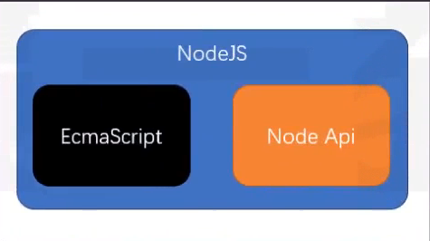
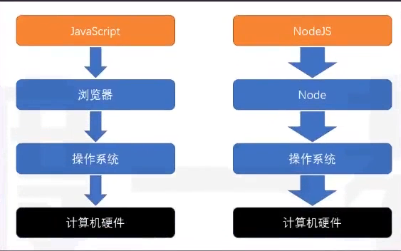
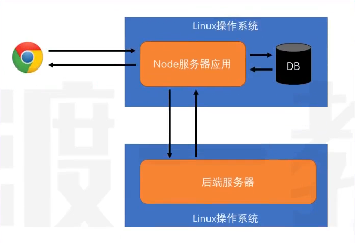

## node核心

### node概述

#### 什么是node

- node是一个js的运行环境
- [node官网](https://nodejs.org/zh-cn)
- 它比浏览器拥有更多能力

浏览器中的js
- es标准 + web-api
    
- web api提供了操作浏览器窗口和页面的能力
    - BOM
    - DOM
    - AJAX(fetch)
- 这种能力是非常有限的
    - 跨域问题(同源策略，让其他网站不能随便获取本站数据)
    - 文件读取

Node中的JS
- es标准 + NodeApi
    
- NodeApi几乎提供所有能做的事

分层结构图


- 因为浏览器提供的有限能力，JS只能使用浏览器提供的功能作用有限的操作。
- 而Node提供了完整的控制计算机的能力，NodeJS几乎可以通过Node提供的接口，实现对整个操作系统的控制

- 优势在于NodeJS是单线程异步回调，因此IO操作快，没有切换线程的消耗(NodeJS也支持多线程，支持CPU的多核)。
- 缺点在于运算太慢了

#### Node能干什么

学习目的：
- 开发桌面应用程序(例如vscode)
- 开发服务器应用程序(两种结构)
    - 结构1(更多是这样的)，这种结构一般做转发功能，同时数据库中记录一些简单信息(请求日志，用户偏好，广告信息)，静态资源，缓存
    
    - 结构2
     

### node全局对象

#### setTimeout

```js
const timer = setTimeout(() => {},1000);
console.log(timer);
```

在浏览器中setTimeout返回的是一个数字

在nodejs中返回的是一个对象


#### setInterval
> 用法和浏览器中的是一样的

#### setImmediate
```js
// setImmediate 类似于 setTimeou 0
const timer = setTimeout(() => {},0);
```
#### console

> 用于控制台输出


#### __dirname
> 获取当前模块所在的目录(绝对路径)
> 并不是global属性

#### __filename
> 获取当前模块的文件路径(绝对路径)
> 并非global属性

#### Buffer
> 类型化数组
> 继承自UInt8Array
> 计算机中存储的基本单位为字节
> 使用时、输出时可能需要用十六进制表示

#### process

- cwd()
    - 返回当前nodejs进程的工作目录
    - 绝对路径
- exit()
    - 强制退出当前node进程
    - 可传入退出码，0表示成功退出，默认是0
- argv
    - String[]
    - 获取命令中的所有参数
    - 可以传入不同的参数
- platform
    - 获取当前代码运行的操作系统
- kill(pid)
    - 根据ID杀死进程
- env
    - 获取操作系统的环境变量的


### node的模块化

#### 模块的查找

- 所有的模块查找路径最后都会转为绝对路径
- 对于非当前模块自定义的相对路径寻找模块顺序如下：
    - 检查是否是内置模块，如：fs,path等
    - 检查当前目录中的node_modules
    - 检查上级目录中的node_modules
    - 转换成绝对路径
    - 加载模块
- 关于后缀名，如果不提供后缀名，自动补全，顺序是(js>json>node>mjs)
- 关于文件名，如果仅提供目录，不提供文件名，则自动寻找该目录的index.js、package.json中的main字段。
    - package.json的main是指包的默认入口，导入或执行包时若仅提供目录，则使用main补全入口默认时index.js(**容易面试题**)

```js
// 绝对路径导入
require("D:\\gitee\\0-web-study-list\\nodejs-study\\a.js")

// 相对路径导入
// 相对当前模块
require("./a.js")
require("../a/a.js")

// 非自己定义的模块
require("fs")


// 示例
require("./src")
// 寻找顺序
// ./src => ./src.js => ./src.json => ./src.node => ./src.mjs => ./src/index.js
```

#### module对象
> 记录了当前模块的信息

```js
{
  // 模块的绝对路径，如果是入口模块就是. 如果不是就是绝对路径
  id: '.',
  // 模块的目录
  path: 'C:\\Users\\86181\\Desktop\\gitee\\0-web-study-list\\nodejs-study',
  // 用来导出的       
  exports: {},
  // 模块所在的文件
  filename: 'C:\\Users\\86181\\Desktop\\gitee\\0-web-study-list\\nodejs-study\\index.js',
  // 这个模块是否加载完了
  loaded: false,
  // 子模块
  children: [],
  // 查找路径
  paths: [
    'C:\\Users\\86181\\Desktop\\gitee\\0-web-study-list\\nodejs-study\\node_modules',
    'C:\\Users\\86181\\Desktop\\gitee\\0-web-study-list\\node_modules',
    'C:\\Users\\86181\\Desktop\\gitee\\node_modules',
    'C:\\Users\\86181\\Desktop\\node_modules',
    'C:\\Users\\86181\\node_modules',
    'C:\\Users\\node_modules',
    'C:\\node_modules'
  ]
  // 其实还有一个参数是parent，但是由于入口模块没有父模块(parent其实就是哪个模块使用的它)
}
```

#### require函数


```js
[Function: require] {
  // 把路径的写法转换成绝对路径  
  resolve: [Function: resolve] { paths: [Function: paths] },
  // 入口模块(主模块)
  main: {
    id: '.',
    path: 'C:\\Users\\86181\\Desktop\\gitee\\0-web-study-list\\nodejs-study',     
    exports: {},
    filename: 'C:\\Users\\86181\\Desktop\\gitee\\0-web-study-list\\nodejs-study\\index.js',
    loaded: false,
    children: [],
    paths: [
      'C:\\Users\\86181\\Desktop\\gitee\\0-web-study-list\\nodejs-study\\node_modules',
      'C:\\Users\\86181\\Desktop\\gitee\\0-web-study-list\\node_modules',
      'C:\\Users\\86181\\Desktop\\gitee\\node_modules',
      'C:\\Users\\86181\\Desktop\\node_modules',
      'C:\\Users\\86181\\node_modules',
      'C:\\Users\\node_modules',
      'C:\\node_modules'
    ]
  },
  // 拓展名的处理方式
  extensions: [Object: null prototype] {
    '.js': [Function (anonymous)],
    '.json': [Function (anonymous)],
    '.node': [Function (anonymous)]
  },
  // 缓存的模块
  cache: [Object: null prototype] {
    'C:\\Users\\86181\\Desktop\\gitee\\0-web-study-list\\nodejs-study\\index.js': 
{
      id: '.',
      path: 'C:\\Users\\86181\\Desktop\\gitee\\0-web-study-list\\nodejs-study',   
      exports: {},
      filename: 'C:\\Users\\86181\\Desktop\\gitee\\0-web-study-list\\nodejs-study\\index.js',
      loaded: false,
      children: [],
      paths: [Array]
    }
  }
}
```


#### require为什么能导入(面试题)

> 当执行一个模块或使用require时，会将模块放置在一个函数环境中

- 案例

    下面是一个外部模块`myModule`,导入以后的结果是什么
    ```js
    console.log("当前模块路径", __dirname)
    console.log("当前模块文件", __filename)
    exports.c = 3
    module.exports = {
        a: 1,
        b: 2
    }
    this.m = 5
    ```
    ```js
    console.log(require("./myModule")) // 答案是：{a:1,b:2}
    ```


- 原理

    require函数的伪代码
    ```js
    function require(modulePath){
        // 1. 将modulePath转换成绝对路径(D:\xx\xx\xx.js)
        require.reslove(modulePath)
        // 2. 判断是否该模块已有缓存
        if(require.cache["D:\\xx\\xx\\xx.js"]){
            return result
        }
        // 3. 读取文件内容
        // 4. 包裹到一个函数中
        function __temp(module,exports,require,__dirname,__filename){
            console.log("当前模块路径", __dirname)
            console.log("当前模块文件", __filename)
            exports.c = 3
            module.exports = {
                a: 1,
                b: 2
            }
            this.m = 5
        }

        // 5. 创建module对象
        module.exports = {}
        const exports = module.exports
        // 这样劫持函数以后module.exports,module,this三者相等
        __temp.call(module.exports,module,exports,require,module.path,module.filename)

        return module.exports   
    }
    ```

### Node中的ES模块化

> 模块要么是commonjs，要么是ES(不能混合使用)

- commonjs
    - 默认情况下，都是commonjs

- ES
    - 文件后缀名位.mjs(某个模块用es)
    - 最近的package.json中type的值是module(整个工程都得用es)


在node老版本,当使用ES模块化运行时，必须添加--experimental-modules

```json
"scripts": {
    "test": "echo \"Error: no test specified\" && exit 1"
    "start":"node --experimental-modules index.mjs"
},
```

es的动态异步加载
```js
import("./a.mjs").then(r => console.log(object))
```

### Node基本内置模块

#### os

> [os的文档](https://nodejs.org/docs/latest/api/os.html)

##### os.EOL

> 一个字符串的值

linux换行符： `\n`
windwos换行符： `\r\n`
可以统一用`os.EOL`常量

```js
const os = require("os")
console.log("你好"+os.EOL+"同学")
```
##### os.arch()

> 返回值时当前系统cpu的架构名`x32`,`x64`,`ppc`,`ppc64`,`s390`,`s390x`

```js
console.log(os.arch())
```
##### os.cpus()🚩

重要性应用：更具不同的cpu内核开启多线程

> 获取cpu每一个核的信息，返回一个数组，数组里面时每个核的参数对象


```js
console.log(os.cpus())

// 返回的值，每个核的参数对象的例子
{
    model: 'AMD Ryzen 9 5900HX with Radeon Graphics        ',
    speed: 3294,
    times: {
        user: 3937703,
        nice: 0,
        sys: 2098718,
        idle: 38430781,
        irq: 29687
    }
}
```

##### os.freemem()

> 获得当前内存还剩下多少，返回值是整数表示字节

```js
console.log(os.freemem())  // 字节
console.log(os.freemem()/1024)  // KB
console.log(os.freemem()/1024**2)  // MB
console.log(os.freemem()/2**30)  //GB
```

##### os.homedir()

> 获取当前电脑的用户文件夹目录的路径,返回类型位字符串

```js
console.log(os.homedir())
```
##### os.hostname()
> 获取计算机名,返回类型位字符串

```js
console.log(os.hostname())
```

##### tmpdir()🚩

重要性应用：动态获取临时目录

> 获取操作系统的临时目录,返回类型位字符串

```js
console.log(os.tmpdir())
```

#### path

> [path的文档](https://nodejs.org/docs/latest/api/path.html)

##### path.basename()🚩

- 参数
    - path `<string>` 文件路径
    - ext `<string>` 可选参数，文件拓展名
- 返回值
    - `<string>` 文件的全名

> 给出文件路径，获取文件的全名


```js
path.basename('/foo/foo/foo/foo.html')
// Return: 'foo.html'

path.basename('/foo/foo/foo/foo.html','.html')
// Return: 'foo'
```

##### path.delimiter

> 一个常量，表示该系统的分隔符

windwos: `;`
macOS: `:`

##### path.sep

> 一个常量,表示该系统的分割符的

windwos: `\`
macOS: `/`


##### path.dirname()🚩

- 参数
    - path `<string>` 文件路径
- 返回值
    - `<string>` 文件所在的目录

```js
path.dirname("/foo/foo/foo")
// Returns： "/foo/foo"
```
##### path.extname()

- 参数
    - path `<string>` 文件路径
- 返回值
    - `<string>` 文件的后缀名

```js
path.dirname("/foo/foo/foo.js")
// Returns： "。js"

path.dirname("/foo/foo/foo")
// Returns： " "
```

##### path.join()🚩
- 参数
    - `<string>` 文件目录名和文件名
- 返回值
    - `<string>` 文件的完整路径

> 给对应的目录名，返回一个完整的文件路径

```js
path.join("a","b","c","d.js")
// Returns： "a/b/c/d.js"
// Returns： "a\\b\\c\\d.js"

path.join("a","b","../","d.js")
// Returns： "a/d.js"
// Returns： "a\\d.js"
```

##### path.normalize()

- 参数
    - path  `<string>` 完整的路径

> 给一个完整的路径，返回规范化的路径

```js
path.normalize('/foo/foo1/foo2/..')
// Returns: "/foo/foo1"
// Returns: "\\foo\\foo1"
```

##### path.relative()

- 参数
    - from `<string>` 参照路径
    - to `<string>` 目标路径

- 返回值
    - `<string>` 相对路径

> 给出一个参照路径和一个目标路径，返回目标路径相对于参照路径的相对路径

```js
path.relative("/data/foo/test/aaa","/data/foo/demo/bbb")

// Return: "../../demo/bbb"
// Return: "..\\..\\demo\\bbb"
```

##### path.resolve()🚩

- 参数
    - from `<string>` 参照路径
    - to `<string>` 目标路径

- 返回值
    - `<string>` 绝对路径

> 给出一个文件，获取它相对于当前命令行的绝对路径，如果指定了参照路径就返回相对于参照路径的绝对路径

```js
path.resolve("./a.js")
// Return /0-web-study-list/nodejs-study/a.js
// Return C:\\Users\\86181\\Desktop\\0-web-study-list\\nodejs-study\\a.js

path.resolve(__dirname,"./a.js")
// 返回的就是相对于项目目录的文件的绝对路径
```

#### url

> [url的文档](https://nodejs.org/docs/latest/api/url.html)

```js
const URL = require("url")
const url = new URL.URL("http://www.xxx.com:3306/a/b/c?t=3&u=4#abc")
// 或者 parse就是帮助调用构造函数
const url = URL.parse("http://www.xxx.com:3306/a/b/c?t=3&u=4#abc")
console.log(url)

// URL {
//   href: 'http://www.xxx.com:3306/a/b/c?t=3&u=4#abc',
//   origin: 'http://www.xxx.com:3306',
//   protocol: 'http:',
//   username: '',
//   password: '',
//   host: 'www.xxx.com:3306',
//   hostname: 'www.xxx.com',
//   port: '3306',
//   pathname: '/a/b/c',
//   search: '?t=3&u=4',
//   searchParams: URLSearchParams { 't' => '3', 'u' => '4' },
//   hash: '#abc'
// }

console.log(url.searchParams.has("a"))   // false
console.log(url.searchParams.has("t"))   // true
console.log(url.searchParams.get("t"))   // 3


const obj = {
  href: 'http://www.xxx.com:3306/a/b/c?t=3&u=4#abc',
  origin: 'http://www.xxx.com:3306',
  protocol: 'http:',
  username: '',
  password: '',
  host: 'www.xxx.com:3306',
  hostname: 'www.xxx.com',
  port: '3306',
  pathname: '/a/b/c',
  search: '?t=3&u=4',
  hash: '#abc'
}

const url = URL.format(obj)
console.log(url)  // http://www.xxx.com:3306/a/b/c?t=3&u=4#abc
```


#### util

> [util的文档](https://nodejs.org/docs/latest/api/util.html)

##### callbackify

- 参数
    - original `<Function>` 一个async函数
- 返回值
    - `<Function>` 一个回调函数

> 将一个异步函数转换为一个回调函数处理

```js
const util = require("util")

async function delay(duration = 1000) {
    return new Promise(resolve => {
        setTimeout(() => {
            resolve(duration)
        }, duration)
    })
}

delay(500).then(d=>{
    console.log(d)
})

const delayCallback = util.callbackify(delay)

delayCallback(500,(err,d)=>{
    console.log(d)
})
```

##### inherits
- 参数
    - 子类
    - 父类

> 第一个参数为子类，第二个为父类，子类继承父类

##### isDeepStrictEqual🚩

- 参数
    - `<obj>` 对象1
    - `<obj>` 对象2

> 将两个对象继续深度严格比较

```js
const util = require("util")

const obj1 = {
    a:1,
    b:{
        c:3,
        d:{
            e:4
        }
    }
}

const obj2 = {
    a:1,
    b:{
        c:3,
        d:{
            3:5
        }
    }
}


console.log(util.isDeepStrictEqual(obj1,obj2)) // false
```

##### promisify🚩

- 参数
    - original `<Function>` 一个回调函数
- 返回值
    - `<Function>` 一个async函数

> 将一个回调函数转换成异步函数处理

```js
const util = require("util")

function delayCallBack(duration,callback){
    setTimeout(()=>{
        callback(null,duration)
    },duration)
}

const delay = util.promisify(delayCallBack)

delay(500).then(d => console.log(d))
```