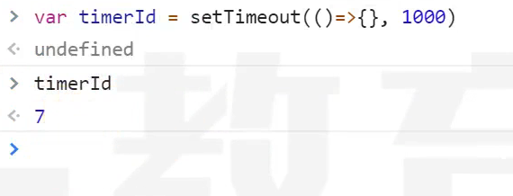

## node核心

### node概述

#### 什么是node

- node是一个js的运行环境
- [node官网](https://nodejs.org/zh-cn)
- 它比浏览器拥有更多能力

浏览器中的js
- es标准 + web-api
    
- web api提供了操作浏览器窗口和页面的能力
    - BOM
    - DOM
    - AJAX(fetch)
- 这种能力是非常有限的
    - 跨域问题(同源策略，让其他网站不能随便获取本站数据)
    - 文件读取

Node中的JS
- es标准 + NodeApi
    
- NodeApi几乎提供所有能做的事

分层结构图


- 因为浏览器提供的有限能力，JS只能使用浏览器提供的功能作用有限的操作。
- 而Node提供了完整的控制计算机的能力，NodeJS几乎可以通过Node提供的接口，实现对整个操作系统的控制

- 优势在于NodeJS是单线程异步回调，因此IO操作快，没有切换线程的消耗(NodeJS也支持多线程，支持CPU的多核)。
- 缺点在于运算太慢了

#### Node能干什么

学习目的：
- 开发桌面应用程序(例如vscode)
- 开发服务器应用程序(两种结构)
    - 结构1(更多是这样的)，这种结构一般做转发功能，同时数据库中记录一些简单信息(请求日志，用户偏好，广告信息)，静态资源，缓存
    
    - 结构2
     

### node全局对象

#### setTimeout

```js
const timer = setTimeout(() => {},1000);
console.log(timer);
```

在浏览器中setTimeout返回的是一个数字

在nodejs中返回的是一个对象


#### setInterval
> 用法和浏览器中的是一样的

#### setImmediate
```js
// setImmediate 类似于 setTimeou 0
const timer = setTimeout(() => {},0);
```
#### console

> 用于控制台输出


#### __dirname
> 获取当前模块所在的目录(绝对路径)
> 并不是global属性

#### __filename
> 获取当前模块的文件路径(绝对路径)
> 并非global属性

#### Buffer
> 类型化数组
> 继承自UInt8Array
> 计算机中存储的基本单位为字节
> 使用时、输出时可能需要用十六进制表示

#### process

- cwd()
    - 返回当前nodejs进程的工作目录
    - 绝对路径
- exit()
    - 强制退出当前node进程
    - 可传入退出码，0表示成功退出，默认是0
- argv
    - String[]
    - 获取命令中的所有参数
    - 可以传入不同的参数
- platform
    - 获取当前代码运行的操作系统
- kill(pid)
    - 根据ID杀死进程
- env
    - 获取操作系统的环境变量的


### node的模块化

#### 模块的查找

- 所有的模块查找路径最后都会转为绝对路径
- 对于非当前模块自定义的相对路径寻找模块顺序如下：
    - 检查是否是内置模块，如：fs,path等
    - 检查当前目录中的node_modules
    - 检查上级目录中的node_modules
    - 转换成绝对路径
    - 加载模块
- 关于后缀名，如果不提供后缀名，自动补全，顺序是(js>json>node>mjs)
- 关于文件名，如果仅提供目录，不提供文件名，则自动寻找该目录的index.js、package.json中的main字段。
    - package.json的main是指包的默认入口，导入或执行包时若仅提供目录，则使用main补全入口默认时index.js(**容易面试题**)

```js
// 绝对路径导入
require("D:\\gitee\\0-web-study-list\\nodejs-study\\a.js")

// 相对路径导入
// 相对当前模块
require("./a.js")
require("../a/a.js")

// 非自己定义的模块
require("fs")


// 示例
require("./src")
// 寻找顺序
// ./src => ./src.js => ./src.json => ./src.node => ./src.mjs => ./src/index.js
```

#### module对象
> 记录了当前模块的信息

```js
{
  // 模块的绝对路径，如果是入口模块就是. 如果不是就是绝对路径
  id: '.',
  // 模块的目录
  path: 'C:\\Users\\86181\\Desktop\\gitee\\0-web-study-list\\nodejs-study',
  // 用来导出的       
  exports: {},
  // 模块所在的文件
  filename: 'C:\\Users\\86181\\Desktop\\gitee\\0-web-study-list\\nodejs-study\\index.js',
  // 这个模块是否加载完了
  loaded: false,
  // 子模块
  children: [],
  // 查找路径
  paths: [
    'C:\\Users\\86181\\Desktop\\gitee\\0-web-study-list\\nodejs-study\\node_modules',
    'C:\\Users\\86181\\Desktop\\gitee\\0-web-study-list\\node_modules',
    'C:\\Users\\86181\\Desktop\\gitee\\node_modules',
    'C:\\Users\\86181\\Desktop\\node_modules',
    'C:\\Users\\86181\\node_modules',
    'C:\\Users\\node_modules',
    'C:\\node_modules'
  ]
  // 其实还有一个参数是parent，但是由于入口模块没有父模块(parent其实就是哪个模块使用的它)
}
```

#### require函数


```js
[Function: require] {
  // 把路径的写法转换成绝对路径  
  resolve: [Function: resolve] { paths: [Function: paths] },
  // 入口模块(主模块)
  main: {
    id: '.',
    path: 'C:\\Users\\86181\\Desktop\\gitee\\0-web-study-list\\nodejs-study',     
    exports: {},
    filename: 'C:\\Users\\86181\\Desktop\\gitee\\0-web-study-list\\nodejs-study\\index.js',
    loaded: false,
    children: [],
    paths: [
      'C:\\Users\\86181\\Desktop\\gitee\\0-web-study-list\\nodejs-study\\node_modules',
      'C:\\Users\\86181\\Desktop\\gitee\\0-web-study-list\\node_modules',
      'C:\\Users\\86181\\Desktop\\gitee\\node_modules',
      'C:\\Users\\86181\\Desktop\\node_modules',
      'C:\\Users\\86181\\node_modules',
      'C:\\Users\\node_modules',
      'C:\\node_modules'
    ]
  },
  // 拓展名的处理方式
  extensions: [Object: null prototype] {
    '.js': [Function (anonymous)],
    '.json': [Function (anonymous)],
    '.node': [Function (anonymous)]
  },
  // 缓存的模块
  cache: [Object: null prototype] {
    'C:\\Users\\86181\\Desktop\\gitee\\0-web-study-list\\nodejs-study\\index.js': 
{
      id: '.',
      path: 'C:\\Users\\86181\\Desktop\\gitee\\0-web-study-list\\nodejs-study',   
      exports: {},
      filename: 'C:\\Users\\86181\\Desktop\\gitee\\0-web-study-list\\nodejs-study\\index.js',
      loaded: false,
      children: [],
      paths: [Array]
    }
  }
}
```


#### require为什么能导入(面试题)

> 当执行一个模块或使用require时，会将模块放置在一个函数环境中

- 案例

    下面是一个外部模块`myModule`,导入以后的结果是什么
    ```js
    console.log("当前模块路径", __dirname)
    console.log("当前模块文件", __filename)
    exports.c = 3
    module.exports = {
        a: 1,
        b: 2
    }
    this.m = 5
    ```
    ```js
    console.log(require("./myModule")) // 答案是：{a:1,b:2}
    ```


- 原理

    require函数的伪代码
    ```js
    function require(modulePath){
        // 1. 将modulePath转换成绝对路径(D:\xx\xx\xx.js)
        require.reslove(modulePath)
        // 2. 判断是否该模块已有缓存
        if(require.cache["D:\\xx\\xx\\xx.js"]){
            return result
        }
        // 3. 读取文件内容
        // 4. 包裹到一个函数中
        function __temp(module,exports,require,__dirname,__filename){
            console.log("当前模块路径", __dirname)
            console.log("当前模块文件", __filename)
            exports.c = 3
            module.exports = {
                a: 1,
                b: 2
            }
            this.m = 5
        }

        // 5. 创建module对象
        module.exports = {}
        const exports = module.exports
        // 这样劫持函数以后module.exports,module,this三者相等
        __temp.call(module.exports,module,exports,require,module.path,module.filename)

        return module.exports   
    }
    ```
