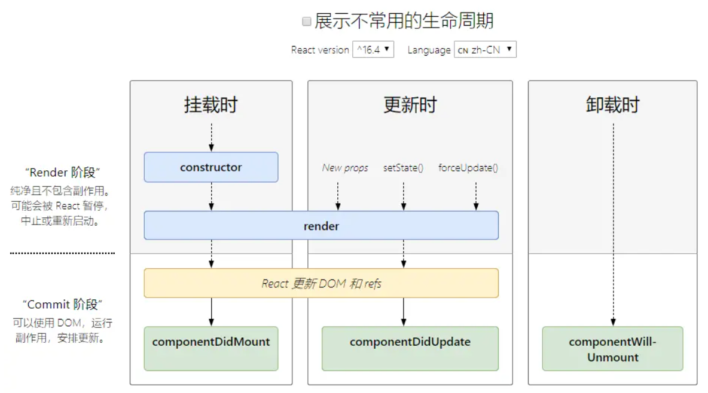
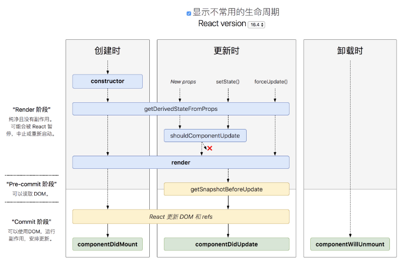

## React 入门


### React 基本介绍

[React官网](https://reactjs.org/)

React几个重要版本的重大更新

- React16: 出现了Fiber，整个更新变的可中断、可分片、具有优先级
- React16.8: 推出了Hooks，标志着从类组件正式转为函数组件
- React17: 过渡版本，没有添加任何面向开发人员的新功能。而主要侧重于升级简化React本身
- React18
    - transition
    - Suspense
    - 新的Hooks
    - Offscreen


#### React的特点

- 轻量：React的开发版所有源码（包含注释）仅3000多行
- 原生：所有的React的代码都是用原生Js书写而成的，不依赖其他任何库
- 易扩展：React对代码的封装程度较低,所以React中的很多功能都可以扩展。
- 不依赖宿主环境：React.只依赖原生JS语言，不依赖任何其他东西，包括运行环境。因此，它可以被轻松的移植到浏览器、桌面应用、移动端
- 渐近式：React并非框架，对整个工程没有强制约束力。这对与那些已存在的工程，可以逐步的将其改造为React,而不需要全盘重写。
- 单向数据流：所有的数据自顶而下的流动
- 用JS代码声明界面
- 组件化


#### React的开发环境

[react官方脚手架文档](https://cra.nodejs.cn/docs/getting-started)

```shell
npx create-react-app my-app
cd my-app
npm start
```

vscode的相关插件


### JSX基础语法

- JSX基础语法
- createElement方法

#### JSX基础语法

在React中，使用JSX来描述页面
```jsx
function App() {
    return (
        <div>Hello React</div>
    )
}
```

可以把类似于HTML的代码单独提取出来，例如：

```jsx
function App() {
    const ele = (
        <ul>
            <li>React</li>
            <li>React</li>
            <li>React</li>
            <li>React</li>
        </ul>
    )
    return (
        ele
    )
}
```

关于JSX的语法规则：

- 根元素只能有一个
    
    ```jsx
    // 只能由一个根元素
    // 下面是两个根元素的错误示范
    function App() {
        return (
            <div>Hello React</div>
            <div>Hello React</div>
        )
    }
    ```
    报错信息如下：

    

    对于上面的解决方案可以在最外层用一个闭合标签包裹，这里因为html的语义化所以提供了`<></>`空标签进行闭合，类似于vue的`<template>`

- JSX中使用JS表达式，表达式必须写在`{}`中

    ```jsx
    function App() {
        const name = "React"
        return (
            <div>{"Hello" + name}</div>
        )
    }
    ```

- 属性值指定为字符串字面量，或者在属性值中插入一个JS表达式

    ```jsx
    function App() {
        const name = "three"
        return (
            <ul>
                <li id="one">React</li>
                <li id="two">React</li>
                <li id={name}>React</li>
                <li>React</li>
            </ul>
        )
    }
    ```


- style对应样式对象，class要写作className

    ```jsx
    function App() {
        const style1 = {
            color: "red",
            // 驼峰写法 例如这里的font-size得写成fontSize
            fontSize: "20px"
        }
        return (
            <ul>
                <li style={style1}>React</li>
                <li className="one">React</li>
                <li>React</li>
                <li>React</li>
            </ul>
        )
    }
    ```

- 注释需要卸载花括号

    ```jsx
    function App() {
        const style1 = {
            color: "red",
            fontSize: "20px"
        }
        return (
            <ul>
                {/* 这是一个注释 */}
                <li style={style1}>React</li>
                <li className="one">React</li>
                <li>React</li>
                <li>React</li>
            </ul>
        )
    }
    ```

- JSX允许在模板中插入数组，数组会自动展开所有成员

    ```jsx
    function App() {
        const arr = [
            (<li>React</li>),
            (<li>Vue</li>),
            (<li>Anguler</li>),
        ]
        const userInfo = [
            {id:1,name:"张三",age:18},
            {id:2,name:"李四",age:19},
            {id:3,name:"王二麻子",age:20}
        ]

        const arr1 = userInfo.map(item => {
            return (
                <div key={item.id}>姓名：{item.name} 年龄： {item.age}</div>
            )
        })

        console.log(arr1)

        return (
            <ul>
                {/* 这是一个注释 */}
                <li style={style1}>React</li>
                <li className="one">React</li>
                <li>React</li>
                <li>React</li>
            </ul>
            {/* 数组会自动展开所有成员 */}
            {arr}
        )
    }
    ```
    上面打印的结果如下图：
    


#### createElement方法

> JSX是一种js的语法拓展，Babel会把JSX转译为React.createElement()函数进行调用

```js
React.createElement(type, [props], [...children])
```

**参数说明:**

- type: 创建的React元素类型(可选值有：标签名字符串、React组件)
- props(可选): React元素属性
- children(可选): React元素的子元素

下面两种代码的作用完全是相同的

```jsx
const element1 = (
    <h1 className="greeting">
        Hello, world!
    </h1>
)

// 上面的代码会被编译成如下代码
const element2 = React.createElement(
    'h1',
    {className: 'greeting'},
    'Hello, world!'
)
```

这些对象被称为“React元素”。它们描述了你希望在屏幕上看到的内容
可以看出，JSX的本质其实就是React.createElement()方法的语法糖


### 组件与时间绑定

- React中的组件
- 为组件绑定事件
- this的指向
- 向事件处理函数传参

#### React中的组件

> 在React中，可以通过使用类的方式声明一个组件，同时还支持使用函数的方式声明一个组件

```jsx
// 类组件

class 类名 extends React.Component {
    render(){
        return (
            // 组件的JSX代码

        )
    }
}

// 函数组件

function 组件名() {
    return (
        // 组件的JSX代码
    )
}
```

早期的函数组件被称为无状态组件，一般纯做UI展示，里面不会有复杂的逻辑
但是从16.8推出了Hooks之后，函数组件使用更多


#### 为组件绑定事件

> 在react中绑定事件的写法如下

```jsx
<button onClick={handleClick}>点我</button>
```

在react中无法通过`return false`的方式来阻止事件的默认行为，需要使用preventDefault()方法

```jsx
// 函数式组件
function Form() {
    function handleClick(event) {
        // 阻止默认行为
        event.preventDefault()
        console.log("按钮被点击了")
    }

    return (
        <form onSubmit={handleClick}>
            <button type="submit">确 定</button>
        </form>
    )
}

// 类组件
class Form extends React.Component {
    // 对于类组件而言，事件处理函数写作一个类方法
    handleClick(event) {
        // 阻止默认行为
        event.preventDefault()
        console.log("按钮被点击了")
    }

    render() {
        return (
            <form onSubmit={this.handleClick}>
                <button type="submit">确 定</button>
            </form>
        )
    }
}
```

`event`对象这里是一个合成事件，与原生事件不符，可以通过`event.nativeEvent`来获取原生事件

```jsx
eventHandler(event) {
    e.nativeEvent // 原生事件
}
```


#### this的指向

> 由于JS的this的特殊性，事件处理函数中的this并不会指向当前的组件，这就需要我们自行对this进行指向的修正，this的修正只针对类组件

- 将事件处理函数修改为箭头函数
- 将事件绑定修改为箭头函数
- 使用bind方法来强制绑定this的指向

```jsx

class Form extends React.Component {
    // 对于类组件而言，事件处理函数写作一个类方法
    handleClick(event) {
        // 打印结果为undefined
        // 针对this指向问题进行改造
        console.log(this) 
    }

    // 1. 将事件处理函数修改为箭头函数
    // handleClick = (event) => {
    //     // 打印结果为当前组件的实例
    //     console.log(this) 
    // }

    // 2. 将事件绑定修改为箭头函数
    // <form onSubmit={() => this.handleClick()}>

    // 3. 使用bind方法来强制绑定this的指向(在构造器中绑定)
    // constructor() {
    //     super()

    //     // 为了在回调中使用`this`，绑定必不可少
    //     this.handleClick = this.handleClick.bind(this)
    // }


    render() {
        return (
            <form onSubmit={this.handleClick}>
                <button type="submit">确 定</button>
            </form>
        )
    }
}
```


#### 向事件处理程序传参

> 对于一个类组件，如果要传递参数，可以使用下面的两种方式来进行传参

- 通过bind方法在绑定this指向时向事件处理函数进行传参
- 绑定事件时，通过书写箭头函数的形式来传参

```jsx
// 类组件传参
<button onClick={(e) => this.handleClick(id,e)}>点 我</button>
<button onClick={this.handleClick.bind(this,id)}>点 我</button>
```

> 对于函数组件，传参如下

```jsx
<button onClick={(e) => this.handleClick(id,e)}>点 我</button>
```


### 组件状态和数据传递

- 组件状态
- props
- props验证
- 状态提升

#### 组件状态

> 早期类组件被称之为有状态组件，就是因为在类组件中能维护组件数据

```jsx
class 类 extends React.Component {
    constructor() {
        super()
        this.state = {
            // 组件状态数据
        }
    }
    render() {
        return (
            // 通过{this.state.xxx} 来获取状态数据
        )
    }
}

// 或者
class 类名 extends React.Component {
    state = {
        // 组件状态数据
    }
    render(){
        return (
            // 通过{this.state.xxx} 来获取状态数据
        )
    }
}


// 关于类组件修改状态数据
// 不要直接修改状态值，应该通过setState方法修改
class 类名 extends React.Component {
    state = {
        num: 1
    }

    handleClick = () => {
        // 修改num的值，+1
        this.setState({
            // 底层实际上就是调用了Object.assign()方法将新老对象合并
            num: this.state.num + 1
        })
    }

    render(){
        return (
            <>
                <h1>{this.state.num}</h1>
                <button onClick={this.handleClick}>点我</button>
            </>
        )
    }
}
```

`setState`它对状态的改变可能时异步的,处于性能的考虑，react会把多个`setState`的调用合并成一个调用
如果改变状态的代码处于某个HTML元素的事件中就是异步的，否则是同步的


```jsx
state = {
    num: 1
}


// 例如下面的代码，有多个`setState`调用，但是由于时异步的，
// 因此他们拿到的`this.state.num`的值都是1，最终的结果就是2并非是4
// 也就是相当于调用了三次this.setState({num: 1 + 1})

handleClick = () => {
        this.setState({
            num: this.state.num + 1
        })
        this.setState({
            num: this.state.num + 1
        })
        this.setState({
            num: this.state.num + 1
        })
    }
```


如果在事件处理函数里面想要拿到setState执行后的数据，这里有两种方式

```jsx
// 1. 使用回调函数
this.setState({
    num: this.state.num + 1
},() => {
    console.log(this.state.num)
})

// 2. 提前使用变量存储
let newNum = this.state.num + 1
this.setState({
    num: newNum
})
console.log(newNum)
```

**最佳实践**
1. 把所有的setState当作是异步的
2. 永远不要信任setState调用完后的值得状态，因为setState可能是异步的
3. 如果要使用改变之后的状态，需要使用回调函数(setState的第二个参数)
4. 如果新的状态要根据之前的状态进行运算，使用函数的方式改变状态(setState第一个参数)

**这里写着会发现一个问题：就是在回调函数中处理改变后得数据会造成多次嵌套**
react提供了解决办法，将函数作为参数传入`setState`，这个函数用上一个state作为第一个参数，将此次更新被应用时得props做为第二个参数

```jsx
this.setState(
    // 函数得返回值是一个对象，`({})`，因此得用()否则会以为是函数的声明
    (state,props) => ({
        counter: state.counter + props.increment
    })
)
```


React将多次的setState进行合并调用(将多次状态改变完成，再统一对state进行改变，然后触发render)

#### props

> 组件之间进行数据的传递

如果是父组件向子组件传递数据，则使用props

如果是函数组件，props作为函数的一个参数传入

```jsx
function A(props) {
    return (
        // 通过props.xxx来获取props数据
        <div>
            <p>姓名：{props.userInfo.name}</p>
            <p>年龄：{props.userInfo.age}</p>
            <p>性别：{props.userInfo.sex}</p>
            <p>content：{props.content}</p>
        </div>
    )
}
```

如果是类组件，则需要在constructor中通过super(props)来获取

```jsx
class B extends React.Component {
    render() {
        return (
            // 通过this.props.xxx来获取props数据
            <div>
                <p>姓名：{this.props.userInfo.name}</p>
                <p>年龄：{this.props.userInfo.age}</p>
                <p>性别：{this.props.userInfo.sex}</p>
                <p>content：{this.props.content ? "true" : "false"}</p>
            </div>
        )
    }
}

// 父组件
import B from './B'
import A from './A'

function App() {
    let userInfo = {
        name: '张三',
        age: 18,
        sex: '男',
    }

    return (
        <>
            {/* 传递number类型 */}
            <A userInfo={userInfo}, content={1}/>
            {/* 传递boolean类型 */}
            <B userInfo={userInfo}, content={true}/>
        </>
    )
}
```


通过`props.children`可以实现类似于vue的插槽功能

```jsx
// 按钮组件代码
// Button.jsx
import React from 'react';

class Button extends React.Component {
    render() {
        return (
            <button>{this.props.children}</button>
        )
    }
}

export default Button;


// 父组件代码
// App.jsx
import Button from "./components/Button"

function App() {
  return (
      <Button>点我</Button>
  )
}

export default App;

```


#### props验证

在vue中，可以对传入的props设置默认值，验证props的有效性，在react中也可以

通过defaultprops设置默认值

```jsx
// 函数式组件

function A(props) {
    return (
        // 通过props.xxx来获取props数据
        <div>
            <p>姓名：{props.userInfo.name}</p>
            <p>年龄：{props.userInfo.age}</p>
            <p>性别：{props.userInfo.sex}</p>
            <p>content：{props.content}</p>
        </div>
    )
}

//　设置默认值
A.defaultProps = {
    userInfo: {
        name: '张三',
        age: 18,
        sex: '男'
    },
    content: 1
}


// 类组件
class B extends React.Component {
    render() {
        return (
            // 通过this.props.xxx来获取props数据
            <div>
                <p>姓名：{this.props.userInfo.name}</p>
                <p>年龄：{this.props.userInfo.age}</p>
                <p>性别：{this.props.userInfo.sex}</p>
                <p>content：{this.props.content ? "true" : "false"}</p>
            </div>
        )
    }
}

// 设置默认值
B.defaultProps = {
    userInfo: {
        name: '张三',
        age: 18,
        sex: '男'
    },
    content: false
}
```


类型检查，从Reactv15.5开始，移入到了prop-types模块中

- 安装

```shell
npm i prop-types
```

- 使用

```jsx
import PropTypes from 'prop-types'

function A(props) {
    return (
        <>
            <p>姓名：{props.name}</p>
        </>
    )
}

// 类型检查
A.propTypes = {
    name: PropTypes.string
}
```


#### 状态提升

在vue中，父传子通过props，子传父通过触发自定义事件(emit)
在React中，如果子组件要向父组件传递数据，同样是通过触发父组件传递给子组件的事情来进行传递的
在官网被称为[状态提升](https://zh-hans.react.dev/learn/sharing-state-between-components)

```jsx
// Button.jsx
import React from 'react';

class Button extends React.Component {

    ClickchangeState = ()=>{
        this.props.changeState(3)
    }

    render() {
        return (
            <button onClick={this.ClickchangeState}>{this.props.children}</button>
        )
    }
}

export default Button;


// App.jsx
import Button from "./components/Button"

function App() {

    const handleChangeState = (num) => {
        console.log("子组件传来的数据：",num)
    }

    return (
        <>
            <Button changeState={handleChangeState}>你好</Button>
        </>
    )
}
```

状态提升的案例
```jsx
// App.jsx
import React from "react";
import Money from "./components/Money";

class App extends React.Component {
    state = { 
        usd:"",
        rmb:""
    }

    toRMB = (value) => {
        if(parseFloat(value) || value === "" || parseFloat(value) === 0){
            this.setState({
                usd: value,
                rmb: value === "" ? "" : (value *7.3255).toFixed(2)
            });
        }else{
            alert("请输入数字");
        }
    }

    toUSD = (value) => {
        if(parseFloat(value) || value === "" || parseFloat(value) === 0){
            this.setState({
                usd: value === "" ? "" : (value * 0.1365).toFixed(2),
                rmb: value
            });
        }else{
            alert("请输入数字");
        }
    }

    render() {
        return (
            <>
                <Money text="USD" money={this.state.usd} setMoney={this.toRMB}/>
                <Money text="RMB" money={this.state.rmb} setMoney={this.toUSD}/>
            </>
        );
    }
}

export default App;


// Money.jsx
function Money(props) {

    function handleChange(e) {
        props.setMoney(e.target.value);
    }


    return (
        <fieldset>
            <legend>{props.text}</legend>
            <input type="text" value={props.money} onChange={handleChange}/>
        </fieldset>
    )
}

export default Money;
```


### 表单

- 受控组件
- 非受控组件
- 列表和key


#### 受控组件

> 受控组件本质上其实就是将表单中的控件和视图模型进行绑定，之后都是针对状态进行操作，下面是具体案例

- 一个基本的受控组件

```jsx

// 这里的视图模型其实就是这里的state，受控组件实际上就是组件受这里的state管控

class App extends React.Component {
    state = { 
        value:""
    }

    handlerChange = (e) => {
        this.setState({
            value: e.target.value
        })
    }

    render() {
        return (
            <>
                <input type="text" value={this.state.value} onChange={this.handlerChange}/>
            </>
        );
    }
}
```

- 对用户输入的内容进行限制

```jsx
class App extends React.Component {
    state = { 
        value:""
    }

    handlerChange = (e) => {
        const newValue = e.target.value.split("").map(item => {
            if(!isNaN(item)){
                return item
            }
        }).join("")
        this.setState({
            value: newValue
        })
    }

    render() {
        return (
            <>
                <input 
                    type="text" 
                    value={this.state.value} 
                    onChange={this.handlerChange}
                    placeholder="只能输入数字"
                />
            </>
        );
    }
}
```

- 文本域

```jsx
class App extends React.Component {
    state = { 
        value:""
    }

    handlerChange = (e) => {
        const newValue = e.target.value.split("").map(item => {
            if(!isNaN(item)){
                return item
            }
        }).join("")
        this.setState({
            value: newValue
        })
    }

    render() {
        return (
            <>
                <textarea 
                    cols="30" 
                    rows="10" 
                    value={this.state.value} 
                    onChange={this.handlerChange}    
                />
            </>
        );
    }
}
```

- 多选框

```jsx
class App extends React.Component {
    state = { 
        checkBoxs:[
            {
                content: "vue",
                checked: true
            },
            {
                content: "react",
                checked: true
            },
            {
                content: "angular",
                checked: false
            },
            {
                content: "svelte",
                checked: false
            },
        ]
    }

    handleChange = (index)=>{
        const arr = [...this.state.checkBoxs]
        arr[index].checked = !arr[index].checked
        this.setState({
            checkBoxs:arr
        })
    }

    render() {
        return (
            <>
                {   
                    this.state.checkBoxs.map((item,index) => {
                        return (
                            <div key={index}>
                                <input 
                                    type="checkbox" 
                                    value={item.content} 
                                    checked={item.checked}
                                    onChange={()=>this.handleChange(index)} 
                                />
                                <span>{item.content}</span>
                            </div>
                        )
                    })
                }
            </>
        );
    }
}
```

- 下拉列表

```jsx
class App extends React.Component {
    state = { 
        value:"apple"
    }

    handleChange = (e) => {
        this.setState({
            value : e.target.value
        })
    }

    render() {
        return (
            <>
                <select 
                    value={this.state.value}
                    onChange={this.handleChange}
                >
                    <option value="pear">桃子</option>
                    <option value="apple">苹果</option>
                    <option value="bnana">香蕉</option>
                </select>
            </>
        );
    }
}
```


#### 非受控组件

> 大多数情况下，React推荐使用受控组件来对表单进行操作，这样能够对表单控件的数据进行一个统一管理
> 但在某些特殊情况，需要使用以前传统的DOM方案处理，此时代替方案就是非受控组件

- 非受控组件基本示例

```jsx
class App extends React.Component {

    constructor() {
        super();
        // 创建了一个ref,后i按可以获取和ref绑定的dom元素
        this.inpuRef = React.createRef();
    }

    clickHandle = () => {
        // 获取ref绑定的dom元素
        console.log(this.inpuRef.current);
        // 获取到dom的value
        console.log(this.inpuRef.current.value);
    }

    render() {
        return (
            <div>
                <input type="text" ref={this.inpuRef}/>
                <button onClick={this.clickHandle}>获取输入</button>
            </div>
        );
    }
}
```

- 非受控组件的默认值

```jsx
return (
    {/* 如果使用value，react认为你是受控组件 */}
    {/* 如果想要设置默认值，就是用defaultValue */}
    <input type="text" ref={this.inpuRef} defaultValue={123}/>
    <button onClick={this.clickHandle}>获取输入</button>
)
```

- 文件上传

`<input type="file"/>`始终是一个非受控组件，因为它的值只能由用户设置

```jsx
class App extends React.Component {

    constructor() {
        super();
        this.uploadRef = React.createRef();
    }

    clickHandle = () => {
        console.log(this.uploadRef.current.files[0]);
    }

    render() {
        return (
            <div>
                <input type="file" ref={this.uploadRef} />
                <button onClick={this.clickHandle}>点击</button>
            </div>
        );
    }
}
```


###　生命周期

- 什么是生命周期
- 常用的生命周期钩子函数

#### 什么是生命周期

生命周期指组件从诞生到销毁经历的一系列过程，该过程叫做生命周期
React在组件的生命周期中提供了一系列钩子函数(类似于事件),
**生命周期钩子函数是属于类组件所独有的东西**,
从`React16.8`推出Hooks以来，整体已经开始以函数组件为主
生命周期(常用)如下图

展示不常用的如下图



#### 常用的生命周期钩子函数

官方在介绍这些钩子函数的时候也分为了`常用`和`不常用`两大块来介绍
这里介绍常用的生命周期钩子函数如下：

- constructor
    > 主要用来做初始化操作的
    - 同一个组件对象只会创建一次
    - 不能再第一次挂载到页面之前，调用setState，为了避免问题，构造函数中严禁使用setState

- render
    > 必须要的，用于渲染
    - 返回一个虚拟DOM，会被挂载到虚拟DOM树中，最终渲染到页面的真实DOM中
    - render可能不止运行一次，只需要重新渲染，就会重新运行
    - 严禁使用setState，因为可能会导致无限递归渲染

- componentDidMount
    > 类于vue的mounted
    - 只会执行一次
    - 可以使用setState
    - 通常情况下，会将网络请求、启动计时器等一开始需要的操作，书写到该函数中

- componentWillUnmount
    - 通常在改函数中销毁一些组件依赖的资源，比如计时器

- componentDidUpdaet
    > 类于vue的updated
    - 每次更新都会执行


### Hooks

- Hooks基本介绍
- useState和useEffect
- 自定义Hooks

#### Hooks的基本介绍

> Hook是React16.8的新增特性，它可以让你在不编写class的情况下使用state以及其他的React特性

Hooks的出现解决的一下的问题：

- 告别生命周期
- 告别类组件中的this
- 告别了繁重的类组件

Hooks的出现是编程范式上面的转变
编程范式
- 命令式编程：告诉计算机怎么做，我们需要给计算机指明每一个步骤
    - 面向过程
    - 面向对象
- 声明式编程：告诉计算机我要什么
    - 函数式编程
    - DSL(领域专用语言,*HTML、CSS、SQL*)
声名式编程并不是新的产物，它是和命令式编程同期出现的，但是早期更加流行命令式编程

在学习Hooks的时候，会突然发现多了一些概念，如纯函数、副作用、柯里化、高阶函数等概念

Hooks就是js函数，但是使用它们会有俩个额外的规则：
- 只能在函数最外层调用Hook。不要在循环、条件或子函数中调用。
- 只能在React的函数组件中调用Hook，不要在其它的js函数中调用。


#### useState和useEffect

> React内置了一些实用的hook,随React更新,Hook的数量海在持续增加

useState：为函数组件添加状态
useEffect：处理函数副作用的


##### useState

- 基本使用
```jsx
import { useState } from 'react';

function App(props) {

    // useState的使用
    // 入参为一个初始值
    // 返回一个数组，第一个元素为当前值，第二个元素为更新函数
    let [count, setCount] = useState(0);

    function handleClick(){
        setCount(++count);
    }

    return (
        <div>
            <div>{ count }</div>
            <button onClick={handleClick}>+1</button>
        </div>
    );
}

export default App;
```

- 声明多个state状态

```jsx

import { useState } from 'react';

function App(props) {

    // useState的使用
    // 入参为一个初始值
    // 返回一个数组，第一个元素为当前值，第二个元素为更新函数
    let [count, setCount] = useState(0);
    // 声明多个状态，直接使用多次useState即可
    let [name, setName] = useState('zhangsan');
    let [age, setAge] = useState(18);
    let [todos,setTodos] = useState([{text:'学习'}]);

    function handleClick(){
        setCount(++count);
        setAge(++age);
    }

    return (
        <div>
            <div>姓名：{name}</div>
            <div>年龄：{age}</div>
            <div>待办：{todos[0].text}</div>
            <div>计数：{count}</div>
            <button onClick={handleClick}>+1</button>
        </div>
    );
}

export default App;
```


##### useEffect

- 副作用的概念
    - 纯函数：一个确切的参数在你的函数中运行后一定能得到一个确切的值(相同输入，输出也一定相同)，如下：
    ```js
    // 纯函数

    function add(a,b){
        return a + b
    }

    // 非纯函数
    total = 0;
    function add(a,b){
        total = total + (a+b);
        return total
    }
    ```
    - 副作用：函数在执行过程中对外部环境产生的任何影响，或者依赖于外部环境的行为。通俗点说，副作用就是函数除了计算返回值以外，还干了别的事
    - 如果一个函数中存在副作用，那么我们就称该函数不是一个纯函数。
    - 常见的副作用有发送网络请求、手动修改DOM、读取文件等。以前我们将这些副作用放在生命周期钩子函数中执行，现在我们写到useEffect这个hook里面
- 基本使用

```jsx
import { useState,useEffect } from 'react';

function App(props) {


    let [count, setCount] = useState(0);

    useEffect(() => {
        // 书写你要执行的副作用，会在组件完成渲染后执行
        document.title = `你点击了${count}次`;
    })

    function handleClick(){
        setCount(++count);
    }

    return (
        <div>
            <div>你点击了{count}次</div>
            <button onClick={handleClick}>+1</button>
        </div>
    );
}

export default App;
```

- 执行清理工作

```jsx
import { useState,useEffect } from 'react';

function App(props) {


    let [count, setCount] = useState(0);

    useEffect(() => {
        const stopTime = setInterval(() => {
            console.log("副作用函数执行了")
        },1000)
        // 在useEffect中，可以返回一个函数，该函数称为清理函数
        // 该函数会在下一次渲染后但是在执行副作用操作前执行
        return () => {
            clearInterval(stopTime)
        }
    })

    function handleClick(){
        setCount(++count);
    }

    return (
        <div>
            <div>你点击了{count}次</div>
            <button onClick={handleClick}>+1</button>
        </div>
    );
}

export default App;
```

- 副作用的依赖
    - 目前，我们的副作用函数，每次重新渲染后，都会重新执行，有些时候我们是需要设置依赖项，传递第二个参数，第二个参数为一个依赖数组
    ```jsx
    import { useState,useEffect } from 'react';

    function App(props) {


        let [count, setCount] = useState(0);
        let [count1, setCount1] = useState(0);
        let [count2, setCount2] = useState(0);

        useEffect(() => {
            console.log("执行副作用函数")
        },
        // 只依赖于count1和count2
        [count1,count2]
        )

        return (
            <div>
                <div>count: {count}</div>
                <button onClick={() => {setCount(++count)}}>+1</button>
                <div>count1: {count1}</div>
                <button onClick={() => {setCount1(++count1)}}>+1</button>
                <div>count2: {count2}</div>
                <button onClick={() => {setCount2(++count2)}}>+1</button>
            </div>
        );
    }

    export default App;
    ```
    - 如果想要副作用直执行一次，传递第二个参数为一个空数组
    ```jsx
    import { useState,useEffect } from 'react';

    function App(props) {


        let [count, setCount] = useState(0);
        let [count1, setCount1] = useState(0);
        let [count2, setCount2] = useState(0);

        useEffect(() => {
            console.log("执行副作用函数")
        },
        // 只执行一次
        []
        )

        return (
            <div>
                <div>count: {count}</div>
                <button onClick={() => {setCount(++count)}}>+1</button>
                <div>count1: {count1}</div>
                <button onClick={() => {setCount1(++count1)}}>+1</button>
                <div>count2: {count2}</div>
                <button onClick={() => {setCount2(++count2)}}>+1</button>
            </div>
        );
    }

    export default App;
    ```

#### 自定义Hook

> 除了官方内置的hook，我们还可以自定义hook，自定义hook的本质其实就是函数，但是和普通函数还是有一些区别，主要体现在以下两点：

- 自定义hook能够调用诸如useState、useEffect等，普通函数则不能，由此可以通过内置的Hooks获得Fiber的访问方式，可以实现在组件级别存储数据的方案
- 自定义hooks需要以use开头，普通函数则没有这个限制。使用use开头并不是一个语法或者一个强制性的方案，更像是一个约定

```jsx
// useTitle.jsx
import { useState } from 'react';

function useTitle() {
    let [title, setTitle] = useState("typeScritp");

    return { title, setTitle };
}

export default useTitle;

// App.jsx
import { useState } from 'react';
import useTitle from './useTitle';

function App() {

    let {title,setTitle} = useTitle();
    let [value,setValue] = useState('');

    function handleClick(){
        setTitle(value);
    }

    function handleChange(e){
        setValue(e.target.value);
    }
    return (
        <div>
            <h1>{title}</h1>
            <input type="text" value={value} onChange={handleChange}/>
            <button onClick={handleClick}>确 定</button>
        </div>
    );
}

export default App;
```

## React-router(v6)


### 概念及相关介绍

- 前端路由概念
- react-router

#### 前端路由

- 多页应用时代，前端请求，后端将页面返回给前端，前端渲染
- 单页应用时代，前端通过js进行页面控制，后端只返回数据


#### react-router

官方地址：https://reactrouter.com/
整个官网分为几大块：
- Components组件
- Hooks函数
- API函数


### react-router使用

- json-server快速启动一个服务端
- react-router的常用组件和Hooks

#### json-server

> 在介绍react-router之前，我们先来简单介绍一下json-server，快速搭建一个服务器

初始化npm和安装json-server
```bash
npm init -y
npm install json-server 
```

在根目录下创建一个`db.json`文件，内容如下：
```json
{
    "students":[
        {
            "name": "David",
            "age": 31,
            "phone": "123-456-789",
            "email": "david@domain.com",
            "education": "PhD",
            "graduationschool": "University A",
            "profession": "Doctor",
            "profile": "Creative thinker.",
            "id": 1
        },
        {
            "name": "Ivy",
            "age": 18,
            "phone": "777-888-999",
            "email": "ivy@site.org",
            "education": "PhD",
            "graduationschool": "Academy D",
            "profession": "Engineer",
            "profile": "Problem solver.",
            "id": 2
        },
        {
            "name": "Bob",
            "age": 22,
            "phone": "444-555-666",
            "email": "bob@site.org",
            "education": "PhD",
            "graduationschool": "Institute B",
            "profession": "Artist",
            "profile": "A passionate individual.",
            "id": 3
        },
        {
            "name": "Alice",
            "age": 23,
            "phone": "555-666-777",
            "email": "alice@gmail.com",
            "education": "bachelor",
            "graduationschool": "College C",
            "profession": "Engineer",
            "profile": "Detail-oriented professional.",
            "id": 4
        },
        {
            "name": "Ivyxxx",
            "age": 21,
            "phone": "123-456-789",
            "email": "ivy@yahoo.com",
            "education": "master",
            "graduationschool": "Institute B",
            "profession": "Doctor",
            "profile": "Creative thinker.",
            "id": 5
        },
        {
            "name": "Alice",
            "age": 39,
            "phone": "123-456-789",
            "email": "alice@site.org",
            "education": "master",
            "graduationschool": "Institute B",
            "profession": "Artist",
            "profile": "Detail-oriented professional.",
            "id": 6
        },
        {
            "name": "Hank",
            "age": 28,
            "phone": "111-222-333",
            "email": "hank@gmail.com",
            "education": "PhD",
            "graduationschool": "Academy D",
            "profession": "Teacher",
            "profile": "Creative thinker.",
            "id": 7
        },
        {
            "name": "Charlie",
            "age": 36,
            "phone": "111-222-333",
            "email": "charlie@site.org",
            "education": "associate",
            "graduationschool": "College C",
            "profession": "Engineer",
            "profile": "Problem solver.",
            "id": 8
        },
        {
            "name": "Jack",
            "age": 24,
            "phone": "987-654-321",
            "email": "jack@site.org",
            "education": "master",
            "graduationschool": "Institute B",
            "profession": "Artist",
            "profile": "A passionate individual.",
            "id": 9
        },
        {
            "name": "Grace",
            "age": 26,
            "phone": "987-654-321",
            "email": "grace@yahoo.com",
            "education": "bachelor",
            "graduationschool": "Academy D",
            "profession": "Lawyer",
            "profile": "Creative thinker.",
            "id": 10
        }
    ],
    "classes":[
        {
            "id":1,
            "name": "Class1",
            "description": "Class1 description"
        },
        {
            "id":2,
            "name": "Class2",
            "description": "Class2 description"
        }
    ]
    
}
```
然后在packge.json中添加如下脚本：
```json
"scripts":{
    "json":"json-server --watch db.json"
}
```
这样就可以快速搭建一个服务器了。

#### react-router的常规使用

##### 安装react-router

```shell
npm install react-router-dom
```

##### 路由配置基础用法


- 编程式路由

*router.js*
```js
import Home from './pages/Home';
import About from './pages/About';
import Contact from './pages/Contact';

const routes = [
    {
        path: '/',
        element: <Home />,
    },
    {
        path: '/about',
        element: <About />,
    },
    {
        path: '/contact',
        element: <Contact />,
    },
];

export default routes;
```

*App.jsx*
```jsx
import React from 'react';
import { BrowserRouter as Router, useRoutes } from 'react-router-dom';
import routes from './routes';

function AppRoutes() {
    const element = useRoutes(routes); // 动态生成路由
    return element;
}

function App() {
    return (
        <Router>
            <AppRoutes />
        </Router>
    );
}

export default App;
```

- 声明式路由

*App.jsx*
```jsx
import { Routes, Route, Navigate,BrowserRouter} from 'react-router-dom';
import Home from './components/Home';
import About from './components/About';
import Add from './components/Add';

function App() {
    return (
        <BrowserRouter>
            <div id="app" className="container">
                <div className="content">
                    <Routes>
                        {/* route组件中书写对应的路由以及路由对应的组件 */}
                        <Route path='/home' element={<Home/>}/>
                        <Route path='/about' element={<About/>}/>
                        <Route path='/add' element={<Add/>}/>
                        <Route path='/' element={<Navigate replace to='/home'/>}/>
                    </Routes>
                </div>
            </div>
        </BrowserRouter>
    );
}

export default App;
```


##### 常用的组件

- BrowserRouter：整个前端路由以hisotry模式进行管理，包裹根组件
- HashRouter：整个前端路由以hash模式进行管理，包裹根组件
- Routes：类似于v5版本的Switch组件，用于包裹多个Route，主要提供一个上下文的环境
- Route：在Route组件中书写对应的路由和路由对应的组件
    - path：路由的路径
    - element：路由对应的组件
- Navigate：重定向组件,类似于useNavigate的返回值函数
- NavLink：类似于Link一样，最终和Link一样被渲染成a标签，但是她与link有区别的是当前连接会有一个名为active的激活样式，所以一般用于顶部或者左侧导航栏
- OutLet：嵌套路由的出口，嵌套路由的组件需要写在OutLet里面


##### 常用的Hooks

- useLocation：获取到location对象，然后获取state属性,这往往是其他路由跳转过来的时候，会在state里面传递额外的数据
- useNavigate：带哦用之后返回一个函数，通过该函数可以做跳转
- useParams：获取到动态路由传递的参数
- useRoutes：用来动态生成路由，将原有的jsx写法改成函数写法，便于封装和复用


##### 嵌套路由

*router.jsx*

```jsx
const routes = [
    {
        path: '/',
        element: <Home />,
        children: [
            {
                path: "children1",
                element: <Children1 />,
            },
            {
                path: "children2",
                element: <Children2 />,
                children:[
                    {
                        path: "children1",
                        element: <Children1 />,
                    }
                ]
            }
        ]
    }
];
```

*Home.jsx*
```jsx
import React from 'react'
import { Outlet } from 'react-router-dom'
function Home() {
    return (
        <h1>Home</h1>
        <p>这里是主页</p>
        // 在home底下的子路由都会被渲染在这里
        <Outlet />
    )
}
```

##### 路由传参

- 路径参数(path params)
    - 发送参数
    ```jsx
    // 定义路由时指定路径参数的占位符，例如:id
    <Route path="/user/:id" element={<User />} />

    // 使用<Link>或者useNavigate进行跳转时，传递参数
    import { Link, useNavigate } from "react-router-dom";

    <Link to="/user/123">go123</Link>
    const navigate = useNavigate();
    navigate(`/user/123`);
    ```
    
    - 接收参数
    ```jsx
    // 在目标组件中使用useParams获取路径参数
    
    import { useParams } from "react-router-dom";

    function User() {
    const { id } = useParams();
    return <div>User ID: {id}</div>;
    }
    ```


- 查询参数(query params)
    - 发送参数
    ```jsx
    import { Link, useNavigate } from "react-router-dom";
    // 可以直接在url中添加查询参数,使用<Link>或者useNavigate进行跳转时，传递参数

    <Link to="/search?query=react">Search React</Link>
    const navigate = useNavigate();
    navigate(`/search?query=react`);

    // 如果需要动态凭借查询参数,可以用 URLSearchParams
    const params = new URLSearchParams({ query: 'react', page: 2 });
    navigate(`/search?${params.toString()}`);
    ```

    - 接收参数
    ```jsx
    // 在目标组件中使用useLocation获取location对象，然后通过location.search来访问查询参数

    import { useLocation } from "react-router-dom";

    function Search() {
    const location = useLocation();
    const queryParams = new URLSearchParams(location.search);
    const query = queryParams.get('query');
    const page = queryParams.get('page');
    return <div>Search Query: {query}</div>;
    }
    ```


##### 路由守卫

> react-router-dom没有内置的全局守卫，但是可以借助useNavigate和useLocation来实现类似的功能。
> 下面是一个关于登录状态的路由守卫的例子

```jsx
import React from "react";
import { BrowserRouter as Router, Routes, Route, Navigate, useLocation } from "react-router-dom";

// 模拟的认证逻辑
const isAuthenticated = () => {
  // 这里可以替换为你的认证逻辑，例如检查 token 或 session
  return localStorage.getItem("authToken") !== null;
};

// 路由守卫组件
const RequireAuth = ({ children }) => {
  const location = useLocation();

  if (!isAuthenticated()) {
    // 未登录时跳转到登录页，并保存当前访问路径用于回跳
    return <Navigate to="/login" replace state={{ from: location }} />;
  }

  // 已登录则允许访问
  return children;
};

// 示例页面组件
const Home = () => <h2>Home - 欢迎登录用户</h2>;
const Login = () => {
  const location = useLocation();
  const from = location.state?.from?.pathname || "/";

  const handleLogin = () => {
    localStorage.setItem("authToken", "example-token"); // 模拟登录
    window.location.href = from; // 登录成功后跳回原页面
  };

  return (
    <div>
      <h2>Login</h2>
      <button onClick={handleLogin}>登录</button>
    </div>
  );
};

const About = () => <h2>About - 公共页面</h2>;

export default function App() {
  return (
    <Router>
      <Routes>
        <Route path="/login" element={<Login />} />
        <Route path="/about" element={<About />} />
        <Route
          path="/"
          element={
            <RequireAuth>
              <Home />
            </RequireAuth>
          }
        />
      </Routes>
    </Router>
  );
}
```