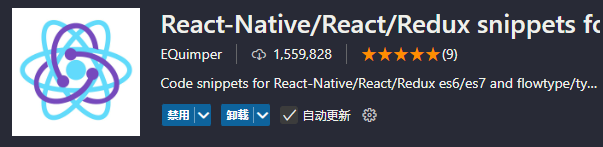
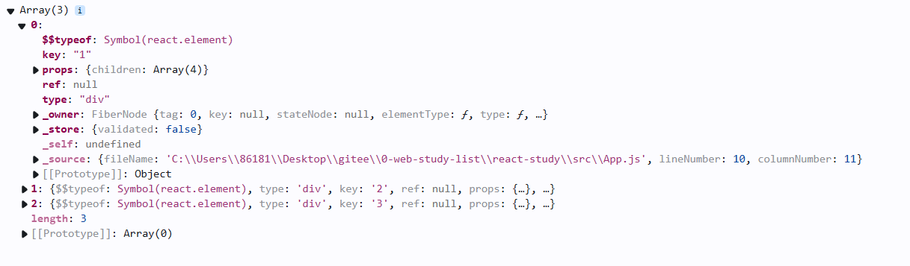

## React 入门


### React 基本介绍

[React官网](https://reactjs.org/)

React几个重要版本的重大更新

- React16: 出现了Fiber，整个更新变的可中断、可分片、具有优先级
- React16.8: 推出了Hooks，标志着从类组件正式转为函数组件
- React17: 过渡版本，没有添加任何面向开发人员的新功能。而主要侧重于升级简化React本身
- React18
    - transition
    - Suspense
    - 新的Hooks
    - Offscreen


#### React的特点

- 轻量：React的开发版所有源码（包含注释）仅3000多行
- 原生：所有的React的代码都是用原生Js书写而成的，不依赖其他任何库
- 易扩展：React对代码的封装程度较低,所以React中的很多功能都可以扩展。
- 不依赖宿主环境：React.只依赖原生JS语言，不依赖任何其他东西，包括运行环境。因此，它可以被轻松的移植到浏览器、桌面应用、移动端
- 渐近式：React并非框架，对整个工程没有强制约束力。这对与那些已存在的工程，可以逐步的将其改造为React,而不需要全盘重写。
- 单向数据流：所有的数据自顶而下的流动
- 用JS代码声明界面
- 组件化


#### React的开发环境

[react官方脚手架文档](https://cra.nodejs.cn/docs/getting-started)

```shell
npx create-react-app my-app
cd my-app
npm start
```

vscode的相关插件


### JSX基础语法

- JSX基础语法
- createElement方法

#### JSX基础语法

在React中，使用JSX来描述页面
```jsx
function App() {
    return (
        <div>Hello React</div>
    )
}
```

可以把类似于HTML的代码单独提取出来，例如：

```jsx
function App() {
    const ele = (
        <ul>
            <li>React</li>
            <li>React</li>
            <li>React</li>
            <li>React</li>
        </ul>
    )
    return (
        ele
    )
}
```

关于JSX的语法规则：

- 根元素只能有一个
    
    ```jsx
    // 只能由一个根元素
    // 下面是两个根元素的错误示范
    function App() {
        return (
            <div>Hello React</div>
            <div>Hello React</div>
        )
    }
    ```
    报错信息如下：

    

    对于上面的解决方案可以在最外层用一个闭合标签包裹，这里因为html的语义化所以提供了`<></>`空标签进行闭合，类似于vue的`<template>`

- JSX中使用JS表达式，表达式必须写在`{}`中

    ```jsx
    function App() {
        const name = "React"
        return (
            <div>{"Hello" + name}</div>
        )
    }
    ```

- 属性值指定为字符串字面量，或者在属性值中插入一个JS表达式

    ```jsx
    function App() {
        const name = "three"
        return (
            <ul>
                <li id="one">React</li>
                <li id="two">React</li>
                <li id={name}>React</li>
                <li>React</li>
            </ul>
        )
    }
    ```


- style对应样式对象，class要写作className

    ```jsx
    function App() {
        const style1 = {
            color: "red",
            // 驼峰写法 例如这里的font-size得写成fontSize
            fontSize: "20px"
        }
        return (
            <ul>
                <li style={style1}>React</li>
                <li className="one">React</li>
                <li>React</li>
                <li>React</li>
            </ul>
        )
    }
    ```

- 注释需要卸载花括号

    ```jsx
    function App() {
        const style1 = {
            color: "red",
            fontSize: "20px"
        }
        return (
            <ul>
                {/* 这是一个注释 */}
                <li style={style1}>React</li>
                <li className="one">React</li>
                <li>React</li>
                <li>React</li>
            </ul>
        )
    }
    ```

- JSX允许在模板中插入数组，数组会自动展开所有成员

    ```jsx
    function App() {
        const arr = [
            (<li>React</li>),
            (<li>Vue</li>),
            (<li>Anguler</li>),
        ]
        const userInfo = [
            {id:1,name:"张三",age:18},
            {id:2,name:"李四",age:19},
            {id:3,name:"王二麻子",age:20}
        ]

        const arr1 = userInfo.map(item => {
            return (
                <div key={item.id}>姓名：{item.name} 年龄： {item.age}</div>
            )
        })

        console.log(arr1)

        return (
            <ul>
                {/* 这是一个注释 */}
                <li style={style1}>React</li>
                <li className="one">React</li>
                <li>React</li>
                <li>React</li>
            </ul>
            {/* 数组会自动展开所有成员 */}
            {arr}
        )
    }
    ```
    上面打印的结果如下图：
    


#### createElement方法

> JSX是一种js的语法拓展，Babel会把JSX转译为React.createElement()函数进行调用

```js
React.createElement(type, [props], [...children])
```

**参数说明:**

- type: 创建的React元素类型(可选值有：标签名字符串、React组件)
- props(可选): React元素属性
- children(可选): React元素的子元素

下面两种代码的作用完全是相同的

```jsx
const element1 = (
    <h1 className="greeting">
        Hello, world!
    </h1>
)

// 上面的代码会被编译成如下代码
const element2 = React.createElement(
    'h1',
    {className: 'greeting'},
    'Hello, world!'
)
```

这些对象被称为“React元素”。它们描述了你希望在屏幕上看到的内容
可以看出，JSX的本质其实就是React.createElement()方法的语法糖


### 组件与时间绑定

- React中的组件
- 为组件绑定事件
- this的指向
- 向事件处理函数传参

#### React中的组件

> 在React中，可以通过使用类的方式声明一个组件，同时还支持使用函数的方式声明一个组件

```jsx
// 类组件

class 类名 extends React.Component {
    render(){
        return (
            // 组件的JSX代码

        )
    }
}

// 函数组件

function 组件名() {
    return (
        // 组件的JSX代码
    )
}
```

早期的函数组件被称为无状态组件，一般纯做UI展示，里面不会有复杂的逻辑
但是从16.8推出了Hooks之后，函数组件使用更多


#### 为组件绑定事件

> 在react中绑定事件的写法如下

```jsx
<button onClick={handleClick}>点我</button>
```

在react中无法通过`return false`的方式来阻止事件的默认行为，需要使用preventDefault()方法

```jsx
// 函数式组件
function Form() {
    function handleClick(event) {
        // 阻止默认行为
        event.preventDefault()
        console.log("按钮被点击了")
    }

    return (
        <form onSubmit={handleClick}>
            <button type="submit">确 定</button>
        </form>
    )
}

// 类组件
class Form extends React.Component {
    // 对于类组件而言，事件处理函数写作一个类方法
    handleClick(event) {
        // 阻止默认行为
        event.preventDefault()
        console.log("按钮被点击了")
    }

    render() {
        return (
            <form onSubmit={this.handleClick}>
                <button type="submit">确 定</button>
            </form>
        )
    }
}
```

`event`对象这里是一个合成事件，与原生事件不符，可以通过`event.nativeEvent`来获取原生事件

```jsx
eventHandler(event) {
    e.nativeEvent // 原生事件
}
```


#### this的指向

> 由于JS的this的特殊性，事件处理函数中的this并不会指向当前的组件，这就需要我们自行对this进行指向的修正，this的修正只针对类组件

- 将事件处理函数修改为箭头函数
- 将事件绑定修改为箭头函数
- 使用bind方法来强制绑定this的指向

```jsx

class Form extends React.Component {
    // 对于类组件而言，事件处理函数写作一个类方法
    handleClick(event) {
        // 打印结果为undefined
        // 针对this指向问题进行改造
        console.log(this) 
    }

    // 1. 将事件处理函数修改为箭头函数
    // handleClick = (event) => {
    //     // 打印结果为当前组件的实例
    //     console.log(this) 
    // }

    // 2. 将事件绑定修改为箭头函数
    // <form onSubmit={() => this.handleClick()}>

    // 3. 使用bind方法来强制绑定this的指向(在构造器中绑定)
    // constructor() {
    //     super()

    //     // 为了在回调中使用`this`，绑定必不可少
    //     this.handleClick = this.handleClick.bind(this)
    // }


    render() {
        return (
            <form onSubmit={this.handleClick}>
                <button type="submit">确 定</button>
            </form>
        )
    }
}
```


#### 向事件处理程序传参

> 对于一个类组件，如果要传递参数，可以使用下面的两种方式来进行传参

- 通过bind方法在绑定this指向时向事件处理函数进行传参
- 绑定事件时，通过书写箭头函数的形式来传参

```jsx
// 类组件传参
<button onClick={(e) => this.handleClick(id,e)}>点 我</button>
<button onClick={this.handleClick.bind(this,id)}>点 我</button>
```

> 对于函数组件，传参如下

```jsx
<button onClick={(e) => this.handleClick(id,e)}>点 我</button>
```


### 组件状态和数据传递

- 组件状态
- props
- props验证
- 状态提升

#### 组件状态

> 早期类组件被称之为有状态组件，就是因为在类组件中能维护组件数据

```jsx
class 类 extends React.Component {
    constructor() {
        super()
        this.state = {
            // 组件状态数据
        }
    }
    render() {
        return (
            // 通过{this.state.xxx} 来获取状态数据
        )
    }
}

// 或者
class 类名 extends React.Component {
    state = {
        // 组件状态数据
    }
    render(){
        return (
            // 通过{this.state.xxx} 来获取状态数据
        )
    }
}


// 关于类组件修改状态数据
// 不要直接修改状态值，应该通过setState方法修改
class 类名 extends React.Component {
    state = {
        num: 1
    }

    handleClick = () => {
        // 修改num的值，+1
        this.setState({
            // 底层实际上就是调用了Object.assign()方法将新老对象合并
            num: this.state.num + 1
        })
    }

    render(){
        return (
            <>
                <h1>{this.state.num}</h1>
                <button onClick={this.handleClick}>点我</button>
            </>
        )
    }
}
```

`setState`它对状态的改变可能时异步的,处于性能的考虑，react会把多个`setState`的调用合并成一个调用
如果改变状态的代码处于某个HTML元素的事件中就是异步的，否则是同步的


```jsx
state = {
    num: 1
}


// 例如下面的代码，有多个`setState`调用，但是由于时异步的，
// 因此他们拿到的`this.state.num`的值都是1，最终的结果就是2并非是4
// 也就是相当于调用了三次this.setState({num: 1 + 1})

handleClick = () => {
        this.setState({
            num: this.state.num + 1
        })
        this.setState({
            num: this.state.num + 1
        })
        this.setState({
            num: this.state.num + 1
        })
    }
```


如果在事件处理函数里面想要拿到setState执行后的数据，这里有两种方式

```jsx
// 1. 使用回调函数
this.setState({
    num: this.state.num + 1
},() => {
    console.log(this.state.num)
})

// 2. 提前使用变量存储
let newNum = this.state.num + 1
this.setState({
    num: newNum
})
console.log(newNum)
```

**最佳实践**
1. 把所有的setState当作是异步的
2. 永远不要信任setState调用完后的值得状态，因为setState可能是异步的
3. 如果要使用改变之后的状态，需要使用回调函数(setState的第二个参数)
4. 如果新的状态要根据之前的状态进行运算，使用函数的方式改变状态(setState第一个参数)

**这里写着会发现一个问题：就是在回调函数中处理改变后得数据会造成多次嵌套**
react提供了解决办法，将函数作为参数传入`setState`，这个函数用上一个state作为第一个参数，将此次更新被应用时得props做为第二个参数

```jsx
this.setState(
    // 函数得返回值是一个对象，`({})`，因此得用()否则会以为是函数的声明
    (state,props) => ({
        counter: state.counter + props.increment
    })
)
```


React将多次的setState进行合并调用(将多次状态改变完成，再统一对state进行改变，然后触发render)

#### props

> 组件之间进行数据的传递

如果是父组件向子组件传递数据，则使用props

如果是函数组件，props作为函数的一个参数传入

```jsx
function A(props) {
    return (
        // 通过props.xxx来获取props数据
        <div>
            <p>姓名：{props.userInfo.name}</p>
            <p>年龄：{props.userInfo.age}</p>
            <p>性别：{props.userInfo.sex}</p>
            <p>content：{props.content}</p>
        </div>
    )
}
```

如果是类组件，则需要在constructor中通过super(props)来获取

```jsx
class B extends React.Component {
    render() {
        return (
            // 通过this.props.xxx来获取props数据
            <div>
                <p>姓名：{this.props.userInfo.name}</p>
                <p>年龄：{this.props.userInfo.age}</p>
                <p>性别：{this.props.userInfo.sex}</p>
                <p>content：{this.props.content ? "true" : "false"}</p>
            </div>
        )
    }
}

// 父组件
import B from './B'
import A from './A'

function App() {
    let userInfo = {
        name: '张三',
        age: 18,
        sex: '男',
    }

    return (
        <>
            {/* 传递number类型 */}
            <A userInfo={userInfo}, content={1}/>
            {/* 传递boolean类型 */}
            <B userInfo={userInfo}, content={true}/>
        </>
    )
}
```


通过`props.children`可以实现类似于vue的插槽功能

```jsx
// 按钮组件代码
// Button.jsx
import React from 'react';

class Button extends React.Component {
    render() {
        return (
            <button>{this.props.children}</button>
        )
    }
}

export default Button;


// 父组件代码
// App.jsx
import Button from "./components/Button"

function App() {
  return (
      <Button>点我</Button>
  )
}

export default App;

```


#### props验证

在vue中，可以对传入的props设置默认值，验证props的有效性，在react中也可以

通过defaultprops设置默认值

```jsx
// 函数式组件

function A(props) {
    return (
        // 通过props.xxx来获取props数据
        <div>
            <p>姓名：{props.userInfo.name}</p>
            <p>年龄：{props.userInfo.age}</p>
            <p>性别：{props.userInfo.sex}</p>
            <p>content：{props.content}</p>
        </div>
    )
}

//　设置默认值
A.defaultProps = {
    userInfo: {
        name: '张三',
        age: 18,
        sex: '男'
    },
    content: 1
}


// 类组件
class B extends React.Component {
    render() {
        return (
            // 通过this.props.xxx来获取props数据
            <div>
                <p>姓名：{this.props.userInfo.name}</p>
                <p>年龄：{this.props.userInfo.age}</p>
                <p>性别：{this.props.userInfo.sex}</p>
                <p>content：{this.props.content ? "true" : "false"}</p>
            </div>
        )
    }
}

// 设置默认值
B.defaultProps = {
    userInfo: {
        name: '张三',
        age: 18,
        sex: '男'
    },
    content: false
}
```


类型检查，从Reactv15.5开始，移入到了prop-types模块中

- 安装

```shell
npm i prop-types
```

- 使用

```jsx
import PropTypes from 'prop-types'

function A(props) {
    return (
        <>
            <p>姓名：{props.name}</p>
        </>
    )
}

// 类型检查
A.propTypes = {
    name: PropTypes.string
}
```


#### 状态提升

在vue中，父传子通过props，子传父通过触发自定义事件(emit)
在React中，如果子组件要向父组件传递数据，同样是通过触发父组件传递给子组件的事情来进行传递的
在官网被称为[状态提升](https://zh-hans.react.dev/learn/sharing-state-between-components)

```jsx
// Button.jsx
import React from 'react';

class Button extends React.Component {

    ClickchangeState = ()=>{
        this.props.changeState(3)
    }

    render() {
        return (
            <button onClick={this.ClickchangeState}>{this.props.children}</button>
        )
    }
}

export default Button;


// App.jsx
import Button from "./components/Button"

function App() {

    const handleChangeState = (num) => {
        console.log("子组件传来的数据：",num)
    }

    return (
        <>
            <Button changeState={handleChangeState}>你好</Button>
        </>
    )
}
```