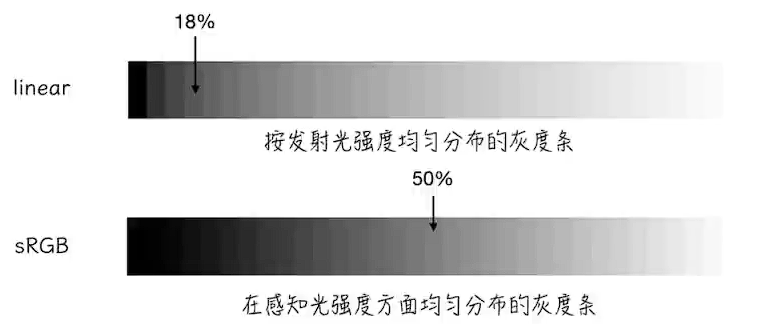

# three.js使用

## 快速入门
```js
// 导入three.js
import * as THREE from "three"

// 创建场景
const scene = new THREE.Scene()

// 创建相机
const camera = new THREE.PerspectiveCamera(
    45, // 视角,同样的距离视角越大看到的越多
    window.innerWidth / window.innerHeight,//相机的宽高比
    0.1, // 近平面 相机最近能看到什么
    1000 // 远平面 相机最远能看到什么
)

// 创建渲染器
const renderer = new THREE.WebGLRenderer()
// 要渲染的尺寸大小
renderer.setSize(window.innerWidth,window.innerHeight) 
// 把画布添加到body上，这里的enderer。domElement就是画布，其实就是canva标签
document.body.appendChild(renderer.domElement)

// 创建几何体
// 创建立方体
const geometry = new THREE.BoxGeometry(1,1,1)
// 创建材质
const material = new THREE.MeshBasicMaterial({ color:0x00ff00 })
// 创建网格
const cube = new THREE.Mesh(geometry,material)
// 将网格添加到场景中
scene.add(cube)
// 设置相机的位置
// 其他轴不设置均为0
camera.position.z = 5
// 相机看向哪里
// 默认看向原点，所以这里也可以不设置
camera.lookAt(0,0,0)

// 这个时候看到的视角是固定不动的，因此需要定义一个渲染函数
function animate(){
    // 请求自己这个函数。这里就是为了实现动画是一帧一帧播放的
    requestAnimationFrame(animate)
    // 旋转
    cube.rotation.x += 0.01
    cube.rotation.y += 0.01

    //渲染
    renderer.render(scene,camera)
}
animate()
// 渲染
renderer.render(scene,camera)
```

## 开发入门
### 坐标辅助器

```js
// 添加世界坐标辅助器
// 实例化坐标系对象
const axesHelper = new THREE.AxesHelper(5)
// 添加到场景中，场景中蓝色为z轴，绿色为y轴，红色为x轴
scene.add(axesHelper)
```

### 轨道控制器
```js
// 导入轨道控制器对象
import { OrbitControls } from "three/examples/jsm/controls/OrbitControls.js"
// 添加轨道控制器
// 实例化轨道控制器
const controls = new OrbitControls(camera,renderer.domElement)
// 设置带阻尼(让它有惯性)
controls.enableDamping = true
// 设置阻尼的系数
controls.dampingFactor = 0.01
// 设置自动旋转
controls.autoRotate = true
// 设置自动旋转的速度
controls.autoRotateSpeed = 100
// enablePan 平移
// enableZoom 缩放


// 以上的方法实现都必须在渲染函数中加上一个update()
function animate(){
    controls.update()
    // 请求自己这个函数。这里就是为了实现动画是一帧一帧播放的
    requestAnimationFrame(animate)
    // 旋转
    cube.rotation.x += 0.01
    cube.rotation.y += 0.01

    //渲染
    renderer.render(scene,camera)
}
animate()
```

### 物体位移与父子元素
```js
const material = new THREE.MeshBasicMaterial({ color:0xe89ca3 })
const parentmaterial = new THREE.MeshBasicMaterial({color:0x306da3})
// 创建网格
const parentcube = new THREE.Mesh(geometry,parentmaterial)
const cube = new THREE.Mesh(geometry,material)
parentcube.add(cube)

// position 三维向量对象,这个位是相对于父元素的
parentcube.position.set(-2,0,0)
// cube.position.x = 2
cube.position.set(2,0,0)

// 将网格添加到场景中
scene.add(parentcube)
```
### 物体的缩放和旋转
```js
// 物体的缩放
// x轴放大两倍，y轴放大三倍，z轴不变，且父元素缩放，子元素更着缩放
parentcube.scale.set(2,2,2)
// 物体的旋转
// 绕着x轴旋转 rotation是旋转对象,随着父元素的旋转而旋转
parentcube.rotation.x = Math.PI / 4
```
### 设置响应式画布和全屏效果
```js
// 监听窗口的变化
window.addEventListener("resize",()=>{
  // 重置渲染器的宽高比
  renderer.setSize(window.innerWidth,window.innerHeight)
  // 重置相机宽高比
  camera.aspect = window.innerWidth / window.innerHeight
  // 更新相机投影矩阵
  camera.updateProjectionMatrix()
})

// 全屏控制
let btn = document.createElement("button")
btn.innerHTML = "点击全屏"
btn.style.position = "absolute"
btn.style.top = "10px"
btn.style.left = "10px"
btn.style.zIndex = "999"
btn.onclick = function(){
  renderer.domElement.requestFullscreen()
}
document.body.appendChild(btn)
```

### 通过GUI调试开发3D效果

```js
// 创建gui对象
const gui = new GUI()
// 添加按钮
gui.add(eventObj,"Fullscreen").name("全屏")
gui.add(eventObj,"ExitFullscreen").name("退出全屏")
// 控制立方体位置
let folder = gui.addFolder("子元素立方体位置")
// 这里有俩个事件，改变的数值onChange(),最后一次改变的数值onFinishChange()
folder.add(cube.position,"x").min(-5).max(5).step(1).name("x轴的位置")
folder.add(cube.position,"y").min(-5).max(5).step(1).name("y轴的位置")
folder.add(cube.position,"z").min(-5).max(5).step(1).name("z轴的位置")

// 控制材质
gui.add(parentmaterial,"wireframe").name("开启父元素线框模式")

// 控制颜色
let colorParams = {
  cubeColor:"##ff0000",
}
gui.addColor(colorParams,"cubeColor").name("子元素立方体颜色").onChange(val => {
  cube.material.color.set(val)
})
```

### 几何体顶点/索引/面(图形的由来)
```js
// 创建几何体
const geometry = new THREE.BufferGeometry()
// 创建顶点数据
// 这个是顶点绘制，会发现顶点重复了不会共用
const vertices = new Float32Array([
    -1.0,-1.0,0.0,1.0,-1.0,0.0,1.0,1.0,0.0,
])

// 创建顶点属性
geometry.setAttribute("position",new THREE.BufferAttribute(vertices,3))
// 创建材质,顶点是有顺序的，每三个为一个顶点，逆时针为正面
const material = new THREE.MeshBasicMaterial({
    color:0x00ff00,
    // wireframe: true
})
const plane = new THREE.Mesh(geometry,material)
scene.add(plane)


// 采用索引的方式绘制
const vertices = new Float32Array([
    -1.0,-1.0,0.0,1.0,-1.0,0.0,1.0,1.0,0.0,-1.0,1.0,0.0
])
// 创建顶点属性
geometry.setAttribute("position",new THREE.BufferAttribute(vertices,3))
// 创建索引值
const index = new Uint16Array([0,1,2,2,3,0])
// 创建所应属性
geometry.setIndex({new THREE.BufferAttribute(index,1)})
// 创建材质,顶点是有顺序的，每三个为一个顶点，逆时针为正面
const material = new THREE.MeshBasicMaterial({
    color:0x00ff00,
    // wireframe: true
})
const plane = new THREE.Mesh(geometry,material)
scene.add(plane)

// 不同索引设置不同材质
const vertices = new Float32Array([
    -1.0,-1.0,0.0,1.0,-1.0,0.0,1.0,1.0,0.0,-1.0,1.0,0.0
])
// 创建顶点属性
geometry.setAttribute("position",new THREE.BufferAttribute(vertices,3))
// 创建索引值
const index = new Uint16Array([0,1,2,2,3,0])
// 创建所应属性
geometry.setIndex({new THREE.BufferAttribute(index,1)})
// 设置两个顶点组，形成两个材质
// 后面的三个数分别代表从哪个索引开始，一共几个索引以及用第几个材质
// 0,3,0  => 从上面索引数组的第一个元素开始一共往后三个元素即0,1,2 用的是第0个材质
// 0,3,0  => 从上面索引数组的第三个元素开始一共往后三个元素即2,3,0 用的是第1个材质
geometry.addGroup(0,3,0)
geometry.addGroup(3,3,1)

// 创建材质,顶点是有顺序的，每三个为一个顶点，逆时针为正面
// 材质0
const material0 = new THREE.MeshBasicMaterial({
    color:0x00ff00,
    // wireframe: true
})
//材质1
const material1 = new THREE.MeshBasicMaterial({
    color:0xff0000,
    // wireframe: true
})
const plane = new THREE.Mesh(geometry,[material0,material1])
scene.add(plane)
```

## 全面认识物体

### 常见的几何体
[常见的几何体](https://threejs.org/docs/#api/zh/geometries/BoxGeometry)

### 基础材质的贴图

1. 贴图的介绍
    - 贴图
        - 一个背景空白的图片
        - 贴上去以后设置透明性为true(如果贴图和所设置的形状不符合空白背景会渲染杂色，这样可以去除空白背景的渲染)
    - 透明贴图
        - 由黑色和白色组成：黑色区域完全透明，白色区域完全不透明
        - 这层透明贴图贴上以后，贴图的透明度将根据这张透明贴图来进行透明度处理
    - 环境贴图
        - 就是改变画布背景的贴图
        - 反射率，默认1.00，会在材质中反射一些环境的东西(比如光滑金属材质就会反射的更多)
    - 高光贴图
        - 这个是用来完成不同位置的不同材质的反射情况
    - 光照贴图
        - 相当于有一束带着光照贴图样式的光打到了贴图上
    - 环境光遮蔽贴图
        - 阴影贴图，即使光达到了两个材质或者缝隙中那个缝隙会比其他的地方要黑

2. 代码的对应实现

```js
// 导入hdr加载器
import { RGBEloader } from "three/examples/jsm/loaders/RGBELoader.js"
// 创建纹理的加载器
let textureLoader = new THREE.TextureLoader()
// 实例化rgbeLoader ，加载hdr贴图
let rgbeLoader = new RGBELoader()
// 加载贴图资源
let texture = textureLoader.load("贴图的位置")
// 环境遮挡贴图加载
let aomap = textureLoader.load("环境遮挡贴图的位置")
// 透明贴图
let alphamap = textureLoader.load("透明度贴图的位置")
// 高光贴图
let specularmap = textureLoader.load("高光贴图贴图的位置")
// 光照贴图
let lightmap = textureLoader.load("光照贴图的位置")
// 环境贴图
rgbeLoader.load("环境贴图位置,hdr图片格式",(envmap) => {
    // 设置球形贴图(球形映射)
    envmap.mapping = THREE.EquiretangularReflectionMapping
    // 设置环境贴图
    scene.background = envmap
    // 设置环境贴图
    scene.environment = envmap
    // 设置plane的环境贴图
    planeMaterial.envMap = envmap
})
// 创建对应的贴图平面
let planeGeometry = new THREE.planeGeometry(1,1)
// 创建材质
let planeMaterial = new THREE.MeshBasicMaterial({
    color: 0xffffff,
    // 设置贴图
    map: texture,
    // 允许透明
    transparent: true,
    // 设置ao(环境遮罩)贴图
    aoMap: aomap,
    // aot贴图强度,默认是1
    aoMapIntensity: 1,
    // 设置透明度贴图
    alphaMap: alphamap,
    // 设置光照贴图
    lightMap: lightmap,
    // 反射率,默认为1
    reflectivity: 1,
    // 设置高光贴图
    specularMap:  specularmap,
})
//创建对应的几何体
let plane = new THREE.Mesh(planeGeometry,planeMaterial)
// 添加到场景中
scene.add(plane)

```

### 纹理属性


```js
// 因为这两套标准，因此我们在人的感知时采用sRGB的标准
// 因此上面代码中的贴图我们要设置为sRGB标准
// 创建纹理的加载器
let textureLoader = new THREE.TextureLoader()
// 加载贴图资源
let texture = textureLoader.load("贴图的位置")
// 设置为sRGB标准
texture.colorSpace = THREE.SRGBColorSpace
// 默认不设置就是线性空间的标准,即如下
texture.colorSpace = THREE.LinearSRGBColorSpace

// 对应的gui代码
gui.add(texture,"colorSpace",{
    sRGB:SRGBColorSpace,
    Linear:LinearSRGBColorSpace,
})
,onChange(()=>{
    texture.needUpdate = true
})
```

### 场景线性雾和指数雾

```js
const boxGeometry = new THREE.BoxGeometry(1,1,100);
const boxMaterial = new THREE.MeshBasicMaterial({
    color:0x00ff00,
})；
const box = new THREE.Mesh(boxGeometry,boxMaterial);
scene.add(box);

// 设置背景颜色
sene.background = new THREE.Color(0x999999)
// 创建场景雾
// 线性雾
scene.fog = new THREE.Fog(0x999999,0.1,50)
// 指数雾,前面时雾的颜色，后面时雾的密度
scene.fog = new THREE.FogExp2(0x999999,0.1)
```


### 光线投射

- 案例
```js
const sphere1 = new THREE.Mesh(
    new THREE.SphereGeometry(1,32,32),
    new THREE.MeshBasicMaterial({
        color:0xff0000,
    })
)
sphere1.position.x = -4;
scene.add(sphere1);

const sphere2 = new THREE.Mesh(
    new THREE.SphereGeometry(1,32,32),
    new THREE.MeshBasicMaterial({
        color:0x0000ff,
    })
)
scene.add(sphere2);

const sphere3 = new THREE.Mesh(
    new THREE.SphereGeometry(1,32,32),
    new THREE.MeshBasicMaterial({
        color:0x00ff00,
    })
)
sphere3.position.x = 4;
scene.add(sphere3);

// 创建射线
const raycaster = new THREE.Raycaster();
//创建鼠原向量
const mouse = new THREE.Vector2();

window.addEventListener("click",(event) => {
    // 设置鼠标向量的x，y值
    mouse.x = (event.clientX / window.innerWidth) *2 - 1 
    mouse.y = (event.clientY / window.innerHeight) *2 + 1 

    // 通过摄像机和鼠标的位置更新射线
    raycaster.setFromCamera(mouse,camera)

    // 计算物体和射线的焦点,[sphere1.sphere2,sphere3]这个是场景底下的子类对象数组
    const intersects = raycaster.intersectObjects([sphere1.sphere2,sphere3])

    if(intersects.length > 0) {

        if(intersects[0].object._isSelect){
            intersects[0].object.material.color.set(
                intersects[0].object._originselectColor
            )
            intersects[0].object._isSelect = false
            return
        }

        intersects[0].object._originselectColor = intersects[0].object.material.color.getHex()
        intersects[0].object._isSelect = true
        intersects[0].object.material.color.set(0xff0000)
    }
})
```

### 补间动画

- 案例
```js
import * as TWEEN from "three/examples/jsm/libs/tween.module.js"

// 创建一个球模型
const sphere1 = new THREE.Mesh(
    new THREE.SphereGeometry(1,32,32),
    new THREE.MeshBasicMaterial({
        color:0x0000ff,
    })
)
sphere.position.x = -4;
scene.add(sphere1);

const tween = new TWEEN.tween(sphere.position)
// 去x轴的位置为4的位置，花费事件1000ms
tween.to({ x:4 }, 1000)
// // 一直重复动画
// tween.repeat(Infinity)
// // 循环往复
// tween.yoyo(true)
// //延迟3s运行
// tween.delay(3000)


const tween1 = new TWEEN.tween(sphere.position)
// 去x轴的位置为4的位置，花费事件1000ms
tween1.to({ x:4 }, 1000)
// 第一个动画执行以后马上展示第二个动画
tween.chain(tween1) 

// 启动补间动画
tween.start()


//tween的回调函数
// 每次开始的回调函数
tween.onStart()
// 每次完成的回调函数
tween.onComplete()
// 每次停止的回调函数
tween.onStop()
// 每次更新的回调函数
tween.onUpdate()

// 渲染函数
function animate() {
    requestAnimationFrame(animate)
    renderer.render(scene,camera)
    // 更新tween
    tween.update()
}
```

