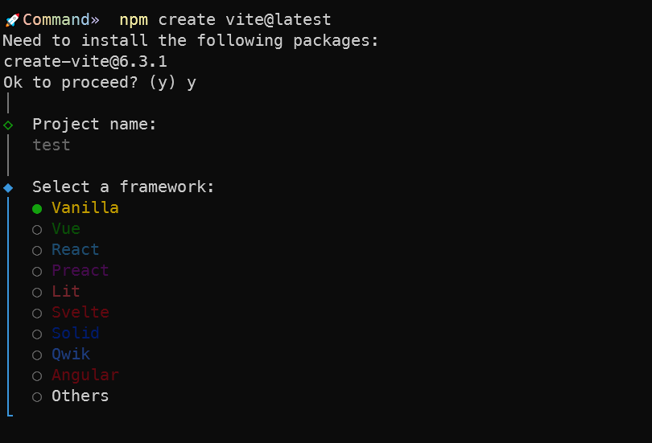

## vite

### 什么是vite

> vite的原理流程示意图


> vite其实是构建工具的高级封装

vite在开发时采用了esbuild，而在打包时采用了rollup


### vite的脚手架功能

> vite作为一个脚手架可以快速构建起一个项目工程目录

- vue
```shell
npm create vite@latest
```

在这里我们可以选择对应的模板然后快速搭建一个以vite为基础的前端项目




这里得注意一下，vite默认创建的是vue3的项目
如果想要创建vue2项目我们可以选择vanilla空模板，然后我们手动创建vite.config.js文件，然后安装vue2相关插件

```shell
pnpm add vite-plugin-vue2
pnpm add vue@2.7.14
```
然后在vite的配置文件中注册vue2插件
```js
import { createVuePlugin } from 'vite-plugin-vue2'


export default {
    plugins: [createVuePlugin()]
}
```

然后更改index.html文件中的js引入路径为src中的main.js文件
创建src文件夹，然后在src文件夹中创建main.js文件和App.vue文件

```js
import vue from 'vue'
import App from './App.vue'

new Vue({
    el: '#app',
    render: h => h(App),
}).$mount()
```

当然如果你不想自己配置也可以去找到对应的模板`awesome-vite`,找到模板然后进行clone


### vite中使用各种css功能

#### css verb

> vite本身支持css verb的语法，因此我们可以直接使用css的原生语法，例如下面的写法：

```css
:root {
    --main-background-color: #ffffff;
}

.root {
    background-color: var(--main-background-color);
}
```

#### postcss的支持

> vite本身内置了postcss，因此我们如果想要使用postcss的各种功能，只需要在项目的根目录下创建一个postcss.config.js即可在配置文件中注册postcss的插件，例如：


```js
module.exports = {
    plugins: [
        require("postcss-nested"),
        require("postcss-each-variables"),
        require("postcss-each")({
            plugins: {
                beforeEach: [require("postcss-for"), require("postcss-color-mix")],
            },
        }),
        require("cssnano")({ preset: "default" })
    ],
};
```

#### 路径映射

> css由于引入了import语法，这里就导致了我们在引入样式文件的时候要按照文件的路径进行导入，vite本身可以配置路径映射来优化导入时的路径繁琐问题，例如：

```js
export default defineConfig({
    plugins: [vue()],
    resolve: {
        alias: {
            "@styles": "/src/styles"
        }
    }
})
```

有了上面的配置以后我们就可以在项目中直接使用`@styles/xxx.css`的方式来引入样式文件了。


#### css模块化

> vite支持css模块化，只需要在引入样式文件的时候加上`module`关键字即可开启css的模块化功能,例如`test.module.css`。


#### css预处理器

> vite支持各种css预处理器，只需要在项目中安装对应的插件即可使用例如：

```shell
pnpm add sass
pnpm add less
```

### vite中使用ts

> 在vite中使用ts只进行编译不进行任何的校验工作.


#### tsconfig配置文件
我们需要修改tsconfig.json文件来配置ts的编译选项，例如：

```json
{
  "extends": "@vue/tsconfig/tsconfig.dom.json",
  "compilerOptions": {
    "target": "ES2020",
    "useDefineForClassFields": true,
    "module": "ESNext",
    "lib": ["ES2020", "DOM", "DOM.Iterable"],
    "skipLibCheck": true,

    /* Bundler mode */
    "moduleResolution": "bundler",
    "allowImportingTsExtensions": true,
    "resolveJsonModule": true,
    "isolatedModules": true,
    "noEmit": true,
    "jsx": "preserve",
    "jsxImportSource": "vue",

    /* Linting */
    "strict": true,
    "noUnusedLocals": true,
    "noUnusedParameters": true,
    "noFallthroughCasesInSwitch": true
  },
  "include": ["packages/**/*.ts", "packages/**/*.tsx", "packages/**/*.vue"]
}
```

#### ts校验

> 遂于vue使用vue-tsc进行ts的编译校验,通常在package.json中配置scripts脚本，例如：


```json
scripts:{
    build: "vue-tsc --noEmit tsc --noEmit && vite build",
}
```

#### isolatedModules

> isolatedModules: true 开启后，ts会校验文件之间的依赖关系。


1. 支持独立编译
2. 防止某些全局类型推导带来的问题
3. 避免 `const enum` 带来的问题


#### vite client

> vite本身支持一些内部变量，例如：`import.meta.env`,这个时候ts无法识别对应的类型，因此我们需要在tsconfig.json中配置对应的类型定义文件，例如：

```json
{
    "compilerOptions":{
        "types": ["vite/client"]
    }
}
```

client的类型：
- asset import import静态文件返回类型
- env 环境变量
- HMR API 模块热更新的api 例如`import.meta.hot`
- 静态资源 (例如我们可以这样导入静态资源： import pngUrl from './xxx.png') 如果没有配置是不认识这个png文件是什么类型的。


### vite处理静态资源的方法

#### 静态资源导入

> vite提供了三种静态资源导入方式：

- url: 导入静态资源路径
- raw: 导入静态资源内容

```js
// 三种写法
import imgUrl from './xxx.png?url'
console.log(imgUrl)
import imgRaw from './xxx.png?raw'
console.log(imgRaw)
```
- worker/worker inline

```js
// worker.js
var i = 0
function timeCount(){
    i = i+1
    postMessage(i)
    setTimeout(timeCount, 500)
}

timeCount()

// main.js
import Worker from './worker.js?worker'
const worker = new Worker()
worker.onmessage = (e) => {
    console.log(e)
}
```

#### JSON

> vite可以直接导入json文件

```js
// data.json
{
    "name": "xxx"
    "age": 18
    "sex": "male"
    "hobbies": ["football", "basketball"]
}

// main.js
import data from './data.json'
console.log(data)
import { name,age } from './data.json'
console.log(name, age)
```

#### web Aseembly

> web Aseembly 是一种可以让代码运行在浏览器中的二进制格式，vite可以直接导入web Aseembly文件

```js
// xx.wasm

import wasm from './xx.wasm?init'
// 返回一个promise对象
wasm().then(res => {
    res.do(...)
})
```


### vite集成eslint和prettier

> eslint是帮助我们规范我们代码书写的，pettier是帮助我们进行代码格式化的

对于集成eslint，在根目录下创建一个`.eslintrc.js`文件，但是在9版本以后默认使用`eslint.config.js`文件作为配置文件名，例如：

当然你这里要是觉得配置麻烦你也可以直接使用现成的标准，例如`eslint-config-standard`。

```shell
npm install --save-dev eslint eslint-config-standard
```

```js
// 你可以遵从cjs的写法，也可以遵从esm的写法
// 这里以cjs的写法为例

const standard = require('eslint-config-standard')

moudle.exports = {
    standards,
    {
        ...
    }
}
```

对于集成prettier，在根目录下创建一个`.prettierrc`文件

对于vscode我们要安装插件：


```json
{
    // 分号不添加
    "semi": false,
    // 使用单引号代替双引号
    "singleQuote": true,
}
```

然后我们在vscode的setting中寻找一个format on save的选项，勾选上即可。再搜索formatter，选择prettier即可。

我们配置到现在发现当我们推送代码的时候会发现代码格式还是不统一，这是因为我们没有配置husky

```shell
npm install husky -D
npx install husky
npx husky add .husky/pre-commit "npm run lint"
```


### vite的环境变量

> 在vite中我们可以通过`import.meta.env`来访问环境变量，例如：

一般有五个环境变量：
- DEV：是否是开发环境
- PROD：是否是生产环境
- MODE：可以是dev/prod/test等
- BASE_URL：根地址
- SSR：是否服务端渲染


不仅能使用vite自带的这几个，我们还可以在根目录下创建一个`.env`文件，在里面定义自己的环境变量，自定义的变量前面都要加VITE_，例如：VITE_TITLE。

这里要注意,对于`.env`文件，不同后缀的文件在不同的环境下会被加载，例如：`.env.development`只在开发环境下被加载，`.env.production`只在生产环境下被加载。

在`package.json`中我们可以通过指定`--mode`来指定不同的环境
对于`.env.test`文件中的环境变量在我们指定了`--mode test`之后就会被加载。
例如：

```json
scripts:{
    "dev": "vite --mode test",
}
```

我们自定义的变量，编译器会有提醒缺失，因此我们需要在src目录下创建一个`vite-env.d.ts`文件，在里面定义我们的环境变量类型

```ts
/// <reference types="vite/client" />
interface ImportMetaEnv {
    VITE_TITLE: string;
}
```


### vite的热更新(HMR)

> 热更新是指在代码修改之后，不需要重新加载整个页面，而是只更新修改的部分。

下面来实现一个最简单最具针对性的热更新案例：

```js
export function render () {
    document.querySelector('#app').innerHTML = `
        <h1>Vite App</h1>
        <a>Document</a>
    `
}

render()

if (import.meta.hot) {
    import.meta.hot.accept((newModule) => {
        render()
    })
}
```

我们在对页面进行修改之后，会发现页面并没有重新加载，而是直接更新了内容。这里打开网络请求会发现vite的热更新是通过websocket实现的，后面有一个websocket的服务器，每次在更新时会发送一个消息给websocket服务器，它时一个update事件，然后客户端接收到消息之后，就会执行我们的热更新代码。


从网络请求我们还能发现一开始加载的main.js文件，在更新页面以后，客户端会发送一个请求给服务器，然后服务器会返回一个更新的main.js文件。


基于上面的HMR的实现我们不难发现，对于Vue这种SFC,我们可以更容易直接写一个通用的HMR逻辑，因为这里一个vue文件就是一个模块，我们只需要监听这个模块的更新即可。