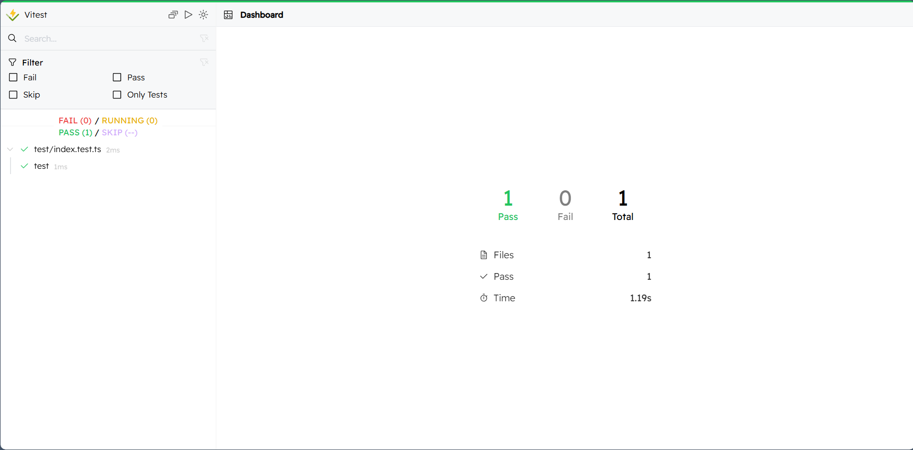
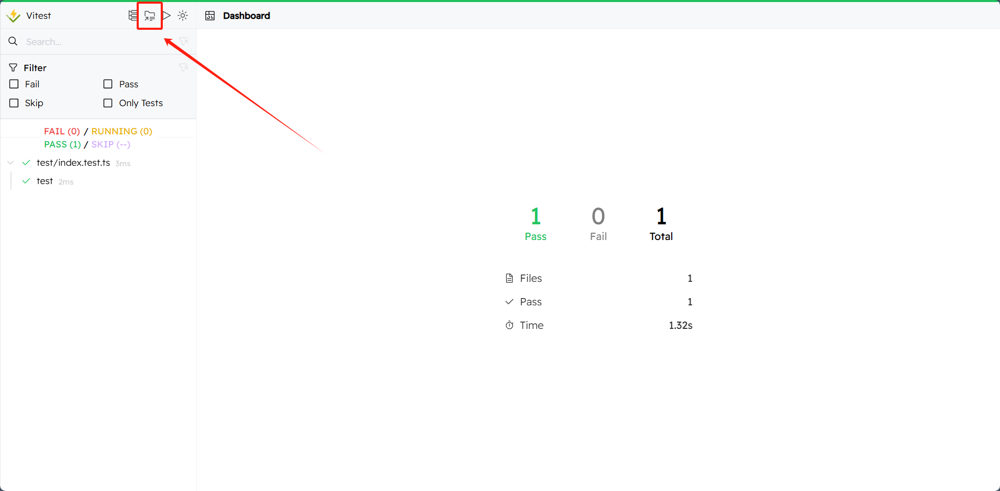
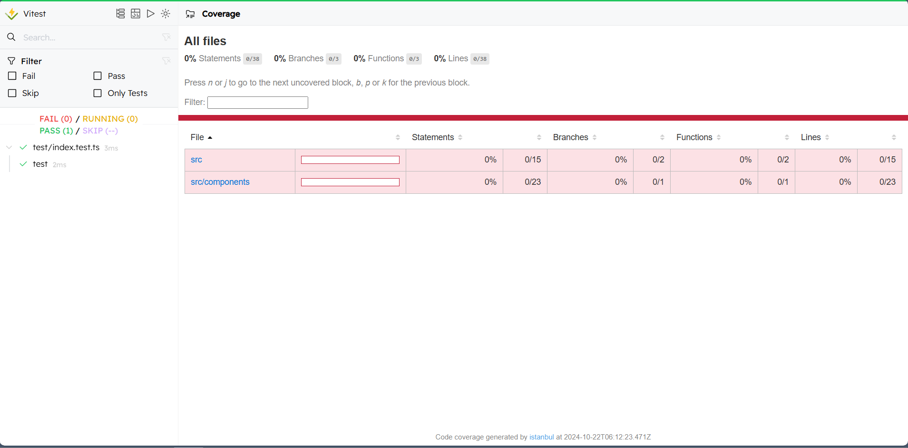
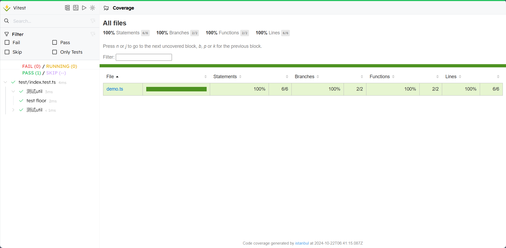
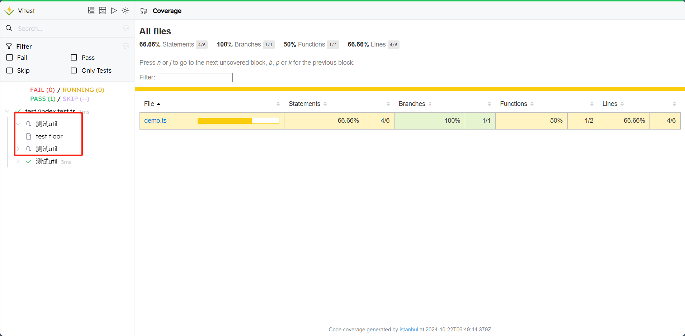

## 什么是vitest

> [vitest的中文官方文档](https://vitest.zhcndoc.com/guide/)
> vitest其实是一款搭配vite的前端单元测试的工具，取代了jasmine/jest，并且做到了兼容jest，同时支持esm/ts/jsx(支持非常好)

> 所以使用vitest来开启前端的ttd吧


- 安装

```shell
# npm安装
npm install -D vitest
# pnpm安装
pnpm i vitest -D
```

- 运行
> 两种运行的方式

```bash
# 默认运行，会有热更新监听文件
vitest
# 运行一次，没有热更新和文件监听(一般在CI过程使用)
vitest run
```

## 配置

> 两种配置方法
    - 单独创建一个vitest.config.ts文件
    - 在vite.config.ts中配置

```ts
// 在vite里面直接配置

/// <reference types="vitest" />
import { defineConfig } from 'vite'
import vue from '@vitejs/plugin-vue'

// https://vitejs.dev/config/
export default defineConfig({
  plugins: [vue()],
  test: {
    // globals开启就是相当于全局引入vitest了
    globals: true,
    environment: 'jsdom',
  },
})

// 入股希望在写测试案例的时候不需要导入
// import { describe, it, expect } from 'vitest'
// 可以在vitest.config.ts中配置
compilerOptions: {
    "types":[
        "vitest/gobals"
    ]
}


// 单独在创建一个vitest.config.ts文件
import { defineConfig } from 'vitest/config'
import vue from '@vitejs/plugin-vue'

export default defineConfig({
    plugins: [vue()],
    test:{
        globals: true,
        environment: 'jsdom',
    }
})
```


### 配置文件-报告器

> 报告器通俗解释，就是报告用什么方式呈现，json、html、展示的内容是详细还是简略的，可以使用 --reporter 命令行选项，或者在你的 outputFile配置选项 中加入 reporters 属性来选择不同的报告器。


```ts
import { defineConfig } from 'vitest/config'
import vue from '@vitejs/plugin-vue'

export default defineConfig({
    plugins: [vue()],
    test:{
        globals: true,
        environment: 'jsdom',
        // 三种输出方式：命令行，html。json
        reporters: ['verbose','html','json']
        // 输出文件
        outputFile:{
            // 输出文件格式以及对应的输出文件路径
            json: './tset/json-report.json',
            html: './test/html-report.html'
        }
    }
})
```

```json
// 先配置packages.json里面的script
"scripts": {
    // 默认运行
    "test:unit": "vitest",
    // 因为在上面已经配置了输出文件，所以这里可以预览
    "preview:test": "vite preview --outDir test"
},
```

```shell
pnpm run test:unit
pnpm run preview:test
```


### VitestUI

> vitest 提供一个漂亮的 UI 界面来查看并与测试交互，原本需要开两个终端，现在只需要一个了，且功能更好用，接下来我们一步一步安装

```json
"scripts": {
    "vitest:ui": "vitest --ui"
},
```

```shell
pnpm run vitest:ui
```

访问：`http://localhost:51204/__vitest__/#/`



### 覆盖率

> 覆盖率就是测试代码覆盖你想测试的函数或者组件的比例，比如你写了100行测试代码，但是只覆盖了你想测试的函数或者组件的50行，那么覆盖率就是50%

```ts
coverage: {
        enabled: true,
        reporter: ['text', 'json', 'html']
}
```
配置好以后就可以点击这里





### globals

> globals开启就是相当于全局引入vitest了，不需要在测试文件里面引入了

```ts
test: {
    globals: true,
}
```

### environment

- 类型：`'node' | 'jsdom' | 'happy-dom' | 'edge-runtime' | string`

Vitest 中的默认测试环境是一个 Node.js 环境。如果你正在构建 Web 端应用，你可以使用`jsdom`或`happy-dom`这种类似浏览器(browser-like)的环境来替代 Node.js。 如果你正在构建边缘计算函数，你可以使用`edge-runtime`环境

因为我们需要测试vue，它是需要在dom环境下运行的，所以我们使用`jsdom`，顺便说一下，如果用到浏览器平台相关的api，都要使用`jsdom`，例如`localStorag.setItem`是不能在node环境下运行的

```ts
environment: 'jsdom',
```

### exclude

匹配排除测试文件的 glob 规则，根据项目目录配置，例如把 e2e 文件夹排除掉

```ts
exclude: [...configDefaults.exclude, 'e2e/*'],
```


## vitest用法


### 测试文件结构

写单元测试从结构上来说主要分为两个部分，test Suite(describe)和test case(it)。简单理解就是suite类似于模块module，case类似于前端的函数function


```ts
import { describe, it, expect} from 'vitest'
describe("按钮组件",()=>{
    it("按钮的类型",async () => {
        // ...
    })
})
```

**所以整个测试流程就分为两步：先执行函数后断言结果**

eg:

```ts
//测试代码
import {describe,it,expect} from "vitest"
import {myfloor,myceil} from "../myEgCode/demo"

describe("测试util",()=>{
   it("test floor",()=>{
      expect(myfloor(3.25)).toBe(3)
   })
})
describe("测试util",()=>{
   it("test floor",()=>{
      expect(myceil(3.25)).toBe(4)
   })
})
```


```ts
// 具体的功能函数代码
//../myEgCode/demo.ts
export const myfloor = (value: number) => {
    return Math.floor(value)
}
  export const myceil = (value: number) => {
    return Math.ceil(value)
}
```





上述的案例中describe表示一组用例分组，其中it用于定义单个的用例，其中可以包含多组 it，it也可以写成 test，其中 expect(floor(3.25)).toBe(4) 这句话是最核心的，表示期望 floor(3.25) 的结果等于 4，如果结果不等于 4，那么测试就会失败，如果结果等于 4，那么测试就会通过。这样的语句叫做断言


这里因为代码是自上而下执行的，因此当出现了错误你短时间无法解决的时候可以使用`test.skip`或者`test.todo`跳过这次代码测试进行后续测试

```ts
it.todo('test skip ', () => {
    expect(myfloor(3.25)).toBe(100)
})

// 或者
it.skip('test todo ', () => {
    expect(myfloor(3.25)).toBe(100)
})
```

结果如下图




### 钩子函数

> 再说钩子函数之前先看一个测试案例

```ts
//demo1.ts

class NmberData {
  data: number[]  
  constructor() {
    this.data = []
  }

  fetchData(){
    return new Promise((resolve) => {
        setTimeout(() => {
                this.data = [1, 2, 3, 4]
                resolve('get data')
            },1000)
        })
    }
}


export default NmberData


// 测试代码
import {describe,it,expect} from "vitest"
import {myfloor,myceil} from "../myEgCode/demo"
import NmberData from "../myEgCode/demo1"

describe("测试数据对象",()=>{
    it("测试获取数据对象的数据是否为空",async()=>{
      const Data = new NmberData()
      expect(Data.data).toEqual([])
   })
   it("测试获取数据对象",async()=>{
      const Data = new NmberData()
      await Data.fetchData()
      // 断言看看整个对象的data属性是否是符合要求的
      expect(Data.data).toEqual([1,2,3,4])
   })   
})
```

上面的测试案例在做连件事情：
    - 在对象创建初期看对象是的data属性是否为一个空数组
    - 在对象创建以后调用对象的获取数据的方法看是否获取到正确的数据

那么上面的测试代码中创建了两个对象来分别测试这两个关联很紧密的操作，是不是能合并成一次获取一个对象把这些都做了呢？

**生命周期钩子函数可以实现这点**

- beforeAll： 注册一个回调函数，在开始运行当前上下文中的所有测试之前调用一次。 如果函数返回一个 Promise ，Vitest 会等待承诺解析后再运行测试。

- beforeEach：注册一个回调函数，在当前上下文中的每个测试运行前调用。 如果函数返回一个 Promise ，Vitest 会等待承诺解析后再运行测试。

- afterEach：注册一个回调函数，在当前上下文中的每个测试完成后调用。 如果函数返回一个承诺，Vitest 会等待承诺解析后再继续。

- afterAll：注册一个回调函数，以便在当前上下文中所有测试运行完毕后调用一次。 如果函数返回一个 Promise ，Vitest 会等待承诺解析后再继续。


这里有了钩子函数以后就可以优化这段测试代码了

```ts
describe("测试数据对象",()=>{
    let myData:NmberData
    beforeEach(()=>{
        myData = new NmberData()
    })
    it("测试获取数据对象的数据是否为空",async()=>{
      expect(myData.data).toEqual([])
    })
    it("测试获取数据对象",async()=>{
      await myData.fetchData()
      // 断言看看整个对象的data属性是否是符合要求的
      expect(myData.data).toEqual([1,2,3,4])
    })   
})
```


### 断言常用的方法

- toBe：检查两个值是否严格相等。
- not：否定改断言。
- 基于Number比较
    - toBeGreaterThan：大于预期结果。
    - toBeLessThan：小于预期结果。
    - toBeGreaterThanOrEqual：大于等于预期结果。
    - toBeLessThanOrEqual：小于等于预期结果。
- toBeCloseTo：因为精度问题不能只用使用`expect(0.2 + 0.1).toBe(0.3)`比较，必须使用`expect(0.2 + 0.1).toBeCloseTo(0.3)`进行比较。
- 基于undefined
    - toBeDefined：断言值不等于 `undefined`
    - toBeUndefined： 断言值等于 `undefined`
- 基于boolean
    - toBeTruthy：判断断言值是否为true(1,{},[],true等)
    - toBeFalsy：判断断言值是否为false(0,"",null,undefined,false等)
- 基于Null
    - toBeNull：断言值是否为null
- 基于引用类型
    - toEqual：断言两个值是否相等
    - toStrictEqual：断言两个值是否严格相等
    - 两者区别
        - 检查具有undefined属性的键。 例如 使用`.toStrictEqual`时，`{a: undefined, b: 2}`与`{b: 2}`不匹配。
        - 检查数组稀疏性。 例如使用`.toStrictEqual`时，`[, 1] `与`[undefined, 1]`不匹配。
        - 检查对象类型是否相等。 例如 具有字段a和b的类实例不等于具有字段a和b的文字对象。
- toContain：断言实际值是否在数组中
- toHaveProperty：断言对象是否具有提供的引用key处的属性
- toMatchObject：断言对象是否匹配另一个对象的部分属性，类似于toContain
- Error断言：捕获错误的一个断言方法，例如在一些抛出错误，表单检验、数据格式错误、try...catch 等场景下会用到
- 快照断言：相当于服务器快照，打上快照以后以后再去加载快照，服务器的配置就会回到当时的配置(这里就是相当于比较看断言是否和后面的快照一样)
    - toMatchInlineSnapshot：用于行内快照断言，它适合小范围,少量的数据结构存储
    - toMatchSnapshot：快照断言会生成一个文件，它适合一些大型的，长久不变更的地方，例如对配置文件进行快照或者如果使用一些远程图标库 icon，我们可以对 icon 地址进行快照，这个文件如果变更了，就会出现报错，报错就代表有风险，需要谨慎操作。

- 函数断言
    - toHaveBeenCalled 判断函数是否被调用
    - toHaveBeenCalledTimes 判断函数被调用的次数
    - toHaveBeenCalledWith 判断函数被调用的时候传递了什么参数
- 上面的断言在执行之前，要先使用vi.spyOn或者vi.fn()创建一个假函数对原函数进行调用
```ts
describe("测试断言的各种方法",()=>{
   it('测试not',()=>{
      expect(2).not.toBe(1)
   })

   it('测试toBeCloseTo',()=>{
      expect(0.2 + 0.1).toBeCloseTo(0.3)
   })

   it("测试undifined的api",()=>{
      expect(undefined).toBeUndefined()
      expect(1).toBeDefined()
   })

   it("测试boolean",()=>{
      expect(true).toBeTruthy()
      expect(1).toBeTruthy()
      expect({}).toBeTruthy()
      expect([]).toBeTruthy()
      expect(false).toBeFalsy()
      expect(0).toBeFalsy()
      expect("").toBeFalsy()
      expect(null).toBeFalsy()
   })

   it("测试是否为空",()=>{
      expect(null).toBeNull()
   })

   it('测试对象是否有某个属性', () => {
      expect({ name: 'xxx', age: 10 }).toHaveProperty('name')
   })

   it("测试某个对象是否在某个对象里面",()=>{
      expect({ obj: { name: 'xxx' }, age: 10 }).toMatchObject({ age: 10 })
   })

   it("测试断言是否在数组中",()=>{
      expect([1,2,3]).toContain(1)
   })

   it('测试toHaveProperty', () => {
      expect({ name: 'xxx', age: 10 }).toHaveProperty('name')
   })

   it('测试异常错误 ', () => {
      expect(() => {
      JSON.parse('{')
      }).toThrow()
   })

   it('测试快照', () => {
      const data = { foo: new Set(['bar', 'snapshot']) }
      expect(data).toMatchInlineSnapshot(`
        {
          "foo": Set {
            "bar",
            "snapshot",
          },
        }
      `)
      expect(22).toMatchInlineSnapshot('22')
      expect(true).toMatchInlineSnapshot('true')
      expect([1, 2, 3]).toMatchInlineSnapshot(`
        [
          1,
          2,
          3,
        ]
      `)
      expect({ name: 'xxx' }).toMatchInlineSnapshot(`
        {
          "name": "xxx",
        }
      `)
   })

   it('测试函数的各种api', () => {
      const market = {
          buy(subject: string, amount: number) {
          // ...
          }
      }
      const buySpy = vi.spyOn(market, 'buy')
      expect(buySpy).not.toHaveBeenCalled()
      market.buy('apples', 10)
      market.buy('apples', 10)
      expect(buySpy).toHaveBeenCalled()
      expect(buySpy).toHaveBeenCalledTimes(2)
      expect(buySpy).toHaveBeenCalledWith('apples', 10)

      const mockFunction = vi.fn();
      mockFunction();
      expect(mockFunction).toHaveBeenCalled()
      expect(mockFunction).toHaveBeenCalledTimes(1)
      expect(mockFunction).toHaveBeenCalledWith()
    })
})
```