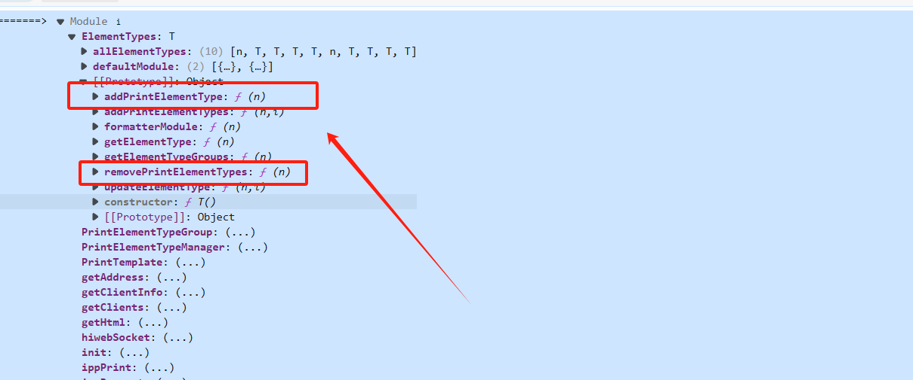

## vue-hiprint

### 简介

> 这个库是基于hiprint的vue的一个库，支持自定义打印模板，同时可以通过客户端进行静默打印

### 安装

```bash
# 通过npm安装
npm i @sv-print/hiprint
```

```js
// 在main.js中引入
import { hiPrintPlugin } from "vue-plugin-hiprint";

Vue.use(hiPrintPlugin);
```

### 使用

> 该库一共分几个模块去使用

1. 可拖拽元素(provider是生成可拖拽元素的模板)
2. 设计面板
    - 设计面板包含画板，数据配置面板等
    - 设计面板的api包含了打印/导出等功能


### 拖拽元素

#### 渲染方式

```vue
<template>
  <div class="container">
    <div title="方式1" class="hiprintEpContainer">
      <a class="ep-draggable-item" tid="defaultModule.text">
        <p>文本</p>
      </a>
    </div>
  </div>
</template>

<script>
import { hiprint,defaultElementTypeProvider } from "@sv-print/hiprint";

export default {
  data(){
    return{
    }
  },
  mounted(){
    this.init()
  },
  methods:{
    init(){
      // 初始化prociders,才能让元素正常拖拽
      hiprint.init({
        providers: [new defaultElementTypeProvider()]
      })

      // 方式1渲染拖拽元素
      hiprint.PrintElementTypeManager.buildByHtml($(".ep-draggable-item"))
    }
  }
};
</script>
```

#### 属性

- 拖拽元素的属性
    - field: 
    - fields: 
    - title: 标题
    - text: 
    - tid: 拖拽元素的唯一标识符
    - data:
    - formatter:
    - onRendered:
    - options:
    - styler:
    - type:

#### 内置拖拽元素

-  常规

    - 文本
        - title: 文本
        - tid: defaultModule.text
        - type: text
        - 其他元素为空

    - 图片
        - title: 图像
        - tid: defaultModule.image
        - type: image
        - 其他元素为空

    - 长文
        - title: 长文
        - tid: defaultModule.longText
        - type: longText
        - 其他元素为空

    - 表格
        - title: 表格
        - tid: defaultModule.table
        - type: table
        - 其他元素为空

    - html
        - title: html
        - tid: defaultModule.html
        - type: html
        - 其他元素为空

    - 自定义文本
        - title: 自定义文本
        - tid: defaultModule.customText
        - type: customText
        - 其他元素为空

-  辅助

    - 横线
        - title: 横线
        - tid: defaultModule.hline
        - type: hline
        - 其他元素为空

    - 竖线
        - title: 竖线
        - tid: defaultModule.vline
        - type: vline
        - 其他元素为空

    - 矩形
        - title: 矩形
        - tid: defaultModule.rect
        - type: rect
        - 其他元素为空

    - 椭圆
        - title: 椭圆
        - tid: defaultModule.oval
        - type: oval
        - 其他元素为空


#### 自定义拖拽元素

1. 能支持多个可拖拽元素的模板，因此了解自定义拖拽模板格式如下：

```js
// 导出一个函数，参数为options，这个函数返回一个对象，对象包含addElementTypes方法
export default function (options) {
  var addElementTypes = function (context) {};
  return {
    addElementTypes: addElementTypes,
  };
}

// 实际上就是下面的代码
class Provider {
  constructor(options) {}
  addElementTypes(context) {}
}

// 上面的代码中的defaultElementTypeProvider就是一个内置的provider
```

最重要的是上面的`addPrintElementTypes`,`removePrintElementTypes`两个方法

有了上面的数据格式和provider的定义以后，可以自己定义一个provider，然后调用hiprint.init方法初始化provider，就可以使用自定义的provider了。

```js
import { hiprint } from "@sv-print/hiprint"

// 以 defaultElementTypeProvider 为例
// 这里可以理解成 返回了一个 带有 addElementTypes 的 可以传入 options 去实例化的对象。
export default function (options) {
    var addElementTypes = function (context) {
        // 移除 旧的 defaultModule "元素"类型, 以避免重复
        context.removePrintElementTypes("defaultModule");
        // 添加 defaultModule "元素"类型
        context.addPrintElementTypes("defaultModule", [
            // PrintElementTypeGroup 分组
            // 如果使用 hiprint.PrintElementTypeManager.build('.hiprintEpContainer2', "defaultModule") 这里会渲染这个 "常规" 分组名称
            new hiprint.PrintElementTypeGroup("常规", [
                {
                    tid: "defaultModule.text", // 唯一 key
                    type: "text", // 元素类型
                    title: "文本", // 这里和 options 中的 title 一样。"拖拽时就显示" 优先级高于 options 的, "无法彻底删除"
                    // field: 'text' // 这里和 options 中的 field 一样。优先级高于 options 的, "无法彻底删除"
                    // data: "1111", // 这里和 options 中的 testData 一样。会有冲突, "无法彻底删除"
                    options: {
                    title: "文本2", // 标题, "拖进设计器才会显示"
                    field: "text", // 字段名称
                    testData: "123", // 测试数据
                    },
                },
            ]),
            new hiprint.PrintElementTypeGroup("辅助", [
                {
                    tid: "defaultModule.hline",
                    title: "横线",
                    type: "hline",
                },
            ]),
        ]);
    };
    return {
        addElementTypes: addElementTypes,
    };
};
```


### 设计面板

> 所有的拖拽元素最终会拖拽到设计面板上，然后后续操作

```vue
<template>
 <div class="container">
  <!-- 这是 "多面板" 容器 点击切换面板 -->
  <div class="hiprint-printPagination"></div>
  <!-- 这是 "拖拽设计器" 容器 -->
  <div id="hiprint-printTemplate"></div>
  <!-- 这是 "元素参数设置" 容器 -->
  <div id="PrintElementOptionSetting"></div>
 </div>
</template>

<script>
import { hiprint } from "@sv-print/hiprint";

export default {
  data() {
    return {
      hiprintTemplate: null,
      panel:null
    };
  },
  mounted() {
    this.init();
  },
  methods: {
    init() {
      // 渲染 "可拖拽元素" 方式2, 指定 "可拖拽元素" 容器
      // 有时可能是第二次进入此页面, 所以需要先清空 "拖拽设计器" 容器
      $("#hiprint-printTemplate").empty();
      // 创建设计模板对象
      this.hiprintTemplate = new hiprint.PrintTemplate({
        // "初始模板 json"
        template: {},
        // "元素参数设置" 容器
        settingContainer: "#PrintElementOptionSetting",
        // "多面板" 容器
        // 实现多面板， 需要在页面添加一个 <div class="hiprint-printPagination"/>
        // 不添加, 可不用下方代码, 如果没有对应 容器 写了也没用
        paginationContainer: ".hiprint-printPagination",
      });
      // 创建画布，如果没有创建会自动创建一个A4大小的画布
      this.panel = this.hiprintTemplate.addPrintPanel({
        width: 210,
        height: 57,
      });
      // 将模板渲染到 "拖拽设计器" 容器 中
      this.hiprintTemplate.design("#hiprint-printTemplate", { grid: true }); 
      // grid: true ==> 显示网格
    },
  },
};
</script>
<style scoped>
.container{
  background: palevioletred;
}
</style>
```

[设计面板所有的api](https://ccsimple.github.io/sv-print-docs/config/template.html#%E6%A8%A1%E6%9D%BF%E5%8F%82%E6%95%B0)
```js
// 常用的api
// 新建一个设计面板
let hiprintTemplate = new hiprint.PrintTemplate(options);
// 将模板设计面板放到指定容器中
hiprintTemplate.design("#hiprint-printTemplate");
// 导出JSON文件
hiprintTemplate.getJson()
```


### 可拖拽元素补充

```js
// 面板中 添加一个文本
panel.addPrintText({ options: { width: 100, height: 15, top: 20, left: 20, title: "手动添加的text", textAlign: "center" } });
// 面板中 添加一个条形码
panel.addPrintText({ options: { width: 100, height: 40, top: 40, left: 20, title: "123456", textType: "barcode" } });
// 面板中 添加一个二维码
panel.addPrintText({ options: { width: 100, height: 100, top: 80, left: 20, title: "123456", textType: "qrcode" } });
```