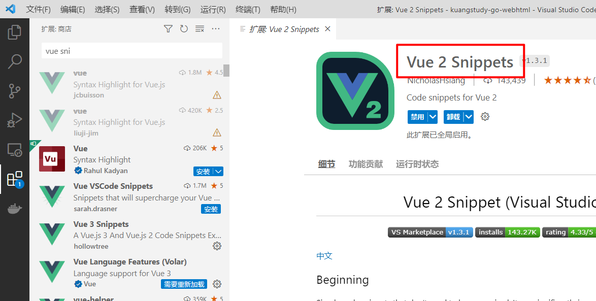

# 为什么要学习VueJs

## 官网

https://v3.cn.vuejs.org/guide/migration/introduction.html

## Web 前端技术的发展

早期的Web应用主要是以静态页面的浏览（比如新闻浏览），这些静态页面使用HTML语音编写。1995 年，Netseape 公司的工程师 Brendan Eich（布兰登·艾奇） 设计了JavaScript 脚本语言，使前端网页具有动态的效果（跑马灯，浮动广告等），以及与用户交互能力的表单。

然而随着互联网的发展，很多的线下业务的开始向向上发展。基于 Internet 的 Web 应用也变越复杂，用户所访詞的资源已不仅仅局限于服务器硬盘上存放的静态网页，更多的应用需要根据户的请求动态生成页面信息，复杂一些的还需要从数据库中查询数据，经过一定的运算，生成一个页面返回给用户。

- 1996 年，微软公司推出了 ASP 技术；
- 1997年，Sun 公司推出了 JSP技术；
- 1998年6月，PHP 3 正式发布

由此网页开启了真正动态交互的阶段。这些服务器端的动态页面技术是的网页可以获取服务器的数据信息并保持更新，推动了以 Google 为代表的搜索引擎和各种论坛的出现，Web 开始快速发展。服务器端网页动态交互功能不断丰富，伴随的是后端逻辑复杂度的快速上升以及及代码越来越复杂。为了更好地管理后端逻辑，出现了大量后端的 MVC 框架。

> 什么是MVC
> MVC（Model-View-Controller）即模型-视图-控制层，MVC框架有助于将应用程序分割成若干逻辑部件，使程序设计变得更加容易。MVC框架提供了一种按功能对各种对象进行分割的方法，其目的：将各对象间的耦合程度降到最低，

动态页面实现了动态交互和数据即时存和取，当由于动态页面是由后端技术驱动的，每一次的数据交互都需要刷新一次浏览器，频繁的页面刷新非常影响用户的体验，这个问题直到Goole公司在2004年使用Ajax技术开发的Gmail和GoogleMaps的发布后才得到解决。

Ajax改变了传统的用户请求——等待——响应这种web的交互模式，采用异步交互机制避免了用户对服务器响应的等待。提供了更好的用户体验，此外，它还改变了用户请求—服务器响应—-页面刷新的用户体验方式，提供了页面局部刷新数的实现机制，Ajax开启了Web2.0时代。

由于Ajax的火热，也带动了一些古老技术的复兴，css和javascript这两个原先被程序员瞧不上的技术收到了前所未有的关注，而这一切都源于Ajax带来的全新的用户体验。

> Ajax全称是：Asynchronous Javascript And Xml 即异步Javascript和XML。
> Ajax最早是由Adaptive Path公司的咨询顾问Jese James Garrett于2005年提出的。Garrett专门写了一篇文章来讲述Ajax这一新的Web开发方式。Ajax为用户带来了更好的用户体验，在传统的web应用程序中，用户向服务器发送一个请求，然后等待，服务器对应请求进行处理，然后返回一个响应，这是一种同步的处理方式，如果服务器处理请求的时间比较长，那么用户将不得不长时间的等待。在后台执行程序的过程中，如果执行的程序出现异常还可能导致某个业务的执行出错会影响整个的体验。

### 为什么Ajax服务器端早期返回的是Xml，现在是Json呢？

- 不论我们通过ajax还是正常的请求/响应，其目的都是为了获取服务器的数据。渲染页面。
- 正常的请求和响应，每种语音都有在服务器端渲染的方式，比如：jsp + 标签/el表达式。这是一种服务器端渲染方式。都是一种语言，都自家人解析认识的，
- 异步请求服务端：服务端给予客户端什么样数据格式就是命题了？———-javascript——jsp/php/asp
- 如果用字符串自己拼接返回，可能会你分隔符会和具体内容冲突就不适合
- 所以早起的ajax异步处理是通过xml字符串进行传输，然后js有domxml对象可以对xml进行解析获取每个点的值，然后进行渲染
- 进几年来，后面xml比较的笨重。节点过多，层级过深，解析也一个很大的问题，所以新的数据格式应运而生：json
- 从这里要明白一个道理：xml也好还是json也好，都是一种有格式的字符串。方便你解析和获取。仅此而已。

## JS框架的诞生

之后的一段时间，前端技术的蓬勃发展主要集中在：如何简化页面的开发与交互，相机涌现出了很多前端的js框架和库。比如：jQuery、Dojo、ExtJS、ECharts等，直到HTML5的出现，打破了这种发展格局，随着各大浏览器纷纷开始支持HTML5。前端能够实现的交互功能越来越多，也越来越丰富。相应的代码复杂度也快速的提高。以至于用后端的：MV*的架构模式开始出现在前端部分。从2010年10月出现的Backone开始，Knockout、Angular、Ember、React、Vue相继出现。这些框架的应用，使网站从Web Site进化成了WebApp时代，开启了网站应用的SPA（Single Page Application 单页应用程序）时代。

> SPA Single Page Application 单页应用程序,是指有一个Web页面的应用，单页应用程序是加载单个HTML页面并在用户与应用程序交互时动态更新该页面的Web应用程序，浏览器一开始会加载必须的HTML、CSS和Javascript，所有操作都在这个页面上完成，由Javascript控制交互和页面的布局刷新。
> 优点是：
> 1、前后端分离：前端工作在前端部分，后端工作在后端部分，前后端彻底分离开发，并行工作，对开发人员的技能要求也会变得更加单一，
> 2、良好的用户体验：用户不需要重新刷新页面，数据通过Ajax异步获取，页面显示更加流畅。
> 3、减轻服务器压力：服务器只需要提供数据就可以了，不用负责展示逻辑和页面合成，吞吐能力会大幅提高。
> 4、共用一套后端程序代码：不用修改后端程序代码就可以同时用于web界面，手机，平板电脑等多种客户端。
> 缺点是：
> 1、初次加载耗时比较多：为了实现单页Web应用功能及显示效果，需要加载页面的时候需要将Javascript和Css统一加载，因此第一次加载会稍微慢一些。为了减少加载时的数据流量，缩短加载时间，必须对Javascript和Css代码进行合并压缩处理。
> 2、前进后退的问题：由于单页Web应用在一个页面中显示所有的内容，所以不能使用浏览器的前进，后退功能，如果要实现浏览器的前进和后退，需要编写额外的代码手动实现。
> 3、SEO难度较高：由于所有的内容都在一个页面中动态替换显示，所以在SEO上有着天然的弱势，如果站点对SEO很看重，且要用单页应用，那么可以编写一些静态页面给搜索引擎，或者通过服务器端渲染技术解决。


## 关于前端JS现状

2015年6月，ECMAScript6发布，并被正式命名为ECMASCript2015，该版本增加了很多新的语法，极大地拓展了Javascript的开发潜力。由于浏览器对ECMAScript6语法支持滞后，出现了Babel编译器，它可以将ECMAScript6代码编译成浏览器支持的ECMAScript5的代码。
目前的前端技术已经形成一个庞大的体系：

- 以GitHub为代表的代码管理仓库
- 以NPM和Yarn为代表的包管理工具
- ECMAScript6 TypeScript和Babel构成的脚本体系。
- HTML5,CSS3和相应的处理技术
- React、Vue、Angular为代表的前端框架
- 以WebPack为代表的打包工具
- 以Nodejs为基础的Express和Koa后端框架


## 前端开发模式发展

- 静态页面
- 异步刷新，操作DOM
- MVVM，关注模型和视图
- 基于脚手架的SPA的单页开发

# VueJs的前期准备工作

## 环境的准备

- Nodejs的准备
- Vscode的准备


### Npm项目初始化和全局安装

- nodejs下载：http://nodejs.p2hp.com/#google_vignette
- 项目初始化：`npm init`
- 查看全局安装位置：`npm root -g`
- 全局安装模块：npm `install <module> -g`
- 查看全局安装模块：`npm list -g 或者 npm ls -g`
- 查看模块的版本：`npm view <module> versions`


### Npm生成环境安装和开发环境依赖模块安装

- 生产环境

  ```sh
  npm install <module module2 ... modulen> --save
  npm install <module module2@version ... modulen> -S
  # 或者
  npm i <module module2 ... modulen> --save
  npm i <module module2@version ... modulen> -S
  ```

- 开发环境

  ```sh
  npm install <module module2 ... modulen> --save-dev
  npm install <module module2@version ... modulen> -D
  # 或者
  npm i <module module2 ... modulen> --save-dev
  npm i <module module2@version ... modulen> -D
  ```

- 两者的区别是啥？

  生产环境是指未来你安装的模块都会随着项目的打包一起编译到最后的js文件中。也是项目依赖和需要的。比如：jquery,vue,bootstrap等

  ```sh
  npm install  vue  --save
  npm install  vue  -S
  npm install  vue@version  -S
  ```

  开发环境是指只在开发阶段使用。比如项目中的：eslint。

### 关于node_modules的认识

我们后续的项目都是运行在node 的环境下的。后续在项目中安装的模块都是安装在一个叫node_modules的目中。项目中会存在一个。如果你使用npm install -g module 会在你的用户目录下也会创建一个node_module是文件。用来存放你全局安装的信息。当然还有一个最顶级的就是：node的安装目录下。也会有一个，这个是放的node自身的核心模块。

- npm install module --save --------------------安装到项目的node_modules
- npm install module --save -dev--------------------安装到项目的node_modules
- npm install module --g--------------------安装到项用户目录下的node_modules
- 安装nodejs的时候 --------------------安装目录下有一个node_modules

他们的加载顺序是：

- 先加载工程的node_modules，如果工程没有就加载全局用户的node_modules，然后在加载nodejs安装目录下的node_modules信息。一层层查找上去。如果没找到就报模块没安装。需要进行安装，


### CNPM/PNPM命令的安装

pnpm

```bash
npm install -g pnpm
```

cnpm

```bash
npm install -g cnpm --registry=https://registry.npmmirror.com
```


## 02、工具的准备

- vscode ： https://code.visualstudio.com/

- 安装：Vue 2 Snippets 和 Vue 3 Snippets 

  主要的作用就是：可以把vue2和vue3的片段和语法进行高亮显示。

  

- HTML Snippets : html格式不全

- Open in Browser：打开代码到浏览器

- vetur ： 格式化vue的文件，语法错误检查，语法高亮，代码自动补全，配置eslint插件效果更佳。

- eslint ： 用来识别你的js语法的插件。比如你定义变量没使用等，

- Path Intellisense：用于自动路径补全。

- vue-beautify2：用于格式化代码，快速对齐代码。


# 03、VueJs的发展史

## 01、概述

Vue (读音 /vjuː/，类似于 **view**) 是一套用于构建用户界面的**渐进式框架**。与其它大型框架不同的是，Vue 被设计为可以自底向上逐层应用。==Vue 的核心库只关注视图层==，不仅易于上手，还便于与第三方库或既有项目整合。另一方面，当与[现代化的工具链](https://cn.vuejs.org/v2/guide/single-file-components.html)以及各种[支持类库](https://github.com/vuejs/awesome-vue#libraries--plugins)结合使用时，Vue 也完全能够为复杂的单页应用提供驱动。js库


前端框架三巨头：Vue.js、React.js、AngularJS，vue.js以其轻量易用著称，vue.js和React.js发展速度最快。

- 官网：https://cn.vuejs.org/
- v2入门文档：https://v2.cn.vuejs.org/
- v3入门文档：https://cn.vuejs.org/guide/introduction.html


## 02、Vue的核心功能

- ==去DOM中心化：使用Vue以后摒弃了传统的dom操作元素节点的过程。==

- ==前端模板引擎：使用Vue可以抛弃后端的模板引擎技术，让前后端开发成为了可能。==

- ==响应式绑定数据：当数据发生改变时，视图也可以自动更新，可以不用关心DOM的操作。而专心数据操作。==

- ==可组合的视图组件：把页面中的视图按照功能或者模块进行切分成若干基本单元，组件可以一级级组合整个应用形成一个组件树，可维护、可重用、可测试。==

- 前端路由：更流畅的用户体验，灵活地在页面切换已渲染组件的显示，不需要与后端做多余的交互。

- 状态集中管理：在VVM响应式模型基础上实现多组件之间的状态数据同步与管理。

- 前端化工程：结合webpack等前端打包工具，管理多种静态资源，代码，测试，发布等整合前端大型项目，也就是后续的脚手架开发（vue-cli/vite等）

  

## 03、发展历程

- 2013年，在 Google 工作的尤雨溪，受到 Angular 的启发，开发出了一款轻量框架，最初命名为 Seed 。
- 2013年12月，更名为 Vue，图标颜色是代表勃勃生机的绿色，版本号是 0.6.0。
- 2014.01.24，Vue 正式对外发布，版本号是 0.8.0。
- 2014.02.25，0.9.0 发布，有了自己的代号：Animatrix，此后，重要的版本都会有自己的代号。
- 2015.06.13，0.12.0，代号Dragon Ball，Laravel 社区（一款流行的 PHP 框架的社区）首次使用 Vue，Vue 在 JS 社区也打响了知名度。
- 2015.10.26，1.0.0 Evangelion 是 Vue 历史上的第一个里程碑。同年，vue-router、vuex、vue-cli 相继发布，标志着 Vue从一个视图层库发展为一个渐进式框架。
- 2016.10.01，2.0.0 是第二个重要的里程碑，它吸收了 React 的虚拟 Dom 方案，还支持服务端渲染。自从Vue 2.0 发布之后，Vue 就成了前端领域的热门话题。
- 2019.02.05，Vue 发布了 2.6.0 ，这是一个承前启后的版本，在它之后，将推出 3.0.0。
- 2019.12.05，在万众期待中，尤雨溪公布了 Vue 3 源代码，目前 Vue 3 处于 Alpha 版本。
- 2020年9月18日，发布了vue3.0的正式版本


# 04、什么是Mvvm框架

## Vue的设计模式

经典的设计模式开发有MVC、MVP、MVVM

==**MVVM模式**==

- M：即Model，模型，包括数据和一些基本操作
- V：即View，视图，页面渲染结果
- VM：即View-Model，模型与视图间的双向操作（无需开发人员干涉）

在MVVM之前，开发人员从后端获取需要的数据模型，然后要通过DOM操作Model渲染到View中。而后当用户操作视图，我们还需要通过DOM获取View中的数据，然后同步到Model中。

而MVVM中的VM要做的事情就是把DOM操作完全封装起来，开发人员不用再关心Model和View之间是如何互相影响的：

- ==只要Model发生了改变，View上自然就会表现出来。==
- 当用户修改了View，Model中的数据也会跟着改变。

把开发人员从繁琐的DOM操作中解放出来，把关注点放在如何操作Model上。

 


## **小结**

- **==好处：数据和视图分离，便于维护和升级。==**
- 只要Model发生了改变，View上自然就会表现出来。
- 当用户修改了View，Model中的数据也会跟着改变。
- mvvm设计的理念：视图和数据完全分离。

- MVVM ：   Model    View       VIew-model


# 05、VueJs的下载与安装

## **下载安装**

**源码下载地址**

https://github.com/vuejs/vue

**CND下载**

```html
<script src="https://cdn.jsdelivr.net/npm/vue@2"></script>
```

**npm安装(推荐)**

```properties
npm install vue
```

## VueJs的快速入门

```html
<!doctype html>
<html lang="en">
<head>
    <meta charset="UTF-8">
    <meta name="viewport"
          content="width=device-width, user-scalable=no, initial-scale=1.0, maximum-scale=1.0, minimum-scale=1.0">
    <meta http-equiv="X-UA-Compatible" content="ie=edge">
    <title>05、VueJs的快速入门</title>
</head>
<body>

    <div id="app">
        <!--初始化位置 告诉vuejs从这里开始解析和渲染-->
        <div  class="app">
            <h1>{{title}}</h1>
            <p>我的名字叫：{{username}}，年龄：{{age}}岁，地址：{{address}}</p>
        </div>

        <div  class="app">
            <h1>{{title}}</h1>
            <p>我的名字叫：{{username}}，年龄：{{age}}岁，地址：{{address}}</p>
        </div>
    </div>
    <!--1: 导入vuejs --- 态度问题-->
    <script src="js/vue.min.js"></script>
    <script>
        // 三步曲
        // 1: 导入vuejs --- 态度问题
        // 2: 初始化vuejs
        // el : 告诉vuejs从哪里开始进行渲染。但是范围不能在body上。
        // 渲染：就指把data中和div替换
        // 3: el可以class吗？是可以但是不推荐 如果你一定用只会渲染第一个。
        // 那为什么不直接用id呢？
        var vue = new Vue({
            el:"#app",
            //data就数据，未来所有数据都在这里定义
            data:{
                title:"太棒了,66666",
                username:"127帅哥儿",
                address:"广州天河",
                age:21
            }
        });
    </script>
</body>
</html>
```

- 首先通过 new Vue()来创建Vue实例
- 然后构造函数接收一个对象，对象中有一些属性：
  - el：是element的缩写，通过id选中要渲染的页面元素，本例中是一个div
  - data：数据，数据是一个对象，里面有很多属性，都可以渲染到视图中
    - name：这里指定了一个name属性
- 页面中通过{{message}}的方式，来渲染刚刚定义的message属性。

打开页面查看效果：

 

## 小结


>Model : vue实例的data
>
>View: 视图，div标签el管理那个部分
>
>VM:  vue本身。
>
>**==注意：==**vue的职责：把数据如何渲染到指定el范围进行数据的替换。(去DOM化)
>
>1：el范围 不能定义在body上
>
>2：el的名字一定id，不要class
>
>3：所有出现在el范围的那些key必须在data中先定义。


# 06、VueJs的插入值表达式

| 目标                   |
| ---------------------- |
| 掌握插入值表达式的使用 |

插入值表达式：  {{插入值表达式写在这里}}

> ​	类比学习：类似于jsp中的el表达式

**作用**

将data中的数据获取和展位，支持四则运算和三目运算符。

**核心代码**

`双击运行：vuepro/demo02.html`

```html
<!doctype html>
<html lang="en">
<head>
    <meta charset="UTF-8">
    <meta name="viewport"
          content="width=device-width, user-scalable=no, initial-scale=1.0, maximum-scale=1.0, minimum-scale=1.0">
    <meta http-equiv="X-UA-Compatible" content="ie=edge">
    <title>05、VueJs的插入值表达式</title>
</head>
<body>

    <div id="app">
        <h1>{{title}}</h1>
        <p>{{price + num}}</p>
        <p>{{price - num}}</p>
        <p>{{price * num}}</p>
        <p>{{price / num}}</p>
        <p>{{price % num}}</p>
        <p>{{mal<!-- <p>{{    if(male==1){return "男" }else{ return "女"; }     }}</p>-->e==1?"男":"女"}}</p>
    </div>

    <script src="js/vue.min.js"></script>
    <script>

        // {{ }} 插值表达式。也mustcache 胡子表达式
        // 它一种类似于jsp中${}表达式的玩意。
        // 它是去获取数据的一种占位符，仅此而已。
        var vue = new Vue({
            el:"#app",
            data:{
               title:"127班所有学生非常6666",
               price:11.23,
               num:11,
               male:0 // 1 男 0 女
            }
        })

    </script>

</body>
</html>
```

**效果如下：**


###  小结

- 插入值表达式可以使用if判断吗？可以定义变量吗？答案是：不能

- 插值表达式，不能写在指令上。

  

# 07、VueJs指令学习


## 01、VueJs指令：v-text与v-html

| 目标                       |
| -------------------------- |
| 掌握文本输出与样式渲染输出 |

<strong style="color:red">提示：v-text不支持标签解析，v-html支持标签解析</strong>

**核心代码**

`双击demo09.html:`

```html
<!doctype html>
<html lang="en">
<head>
    <meta charset="UTF-8">
    <meta name="viewport"
          content="width=device-width, user-scalable=no, initial-scale=1.0, maximum-scale=1.0, minimum-scale=1.0">
    <meta http-equiv="X-UA-Compatible" content="ie=edge">
    <title>Document</title>
</head>
<body>

<div id="app">
    <h1>{{content}}</h1>
    <hr/>
    <h1 v-text="content"></h1>
    <h1 v-html="content"></h1>
    <hr/>
    <h1>{{price + num}}</h1>
    <h1>{{price - num}}</h1>
    <h1>{{price * num}}</h1>
    <h1>{{price / num}}</h1>
    <h1>{{price % num}}</h1>
    <hr/>
    <h1 v-text="price + num"></h1>
    <h1 v-text="price - num"></h1>
    <h1 v-text="price * num"></h1>
    <h1 v-text="price / num"></h1>
    <h1 v-text="price % num"></h1>
</div>

<script src="js/vue.min.js"></script>
<script>
    // 1 : 实例化vue v-text v-html指令
    var vue = new Vue({

        // 2 : 指定渲染的范围
        el:"#app",

        // 3 :数据定义的位置也就是Model
        data:{
            content:"<strong style='color:green'>我太帅了，被自己迷倒了....</strong>",
            price:11.2,
            num:11
        },
        // 4: 事件定义的位置,@事件类型="事件名"
        methods:{

        }
    });
</script>
</body>
</html>
```


| 小结                                                      |
| --------------------------------------------------------- |
| 这样写是否正确？ `<div v-text="message"></div> `   不正确 |


## 02、VueJs指令：v-bind

| 目标                     |
| ------------------------ |
| 掌握绑定html标签的属性值 |

<strong>==插值语法：{{}}   是不能直接使用在属性上，需要借助v-bind指令来解决此问题！==</strong>

**核心代码**

```html
<!doctype html>
<html lang="en">
<head>
    <meta charset="UTF-8">
    <meta name="viewport"
          content="width=device-width, user-scalable=no, initial-scale=1.0, maximum-scale=1.0, minimum-scale=1.0">
    <meta http-equiv="X-UA-Compatible" content="ie=edge">
    <title>Document</title>
</head>
<body>

<div id="app">
    <div v-bind:title="content">{{content}}</div>
    <!--可以简化成-->
    <div :title="content">{{content}}</div>
</div>

<script src="js/vue.min.js"></script>
<script>
    // 1 : 实例化vue
    var vue = new Vue({
        // 2 : 指定渲染的范围
        el:"#app",
        // 3 :数据定义的位置也就是Model
        data:{
            content:"我太帅了,太迷人了..."
        },
        // 4: 事件定义的位置,@事件类型="事件名"
        methods:{

        }
    })
</script>
</body>
</html>
```


| 小结                              |
| --------------------------------- |
| v-bind:   可以简写成什么？      : |


## 03、VueJs指令：v-model

| 目标              |
| ----------------- |
| 掌握model的值绑定 |

**核心代码**

`双击：demo11.html`

```html
<!doctype html>
<html lang="en">
<head>
    <meta charset="UTF-8">
    <meta name="viewport"
          content="width=device-width, user-scalable=no, initial-scale=1.0, maximum-scale=1.0, minimum-scale=1.0">
    <meta http-equiv="X-UA-Compatible" content="ie=edge">
    <title>v-model指令</title>
</head>
<body>

<div id="app">
    <form action="index.jsp" method="get">
        <p>用户：<input type="text" v-model="username"></p>
        <p>密码：<input type="password" v-model="password"></p>
        <input type="submit" @click.prevent="login" value="提交">
        <p>你输入的值是：{{username}} == {{password}}</p>
    </form>
</div>


<script src="js/vue.min.js"></script>
<script>
    // 1 : 实例化vue
    // v-model: 它含义：双向数据绑定，改变视图会改变数据，改变数据会改变视图。
    var vue = new Vue({
        // 2 : 指定渲染的范围
        el:"#app",
        // 3 :数据定义的位置也就是Model
        data:{
            username:"",
            password:""
        },
        // 4: 事件定义的位置,@事件类型="事件名"
        methods:{
            login:function(){
                var username = this.username;
                var password = this.password;
                console.log("用户输入的账号和密码是：",username,password);
            }
        }
    })
</script>
</body>
</html>
```


如果参数过多建议使用对象包裹：

`双击demo12.html`

```html
<!doctype html>
<html lang="en">
<head>
    <meta charset="UTF-8">
    <meta name="viewport"
          content="width=device-width, user-scalable=no, initial-scale=1.0, maximum-scale=1.0, minimum-scale=1.0">
    <meta http-equiv="X-UA-Compatible" content="ie=edge">
    <title>v-model指令</title>
</head>
<body>

<div id="app">
    <form action="index.jsp" method="get">
        <p>用户：<input type="text" v-model="user.username"></p>
        <p>密码：<input type="password" v-model="user.password"></p>
        <input type="submit" @click.prevent="login" value="提交">
        <p>你输入的值是：{{user.username}} == {{user.password}}</p>
    </form>
</div>


<script src="js/vue.min.js"></script>
<script>
    // 1 : 实例化vue
    // v-model: 它含义：双向数据绑定，改变视图会改变数据，改变数据会改变视图。
    var vue = new Vue({
        // 2 : 指定渲染的范围
        el:"#app",
        // 3 :数据定义的位置也就是Model
        data:{
            //js对象可以动态扩展属性
            user:{}
        },
        // 4: 事件定义的位置,@事件类型="事件名"
        methods:{
            login:function(){
                var username = this.user.username;
                var password = this.user.password;
                console.log("用户输入的账号和密码是：",username,password);
            }
        }
    })
</script>
</body>
</html>
```


| 小结                                               |
| -------------------------------------------------- |
| v-model与v-bind的区别是什么？ bind绑定的标签的属性 |
| v-model绑定的是什么？  Model                       |
| 如果参数多个用什么方式处理：对象                   |


## 04、VueJs指令：v-for

| 目标             |
| ---------------- |
| 掌握迭代数组     |
| 掌握迭代对象     |
| 掌握迭代对象数组 |

**核心代码**

`双击：demo13.html`

```html
<!DOCTYPE html>
<html lang="en">
<head>
    <meta charset="UTF-8">
    <meta name="viewport"content="width=device-width, user-scalable=no, initial-scale=1.0, maximum-scale=1.0, minimum-scale=1.0">
    <meta http-equiv="X-UA-Compatible" content="ie=edge">
    <title>v-model指令</title>
</head>
<body>
    <div id="app">
        <h1>普通数据类型</h1>
        <h1>{{title}}</h1>
        <h1>{{num}}</h1>
        <h1>{{flag}}</h1>
  


        <h1>对象取值</h1>
        <p>{{user.id}}</p>
        <p>{{user.name}}</p>
        <p>{{user.age}}</p>


        <h1>数组</h1>
        <p>{{users[0]}}</p>
        <p>{{users[1]}}</p>
        <p>{{users[2]}}</p>

        <h1>v-for循环---数组对象</h1>
        <div v-for="(user,index) in users">
            <p>{{index + 1}}：{{user.id}} == {{user.name}}==={{user.age}}</p>
        </div>


        <h2>v-for循环---数组</h2>
        <div v-for="(f,index) in friends">
            {{f}}
        </div>

        <div v-for="(key,value) in user">
            {{value}}==={{value}}
        </div>
    </div>


    <script src="js/vue.min.js"></script>
    <script>
        // 1 : 实例化vue
        // v-model: 它含义：双向数据绑定，改变视图会改变数据，改变数据会改变视图。
        var vue = new Vue({
            // 2 : 指定渲染的范围
            el:"#app",
            // 3 :数据定义的位置也就是Model
            data:{
                title:"我太帅了",
                num:10,
                flag:true,
                    
                // 数组
                friends:["张三","李四","wangwu"],

                // 对象
                user:{
                    id:1,
                    name:"张三",
                    age:34
                },

                // 对象数组
                users:[
                    {
                        id:1,
                        name:"张三1",
                        age:31
                    },
                    {
                        id:2,
                        name:"张三2",
                        age:32
                    },
                    {
                        id:3,
                        name:"张三3",
                        age:33
                    }
                ]
            },
            // 4: 事件定义的位置,@事件类型="事件名"
            methods:{

            }
        })
    </script>
</body>
</html>
```


==细节：==

 

| 小结                                                         |
| ------------------------------------------------------------ |
| `<div v-for="(a,b) in arr">`     这个迭代数组中，a和b   那个代表数组的索引？ b |


## 05、VueJs指令：v-if与v-show

| 目标                         |
| ---------------------------- |
| 掌握如何隐藏一个页面中的元素 |


**核心代码**

`双击demo14.html`  件指令：v-if  /   v-else-if   /   v-else

```html
<!doctype html>
<html lang="en">
<head>
    <meta charset="UTF-8">
    <meta name="viewport"
          content="width=device-width, user-scalable=no, initial-scale=1.0, maximum-scale=1.0, minimum-scale=1.0">
    <meta http-equiv="X-UA-Compatible" content="ie=edge">
    <title>v-model指令</title>
</head>
<body>

<div id="app">
    <h1>用户编号：{{user.id}}</h1>
    <h1>用户名字：{{user.name}}</h1>
    <h1>用户性别：</h1>
    <h1 v-if="user.male==0">女</h1>
    <h1 v-if="user.male==1">男</h1>
    <h1 v-if="user.male==2">保密</h1>
    <hr>
    <h1 v-if="user.male==0">女</h1>
    <h1 v-else-if="user.male==1">男</h1>
    <h1 v-else-if="user.male==3">男</h1>
    <h1 v-else>保密</h1>
    <hr>
</div>


<script src="js/vue.min.js"></script>
<script>
    // 1 : 实例化vue
    // v-model: 它含义：双向数据绑定，改变视图会改变数据，改变数据会改变视图。
    var vue = new Vue({
        // 2 : 指定渲染的范围
        el:"#app",
        // 3 :数据定义的位置也就是Model
        data:{
          user:{
              id:1,
              name:"张三",
              male:2 // 1 男 0 女 2 保密
          }
        },
        // 4: 事件定义的位置,@事件类型="事件名"
        methods:{

        }
    })
</script>
</body>
</html>
```

`v-if和v-show的区别`

`双击demo16.html`

```html
<!doctype html>
<html lang="en">
<head>
    <meta charset="UTF-8">
    <meta name="viewport"
          content="width=device-width, user-scalable=no, initial-scale=1.0, maximum-scale=1.0, minimum-scale=1.0">
    <meta http-equiv="X-UA-Compatible" content="ie=edge">
    <title>v-model指令</title>
</head>
<body>

<div id="app">
    <div v-if="flag">v-if我显示了</div>
    <div v-show="flag">v-show我显示了</div>
    <button @click="changeFlag">点击改变flag</button>
</div>


<script src="js/vue.min.js"></script>
<script>
    // 1 : 实例化vue
    // v-model: 它含义：双向数据绑定，改变视图会改变数据，改变数据会改变视图。
    var vue = new Vue({
        // 2 : 指定渲染的范围
        el:"#app",
        // 3 :数据定义的位置也就是Model
        data:{
          flag:true
        },
        // 4: 事件定义的位置,@事件类型="事件名"
        methods:{
            changeFlag:function(){
                // 设定开关
                this.flag = !this.flag;
               /* if(this.flag){
                    this.flag = false
                }else{
                    this.flag = true;
                }*/
            }
        }
    })
</script>
</body>
</html>
```


| 小结                                                         |
| ------------------------------------------------------------ |
| v-if           是   根据值是否渲染页面元素          还是    根据值切换元素的display css属性?   是否渲染页面元素 |
| v-show    是   根据值是否渲染页面元素          还是    根据值切换元素的display css属性?切换元素的display css |


## 06、VueJs指令：v-on：click

| 目标                |
| ------------------- |
| 掌握vuejs的点击事件 |


**核心代码**

`双击：demo03.html`

```html
<!doctype html>
<html lang="en">
<head>
    <meta charset="UTF-8">
    <meta name="viewport"
          content="width=device-width, user-scalable=no, initial-scale=1.0, maximum-scale=1.0, minimum-scale=1.0">
    <meta http-equiv="X-UA-Compatible" content="ie=edge">
    <title>VueJs指令：v-on：click</title>
</head>
<body>

<div id="app">
    <h1>{{title}}</h1>

    <button v-on:click="clickme()">点我</button>
    <button @click="clickme()">@点我</button>
</div>

<script src="js/vue.min.js"></script>
<script>

    var vue = new Vue({
        el:"#app",
        data:{
            title:"VueJs指令：格式: v-on：事件类型"
        },
        //一系列事件定义的位置，这个固定名字。
        methods:{
           clickme:function(){
               alert("点我了,触发我了...")
               // 更新数据
               //this.title = "Vuejs是一个坏蛋。。。"
               this.title = "";
           }
        }
    });

    // 思考问题：事件的作用？
    // 1：获取页面数据
    // 2：更新数据

</script>
</body>
</html>
```

| 小结                                   |
| -------------------------------------- |
| v-on:click  可以简写成什么？    @click |

注意事项：

1：v-on:事件类型(click,mouseenter) ="事件名". 

事件名必须定义在methods中。以key:value的方式存在

2：v-on在vuejs有简写。`@事件类型=“事件名”`


## 08、VueJs指令：v-on：keydown

| 目标             |
| ---------------- |
| 掌握键盘按下事件 |

  

  


**核心代码**

`双击：demo05.html`

```html
<!doctype html>
<html lang="en">
<head>
    <meta charset="UTF-8">
    <meta name="viewport"
          content="width=device-width, user-scalable=no, initial-scale=1.0, maximum-scale=1.0, minimum-scale=1.0">
    <meta http-equiv="X-UA-Compatible" content="ie=edge">
    <title>VueJs指令：v-on：click</title>
</head>
<body>

<div id="app">
    <textarea name="" cols="30" rows="10" maxlength="140" id="content" @keyup="inputcontent" @keydown="inputcontent">
    </textarea>
    <span>你可以输入{{size}}字</span>
</div>

<script src="js/vue.min.js"></script>
<script>
    var vue = new Vue({
        el:"#app",
        data:{
            content:"",
            size:140,
        },
        methods:{
            inputcontent:function(){
                // 1: 获取每次用户输入的值
                var cnt = document.getElementById("content").value;
                // 2: 用140减去用户输入内容的长度就得到还可以输入的字数。
                this.size = 140 -  cnt.length;
            }
        }
    })

</script>
</body>
</html>
```


| 小结                                         |
| -------------------------------------------- |
| 获取键盘码使用的是event的那个方法？  keyCode |


## 09、VueJs指令：v-on：mouseover

| 目标             |
| ---------------- |
| 掌握鼠标悬停事件 |

**核心代码**

```html
<!doctype html>
<html lang="en">
<head>
    <meta charset="UTF-8">
    <meta name="viewport"
          content="width=device-width, user-scalable=no, initial-scale=1.0, maximum-scale=1.0, minimum-scale=1.0">
    <meta http-equiv="X-UA-Compatible" content="ie=edge">
    <title>VueJs指令：v-on：mouseenter</title>
    <style>
        #divbox{transition: 1s;}
    </style>
</head>
<body>

<div id="app">
    <div id="divbox" @mouseenter="enter" @mouseleave="outer">我是以div,鼠标移动进来会可以效果哦</div>
</div>

<script src="js/vue.min.js"></script>
<script>
    var vue = new Vue({
        el:"#app",
        data:{
        },
        methods:{
            enter:function(){
                console.log(1);
                document.getElementById("divbox").style.background = "red";
                document.getElementById("divbox").style.color = "#fff";
                document.getElementById("divbox").style.fontSize = "24px";
            },
            outer:function(){
                console.log(2);
                document.getElementById("divbox").style.background = "green";
                document.getElementById("divbox").style.color = "#fff";
                document.getElementById("divbox").style.fontSize = "14px";
            }
        }
    })

</script>
</body>
</html>
```

鼠标进入的效果：mouseenter


鼠标离场的效果：mouseleave


## 10、VueJs指令：v-on：事件修饰符

| 目标                               |
| ---------------------------------- |
| 掌握事件指令v-on事件操作符应用场景 |

**概述**

在事件处理程序中调***用 `event.preventDefault()` 或 `event.stopPropagation()` 是非常常见的需求。尽管我们可以在方法中轻松实现这点，但更好的方式是：方法只有纯粹的数据逻辑，而不是去处理 DOM 事件细节。

为了解决这个问题，Vue.js 为 `v-on` 提供了**事件修饰符**。之前提过，修饰符是由点开头的指令后缀来表示的。

- `.stop` ：阻止事件冒泡
- `.prevent`：阻止默认事件发生
- `.capture`：使用事件捕获模式
- `.self`：只有元素自身触发事件才执行。（冒泡或捕获的都不执行）
- `.once`：只执行一次


**核心代码**

`.prevent`：阻止默认事件发生

`双击：demo06.html`

```html
<!doctype html>
<html lang="en">
<head>
    <meta charset="UTF-8">
    <meta name="viewport"
          content="width=device-width, user-scalable=no, initial-scale=1.0, maximum-scale=1.0, minimum-scale=1.0">
    <meta http-equiv="X-UA-Compatible" content="ie=edge">
    <title>Document</title>
</head>
<body>

    <div id="app">
        <form action="index.jsp" method="get">
            <p>用户：<input type="text"></p>
            <p>密码：<input type="password"></p>
            <input type="submit" @click.prevent="login" value="提交">
            <button @click.prevent="login">提交2</button>
            <a href="http://www.baidu.com" @click.prevent="tologin">点我去百度</a>
        </form>
    </div>

<script src="js/vue.min.js"></script>
<script>
    // 1 : 实例化vue
    var vue = new Vue({
        // 2 : 指定渲染的范围
        el:"#app",
        // 3 :数据定义的位置也就是Model
        data:{

        },
        // 4: 事件定义的位置,@事件类型="事件名"
        methods:{
            login:function(){
                alert(1);
            },
            tologin:function(){
                alert("点我了...")
            }
        }
    })
</script>
</body>
</html>
```


真实案例解决a连接锚点置定问题：

`双击：demo07.html`

```html
<!doctype html>
<html lang="en">
<head>
    <meta charset="UTF-8">
    <meta name="viewport"
          content="width=device-width, user-scalable=no, initial-scale=1.0, maximum-scale=1.0, minimum-scale=1.0">
    <meta http-equiv="X-UA-Compatible" content="ie=edge">
    <title>Document</title>
</head>
<body>

    <div id="app">
        <p>sdfsdf</p>
        <p>sdfsdf</p>
        <p>sdfsdf</p>
        <p>sdfsdf</p>
        <p>sdfsdf</p>
        <p>sdfsdf</p>
        <p>sdfsdf</p>
        <p>sdfsdf</p>
        <p>sdfsdf</p>
        <p>sdfsdf</p>
        <p>sdfsdf</p>
        <p>sdfsdf</p>
        <p>sdfsdf</p>
        <p>sdfsdf</p>
        <p>sdfsdf</p>
        <p>sdfsdf</p>
        <p>sdfsdf</p>
        <p>sdfsdf</p>
        <p>sdfsdf</p>
        <p>sdfsdf</p>
        <p>sdfsdf</p>
        <p>sdfsdf</p>
        <p>sdfsdf</p>
        <p>sdfsdf</p>
        <p>sdfsdf</p>
        <p>sdfsdf</p>
        <p>sdfsdf</p>
        <p>sdfsdf</p>
        <p>sdfsdf</p>
        <p>sdfsdf</p>
        <p>sdfsdf</p>
        <p>sdfsdf</p>
        <p>sdfsdf</p>
        <p>sdfsdf</p>
        <p>sdfsdf</p>
        <p>sdfsdf</p>
        <p>sdfsdf</p>
        <p>sdfsdf</p>
        <p>sdfsdf</p>
        <p>sdfsdf</p>
        <p>sdfsdf</p>
        <p>sdfsdf</p>
        <p>sdfsdf</p>
        <p>sdfsdf</p>
        <p>sdfsdf</p>
        <p>sdfsdf</p>
        <p>sdfsdf</p>
        <p>sdfsdf</p>
        <p>sdfsdf</p>
        <p>sdfsdf</p>
        <p>sdfsdf</p>
        <p>sdfsdf</p>
        <p>sdfsdf</p>
        <p>sdfsdf</p>
        <p>sdfsdf</p>
        <p>sdfsdf</p>
        <p>sdfsdf</p>
        <p>sdfsdf</p>
        <p>sdfsdf</p>

        <a href="#" @click.prevent="loadmore">加载更多</a>
        <a href="javascript:void(0);" @click="loadmore">加载更多</a>
    </div>

<script src="js/vue.min.js"></script>
<script>
    // 1 : 实例化vue
    var vue = new Vue({
        // 2 : 指定渲染的范围
        el:"#app",
        // 3 :数据定义的位置也就是Model
        data:{

        },
        // 4: 事件定义的位置,@事件类型="事件名"
        methods:{

            loadmore:function(){
                alert("加载点我了....");
            }

        }
    })
</script>
</body>
</html
```

| 小结                               |
| ---------------------------------- |
| 事件修饰符的作用是什么？  简化开发 |


## 11、VueJs指令：v-on：按键修饰符

| 目标                 |
| -------------------- |
| 掌握v-on的按键修饰符 |

**语法**

```html
Vue 允许为 v-on 在监听键盘事件时添加按键修饰符

全部的按键别名：
	
​	.enter(enter键)
​	.tab (Tab键)
​	.delete (捕获 "删除" 和 "退格" 键)
​	.esc （退出键）
​	.space（空格键）
​	.up (向上)
​	.down(向下)
​	.left(向左)
​	.right(向右)


​	.ctrl
​	.alt
​	.shift
​	.meta

注意：在 Mac 系统键盘上，meta 对应 command 键 (⌘)。在 Windows 系统键盘 meta 对应 Windows 徽标键 (⊞)。在 Sun 操作系统键盘上，meta 对应实心宝石键 (◆)。在其他特定键盘上，尤其在 MIT 和 Lisp 机器的键盘、以及其后继产品，比如 Knight 键盘、space-cadet 键盘，meta 被标记为“META”。在 Symbolics 键盘上，meta 被标记为“META”或者“Meta”。

```

非上面的键码参考ascii码表：

  

**核心代码**

`双击：demo08.html`

```html
<!doctype html>
<html lang="en">
<head>
    <meta charset="UTF-8">
    <meta name="viewport"
          content="width=device-width, user-scalable=no, initial-scale=1.0, maximum-scale=1.0, minimum-scale=1.0">
    <meta http-equiv="X-UA-Compatible" content="ie=edge">
    <title>Document</title>
</head>
<body>

<div id="app">
    <form action="index.jsp" method="get">
        <p>用户：<input type="text"></p>
        <p>密码：<input type="password" placeholder="请输入enter提交" @keydown.enter="tologin"></p>
        <p>密码：<input type="password" placeholder="请输入enter提交" @keydown.13="tologin"></p>
        <p>密码：<input type="password" placeholder="请输入ctrl+enter提交" @keydown.ctrl.enter="tologin"></p>
       <!-- <input type="submit" @click.stop.prevent="tologin" value="提交">-->
    </form>
</div>

<script src="js/vue.min.js"></script>
<script>
    // 1 : 实例化vue
    var vue = new Vue({
        // 2 : 指定渲染的范围
        el:"#app",
        // 3 :数据定义的位置也就是Model
        data:{

        },
        // 4: 事件定义的位置,@事件类型="事件名"
        methods:{
            tologin:function(){
                alert("我去提交登录表单了....")
            }
        }
    })
</script>
</body>
</html>
```


学习过程中也可以多看看文档：  [https://cn.vuejs.org/v2/guide/events.html#%E6%8C%89%E9%94%AE%E4%BF%AE%E9%A5%B0%E7%AC%A6](https://cn.vuejs.org/v2/guide/events.html#按键修饰符)

| 小结                                                         |
| ------------------------------------------------------------ |
| 按键修饰符有哪些？请说出三个    enter    space  tab   delete |

> **遗留问题：关于button和submit冲突，查看课件后续的解决视频**


## 12、v-once和 v-pre

### v-pre

跳过这个元素和它的子元素的编译过程。可以用来显示原始 Mustache 标签。跳过大量没有指令的节点会加快编译。

```html
<span v-pre>{{ this will not be compiled }}</span>
```

### v-once

只渲染元素和组件**一次**。随后的重新渲染，元素/组件及其所有的子节点将被视为静态内容并跳过。这可以用于优化更新性能。

```html
<!-- 单个元素 -->
<span v-once>This will never change: {{msg}}</span>
```


## 13、v-cloak

这个指令保持在元素上直到关联实例结束编译。和 CSS 规则如 `[v-cloak] { display: none }` 一起用时，这个指令可以隐藏未编译的 Mustache 标签直到实例准备完毕。

**示例**：

css部分

```css
[v-cloak] {
  display: none;
}
```

html部分

```html
<div v-cloak>
  {{ message }}
</div>
```


## 14、VueJs指令总结

| 目标            |
| --------------- |
| 掌握常用vue指令 |

获取值得方式是：{{}}  插值表达式，支持四则运算。

1：===文本指令：v-html / v-text 和插值表达式，名字也必须定义在data中。==

2：事件指令：v-on:click="事件名"，缩写：@click="事件名"，注：事件名定义在：methods中

3：属性指令：v-bind:属性名="data的key" 缩写 : 属性名="data的key" .注意动静拼接的问题 

4：控制指令：v-model="data的key"，用于获取form控制元素的值。如果的多余3个建议使用对象去定义和获取

5： 循环指令：v-for ="(obj,index) inf data中定义数组的名字" 。

6：条件指令：v-if / v-else-if /v-else 注意中间不能出现标签，否则会出现断层。

7：显示指令：v-show 控制元素的隐藏和显示。（鼠标事件 + v-show /v-if选项卡）


| 小结                     |
| ------------------------ |
|  |


# 08、VueJs的生命周期【了解】

## 01、场景

现在我有一个需求，就是页面初始化完毕的时候，我就需要把接口的数据通过异步的方式加载出来。这里就有二个问题：

- 我加载这个接口的方法定义在哪里？---methods
- 定义好这个方法以后，我在哪里去加载呢？--->?

## 02、概述

官网：https://v2.cn.vuejs.org/v2/guide/instance.html#%E5%AE%9E%E4%BE%8B%E7%94%9F%E5%91%BD%E5%91%A8%E6%9C%9F%E9%92%A9%E5%AD%90

掌握它的生命周期是为了用它的生命周期的方法：一共8个，两两一组

    

这些方法不用我们触发，都是由vue自己触发的方法，知道这些方法的调用时机就可以了

创建时期：beforeCreate    **created**

挂载时期：beforeMount    **mounted**

更新时期：beforeUpdate   updated

死亡时期：beforeDestory   destoryed

## 03、方法和时期的作用

你可以在这些方法中，去变更data的数据，vuejs会把你修改的数据进行渲染。


**核心代码**

```html
<!DOCTYPE html>
<html>
<head>
    <meta charset="utf-8" />
    <title>生命周期</title>
    <script src="js/vue.min.js"></script>
</head>
<body>
<div id="app">
    {{message}}
    <button @click="changeupdate">更新数据</button>
</div>

<script>
    var vm = new Vue({
        el : "#app",
        data : {
            message : 'hello world',
            users:[]
        },
        methods:{
            changeupdate:function(){
                this.message = "4";
            }
        },
        beforeCreate : function() {
            console.log(this);
            showData('创建vue实例前', this);
        },

        created : function() {
            // 在这个阶段可以修改
            this.message = "1.";
            showData('创建vue实例后', this);
        },

        // 替换和编译阶段
        beforeMount : function() {
            this.message="2";
            showData('挂载到dom前', this);
        },

        mounted : function() {
            // 这里有一个问题?
            this.message = "3";
            showData('挂载到dom后', this);
        },


        beforeUpdate : function() {
            showData('数据变化更新前', this);
        },

        updated : function() {
            showData('数据变化更新后', this);
        },

        beforeDestroy : function() {
            showData('vue实例销毁前', this);
        },

        destroyed : function() {
            showData('vue实例销毁后', this);
        }
    });
    
    function realDom() {
        console.log('真实dom结构：' + document.getElementById('app').innerHTML);
    }
    
    function showData(process, obj) {
        console.log(process);
        console.log('data 数据：' + obj.message)
        console.log('挂载的对象：')
        console.log(obj.$el)
        realDom();
        console.log('------------------')
        console.log('------------------')
    }
    // 忘记注释
    vm.message = "good...";
    vm.$destroy();
</script>
</body>
</html>

```

| 小结                                |
| ----------------------------------- |
| vuejs的生命周期钩子有几个？分别是？ |

  

## 04、为什么要学习生命周期：

1：是因为开放的过程，有一些逻辑的数据初始化需要在页面加载完毕的时候就去执行。那么必须要知道那个地方执行即可：

```properties
created
mounted
一般在开放中我们都会使用这个两个方法去初始化和改变数据，然后给手续进行渲染和替换。不是beforeMounte不行，是因为mounted更适合。
```


# 09、Vuejs计算属性：computed

## 01、概述

在一些业务的开发中，在模板中使用表达式非常的方便，但是如果在模板中表达式的逻辑过于复杂，模板就会变得臃肿不堪且难以维护。比如：

```html
<div id="app">
    {{message.split('').reverse().join('')}}
</div>

<script src="js/vue.min.js"></script>
<script>
    var vue = new Vue({
        el: "#app",
        data: {
            message: "Hello,Vue 无难事"
        },
        methods: {

        }
    })
</script>
```

插值表达式Mustache语法中的表达式调用了3个方法来最终实现字符串的反转，逻辑过于复杂。如果在模板中还要多次引用此处的翻转字符串，就更加难以理解和处理。这时应该使用计算属性可以很好的解决这个问题。

## 02、计算属性的定义

如果在开发中逻辑过于复杂的时候，应该考虑计算属性，==计算属性==是以==函数形式来进行表达==，定义在computed选项中定义，如下：

```html
<div id="app">
    <p>原始字符串是：{{message}}</p>
    <p>计算后反转字符串：{{reverseMessage}}</p>
</div>

<script src="js/vue.min.js"></script>
<script>
    var vue = new Vue({
        el: "#app",
        data: {
            message: "Hello,Vue 无难事"
        },
        computed:{
            reverseMessage(){
                return this.message.split("").reverse().join('')
            }
        },
        methods: {

        }
    })
</script>
```

## 03、computed计算属性能修改吗？

答案：是不能，因为计算属性内部只提供了getter方法，没有提供setter方法。因为计算属性是监听响应式数据的变化而产生的一个机制。也就是上面的message响应式属性发生变化，才会从新计算计算属性reverseMessage。你直接去修改reverseMessage是不会有响应式的能力的。

如果你应要修改，可以把计算属性的set方法暴露出来，但是不建议

```html
<div id="app">
    <p>原始字符串是：{{message}}</p>
    <p>计算后反转字符串：{{reverseMessage}}</p>
</div>

<script src="js/vue.min.js"></script>
<script>
    var vue = new Vue({
        el: "#app",
        data: {
            message: "Hello,Vue 无难事"
        },
        computed:{
            reverseMessage:{
                get(){
                    return this.message.split("").reverse().join('')
                },
                set(newv){
                    this.message = newv
                }
            }
        },
        methods: {

        }
    })
</script>
```

也就是说：computed默认是只读的，用于监听响应式数据的变化，而重新计算。


## 04、计算属性的缓存问题

复杂的表达式可以放到方法中实现，然后绑定表达式中调用方法即可。如下：

```html
<div id="app">
    <p>原始字符串是：{{message}}</p>
    <p>计算后反转字符串：{{reverseMessage}}</p>
    <p>方法方式后反转字符串：{{reverseMessage2()}}</p>
</div>

<script src="js/vue.min.js"></script>
<script>
    var vue = new Vue({
        el: "#app",
        data: {
            message: "Hello,Vue 无难事"
        },
        computed:{
            reverseMessage(){
                console.log("computed")
                return this.message.split("").reverse().join('')
            }
        },
        methods: {
            reverseMessage2(){
                console.log("methods")
                return this.message.split("").reverse().join('')
            }    
        }
    })
	
    // 这里可以很清楚的看到，不会去执行计算
    let msg = vue.reverseMessage
    // 这里会再次执行方法
    msg = vue.reverseMessage2();

</script>
```

- computed说明定义的属性拥有缓存的能力，为什么要提供缓存，假设有一个性能开销很大的计算属性A，它需要遍历一个巨大的数组并做大量的计算，然后可能还有其他的计算属性依赖于A。如果没有缓存，讲不可避免地多次执行A的getter方法。
- 如果你的数据量很小，也不希望提升这点性能，可以完全使用方法来替代计算属性。


## 05、时钟案例

在插值表达式中使用js表达式是非常方便的，而且也经常被用到。

```html
<!DOCTYPE html>
<html lang="en">
<head>
    <meta charset="UTF-8">
    <title>vuejs测试</title>
</head>
<body>
<div id="app">
    <h2>
        当前时间是：{{birth}}
    </h2>
</div>
<script src="node_modules/vue/dist/vue.js"></script>
<script>
    var app = new Vue({
        el:"#app",//el即element，要渲染的页面元素
        data: {
            birthday:1429032123201
        },
        computed: {
            // 1：计算属性 可以当做属性直接使用。不需要定义切记
            birth() {
                // 2:获取当前时间
                const date = new Date(this.birthday);
                // 3: 日期格式化日志，返回进行回显页面
                return dateFormat("yyyy-MM-dd HH:mm:ss",date);
            }
        },
        // 生命周期函数
        created() {
            // 4：每隔1秒执行一次时间获取
            setInterval(()=>{
                this.birthday = new Date().getTime();
            },1000);
        }
    });


    // 日期格式化函数
    function dateFormat(fmt, date) {
        let ret;
        const opt = {
            "y+": date.getFullYear().toString(),        // 年
            "m+": (date.getMonth() + 1).toString(),     // 月
            "d+": date.getDate().toString(),            // 日
            "H+": date.getHours().toString(),           // 时
            "M+": date.getMinutes().toString(),         // 分
            "s+": date.getSeconds().toString()          // 秒
            // 有其他格式化字符需求可以继续添加，必须转化成字符串
        };
        for (let k in opt) {
            ret = new RegExp("(" + k + ")").exec(fmt);
            if (ret) {
                fmt = fmt.replace(ret[1], (ret[1].length == 1) ? (opt[k]) : (opt[k].padStart(ret[1].length, "0")))
            };
        };
        return fmt;
    }
</script>
</body>
</html>
```

> 计算属性本质就是方法，但是一定要返回数据。然后页面渲染时，可以把这个方法当成一个变量来使用。

> 效果：

 

==注意：computed 是在beforeMount和Mounted直接调用，执行updated也会调用computed。==

## 06、小结

- 在开发中，如果你发现在插值表达式中需要进行计算。你可以考虑用计算属性来完成。

- 你把计算属性相当于定义一个变量来接受一个函数的计算返回的值。如下理解

  ```sh
  function computed(){
  	return "xxxx"
  }
  var reverseMessage  = computed();
  ```


# 10、Vuejs监控属性：watch


## 01、概述

在vue中还提供了一个非常通用的方式来观察和相应实例上的数据变动：监听器。当有一些数据需要==随着它自身数据变化而变动时==。就可以使用监听器。怎么听起来好像和计算属性的作用差不多。从功能上来说是的。但是两者还是存在很大的差别。

- 因为computed是一个多对一关系，而watch更多是一对一关系。
- computed是监听响应式多个响应式属性数据的变化，watch是监听响应式属性自身的变化而得到另外一个结果。
- watch更多是一种监听自身 的变化，然后得到一个结果，而computed注重的是计算能力。也就是说watch可以把你监听的属性进行整容和改头换面。只能一个个监听。而computed就是可以监听多个响应式属性，可以把它们一起改头换面。

## 02、使用监听器watch

```html
<!DOCTYPE html>
<html lang="en">

<head>
    <meta charset="UTF-8">
    <meta http-equiv="X-UA-Compatible" content="IE=edge">
    <meta name="viewport" content="width=device-width, initial-scale=1.0">
    <title>计算属性computed</title>
</head>

<body>

    <div id="app">
        <p>千米：<input type="text" v-model="kilometers"></p>
        <p>米：<input type="text" v-model="meters"></p>
    </div>

    <script src="js/vue.min.js"></script>
    <script>
        var vue = new Vue({
            el: "#app",
            data: {
                kilometers:0,
                meters:0
            },
            watch:{
                kilometers(val){
                    this.meters = val*1000
                },
                meters(newval,oleval){
                    this.kilometers = newval / 1000
                }
            },
            methods: {
                
            }
        })
    </script>

</body>

</html>
```


## 03、监听器的妙用，数据加载中

如果在开发中，一个数组初始化是异步执行和处理的，如果耗时太长，我们可以增加动画效果的方式，进行处理。

```js
<div id="app">
    <h1>监听器的妙用</h1>
<div>{{loadingresult}}</div>
</div>

<script src="js/vue.min.js"></script>
<script>
    var vue = new Vue({
        el: "#app",
        data: {
            loadingresult:"",
            resultNum:[]
        },
        watch:{
            resultNum:{
                immediate:true,
                handler(newval,oldval){    
                    this.loadingresult = "请稍等，数据加载中..."
                    if(newval!=null && newval.length > 0){
                        this.loadingresult = "";
                    }
                }
            }
        },
        created(){
            setTimeout(() => {
                this.resultNum.push(1)
            }, 3000);
        },
        methods: {

        }
    })
</script>
```

## 04、对象的深度监听和立即加载

监听对象默认情况下。一定要数据发生变化才会触发。如果想初始化的时候就立即触发一次。可以使用：immediate:true。如果监听对象属性的变化，就必须使用：deep:true，如下：

```html
<div id="app">
    <h1>判断年龄</h1>
    <input type="text" v-model="person.age">
    <div>{{loadingresult}}</div>
</div>

<script src="js/vue.min.js"></script>
<script>
    var vue = new Vue({
        el: "#app",
        data: {
            loadingresult:"",
            person:{
                name:"feige",
                age:10
            }
        },
        watch:{
            // person:{
            //     deep:true,
            //     immediate:true,
            //     handler(val,oldval){
            //         if(val.age >= 10){
            //             this.loadingresult = "已成年"
            //         }else{
            //             this.loadingresult = "未成年"
            //         }
            //     }
            // }

            "person.age":function(val,oldval){
                if(val >= 10){
                    this.loadingresult = "已成年"
                }else{
                    this.loadingresult = "未成年"
                }
            }
        },
        created(){

        },
        methods: {

        }
    })
</script>
```


**监控**

watch可以让我们监控一个值的变化。从而做出相应的反应。

> 示例：

```html
<!DOCTYPE html>
<html lang="en">
<head>
    <meta charset="UTF-8">
    <title>vuejs测试</title>
</head>
<body>
<div id="app">
    <input v-model="message">
</div>
<script src="node_modules/vue/dist/vue.js"></script>
<script>
    var app = new Vue({
        el:"#app",//el即element，要渲染的页面元素
        data: {
            message:"hello vue"
        },
        watch:{
            message(newValue, oldValue){
                console.log("新值：" + newValue + "；旧值：" + oldValue);
            }
        }
    });
</script>

</body>
</html>

```

> 效果：

 

 

**深度监控**

如果监控的是一个对象，需要进行深度监控，才能监控到对象中属性的变化，例如：

```html
<!DOCTYPE html>
<html lang="en">
<head>
    <meta charset="UTF-8">
    <title>vuejs测试</title>
</head>
<body>
<div id="app">
   {{message}}
   {{this.coptions}}
     <button @click="changeBg">点我改变背景颜色</button>
</div>
<script src="node_modules/vue/dist/vue.js"></script>
<script>
    var app = new Vue({
        el:"#app",//el即element，要渲染的页面元素
        data: {
            message:"hello vue",
            coptions:{background:111111,size:12}
        },
        watch:{

            message(newValue, oldValue){
                console.log("新值：" + newValue + "；旧值：" + oldValue);
            },

            coptions: {
                //开启深度监控，可以监控到对象属性值的变化
                deep: true,
                //监控的处理方法
                handler(obj){
                    console.log("name = " + obj.background + ", age=" + obj.size);
                    document.body.style.background = "#"+obj.background;
                }
            }
            
        },
        methods:{
            changeBg(){
                this.message = "hi vue";
                this.coptions.background++;
            }
        }

    });
</script>

</body>
</html>
```

变化：

- 以前定义监控时，person是一个函数，现在改成了对象，并且要指定两个属性：
  - deep:代表深度监控，不仅监控person变化，也监控person中属性变化
  - handler：就是以前的监控处理函数

效果：


## 05、小结

watch顾名思义，用于监听数据变化，其中可以监听的数据来源有三部分：props、data、computed内的数据；watch提供两个参数（newValue，oldValue），第一个参数是新值，第二个参数保存旧值；

computed用于处理复杂的逻辑运算，主要和methods储存方法来进行区分；methods储存方法，，computed储存需要处理的数据值；methods每次都会调用，computed有缓存机制，只有改变时才执行，性能更佳；

1. computed 属性的结果会被缓存，除非依赖的响应式属性变化才会重新计算。==主要当作属性来使用；==
2. methods 方法表示一个具体的操作，主要书写业务逻辑；
3. watch 一个对象，键是需要观察的表达式，值是对应回调函数。主要用来监听某些特定数据的变化，从而进行某些具体的业务逻辑操作；可以看作是 computed 和 methods 的结合体；


# 11、Vue3初认识

## 01、Vue3初认识的Web开发和构建

官网：https://cn.vuejs.org/

### 01、概述

在前面的课程中我们已经学习了Vue2相关的知识，但是其实在2019年的时候，Vue2已经升级到了Vue3.x。如下：

- 2019.02.05，Vue 发布了 2.6.0 ，这是一个承前启后的版本，在它之后，将推出 3.0.0。
- 2019.12.05，在万众期待中，尤雨溪公布了 Vue 3 源代码，目前 Vue 3 处于 Alpha 版本。
- 2020年9月18日，发布了vue3.0的正式版本

​                                      

### 02、Vue3.0给我们带来的变化

- 更小的尺寸和更快的速度
  - vue2时代，最小被压缩也得差不多20kb
  - vue3以后，压缩版本只有：10kb左右，所以可以获取更快的响应和加速速度
- 更加现代化的语法特性，加强Typescript的支持
  - 在vue3中，对虚拟dom进行了设计也进行了优化，这样可以让页面的渲染和编译速度更快
- 在API设计方面，增强统一性和一致性
  - 在Vue3中开始采用函数风格的API。在vue3中引入了组合式API的setup，可以让组件的逻辑更加的聚合。
- 提高了前端工程的可维护性，更强大的功能，提供开发者的效率。


### 03、再次理解渐进式框架

Vue 是一个框架，也是一个生态。其功能覆盖了大部分前端开发常见的需求。但 Web 世界是十分多样化的，不同的开发者在 Web 上构建的东西可能在形式和规模上会有很大的不同。考虑到这一点，Vue 的设计非常注重灵活性和“可以被逐步集成”这个特点。根据你的需求场景，你可以用不同的方式使用 Vue：

- 无需构建步骤，渐进式增强静态的 HTML
- 在任何页面中作为 Web Components 嵌入
- 单页应用 (SPA)
- 全栈 / 服务端渲染 (SSR)
- Jamstack / 静态站点生成 (SSG)
- 开发桌面端、移动端、WebGL，甚至是命令行终端中的界面

如果你是初学者，可能会觉得这些概念有些复杂。别担心！理解教程和指南的内容只需要具备基础的 HTML 和 JavaScript 知识。即使你不是这些方面的专家，也能够跟得上。

### 04、后续的开发模式

- Vue2 + Html网页开发
- Vue3 + Html网页开发(建议从这里开始，但是)
- Vite + Vue3+ JS/TS + 开启SPA单页时代开发

### 05、Vue3快速安装

1：安装vue3.0

```sh
npm install vue@next
```

2：CDN

```js
<script src="https://unpkg.com/vue@3/dist/vue.global.js"></script>
```

通过 CDN 使用 Vue 时，==不涉及“构建步骤”。这使得设置更加简单，并且可以用于增强静态的 HTML 或与后端框架集成。但是，你将无法使用单文件组件 (SFC) 语法。==

### 05、Vue3.0在Web端的全局构建版本

```js
<script src="https://unpkg.com/vue@3/dist/vue.global.js"></script>

<div id="app">{{ message }}</div>

<script>
  const { createApp } = Vue
  
  createApp({
    data() {
      return {
        message: 'Hello Vue!'
      }
    }
  }).mount('#app')
</script>

```


## 02、何谓单文件应用程序

在大多数启用了构建工具的 Vue 项目中，我们可以使用一种类似 HTML 格式的文件来书写 Vue 组件，它被称为**单文件组件** (也被称为 `*.vue` 文件，英文 Single-File Components，缩写为 **SFC**)。顾名思义，Vue 的单文件组件会将一个组件的逻辑 (JavaScript)，模板 (HTML) 和样式 (CSS) 封装在同一个文件里。下面我们将用单文件组件的格式重写上面的计数器示例：

```html
<script>
export default {
  data() {
    return {
      count: 0
    }
  }
}
</script>

<template>
  <button @click="count++">Count is: {{ count }}</button>
</template>

<style scoped>
button {
  font-weight: bold;
}
</style>

```

### 01、快速创建一个单文件组件项目

```sh
npm init vue@latest
```


**相关命令：**

```sh
# 安装依赖
> npm install
> cnpm install
> yarn install
# 开发环境启动项目
> npm run dev
# 生产环境打包编译
> npm run build
```

**通过查看，其实官方的create-vue构建单页spa应用程序的命令。其实也是内置了vite/pina等。所以我们后续的关注点任然是vite。为啥，因为官方的create-vue构建的项目依赖过多，编译会有点慢。**

### 02、单文件组件 -  Vue3.0和Vite和Vue-cli的选项式

```html
<template>
  <button @click="increment">Count is: {{ count }}</button>
</template>

<script>
export default {
  // data() 返回的属性将会成为响应式的状态
  // 并且暴露在 `this` 上
  data() {
    return {
      count: 0
    }
  },

  // methods 是一些用来更改状态与触发更新的函数
  // 它们可以在模板中作为事件监听器绑定
  methods: {
    increment() {
      this.count++
    }
  },

  // 生命周期钩子会在组件生命周期的各个不同阶段被调用
  // 例如这个函数就会在组件挂载完成后被调用
  mounted() {
    console.log(`The initial count is ${this.count}.`)
  }
}
</script>

```

### 03、单文件组件 -  Vue3.0和Vite和组合API的搭建

下节课重点介绍安装的。

```html

<template>
  <button @click="increment">Count is: {{ count }}</button>
</template>

<script setup>
import { ref, onMounted } from 'vue'

// 响应式状态
const count = ref(0)

// 用来修改状态、触发更新的函数
function increment() {
  count.value++
}

// 生命周期钩子
onMounted(() => {
  console.log(`The initial count is ${count.value}.`)
})
</script>

```


### 04、该选哪一个？

https://cn.vuejs.org/guide/introduction.html#api-styles

两种 API 风格都能够覆盖大部分的应用场景。它们只是同一个底层系统所提供的两套不同的接口。实际上，选项式 API 是在组合式 API 的基础上实现的！关于 Vue 的基础概念和知识在它们之间都是通用的。

选项式 API 以“组件实例”的概念为中心 (即上述例子中的 `this`)，对于有面向对象语言背景的用户来说，这通常与基于类的心智模型更为一致。同时，它将响应性相关的细节抽象出来，并强制按照选项来组织代码，从而对初学者而言更为友好。

组合式 API 的核心思想是直接在函数作用域内定义响应式状态变量，并将从多个函数中得到的状态组合起来处理复杂问题。这种形式更加自由，也需要你对 Vue 的响应式系统有更深的理解才能高效使用。相应的，它的灵活性也使得组织和重用逻辑的模式变得更加强大。

如果你是使用 Vue 的新手，这里是我们的大致建议：

- 在学习的过程中，推荐采用更易于自己理解的风格。再强调一下，大部分的核心概念在这两种风格之间都是通用的。熟悉了一种风格以后，你也能够很快地理解另一种风格。
- 在生产项目中：
  - 当你不需要使用构建工具，或者打算主要在低复杂度的场景中使用 Vue，例如渐进增强的应用场景，推荐采用选项式 API。
  - 当你打算用 Vue 构建完整的单页应用，推荐采用组合式 API + 单文件组件。

在学习阶段，你不必只固守一种风格。在接下来的文档中我们会为你提供一系列两种风格的代码供你参考，你可以随时通过左上角的 **API 风格偏好**来做切换。


# 12、Vue的单页开发 - create-vue官方构建

- https://cn.vuejs.org/guide/quick-start.html#creating-a-vue-application

1: 执行命令：

```sh
 npm init vue@latest
```


2:  开始安装

```sh
# 安装依赖
> npm install
> cnpm install
> yarn install
> pnpm install
# 开发环境启动项目
> npm run dev
# 生产环境打包编译
> npm run build
```


# 12：VueJs单页开发 - Vite构建

## 01、概述

官方已经在2022年，把这个官方的vue-cli脚手架进行了关闭和停止维护。原因很简单。因为有更好的解决方案和生态来构建vuejs的项目。因为多年来vue-cli脚手架确实存在很多的缺陷，做的太杂，反而最后性能从编译到运行，到打包都非常的慢。团队的精力也不够。后面就全部移交给了第三方的合作方：vite来构建后续的前端项目架构。


https://cli.vuejs.org/zh/guide/installation.html

当然这是一个好消息，因为我们不需要学习那么多的架构，始终用一个会得到更好的性能。我们也可以更加专注。


## 02、为什么要选择Vite

在浏览器支持 ES 模块之前，JavaScript 并没有提供原生机制让开发者以模块化的方式进行开发。这也正是我们对 “打包” 这个概念熟悉的原因：使用工具抓取、处理并将我们的源码模块串联成可以在浏览器中运行的文件。

时过境迁，我们见证了诸如 [webpack](https://webpack.js.org/)、[Rollup](https://rollupjs.org/) 和 [Parcel](https://parceljs.org/) 等工具的变迁，它们极大地改善了前端开发者的开发体验。

然而，当我们开始构建越来越大型的应用时，需要处理的 JavaScript 代码量也呈指数级增长。包含数千个模块的大型项目相当普遍。基于 JavaScript 开发的工具就会开始遇到性能瓶颈：通常需要很长时间（甚至是几分钟！）才能启动开发服务器，即使使用模块热替换（HMR），文件修改后的效果也需要几秒钟才能在浏览器中反映出来。如此循环往复，迟钝的反馈会极大地影响开发者的开发效率和幸福感。

==**Vite 旨在利用生态系统中的新进展解决上述问题：浏览器开始原生支持 ES 模块，且越来越多 JavaScript 工具使用编译型语言编写。**==


## 03、Vite的安装

- vue3官方工具链说明：https://cn.vuejs.org/guide/scaling-up/tooling.html

- vite的官方网站：https://cn.vitejs.dev/

使用 NPM:

```sh
$ npm create vite@latest
```

使用 Yarn:

```shell
$ yarn create vite
```

使用 PNPM:

```sh
$ pnpm create vite
```


# 13：VueJs3的组合式API

- 官方文档：https://cn.vuejs.org/api/composition-api-setup.html

- 例子：https://cn.vuejs.org/examples/#hello-world

## 01、html单文件组件的-setup定义

```html
<!DOCTYPE html>
<html lang="en">
<head>
    <meta charset="UTF-8">
    <meta http-equiv="X-UA-Compatible" content="IE=edge">
    <meta name="viewport" content="width=device-width, initial-scale=1.0">
    <title>Document</title>
</head>
<body>

    <div id="app">
        {{title2}}
        <button @click="handleClick">点我</button>
    </div>

    <script src="js/vue.global.js"></script>
    <script>
        const app = Vue.createApp({
            setup(props) {
                var title2 = Vue.ref("feige")
                const handleClick = ()=>{
                    alert(1)
                }

                return {
                    handleClick,
                    title2
                }
            }
        });
        // 挂载
        app.mount("#app");
    </script>
    
</body>
</html>
```

## 02、选项式的组合式-setup定义

```html
<!--
跟 Vue 说 Hello World！
-->

<script>
import { ref } from 'vue'
export default {
  setup(props) {
      var title2 = ref("feige")
      const handleClick = ()=>{
          alert(1)
      }

      return {
          handleClick,
          title2
      };
  },
  mounted() {
    console.log(this.title)
  }
}
</script>

<template>
  <h1>{{ message }}</h1>
</template>
```

## 03、组合式的组合式API-setup定义

```html
<!--
跟 Vue 说 Hello World！
-->

<script setup>
import { ref } from 'vue'

// “ref”是用来存储值的响应式数据源。
// 理论上我们在展示该字符串的时候不需要将其包装在 ref() 中，
// 但是在下一个示例中更改这个值的时候，我们就需要它了。
const message = ref('Hello World!')
</script>

<template>
  <h1>{{ message }}</h1>
</template>
```


## 04、为什么Vue3要引入组合API

使用Vue构建中小型应用程序是非常容易的。但是随着Vue逐渐被开发人员所认可。许多用户开始使用Vue构建大型项目。这些项目是由一个或者多个开发者组成的团队，在很长的一段时间内迭代和维护。在一些项目中遇到了vue2.x所要求的的编程模型（选项式的API）的限制，遇到的问题如下：

- 随着时间的推移，复杂组件的代码越来越难以理解。尤其是当开发人员在阅读不是自己编写的代码时。根本原因是：Vue2.0x的API强制按照选项式的方式组织代码。把很多的相关业务的定义全部进行了拆开和分离，关注点就太多了。但是在某些情况下，按照逻辑关注点组织代码更有意义一点。
- 缺乏在多个组件直接提取和重用逻辑的干净且没有成本的机制。

Vue3.0新增的组合式API为了用户组织组件代码提供了更大的灵活性。未来我们在开发的时候更多会用这些方式来定义代码和逻辑，但是其本质没有任何差别。


## 05、响应式API

官方文档：https://cn.vuejs.org/api/reactivity-core.html

### 01、ref

官方文档：https://cn.vuejs.org/api/reactivity-core.html#ref

ref是接受一个内部值，返回一个==响应式的、可更改的 ref 对象==，此对象只有一个指向其内部值的属性 `.value`。

```ts
function ref<T>(value: T): Ref<UnwrapRef<T>>

interface Ref<T> {
  value: T
}
```

ref 对象是可更改的，也就是说你可以为 `.value` 赋予新的值。它也是响应式的，即所有对 `.value` 的操作都将被追踪，并且写操作会触发与之相关的副作用。

含义就是：

- 定义：定义的时候使用ref定义，它是一个响应式的对象的值
- 修改：是操作和修改的时候，都使用.value的时候进行覆盖和重写响应式对象的值：
- 使用：在使用的时候，直接使用即可，不需要. value

```html
<template>
    <h3>组合式api定义和学习</h3>
    <h1>{{titleRef}}</h1>
    <h1>{{countRef}}</h1>
    <h1>{{flagRef}}</h1>
    <h1>{{userRef}}</h1>
</template>

<script setup>
// 导入一定要放入到最前面
import { ref } from 'vue'

// 1：定义响应式属性
const titleRef = ref("我是一个标题")
const countRef = ref(0)
const flagRef = ref(false)
const userRef = ref({"username":"feige"})

// 2: 修改响应式属性
titleRef.value = "我是大标题"
countRef.value = 100
flagRef.value = true
userRef.value.username = "kuangshen"


</script>

<style scoped>

</style>
```

### 02、reactive()

官方文档：https://cn.vuejs.org/api/reactivity-core.html#reactive

返回一个对象的响应式代理。

- **类型**

  ```js
  function reactive<T extends object>(target: T): UnwrapNestedRefs<T>
  ```

- 响应式转换是“深层”的：它会影响到所有嵌套的属性。一个响应式对象也将深层地解包任何 [ref](https://cn.vuejs.org/api/reactivity-core.html#ref) 属性，同时保持响应性。

含义就是：

- reactive可以快速把一个ref对象，转出成reactive的对象。
- reactive定义的时候一定是以对象的方式创建，而ref是可以进行单个类型或者对象类型都可以
- reactive对应的对象中的属性全部都是响应式的。修改的时候直接使用`对象.属性`的方式修改即可。因为是响应式，修改了自然也会同步视图view
- 使用的时候，直接使用即可

```html
<template>
    <h3>组合式api定义和学习</h3>
    <h1>{{userReactive.username}}</h1>
    <h1>{{userReactive.age}}</h1>
    <h1>{{userReactive.phone}}</h1>
    <h4>{{titleRef}}</h4>
</template>

<script setup>
// 导入一定要放入到最前面
import {reactive } from 'vue'

// 1：定义响应式属性
const userReactive = reactive({
  username:"feige",
  age:20,
  phone:"15821541455"
})

// 2: 修改响应式属性
userReactive.username = "kuangshen"
</script>

<style scoped>

</style>
```


### 03、computed

官方文档：https://cn.vuejs.org/api/reactivity-core.html#computed

接受一个 getter 函数，返回一个只读的响应式 [ref](https://cn.vuejs.org/api/reactivity-core.html#ref) 对象。该 ref 通过 `.value` 暴露 getter 函数的返回值。它也可以接受一个带有 `get` 和 `set` 函数的对象来创建一个可写的 ref 对象。

```html
<template>
    <h3>组合式api定义和学习</h3>
    <h1>{{title}}</h1>
    <h1>{{titleReverse}}</h1>
</template>

<script setup>
// 1:导入一定要放入到最前面
import {computed, ref} from 'vue'
// 2：定义响应式属性
var title = ref("Hello Ref");
// 3: 计算属性
const titleReverse = computed(()=>{
    return title.value.split("").reverse().join("")
});
</script>

<style scoped>

</style>
```

- 后续更多会和状态管理配合使用
- 当然在做一些计算的时候都可以使用computed来完成，一般都是和响应式的ref/reactive的属性和对象进行监听


###  04、readonly()

官方文档：https://cn.vuejs.org/api/reactivity-core.html#readonly

接受一个对象 (不论是响应式还是普通的) 或是一个 [ref](https://cn.vuejs.org/api/reactivity-core.html#ref)，返回一个原值的只读代理。

```html
<template>
  <h3>组合式api定义和学习</h3>
  <h1>{{ titleRef }}</h1>
  <h1>{{ copyRef }}</h1>
  <hr>
  <h1>{{ countRef }}</h1>
  <h1>{{ flagRef }}</h1>
  <h1>{{ userRef }}</h1>
</template>

<script setup>
// 导入一定要放入到最前面
import {readonly, ref} from 'vue'

// 1：定义响应式属性
const titleRef = ref("我是一个标题")
const countRef = ref(0)
const flagRef = ref(false)
const userRef = ref({"username": "feige"})

// 复制一份
const copyRef = readonly(titleRef);
//copyRef.value = "我是一个子标题"
// 2: 修改响应式属性
titleRef.value = "我是一个子标题"
countRef.value = 100
flagRef.value = true
userRef.value.username = "kuangshen"


</script>

<style scoped>

</style>
```


### 05、watchEffect()

官方文档：https://cn.vuejs.org/api/reactivity-core.html#watchEffect

```html
<template>
  <h3>组合式api定义和学习</h3>
  <h1>{{count}}</h1>
  <h1>{{title}}</h1>
</template>

<script setup>

  import {ref,watchEffect} from 'vue'

  // 定义响应式属性
  const count = ref(0)
  const title = ref("")

  // 监听响应式属性的变化
  const stopWatch = watchEffect(()=>{
      console.log("你的count监听到你发生了变化",count.value,title.value)
  })

  // 停止监听
  stopWatch();

  // 变化监听
  count.value = 123
  title.value = "hello"

  setInterval(()=>{
      //title.value = Math.random()
    count.value = Math.random()
  },2000)


</script>

<style scoped>

</style>
```

- 默认情况下会执行一次。
- 如果监听属性发生了变化，其实就会立即触发
- 监听的属性，如果连续赋值更改，指挥触发一次。
- watcheffect它是1:N的监听。


### 06、watch()

官方文档：https://cn.vuejs.org/api/reactivity-core.html#watch

```html
<template>
  <h3>组合式api定义和学习</h3>
  <h1>{{ count }}</h1>
  <h1>{{ user }}</h1>

</template>

<script setup>
import {reactive, watch} from 'vue'

// // 1: 定义响应式属性
// var count = ref(0);
// // 2: watch监听count
// watch(count,(newval,oldValue)=>{
//     console.log("修改以后的值是，",newval,"修改以前值是:",oldValue)
// })
// // 3: 修改
// setInterval(()=>{
//   count.value = Math.random()
// },1000)

// 1: 监听reactive的响应对象
const user = reactive({
  username: "feige",
  age: 20
})
// 2: 使用watch监听整个对象
// watch(user,(newValue,oldValue)=>{
//     console.log(newValue,oldValue)
// })
// user.username = "kuangshen";

// 2: 使用watch监听对象的属性
watch(()=>user.age, (newValue, oldValue) => {
  console.log(newValue, oldValue)
})
user.age = 35;
</script>

<style scoped>

</style>
```


### 07、toRefs&toRef

https://cn.vuejs.org/api/reactivity-utilities.html#toref

#### toRef

toRef方法是一个可以把reactive对象的属性创建成一个ref。这个ref可以被传递并且能够保持响应性。

```html
<template>
  <h3>组合式api定义和学习</h3>
  <h1>{{user}}</h1>
  <h1>{{user.username}}</h1>
  <h1>{{user.age}}</h1>
  <hr>
  <h1>{{username}}</h1>
  <h1>{{age}}</h1>
</template>

<script setup>
// 导入一定要放入到最前面 toRef --- reactive---ref
import {reactive, toRef, toRefs} from "vue";
const user = reactive({username:"feige",age:10})
// toRef把reactive中某个属性快速转换成ref
//const username = toRef(user,"username"); // 定义一个const username = ref(user.username)
//username.value = "kuangshen"
//user.username = "xiaozhang"

// toRefs
// const userRefs = toRefs(user);
// userRefs.username.value = "kuangshen";
// userRefs.age.value = 25;
// user.username = "xiaozhang"


const {username,age} = toRefs(user);
username.value = "kuangshen";
age.value = 25;
user.username = "xiaozhang"
</script>

<style scoped>

</style>
```


### 08、生命周期钩子函数

官方文档：https://cn.vuejs.org/api/composition-api-lifecycle.html

```html
<template>
  <h3>组合式api定义和学习</h3>
  <h1>{{username}}</h1>
  <button @click="handleUpdate">点击更新</button>

</template>

<script setup>
import {onMounted,ref, onUpdated} from "vue";

const username = ref("feige")

const loadData = () => {
  console.log("loading数据....")
}

const handleUpdate = ()=>{
  username.value = "kuagnshe"
}

onMounted(() => {
  loadData();
})

onUpdated(() => {
  console.log(1111111111)
})

</script>

<style scoped>

</style>
```


## 06、依赖注入Provide/Inject

官方文档：https://cn.vuejs.org/api/composition-api-dependency-injection.html

ViteProvideInject.vue

```html
<template>
    <button>我是一个按钮{{useCounter.count}}</button>
    <hr>
    <button @click="handleOpen">我是一个按钮{{count}}</button>
    <hr>
    <h1>{{user}}</h1>
</template>

<script setup>
  import {useCounterStore} from '@/stores/counter'
  import {inject} from "vue";
  const useCounter = useCounterStore();

  // inject接收
  const count = inject("count")
  const handleOpen = inject("handleOpen")
  const user = inject("user")
  user.username = "feige2"


</script>

<style scoped>

</style>
```

XkButton.vue

```html
<template>
    <button>我是一个按钮{{useCounter.count}}</button>
    <hr>
    <button @click="handleOpen">我是一个按钮{{count}}</button>
    <hr>
    <h1>{{user}}</h1>
</template>

<script setup>
  import {useCounterStore} from '@/stores/counter'
  import {inject} from "vue";
  const useCounter = useCounterStore();

  // inject接收
  const count = inject("count")
  const handleOpen = inject("handleOpen")
  const user = inject("user")
  user.username = "feige2"


</script>

<style scoped>

</style>
```


## 07、封装组合API--use机制

官方文档：https://cn.vuejs.org/guide/reusability/composables.html#mouse-tracker-example

```html
<template>
  <h3>登录案例</h3>
  
  <form>
    <h1>{{user}}</h1>
    <p><input type="text" v-model="user.username"></p>
    <p><input type="text" v-model="user.password"></p>
    <p>
      <button @click.prevent="handleLogin">登录</button>
    </p>
    <p style="color:red">{{errorMsg}}</p>
  </form>
</template>

<script setup>
  import useFormLogin from '@/utils/UseFormLogin'
  const {
    user,
    handleLogin,
    errorMsg
  } = useFormLogin();
</script>

<style scoped>

</style>
```

UseFromLogin.js

```js
// ref/reactive
import {reactive, ref, watch} from "vue";

export default  function useFormLogin(){
    // 错误的响应数据状态
    const errorMsg = ref("");
    // 定义响应式数据用户对象
    const user = reactive({
        username:"",
        password:""
    })

    // 2: 定义事件
    const handleLogin = ()=>{
        const username = user.username;
        const password = user.password;
        if(!username){
            errorMsg.value = "请输入用户名";
            return;
        }
        if(!password){
            errorMsg.value = "请输入密码";
            return;
        }
        console.log("你登录的用户信息是:",username,password)
    }

    //  3: 监听器
    watch(errorMsg,()=>{
        setTimeout(()=>{
            errorMsg.value = "";
        },2000)
    })

    return {
        user,
        handleLogin,
        errorMsg
    }
}
```


## 08、关于如何认识Vue3的导入问题


# 14：VueJs高级编程 - 组件


## 01、组件介绍

在大型应用开发的时候，页面可以划分成很多部分。往往不同的页面，也会有相同的部分。例如可能会有相同的头部导航。但是如果每个页面都独自开发，这无疑增加了开发的成本。所以会把页面的不同部分拆分成独立的组件，然后在不同页面就可以共享这些组件，避免重复开发。 

**Vue组件的作用: 复用**

通常一个应用会以一棵嵌套的组件树的形式来组织:

  

例如，你可能会有页头、侧边栏、内容区等组件，每个组件又包含了其它的像导航链接、博文之类的组件。 

为了能在模板中使用，这些组件必须先注册以便 Vue 能够识别。这里有两种组件的注册类型：**全局注册**和**局部注册**。 

### 组件学习

- 自定义的方式
- 使用第三方的组件比如：element-plus  https://element-plus.org/zh-CN/ antd https://ant.design/components/overview-cn


## 02、HTML的方式 - 定义组件

**Vue2 定义组件语法:**

```html
<!DOCTYPE html>
<html lang="en">
<head>
    <meta charset="UTF-8">
    <meta http-equiv="X-UA-Compatible" content="IE=edge">
    <meta name="viewport" content="width=device-width, initial-scale=1.0">
    <title>Document</title>
</head>
<body>
    
    <div id="app">
        <h1>{{title}}</h1>
        <xk-button num="100"></xk-button>
        <xk-button></xk-button>
        <xk-button></xk-button>
        <xk-button></xk-button>
    </div>
    <script src="js/vue.min.js"></script>
    <script>

        // 全局定义
        // 1: 定义的时候遵循大写驼峰命名或者小写方式
        // 2: 在定义的时候建议一定要增加前缀Xk,否则会和w3c的标签冲突
        // 3: 全局定义是通过Vue.compoment("组件名",{})
        // 4: 组件里面的选项式API，data是函数，不是对象，切记

        // Vue.component("xk-button",{
        //     props:{
        //         num:{
        //             type:Number,
        //             default:0
        //         }
        //     },
        //     template:`<button @click="handleClick">{{title}}==={{num}}</button>`,
        //     data(){
        //         return {
        //             title:"组件111"
        //         }
        //     },
        //     created(){
        //         console.log(1)
        //     },
        //     methods:{
        //         handleClick(){
        //             this.title = "飞哥"
        //         }
        //     }
        // })

        var vue = new Vue({
            el:"#app",
            data:{
                title:"Hello Vue compoment"
            },
            // 局部注册
            components:{
                "xk-button":{
                    props:{
                        num:{
                            type:Number,
                            default:0
                        }
                    },
                    template:`<button @click="handleClick">{{title}}==={{num}}</button>`,
                    data(){
                        return {
                            title:"组件111"
                        }
                    },
                    created(){
                        console.log(1)
                    },
                    methods:{
                        handleClick(){
                            this.title = "飞哥"
                        }
                    }
                }
            }
            
        });
    </script>
</body>
</html>
```

**小结**

+ 组件中的data是一个json对象?

不是，必须是一个函数。这个是和父组件的区别


**Vue3定义组件语法:**

```html
<!DOCTYPE html>
<html lang="en">
<head>
    <meta charset="UTF-8">
    <meta http-equiv="X-UA-Compatible" content="IE=edge">
    <meta name="viewport" content="width=device-width, initial-scale=1.0">
    <title>Document</title>
</head>
<body>
    
    <div id="app">
        <h1>{{title}}</h1>
        <xk-button num="100"></xk-button>
        <xk-button></xk-button>
        <xk-button></xk-button>
        <xk-button></xk-button>
    </div>
    <script src="js/vue.global.js"></script>
    <script>

        // 全局定义
        // 1: 定义的时候遵循大写驼峰命名或者小写方式
        // 2: 在定义的时候建议一定要增加前缀Xk,否则会和w3c的标签冲突
        // 3: 全局定义是通过Vue.compoment("组件名",{})
        // 4: 组件里面的选项式API，data是函数，不是对象，切记
        var app = Vue.createApp({
            data(){
                return {
                    title:"Hello Vue compoment"
                }
            }
        });

        // 全局注册
        app.component("xk-button",{
            props:{
                num:{
                    type:Number,
                    default:0
                }
            },
            template:`<button @click="handleClick">{{title}}==={{num}}</button>`,
            data(){
                return {
                    title:"组件111"
                }
            },
            created(){
                console.log(1)
            },
            methods:{
                handleClick(){
                    this.title = "飞哥"
                }
            }
        })

        app.mount("#app")
    </script>
</body>
</html>
```


## 03、Vue：SPA的组件定义

------

### 全局注册

#### 01、Vue3基于SPA的方式进行全局注册

```js
<script setup>
</script>

<template>
  <button>我是按钮</button>
</template>

<style scoped>

</style>
```

在main.js中进行全局注册

```js
import { createApp } from 'vue'
import { createPinia } from 'pinia'

import App from './App.vue'
import router from './router'
// 局部注册组件
import XkButton from '@/components/XkButton.vue'

const app = createApp(App)

app.use(createPinia())
app.use(router)

// 全局注册
app.component("XkButton",XkButton)

app.mount('#app')

```

存在问题：就是会污染main.js

#### 02、Vue3基于插件的方式进行全局注册和统一管理

```js
// 局部注册组件
import XkButton from '@/components/XkButton.vue'
import XkLoading from '@/components/XkLoading.vue'

export default {
    install (app, options) {
        // 全局数据
        //app.config.globalProperties.xxx = xxx
        //app.config.globalProperties.fn = function(){}

        // 全局组件注册
        app.component("XkButton",XkButton)
        app.component("XkLoading",XkLoading)

        // 全局指令注册
    }
}

```


### 局部注册 

1: 定义按钮组件

```html
<script setup>

</script>

<template>
  <button>我是按钮</button>
</template>


<style scoped>

</style>
```

2: home.vue

```html
<template>
  <main>
    <h1>我是首页</h1>
    <xk-button></xk-button>
  </main>
</template>


<script setup>
// 局部注册组件
import XkButton from '@/components/XkButton.vue'
</script>

```

3: course.vue

```vue

<template>
  <main>
      <h1>我是课程</h1>
      <xk-button></xk-button>
  </main>
</template>


<script setup>
  // 局部注册组件
  import XkButton from '@/components/XkButton.vue'
</script>

```


## 04、Vue2：组件通信 - 父向子通信 - defineProps() 

官网：https://cn.vuejs.org/guide/components/props.html


+ 通过 Prop 向子组件传递数据 

+ 语法:

  ```js
  // 定义组件: 组件属性(定义父组件需要传递过来的属性)
  props : {
      // Prop属性名 : {type : "数据类型", required : 是否必须}
      title : {type : String, required : true}, 
      color : {type : String, required : false}
  }
  
  // 使用组件
  <组件名称 title="" color=""></组件名称>
  ```

   

  示例：`compoment033.html`

  ```html
  <script setup>
  
    // 自定义属性 -- 最简单的定义属性
    //const props = defineProps(["title"])
    const props = defineProps({
        title:{
          type:String,
          default:"按钮",
          required:true
        },
        user:{
          type:Object,
          default:{}
        }
    })
  
    console.log(props.title)
    console.log(props.user)
  
  </script>
  
  <template>
    <button>{{title}}=={{user}}</button>
  </template>
  
  
  <style scoped>
  
  </style>
  ```
  
  **小结**
  
  + 父组件如何与子组件通信？
  
    ```txt
    props
    ```


## 05、Vue2：组件通信 - 子向父通信 - defineEmits()

为了在声明 `props` 和 `emits` 选项时获得完整的类型推导支持，我们可以使用 `defineProps` 和 `defineEmits` API，它们将自动地在 `<script setup>` 中可用：

parent.vue

```html
<template>
  <main>
    <h1>我是首页</h1>
    <xk-button @click="handleChange"  :user="user"></xk-button>
    <xk-loading></xk-loading>
  </main>
</template>

<script setup>
import {reactive} from "vue";
// 1: 定义parent响应式属性
const user = reactive({'username': 'feige'})
// 2: 定义父的事件
const handleChange = (num) => {
  user.username = "kuangshen"
}
</script>

```

  chilren.vue

```vue
<script setup>
  // 2: 通过emit定义事件
  var emits = defineEmits(["click"]);
  const handleParent = ()=>{
    emits("click",100)
  }
</script>

<template>
  <button @click="handleParent">按钮</button>
</template>


<style scoped>

</style>
```

**小结**

+ 子组件如果向父组件通信?

  ```txt
  $emit
  ```


##  06、Vue3-组件通讯 - ref 的方式 defineExpose()--父调用子


## 07、Vue3-组件通讯 - 使用Provide/Inject---子调用父


https://cn.vuejs.org/api/sfc-spec.html


## 08、Teleport的应用

在vue可以通过将UI和相关行为封装到组件中构建UI，组件直接可以嵌套，从而构成一个UI树，然而，有时候组件模板的一部分在逻辑上属于该组件，但是从技术角度来看，应该将模板的这一部分移动到dom中的任何其他的地方，位于vue应用程序实例之外。比如：一个常见的例子就是：全局的弹出层，消息框，支付弹窗等等，这些模态窗口其实我们没必要放在div#app内部，而是与之平齐，如何处理呢？

```html
<!DOCTYPE html>
<html lang="en">
<head>
    <meta charset="UTF-8">
    <meta http-equiv="X-UA-Compatible" content="IE=edge">
    <meta name="viewport" content="width=device-width, initial-scale=1.0">
    <title>Document</title>
    <style>
        .xk-model{position: fixed;width: 400px;height: 200px;border:1px solid #ccc;
            top:50%;
            left:50%;
            transform: translate(-50%,-50%);
            display: none;
            background: #fff;
            z-index: 101;
        }

        .xk-model.show{display: block;}
        .xk-model.show+.xk-model-over{
            display: block;
            position: fixed;
            top:0;
            left:0;
            right:0;
            bottom: 0;
            background: rgba(0, 0, 0, 0.5);
            z-index: 100;
        }
    </style>
</head>
<body>
    <div id="app">
        <button @click.prevent="handleOpen">打开</button>
        <xk-modal ref="modal"></xk-modal>
    </div>
    <script src="js/vue.global.js"></script>
    <script>
        const app = Vue.createApp({
            data(){
                return {
                    title:"hi"
                }
            },
            methods:{
                handleOpen(){
                    this.$refs.modal.handleOpen()
                }
            }
        })

        app.component("xk-modal",{
            template:`<teleport to="body"><div class='xk-model' :class="[!isClose?'show':'']">我是一个模态窗口,<button @click='handleClose'>点击关闭</button></div><div class='xk-model-over'></div></teleport>`,
            data(){
                return {
                    isClose:true
                }
            },
            methods:{
                handleClose(){
                    this.isClose = true
                },
                handleOpen(){
                    this.isClose = false
                },
            }
        })

        app.mount("#app");
    </script>
</body>
</html>
```

使用teleport以后就可以把组件的元素放到你指定的位置。你可以立即为：

```js
document.body.appendChild($el)
```


## 09、组件的缓存

```html
<script setup>
import { RouterLink, RouterView } from 'vue-router'
</script>

<template>
  <keep-alive>
    <router-view />
  </keep-alive>
</template>

<style scoped>

</style>

```


## 10、小结

- 1：父调用子使用什么调用属性和方法：`$childrean.`
- 2：为什么是`$children`是数组，因为：子元素有多个。
- 3：用索引有一个弊端就是，页面复杂度高，删除或者调整都可以造成索引紊乱。所以推荐用这么的做法，具名`$refs`。但是如果就一两个用索引可以非常方便的。
- 4：就是因为`$parent`和`$children`有耦合度的问题，官方就提出了：props和`$emit`的机制
- 5：当然props和`$emit`也存在这种嵌套组件的时候，层层props和$emit的传递，后续vue3就引入了provide/inject后续在讲解。


# 15、VueJs高级编程 - 插槽slot

官网文档：https://cn.vuejs.org/guide/components/slots.html#slot-content-and-outlet

## 01、插槽的定义

在组件的定义过程中，组件大部分情况下都是当作自定义元素使用的，元素可以有属性和内容。通过组件定义的props接受属性的值，可以解决属性问题。那么内容呢？这就必须使用：`<slot>`元素来解决。此外，插槽`<slot>`也可以作为父子组件之间通信的另外一种实现方式。

1: 定义一个按钮组件

在components下定义一个XkButton.vue如下：

```vue
<template>
    <button>
        <slot>默认值</slot>
    </button>
</template>
```

2: 在页面中引入插槽 

HomeView.vue 引入组件如下：

```vue
<script setup>
import XkButton from '../components/XkButton.vue';
</script>

<template>
  <main>
    我是首页
    <xk-button></xk-button>
    <xk-button><span>登录</span></xk-button>
  </main>
</template>
```


## 02、具名插槽

有时在一个组件中包含多个插槽出口是很有用的。举例来说，在一个 `<BaseLayout>` 组件中，有如下模板：

1： 定义BaseLayout.vue组件

```vue
<div class="container">
  <header>
    <!-- 标题内容放这里 -->
  </header>
  <main>
    <!-- 主要内容放这里 -->
  </main>
  <footer>
    <!-- 底部内容放这里 -->
  </footer>
</div>
```

对于这种场景，`<slot>` 元素可以有一个特殊的 attribute `name`，用来给各个插槽分配唯一的 ID，以确定每一处要渲染的内容：

```vue
<div class="container">
  <header>
    <slot name="header"></slot>
  </header>
  <main>
    <slot></slot>
  </main>
  <footer>
    <slot name="footer"></slot>
  </footer>
</div>
```

- 这类带 `name` 的插槽被称为具名插槽 (named slots)。没有提供 `name` 的 `<slot>` 出口会隐式地命名为“default”。
- 在父组件中使用 `<BaseLayout>` 时，我们需要一种方式将多个插槽内容传入到各自目标插槽的出口。此时就需要用到**具名插槽**了：
- 要为具名插槽传入内容，我们需要使用一个含 `v-slot` 指令的 `<template>` 元素，并将目标插槽的名字传给该指令：

```vue
<BaseLayout>
  <template v-slot:header>
    <!-- header 插槽的内容放这里 -->
  </template>
</BaseLayout>
```

`v-slot` 有对应的简写 `#`，因此 `<template v-slot:header>` 可以简写为 `<template #header>`。其意思就是“将这部分模板片段传入子组件的 header 插槽中”。


下面我们给出完整的、向 `<BaseLayout>` 传递插槽内容的代码，指令均使用的是缩写形式：

```vue
<BaseLayout>
  <template #header>
    <h1>Here might be a page title</h1>
  </template>

  <template #default>
    <p>A paragraph for the main content.</p>
    <p>And another one.</p>
  </template>

  <template #footer>
    <p>Here's some contact info</p>
  </template>
</BaseLayout>
```

使用如下：

```vue
<script setup>
import BaseLayout from '../components/BaseLayout.vue';
</script>

<template>
  <BaseLayout>
    <template #header>
      <h1>Here might be a page title</h1>
    </template>

    <template #default>
      <p>A paragraph for the main content.</p>
      <p>And another one.</p>
    </template>

     <!-- 隐式的默认插槽 -->
     <!-- <p>A paragraph for the main content.</p>
     <p>And another one.</p> -->

    <template #footer>
      <p>Here's some contact info</p>
    </template>
  </BaseLayout>
</template>

```


## 03、作用域插槽–具名得方式

在上面的[渲染作用域](https://cn.vuejs.org/guide/components/slots.html#render-scope)中我们讨论到，插槽的内容无法访问到子组件的状态。然而在某些场景下插槽的内容可能想要同时使用父组件域内和子组件域内的数据。要做到这一点，我们需要一种方法来让子组件在渲染时将一部分数据提供给插槽。

1：定义一个组件

```vue
<template>
  <button>
    <slot v-bind:user="user">默认值</slot>
  </button>
</template>

<script setup>
import { reactive } from "vue";
const user = reactive({
  username: "feige",
  password: "123456",
  age: 35,
});
</script>
```

2：在父组件中引入子组件

```vue
<script setup>
import XkButton from '../components/XkButton.vue';
</script>

<template>

  <xk-button #default="slotDatas">
    {{slotDatas.user}}
  </xk-button>
  
  <xk-button #default="{user}">
    {{user}}
  </xk-button>
</template>

```


## 04、作用域插槽–默认方式

在上面的[渲染作用域](https://cn.vuejs.org/guide/components/slots.html#render-scope)中我们讨论到，插槽的内容无法访问到子组件的状态。然而在某些场景下插槽的内容可能想要同时使用父组件域内和子组件域内的数据。要做到这一点，我们需要一种方法来让子组件在渲染时将一部分数据提供给插槽。

1：定义一个组件

```vue
<template>
  <button>
    <slot v-bind="user">默认值</slot>
  </button>
</template>

<script setup>
import { reactive } from "vue";
const user = reactive({
  username: "feige",
  password: "123456",
  age: 35,
});
</script>
```

2：在父组件中引入子组件

```vue
<script setup>
import XkButton from '../components/XkButton.vue';
</script>

<template>
  <xk-button #default="slotUser">
     <span>{{slotUser.username}}</span>
  </xk-button>

  <xk-button #default="{username,password,age}">
     <span>{{username}}</span>
  </xk-button>
</template>

```


## 05、插槽作用域小结

- 所谓的插件作用域其实就是：把定义在组件中`<slot>`上定义的属性，形成一个列表对象，然后返回给组件的调用者。调用者在使用的时候可以通过 `v-slot="slotFieldsList"`和`v-slot:xxx="slotFieldsList"` 或者`#default="slotFieldsList"`和`#xxx='slotFieldsList'`


