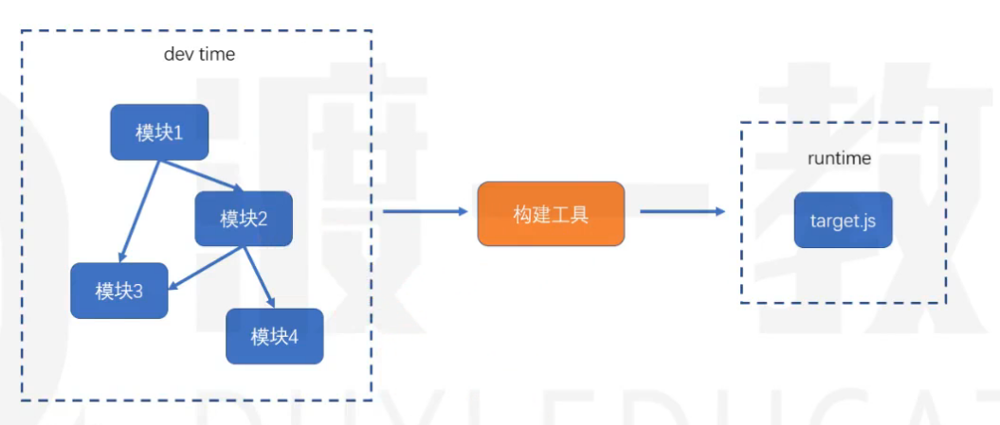

## 浏览器端的模块化

### 问题

- 效率问题：精细的模块化分带来了更多JS文件，浏览器请求更多的JS文件降低了页面的访问效率
- 兼容性问题：浏览器目前仅支持ES6的模块化标准，并且还存在兼容性问题
- 工具问题：浏览器不支持npm下载的第三方包

### 原因

在浏览器端，开发时态和运行时态的侧重点不一样

- 开发时态
    1. 模块划分越细越好
    2. 支持多种模块化标准
    3. 支持npm或其他包管理器下载的模块
    4. 能够解决其他工程化问题

- 运行时态
    1. 文件越少越好
    2. 文件体积越小越好
    3. 代码内容越乱越好
    4. 所有的浏览器都要兼容
    5. 能够解决其他运行时的问题，主要是执行效率问题


### 解决方法

> 构建工具



如上图，我们在进行开发的时候不必要关注最后的代码构建结构，这样就实现了开发时和运行时的差异化消除

常见的构建工具

- webpack
- grunt
- gulp
- browserify
- fis
- 其他


## webpack

### 安装和使用

通过npm安装两个包
    - webpack：核心包，包含了webpack构建过程中要用到的所有的api
    - webpack-cli：提供了一个简单的cli命令，通过调用api完成构建

安装方式：
    - 全局安装，可以全局使用webpack，但是无法为不同的项目使用不同的webpack版本
    - 本地安装，推荐，每个项目都可以使用自己的webpack进行构建

```shell
# 安装
npm i -D webpack webpack-cli

# 使用
npx webpack
```

默认情况下webpack会以`./src/index.js`为入口文件，打包到`./dist/bundle.js`中
通过--mode选项可以控制webpack的打包结果的运行环境


## 

